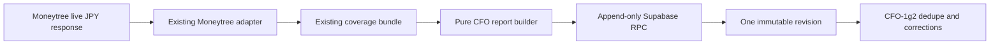

# Life Manager CFO — Immutable Daily Snapshot Design

| Field | Value |
|---|---|
| Status | APPROVED — CFO-1g ACTIVE |
| Parent | `docs/superpowers/specs/2026-08-06-life-manager-cfo-design.md` |
| Scope | One native-JPY Moneytree snapshot; append-only storage |
| Next | CFO-1g2 retry identity, corrections, and Telegram dedupe |

## 1. Goal

Persist the already-proven Moneytree MUFG read as one immutable daily CFO record. This slice does not fetch another
provider, convert currency, send Telegram, schedule a loop, or claim complete net worth. The interactive Moneytree
connector exposes a current JPY balance but not aggregation time or connected-liability coverage, so the report is
always `partial` in CFO-1g.



## 2. Truth Boundary

- `assetsMinor` is the safe-integer sum of provider-reported MUFG JPY account balances.
- `liabilitiesMinor`, `netWorthMinor`, and `changeMinor` are `null` because liability coverage and a prior immutable
  snapshot are unavailable. Unknown never becomes zero.
- The source remains `fresh` only for the connector read instant; `aggregationStatus="unknown"` remains visible in
  the stored source bundle.
- The report state is `partial` with exactly one exclusion explaining that liability coverage is unknown.
- Fleet organizational USD is not included. No USD/JPY code or quote source exists in M1.
- Only normalized opaque account/evidence references are stored. Raw Moneytree JSON, account numbers, credentials,
  cookies, provider URLs, and secrets never enter the table, logs, specs, or Telegram.

## 3. Pure Report Contract

```js
buildCfoDailyReport({
  reportingDate: "YYYY-MM-DD",
  moneytreeRead: { schemaVersion: 1, source, state }
}) => deeplyFrozenReport
```

The function revalidates `moneytreeRead` through `composeMoneytreeRead`. It accepts only:

- `sourceId="moneytree_mufg"`, `currency="JPY"`, `retrievalStatus="succeeded"`, and `consentStatus="valid"`;
- at least one account, all amounts safe integers, all statuses `provider_reported`;
- `liabilityCoverage="unknown"`, `liabilityCount=null`, and `partial=true` for the installed interactive connector.

It emits the exact existing `cfo-telegram.js` snapshot shape:

```js
{
  schemaVersion: 1,
  reportingDate,
  revision: 1,
  state: "partial",
  currency: "JPY",
  totals: {
    assetsMinor: /* exact account sum */,
    liabilitiesMinor: null,
    netWorthMinor: null,
    changeMinor: null
  },
  sources: [{
    sourceId: "moneytree_mufg",
    label: "MUFG",
    status: "fresh",
    asOf: moneytreeRead.source.asOf,
    amountMinor: /* exact account sum */,
    verificationStatus: "provider_reported"
  }],
  excluded: [{ label: "負債", reason: "Moneytreeの接続範囲が不明" }],
  repair: null,
  action: null
}
```

The builder proves its output is accepted by the existing Telegram contract. It snapshots input once, rejects
Proxy/accessor/custom-prototype/cyclic/unknown-key input through the existing closed contracts, clones, and deeply
freezes its result.

## 4. Append-Only Database Contract

Create `public.lm_cfo_daily_snapshots` with:

| Column | Contract |
|---|---|
| `id` | internal identity; never returned |
| `public_ref` | random UUID, unique |
| `uid` | tenant owner; references `lm_users(uid)` |
| `reporting_date` | owner-local date supplied by the caller; CFO-1g2 owns timezone derivation |
| `run_id` | non-zero UUID; stable retry identity |
| `revision` | `1` in CFO-1g |
| `report_payload` | exact report contract, JSON object |
| `source_bundle` | normalized Moneytree bundle, JSON object; no raw payload |
| `created_at` | database `clock_timestamp()` |

Constraints:

- unique `(uid, reporting_date, revision)` and unique `(uid, reporting_date, run_id)`;
- UPDATE and DELETE are revoked and rejected by a `BEFORE UPDATE OR DELETE` trigger;
- RLS is enabled; only `service_role` can select/insert or execute the append RPC;
- anon/authenticated/public receive no table or function access;
- no advisory lock, read-then-write client dedupe, upsert update, or mutable latest-row table.

`lm_append_cfo_daily_snapshot(text,date,uuid,jsonb,jsonb)` uses one INSERT with `ON CONFLICT DO NOTHING` and then:

1. returns the inserted row without internal `id`;
2. returns the existing row when the same run has byte-equivalent JSONB content;
3. raises `run_id_conflict` when the same run carries different content;
4. raises `reporting_date_conflict` when another run already owns revision 1 for the date.

This makes retries idempotent and concurrency-safe without granting UPDATE. CFO-1g2 adds append-only superseding
corrections; CFO-1g does not prebuild them.

## 5. Store Client

```js
appendCfoDailySnapshot({ uid, reportingDate, runId, moneytreeRead }, {
  supaUrl, supaKey, fetchImpl
}) => Promise<deeplyFrozenReceipt>
```

The client builds the report internally, sends exactly one authenticated POST to
`/rest/v1/rpc/lm_append_cfo_daily_snapshot`, and accepts only the closed receipt keys
`public_ref`, `reporting_date`, `run_id`, `revision`, and `created_at`. Errors expose only stable categories such as
`cfo_snapshot_store_failed:provider_409`; no payload, amount, UID, response body, or credential is logged.

## 6. Acceptance

1. Synthetic builder tests prove exact JPY totals, null unknowns, partial state, privacy, deep freeze, overflow
   rejection, and hostile-input rejection.
2. Migration tests prove both unique constraints, append-only trigger, RLS, grants, JSON/date/run checks, same-run
   idempotency, and conflict categories.
3. Store-client tests prove one RPC call, no direct table mutation, exact request keys, safe errors, response closure,
   and no payload logging.
4. Apply the migration through the existing Supabase Management API and reload PostgREST schema.
5. In a no-echo controller, resolve the owner UID from the existing Telegram chat binding, perform a fresh Moneytree
   read, append revision 1 twice with the same run ID, and prove both receipts share one `public_ref` and one database
   row. Output only booleans/counts and a content hash; live amounts stay in the private owner channel.
6. Focused CFO tests and full `apps/life-call` tests pass; a fresh Sol review returns clean.

## 7. File and LOC Budget

| Task | Files | Production soft target | Test soft target |
|---|---:|---:|---:|
| Report builder | 2 code + package registration | 80 LOC | 170 LOC |
| SQL contract | migration + test + package registration | 130 SQL LOC | 70 LOC |
| Store client | 2 code + package registration | 100 LOC | 180 LOC |

Each implementation task changes at most three files and closes RED → GREEN → review → commit → push before the
next. No new dependency, service, agent, scheduler, FX provider, or general repository abstraction is allowed.

## 8. Evidence Behind the Design

- PostgreSQL INSERT: https://www.postgresql.org/docs/current/sql-insert.html — “`ON CONFLICT` can be used to
  specify an alternative action” and `RETURNING` returns rows actually inserted. Decision: database uniqueness, not
  an in-memory check, owns retry idempotency.
- PostgreSQL CREATE TRIGGER: https://www.postgresql.org/docs/current/sql-createtrigger.html — `CREATE TRIGGER`
  associates a function with table operations. Decision: reject UPDATE/DELETE even if a future grant is wrong.
- PostgreSQL row security: https://www.postgresql.org/docs/current/ddl-rowsecurity.html — when enabled, normal row
  access must be allowed by policy and absent policy is default-deny. Decision: service-role-only policies plus
  explicit grants.
- Local proven pattern: `2026-07-22-panel-score-outcomes.sql` already implements append-only trigger, RLS, role
  grants, and conflict-safe immutable insert. Decision: copy and narrow that pattern.

## 9. Decision Range

- Best/base: the fresh native-JPY balance is saved once; retry returns the same receipt; unknown liabilities keep the
  report partial.
- Worst: database or connector is unavailable; no snapshot is claimed and no Telegram finance report is sent.

Rejected alternative: a local JSON file is faster, but it cannot provide multi-tenant cloud concurrency or durable
idempotency. If this design is wrong, the likeliest reason is that the production Supabase project lacks the expected
`lm_users` Telegram binding; live E2E must prove that binding without printing its identifiers.
