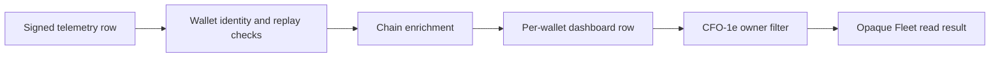
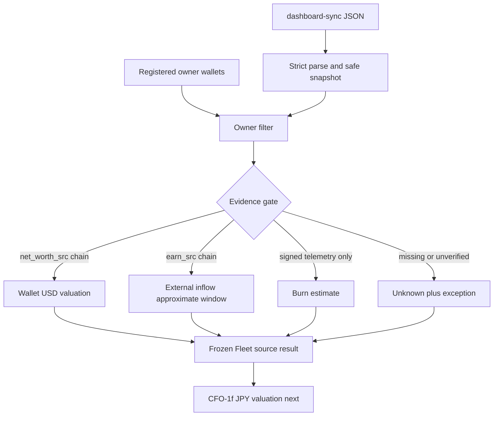

# Life Manager CFO — Fleet Read Design

| Field | Value |
|---|---|
| Status | APPROVED — CFO-1e ACTIVE |
| Parent SSOT | `docs/superpowers/specs/2026-08-06-life-manager-cfo-design.md` |
| Scope | Read-only Fleet normalization only |
| Next after closure | CFO-1f timestamped JPY valuation |

## 1. Goal

CFO-1e reads the existing Fleet dashboard once and produces one privacy-safe owner-scoped result without changing
Fleet producers or copying their ledgers. It separates three facts that the current dashboard presents together:

1. chain-observed aggregate wallet USD valuation;
2. chain-observed external stablecoin inflow over the reader's approximate block window;
3. signed self-reported daily burn estimate.

It never upgrades a signed claim into chain or provider verification, never converts missing data to zero, and never
calls the aggregate USD valuation a raw asset position.

## 2. Observed Source Truth

The smallest existing read surface is `GET /.netlify/functions/dashboard-sync`. Its path is:



- `net_worth_src="chain"` means the dashboard replaced the self-report with a chain-derived aggregate USD value.
- `earn_src="chain"` means the dashboard replaced earnings with external stablecoin inflows after excluding known
  self, Fleet, and seed senders.
- `burn_day_usd` is not chain-enriched and has no upstream provenance field. The telemetry signature proves who
  submitted it, not that the economic amount is correct.
- The current reader uses an approximate `1_200_000` block window for earnings. Its `today` and `month` names are
  not accepted as calendar-period truth.
- The dashboard does not expose raw asset quantities, block number, quote value, or quote timestamp. Those fields
  remain unknown.
- Dashboard root totals are not an acceptable adapter input because they hide missing-wallet and mixed-evidence
  coverage. CFO-1e reads the per-wallet `leaderboard` rows.

## 3. Chosen Approach

Use one pure adapter over the post-signature, post-chain-enrichment dashboard response. The caller injects the
owner's registered wallet identities; the adapter ignores every unregistered row and emits only deterministic HMAC
references.

Rejected alternatives:

- Extending Fleet upstream with raw balances, blocks, price timestamps, owner identities, and burn provenance is
  more complete but crosses multiple services and does not belong in this slice.
- Reading dashboard root totals is smaller but loses coverage and can silently mix chain evidence with estimates.
- Importing Fleet verification code into `apps/life-call` adds `ethers` and chain-client ownership to the CFO. The
  adapter instead consumes the already-enriched read boundary and revalidates its CFO-facing fields.

## 4. Closed Contracts

### 4.1 Normalized result

```js
validateFleetSourceResult({
  schemaVersion: 1,
  sourceId: "fleet_dashboard",
  ownerRef: "human:dais",
  readAsOf: "2026-08-09T12:00:00Z",
  sourceUpdatedAt: "2026-08-09T11:59:59Z",
  coverage: {
    registeredWalletCount: 3,
    presentWalletCount: 2,
    partial: true,
  },
  wallets: [{
    accountRef: "source_account:fleet_<hmac>",
    chain: "base" | "polygon" | "solana",
    telemetryAsOf: "2026-08-09T11:59:30Z",
    telemetryFreshness: "fresh" | "stale",
    walletValuation: {
      status: "available" | "unknown",
      asset: "fleet_wallet_aggregate",
      quantity: null,
      currency: "USD",
      valueUsd: number | null,
      verificationStatus: "chain_observed" | "unavailable",
      evidenceRef: "evidence:fleet_<hmac>" | null,
    },
    externalStablecoinInflows: {
      status: "available" | "unknown",
      asset: "usd_stablecoin_external_inflow",
      quantity: number | null,
      currency: "USD",
      window: "approx_1200000_blocks",
      verificationStatus: "chain_observed" | "unavailable",
      evidenceRef: "evidence:fleet_<hmac>" | null,
    },
    burnRate: {
      status: "available" | "unknown",
      amountUsdPerDay: number | null,
      verificationStatus: "signed_self_reported" | "unavailable",
      evidenceRef: "evidence:fleet_<hmac>" | null,
    },
  }],
  exceptions: [{
    accountRef: "source_account:fleet_<hmac>" | null,
    field: "wallet" | "wallet_valuation" | "external_inflows" | "burn_rate",
    reason: "missing_registered_wallet" | "chain_mismatch" | "unverified_source" | "missing_value",
  }],
  limitations: [
    "asset_positions_unavailable",
    "earnings_window_approximate",
    "burn_estimated",
  ],
})
```

The root, coverage, wallet, metric, exception, and registry objects have exact key sets. Arrays are dense. Output is
cloned and recursively frozen. Errors use fixed `fleet_source_invalid:<reason>` values and never interpolate input.

An `available` amount is a finite non-negative number and may be exactly zero. An `unknown` amount is `null`, has
`verificationStatus="unavailable"`, and has no evidence reference. `quantity=null` on the wallet aggregate is
deliberate: Fleet exposes a USD valuation, not its source asset quantities.

`coverage.partial` is always true in schema version 1 because the three declared limitations are load-bearing. It
also remains true when a registered wallet is missing or a metric is unknown. CFO-1e therefore cannot create a
complete net-worth label by itself.

### 4.2 Dashboard adapter

```js
adaptFleetDashboard({
  dashboardJson: "<connector JSON string>",
  observedAt: "2026-08-09T12:00:00Z",
  referenceKey: "<at least 32 UTF-8 bytes>",
  ownerRef: "human:dais",
  registeredWallets: [
    { walletId: "<public chain identity>", chain: "base" | "polygon" | "solana" },
  ],
}) => FleetSourceResult
```

- `registeredWallets` is the owner boundary. Unknown dashboard rows are ignored rather than attributed.
- EVM identities compare lowercase; Solana identities compare case-sensitively. Duplicate normalized identities
  fail closed.
- A registered wallet missing from the dashboard produces `missing_registered_wallet`, not a zero-valued row.
- A chain mismatch produces `chain_mismatch` and no financial metrics.
- `net_worth_src !== "chain"`, invalid/missing `net_worth_usd`, `earn_src !== "chain"`, or invalid/missing
  earnings produces an unknown metric plus an exception.
- `burn_day_usd` is available only when finite and non-negative, and is always `signed_self_reported`. It never
  enters a verified total in CFO-1e.
- `revenue_mo_usd` is labeled only as `approx_1200000_blocks`; `revenue_today_usd`, `self_funded_pct`, root totals,
  host, geo, model, status, raw wallet ID, signatures, and unknown upstream fields are not emitted.
- `sourceUpdatedAt` preserves dashboard response time; `telemetryAsOf` preserves each row's telemetry timestamp;
  `readAsOf` records this adapter read. CFO-1f owns valuation freshness, FX, and JPY conversion.

## 5. Data Flow and Boundaries



CFO-1e performs no network write, database write, ledger copy, price lookup, JPY conversion, persistence, retry,
self-heal, Telegram send, business P&L, ROI, tax, trading, funding, or Binance work.

## 6. Test and Live Acceptance

1. A synthetic post-signature/post-enrichment fixture maps one registered row to exact wallet valuation, external
   inflow, and estimated burn objects. The separate existing Fleet tests remain the authority for signature and
   chain enrichment mechanics.
2. Chain-verified zero remains zero; unverified, missing, non-finite, negative, or wrong-chain values become
   unknown/exceptions and never zero.
3. Unregistered rows are ignored. Missing registered rows remain visible in coverage. EVM and Solana identity
   comparison follows their different casing rules.
4. Output contains no wallet ID, signature, host, geo, model, raw payload, secret-shaped key, or upstream root total.
   Account/evidence references are tenant-scoped, domain-separated HMAC values.
5. Exact schemas, safe timestamps, safe numeric values, stable errors, cloning, deep freeze, custom prototypes,
   accessors, Proxy changes, sparse arrays, and unknown result keys are covered.
6. Focused tests, `npm run test:cfo`, dependency-clean full `npm test`, LOC gates, and diff check pass.
7. One live Fleet read maps registered rows into a redacted result. Closure evidence stores only booleans, counts,
   coverage status, and a result hash—never amounts, raw identities, or provider payload.

## 7. File and Size Budget

| File | Responsibility | Soft target / hard max |
|---|---|---:|
| `apps/life-call/lib/cfo-fleet-source.js` | Closed normalized result contract | 85 / 100 production LOC |
| `apps/life-call/lib/cfo-fleet-source.test.js` | Contract matrix and hostile inputs | 135 / 180 test LOC |
| `apps/life-call/lib/cfo-fleet.js` | Dashboard parsing, owner filter, evidence mapping | 95 / 110 production LOC |
| `apps/life-call/lib/cfo-fleet.test.js` | Adapter mapping, privacy, and unknown matrix | 170 / 220 test LOC |
| `apps/life-call/package.json` | Register each CFO test exactly once | +1 logical line per task |
| CFO specs and implementation plan | Evidence and state only | +30 LOC |

Each implementation task touches at most three tracked files and closes with RED, GREEN, fresh review, commit, and
push before the next task. No new dependency, service, database table, scheduler, or agent is created.

## 8. Decision Range

- Best: every registered live Fleet row has chain-observed wallet valuation and inflow; burn remains visibly
  estimated; the redacted contract is ready for CFO-1f.
- Base: some metrics or wallets are unknown; coverage is partial with exact exceptions, and CFO-1f consumes only
  available evidence.
- Worst: the live dashboard is unavailable or no registered row is present; CFO-1e emits no amount and remains
  open with redacted evidence.

Rejected strongest alternative: upstream raw-position enrichment would produce better accounting evidence, but it
would turn one read adapter into a multi-service Fleet migration and delay the truthful Moneytree-first sequence.

If this design is wrong, the most likely reason is that a hidden authoritative Fleet wallet registry or raw-position
endpoint exists outside the inspected repository. A live read must search for that evidence before closure; it must
not guess.
