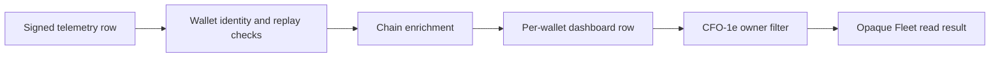
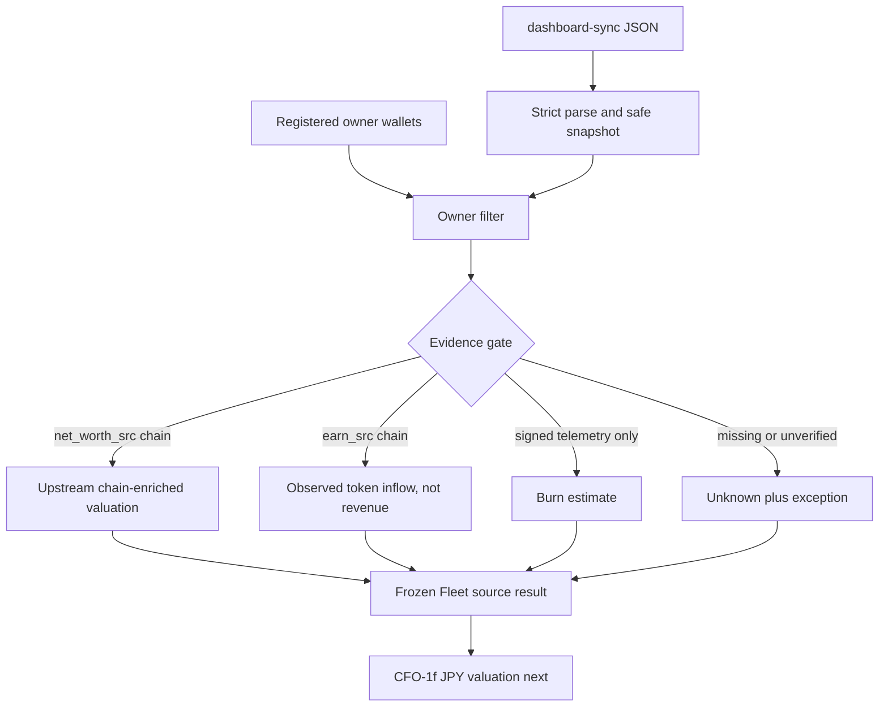

# Life Manager CFO — Fleet Read Design

| Field | Value |
|---|---|
| Status | COMPLETE — CFO-1f NEXT |
| Parent SSOT | `docs/superpowers/specs/2026-08-06-life-manager-cfo-design.md` |
| Scope | Read-only Fleet normalization only |
| Next after closure | CFO-1f timestamped JPY valuation |

## 1. Goal

CFO-1e reads the existing Fleet dashboard once and produces one privacy-safe organizational-scope result without changing
Fleet producers or copying their ledgers. It separates three facts that the current dashboard presents together:

1. upstream chain-enriched aggregate wallet USD valuation with unavailable quote provenance;
2. chain-observed nominal stablecoin token inflow over the reader's approximate block window, not recognized revenue;
3. signed self-reported daily burn estimate.

It never upgrades a signed claim into chain or provider verification, never converts missing data to zero, and never
calls the aggregate USD valuation a raw asset position.

## 2. Observed Source Truth

The smallest existing read surface is `GET /.netlify/functions/dashboard-sync`. Its path is:



- `net_worth_src="chain"` means the dashboard combined chain balances with a Coinbase spot quote. The response omits
  the quote value and quote timestamp, so CFO calls the result `upstream_chain_enriched`, not chain-observed truth.
- `earn_src="chain"` means the dashboard observed external stablecoin token transfers after excluding its known self,
  Fleet, and seed senders. The exclusion set omits at least Franklin2, token units are treated as nominal USD, and the
  result is not invoice/provider-receipt evidence. CFO calls it `chain_observed_token_inflow`, not verified earnings.
- `burn_day_usd` is not chain-enriched and has no upstream provenance field. The telemetry signature proves who
  submitted it, not that the economic amount is correct.
- The current reader uses an approximate `1_200_000` block window for inflows. Its `today` and `month` names are
  not accepted as calendar-period truth.
- The dashboard does not expose raw asset quantities, block number, quote value, or quote timestamp. Those fields
  remain unknown.
- Dashboard root totals are not an acceptable adapter input because they hide missing-wallet and mixed-evidence
  coverage. CFO-1e reads the per-wallet `leaderboard` rows.

## 3. Chosen Approach

Use one pure adapter over the post-signature, post-chain-enrichment dashboard response. The caller injects the
owner's registered wallet identities; the adapter ignores every unregistered row and emits only deterministic HMAC
references.

Rejected alternatives:

- Extending Fleet upstream with raw balances, blocks, price timestamps, owner identities, and burn provenance is
  more complete but crosses multiple services and does not belong in this slice.
- Reading dashboard root totals is smaller but loses coverage and can silently mix chain evidence with estimates.
- Importing Fleet verification code into `apps/life-call` adds `ethers` and chain-client ownership to the CFO. The
  adapter instead consumes the already-enriched read boundary and revalidates its CFO-facing fields.

## 4. Closed Contracts

### 4.1 Normalized result

```js
validateFleetSourceResult({
  schemaVersion: 1,
  sourceId: "fleet_dashboard",
  economicScopeRef: "organization:anicca_fleet",
  readAsOf: "2026-08-09T12:00:00Z",
  sourceUpdatedAt: "2026-08-09T11:59:59Z",
  coverage: {
    registeredWalletCount: 3,
    presentWalletCount: 2,
    partial: true,
  },
  wallets: [{
    accountRef: "source_account:fleet_<hmac>",
    chain: "base" | "polygon" | "polygon-proxy" | "solana",
    telemetryAsOf: "2026-08-09T11:59:30Z",
    telemetryFreshness: "fresh" | "stale",
    walletValuation: {
      status: "available" | "unknown",
      asset: "fleet_wallet_aggregate",
      quantity: null,
      currency: "USD",
      valueUsd: number | null,
      verificationStatus: "upstream_chain_enriched" | "unavailable",
      evidenceRef: "evidence:fleet_<hmac>" | null,
    },
    externalStablecoinInflows: {
      status: "available" | "unknown",
      asset: "external_stablecoin_transfer_aggregate",
      quantity: number | null,
      unit: "nominal_token_units",
      currency: null,
      window: "approx_1200000_blocks",
      verificationStatus: "chain_observed_token_inflow" | "unavailable",
      evidenceRef: "evidence:fleet_<hmac>" | null,
    },
    burnRate: {
      status: "available" | "unknown",
      amountUsdPerDay: number | null,
      currency: "USD",
      verificationStatus: "signed_self_reported" | "unavailable",
      evidenceRef: "evidence:fleet_<hmac>" | null,
    },
  }],
  exceptions: [{
    accountRef: "source_account:fleet_<hmac>",
    field: "wallet" | "wallet_valuation" | "external_inflows" | "burn_rate",
    reason: "missing_registered_wallet" | "chain_mismatch" | "unverified_source" | "missing_value",
  }],
  limitations: [
    "asset_positions_unavailable",
    "valuation_quote_provenance_unavailable",
    "inflows_not_recognized_revenue",
    "inflow_window_approximate",
    "burn_estimated",
    "economic_owner_mapping_unavailable",
  ],
})
```

The root, coverage, wallet, metric, exception, and registry objects have exact key sets. Arrays are dense. Output is
cloned and recursively frozen. `economicScopeRef` is exactly `organization:anicca_fleet`, while every
account and evidence HMAC suffix is exactly 24 lowercase hex characters. Errors use fixed
`fleet_source_invalid:<reason>` values and never interpolate input.

An `available` amount is a finite non-negative number and may be exactly zero. An `unknown` amount is `null`, has
`verificationStatus="unavailable"`, and has no evidence reference. `quantity=null` on the wallet aggregate is
deliberate: Fleet exposes a USD valuation, not its source asset quantities.

`coverage.partial` is always true in schema version 1 because the six declared limitations are load-bearing. It
also remains true when a registered wallet is missing or a metric is unknown. CFO-1e therefore cannot create a
complete net-worth label or verified-earnings label by itself.

The validator enforces `presentWalletCount === wallets.length` and
`registeredWalletCount === wallets.length + missing-or-chain-mismatch wallet exceptions`. Each absent registry
identity has exactly one wallet exception. Each unknown metric on an emitted wallet has exactly one matching field
exception, and each available metric has none.

### 4.2 Dashboard adapter

```js
adaptFleetDashboard({
  dashboardJson: "<connector JSON string>",
  observedAt: "2026-08-09T12:00:00Z",
  referenceKey: "<at least 32 UTF-8 bytes>",
  economicScopeRef: "organization:anicca_fleet",
  registeredWallets: [
    { walletId: "<public chain identity>", chain: "base" | "polygon" | "polygon-proxy" | "solana" },
  ],
}) => FleetSourceResult
```

- `registeredWallets` is the organizational Fleet boundary, not proof of personal economic ownership. Unknown
  dashboard rows are ignored rather than attributed. The result cannot enter Dais's personal net worth until a
  separate wallet-to-economic-owner mapping exists.
- EVM identities compare lowercase; Solana identities compare case-sensitively. Duplicate normalized identities
  fail closed.
- A registered wallet missing from the dashboard produces `missing_registered_wallet`, not a zero-valued row.
- A chain mismatch produces `chain_mismatch` and no financial metrics.
- `net_worth_src !== "chain"` or invalid/missing `net_worth_usd` produces an unknown valuation plus an exception.
  An available value remains `upstream_chain_enriched` because quote provenance is absent.
- `earn_src !== "chain"` or invalid/missing `revenue_mo_usd` produces an unknown inflow plus an exception. An
  available value remains `chain_observed_token_inflow`; it is never revenue or earnings in CFO-1e.
- `burn_day_usd` is available only when finite and non-negative, and is always `signed_self_reported`. It never
  enters a verified total in CFO-1e.
- `revenue_mo_usd` is labeled only as `approx_1200000_blocks`; `revenue_today_usd`, `self_funded_pct`, root totals,
  host, geo, model, status, raw wallet ID, signatures, and unknown upstream fields are not emitted.
- `sourceUpdatedAt` preserves dashboard response time; `telemetryAsOf` preserves each row's telemetry timestamp;
  `readAsOf` records this adapter read. CFO-1f owns valuation freshness, FX, and JPY conversion.
- `telemetryFreshness` is `fresh` when `sourceUpdatedAt - telemetryAsOf <= 300 seconds` and `stale` otherwise. A
  telemetry timestamp more than five seconds after `sourceUpdatedAt` fails closed.
- `sourceUpdatedAt` may be at most five seconds after `readAsOf`; a later source timestamp fails closed.
- The exported validator independently rechecks both chronology rules and requires `telemetryFreshness` to equal
  the 300-second calculation; it does not trust the adapter to make those relationships true.
- An account HMAC binds economic scope, `account`, normalized wallet identity, and registered chain. Each evidence HMAC binds
  economic scope, metric domain, normalized wallet identity, chain, telemetry timestamp, upstream source status, normalized
  numeric value, and window where applicable. It is an integrity locator for the normalized claim, not independent
  proof that the claim is economically correct.

## 5. Data Flow and Boundaries



CFO-1e performs no database write, ledger copy, price lookup, JPY conversion, persistence, Telegram send, business
P&L, ROI, tax, trading, funding, or Binance work. Live acceptance may recover the existing canonical telemetry
producer and its public identity registry; it cannot create a new producer or change financial payload semantics.

## 6. Test and Live Acceptance

1. A synthetic post-signature/post-enrichment fixture maps one registered row to exact wallet valuation, external
   inflow, and estimated burn objects. The separate existing Fleet tests remain the authority for signature and
   chain enrichment mechanics.
2. Source-gated zero remains zero; unverified, missing, non-finite, negative, or wrong-chain values become
   unknown/exceptions and never zero.
3. Unregistered rows are ignored. Missing registered rows remain visible in coverage. EVM and Solana identity
   comparison follows their different casing rules.
4. Output contains no wallet ID, signature, host, geo, model, raw payload, secret-shaped key, or upstream root total.
   Account/evidence references are tenant-scoped, domain-separated HMAC values.
5. Exact schemas, safe timestamps, safe numeric values, stable errors, cloning, deep freeze, custom prototypes,
   accessors, Proxy changes, sparse arrays, and unknown result keys are covered.
6. Focused tests, `npm run test:cfo`, dependency-clean full `npm test`, LOC gates, and diff check pass.
7. One live Fleet read maps at least one registered row into a redacted result. Any metric may honestly remain
   unknown. Closure evidence stores only booleans, counts, coverage status, and a result hash—never amounts, raw
   identities, or provider payload.

## 7. File and Size Budget

| File | Responsibility | Soft target / complexity checkpoint |
|---|---|---:|
| `apps/life-call/lib/cfo-fleet-source.js` | Closed normalized result contract | 130 / review above 160 production LOC |
| `apps/life-call/lib/cfo-fleet-source.test.js` | Contract matrix and hostile inputs | 230 / review above 300 test LOC |
| `apps/life-call/lib/cfo-fleet.js` | Dashboard parsing, scope filter, evidence mapping | 100 / review above 140 production LOC |
| `apps/life-call/lib/cfo-fleet.test.js` | Adapter mapping, privacy, and unknown matrix | 240 / review above 320 test LOC |
| `apps/life-call/package.json` | Register each CFO test exactly once | +1 logical line per task |
| CFO specs and implementation plan | Evidence and state only | +30 LOC |

Each implementation task touches at most three tracked files and closes with RED, GREEN, fresh review, commit, and
push before the next task. The closed validator stays one file because splitting its snapshot and invariant checks
would create a second trust boundary without an independent deliverable. The adapter likewise keeps parsing,
registered-scope filtering, and claim construction atomic so no unvalidated intermediary can escape; production
above its checkpoint requires review and simplification before acceptance. No new dependency, service, database
table, scheduler, or agent is created.

## 8. Decision Range

- Best: every registered live Fleet row has an upstream chain-enriched wallet valuation and a chain-observed nominal
  token inflow; neither is overstated as complete net worth or recognized revenue; burn remains visibly estimated.
- Base: some metrics or wallets are unknown; coverage is partial with exact exceptions, and CFO-1f consumes only
  available evidence.
- Worst: the live dashboard is unavailable or no registered row is present; CFO-1e emits no amount and remains
  open with redacted evidence.

Rejected strongest alternative: upstream raw-position enrichment would produce better accounting evidence, but it
would turn one read adapter into a multi-service Fleet migration and delay the truthful Moneytree-first sequence.

If this design is wrong, the most likely reason is that a hidden authoritative Fleet wallet registry or raw-position
endpoint exists outside the inspected repository. A live read must search for that evidence before closure; it must
not guess.

## 9. Live Producer Repair Amendment

Live acceptance found an empty but current dashboard. The existing `com.anicca.daemon` was restored from its
canonical template, after which the Base telemetry POST failed `host_wallet_mismatch`. Redacted diagnosis proved the
active poster resolves the legitimate default-instance legacy signer, that signer is absent from
`OUR_INSTANCE_IDS`, and the persisted display name does not match the signer's deterministic address-derived host.

The bounded repair is:

1. Luna adds the active signer's public address to `OUR_INSTANCE_IDS` while retaining former instance IDs for
   internal-transfer exclusion. No private key or raw financial payload enters the repository or report.
2. A regression proves the first canonical Base registry entry is classified `is_ours`; existing exclusions remain.
3. The old persisted name is moved to a recoverable same-directory backup, never deleted. The existing identity
   function regenerates the deterministic host from the active signer.
4. Only `com.anicca.daemon` is kickstarted. A telemetry `202` and a redacted adapter result with at least one present
   registered row are required. The backup path is the rollback.

This amendment is a repair of the one existing producer discovered by the required live E2E, not a new service or
a widening into Fleet producer redesign.

## 10. Closure Evidence

CFO-1e is complete. Commits `2b87d969e`, `1d5821e95`, and `2907ba3eb` are pushed. Focused Fleet tests passed
32/32, CFO tests 198/198, the full `apps/life-call` suite 831/831, and the bounded registry repair passed 13/13 plus
telemetry 311/311. The recoverable identity repair produced telemetry HTTP 202, a present registered live row, and
all privacy-safe adapter acceptance booleans true. The result hash is
`cd58c0f1b8aebd1dc9f0476f041ae5198cea6eea29cb51bcdf057127ad03d958`; no amount, wallet identity, or provider
payload is stored here. Fresh scoped Sol review returned `ship`. CFO-1f is next.
