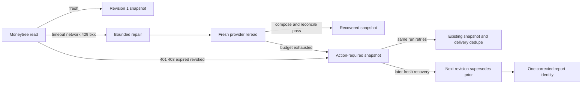

# Life Manager CFO — Bounded Moneytree Recovery and Append-Only Corrections

| Field | Value |
|---|---|
| Status | APPROVED — CFO-1g3 ACTIVE |
| Parent | `docs/superpowers/specs/2026-08-06-life-manager-cfo-design.md` |
| Goal | Repair allowed transient Moneytree failures before reporting, and append a truthful correction after later recovery |
| Next | CFO-1h2 Telegram integration, then CFO-1h real send |

## 1. Scope

CFO-1g3 adds the smallest recovery layer required before the first real finance Telegram report. It reuses the
existing owner-local daily run, immutable snapshot revisions, and Telegram delivery dedupe. It does not create a
generic incident service, queue framework, scheduler abstraction, browser agent, or new financial source.

## 2. Chosen Design

The daily snapshot is also the durable incident state:

- an unresolved failure becomes one `action_required` snapshot for the owner-local run;
- an identical retry returns that same revision, so the existing delivery ledger suppresses repeated alert spam;
- a later verified recovery appends the next revision with `supersedes_revision`; it never updates the old row;
- the corrected revision receives its own delivery key and can be sent once by CFO-1h.

Rejected alternatives:

- a dedicated incident table/service duplicates the existing run, snapshot, and delivery identities;
- a browser-healer or Steel deployment is premature until the scheduled Moneytree read path exists;
- unbounded autonomous credential refresh is unsafe and can hide revoked consent.

## 3. Bounded Recovery Contract

`recoverMoneytreeRead({ reportingDate }, { read, repair, wait })` returns one closed, deeply frozen outcome:

- `fresh`: the first read returned a valid composed Moneytree bundle;
- `recovered`: a permitted transient failure was followed by repair, a new provider read, successful
  `composeMoneytreeRead`, and successful daily-report reconciliation;
- `action_required`: the retry budget was exhausted or consent requires the owner/provider.

`read()` resolves an exact `{ok:true,moneytreeRead}` or `{ok:false,kind}` object. `repair({kind,attempt})` resolves a
boolean, and `wait(milliseconds)` resolves with no value. Success outcomes contain exactly
`status,reportingDate,moneytreeRead,attempts,repair,action`; action-required outcomes use the same keys with
`moneytreeRead:null`, `repair:null`, and `action={kind,sourceLabel,retryLabel}`. `repair` is either null or
`{sourceLabel:"Moneytree",freshReread:true,reconciled:true}`.

Rules:

- at most three provider reads total: the initial read plus two retries;
- at most two repair calls and fixed injected waits of `1000` then `5000` milliseconds;
- only `timeout`, `network`, `rate_limited`, and `provider_5xx` enter automatic repair;
- `unauthorized`, `forbidden`, `expired`, and `revoked` become `reconsent` immediately;
- schema/contract failure becomes `provider_outage`; it is never described as repaired;
- a repair callback returning success is not proof. Only a separate fresh reread plus composition and reconciliation
  may return `recovered`;
- hostile callback values/errors become stable redacted failures. No error message, stack, response body, URL,
  credential, account identifier, or amount enters the outcome or logs.

The recovery outcome keeps report completeness separate from repair status. A recovered MUFG read can still produce
a partial report because liability coverage remains unknown.

## 4. Recovery and Action Reports

The report builder consumes the closed recovery outcome:

- `fresh` uses the existing partial native-JPY report contract;
- `recovered` uses the fresh reread only, sets `repair={sourceLabel:"Moneytree",freshReread:true,reconciled:true}`,
  and never restores an old amount;
- `action_required` sets the Moneytree source to `unavailable`, all unavailable totals to `null`, excludes Moneytree
  from confirmed totals, and carries `action.kind` as `reconsent` or `provider_outage`;
- no state may claim complete net worth while liabilities remain unknown.

Telegram copy distinguishes the two actions. Re-consent asks for one connection update. Provider outage says the CFO
will retry automatically and does not blame the owner. Both suppress raw diagnostics and stale totals.

## 5. Append-Only Correction Contract

The existing snapshot table is forward-migrated without mutating old rows:

- `revision` becomes any positive integer;
- revision `1` has `supersedes_revision = null`;
- revision `N > 1` must have `supersedes_revision = N - 1` for the same owner, date, and run;
- `(uid, reporting_date, run_id, revision)` and `(uid, reporting_date, revision)` are unique;
- the predecessor must already exist and use the same `run_id`;
- identical retry returns the same public receipt; different payload/source for that identity fails closed;
- concurrent correction attempts create one row;
- UPDATE/DELETE remain forbidden;
- the existing revision-1 append RPC remains compatible.

The new client interface is
`appendCfoDailySnapshotRevision({ uid, reportingDate, runId, revision, supersedesRevision, report, sourceBundle }, opts)`.
It performs one Supabase RPC, accepts no direct table path, retries, or logs, and returns a closed frozen receipt.

## 6. Live Boundary

CFO-1g3 may apply its additive/forward migration and verify installed definitions/privileges. It must not induce a
Moneytree failure, write a synthetic personal snapshot, create a live delivery claim/receipt, or send Telegram.
Recovery behavior and concurrent correction insertion are proven in isolated PostgreSQL with redacted fixtures. The
first real recovery, correction, and provider message receipt belong to CFO-1h/CFO-1i.

## 7. Acceptance Tests

1. First read success performs one read, zero repair/wait calls, and returns `fresh`.
2. Each allowed transient class can recover only after a separate fresh reread and reconciliation.
3. The executor never exceeds three reads, two repairs, or waits `1000/5000`.
4. Re-consent classes make one read and zero repair calls.
5. Schema/contract and hostile callback failures never become `recovered` and leak no diagnostic.
6. Recovered reports use only the fresh reread and remain partial while liabilities are unknown.
7. Action-required reports contain no stale amount or complete-net-worth claim.
8. Renderer copy distinguishes `reconsent` from `provider_outage`; secrets and technical errors remain absent.
9. Revision 2 supersedes revision 1; cross-owner/date/run gaps and revision gaps fail closed.
10. Identical/concurrent correction retry yields one immutable row and one public receipt.
11. Existing revision-1 behavior and delivery FKs remain valid.
12. Live installed-definition proof passes with zero personal snapshot/delivery/Telegram writes.

## 8. Completion Boundary

CFO-1g3 closes when the bounded recovery contract, recovery/action report contract, append-only correction migration
and client, isolated real-PostgreSQL proof, live no-write installed-definition proof, full tests, and fresh Sol review
all pass. It does not claim 7/7 or a delivered finance report.
