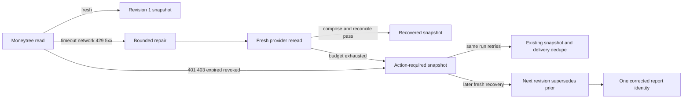

# Life Manager CFO — Bounded Moneytree Recovery and Append-Only Corrections

| Field | Value |
|---|---|
| Status | APPROVED — CFO-1g3 ACTIVE |
| Parent | `docs/superpowers/specs/2026-08-06-life-manager-cfo-design.md` |
| Goal | Repair allowed transient Moneytree failures before reporting, and append a truthful correction after later recovery |
| Next | CFO-1h2 Telegram integration, then CFO-1h real send |

## 1. Scope

CFO-1g3 adds the smallest recovery layer required before the first real finance Telegram report. It reuses the
existing owner-local daily run, immutable snapshot revisions, and Telegram delivery dedupe. It does not create a
generic incident service, queue framework, scheduler abstraction, browser agent, or new financial source.

## 2. Chosen Design

The daily snapshot is also the durable incident state:

- an unresolved failure becomes one `action_required` snapshot for the owner-local run;
- an identical retry returns that same revision, so the existing delivery ledger suppresses repeated alert spam;
- a later verified recovery appends the next revision with `supersedes_revision`; it never updates the old row;
- the corrected revision receives its own delivery key and can be sent once by CFO-1h.

Rejected alternatives:

- a dedicated incident table/service duplicates the existing run, snapshot, and delivery identities;
- a browser-healer or Steel deployment is premature until the scheduled Moneytree read path exists;
- unbounded autonomous credential refresh is unsafe and can hide revoked consent.

### Evidence behind the design

- Google Cloud Storage retry guidance — https://cloud.google.com/storage/docs/retry-strategy?hl=ja
  Core quote: “べき等なリクエストは…繰り返し実行できるため、毎回同じ最終状態になります。”
  Decision: every retry keeps the existing owner/date/run identity, and correction retry equality is checked.
- AWS SDK retry behavior — https://docs.aws.amazon.com/sdkref/latest/guide/feature-retry-behavior.html
  Core quote: “Standard mode retries failed requests using exponential backoff with jitter.”
  Decision: CFO-1g3 uses a hard retry cap and fixed injected waits; production scheduling remains outside this pure
  executor until a scheduled Moneytree credential exists.
- Kubernetes Jobs — https://kubernetes.io/docs/concepts/workloads/controllers/job/
  Core quote: “set `.spec.backoffLimit` to specify the number of retries before considering a Job as failed.”
  Decision: the initial read plus two retries is a closed budget, not a caller-controlled value.
- PostgreSQL constraints — https://www.postgresql.org/docs/current/ddl-constraints.html
  Core quote: “Unique constraints ensure that the data contained in a column, or a group of columns, is unique.”
  Decision: contiguous correction revision and predecessor linkage are database constraints, not JS convention.

## 3. Bounded Recovery Contract

`recoverMoneytreeRead({ reportingDate, observedAt }, { read, repair, wait })` returns one closed, deeply frozen outcome.
Both arguments are exact plain objects; unknown, symbol, accessor, non-enumerable, Proxy, or custom-prototype fields
fail closed before any callback:

- `fresh`: the first read returned a valid composed Moneytree bundle;
- `recovered`: a permitted transient failure was followed by repair, a new provider read, successful
  `composeMoneytreeRead`, and successful daily-report reconciliation;
- `action_required`: the retry budget was exhausted or consent requires the owner/provider.

`read()` resolves an exact `{ok:true,moneytreeRead}` or `{ok:false,kind}` object. `repair({kind,attempt})` resolves a
boolean, and `wait(milliseconds)` resolves with no value. Every callback is invoked by the executor; precomputed or
cached callback results are not accepted. Success outcomes contain exactly
`status,reportingDate,observedAt,moneytreeRead,attempts,repair,action,failureKind`; success sets `failureKind:null`.
Action-required outcomes use the same keys with `moneytreeRead:null`, `repair:null`, a closed terminal
`failureKind`, and `action={kind,sourceLabel,retryLabel,nextRetryAt}`. Direct or later consent failure keeps the
decisive `unauthorized|forbidden|expired|revoked` kind; exhausted automatic recovery keeps its first transient kind;
composition/contract failure without an earlier transient uses `provider_outage`. The action values are exact:
`sourceLabel="Moneytree"`, re-consent uses `retryLabel="Moneytreeを再接続してください"`, and provider outage uses
`retryLabel="30分後に自動再試行します"`. `repair` is either null or
`{sourceLabel:"Moneytree",freshReread:true,reconciled:true}`.

Rules:

- at most three provider reads total: the initial read plus two retries;
- at most two repair calls and fixed injected waits of `1000` then `5000` milliseconds;
- the snapshot boundary revalidates the executor history: `fresh` is exactly `reads=1,repairs=0,waits=[]`;
  every other reachable outcome has `repairs=reads-1` and the matching prefix of `[1000,5000]`; `recovered` has at
  least two reads; a `provider_outage` caused directly by composition/contract failure has
  `failureKind="provider_outage",reads=1`; transient outage outcomes have at least two reads;
- only `timeout`, `network`, `rate_limited`, and `provider_5xx` enter automatic repair;
- `unauthorized`, `forbidden`, `expired`, and `revoked` become `reconsent` immediately;
- unavailable source consent maps exactly: `unauthorized|expired` to `expired`, `forbidden|revoked` to `revoked`, and
  every `provider_outage` action to `unknown`;
- schema/contract failure becomes `provider_outage`; it is never described as repaired;
- `nextRetryAt` is exactly 30 minutes after the input `observedAt`, is RFC3339, and is persisted inside the
  action-required snapshot. This slice records the durable due time but does not install or change a scheduler;
- a repair callback returning success is not proof. Only a separate fresh reread plus composition and reconciliation
  may return `recovered`;
- hostile callback values/errors become stable redacted failures. No error message, stack, response body, URL,
  credential, account identifier, or amount enters the outcome or logs.
- every thrown error is `cfo_moneytree_recovery_failed:<fixed_code>` and the executor performs no logging.

The recovery outcome keeps report completeness separate from repair status. A recovered MUFG read can still produce
a partial report because liability coverage remains unknown.

## 4. Recovery and Action Reports

The report builder adds the exact interface
`buildCfoDailyReportFromRecovery({ revision, recovery })`, where the input has only those two keys, `revision` is a
positive safe integer, and `recovery` is revalidated rather than trusted. It returns one deeply frozen exact
`{report,sourceBundle}` object so persistence never reconstructs financial facts independently. It consumes the
closed recovery outcome:

The same module exports
`validateCfoRecoverySnapshotBundle({ report, sourceBundle })`, returning a deeply frozen clone. Both the builder and
the correction-store client call this one validator; no second report/source validation path is allowed.

- `fresh` uses the existing partial native-JPY report contract;
- `recovered` uses the fresh reread only, sets `repair={sourceLabel:"Moneytree",freshReread:true,reconciled:true}`,
  and never restores an old amount;
- `action_required` uses the required input `observedAt`, the non-financial
  `evidenceRef="evidence:moneytree_unavailable"`, an empty account list, and an unavailable Moneytree source; all
  unavailable totals are `null`, Moneytree is excluded from confirmed totals, and `action.kind` is `reconsent` or
  `provider_outage`;
- no state may claim complete net worth while liabilities remain unknown.
- the exported bundle validator rebuilds the canonical partial report from `sourceBundle` and requires exact deep
  equality after applying only `revision` and the reviewed recovered metadata; action-required reports likewise
  require the exact unavailable source, Moneytree exclusion, null totals, and action label for their action kind.
  Caller-chosen exclusion text, retry text, source status, aggregation state, or extra facts are rejected.
  A verified account total of zero remains the integer `0`, never unknown/null. At the snapshot boundary,
  `action.nextRetryAt` must represent exactly the instant 30 minutes after `observedAt`.
- public recovery-snapshot functions never rethrow a caught Error object, including an Error previously returned to
  the caller and replayed through a hostile Proxy. Every failure crossing either public boundary is a newly created
  fixed local error, so caller mutation cannot alter a later error message.

Telegram copy distinguishes the two actions. Re-consent asks for one connection update. Provider outage says the CFO
will retry automatically at the persisted `nextRetryAt` and does not blame the owner. Both suppress raw diagnostics
and stale totals. The renderer action schema is exactly `kind,sourceLabel,retryLabel,nextRetryAt`; both action kinds
are closed, and `nextRetryAt` must be RFC3339.

## 5. Append-Only Correction Contract

The existing snapshot table is forward-migrated without mutating old rows:

- `revision` becomes any positive integer;
- revision `1` has `supersedes_revision = null`;
- revision `N > 1` must have `supersedes_revision = N - 1` for the same owner, date, and run;
- `(uid, reporting_date, run_id, revision)` and `(uid, reporting_date, revision)` are unique;
- a composite self-FK `(uid, reporting_date, run_id, supersedes_revision)` references the exact predecessor identity;
- the predecessor must already exist and use the same owner, reporting date, and `run_id`;
- identical retry returns the same public receipt; different payload/source for that identity fails closed;
- concurrent correction attempts create one row;
- UPDATE/DELETE remain forbidden;
- the existing revision-1 append RPC remains compatible.

The new client interface is
`appendCfoDailySnapshotRevision({ uid, reportingDate, runId, revision, supersedesRevision, report, sourceBundle }, opts)`.
Its input keys are exact, `revision >= 2`, and `supersedesRevision === revision - 1`. It performs one Supabase RPC,
accepts no direct table path, retries, or logs, and returns a closed frozen six-key receipt:
`public_ref,reporting_date,run_id,revision,supersedes_revision,created_at`.

`appendCfoDailySnapshotRevision` receives an already-built report and source bundle so the recovery/report contract
can be tested independently from persistence. It validates the complete report/source envelopes before network and
requires the RPC receipt to echo the exact date, run, revision, and predecessor revision.

The RPC is exactly
`lm_append_cfo_daily_snapshot_revision(text,date,uuid,integer,integer,jsonb,jsonb)`. It locks the predecessor row,
inserts with `ON CONFLICT DO NOTHING`, returns an identical existing revision, and raises a fixed conflict when the
existing report/source/supersedes values differ. No revision allocator or mutable counter is added.

## 6. Live Boundary

CFO-1g3 may apply its additive/forward migration and verify installed definitions/privileges. It must not induce a
Moneytree failure, write a synthetic personal snapshot, create a live delivery claim/receipt, or send Telegram.
Recovery behavior and concurrent correction insertion are proven in isolated PostgreSQL with redacted fixtures. The
first real recovery, correction, and provider message receipt belong to CFO-1h/CFO-1i.

## 7. Acceptance Tests

1. First read success performs one read, zero repair/wait calls, and returns `fresh`.
2. Each allowed transient class can recover only after a separate fresh reread and reconciliation.
3. The executor never exceeds three reads, two repairs, or waits `1000/5000`.
4. Re-consent classes make one read and zero repair calls.
5. Schema/contract and hostile callback failures never become `recovered` and leak no diagnostic.
6. Recovered reports use only the fresh reread and remain partial while liabilities are unknown.
7. Action-required reports contain no stale amount or complete-net-worth claim and persist exact `nextRetryAt`.
8. Renderer copy distinguishes `reconsent` from `provider_outage`; secrets and technical errors remain absent.
9. Revision 2 supersedes revision 1; cross-owner/date/run gaps and revision gaps fail closed.
10. Identical/concurrent correction retry yields one immutable row and one public receipt.
11. Existing revision-1 behavior and delivery FKs remain valid.
12. Live installed-definition proof passes with zero personal snapshot/delivery/Telegram writes.
13. Exact input/options/receipt schemas reject hostile JS shapes before effects and redact hostile callback/provider
    failures.

## 8. Completion Boundary

CFO-1g3 closes when the bounded recovery contract, recovery/action report contract, append-only correction migration
and client, isolated real-PostgreSQL proof, live no-write installed-definition proof, full tests, and fresh Sol review
all pass. It does not claim 7/7 or a delivered finance report.
