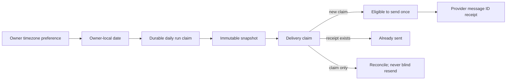

# Life Manager CFO — Reliable Daily Run and Telegram Dedupe

| Field | Value |
|---|---|
| Status | APPROVED — CFO-1g2 ACTIVE |
| Parent | `docs/superpowers/specs/2026-08-06-life-manager-cfo-design.md` |
| Goal | One owner-local daily run and one durable Telegram delivery identity |
| Next | CFO-1g3 bounded Moneytree repair and append-only corrections |

## 1. Scope

CFO-1g2 makes retries safe before the first real scheduled Telegram report. It does only two things:

1. atomically resolves the owner's IANA timezone, derives the owner-local `reporting_date`, and durably claims one
   `run_id` inside PostgreSQL;
2. claims one Telegram delivery per snapshot revision and records the real provider `message_id` without resending an
   uncertain delivery.

It does not read Moneytree, change a snapshot, render text, send Telegram, schedule a loop, or repair a provider.
Corrections move to CFO-1g3 because only a fresh recovery read can truthfully create them.

## 2. Owner-local run contract

- Timezone SSOT is `lm_panel_preferences.call_time_zone`; the claim RPC locks/reads it and verifies membership in
  `pg_timezone_names`. Missing or invalid zones fail closed without inserting a row.
- PostgreSQL derives `YYYY-MM-DD` from its current transaction time in that timezone. There is no client GET→claim
  race and no manual UTC offset arithmetic.
- `lm_cfo_daily_runs` has one immutable row per `(uid, reporting_date)` and a database-generated non-zero UUID.
- A private SQL date helper accepts `(time_zone, instant)` for deterministic DST tests; EXECUTE is revoked from all
  application roles. The public claim RPC always supplies `statement_timestamp()` and exposes no clock override.
- `lm_claim_cfo_daily_run(uid)` returns the current owner-local date's existing row on retry. If the preference
  changes after a claim, the next invocation derives the date from the new preference.
- The migration first requires every existing snapshot owner to have a valid current timezone preference. It
  backfills the exact `(uid, reporting_date, run_id)` and records `time_zone_source="migration_preference"`; this is
  explicitly migration-time provenance, not a claim about the timezone used when the old snapshot was created. New
  claims use `time_zone_source="owner_preference"`. Missing/invalid preferences abort the whole migration. The
  migration then adds a composite foreign key from snapshots to runs, so a snapshot cannot invent another run ID.
- The receipt contains exactly `public_ref, reporting_date, run_id, time_zone, created_at`; never UID.
- The client makes exactly one claim RPC. It has no internal retry, preference read, or scheduler.

## 3. Telegram delivery contract

Two append-only tables avoid an ambiguous mutable outbox:

- `lm_cfo_telegram_delivery_claims`: one immutable claim for
  `(uid, report_kind, reporting_date, revision)` linked to the exact snapshot;
- `lm_cfo_telegram_delivery_receipts`: one immutable provider receipt per claim.

The claim RPC returns:

- `send` only when this call inserted the claim;
- `sent` when a provider receipt already exists;
- `reconcile` when a prior claim exists without a receipt. `reconcile` must never resend blindly.

The receipt RPC accepts the claim `public_ref` and a positive Telegram `message_id`. Exact retry returns the same
receipt; a different ID is `provider_receipt_conflict`. Neither table stores message text, chat ID, account data,
balance, source payload, token, or a brute-forceable hash of the financial payload.

## 4. Database and tenant boundary

- Both tables enable RLS, deny `PUBLIC`, `anon`, and `authenticated`, and are service-role only.
- Snapshot linkage is a composite foreign key over `public_ref, uid, reporting_date, revision`; direct mismatches fail.
- UPDATE and DELETE are revoked and rejected by triggers. Claims and receipts are append-only.
- RPCs are `SECURITY INVOKER` with `search_path = public, pg_temp`; grants are signature-specific.
- Concurrency proof observes a real database lock/conflict boundary and proves one claim/receipt row.

## 5. Failure behavior

| Failure point | Result |
|---|---|
| Preference read or timezone invalid | No run claim; stable redacted error |
| Same daily-run retry | Same run receipt |
| Delivery claimed, send not started | Later call returns `reconcile`, a durable delivery-unknown blocker |
| Telegram accepted, receipt append succeeds | Later call returns `sent`; no resend |
| Telegram accepted, receipt outcome unknown | `reconcile`; never claim success or resend blindly |
| Different message ID for same claim | Conflict; existing receipt remains authoritative |

## 6. Acceptance

1. DST/date-boundary fixtures call only the revoked SQL helper with fixed instants. The production RPC uses database
   time; invalid/missing zones and a concurrent preference change fail closed or use one transactionally observed
   zone.
2. Existing snapshot run IDs are preserved by backfill/FK; concurrent daily-run claims return one run and one row.
3. Concurrent delivery claims yield exactly one `send`; all others are `reconcile` until a receipt exists.
4. Receipt retry is idempotent; a different provider ID conflicts.
5. Cross-owner/date/revision snapshot linkage and direct invalid inserts fail.
6. UPDATE/DELETE, anon/authenticated access, unknown keys, Proxy/accessor input, and secret/error leakage fail closed.
7. Migrations are applied live; the existing live snapshot and claimed run have the same run ID. No live delivery
   claim or receipt is created before the first real Telegram send.
8. Focused, CFO, isolated PostgreSQL, and full Life Manager tests pass; fresh Sol review returns clean.

Before CFO-1h may send, its plan must include a redacted delivery-unknown detector and an operator reconciliation
path that verifies provider/chat state before recording a receipt or authorizing a replacement. Telegram has no
client idempotency key for `sendMessage`; blind resend remains forbidden.

## 7. Size boundary

| Slice | Files | Soft target |
|---|---:|---:|
| Daily-run SQL | 3 | migration 120 LOC; test 100 LOC |
| Run-context client | 3 | production 100 LOC; test 180 LOC |
| Delivery SQL | 3 | migration 180 LOC; test 120 LOC |
| Real PostgreSQL proof | 2 | test 240 LOC |
| Delivery client | 3 | production 130 LOC; test 200 LOC |

No generic job framework, queue service, scheduler abstraction, mutable snapshot, Telegram SDK, or new dependency.

## 8. Evidence

- Telegram Bot API, `sendMessage`: https://core.telegram.org/bots/api#sendmessage — on success Telegram returns the
  sent `Message`; the durable receipt therefore records its real `message_id`.
- PostgreSQL row locks: https://www.postgresql.org/docs/current/explicit-locking.html#LOCKING-ROWS — conflicting row
  writers/lockers wait, which is the database-owned concurrency boundary used in integration tests.
- PostgreSQL foreign keys: https://www.postgresql.org/docs/current/ddl-constraints.html#DDL-CONSTRAINTS-FK — composite
  referential integrity binds a delivery claim to the exact owner/date/revision snapshot.
- Local timezone proof: `apps/life-call/lib/panel-api.js` (`configuredTimeZone`, `dateKey`).
- Local claim-before-effect proof: `apps/life-call/lib/ask.js` (`claimAsk`, failed-send release).
- Current Telegram transport: `apps/life-call/lib/telegram.js` returns Bot API JSON, but callers do not persist
  `result.message_id`; CFO-1g2 closes that gap.
