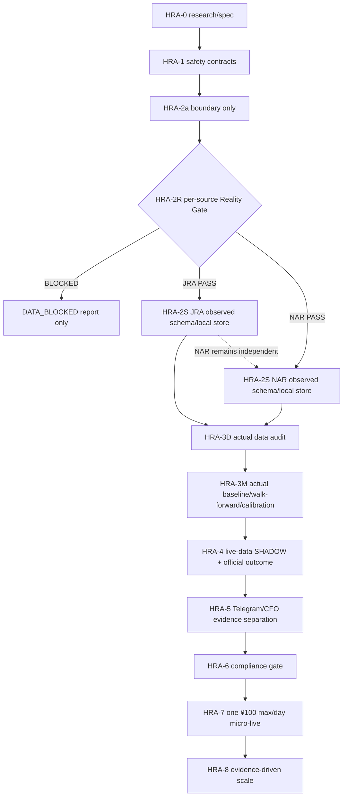
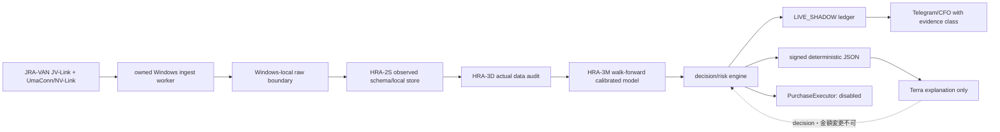
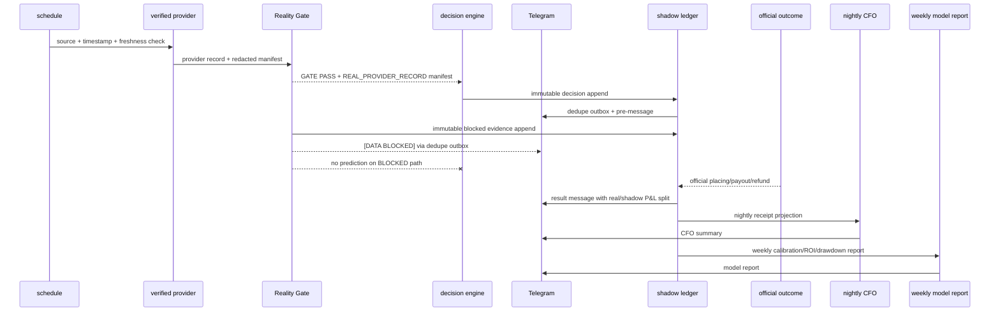

# Life Manager 競馬AI financial organ 設計仕様

## Status、truth、責務

| 項目 | 契約 |
|---|---|
| Status | **REALITY GATE REQUIRED — LIVE PURCHASE DISABLED** |
| 対象 | Life Manager financial organ の第8候補 `business_id: horse_racing` |
| 現在のactive stage | HRA-2R Reality Gate。HRA-0、HRA-1、HRA-2aは完了、HRA-2Rは未通過 |
| registry v2 candidate | `candidate_ordinal=8`、`business_id=horse_racing`、`depends_on=CFO-0c exact-seven`。CFO SSOTのexact-seven完了後に接続する |
| manager / 計画 / gate / 検証 | Sol |
| 全実装・編集slice | Luna |
| 購入処理 | `PurchaseExecutor`は常時disabled。HRA-6のcompliance gateなしに有効化しない |

この文書は競馬AIのReality Gate、実装順、受入条件、truth labelの正本である。既存CFO specとexact-sevenのregistryは変更しない。`horse_racing`はCFO-0c完了後のregistry v2で候補として扱うだけであり、現在のrevenue businessとして承認されたことを意味しない。

### 現在のevidence table

| Evidence | 実測値 |
|---|---:|
| official provider sessions | 0 |
| real JRA records | 0 |
| real NAR records | 0 |
| real historical backtests | 0 |
| live Telegram runs | 0 |
| live orders/payments | 0 |

現在のcommitted codeが証明するのは、registry dependency、purchase-disabled safety、licensed source/local boundaryだけである。provider connectivity、data accuracy、model accuracy、ROI、Telegram live delivery、CFO revenue、収益は証明していない。HRA-2bのsynthetic store、fixture、testは現在uncommittedでquarantineされており、実provider recordを観測したschemaへ派生しない限りcompletion evidenceとして受け入れない。

### Evidence classes

すべてのreceipt、Telegram、CFO projection、model reportに次のいずれかを明記する。

- `SYNTHETIC_TEST`: 人工fixtureでpure mechanicsだけを検証した証拠。
- `REAL_PROVIDER_RECORD`: owned Windowsでofficial/licensed providerから取得した実recordのredacted manifest。
- `LIVE_SHADOW`: 実provider dataと実時点のdecisionを使ったが、注文・決済を行わない証拠。
- `LIVE_CASH`: HRA-6以降のcompliance gateを通ったofficial settled receipt証拠。

`SYNTHETIC_TEST`はprovider connectivity、data accuracy、model accuracy、historical backtest、live Telegram、CFO revenue、completion gateを満たさない。`LIVE_SHADOW`の推定EV、payout、ROIはreal revenueにしない。`LIVE_CASH`だけがofficial settled payoutとreal P&Lを作る。raw licensed rowsはowned Windows外へ出さず、Git、Telegram、cloud、CFOへ送るのはredacted evidence manifestだけにする。

下流stageは、source、jurisdiction、provider/acquisition timestamp、adapter/upstream version、row count、schema field names/types、content hash、evidence manifest path、probe commandのexit evidenceが揃わない限りPASSを名乗らない。欠落、unknown、provider未接続は`BLOCKED`と表示し、synthetic値で埋めない。

Solはmanager、計画、gate、検証だけを担う。Lunaはコード、fixture、adapter、test、docsのimplementation sliceを担う。SolがLunaのコードを代行せず、LunaがReality Gateを自己承認しない。

## 1. 目的とHard non-goals

### 目的

official/licensed JRA+NAR dataをowned Windowsで観測し、sourceごとのReality Gateを通過させる。通過後に限り、観測schemaからlocal store、actual chronological data audit、market baseline、walk-forward calibrated model、実時点SHADOW、official outcome reconciliation、Telegram/CFO separationへ進む。全対象raceのSHADOW/SKIPを追跡し、champion/challengerを実データのlater windowで評価する。

### Hard non-goals

- browser automation、Selenium、DOMクリック、非公式注文API、provider固有の未許可注文codeを使わない。
- 現時点で実注文・実決済・wallet/bank mutationを実装または有効化しない。
- licensed raw data、実馬名を含むprovider row、credential、subscription identifier、購入receiptをGit、Telegram、cloud、issue、ログ、外部APIへ再配布しない。
- 収益、勝率、ROI、月¥1.5M利益を保証しない。
- 負EVのcash bet、martingale、loss chasing、固定ルールのstake自動増額を強制しない。
- netkeiba等のscrapingをofficial/licensed sourceの代替にしない。
- Terraにdecision、probability、odds、EV、stake、action、capを決めさせない。Terraは署名済みdeterministic JSONから説明だけを生成する。

## 2. Reality-Gate-first architecture

### Gateで下流を止めるflow



Reality Gateを通過していないsourceのschema、model、backtest、Telegram prediction、CFO revenueは存在しない。JRAがPASSしてもNARは自動PASSしない。NARがBLOCKEDでも、証拠が揃ったJRA laneだけを進め、sourceを混同しない。

### Data pipeline（Gate通過後のみ）



`HRA-2a`はboundary onlyでありconnectorではない。provider accessはHRA-2Rのowned Windows probeだけが行う。raw DBはWindows内に留まり、外部へ送るのはhashとredacted manifestだけである。

## 3. Committed proofとReality Gate

### Committed proof

| commit | 証明する範囲 | 証明しない範囲 |
|---|---|---|
| `d743b153` | registry v2 dependency、`horse_racing` candidate、CFO-0c block | CFO-0c完了、provider data、revenue |
| `89d48910` | 任意のLIVE requestがblocked、PurchaseExecutorのside-effect 0 | provider ordering、cash receipt |
| `0fe627cd` | official marker、Windows/local boundary、hash/metadataのみのpure ingest boundary | provider connectivity、実record、data accuracy |

HRA-2bのsynthetic-only `store.py`、fixture、testはuncommitted quarantineである。これはSYNTHETIC_TESTのmechanicsを示すだけで、実provider schemaやsource qualityの証拠ではない。HRA-2Sのcompletionは、HRA-2Rで観測した実recordのfield names/typesとevidence manifestからschemaを再生成し、現synthetic fixtureを置換した後に判定する。

### HRA-2R Reality Gate（sourceごと）

#### JRA lane

1. owned Windowsを用意し、JRA-VAN Data Lab/JV-Linkがinstalledであることをinventoryする。
2. valid service keyとJRA-VAN利用条件を確認する。credential値はmanifest、Git、Telegramへ書かない。
3. pinned [`miyamamoto/jrvltsql`](https://github.com/miyamamoto/jrvltsql)のcommitを確認する。NAR codeをJRA laneへ混ぜない。
4. official/upstream documentationに記載されたprobe commandをowned Windowsで実行する。command、exit code、provider/adaptor version、timestampをmanifestへ記録する。
5. local Windows内で`>=1` real JRA recordを観測する。raw rowは保存範囲をWindows内に限定し、Telegram/cloudへ出さない。

#### NAR lane

1. owned Windowsを用意し、official/licensed UmaConn/NV-Linkがinstalledであることをinventoryする。
2. valid entitlementとNAR利用条件を確認する。credential値はmanifest、Git、Telegramへ書かない。
3. official sampleまたは限定されたlicensed bridgeをNAR laneだけで実行する。JRA-VAN rowや非公式注文APIを混ぜない。
4. official/upstream documentationに記載されたprobe commandをowned Windowsで実行する。command、exit code、provider/adaptor version、timestampをmanifestへ記録する。
5. local Windows内で`>=1` real NAR recordを観測する。raw rowは保存範囲をWindows内に限定し、Telegram/cloudへ出さない。

#### Redacted evidence manifest

sourceごとに次のmanifestだけをcommit可能にする。

```yaml
evidence_class: REAL_PROVIDER_RECORD
source: JRA-VAN JV-Link or UmaConn/NV-Link
jurisdiction: JRA or NAR
acquisition_timestamp: observed provider timestamp
provider_timestamp: observed provider timestamp or explicit unavailable
adapter_version: pinned source/adapter commit
upstream_version: installed upstream version
row_count: integer >= 1
schema_fields:
  - name: field name only
    type: normalized type only
content_hash: sha256 of Windows-local raw evidence
probe_command_exit: 0
raw_values_exported: false
```

`observed provider timestamp`等が実測不能、row_countが0、exit codeが0でない、hashがない、またはcredential/raw valueが混入した場合はそのsourceを`BLOCKED`とする。未接続をsynthetic recordで補完しない。

## 4. Data、model、riskの契約（実データGate後）

### HRA-2S observed schema

HRA-2SはHRA-2RのmanifestとWindows-local observed recordからのみschemaを定義する。schema_version、race_id、source、jurisdiction、race/snapshot/cutoff timestamp、freshness status/age、runner opaque id、odds、track condition等は実recordに存在したfieldだけを採用する。synthetic-only field、実馬名、provider raw row、credential、subscription id、購入receiptをschema根拠にしない。storeはlocal append-onlyで、record/event duplicate、overwrite、caller alias mutationを拒否する。

### HRA-3D data audit

実historical datasetがない状態ではbacktestを実行しない。HRA-3Dはsource別にrow coverage、欠損、timestamp order、cutoff leakage、duplicate race、odds snapshot freshness、JRA/NAR jurisdiction混同を監査する。auditはprovider timestamp、source、adapter/upstream version、row count、content hash、command exit evidenceを持つ。audit evidenceがないmodel metricは`SYNTHETIC_TEST`であり、実績ではない。

### HRA-3M model contract

- market implied probabilityをbaselineにする。
- 実chronological dataのwin/placeだけを初期対象にし、LightGBMまたはXGBoostを固定して比較する。
- decision cutoffより後のfeatureを禁止する。random splitを禁止し、time-series walk-forwardを使う。
- T-5分等の固定snapshotを使い、後刻oddsでdecisionを上書きしない。
- odds slippage stressを行い、Brier score、logloss、ECEを必須にする。accuracyだけで昇格させない。
- `EV = p * odds - 1`を基礎にし、calibration uncertaintyとslippageを含むconfidence-adjusted lower boundを使う。
- cash sizingはHRA-6後の文書契約に限り、`min(one_quarter_Kelly, micro_cap)`を超えない。

### No-betとSHADOW

負EVのcashを強制しない。一方、実provider dataがある全eligible raceについてSHADOWまたはSKIP decisionを生成する。SKIPでもbest candidate、threshold gap、reason、evidence class、data freshness、decision_idを記録する。`SYNTHETIC_TEST`だけのraceはpredictionではなくmechanics testとして表示し、実績へ合算しない。

## 5. Telegram ideal UI/UX

### Sequence



decision/blocked evidenceを先にimmutableに保存し、Telegram delivery失敗でも判断記録を失わない。deliveryはdedupe outboxとする。

### Cadenceとtruth label

- 朝のdigestを送る。
- pre-raceはhigh-value alertまたはblocked alertだけを個別送信する。
- SKIPはbundleする。
- acted candidateはofficial resultごとに送る。
- nightly reportでofficial settled receipts、real P&L、shadow P&Lを分離する。
- weekly model reportでcalibration、later-window ROI、drawdown、coverage、evidence classを分離する。

メッセージ先頭には正確に`Life Manager::: 競馬AI`を置き、その直後にtruth labelを置く。

- `[DATA BLOCKED]`: provider/session/manifest/quality gateが欠けており、predictionを出さない。
- `[REAL DATA · SHADOW]`: REAL_PROVIDER_RECORDでdecisionしたが注文していない。
- `[LIVE · ¥100]`: HRA-6完了後のHRA-7で、official settled receipt gateを通った場合だけ許可する。

全messageはsource/provider timestamp、evidence class、odds snapshot、model version、decision id、action/reason、`real P&L`、`shadow P&L`を表示する。synthetic/shadow valueをreal revenueへ合算しない。通常flowでユーザーreplyは要求しない。buttonsは`詳しい根拠`、`全レース`、`モデル履歴`、`CFO収支`のdrill-downだけにする。

### 事前schema

```text
Life Manager::: 競馬AI
[DATA BLOCKED|REAL DATA · SHADOW|LIVE · ¥100]
日時: <ISO-8601 JST>
source: <JRA-VAN JV-Link|UmaConn/NV-Link>
jurisdiction: <JRA|NAR>
provider_timestamp: <timestamp or unavailable>
evidence_class: <SYNTHETIC_TEST|REAL_PROVIDER_RECORD|LIVE_SHADOW|LIVE_CASH>
venue: <safe identifier>
race: <race number>
start: <start time>
action: <LIVE|SHADOW|SKIP>
reason: <action reason>
bet: <bet type or NONE>
horse: <opaque runner id or NONE>
stake: <yen or 0>
p: <model probability or null>
odds_snapshot: <snapshot timestamp/hash or null>
implied_p: <market implied probability or null>
EV_lower: <confidence-adjusted lower bound or null>
top3_factors: <three deterministic factor names or null>
cap: <risk/cash cap or 0>
decision_id: <immutable id>
model: <model/calibrator version or null>
data_freshness: <freshness status and age or null>
real_P&L: <official settled value or null>
shadow_P&L: <shadow value or null>
```

### 結果schema

```text
Life Manager::: 競馬AI
[REAL DATA · SHADOW|LIVE · ¥100]
日時: <ISO-8601 JST>
source: <source>
jurisdiction: <JRA|NAR>
provider_timestamp: <timestamp>
evidence_class: <REAL_PROVIDER_RECORD|LIVE_SHADOW|LIVE_CASH>
official_placing: <official placing or null>
payout: <official settled payout or null>
refund: <official refund or null>
real_P&L: <official settled P&L or null>
shadow_P&L: <shadow P&L or null>
cumulative_realized_P&L: <official settled cumulative value or null>
drawdown: <realized drawdown or null>
official_receipt_status: <verified|pending|void|refund|unavailable>
model: <model/calibrator version or null>
decision_id: <immutable id>
learning_action: <append outcome|retrain window|champion/challenger result|blocked reason>
```

## 6. CFO、ledger、economics

### CFO contract

- `business_id`は`horse_racing`、payout channelは`jra_payout`と`nar_payout`を使う。
- ledger名は`horse_racing_bet_receipts`。raw licensed rowsは入れず、receipt summary、content hash、evidence classだけを保持する。
- event typeは`bet_intent`、`wager_placed`、`settlement`、`refund`、`data_subscription`、`compute_cost`、`tax_evidence`に固定する。
- bank transferはinternal settlementであり、payout revenueとの二重計上を禁止する。
- `SYNTHETIC_TEST`、estimated EV、`LIVE_SHADOW`の未settled値はrevenue 0。unknownを0へ変換しない。
- real P&Lは`LIVE_CASH`のofficial settled receiptだけで確定する。税務証憑は公式receipt summary、費用、日付、source、receipt hashを保存し、taxはoperating profitと別に追跡する。
- TelegramとCFOは必ずevidence class、real P&L、shadow P&Lを分離表示する。

### $10K/month economics

目標はおおむね¥1.5M/月のnet operating profitであり、定義は次である。

```text
net operating profit
= official settled payouts
- official settled stakes
- data subscriptions
- compute/provider/transaction costs
```

taxは別に追跡する。必要turnoverのcapacity mathは次の通りである。

| net ROI | 月¥1.5M profitに必要なturnover |
|---:|---:|
| 3% | ¥50M |
| 5% | ¥30M |
| 10% | ¥15M |
| 20% | ¥7.5M |

¥100/dayをnet ROI 10%で回しても¥300/月、¥500/dayでも¥1,500/月である。この目標はaspiration/capacity testでありforecastではない。live receipt evidence、slippage/capacity、calibration、drawdownが必要turnoverを支持しない場合の正直な結論は`¥1.5M target not supported`であり、強制scalingではない。

scaling gateはofficial receipts、realized net ROI、confidence interval/later-window evidence、max drawdown、calibration、reconciliation、market capacityを必須にする。fixed automatic stake escalationとmartingaleを禁止する。

### Reuse matrixとreject境界

| Repository / family | License・対象 | 扱い |
|---|---|---|
| [`miyamamoto/jrvltsql`](https://github.com/miyamamoto/jrvltsql) | Apache-2.0。JRA-VAN/JRA ingestの参考。NARには対応しない | JRA laneのpinned upstreamとして、公式利用条件と実record evidenceを満たす範囲で再利用候補にする。NAR laneへ流用しない |
| [`miyamamoto/nvlink-bridge`](https://github.com/miyamamoto/nvlink-bridge) | MIT。NAR bridgeの参考。限定testだけ | NAR laneのbridge境界と限定testの参考にする。provider permission、entitlement、実recordを代替しない |
| [`takumiito271/jra-horse-racing-prediction`](https://github.com/takumiito271/jra-horse-racing-prediction) | MIT。modeling concepts | walk-forward、calibration、quarter-Kelly、baseline比較などの概念だけを選択再利用する。provider raw row、注文、収益結果を根拠にしない |
| [`takepan/jrvltsql`](https://github.com/takepan/jrvltsql) | READMEとLICENSEのcommercial conditionが衝突 | 書面確認が完了するまでcode reuseを禁止する。確認前はconcept/referenceとしても実装へ取り込まない |
| netkeiba scraping repos、HRT_Buyer/Selenium、AGPL turf-tipster | scraping、browser/DOM注文、またはこの計画のlicense境界と不整合 | reject。公式/licensed source、supported API、receipt/reconciliation、raw-data境界を同時に満たさないため採用しない |

このmatrixはsource接続、model概念、注文境界を混同しないための再利用SSOTである。license確認ができないコード、未許可のscraping、browser automation、AGPLコードの取り込みでReality Gateを短絡しない。

## 7. Stage gates

| Stage | 内容 | 状態 |
|---|---|---|
| HRA-0 | research/spec、一次資料、license boundary、acceptance | **complete** |
| HRA-1 | registry dependency、purchase-disabled safety | **complete**。`d743b153`、`89d48910` |
| HRA-2a | source/local boundary | **complete**。`0fe627cd`。boundary only、connectorではない |
| HRA-2R | sourceごとのReality Gate、JRA/NAR各1 real record、redacted manifest | **ACTIVE**。現在のevidenceは両source 0 record |
| HRA-2S | verified manifestからobserved schema/local append-only store | **BLOCKED**。該当sourceのHRA-2R PASSまで受け入れない |
| HRA-3D | actual historical data quality、coverage、cutoff audit | **BLOCKED**。実historical dataset 0 |
| HRA-3M | actual market baseline、walk-forward、calibration、backtest | **BLOCKED**。real historical backtest 0 |
| HRA-4 | live-data SHADOW、official outcome reconciliation | **BLOCKED**。live shadow run 0 |
| HRA-5 | Telegram + CFO real/shadow separation | **BLOCKED**。live Telegram run 0 |
| HRA-6 | written provider permissionまたはofficial supported ordering API、tax、credential、cap、reconciliation gate | **BLOCKED** |
| HRA-7 | HRA-6後のowner-local-day one ¥100 max micro-live | **BLOCKED。文書契約のみ** |
| HRA-8 | evidence-driven scale | **BLOCKED** |

### HRA-7 document policy

HRA-6の全receipt、written permission/official API evidence、tax review、credential separation、cap、reconciliationが揃うまで実装しない。通過後もowner-local-dayの総額¥100以下、positive confidence-adjusted EV、stale/Telegram pre-message/reconciliation failureのfail-closed、公式投票照会receipt、martingale/chasing禁止を必須にする。DOM successはreceiptにしない。

## 8. Best / Base / Worstと反証

| ケース | 想定 | 判断 |
|---|---|---|
| Best | JRAまたはNARのsourceがReality Gateを通過し、actual data audit、calibration、later-window ROI、drawdown、receipt reconciliationが継続PASS | source laneごとにSHADOWを進め、HRA-6証憑が揃った場合だけcash gateを審査する |
| Base | provider entitlementまたはhistorical coverageが不足し、real recordsが取れない | `DATA BLOCKED`を出し、syntheticを実績へ混ぜず、purchaseをdisabledに保つ |
| Worst | license境界、source stability、timestamp、odds slippage、Telegram/CFO reconciliationが壊れる | fail-closedし、raw dataを外へ出さず、revenue 0のまま停止する |

棄却案の最強の論拠は、scraping、Selenium、非公式注文APIはofficial permission、receipt、再現性、障害時fail-closedを同時に証明できず、データ漏洩と誤決済の損失がmodel改善益を上回ることである。

この仕様が間違う最有力の筋は、未発見の公式または書面許可済みintegrationが、supported ordering APIとreceipt/reconciliation契約を提供していることである。その場合もHRA-2Rでsource evidence、HRA-6で書面・tax・credential evidenceを確認するまでは状態を変えない。

## 9. Acceptance criteriaとE2E judgment

| 契約 | 検証 | 合格条件 |
|---|---|---|
| Reality evidence | sourceごとのWindows probe | provider timestamp、source、adapter/upstream version、row count>=1、schema names/types、content hash、manifest、exit evidenceが全て揃う |
| evidence truth | Telegram/CFO payload scan | 4 evidence classesのいずれかを表示し、synthetic/shadowをreal revenueへ合算しない |
| raw boundary | Windows-local path、manifest、Git/Telegram/cloud scan | raw licensed row、secret、credential、実馬名がWindows外へ0件 |
| schema derivation | observed manifestとschema diff | HRA-2R PASS前のsynthetic storeをcompletionにしない |
| replay determinism | canonical record replay | 同一semantic recordのcontent hashが一致する |
| append-only | duplicate/overwrite/alias/stale tests | duplicate reject、保存後caller mutation無効、stale status保持 |
| actual backtest | HRA-3D/3M actual chronological data | provider evidence、coverage、cutoff audit、Brier/logloss/ECE、slippage、later-window evidenceがある |
| all-race shadow | HRA-4 actual source lane | eligible raceにSHADOW/SKIP、blocked laneはpredictionを出さない |
| official reconciliation | outcome receipt | placing/payout/refund/voidをdecisionと分離し、official settled receiptだけreal P&L |
| CFO double-count | JRA/NAR payout + bank internal settlement | receipt idempotencyと二重revenue 0 |
| purchase safety | disabled executor | credential/network/DOM/wallet/bank side effect 0 |
| live impossibility | HRA-6 evidence欠落状態 | `LIVE_CASH`をfail-closed、blocked evidenceを出す |

| Item | Value |
|---|---|
| UI変更 | Telegram message UX contractのみ。iOS UI変更なし |
| 結論 | Maestro: 不要（iOS UIを変更しない）。Reality Gate後のTelegram/CFOは実provider E2E evidenceが必要 |

## 10. Sources（一次資料・引用）

引用は短い原文だけを保持する。契約・税務の最終判断はproviderの書面、公式規約、税務専門家のreviewを優先する。

1. [JRA A-PAT 約定・利用規約](https://www.jra.go.jp/dento/a/pdf/yakujo_apat.pdf) — 「加入者本人以外の者に…申込みをさせる行為」「他人からの委託により…申込みをする行為」。本人以外への申込み委託を許可前提に扱わない根拠。
2. [JRA-VAN 利用規約](https://jra-van.jp/info/rule.html) — 「JV-Link以外からJRA-VAN Data Lab.サーバにアクセスする行為」。取得情報の私的使用制限もあるため、raw licensed dataをWindows外へ出さない。
3. [JV-LinkにIPAT投票APIが存在しない旨の公式開発者フォーラム](https://developer.jra-van.jp/t/topic/747) — 「IPAT投票に関するメソッドはJV-Linkには存在しません」。JV-Linkを注文APIとして扱わない根拠。
4. [JV-Link公式SDK案内](https://developer.jra-van.jp/t/topic/45) — official SDKの入口。実probeはinstalled official/upstream documentationを根拠にする。
5. [NAR公式投票案内](https://www.keiba.go.jp/vote.html) — NARの公式投票導線。JRA-VANとNARを別source・別権限として扱う根拠。
6. [楽天競馬利用規約](https://keiba.rakuten.co.jp/guide/term) — 「第三者に行わせ…できない」「１００円の整数倍」。第三者委託やstake単位を注文許可と誤読しない根拠。
7. [NAR商用利用FAQ](https://www.keiba.go.jp/qa.html) — 「一切の掲載情報について、商用利用及び改変しての転載を禁じております。」。書面確認前の再配布・商用reuseを許可しない。
8. [国税庁 No.1490 一時所得](https://www.nta.go.jp/taxes/shiraberu/taxanswer/shotoku/1490.htm) — 「競馬や競輪の払戻金（営利を目的とする継続的行為から生じたものを除きます。）」とする公式説明。税務証憑をsettled receiptベースで保存する根拠。
9. [JRA 払戻率案内](https://www.jra.go.jp/kouza/baken/index.html) — 公式払戻率表。受入判断の根拠ではなく、目標mathの市場構造確認用に使う。
10. [Guo et al., On Calibration of Modern Neural Networks](https://proceedings.mlr.press/v70/guo17a.html) — calibration評価・temperature scalingの研究一次資料。
11. [scikit-learn TimeSeriesSplit](https://scikit-learn.org/stable/modules/generated/sklearn.model_selection.TimeSeriesSplit.html) — 時系列順を保ったsplitの公式API仕様。random splitを使わない根拠。
12. [miyamamoto/jrvltsql](https://github.com/miyamamoto/jrvltsql)、[miyamamoto/nvlink-bridge](https://github.com/miyamamoto/nvlink-bridge)、[takumiito271/jra-horse-racing-prediction](https://github.com/takumiito271/jra-horse-racing-prediction)、[takepan/jrvltsql](https://github.com/takepan/jrvltsql) — reuse matrixのlicenseと実装境界を確認する対象。
