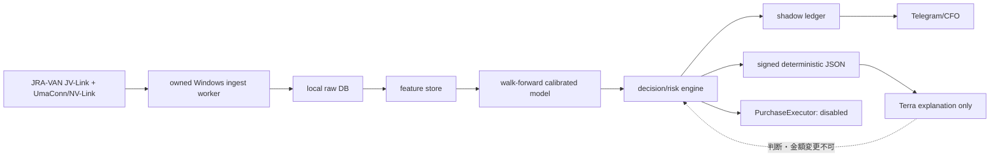
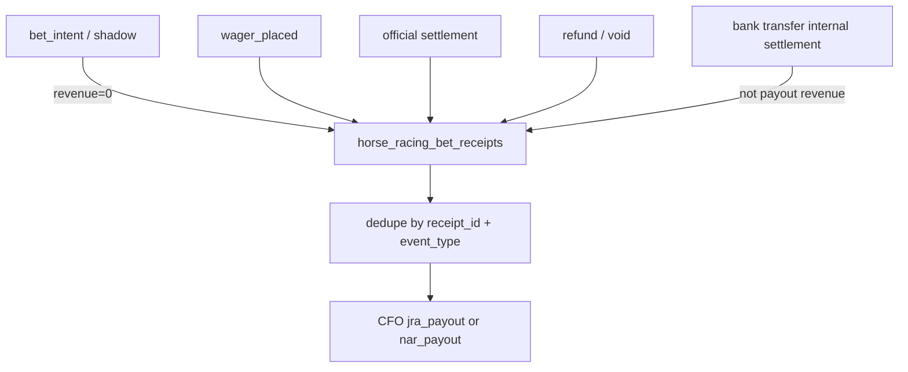

# Life Manager 競馬AI financial organ 設計仕様

## ステータスと責務

| 項目 | 契約 |
|---|---|
| Status | **RESEARCHED DESIGN — LIVE PURCHASE DISABLED** |
| 対象 | Life Manager financial organ の第8候補 `business_id: horse_racing` |
| 現在の段階 | HRA-0 research/spec のみ完了。実装対象はHRA-1〜HRA-5のShadow Foundation |
| 依存 | CFO SSOT の `CFO-0c` exact-seven 完了後にregistry v2へ接続する |
| manager / 計画 / 検証 | Sol |
| 全実装slice | Luna |
| 購入処理 | `PurchaseExecutor` はdisabled。HRA-6の完了まで有効化しない |

この文書は競馬AIの設計と受入契約を正本にする。現在のCFO specは変更せず、既存のexact-sevenを8番目へ拡張する判断もこの文書では行わない。`horse_racing` はCFO-0c完了後のregistry v2が受け入れた場合だけ候補financial organとして登録できる。Solはmanager、計画、gate、検証だけを担い、コード・fixture・adapter・テストを含む全implementation sliceはLunaが担当する。

## 1. 目的と非目的

### 目的

公式または明示的にlicensedなJRA+NAR dataを、所有Windows内で取り込み、決定的かつcalibratedなvalue selectionを行う。対象となる全raceについてshadow pickを生成し、日本語Telegramで事前・結果を報告する。immutable ledgerへdecision、outcome、receipt summaryを保存し、CFOへ集計可能な形で渡す。後続のchampion/challenger比較で、calibration、ROI、drawdownを同じ条件で改善する。

### Hard non-goals

- browser automation、Selenium、DOMクリック、または非公式注文APIを使わない。
- 現時点の実決済を実装・有効化しない。
- licensed raw dataをcloud、Telegram、Git、issue、ログ、外部APIへ再配布しない。
- 収益、勝率、月次利益を保証しない。
- 負EVのcash betを、目標達成や学習のために強制しない。
- netkeiba等のscrapingを公式・licensed sourceの代替にしない。
- Terraに判断、確率、stake、actionを決めさせない。Terraは署名済みdeterministic JSONの説明だけを生成する。

## 2. 設計の中心契約

### Architecture



各矢印は保存・受け渡し境界を表す。JRA-VAN JV-LinkとUmaConn/NV-Linkのlicensed/official accessはowned Windows ingest workerからだけ行う。raw DBはそのWindows内に置き、cloudとTelegramには送らない。cloud、Telegram、CFOへ出せるのは派生したdecision、署名済みreceipt summary、集計値だけである。

`PurchaseExecutor`はインターフェース境界だけを文書化し、現行設定を常にdisabledにする。disabled状態では注文network call、credential read、wallet/bank操作、外部状態変更を一切行わない。Terraの説明入力はdecision engineが署名したJSONに固定し、Terraの出力でaction、p、odds、EV、stake、cap、decision_idを変更できない。

### 実行主体の境界

| 主体 | 許可される責務 | 禁止される責務 |
|---|---|---|
| Sol | manager、計画、acceptance gate、検証、stage遷移 | implementation sliceを代行すること |
| Luna | すべてのコード、schema、fixture、adapter、test、実装commit | HRA-6未完了でpurchaseを有効化すること |
| owned Windows worker | licensed raw dataの取得・正規化・hash記録 | raw dataをWindows外へ出すこと |
| decision/risk engine | deterministic pick、risk gate、shadow action | cutoff後の情報を読むこと、Terraへ判断を委譲すること |
| Terra | signed JSONの日本語説明 | decision、stake、action、capの変更 |
| Telegram/CFO adapter | 派生summary、receipt、ledger eventの配送 | raw data、secret、未確定EVをrevenueへ計上すること |

## 3. 現状、到達状態、registry依存

### As-Is

- Life Manager CFOの正本はexact-sevenを先に完了させる構成であり、`CFO-0c`はそのregistry/inventory dependencyである。
- `horse_racing`の実装、purchase executor、horse-racing ledgerは存在しない。
- 現行Life Managerの一般API-cost ledgerは、競馬のbet receipt、payout、tax evidenceの代替ではない。
- JRA/NARのraw licensed dataをcloud/Telegramに保存・転送する許可はない。

### To-Be

- `horse_racing`を8番目候補としてregistry v2で参照できる。ただしCFO exact-sevenの完了とregistry v2の受入が前提であり、既存CFO specを変更しない。
- HRA-1〜HRA-5では、licensed source contract、fixture、deterministic model/backtest、shadow decision/outcome、Telegram、CFO adapterを段階的に実装する。
- 実決済はHRA-6以降のblocked gateを満たさない限り不可能である。
- 公式settled receiptがない間、shadow pick、estimated EV、forecastはrevenueもreal P&Lも0として扱い、unknownを0に変換しない。

### business registry 契約

```yaml
business_id: horse_racing
candidate_ordinal: 8
registry: v2
depends_on: CFO-0c exact-seven
status_before_dependency: blocked
live_purchase: disabled
```

このcandidate recordは既存CFO registryのexact-sevenを編集する指示ではない。CFO-0cの検証済み出力を入力にしてregistry v2側で追加する契約である。

## 4. Source、licensed data、再利用方針

### Source boundary

1. JRAはJRA-VAN JV-Link等のlicensed access、NARは公式または明示的にlicensedなaccessだけを使う。
2. raw licensed dataはowned Windows内のlocal raw DBから外へ出さない。raw payload、馬名を含むprovider row、license credential、subscription identifierをTelegram/cloud/log/Gitへ出力しない。
3. Windows workerはraw recordにsource、取得時刻、snapshot時刻、schema version、content hash、license boundaryを付ける。cloudへ同期するのはhash、派生feature、decision、receipt summaryだけである。
4. fixtureはprovider dataを再配布しない最小の正規化synthetic recordにする。fixtureで実際のcredential、licensed data、provider注文が成功したように報告してはならない。
5. NAR公式vote導線を確認する。JRA-VAN data accessとNAR投票の権限を一つの非公式注文経路に混ぜない。

### 再利用matrix

| 候補 | license / 用途 | 採用境界 |
|---|---|---|
| [`miyamamoto/jrvltsql`](https://github.com/miyamamoto/jrvltsql) | Apache-2.0。JRA ingestの実装参照。NAR非対応 | JRA ingestのadapter設計とschemaの参考に限定し、license boundaryを保持する |
| [`miyamamoto/nvlink-bridge`](https://github.com/miyamamoto/nvlink-bridge) | MIT。NAR bridgeの参考。限定test | NAR bridgeのadapter契約を限定的に参照し、official/licensed access gateを別途通す |
| [`takumiito271/jra-horse-racing-prediction`](https://github.com/takumiito271/jra-horse-racing-prediction) | MIT。walk-forward、calibration、quarter-Kelly等の概念 | 概念を選択再利用し、実装は本仕様の契約・時点境界・ledgerに合わせる |
| [`takepan/jrvltsql`](https://github.com/takepan/jrvltsql) | READMEとLICENSEの商用条件が衝突 | 書面確認が完了するまでcode reuseを禁止する |
| netkeiba scraping repositories | 公式licensed accessではない | reject。raw dataの権利・再現性・運用保証が不足する |
| HRT_Buyer / Selenium | browser/DOM automation | reject。注文経路として禁止し、DOMのsuccess表示をreceiptにしない |
| AGPL turf-tipster | licenseと実行境界が本仕様に不適合 | reject。AGPLコードを本実装へ取り込まない |

再利用はlicense確認、変更履歴、source attribution、対象コードの境界を記録してから行う。licenseが不明または条件が衝突するものは、動作が良く見えても取り込まない。

## 5. Model、backtest、decision/risk

### Model contract

- 最初のbaselineはmarket implied probabilityである。market oddsから作るimplied pをcalibration比較の基準にする。
- 初期modelはwin/placeだけを対象にし、LightGBMまたはXGBoostの一つを固定して比較する。複勝・馬連等の複雑な組み合わせを初期sliceへ広げない。
- race decision cutoffより後のfeatureを禁止する。結果、払戻、後刻の確定馬体重、確定後にのみ分かる情報をtraining rowへ混入させない。
- time-series walk-forwardでtrain/validation/testを時系列分離する。random splitは禁止する。
- T-5分など固定snapshotを採用し、snapshot時刻をdecision_idに紐付ける。同一raceを後のoddsで上書きしない。
- odds slippage stressを行い、観測oddsと想定slippage後のoddsを分離する。
- Brier score、logloss、ECEを必須metricsとする。accuracyだけでmodelを昇格させない。
- calibrationはGuo et al.のtemperature scaling等の一次資料を参照し、対象window内で再現可能なcalibratorをversioned artifactとして保存する。

### Valueとrisk

```text
EV = p * odds - 1
confidence_adjusted_EV = lower_bound(EV, calibration_uncertainty, slippage_stress)
future_stake = min(one_quarter_Kelly, micro_cap)
```

`p`、odds、uncertainty、slippageはsigned deterministic JSONの入力として保存する。cash sizingは後続gateの文書契約であり、HRA-1〜HRA-5でcash orderを実行しない。将来のstake算出でも1/4 Kellyとmicro capの小さい方を超えない。

### No-betと全race activity

- confidence-adjusted EVが負のcash betを強制しない。
- ただし全eligible raceについてshadow decisionを必ず生成する。
- `SKIP`でもbest candidate、threshold gap、理由、model、data freshness、decision_idを記録・報告する。
- `SHADOW`は実注文ではなく、同じdecision/risk engineで選択が成立したことを意味する。`LIVE`は契約上表示可能なenumだが、PurchaseExecutorがdisabledのため現在は発生させない。
- raceがsource stale、snapshot欠落、schema不一致、reconciliation不能の場合はshadow activityを落とさず、`SKIP`とfail-closed理由を生成する。raw payloadは出さない。

## 6. Improvement loopとoutcome

1. official outcomeをimmutable ingestする。既存decisionを更新・削除せず、outcome receiptを別eventとしてappendする。
2. retrainはweeklyまたはmonthlyの固定windowで行う。raceごとのonline weight updateは禁止する。
3. championとchallengerを同じsnapshot、同じfeature availability、同じslippage stressで評価する。
4. later windowでcalibration、ROI、drawdownの全gateを通過したchallengerだけをchampion候補にする。単一metricの改善では昇格させない。
5. official outcome reconciliationが未完了ならP&Lを確定しない。refund、void、payoutの区別を保持する。
6. paddock imageはlicensed imageryが確保されるまでdeferする。最初は馬体重とtrack conditionを使い、licensed imageを追加する場合もablationでincremental OOS価値があることを示してから採用する。

## 7. Telegram reporting 契約

すべてのメッセージは先頭を正確に `Life Manager::: 競馬AI` とする。メッセージは日本語で、raw licensed data、credential、private path、provider payloadを含めない。送信失敗はdecision/ledgerを先に確定した上でdedupe可能なoutbox状態へ残し、同じdecision_idを重複送信しない。

### 事前schema

```text
Life Manager::: 競馬AI
日時: <ISO-8601 JST>
venue: <開催場のsafe identifier>
race: <race number>
start: <start time>
action: LIVE|SHADOW|SKIP
bet: <bet type or NONE>
horse: <horse safe identifier or NONE>
stake: <yen or 0>
p: <model probability>
odds: <snapshot odds or null>
odds_snapshot: <snapshot time/hash>
implied_p: <market implied probability>
EV_lower: <confidence-adjusted lower bound>
top3_factors: <deterministic factor labels 3件以内>
cap: <risk cap identifier/value>
decision_id: <immutable id>
model: <model/calibrator version>
data_freshness: <freshness status and age>
```

### 結果schema

```text
Life Manager::: 競馬AI
日時: <ISO-8601 JST>
venue: <開催場のsafe identifier>
race: <race number>
official_placing: <official placing or null>
payout: <official settled payout or null>
refund: <official refund or null>
net_P&L: <settled net P&L or null>
cumulative_realized_P&L: <official settled cumulative value or null>
drawdown: <realized drawdown or null>
official_receipt_status: <verified|pending|void|refund|unavailable>
model: <model/calibrator version>
decision_id: <immutable id>
learning_action: <append outcome|retrain window|champion/challenger result|blocked reason>
```

未settledまたはshadowの`payout`、`net_P&L`、`cumulative_realized_P&L`は推定値で埋めず、statusとnullを保持する。説明文の都合でfieldを省略しない。

## 8. CFO、ledger、税務証憑

### CFO integration contract

- `business_id`は`horse_racing`、payout channelは`jra_payout`と`nar_payout`を使う。
- ledger table/stream名は `horse_racing_bet_receipts` とする。raw licensed dataはこのledgerへ入れず、receipt summaryとcontent hashだけを保持する。
- event typeは `bet_intent`、`wager_placed`、`settlement`、`refund`、`data_subscription`、`compute_cost`、`tax_evidence` の7種に固定する。
- bank transferは内部settlementとして記録し、payout revenueと二重計上しない。
- shadow pick、estimated EV、未settled見込値はrevenueを0として扱う。unknownを0へ変換せず、settlement statusを別に持つ。
- real P&Lはofficial settled receiptだけで確定する。official placingだけ、または画面上のsuccessだけでは確定しない。
- 税務reviewに必要な公式払戻、購入・返金・取消、費用、日付、source、receipt hashを保存する。raw licensed race dataを税務証憑に混ぜず、必要なreceipt summaryをimmutableに保存する。

### 二重計上防止



同一official receiptをJRA/NAR payoutとbank transferの両方へ収益として計上しない。eventをappendしても、CFO projectionはreceipt_id、business_id、channel、event_typeのidempotency keyで一度だけsettleする。

## 9. Stage gate

| Stage | 内容 | 状態 |
|---|---|---|
| HRA-0 | research/spec、一次資料、license boundary、受入契約 | **現在ここまで** |
| HRA-1 | CFO dependency確認、registry v2 contract | HRA-1〜HRA-5のimplementation plan対象 |
| HRA-2 | licensed ingestion、Windows raw boundary、normalized fixture contract | HRA-1〜HRA-5のimplementation plan対象 |
| HRA-3 | model、walk-forward、calibration、backtest、slippage stress | HRA-1〜HRA-5のimplementation plan対象 |
| HRA-4 | shadow live、Telegram事前/結果、official outcome append | HRA-1〜HRA-5のimplementation plan対象 |
| HRA-5 | CFO、tax evidence、double-count、reconciliation | HRA-1〜HRA-5のimplementation plan対象 |
| HRA-6 | written provider permission または official supported ordering API、tax review、credential/cap/reconciliation gate | **blocked。受入証憑が揃うまで実装しない** |
| HRA-7 | HRA-6後のfuture micro-live。owner-local-dayごとにone ¥100 max | **blocked。文書契約のみ** |
| HRA-8 | evidence-driven scale | **blocked。実績証憑と全gateの後** |

現在はHRA-0のみ完了している。実装planはHRA-1〜HRA-5のShadow Foundationだけを扱い、HRA-6以降を実行taskにしない。

### HRA-7 micro-live policy（文書のみ）

HRA-6の全receipts、provider permission、tax review、credential separation、cap、reconciliation gateを満たした場合に限り、HRA-7は次を必須にする。これは現行コードの許可ではない。

- owner-local-dayの1日総額を¥100以下にする。
- positive confidence-adjusted EVだけを対象にし、負EV、uncertainty下限が負、stale dataは実行しない。
- martingale、loss chasing、stake増額追跡を禁止する。
- stale data、Telegram pre-message failure、reconciliation failureはfail-closedにする。
- credentialをdata ingest、decision、purchaseで分離する。購入credentialはdisabled境界を越えて読み出さない。
- 公式投票照会receiptで注文とsettlementを確認する。DOM上のsuccess表示をreceiptにしない。

## 10. 目標mathと経済的解釈

月¥1.5M profitはacceptanceやforecastではなくaspirationである。単純化したnet ROIと必要turnoverの関係は次の通りである。

| net ROI | 月¥1.5M profitに必要なturnover |
|---:|---:|
| 3% | ¥50M |
| 5% | ¥30M |
| 10% | ¥15M |
| 20% | ¥7.5M |

少額上限の目安では、¥100/dayをnet ROI 10%で回しても¥300/月、¥500/dayでも¥1,500/月である。実際の税、控除、refund、slippage、費用、drawdownを含むと変動するため、これらの数値を収益保証、acceptance、cash enable条件にしない。

## 11. Best / Base / Worst、棄却案、誤りの最有力筋

| ケース | 想定 | 必要な判断 |
|---|---|---|
| Best | licensed/official sourceが安定し、replay決定性、calibration、OOS ROI、drawdown、CFO reconciliationが継続して通る | shadowを継続し、provider permissionとtax gateが揃った場合だけ次stageを審査する |
| Base | sourceとoutcomeは取得できるが、cashを正当化するconfidence-adjusted EVまたはpermissionが不足する | Shadow Foundationを継続し、全raceのSKIP/SHADOWを学習へ使う。purchaseはdisabledのままにする |
| Worst | license境界、source availability、odds slippage、Telegram/reconciliation、provider permissionのいずれかが壊れる | fail-closedでcashを止め、receipt/diagnosticだけを保存する。raw dataを外部へ逃がさない |

棄却案の最強の論拠は、scraping・Selenium・非公式注文APIは公式権限、receipt、再現性、障害時のfail-closedを同時に証明できず、データ漏洩と誤決済の損失がモデル改善益を上回ることである。

自分が間違うとしたら最有力の筋は、未発見の公式または書面許可済みintegrationが、想定より安全なsupported ordering APIとreceipt/reconciliation契約を提供していることである。その場合も、一次資料と書面証憑をHRA-6で確認するまでは現設計を変更しない。

## 12. Acceptance criteria と検証matrix

| 契約 | 検証 | 合格条件 |
|---|---|---|
| 秘密・raw data非出力 | fixture、ログ、Telegram payload、Git diffをscan | secret、credential、licensed raw rowが0件 |
| official/licensed source only | source registry、license record、adapter contract | sourceとaccess pathに証憑があり、reject対象が未使用 |
| replay determinism | 同一normalized fixtureを同一versionで2回再生 | signed decision JSON、decision_id由来の結果、ledger eventがbyte相当で一致 |
| time leakage | cutoff後featureを意図的に混ぜたfixture | testがfailし、実行経路では混入を拒否 |
| fixed snapshot | T-5 fixtureと後刻oddsを別recordで再生 | decisionは固定snapshotだけを使用し、後刻値で変わらない |
| calibrated evaluation | walk-forward windowでBrier/logloss/ECE | baseline、champion、challengerを同じwindowで比較できる |
| slippage stress | oddsをstressさせたbacktest | confidence-adjusted EV lower boundとdecisionが保存される |
| every eligible race | eligible race fixtureにpositive/negative/staleを混在 | 全raceにSHADOWまたはSKIPが一つ以上あり、SKIPはbest candidate/threshold gapを含む |
| official outcome | placing/payout/refund/voidのreceipt fixture | decisionを変更せずimmutable appendし、reconciliation状態を分ける |
| Telegram | pre/result schema test + delivery failure test | prefix、必須field、dedupe、raw/secret非出力が保証される |
| CFO double-count | JRA/NAR payoutとbank internal settlement fixture | official settled receiptだけがreal P&Lになり、二重revenueが0件 |
| PurchaseExecutor | disabled executorをnetwork禁止testで呼ぶ | credential read、network side effect、注文状態変更が0件 |
| live impossibility | HRA-6 receiptsを欠いた状態でlive enumを要求 | fail-closedし、LIVEを実行せず、blocked reasonを保存 |

UI変更はない。したがってiOS UIのMaestro testは対象外である。E2E判定は、owned Windows adapter契約、normalized fixture、shadow decision、Telegram payload、official outcome reconciliation、CFO projectionを実データ境界に沿って通し、PurchaseExecutorにnetwork side effectがないことを確認して行う。fixtureでprovider accessや購入成功を偽装してPASSにしない。

## 13. 実装の境界と順序

実装の正本は対応するplan `docs/superpowers/plans/2026-08-09-life-manager-horse-racing-agent.md` とする。一度に一つのactive itemだけを進め、各sliceはtests-first RED→GREEN、実E2Eまたは隔離された境界検証、state更新、commit boundaryの順で閉じる。Solはgateと検証を担当し、Lunaが各implementation sliceを実装する。購入実装、注文credential、非公式provider、cloud raw storeはplanに存在しない。

## Sources（一次資料・引用）

引用は判断に必要な短い原文だけを保持する。契約・税務の最終判断はproviderの書面、公式規約、税務専門家のreviewを優先する。

1. [JRA A-PAT 約定・利用規約](https://www.jra.go.jp/dento/a/pdf/yakujo_apat.pdf) — 「加入者本人以外の者に…申込みをさせる行為」「他人からの委託により…申込みをする行為」。本人以外への申込み委託を許可前提に扱わない根拠。
2. [JRA-VAN 利用規約](https://jra-van.jp/info/rule.html) — 「JV-Link以外からJRA-VAN Data Lab.サーバにアクセスする行為」。また、取得情報の私的使用制限を定めているため、raw licensed dataをcloud/Telegramへ出さない。
3. [JV-LinkにIPAT投票APIが存在しない旨の公式開発者フォーラム](https://developer.jra-van.jp/t/topic/747) — 「IPAT投票に関するメソッドはJV-Linkには存在しません」。JV-Linkを注文APIとして扱わない根拠。
4. [JV-Link公式SDK案内](https://developer.jra-van.jp/t/topic/45) — official SDKの入口。実装はこの公式access pathとprovider permissionを確認する。
5. [NAR公式投票案内](https://www.keiba.go.jp/vote.html) — NARの公式投票導線。JRA-VANとNARを別source/権限として扱う根拠。
6. [楽天競馬利用規約](https://keiba.rakuten.co.jp/guide/term) — 「第三者に行わせ…できない」「１００円の整数倍」。第三者委託とstake単位を自動注文の許可と誤読しない根拠。
7. [NAR商用利用FAQ](https://www.keiba.go.jp/qa.html) — 「一切の掲載情報について、商用利用及び改変しての転載を禁じております。」。書面確認前の再配布・商用reuseを許可しない。
8. [国税庁 No.1490 一時所得](https://www.nta.go.jp/taxes/shiraberu/taxanswer/shotoku/1490.htm) — 「競馬や競輪の払戻金（営利を目的とする継続的行為から生じたものを除きます。）」とする公式説明。税務証憑をsettled receiptベースで保存する根拠。
9. [JRA 払戻率案内](https://www.jra.go.jp/kouza/baken/index.html) — 公式払戻率表。受入判断の根拠ではなく、目標mathの市場構造確認用に使う。画面表示ではなく公式receipt/reconciliationを使う。
10. [Guo et al., On Calibration of Modern Neural Networks](https://proceedings.mlr.press/v70/guo17a.html) — calibration評価・temperature scalingの研究一次資料。
11. [scikit-learn TimeSeriesSplit](https://scikit-learn.org/stable/modules/generated/sklearn.model_selection.TimeSeriesSplit.html) — 時系列順を保ったsplitの公式API仕様。random splitを使わない根拠。
12. [miyamamoto/jrvltsql](https://github.com/miyamamoto/jrvltsql)、[miyamamoto/nvlink-bridge](https://github.com/miyamamoto/nvlink-bridge)、[takumiito271/jra-horse-racing-prediction](https://github.com/takumiito271/jra-horse-racing-prediction)、[takepan/jrvltsql](https://github.com/takepan/jrvltsql) — 再利用matrixのlicenseと実装境界を確認する対象。
