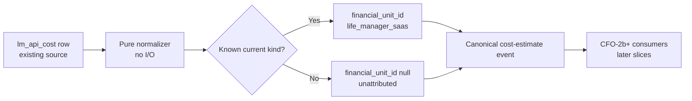

# Life Manager CFO-2a — Minimal Business-Ledger Contract

| Field | Value |
|---|---|
| Status | APPROVED — implementation plan active |
| Parent | `docs/superpowers/specs/2026-08-06-life-manager-cfo-design.md` |
| Active item | CFO-2a only |
| Runtime | Existing local `apps/life-call` package |
| Role split | Sol plans and verifies; Luna writes production code/tests and runs implementation commands |

## 1. Goal

Convert one existing `lm_api_cost` row into one deterministic, honest financial-unit event without changing the
source table or claiming that an estimate is measured cost. This slice defines and proves the boundary only. It does
not persist a new ledger, calculate P&L, add OpenTelemetry, or instrument another business.

## 2. Ponytail decision

Three approaches were evaluated:

1. **Chosen — one pure normalizer in existing `lib/ledger.js`.** Reuses the source ledger and its test file. Two
   files change; no dependency or migration is added.
2. New canonical ledger table plus dual-write. Rejected because CFO-2a needs a contract, not another source of truth.
3. Instrument every earning loop first. Rejected because it changes nine economic units before one event is proven.

The implementation soft target is two files and at most 100 added LOC total: at most 45 production LOC and 55 test
LOC. If the task needs a third file, a dependency, SQL, or more than 100 added LOC, the plan is wrong and scope
must be reduced before implementation.

## 3. Flow



## 4. Existing source contract

The normalizer consumes the row already returned by PostgREST:

```text
id: positive integer
ts: valid timestamp
uid: non-empty string or null
kind: non-empty snake-case string
quantity: non-negative finite decimal
unit: non-empty string
est_usd: non-negative finite decimal
meta: any JSON value; never copied to the event
```

The source row remains immutable. CFO-2a performs no network, database, clock, log, or environment access.

## 5. Canonical event contract

`normalizeApiCostEvent(row)` returns exactly these keys:

```json
{
  "schema_version": 1,
  "source_ledger": "lm_api_cost",
  "source_event_id": "lm_api_cost:42",
  "occurred_at": "2026-08-10T01:02:03.000Z",
  "owner_id": "u1",
  "financial_unit_id": "life_manager_saas",
  "attribution_status": "attributed",
  "event_type": "operating_cost_estimate",
  "cost_kind": "gemini_live",
  "quantity": { "value": "90", "unit": "seconds" },
  "amount": { "value": "0.0345", "currency": "USD" },
  "evidence_status": "locally_estimated"
}
```

The example strings show exact serialization rules, not fixed production values. Decimal values are carried as
strings so this boundary does not introduce binary-float accounting arithmetic. `source_event_id` is the dedupe
identity; the same source row always produces the same event. The function does not mutate its input.

### Attribution table

| `kind` | `financial_unit_id` | Status |
|---|---|---|
| `gemini_live` | `life_manager_saas` | `attributed` |
| `telnyx_call` | `life_manager_saas` | `attributed` |
| `composio_call` | `life_manager_saas` | `attributed` |
| `composio_poll` | `life_manager_saas` | `attributed` |
| Any other valid kind | `null` | `unattributed` |

Unknown kinds are preserved, not rejected or guessed. Missing/invalid identity, timestamp, quantity, unit, or amount
throws a redacted `cfo_business_ledger_invalid:<reason>` error containing no row value, UID, metadata, or secret.
`meta` is deliberately excluded because current producers do not need it for financial attribution and it may contain
unbounded payload data.

## 6. Acceptance criteria

- [ ] One current `lm_api_cost` fixture maps to the exact closed event shape above.
- [ ] The four existing kinds map only to `life_manager_saas`; an unknown valid kind is visibly `unattributed`.
- [ ] `est_usd` always remains `locally_estimated`; normalization never upgrades it to measured or confirmed.
- [ ] Zero remains zero. Invalid, negative, missing, `NaN`, and infinite numbers fail instead of becoming zero.
- [ ] `source_event_id` is stable from the positive source row ID and contains no personal data.
- [ ] `meta` and unknown source keys never appear in the normalized event or an error.
- [ ] The normalizer is pure, deterministic, and leaves the input unchanged.
- [ ] Existing ledger tests and the normal CFO test command pass.

## 7. Minimal verification

Only three focused tests are required:

1. A known-kind row produces the exact event, excludes secret-shaped `meta`, and leaves its input unchanged.
2. An unknown kind remains unattributed rather than being guessed or rejected.
3. A compact invalid-number table proves money values never default to zero or leak into errors.

No database integration test is required because this slice performs no database write and uses an injected row.
No Telegram, launchd, browser, OpenTelemetry, billing, tax, or multi-tenant E2E is part of CFO-2a.

## 8. Authoritative evidence

- [OpenTelemetry service semantic conventions](https://opentelemetry.io/docs/specs/semconv/resource/service/) — a
  service is a logical application component. Decision: runtime/service identity is evidence for attribution, not a
  second economic-unit registry.
- [OpenTelemetry GenAI attributes](https://opentelemetry.io/docs/specs/semconv/registry/attributes/gen-ai/) — provider
  totals should be used when available, and the cited registry entries have moved. Decision: pin and implement them
  in CFO-2a2, not this slice.
- [Stripe idempotent requests](https://docs.stripe.com/api/idempotent_requests) — safe retries must not create the
  operation twice. Decision: `lm_api_cost:<id>` is the stable source-event identity.
- [FinOps shared-cost guidance](https://www.finops.org/wg/identifying-shared-costs/) — shared allocation becomes
  complex as organizations scale. Decision: CFO-2a maps only direct current Life Manager producers; allocation is
  deferred until explicit consumption evidence exists.

## 9. Boundaries

In scope: contract, pure normalization, strict money validation, current-kind attribution, stable dedupe identity,
and minimal focused tests.

Out of scope: schema migration, new table, writes, aggregation, price cards, tokens, OpenTelemetry SDK, billing
reconciliation, other business producers, Telegram UI, tax, Binance, cloud, trading, hiring, and capital allocation.
