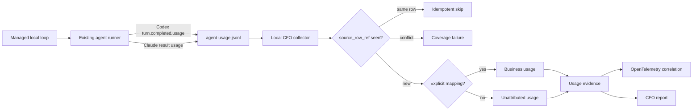

# CFO-2a2a — Local Agent Usage Truth

| Field | Value |
|---|---|
| Status | ACTIVE — slices 2a2a.1-2 complete; 2a2a.3 is next |
| Parent | `2026-08-06-life-manager-cfo-design.md` |
| Runtime | Local Mac first |
| Source | `~/.local/state/{life-manager,anicca}/telemetry/agent-usage.jsonl` |
| Rule | Reuse provider-attempt evidence; never infer tokens or current cash spend |

## Goal

Make every managed Codex or Claude loop's token use visible to the CFO without inventing numbers, double-counting
events, or confusing subscription cash cost with an API-price forecast.

## Ponytail decision

The existing agent runner already closes the hard provider-specific problem:

- Codex: runner-normalized fields sourced from the last `turn.completed.usage` in one bounded invocation;
- Claude: runner-normalized fields sourced from the CLI result envelope's `usage`;
- every attempt: a 24-hex runner `event_id`, terminal `success|failed`, loop, task, model, and measurement;
- missing provider usage: `measurement="unavailable"`, never zero or estimated.

Therefore CFO-2a2a consumes that append-only ledger. It does not add a raw Codex-session scanner, a raw Claude-session
scanner, a new service, a new agent, or a second token estimator. Raw session logs are only audit evidence. Unmanaged
interactive sessions remain outside business P&L until an explicit sidecar identifies the run and financial unit.



OpenTelemetry carries the evidence and correlation. It does not certify or calculate the token values.

## Observed identity defect

The runner derives `event_id` from `evidence_dir + attempt index`. Callers reuse `evidence_dir`, so this value is
correlation metadata, not a unique attempt identity. The real ledgers contain distinct rows sharing one ID: the
Life Manager ledger has 6 collided IDs, including groups of 394 and 405 rows, and the Anicca ledger has 428 collided
IDs. Every observed collided group differs in timestamp, token values, and duration. Dedupe by runner `event_id`
would therefore delete real usage.

The later file collector assigns each complete line an opaque `source_row_ref`:

```text
sha256("cfo-local-agent-row-v1\0" + configured_source_id + "\0" + complete_line_start_byte_offset_decimal_ascii)
```

The configured source ID is exactly `life_manager_agent_usage` or `anicca_agent_usage`, never a filesystem path. The
offset is the zero-based byte offset of the complete line's first byte encoded as decimal ASCII. Prefix hash and byte
watermark checks quarantine rewrites before offsets are trusted. The runner `event_id` survives only as
`runner_event_id` for correlation and collision coverage; it is never the CFO idempotency key.

## Canonical input contract

Only plain JSON objects are accepted. Required source fields are:

- `version=1`, 24-lowercase-hex `event_id`, valid `timestamp`;
- non-empty `loop`, `task_label`, `provider`, `provider_name`, and `model`; nullable `upstream_model`;
- integer `attempt >= 1`, terminal `status=success|failed`;
- `measurement=provider_reported|unavailable`;
- one plain `tokens` object with keys `input`, `cached_input`, `cache_creation_input`, `output`,
  `reasoning_output`, and `total`;
- `provider_reported` requires every token value to be a non-negative safe integer;
- `unavailable` requires every token value to be null. It is a coverage gap, not zero usage.

The pure normalizer also requires a plain context with a non-zero 64-lowercase-hex `source_row_ref` and nullable
`financial_unit_id`. The normalizer does not perform file I/O or derive the ref itself.

The collector copies all six **runner-normalized** token fields exactly and labels their basis
`runner_normalized_provider_usage`. It does not relabel each zero as provider-measured: the runner currently defaults
missing optional cache/reasoning fields to zero and derives some `input` and `total` values from provider components.
This is stronger than a prose estimate but weaker than a field-for-field provider receipt. Later reconciliation may
expose disagreements without rewriting source truth.

## Canonical normalized event

```json
{
  "schema_version": 1,
  "source_ledger": "local_agent_usage",
  "source_event_id": "local_agent_usage:<64 hex source_row_ref>",
  "runner_event_id": "<24 hex correlation only>",
  "occurred_at": "RFC3339",
  "provider": "codex|claude|claude-direct|openai-api|other runner provider",
  "provider_name": "openai|anthropic|other",
  "request_model": "provider request model",
  "upstream_model": "provider-resolved model or null",
  "run": {"loop": "...", "task_label": "...", "attempt": 1, "status": "success|failed"},
  "financial_unit_id": "explicit unit or null",
  "attribution_status": "attributed|unattributed",
  "measurement": "provider_reported|unavailable",
  "token_value_basis": "runner_normalized_provider_usage|unavailable",
  "tokens": {"input": 0, "cached_input": 0, "cache_creation_input": 0, "output": 0, "reasoning_output": 0, "total": 0},
  "coverage_status": "covered|missing_usage"
}
```

For `unavailable`, all token values remain null, `token_value_basis=unavailable`, and
`coverage_status=missing_usage`. Provider variants are preserved rather than silently filtered: for example,
`provider=openai-api` remains visible, and a Claude alias in `model` retains its concrete `upstream_model`. No prompt,
response, raw payload,
credential, account token, full filesystem path, or provider stdout enters the normalized event or OTel attributes.

## Attribution

Attribution is an explicit input to the pure normalizer. A later collector resolves it from a versioned mapping of
managed `loop + task_label` identities to the existing CFO financial-unit registry. No match means
`financial_unit_id=null` and `attribution_status=unattributed`; cwd text is never used as a guess.

## Durable collector state

Each source file keeps only:

- stable source ID, last byte offset, file size, raw-byte SHA-256, and last successful scan time;
- discovered, accepted, duplicate, conflicting, invalid, attributed, and unattributed row counts;
- last terminal attempt timestamp and current coverage state.

If the file shrinks, the prefix changes, JSON is truncated, or one runner `event_id` identifies distinct rows,
ingestion lowers coverage and preserves the accepted source-row observations. It never drops distinct rows merely
because their runner IDs collide, and never reports a partial subtotal as complete.

## Event dedupe contract

The pure reducer consumes exact `{input, context}` pairs, calls the 2a2a.1 normalizer itself, and keys the resulting
content-free events by `source_event_id`. It never trusts a caller-supplied object merely labeled “normalized”:

- first ID + first exact canonical value: accept once;
- same ID + same canonical value: count as an idempotent duplicate and do not add usage;
- same ID + any different canonical value: remove that ID from accepted usage and count every row for the ID as
  conflicting; do not choose the first, last, largest, or smallest value;
- accepted events are sorted by `source_event_id`, so input order cannot change the result.

The receipt satisfies `discovered_rows = accepted_rows + duplicate_rows + conflicting_rows`. `missing_usage_rows`
counts only final accepted events with missing usage. `runner_collision_groups` counts runner IDs that have at least
two distinct `source_event_id` values among final accepted events. Duplicates never increment either count, and every
conflicting source ID is excluded from both populations. The receipt also returns a unique, lexicographically sorted
`coverage_exceptions` array drawn from `conflicting_usage|missing_usage|runner_identity_collision`. An empty array
means covered. Downstream totals may be shown only as incomplete evidence when the array is non-empty. Reused
`runner_event_id` values never remove distinct source-row observations.

## One-by-one slices

| Slice | User-visible closure | Soft target |
|---|---|---|
| 2a2a.1 ✅ | Pure event normalizer uses opaque source-row identity and preserves runner values/provenance | 2 files, +92/-1 cumulative LOC from pre-slice base |
| 2a2a.2 ✅ | Pure batch reducer dedupes source-row refs and reports runner-ID collisions without dropping rows | 2 files, +69/-2 LOC |
| 2a2a.3 NEXT | Append-only file cursor proves hash/watermark/truncation coverage | <=3 files, <=100 added LOC |
| 2a2a.4 | Versioned loop/task mapping yields attributed or visibly unattributed rows | <=3 files, <=100 added LOC |
| 2a2a.5 | Local append/storage + OTel links accepted rows without exposing content | <=3 files per sub-slice |
| 2a2a.6 | Real local E2E reconciles source counts, normalized rows, coverage, and no-secret output | 1 script, <=100 added LOC |

## Acceptance

- [x] Exact runner-normalized token fields and provider/model provenance survive one source-row identity without being
      mislabeled as field-for-field provider receipts.
- [x] Missing usage remains null and lowers coverage; it never becomes zero.
- [x] Identical source-row refs are idempotent; conflicting refs fail closed; reused runner IDs lower coverage without
      deleting distinct source rows.
- [ ] Rewrite, truncation, malformed tail, and unread source reduce coverage without deleting accepted evidence.
- [x] Explicit mapping attributes a row; missing mapping produces an unattributed row.
- [ ] Subscription cash cost remains separate; token-derived USD is not labeled current spend.
- [ ] Real local E2E reads existing redacted usage ledgers and emits counts only, never prompts, payloads, or secrets.

## Out of scope

- raw interactive Codex/Claude session ingestion;
- pricing or subscription receipt reconciliation (CFO-2a3c);
- business revenue instrumentation (CFO-2b);
- Telegram profit/advice enablement before CFO-2b/2c reconciliation.
