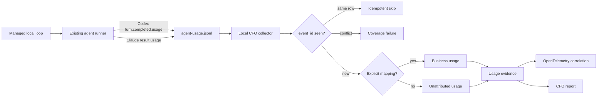

# CFO-2a2a — Local Agent Usage Truth

| Field | Value |
|---|---|
| Status | ACTIVE — slice 2a2a.1 complete; 2a2a.2 is next |
| Parent | `2026-08-06-life-manager-cfo-design.md` |
| Runtime | Local Mac first |
| Source | `~/.local/state/{life-manager,anicca}/telemetry/agent-usage.jsonl` |
| Rule | Reuse provider-attempt evidence; never infer tokens or current cash spend |

## Goal

Make every managed Codex or Claude loop's token use visible to the CFO without inventing numbers, double-counting
events, or confusing subscription cash cost with an API-price forecast.

## Ponytail decision

The existing agent runner already closes the hard provider-specific problem:

- Codex: runner-normalized fields sourced from the last `turn.completed.usage` in one bounded invocation;
- Claude: runner-normalized fields sourced from the CLI result envelope's `usage`;
- every attempt: a deterministic 24-hex `event_id`, terminal `success|failed`, loop, task, model, and measurement;
- missing provider usage: `measurement="unavailable"`, never zero or estimated.

Therefore CFO-2a2a consumes that append-only ledger. It does not add a raw Codex-session scanner, a raw Claude-session
scanner, a new service, a new agent, or a second token estimator. Raw session logs are only audit evidence. Unmanaged
interactive sessions remain outside business P&L until an explicit sidecar identifies the run and financial unit.



OpenTelemetry carries the evidence and correlation. It does not certify or calculate the token values.

## Canonical input contract

Only plain JSON objects are accepted. Required source fields are:

- `version=1`, 24-lowercase-hex `event_id`, valid `timestamp`;
- non-empty `loop`, `task_label`, `provider`, `provider_name`, and `model`; nullable `upstream_model`;
- integer `attempt >= 1`, terminal `status=success|failed`;
- `measurement=provider_reported|unavailable`;
- one plain `tokens` object with keys `input`, `cached_input`, `cache_creation_input`, `output`,
  `reasoning_output`, and `total`;
- `provider_reported` requires every token value to be a non-negative safe integer;
- `unavailable` requires every token value to be null. It is a coverage gap, not zero usage.

The collector copies all six **runner-normalized** token fields exactly and labels their basis
`runner_normalized_provider_usage`. It does not relabel each zero as provider-measured: the runner currently defaults
missing optional cache/reasoning fields to zero and derives some `input` and `total` values from provider components.
This is stronger than a prose estimate but weaker than a field-for-field provider receipt. Later reconciliation may
expose disagreements without rewriting source truth.

## Canonical normalized event

```json
{
  "schema_version": 1,
  "source_ledger": "local_agent_usage",
  "source_event_id": "agent_usage:<24 hex>",
  "occurred_at": "RFC3339",
  "provider": "codex|claude|claude-direct|openai-api|other runner provider",
  "provider_name": "openai|anthropic|other",
  "request_model": "provider request model",
  "upstream_model": "provider-resolved model or null",
  "run": {"loop": "...", "task_label": "...", "attempt": 1, "status": "success|failed"},
  "financial_unit_id": "explicit unit or null",
  "attribution_status": "attributed|unattributed",
  "measurement": "provider_reported|unavailable",
  "token_value_basis": "runner_normalized_provider_usage|unavailable",
  "tokens": {"input": 0, "cached_input": 0, "cache_creation_input": 0, "output": 0, "reasoning_output": 0, "total": 0},
  "coverage_status": "covered|missing_usage"
}
```

For `unavailable`, all token values remain null, `token_value_basis=unavailable`, and
`coverage_status=missing_usage`. Provider variants are preserved rather than silently filtered: for example,
`provider=openai-api` remains visible, and a Claude alias in `model` retains its concrete `upstream_model`. No prompt,
response, raw payload,
credential, account token, full filesystem path, or provider stdout enters the normalized event or OTel attributes.

## Attribution

Attribution is an explicit input to the pure normalizer. A later collector resolves it from a versioned mapping of
managed `loop + task_label` identities to the existing CFO financial-unit registry. No match means
`financial_unit_id=null` and `attribution_status=unattributed`; cwd text is never used as a guess.

## Durable collector state

Each source file keeps only:

- stable source ID, last byte offset, file size, raw-byte SHA-256, and last successful scan time;
- discovered, accepted, duplicate, conflicting, invalid, attributed, and unattributed row counts;
- last terminal attempt timestamp and current coverage state.

If the file shrinks, the prefix changes, JSON is truncated, or an existing `event_id` changes content, ingestion fails
coverage and preserves the last accepted state. It never reports a partial subtotal as complete.

## Event dedupe contract

The pure reducer consumes only normalized events from 2a2a.1 and keys them by `source_event_id`:

- first ID + first exact canonical value: accept once;
- same ID + same canonical value: count as an idempotent duplicate and do not add usage;
- same ID + any different canonical value: remove that ID from accepted usage and count every row for the ID as
  conflicting; do not choose the first, last, largest, or smallest value;
- accepted events are sorted by `source_event_id`, so input order cannot change the result.

The receipt satisfies `discovered_rows = accepted_rows + duplicate_rows + conflicting_rows`. Any conflict sets
`coverage_status=conflicting_usage`; downstream totals may be shown only as incomplete evidence, never complete spend.
This rule is required by current evidence: the two live local ledgers presently contain thousands of duplicate rows
and hundreds of IDs whose historical normalized token values differ.

## One-by-one slices

| Slice | User-visible closure | Soft target |
|---|---|---|
| 2a2a.1 ✅ | Pure event normalizer preserves runner-normalized provider values, provenance, and missing-usage truth | 2 files, +80/-1 LOC |
| 2a2a.2 NEXT | Pure batch reducer dedupes identical IDs and rejects conflicting duplicates | same 2 files, <=70 added LOC |
| 2a2a.3 | Append-only file cursor proves hash/watermark/truncation coverage | <=3 files, <=100 added LOC |
| 2a2a.4 | Versioned loop/task mapping yields attributed or visibly unattributed rows | <=3 files, <=100 added LOC |
| 2a2a.5 | Local append/storage + OTel links accepted rows without exposing content | <=3 files per sub-slice |
| 2a2a.6 | Real local E2E reconciles source counts, normalized rows, coverage, and no-secret output | 1 script, <=100 added LOC |

## Acceptance

- [x] Exact runner-normalized token fields and provider/model provenance survive normalization once without being
      mislabeled as field-for-field provider receipts.
- [x] Missing usage remains null and lowers coverage; it never becomes zero.
- [ ] Identical duplicate IDs are idempotent; conflicting duplicate IDs fail closed.
- [ ] Rewrite, truncation, malformed tail, and unread source reduce coverage without deleting accepted evidence.
- [x] Explicit mapping attributes a row; missing mapping produces an unattributed row.
- [ ] Subscription cash cost remains separate; token-derived USD is not labeled current spend.
- [ ] Real local E2E reads existing redacted usage ledgers and emits counts only, never prompts, payloads, or secrets.

## Out of scope

- raw interactive Codex/Claude session ingestion;
- pricing or subscription receipt reconciliation (CFO-2a3c);
- business revenue instrumentation (CFO-2b);
- Telegram profit/advice enablement before CFO-2b/2c reconciliation.
