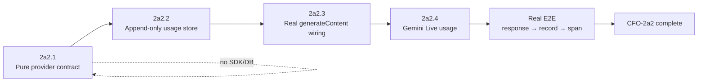
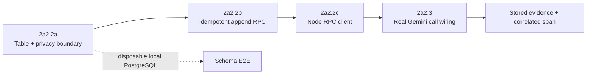

# Life Manager CFO-2a2 — Provider-Reported Usage and OpenTelemetry Contract

| Field | Value |
|---|---|
| Status | ACTIVE — CFO-2a2.1 verified; CFO-2a2.2a local-tested storage schema is next |
| Parent | `docs/superpowers/specs/2026-08-06-life-manager-cfo-design.md` |
| Runtime | Existing `apps/life-call` package |
| First provider | Gemini `generateContent` response |
| Role split | Sol plans and verifies; Luna writes production code/tests and runs implementation commands |

## 1. Goal

Turn Gemini's own `GenerateContentResponse.usageMetadata` into one deterministic, content-free usage evidence
record and the matching OpenTelemetry GenAI attributes. OpenTelemetry transports and correlates the facts; Gemini's
response is the source of the token numbers.

This child spec does not call a local tokenizer, infer tokens from duration, price tokens, or relabel existing
`lm_api_cost` estimates as measured.

## 2. Ponytail decision

Three approaches were evaluated:

1. **Chosen — contract first in the existing ledger module.** Add one pure
   `normalizeGeminiUsageEvidence(response, context)` function and two focused tests to the existing
   `ledger.js` / `ledger.test.js`. No dependency, SDK, collector, migration, or call-site changes.
2. Add the full OpenTelemetry SDK, OTLP exporter, database table, and all Gemini wiring now. Rejected because four
   independently failing boundaries would be introduced before the meaning of one token field is proven.
3. Store local tokenizer or duration estimates as measured usage. Rejected because transport does not improve
   evidence quality and this would make the CFO lie.

CFO-2a2.1 changes exactly two existing files. Soft target: at most 45 production additions and 55 test additions,
100 total. Exceeding the target, adding a third file, or adding a dependency means the slice must be reduced.

## 3. Full CFO-2a2 sequence



Only CFO-2a2.1 is active. Later slices cannot be pulled into its implementation.

## 4. CFO-2a2.1 input

`normalizeGeminiUsageEvidence(response, context)` consumes:

- `response.responseId`: non-empty provider response identity.
- `response.modelVersion`: non-empty provider-reported model.
- `response.usageMetadata.promptTokenCount`: non-negative safe integer.
- `response.usageMetadata.candidatesTokenCount`: non-negative safe integer.
- `response.usageMetadata.totalTokenCount`: non-negative safe integer.
- Optional non-negative safe integers: `cachedContentTokenCount`, `thoughtsTokenCount`,
  `toolUsePromptTokenCount`.
- Context: non-empty `owner_id`, exact `financial_unit_id: "life_manager_saas"`, RFC3339 `occurred_at`, exact requested model,
  and a non-zero 32-lowercase-hex `trace_id`.

Unknown response/context keys and all prompt, candidate, tool argument, or output content are ignored.

## 5. Closed output

```json
{
  "schema_version": 1,
  "provider": "gcp.gemini",
  "provider_request_id": "provider-response-id",
  "usage_sequence": 0,
  "occurred_at": "2026-08-10T01:02:03.000Z",
  "owner_id": "u1",
  "financial_unit_id": "life_manager_saas",
  "trace_id": "11111111111111111111111111111111",
  "request_model": "gemini-2.5-flash",
  "response_model": "gemini-2.5-flash-001",
  "tokens": {
    "input": 100,
    "output": 40,
    "cached_input": 20,
    "reasoning_output": 5,
    "tool_input": 3,
    "total": 148
  },
  "evidence_status": "provider_reported",
  "otel_attributes": {
    "gen_ai.operation.name": "generate_content",
    "gen_ai.provider.name": "gcp.gemini",
    "gen_ai.request.model": "gemini-2.5-flash",
    "gen_ai.response.id": "provider-response-id",
    "gen_ai.response.model": "gemini-2.5-flash-001",
    "gen_ai.usage.input_tokens": 100,
    "gen_ai.usage.output_tokens": 45,
    "gen_ai.usage.cache_read.input_tokens": 20,
    "gen_ai.usage.reasoning.output_tokens": 5,
    "server.address": "generativelanguage.googleapis.com",
    "server.port": 443
  }
}
```

`tokens.output` preserves Gemini's `candidatesTokenCount`. OpenTelemetry `output_tokens` includes the separately
reported reasoning count because the pinned GenAI convention says reasoning output is included in output tokens.
The provider's `totalTokenCount` is preserved independently and is not replaced by a locally recomputed total.
Missing optional provider fields become `null` in `tokens` and are omitted from `otel_attributes`; an explicit
provider zero remains zero. Because `server.address` is emitted, the pinned OpenTelemetry convention also requires
`server.port: 443` for the HTTPS endpoint.

## 6. Evidence and privacy rules

- `provider_reported` is allowed only when the exact provider response contains usage metadata and response ID.
- Duration-derived `gemini_live` rows remain `locally_estimated`; CFO-2a2 never backfills them as measured.
- The adapter is pure, deterministic, does not mutate inputs, and performs no I/O.
- Invalid or unsafe values throw only `cfo_provider_usage_invalid:<reason>`. Errors contain no IDs, token values,
  prompt text, candidate text, metadata, or secrets.
- No content-bearing OpenTelemetry attributes are emitted: no `gen_ai.input.messages`,
  `gen_ai.output.messages`, `gen_ai.system_instructions`, or tool arguments/results.

## 7. Acceptance criteria for CFO-2a2.1

- [x] One literal Gemini response maps to the exact closed record and exact OpenTelemetry attributes.
- [x] The record preserves provider input, candidate output, cached, reasoning, tool, and total counts without
      converting an absent count to zero.
- [x] The OpenTelemetry output count includes reported reasoning and fails on unsafe integer addition.
- [x] Provider response ID, requested model, response model, owner, fixed Life Manager financial unit, timestamp, and trace ID are
      validated; failures are fixed and redacted.
- [x] Unknown keys and content-shaped fields never enter the result or errors.
- [x] Inputs remain unchanged; repeated calls return deep-equal results.
- [x] Focused ledger tests and the CFO suite pass.

## 8. Deferred completion gates

CFO-2a2 remains unchecked in the parent until later child slices prove:

1. append-only deduplicated storage keyed by `(provider, provider_request_id, usage_sequence)`;
2. a real Gemini `generateContent` response writes one evidence record and correlates one actual span;
3. Gemini Live terminal `usageMetadata` is captured without relabeling historic duration estimates;
4. real readback shows no prompt/output content and exact provider token counts.

Write-attempt coverage and durable failure accounting remain CFO-2a2b. Billing/pricing remains CFO-2a3.

## 9. Pinned primary evidence

- [Google Gemini GenerateContentResponse](https://ai.google.dev/api/generate-content?hl=ja#UsageMetadata) —
  `usageMetadata` is output-only token-usage metadata; `responseId` identifies each response; prompt, candidates,
  cached, tool, thoughts, and total token fields are separately defined.
- [OpenTelemetry GenAI spans at commit 46d43c8](https://github.com/open-telemetry/semantic-conventions-genai/blob/46d43c8949afb53765a202e89f4534eeb75ca3fa/docs/gen-ai/gen-ai-spans.md) —
  operation/provider are required; response ID/model and provider usage attributes are recommended; content
  attributes are opt-in and sensitive.
- [OpenTelemetry Google GenAI reference scenario at commit 46d43c8](https://github.com/open-telemetry/semantic-conventions-genai/blob/46d43c8949afb53765a202e89f4534eeb75ca3fa/reference/scenarios/google-genai/scenario.py) —
  provider usage metadata maps to `gen_ai.usage.input_tokens` and `gen_ai.usage.output_tokens`.

## 10. CFO-2a2.1 completion evidence

- Luna implementation commits: `97a04baef1dd4bbc647d64835e41ca8c8deda4c6` and review fix
  `105922f65ba372ee967ef8748019d14e4681dbbe`.
- Initial RED: existing 10 tests passed and the two new tests failed only because the export did not exist.
- Review-fix RED: 11/12 passed; the sole failure was the missing conditionally required `server.port: 443`.
- Fresh Sol verification on the final head: focused 12/12, CFO 254/254, full suite 892/892, zero failures; syntax and
  diff checks passed.
- Ponytail gate: exactly two existing files; 43 production additions and 50 test additions, 93 total.
- Fresh final re-review: Critical 0, Important 0, ship.
- No I/O, dependency, OpenTelemetry SDK, collector, exporter, database, pricing, Gemini call-site, or Live behavior
  was added. Those remain explicit later slices, so CFO-2a2 itself remains active.

## 11. CFO-2a2.2 — append-only usage storage

CFO-2a2.2 is split so a database, RPC client, and provider call-site are never introduced in one batch:



### CFO-2a2.2a — only active slice

Add `public.lm_cfo_model_usage_evidence` as a structured table. Do not store a raw response or duplicated
`otel_attributes` JSON. Required columns are:

- opaque `public_ref`, owner `uid`, `financial_unit_id`, and `attribution_status`;
- `provider`, `provider_request_id`, `usage_sequence`, `occurred_at`, and 32-hex `trace_id`;
- requested/response model;
- required input/output/total token counts and nullable cached/reasoning/tool counts;
- `evidence_status` and `created_at`.

The dedupe identity is `(provider, provider_request_id, usage_sequence)`. All counts are non-negative `bigint`;
optional absence is SQL `NULL`, not zero. Provider totals are stored as given and are not constrained to equal a
locally recomputed component sum. Attribution is closed: `attributed` requires a non-null financial unit;
`unattributed` requires null.

The table is append-only. `service_role` receives only SELECT/INSERT; anon/authenticated/public receive nothing;
RLS has service-role SELECT/INSERT policies; an UPDATE/DELETE trigger rejects mutation even by a privileged writer.
CFO-2a2.2a creates no RPC, client, scheduler, exporter, or call-site and is not applied to production. It is verified
against a disposable local PostgreSQL instance. The later append RPC owns identical-retry and conflicting-retry
behavior; the schema's unique constraint owns concurrent dedupe.

Soft target: one migration, one dedicated static test, and one `test:cfo` script entry; at most three files and
100 added LOC total. If the privacy/append-only boundary cannot fit, reduce formatting before adding abstraction.

### CFO-2a2.2a acceptance

- [ ] The table has one non-null composite unique dedupe key and never stores raw content or generic metadata JSON.
- [ ] Required counts reject null/negative values; optional counts preserve null and explicit zero.
- [ ] Attribution state and financial-unit nullability cannot contradict each other.
- [ ] RLS, grants, and the trigger permit service SELECT/INSERT only and reject UPDATE/DELETE.
- [ ] A disposable local PostgreSQL E2E proves valid insert, duplicate rejection, invalid-count rejection, and
      append-only rejection without touching production.
- [ ] The focused migration test, CFO suite, and full suite pass.

### PostgreSQL evidence

- [Unique constraints](https://www.postgresql.org/docs/current/ddl-constraints.html#DDL-CONSTRAINTS-UNIQUE-CONSTRAINTS)
  — a multi-column unique constraint enforces uniqueness across the listed combination and creates a unique index.
- [Row security policies](https://www.postgresql.org/docs/current/ddl-rowsecurity.html) — after RLS is enabled,
  normal access requires an applicable policy; command- and role-specific policies separate SELECT from INSERT.
- [INSERT / ON CONFLICT](https://www.postgresql.org/docs/current/sql-insert.html) — later CFO-2a2.2b uses the unique
  key as its conflict arbiter; CFO-2a2.2a defines the invariant but adds no retry RPC.
