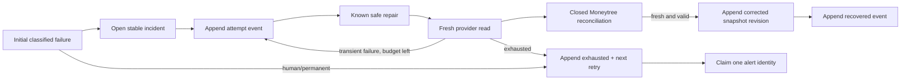

# Life Manager CFO-1g3 — Bounded Repair and Append-Only Corrections

| Field | Value |
|---|---|
| Status | APPROVED FOR IMPLEMENTATION |
| Parent SSOT | `docs/superpowers/specs/2026-08-06-life-manager-cfo-design.md` |
| Prior slice | CFO-1g2 reliable owner-local run and Telegram delivery identity |
| Scope | Moneytree transient repair, durable retry/alert state, snapshot corrections |
| Runtime | `apps/life-call`, local first |

## 1. Goal

CFO-1g3 turns a failed Moneytree read into one of two truthful outcomes:

1. `recovered`: a bounded safe repair is followed by a fresh provider read and the existing closed reconciliation
   contract; or
2. `action_required`: the repair budget is exhausted or the failure requires human/provider action, one alert
   identity is durably claimed, and a future retry remains scheduled.

A recovered value never rewrites revision 1. It appends revision 2 or later and points to the exact prior snapshot it
supersedes. No Telegram finance message is sent in this slice; CFO-1h remains the first real report-send milestone.

## 2. Ground Truth

- `lm_cfo_daily_runs` already owns one stable `(uid, reporting_date, run_id)`.
- `lm_cfo_daily_snapshots` is append-only but currently forces `revision = 1` and therefore cannot represent a
  correction.
- `buildCfoDailyReport` already emits `repair: null`; the Telegram renderer already rejects `recovered` unless both
  `freshReread` and `reconciled` are true.
- `composeMoneytreeRead` is the existing closed Moneytree source/state reconciliation boundary. CFO-1g3 reuses it.
- `lm_cfo_telegram_delivery_claims` dedupes one report kind/date/revision, but CFO-1g3 does not create a Telegram
  provider receipt or call Telegram.
- The connected live Moneytree path is interactive. CFO-1g3 proves orchestration and persistence with deterministic
  injected readers and isolated PostgreSQL; it does not invent a scheduled Moneytree credential.

## 3. Evidence and Decisions

- Google Cloud Storage retry guidance — https://cloud.google.com/storage/docs/retry-strategy?hl=ja  
  Core quote: “べき等なリクエストは…繰り返し実行できるため、毎回同じ最終状態になります。”  
  Decision: every repair/correction RPC has a stable identity and exact retry equality checks.
- AWS SDK retry behavior — https://docs.aws.amazon.com/sdkref/latest/guide/feature-retry-behavior.html  
  Core quote: “Standard mode retries failed requests using exponential backoff with jitter.”  
  Decision: retries are bounded and scheduled with deterministic lower bounds plus persisted jitter input; the
  orchestration function never sleeps.
- Kubernetes Jobs — https://kubernetes.io/docs/concepts/workloads/controllers/job/  
  Core quote: “set `.spec.backoffLimit` to specify the number of retries before considering a Job as failed.”  
  Decision: automatic repair has an explicit hard cap, after which the state changes to `action_required`.
- PostgreSQL constraints — https://www.postgresql.org/docs/current/ddl-constraints.html  
  Core quote: “Unique constraints ensure that the data contained in a column, or a group of columns, is unique.”  
  Decision: owner/date/revision, run/revision, prior-snapshot linkage, attempt number, and alert identity are enforced
  in PostgreSQL, not only in JavaScript.

## 4. Chosen Architecture



The implementation has four units:

1. A pure bounded repair orchestrator. It classifies only known failure codes, performs no persistence itself, and
   accepts effect functions through a closed options object.
2. An append-only repair ledger and alert claim in PostgreSQL. It records every attempt and future retry time without
   mutating prior evidence.
3. Append-only snapshot corrections. A correction is a new contiguous revision linked to the exact prior snapshot.
4. Strict PostgREST clients for repair events/alerts and corrected snapshots, using the shared CFO RPC validator.

### Rejected approaches

- Mutable `incident.status` and `snapshot.revision`: rejected because UPDATE destroys the history needed to prove
  which evidence and retry budget produced the result.
- In-memory retry counters/cooldowns: rejected because process restart loses the budget and can repeat alerts.
- Reusing a new random `run_id` for recovery: rejected because one owner-local run must retain one stable identity.
- Sending a real alert in CFO-1g3: rejected because CFO-1h is the explicit first real finance Telegram send gate.

## 5. Repair Contract

### Public interface

```js
runCfoMoneytreeRepair(input, options) => Promise<RepairOutcome>
```

`input` has exactly:

```js
{
  uid,                 // non-empty trimmed string, never returned
  reportingDate,       // YYYY-MM-DD
  runId,               // non-zero UUID
  incidentPublicRef,   // non-zero UUID from the repair-ledger claim
  failureClass         // closed enum below
}
```

`options` has exactly:

```js
{
  repairSafe,          // async ({ attempt, failureClass }) => undefined
  readFresh,           // async ({ attempt }) => MoneytreeRead
  recordAttempt,       // async closed event => closed event receipt
  claimAlert,          // async closed alert input => closed alert receipt
  now,                 // () => RFC3339 instant; injected for deterministic tests
  jitterUnit           // () => number in [0, 1); injected, never persisted as a secret
}
```

The closed `failureClass` enum is:

| Class | Automatic repair | Meaning |
|---|---:|---|
| `timeout` | yes | transport timed out before a valid response |
| `provider_unavailable` | yes | retryable provider 5xx/unavailable state |
| `safe_session_expired` | yes | a read-only session can be safely refreshed |
| `reconsent_required` | no | owner interaction is required |
| `permission_denied` | no | provider/operator configuration must change |
| `contract_mismatch` | no | payload/schema no longer satisfies the adapter contract |

The budget is fixed: at most two automatic repair actions and at most two fresh rereads after the initial failure.
There is no caller-controlled attempt limit. Attempt numbers are exactly `1` and `2`.

For each automatic attempt the order is:

1. persist `repair_started`;
2. execute the known safe repair;
3. execute a fresh provider read;
4. call `composeMoneytreeRead` again on the returned source/state;
5. require source/state IDs `moneytree_mufg`, fresh source, succeeded retrieval, valid consent, and no action requirement;
6. persist `recovered`; and
7. return a deeply frozen `recovered` outcome.

The orchestrator never accepts a cached pre-repair read. It calls `readFresh` itself after every safe repair. A repair
function returning success is not evidence of recovery.

### Repair outcomes

Recovered outcome keys are exactly:

```js
{
  status: "recovered",
  incidentPublicRef,
  attempt,
  moneytreeRead,
  repair: { sourceLabel: "Moneytree", freshReread: true, reconciled: true }
}
```

Action-required outcome keys are exactly:

```js
{
  status: "action_required",
  incidentPublicRef,
  attemptsExhausted,
  failureClass,
  nextRetryAt,
  alert: { publicRef, decision, createdAt }
}
```

`decision` is `notify`, `suppressed`, or `rearmed`. In CFO-1g3 only `notify` authorizes a later sender; it does not
send. `suppressed` means the same unresolved incident already owns the alert identity. `rearmed` is returned only
after a persisted recovery event followed by a new incident.

The next retry uses attempt-based delay floors of 5 minutes after attempt 1 and 30 minutes after attempt 2/exhaustion.
Persisted `next_retry_at` is `now + floor + floor*jitterUnit`, producing `[5m,10m)` or `[30m,60m)`. No `setTimeout`,
sleep, launchctl, cron, or scheduler mutation belongs in this slice.

All thrown errors use `cfo_moneytree_repair_failed:<fixed_code>`. Provider bodies, failure messages, UIDs, amounts,
account refs, tokens, URLs, stack traces, and callback values never enter the error.

## 6. Durable Repair Ledger

Migration: `apps/life-call/migrations/2026-08-10-cfo-repair-corrections.sql`.

### `lm_cfo_repair_incidents`

Append-only identity table:

- `public_ref uuid`, non-zero, unique;
- `uid text`, FK to `lm_users`;
- `reporting_date date`;
- `run_id uuid`;
- `source_id text`, exactly `moneytree_mufg`;
- `incident_no integer > 0`;
- `failure_class` closed to the six classes above;
- `created_at timestamptz`;
- unique `(uid, reporting_date, run_id, source_id, incident_no)`;
- FK `(uid, reporting_date, run_id)` to `lm_cfo_daily_runs`.

`lm_open_cfo_repair_incident(uid,date,run_id,source_id,incident_no,failure_class)` inserts or returns the exact same
incident. A retry with a different failure class conflicts.

### `lm_cfo_repair_events`

Append-only event table:

- exact incident FK by `incident_public_ref`;
- `attempt_no` is `0`, `1`, or `2`;
- `event_type` is `detected`, `repair_started`, `repair_failed`, `recovered`, or `exhausted`;
- `failure_class` is nullable only for `recovered`;
- `next_retry_at` is required only for `repair_failed` and `exhausted`;
- `created_at timestamptz`;
- unique `(incident_public_ref, attempt_no, event_type)`.

`lm_append_cfo_repair_event(...)` is idempotent only when every supplied value equals the existing row. Changed
failure class or retry time conflicts. It enforces monotonically valid transitions and refuses attempt 3.

### `lm_cfo_repair_alert_claims`

Append-only alert identity:

- one row per `incident_public_ref`;
- `public_ref uuid`, non-zero, unique;
- `created_at timestamptz`;
- no message text, amount, account reference, UID projection, or provider response.

`lm_claim_cfo_repair_alert(incident_public_ref)` requires an `exhausted` event. First call returns `notify`; an
identical retry returns `suppressed`. A later incident after recovery has its own public ref and can return `rearmed`.
The receipt projection is exactly `public_ref, incident_public_ref, decision, created_at`.

All three tables use RLS, service-role-only SELECT/INSERT, no app-role UPDATE/DELETE, append-only triggers, fixed
`search_path`, and exact no-private-key receipt projections.

## 7. Append-Only Snapshot Corrections

The migration changes `lm_cfo_daily_snapshots` without rewriting existing revision-1 rows:

- replace `CHECK (revision = 1)` with `CHECK (revision > 0)`;
- drop unique `(uid, reporting_date, run_id)` and add unique `(uid, reporting_date, run_id, revision)`;
- add nullable `supersedes_revision integer` and `supersedes_public_ref uuid`;
- add unique `(uid, reporting_date, revision, public_ref)` if not already present;
- add a self-FK `(uid, reporting_date, supersedes_revision, supersedes_public_ref)` to the exact prior row;
- require revision 1 to have both supersedes fields null;
- require revision N > 1 to have `supersedes_revision = N - 1` and a non-null prior public ref.

The existing `lm_append_cfo_daily_snapshot` remains revision-1-only. A new RPC is added:

```sql
lm_append_cfo_daily_snapshot_correction(
  p_uid text,
  p_reporting_date date,
  p_run_id uuid,
  p_supersedes_public_ref uuid,
  p_report_payload jsonb,
  p_source_bundle jsonb
) returns jsonb
```

Inside one transaction it locks the exact prior snapshot, requires the same owner/date/run, requires that prior row
to be the current highest revision, sets `revision = prior.revision + 1`, and inserts the new immutable row. Concurrent
corrections against one prior row yield one insert; an identical retry returns that exact row, while different payload
or source bundle raises `correction_conflict`.

Receipt keys are exactly:

```text
public_ref, reporting_date, run_id, revision,
supersedes_revision, supersedes_public_ref, created_at
```

The JS report builder gains a correction-only interface rather than broadening the initial builder:

```js
buildCfoCorrectedDailyReport({ reportingDate, revision, moneytreeRead, repair })
```

It requires integer `revision >= 2`, the exact recovered repair object, and a fresh reconciled Moneytree read. The
returned report uses existing Telegram schema with `state: "recovered"`, the supplied revision, and no action.

The store client adds:

```js
appendCfoDailySnapshotCorrection({
  uid, reportingDate, runId, supersedesPublicRef, revision, moneytreeRead, repair
}, { supaUrl, supaKey, fetchImpl })
```

It performs exactly one RPC, accepts only the exact seven-key receipt, requires exact echo of date/run/revision/prior
ref, uses built-in fetch by default, never retries internally, and emits only redacted fixed errors.

## 8. Privacy and Safety

- No raw Moneytree payload, amount, account number/ref, UID, credential, cookie, URL, exception message, or provider
  body appears in repair rows, alert receipts, logs, specs, model prompts, or thrown errors.
- Event rows store only class, bounded attempt, event type, and next retry time.
- All public JS inputs/options/receipts are exact closed plain objects; proxies, accessors, symbols, custom
  prototypes, non-enumerable keys, cycles, and changing getters fail closed.
- Returned outcomes and receipts are cloned and deeply frozen.
- No component in CFO-1g3 can send Telegram, trade, withdraw, transfer, pay, hire, publish, or change launchctl.
- Unknown or stale data never becomes zero, `complete`, or `recovered`.

## 9. Verification Matrix

| Proof | Required evidence |
|---|---|
| Repair RED/GREEN | Initial transient failure; repair success alone cannot recover; only fresh reread plus reconciliation recovers |
| Hard budget | Exactly two repair actions/fresh reads maximum; attempt 3 is impossible in JS and SQL |
| Failure classes | Three transient classes may repair; three human/permanent classes claim alert without repair |
| Durable retry | Exact retry times stored; same event is idempotent; changed retry time conflicts |
| Alert dedupe | Concurrent/serial claims for one exhausted incident produce one `notify`, others `suppressed` |
| Alert rearm | Persisted recovery followed by a new incident can produce one new alert identity |
| Correction | Revision 2 supersedes exact revision 1; revision 3 supersedes exact revision 2 |
| Correction concurrency | Two corrections against one prior snapshot create exactly one new revision |
| Correction retry | Identical retry returns same receipt; changed payload/source/prior ref conflicts |
| Immutability | UPDATE/DELETE denied by grants and triggers for snapshots, incidents, events, alerts |
| Tenant isolation | Cross-owner run, incident, prior snapshot, and alert references are rejected |
| Privacy | stdout/errors/receipts contain no UID, amount, account ref, source payload, secret, URL, or provider body |
| Regression | `npm run test:cfo`, reliable PostgreSQL proof, full `npm test`, and `git diff --check` exit 0 |

The isolated PostgreSQL test's final stdout is exactly `cfo-repair-corrections-postgres: PASS`.

## 10. Live Boundary and Completion

After all local tests and fresh review are clean, apply the additive migration once through the existing Supabase
Management API `database-query` endpoint and run `NOTIFY pgrst, 'reload schema'`. The no-echo live check may:

- inspect installed tables/functions/constraints/privileges;
- open one synthetic repair incident only if it uses a dedicated non-owner fixture created and removed inside one
  rolled-back transaction; and
- read existing live snapshot metadata through private variables.

It must not create a live correction, alert claim, Telegram call, provider read, or owner-visible side effect.
Correction and alert concurrency are proven only in isolated PostgreSQL.

Exact live stdout keys are:

```text
migrationSuccess, schemaReloadSuccess, repairSchemaInstalled,
correctionSchemaInstalled, privilegesClosed, liveCorrectionsCreated,
liveAlertsCreated, payloadPrivacy
```

All booleans are true. `liveCorrectionsCreated` and `liveAlertsCreated` are integer `0`.

CFO-1g3 completes when:

- test matrix rows 4, 29, and 30 have implementation evidence;
- local focused/CFO/full/PostgreSQL verification passes;
- the no-side-effect live schema check passes;
- a fresh scoped final review has no Critical or Important findings;
- parent/child SSOTs record `CFO-1g3 COMPLETE — CFO-1h2 NEXT`; and
- every commit is pushed to `canonical/feature/cfo-moneytree-daily-report`.

