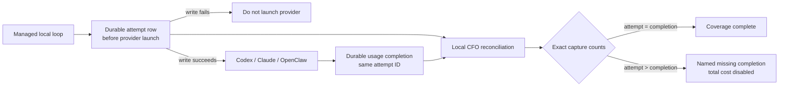

# CFO-2a2b — Durable Agent-Usage Capture Design

| Field | Value |
|---|---|
| Status | ACTIVE — CFO-2a2b.1a/1b/2/3a/3b/4/5a/5b complete; CFO-2a2b.5c two-source cutover is next |
| Method | Ponytail `full` → Superpowers Goal/Loop/Verify/State |
| Roles | Sol plans/specifies/verifies; Luna writes production code/tests |
| Runtime | Local JSONL first; no DB, service, browser, or cloud dependency |

## Goal

Prove exactly how many managed agent attempts started, succeeded, failed, or lost their usage completion. A missing
usage write becomes a named coverage gap, never zero tokens or zero cost. This slice does not price tokens or enable a
total-cost label.



## Measured starting truth

The real audit found valid historical rows but also reused runner event IDs and no durable proof that every provider
attempt produced a completion. Historical usage remains measured evidence; write-attempt coverage begins only at the
first valid write-ahead row. Existing evidence directories are per-run artifacts and cannot prove historical capture.

## Ponytail full decision

- Reuse the shared `agent_runner.py`, its locked `0600` JSONL append+flush+fsync writer, the current usage ledger,
  normalized usage ingestion, and local hourly CFO loop.
- Add only one adjacent append-only `agent-usage-attempts.jsonl`. Each row gets a new random 24-hex `event_id`; its
  completion row reuses that exact ID.
- Do not add Supabase, a queue, daemon, database, browser automation, raw session rescanning, another agent, custom OTel
  exporter, pricing, retry orchestration, or dashboard.
- OTel correlates verified reconciliation later; it is not token truth and cannot repair a missing producer write.

## Exact local contracts

### Attempt row

One line is fsynced before any provider process can launch:

```json
{"version":1,"event_id":"<24 lowercase hex>","timestamp":"<UTC ISO-8601>","loop":"<nonempty>","task_label":"<nonempty>","attempt":1,"provider":"<nonempty>","model":"<nonempty>"}
```

- Default beside the usage ledger as `agent-usage-attempts.jsonl`; test/owner override is
  `ANICCA_USAGE_ATTEMPT_LEDGER`.
- Attempt and usage ledger paths must differ.
- `loop`, `task_label`, and every candidate `provider`/`model` must be non-empty strings. Reject invalid values before
  evidence-directory, budget, ledger, provider, or fallback effects.
- Attempt append failure returns a fixed redacted nonzero error and launches no provider or fallback.
- A current budget reservation is settled at zero because no provider call occurred.

### Completion usage row

The existing schema stays unchanged except `event_id` becomes the attempt ID. Success and failure both write
completions. Required token fields are non-negative integers. An absent optional token field keeps its documented
default; a present boolean, negative, fractional, non-numeric, or otherwise invalid field makes token measurement
unavailable with every token field null. A present invalid provider cost becomes null/unavailable without discarding
otherwise valid tokens. Completion-write failure remains visible and leaves the durable attempt unmatched.

### Reconciliation result

For rows at or after the capture cutover, the consumer validates both schemas and reports exact integer counts:

- `attempted_rows`
- `success_rows`
- `failed_rows`
- `missing_completion_rows`
- `duplicate_attempt_rows`
- `conflicting_attempt_rows`
- `unmatched_completion_rows`
- `ambiguous_completion_rows`

`success_rows + failed_rows + missing_completion_rows = attempted_rows` must hold. Missing, duplicate, conflicting,
ambiguous, malformed, truncated, or unread evidence adds a named coverage exception. A nonempty upstream usage-chain
coverage array adds `usage_chain_incomplete`. Until all required sources are fresh and every exception is zero, no
total-cost label is allowed. Plan: `2026-08-11-life-manager-cfo-agent-usage-capture-reconciliation.md`.

## One-at-a-time delivery

- [x] **CFO-2a2b.1a — numeric truth:** absent optional values remain defaults; present invalid values are unavailable.
      Producer commit: `82a3b349`.
- [x] **CFO-2a2b.1b — producer boundary:** write-ahead attempt row and focused real-runner tests. Producer commits:
      `ef233a90` + `a0fe0c35`; 2 files, `+83/-9`; fresh Sol review: ship.
- [x] **CFO-2a2b.2 — pure reconciliation:** strict local attempt/usage join and immutable counts receipt. Commit
      `ea3f87408`; 3 files, `+92/-1`; focused 7/7; CFO 297/297; fresh Sol review: ship.
- [x] **CFO-2a2b.3a — hourly gap gate:** fixed capture exception names now flow through the existing receipt/span;
      forced missing completion stays `missing_completion`. Commit `75d699597`; 3 files, +45 LOC; CFO 301/301; ship.
- [x] **CFO-2a2b.3b — hourly exact counts:** exact capture envelopes and aggregate counts follow the gap gate.
      If either capture source is unavailable, every aggregate is null; never publish a partial subtotal or fake zero.
      Commit `1370b19`; 3 files, +42 LOC; focused 9/9, related 20/20, CFO 302/302, full pass; fresh Sol: ship.
      Plan: `2026-08-11-life-manager-cfo-agent-usage-capture-hourly-counts.md`.
- [x] **CFO-2a2b.4 — real current-state E2E:** verified real ledgers remain append-only and ran isolated provider-boundary
      probe without a paid provider, and report the current missing attempt ledgers as `capture_not_started`, not ready.
      Commit `7e79c33`; E2E twice; producer boundaries 2/2; CFO 302/302; full pass; one file `+7/-6`; fresh Sol: ship.
      Plan: `2026-08-11-life-manager-cfo-agent-usage-capture-real-e2e.md`.
- [x] **CFO-2a2b.5a — active numeric truth:** ported reviewed numeric behavior onto the newer active runner without
      replacing its later Hermes fixes. Active commit `5ca6c00`; 2 files, +56; focused 1/1, telemetry 8/8, Hermes 3/3;
      fresh Sol: ship. Plan: `2026-08-11-life-manager-cfo-active-runner-numeric-truth.md`.
- [x] **CFO-2a2b.5b — active attempt/completion cutover:** port reviewed commits `ef233a90` + `a0fe0c35`, then require
      a newly triggered real managed loop to write a new attempt and same-ID completion before CFO calls capture ready.
      Do not infer rollout from a feature branch. Plan:
      `2026-08-11-life-manager-cfo-active-runner-attempt-cutover.md`.
- [ ] **CFO-2a2b.5c — truthful two-source cutover:** make one existing Life Manager-owned safe managed loop write to
      the Life Manager usage/attempt pair, update the real E2E from its obsolete both-ledgers-absent premise, and prove
      both source prefixes remain append-only. Do not write a bounty canary into the Life Manager source and do not
      call capture ready while either source has a named exception.

## Acceptance gates

1. Attempt-ledger failure launches no provider.
2. Successful and failed attempts each have one attempt row and one same-ID completion.
3. Forced usage-ledger failure leaves one unmatched attempt and never becomes zero usage/cost.
4. Missing optional numerics use documented defaults; present invalid values become unavailable/null, never coerced.
5. Duplicate/conflicting rows cannot increase totals.
6. Source ledgers remain append-only `0600`; tests emit no prompt, output, token value, path, credential, or owner.
7. Each implementation slice uses at most three files and no more than 100 gross added LOC; new CFO tests are
   registered in the durable `test:cfo` command.
