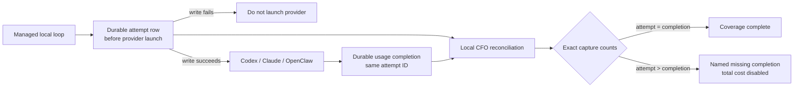

# CFO-2a2b — Durable Agent-Usage Capture Design

| Field | Value |
|---|---|
| Status | ACTIVE — CFO-2a2b.1a strict provider numerics is next |
| Method | Ponytail `full` → Superpowers Goal/Loop/Verify/State |
| Roles | Sol plans/specifies/verifies; Luna writes production code/tests |
| Runtime | Local JSONL first; no DB, service, browser, or cloud dependency |

## Goal

Prove exactly how many managed agent attempts started, succeeded, failed, or lost their usage completion. A missing
usage write must become a named coverage gap, never zero tokens or zero cost. This slice does not price tokens and does
not enable a total-cost label.



## Measured starting truth

The two real append-only usage ledgers contained 5,006 rows during the audit: 4,690 success and 316 failure;
4,722 provider-reported and 284 unavailable. No row contained a negative, fractional, or non-numeric non-null token
field. The ledgers contained 437 duplicated runner event-ID groups because the old ID was derived from a reusable
evidence-directory path plus attempt index. Current evidence `attempts.jsonl` files are per-run artifacts and may be
replaced when a directory is reused; they cannot prove complete historical capture. No observed current artifact had a
`telemetry_error`, but absence there cannot prove that an unrecorded usage attempt never occurred. A fresh code review
also proved that optional provider token fields currently use `invalid -> 0` in several branches; the real rows happen
to be valid, but the parser contract is not yet truth-preserving.

## Ponytail full decision

- **Reuse:** the existing shared `agent_runner.py`, its locked `0600` JSONL append+flush+fsync writer, the current usage
  ledger, current normalized usage ingestion, and local hourly CFO loop.
- **Add only what is missing:** one adjacent append-only `agent-usage-attempts.jsonl` write-ahead ledger. Each row gets a
  new random 24-hex `event_id`; the completion usage row reuses that exact ID.
- **Do not build:** Supabase tables/RPCs, a queue, daemon, database, browser automation, raw session-log rescanning,
  another agent, a custom OTel exporter, pricing, retry orchestration, or a dashboard.
- **OTel boundary:** OTel correlates a verified reconciliation later; it is not the source of token truth and cannot
  make a missing producer write accurate.
- **Historical boundary:** capture coverage begins at the first valid write-ahead row. Older usage rows remain usable
  as measured usage evidence but are explicitly outside write-attempt coverage; they are not invented as covered.

## Exact local contracts

### Attempt row

One line is fsynced before any provider process can launch:

```json
{"version":1,"event_id":"<24 lowercase hex>","timestamp":"<UTC ISO-8601>","loop":"<nonempty>","task_label":"<nonempty>","attempt":1,"provider":"<nonempty>","model":"<nonempty>"}
```

- Default path: the usage ledger's directory plus `agent-usage-attempts.jsonl`.
- Test/owner override: `ANICCA_USAGE_ATTEMPT_LEDGER`.
- Attempt and usage ledger paths must differ.
- If the attempt append fails, return a fixed redacted nonzero error and launch no provider. Do not fall back to another
  provider while the capture boundary is broken.
- A budget reservation made before this failure is settled at zero; no nonexistent provider call consumes the budget.

### Completion usage row

The existing usage schema remains unchanged except that `event_id` is the new attempt ID. Success and failure both
write completions. Required token fields must be non-negative integers. An absent optional token field uses its
documented zero/derived default; an optional field that is present but boolean, negative, fractional, non-numeric, or
otherwise invalid makes `measurement=unavailable` and every token field `null`. A present invalid provider cost becomes
`provider_cost_usd=null` and `cost_basis=unavailable`; it never corrupts otherwise valid token evidence. A completion
append failure remains locally visible in the run evidence and leaves its durable attempt unmatched for CFO
reconciliation.

### Reconciliation result

For rows at or after the capture cutover, the consumer validates both schemas and reports exact integer counts:

- `attempted_rows`
- `success_rows`
- `failed_rows`
- `missing_completion_rows`
- `duplicate_attempt_rows`
- `conflicting_attempt_rows`
- `invalid_numeric_rows`

`success_rows + failed_rows + missing_completion_rows = attempted_rows` must hold. Any missing, duplicate,
conflicting, malformed, truncated, or unread source adds a named coverage exception. Until every required source is
fresh and `missing_completion_rows=0`, no total-cost label is allowed.

## One-at-a-time delivery

- [ ] **CFO-2a2b.1a — numeric truth:** Luna distinguishes absent optional values from present invalid values for all
      supported provider payloads.
- [ ] **CFO-2a2b.1b — producer boundary:** Luna adds the write-ahead attempt row and focused real-runner tests.
- [ ] **CFO-2a2b.2 — pure reconciliation:** Luna adds the strict local attempt/usage join and immutable counts receipt.
- [ ] **CFO-2a2b.3 — hourly publication:** Luna wires the receipt into the existing one-hour loop and proves a forced
      usage persistence failure appears as missing coverage, never zero cost or a green/complete total.
- [ ] **CFO-2a2b.4 — real E2E and close:** Sol verifies the two real ledgers are unchanged, runs one isolated real
      provider-boundary probe without a paid provider, obtains fresh review, updates the parent SSOT, commits, pushes,
      and sends one counts-only Telegram milestone.

## Acceptance gates

1. Attempt-ledger failure launches no provider.
2. Successful and failed provider attempts each have one attempt row and one same-ID usage completion.
3. Forced usage-ledger failure leaves one durable unmatched attempt and never becomes zero usage/cost.
4. Missing optional numerics use documented defaults; present invalid token numerics become unavailable/null and
   present invalid provider cost becomes null/unavailable, never coerced.
5. Duplicate/conflicting rows cannot increase totals.
6. Source ledgers remain append-only `0600`, and tests emit no prompt, output, token value, path, credential, or owner.
7. Each implementation slice stays at no more than three files and targets under 100 added LOC. Scope is reduced before
   exceeding either target.
