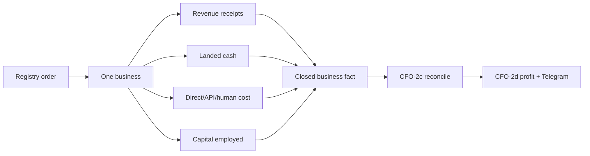
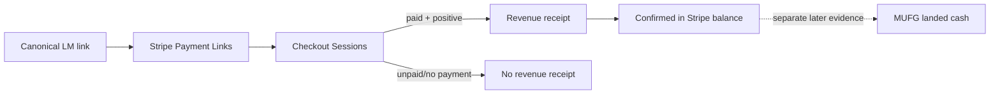

# Life Manager CFO-2b — Business Instrumentation

| Field | Value |
|---|---|
| Status | ACTIVE — `CFO-2b.1c` is the only active slice |
| Parent | `docs/superpowers/specs/2026-08-06-life-manager-cfo-design.md` |
| Runtime | Local `apps/life-call`; existing ledgers and provider APIs only |
| Role split | Sol specifies/verifies; Luna implements production code/tests |

## 1. Goal

Instrument every financial unit in registry order without turning missing evidence into zero. Each unit eventually
produces the same business fact: revenue receipts, landed cash, direct cost, token usage, API cost, human cost,
capital employed, and coverage. `CFO-2c` reconciles those facts; only then may `CFO-2d` publish profit or ROI.

## 2. Ponytail decision

Reuse the existing registry, `lm_agent_earnings`, Stripe, provider-billing, and usage ledgers. Do not add a database,
generic accounting framework, dashboard, or Telegram business screen in CFO-2b. Each slice changes at most three
files and targets at most 100 added lines. A slice that exceeds either bound is split before Luna starts.



## 3. Ordered work

Only the first unchecked item is active.

- [ ] **CFO-2b.1 — Life Manager**
  - [x] **2b.1a** Normalize finalized TaskMarket/uGig external settlements already stored in `lm_agent_earnings`.
  - [x] **2b.1b** Read the canonical Life Manager Stripe Payment Link and normalize paid Checkout receipts; a paid
        Checkout balance is not bank-landed cash.
  - [ ] **2b.1c** Reconcile Stripe refunds/disputes/fees/payout state, then compose revenue coverage with existing
        direct-cost, provider-usage, subscription, human-cost, and capital coverage. Unknown stays null; shared
        subscription cost waits for `CFO-2a3b` allocation.
- [ ] **CFO-2b.2 — Anicca iOS**: Apple/RevenueCat receipts, payout state, attributed API cost.
- [ ] **CFO-2b.3 — Writer Agent**: publisher receipts and its measured runtime cost.
- [ ] **CFO-2b.4 — Affiliate Agent**: network commission receipts and runtime cost.
- [ ] **CFO-2b.5 — Gig Work**: marketplace/client receipts; never import `~/gig/earnings.jsonl` without receipt proof.
- [ ] **CFO-2b.6 — x402 Services**: finalized external on-chain sales; self-transfers are excluded.
- [ ] **CFO-2b.7 — Employment Income**: payroll/bank receipt, kept as personal income rather than business revenue.
- [ ] **CFO-2b.8 — Capafy Marketplace**: landed sales receipts and costs.
- [ ] **CFO-2b.9 — Proprietary Investing**: realized reconciled P&L only; deposits/internal moves are excluded.

## 4. Current measured truth

- The canonical Life Manager Stripe link resolves to six Checkout Sessions and zero paid sessions. This is a
  confirmed zero only for that channel and observation, not a claim that the whole business earned zero.
- The live append-only `lm_agent_earnings` table contains two rows: one `x402_sale` external income and one
  `polymarket_cycle` realized loss. Neither belongs to Life Manager.
- Life Manager's canonical ledger producers use `source=taskmarket_work` and `source=ugig_work`. Both write only
  after an external finalized on-chain receipt. No matching live row exists now, so 2b.1a's real E2E must return an
  empty receipt list, not a fabricated zero-money receipt.
- Existing Life Manager cost and token evidence is real but incomplete. Confirmed Anthropic subscription cash cost
  is shared until the versioned allocation gate closes; it is not silently charged 100% to Life Manager.

## 5. CFO-2b.1a exact contract

`normalizeLifeManagerEarningReceipt(row)` accepts one plain `lm_agent_earnings` row only when all of these are true:

- `kind=financial_external_income`;
- `source` is exactly `taskmarket_work` or `ugig_work`;
- `public_ref` is a UUID, `occurred_at` is a valid timestamp, and `tx_hash` is a supported non-empty chain receipt;
- `currency=USD`, `amount_atomic` is either the producers' canonical positive decimal string or a positive safe
  integer returned by a JSON database client, `amount_decimals` is an integer from 0 through 6, and `amount_minor`
  is null. Numeric input above JavaScript's safe-integer boundary fails closed; it is never rounded;
- `meta.finalized=true` and `meta.external=true`.

It returns exactly:

```json
{
  "schema_version": 1,
  "financial_unit_id": "life_manager_saas",
  "source_ledger": "lm_agent_earnings",
  "source_event_id": "lm_agent_earnings:<public_ref>",
  "channel_id": "taskmarket_life_manager",
  "occurred_at": "2026-08-11T01:02:03.000Z",
  "amount": { "atomic": "2500000", "decimals": 6, "currency": "USD" },
  "landed_cash_status": "confirmed_agent_wallet",
  "evidence_status": "onchain_finalized_external_settlement"
}
```

`ugig_work` maps only to `ugig_life_manager`. Wallet, transaction hash, entry key, metadata, payer, prompt, and any
unknown input field never leave this boundary. Invalid input throws only
`cfo_life_manager_earning_invalid:<fixed_reason>`. The function is pure, freezes its output, and does no I/O.

## 6. Acceptance for 2b.1a

- [x] Exact TaskMarket and uGig fixtures map to the two canonical Life Manager channels.
- [x] A compact money-truth regression covers another business source, non-external/non-finalized settlement,
      zero/unsafe/ambiguous amount, and malformed identity. All fail closed without leakage; privacy-sensitive and
      unknown source fields are accepted only as input evidence and are stripped from the closed result.
- [x] Inputs are unchanged; output and nested amount are frozen and contain only the nine documented keys.
- [x] The real read-only filtered ledger query succeeds and returns the observed empty list without claiming whole-
      business revenue zero.
- [x] Focused, CFO, and full tests pass; scope is at most three files and 100 additions; commit and push succeed.

## 7. CFO-2b.1a completion evidence

- Code commit `58ba18903` implements the exact privacy-safe receipt boundary in three files with 85 gross additions.
- Focused 4/4, CFO 337/337, and the full `apps/life-call` suite pass; syntax and `git diff --check` pass.
- Fresh Sol review is `ship` after two real prefix-spoof privacy regressions were fixed with an internal `WeakSet`
  origin tag. Direct and nested hostile Proxy failures now return only the fixed `invalid_input` error.
- Real read-only PostgREST E2E returned HTTP 200, zero matching TaskMarket/uGig source rows, zero normalized receipts,
  `whole_business_zero_claimed=false`, and no private field escape. This proves the current channel observation without
  manufacturing a zero-value revenue receipt.
- No database, provider, local-state, launchd, Telegram, or external-system write occurred.

## 8. CFO-2b.1b contract — Stripe paid Checkout receipts

Extend the existing Life Manager earning module with one read-only
`collectLifeManagerStripeReceipts({ stripeKey, paymentLinkUrl, fetchImpl })` source. It paginates Stripe Payment Links,
matches exactly the canonical `https://buy.stripe.com/<slug>` URL, then paginates only that link's Checkout Sessions.
It performs no write, retry, clock read, environment read, log, or customer-data persistence.



The closed collection result is:

```json
{
  "schema_version": 1,
  "financial_unit_id": "life_manager_saas",
  "channel_id": "stripe_life_manager",
  "status": "covered",
  "receipt_count": 1,
  "zero_value_paid_count": 0,
  "reversal_coverage_status": "unknown",
  "receipts": [{
    "source_event_id": "stripe_checkout:<opaque session id>",
    "occurred_at": "2026-08-11T01:02:03.000Z",
    "amount": { "minor": "2000", "currency": "USD" },
    "recognition_status": "gross_inflow_unreconciled",
    "landed_cash_status": "confirmed_stripe_balance",
    "bank_landed_status": "unknown",
    "evidence_status": "provider_reported"
  }],
  "evidence_status": "provider_reported"
}
```

Rules:

- Only `payment_status=paid`, `status=complete`, live-mode sessions for the matched Payment Link are gross external
  payment receipts. They are not net revenue or contribution profit before reversal reconciliation.
- Decision order is fixed. Every session first requires a valid opaque ID, the matched link ID, live mode, and known
  Checkout/payment status. Only `payment_status=paid` then requires `status=complete`, valid creation time, a
  non-negative safe-integer `amount_total`, and lowercase ISO-3 currency. A paid zero-value trial increments
  `zero_value_paid_count` and never becomes revenue. `unpaid` and `no_payment_required` create no receipt and may have
  null amount/currency; the collector does not reject those valid ignorable shapes.
- Currency is provider lowercase ISO-3 and becomes uppercase. Session creation seconds become canonical UTC.
- Duplicate session IDs, conflicting link IDs, malformed pages, pagination beyond 100 pages, network/JSON failures,
  unsafe money, or invalid required fields fail closed with fixed redacted errors and no retry.
- Customer, email, address, phone, client reference, payment intent, URL, metadata, and raw provider objects are never
  copied to output or errors. Receipts sort deterministically by time then opaque source-event ID and are frozen.
- `confirmed_stripe_balance` is not MUFG arrival. `bank_landed_status` remains `unknown` until a payout and bank receipt
  are reconciled in a later slice. Refunds, disputes, fees, net, and payout state are deferred to 2b.1c rather than
  inferred. Until then `reversal_coverage_status=unknown` and every receipt is `gross_inflow_unreconciled`; CFO-2b.1b
  alone cannot enable a business revenue total, profit, ROI, or allocation decision.

Current real acceptance: 54 active Payment Links fit one page; the canonical Life Manager link has six sessions, all
`unpaid`, so the correct result is `status=covered`, `receipt_count=0`, and no whole-business zero-revenue claim.

### CFO-2b.1b completion evidence

- Code commit `4ba765dff` adds the paginated read-only Stripe collector in the existing two files with 62 gross
  additions and no dependency, database, scheduler, state, or Telegram change.
- Focused 6/6, CFO 339/339, and the full `apps/life-call` suite pass; syntax, diff, exact two-file scope, and the
  100-line gate pass. Fresh Sol review is `ship` with no Critical/Important finding.
- Real live-key read-only E2E made two GETs: one Payment Links page and one canonical Sessions page. It observed six
  `unpaid` sessions, returned `status=covered`, zero gross receipts, zero paid-zero observations, reversal coverage
  `unknown`, and no forbidden field escape. No ID, amount, URL, customer, email, or raw provider object was printed.
- The result cannot enable revenue, profit, ROI, or capital advice: every future paid receipt is explicitly gross and
  unreconciled until 2b.1c reads refunds/disputes/fees/payout evidence.

## 9. Source decisions

- Stripe Checkout Session object: `payment_status=paid` means funds are available in the Stripe account, not the
  owner's bank. https://docs.stripe.com/api/checkout/sessions/object
- Stripe Balance Transaction object: amount, fee, and net represent movement through the Stripe balance.
  https://docs.stripe.com/api/balance_transactions/object
- Stripe payout reconciliation: bank payout reconciliation is a separate evidence step.
  https://docs.stripe.com/payouts/reconciliation?locale=ja-JP
