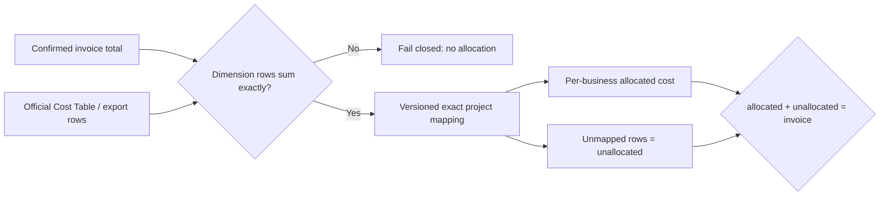

# Life Manager CFO — Provider Dimensions and Allocation

| Field | Value |
|---|---|
| Status | ACTIVE — CFO-2a3b.1 pure allocation contract is first |
| Parent | `docs/superpowers/specs/2026-08-06-life-manager-cfo-design.md` |
| Runtime | Local first; no new DB, scheduler, or cloud export in the first slice |
| Confirmed source | Existing immutable Google Cloud invoice total from CFO-2a3 |
| Dimension source | Official Cost Table CSV first; existing standard BigQuery export only when actually available |
| First unfinished item | **CFO-2a3b.1: allocate already-normalized official rows and preserve an exact unallocated remainder** |

## 1. Goal

Turn provider-supported project/service/SKU rows into truthful per-business cost only after their exact signed sum
matches the already-confirmed invoice total. Every row not covered by an explicit versioned project mapping remains
visible in `unallocated`; names, token estimates, and model guesses never allocate money.

## 2. Measured truth and official evidence

- **Google Cloud Cost table** — https://cloud.google.com/billing/docs/how-to/cost-table  
  Core quote: “the Cost table report totals match your invoice or statement totals” when default filters are used.  
  It provides project-level details plus service IDs and SKU IDs, and the report is downloadable as CSV.
- **Cost table CSV rules** — https://cloud.google.com/billing/docs/how-to/cost-table#download-to-csv  
  Core quote: “only the columns that you've selected to view are downloaded.”  
  Decision: ingestion must prove default filters, required columns, invoice period, and total; a random filtered CSV
  cannot become confirmed allocation evidence.
- **Standard usage export schema** —
  https://cloud.google.com/billing/docs/how-to/export-data-bigquery-tables/standard-usage?hl=ja  
  Core quote: “`invoice.month` ... このフィールドを使用して、請求書の合計金額を取得できます。”  
  Official fields include project, service, SKU, cost type, cost, currency, and invoice month.
- **Export availability** — https://cloud.google.com/billing/docs/how-to/export-data-bigquery-tables?hl=ja  
  Core quote: “データが現在の使用料データに追いつくまでに最大 5 日ほどかかることがあります。”  
  Decision: do not create BigQuery infrastructure merely to unit-test allocation.
- **Public Cloud Billing v1 discovery** — https://cloudbilling.googleapis.com/$discovery/rest?version=v1  
  Measured resources expose accounts/projects/services but no account-cost-row or billing-export configuration API.
- **Local observation:** one active gcloud credential, one active project, and one open billing account exist; there
  are zero BigQuery datasets and zero billing-export tables. The logged-in Cloak profile redirected Cost Table to a
  password reauthentication page with no saved value. The probe tab was closed and its browser lease released.

## 3. Ponytail full decision

1. **Do not build in CFO-2a3b.1:** CSV parser, browser robot, BigQuery dataset/export, SQL, DB, generic allocation
   framework, scheduler, retry, OpenTelemetry fields, Telegram wording, or UI.
2. **Reuse:** the existing confirmed invoice contract and exact decimal-string arithmetic style in
   `cfo-provider-billing-reconciliation.js`.
3. **Native:** one pure deterministic function in the existing module; no dependency and no I/O.
4. **No guessing:** no allocation by project/service/SKU display name, token count, model name, percentage estimate,
   or fuzzy match. Only an exact versioned `project_ref -> business_id` mapping allocates a row.
5. **No hidden remainder:** null or unmapped project rows, taxes/adjustments not tied to a mapped project, and any
   other valid unmatched row remain in the exact unallocated total.

## 4. Ordered delivery

- [ ] **CFO-2a3b.1 — Pure allocation contract.** Accept an existing confirmed invoice, already-normalized official
      dimension rows, and one explicit versioned project mapping. Require exact invoice equality and return exact
      per-business allocation plus the visible unallocated remainder.
- [ ] **CFO-2a3b.2 — Real dimension source.** After a real source is reachable, acquire one unfiltered Cost Table CSV
      or an already-enabled standard export, inspect its actual schema, normalize only observed required fields, and
      append immutable private evidence. Do not infer a parser from documentation alone.
- [ ] **CFO-2a3b.3 — Real E2E and hourly counts.** Prove source rows equal the confirmed invoice, prove allocation
      conservation and rerun dedupe, then expose only safe allocation coverage/count status through the existing
      hourly loop. Telegram money wording remains CFO-2d2.

## 5. CFO-2a3b.1 contract

Add one exported pure `allocateProviderBilling(confirmed, rows, policy)` function to the existing reconciliation
module. It accepts:

- the exact existing confirmed Google invoice record;
- normalized rows with exact keys: `billing_period`, nullable hashed `project_ref`, nullable hashed `service_ref`,
  nullable hashed `sku_ref`, provider `cost_type`, signed canonical decimal-string `amount`, `currency`, and hashed
  `source_row_ref`;
- a policy with exact keys `{ version, mappings }`, where `version` is a positive safe integer and every mapping has
  exact keys `{ project_ref, business_id }`.

Rules:

1. Confirmed record, rows, and policy are exact plain data; Proxy/accessor/symbol/custom-prototype input fails with a
   fixed redacted error.
2. Every row has the same invoice month and currency as the confirmed record. Hash references use `sha256:` plus 64
   lowercase hex characters. Amounts are canonical signed decimal strings; binary floating point is forbidden.
3. The exact sum of all rows must equal the confirmed invoice amount before any mapping runs. Mismatch fails closed
   and returns no business allocation.
4. Policy version and project mapping are explicit and duplicate-free. A row allocates only on exact `project_ref`;
   null or unmatched project remains unallocated. Service/SKU are retained evidence dimensions, never fuzzy keys.
5. Business results are deterministically sorted by `business_id`. Output is deeply frozen and has exact keys
   `schema_version`, `status`, `billing_period`, `currency`, `policy_version`, `account_total`, `allocated_total`,
   `unallocated_total`, `row_count`, `allocated_row_count`, `unallocated_row_count`, `businesses`, and
   `evidence_status`. `status` is `allocated`; `evidence_status` is `provider_billed_allocated`; each business has
   exact keys `{ business_id, amount }`. Exact conservation is mandatory:
   `allocated_total + unallocated_total = account_total`.
6. Output evidence is `provider_billed_allocated`; it never upgrades row evidence or changes the immutable confirmed
   invoice. Input is never mutated. Every invalid allocation input—including total mismatch—throws only
   `cfo_provider_billing_invalid:invalid_allocation`; errors never include an input value.

## 6. Implementation budget

| Element | Files | Soft target |
|---|---:|---:|
| Pure function in existing reconciliation module | 1 existing production file | <= 55 added LOC |
| Focused money/redaction tests | 1 existing test file | <= 80 added LOC |
| Dependencies / registration | none | 0 LOC |
| Total | 2 files | <= 135 added LOC |

If production exceeds 55 added LOC, total exceeds 135 added LOC, or a third file is proposed, stop and reduce scope
before implementation.

## 7. CFO-2a3b.1 acceptance

1. A mixed mapped/unmapped signed-row fixture exactly matching the invoice returns deterministic business totals and
   a non-hidden unallocated remainder; conservation is exact and all output is deeply frozen.
2. One-cent total mismatch, cross-period/currency row, duplicate mapping, malformed signed decimal, or hostile input
   fails with a fixed redacted error and leaks no sentinel.
3. Inputs remain byte-for-byte/deep-equal unchanged; no I/O, external call, log, state write, or Telegram send occurs.
4. Focused tests, CFO tests, full tests, syntax, diff, LOC, fresh Sol review, and Sol verification pass before close.

## 8. Source gate after CFO-2a3b.1

CFO-2a3b.2 does not begin from a fabricated CSV fixture. It begins only after one real Cost Table CSV is downloaded
under default filters with required columns, or one official standard export table actually exists. Cloud Console
currently needs password reauthentication; this remains a visible source-acquisition blocker, not a reason to invent
provider rows or silently label estimates as confirmed allocation.
