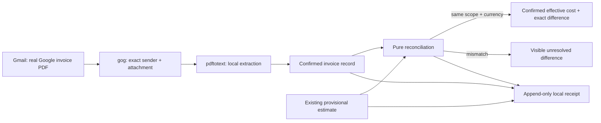

# Life Manager CFO — Provider Billing Reconciliation

| Field | Value |
|---|---|
| Status | PLANNED — CFO-2a3.1 is the only active slice |
| Parent | `docs/superpowers/specs/2026-08-06-life-manager-cfo-design.md` |
| Runtime | Local first; existing hourly launchd remains unchanged until real E2E passes |
| First provider | Google Cloud monthly invoice delivered to the already-authenticated local Gmail account |
| Excluded now | BigQuery billing export, new database, per-business allocation, Codex/Claude subscriptions, Telegram wording |

## 1. Goal

Turn an actual provider invoice into a confirmed, immutable CFO cost record and reconcile it with a provisional
cost only when provider, billing period, scope, and currency are identical. The confirmed record becomes the
effective cost without deleting or rewriting the estimate. A mismatch stays visible; it never becomes zero.



## 2. Ponytail full decision

1. **Do not build:** no new DB/table/RPC, billing microservice, generic invoice framework, LLM parser, BigQuery
   export, OpenTelemetry pipeline, scheduler, or Telegram message in CFO-2a3.1.
2. **Reuse:** existing `gog` Gmail authentication, `pdftotext`, JSONL/state conventions, canonical JSON/hash
   helpers, `lm_api_cost` normalized estimate contract, and current hourly launchd.
3. **Native:** Node standard library only. Money arithmetic is exact decimal-string arithmetic, never binary float.
4. **Smallest change:** one pure production module and one test file. Persistence and real Gmail/PDF I/O are later
   one-at-a-time slices.

## 3. Evidence and decisions

- **Gemini API billing** — https://ai.google.dev/gemini-api/docs/billing  
  Core quote: “The Gemini API uses Cloud Billing accounts for billing services.”  
  Decision: Google Cloud invoice evidence is a legitimate confirmed provider source; token metadata alone is not.
- **Cloud Billing standard export schema (Japanese)** —
  https://cloud.google.com/billing/docs/how-to/export-data-bigquery-tables/standard-usage?hl=ja  
  Core quote: “請求書に直接マッピングされた Cloud Billing データを返すには…`invoice.month` を使用します。”  
  Decision: reconciliation keys use invoice period, not usage timestamp.
- **Cloud Billing invoice charges** —
  https://cloud.google.com/billing/docs/how-to/reports/charges-on-invoices  
  Core quote: “Invoice total includes all costs and savings…taxes, adjustments, and rounding errors.”  
  Decision: only the full provider/account invoice total is directly confirmed; filtered/project totals cannot be
  relabeled as invoice-confirmed.
- **Cloud Billing detailed export schema** —
  https://cloud.google.com/billing/docs/how-to/export-data-bigquery-tables/detailed-usage  
  Core quote: “Use the `export_time` column to understand when the exported billing data was last updated.”  
  Decision: later export ingestion is revision-aware and append-only; it never overwrites earlier evidence.
- **Local observation** — the existing `gog` CLI has one authenticated account and actual monthly Google Cloud PDF
  invoices are present. A current invoice exposes invoice number/date, service period, subtotal, tax, total, and JPY.
  No identifier, address, invoice number, or amount is committed to this repository.

## 4. Canonical contracts

### Confirmed total

```json
{
  "schema_version": 1,
  "provider": "google_cloud",
  "billing_period": "YYYYMM",
  "scope": { "kind": "billing_account", "ref": "sha256:<hex>" },
  "amount": { "value": "decimal string", "currency": "JPY" },
  "source": "provider_invoice_pdf",
  "source_document_ref": "sha256:<hex>",
  "observed_at": "RFC3339",
  "evidence_status": "provider_billed"
}
```

`normalizeGoogleCloudInvoice(fields, provenance)` accepts exactly:

- `fields`: `billing_period`, `service_period_start`, `service_period_end`, `subtotal`, `tax`, `total`, `currency`;
- `provenance`: raw `billing_account_id`, 64-hex `pdf_sha256`, and `observed_at`.

All three money fields are canonical non-negative decimal strings. For this first real Japanese invoice contract,
`currency` is exactly `JPY` and `subtotal + tax` must exactly equal `total`. Other invoice-level adjustments are not
silently folded into tax; a future observed format must update this spec before its parser is accepted.

Raw account ID, invoice number, email address, PDF text, and Gmail message ID never enter the normalized record.
`source_document_ref` is derived from the PDF bytes. `scope.ref` is a one-way hash of provider plus billing account.

### Provisional total

The provisional input contains exactly `schema_version`, `provider`, `billing_period`, `scope`, `amount`,
`source_event_ref`, and `evidence_status`. It keeps its original `locally_estimated` status and is never mutated or
deleted.

### Reconciliation receipt

The pure result contains both frozen inputs plus:

- `status = reconciled` only when provider, billing period, scope, and currency match;
- `effective = confirmed` and an exact signed decimal `difference = confirmed - provisional` when reconciled;
- `status = unresolved`, `effective = null`, and `difference = null` with one stable reason (`provider_mismatch`,
  `period_mismatch`, `scope_mismatch`, or `currency_mismatch`) otherwise;
- no raw source content and only redacted error codes.

This means the current Google account-level JPY invoice does **not** falsely confirm the existing Life Manager-only
USD estimate. It becomes a truthful confirmed account cost; CFO-2a3b later adds provider-supported dimensions and
allocation so narrower business totals can be derived honestly.

## 5. One-at-a-time delivery

- [ ] **CFO-2a3.1 — Pure contract.** Normalize already-extracted Google invoice fields and reconcile one confirmed
      total against one provisional total. Exact arithmetic, frozen output, redacted failures.
- [ ] **CFO-2a3.2 — Local source.** Extend the existing `gog` transport with one read-only exact-invoice operation;
      download one PDF to a private temporary directory, verify sender/attachment/hash, extract with existing
      `pdftotext`, normalize, append one immutable local receipt, and remove temporary content after parsing.
- [ ] **CFO-2a3.3 — Real E2E and hourly publication.** Read the latest real invoice without sending Telegram, prove
      the normalized total matches the PDF arithmetic, prove rerun dedupe and source immutability, then publish only
      confirmed/unresolved aggregate counts through the existing hourly runner. Close CFO-2a3.
- [ ] **CFO-2a3b — Provider dimensions and allocation.** Obtain project/service/SKU dimensions from an official
      Cost Table CSV or billing export; use versioned allocation and retain an unallocated remainder.
- [ ] **CFO-2a3c — Agent subscriptions.** Treat actual Codex/Claude receipts as cash cost and API-equivalent token
      cost as forecast only; never mix them.

## 6. CFO-2a3.1 implementation budget

| Element | Files | Soft target |
|---|---:|---:|
| Pure normalizer + reconciler | 1 new production file | <= 85 added LOC |
| Focused tests | 1 new test file | <= 85 added LOC |
| Package registration | existing `package.json`; `test:cfo` is an explicit file list | 1 line |
| Total | 2 files normally, 3 maximum | <= 171 added LOC |

If the implementation exceeds 100 production LOC or needs more than three files, stop and reduce scope before
adding code.

## 7. CFO-2a3.1 acceptance

1. A valid invoice total normalizes to `provider_billed` using only hashed evidence references.
2. Same provider/period/scope/currency returns confirmed effective cost, preserves both records, and computes the
   exact signed difference without `Number` arithmetic.
3. Scope or currency mismatch returns unresolved with `difference = null`; no estimate is upgraded.
4. Invalid or inconsistent invoice arithmetic fails with a stable redacted error and leaks no input values.
5. Inputs and result are deeply frozen or proven unmodified; focused test, `npm run test:cfo`, full `npm test`, fresh
   Sol review, spec update, commit, and push pass before CFO-2a3.2 starts.
