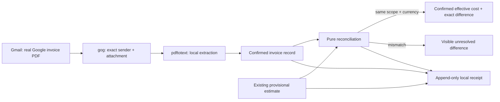

# Life Manager CFO — Provider Billing Reconciliation

| Field | Value |
|---|---|
| Status | ACTIVE — CFO-2a3.3b1 complete; CFO-2a3.3b2 live local cutover is next |
| Parent | `docs/superpowers/specs/2026-08-06-life-manager-cfo-design.md` |
| Runtime | Local first; existing hourly launchd remains unchanged until real E2E passes |
| First provider | Google Cloud monthly invoice delivered to the already-authenticated local Gmail account |
| Excluded now | BigQuery billing export, new database, per-business allocation, Codex/Claude subscriptions, Telegram wording |

## 1. Goal

Turn an actual provider invoice into a confirmed, immutable CFO cost record and reconcile it with a provisional
cost only when provider, billing period, scope, and currency are identical. The confirmed record becomes the
effective cost without deleting or rewriting the estimate. A mismatch stays visible; it never becomes zero.



## 2. Ponytail full decision

1. **Do not build:** no new DB/table/RPC, billing microservice, generic invoice framework, LLM parser, BigQuery
   export, OpenTelemetry pipeline, scheduler, or Telegram message in CFO-2a3.1.
2. **Reuse:** existing `gog` Gmail authentication, `pdftotext`, JSONL/state conventions, canonical JSON/hash
   helpers, `lm_api_cost` normalized estimate contract, and current hourly launchd.
3. **Native:** Node standard library only. Money arithmetic is exact decimal-string arithmetic, never binary float.
4. **Smallest change:** one pure production module and one test file. Persistence and real Gmail/PDF I/O are later
   one-at-a-time slices.

## 3. Evidence and decisions

- **Gemini API billing** — https://ai.google.dev/gemini-api/docs/billing  
  Core quote: “The Gemini API uses Cloud Billing accounts for billing services.”  
  Decision: Google Cloud invoice evidence is a legitimate confirmed provider source; token metadata alone is not.
- **Cloud Billing standard export schema (Japanese)** —
  https://cloud.google.com/billing/docs/how-to/export-data-bigquery-tables/standard-usage?hl=ja  
  Core quote: “請求書に直接マッピングされた Cloud Billing データを返すには…`invoice.month` を使用します。”  
  Decision: reconciliation keys use invoice period, not usage timestamp.
- **Cloud Billing invoice charges** —
  https://cloud.google.com/billing/docs/how-to/reports/charges-on-invoices  
  Core quote: “Invoice total includes all costs and savings…taxes, adjustments, and rounding errors.”  
  Decision: only the full provider/account invoice total is directly confirmed; filtered/project totals cannot be
  relabeled as invoice-confirmed.
- **Cloud Billing detailed export schema** —
  https://cloud.google.com/billing/docs/how-to/export-data-bigquery-tables/detailed-usage  
  Core quote: “Use the `export_time` column to understand when the exported billing data was last updated.”  
  Decision: later export ingestion is revision-aware and append-only; it never overwrites earlier evidence.
- **Local observation** — the existing `gog` CLI has one authenticated account and actual monthly Google Cloud PDF
  invoices are present. A current invoice exposes invoice number/date, service period, subtotal, tax, total, and JPY.
  No identifier, address, invoice number, or amount is committed to this repository.

## 4. Canonical contracts

### Confirmed total

```json
{
  "schema_version": 1,
  "provider": "google_cloud",
  "billing_period": "YYYYMM",
  "scope": { "kind": "billing_account", "ref": "sha256:<hex>" },
  "amount": { "value": "decimal string", "currency": "JPY" },
  "source": "provider_invoice_pdf",
  "source_document_ref": "sha256:<hex>",
  "observed_at": "RFC3339",
  "evidence_status": "provider_billed"
}
```

`normalizeGoogleCloudInvoice(fields, provenance)` accepts exactly:

- `fields`: `billing_period`, `service_period_start`, `service_period_end`, `subtotal`, `tax`, `total`, `currency`;
- `provenance`: raw `billing_account_id`, 64-hex `pdf_sha256`, and `observed_at`.

All three money fields are canonical non-negative decimal strings: zero is exactly `0`, whole values have no
decimal point, and fractional values have neither leading whole-number zeroes nor trailing fractional zeroes. For
example, `0`, `1`, and `1.25` are canonical; `00`, `1.0`, and `1.250` are rejected. For this first real Japanese invoice contract,
`currency` is exactly `JPY` and `subtotal + tax` must exactly equal `total`. Other invoice-level adjustments are not
silently folded into tax; a future observed format must update this spec before its parser is accepted.

Raw account ID, invoice number, email address, PDF text, and Gmail message ID never enter the normalized record.
`source_document_ref` is derived from the PDF bytes. `scope.ref` is a one-way hash of provider plus billing account.

### Provisional total

The provisional input contains exactly `schema_version`, `provider`, `billing_period`, `scope`, `amount`,
`source_event_ref`, and `evidence_status`. It keeps its original `locally_estimated` status and is never mutated or
deleted.

### Reconciliation receipt

The pure result contains both frozen inputs plus:

- `status = reconciled` only when provider, billing period, scope, and currency match;
- `effective = confirmed` and an exact signed decimal `difference = confirmed - provisional` when reconciled;
- `status = unresolved`, `effective = null`, and `difference = null` with one stable reason (`provider_mismatch`,
  `period_mismatch`, `scope_mismatch`, or `currency_mismatch`) otherwise;
- no raw source content and only redacted error codes.

This means the current Google account-level JPY invoice does **not** falsely confirm the existing Life Manager-only
USD estimate. It becomes a truthful confirmed account cost; CFO-2a3b later adds provider-supported dimensions and
allocation so narrower business totals can be derived honestly.

## 5. One-at-a-time delivery

- [x] **CFO-2a3.1 — Pure contract.** Normalize already-extracted Google invoice fields and reconcile one confirmed
      total against one provisional total. Exact arithmetic, frozen output, redacted failures.
- [x] **CFO-2a3.2 — Local source.** Extend the existing `gog` transport with one read-only exact-invoice operation;
      download one PDF to a private temporary directory, verify sender/attachment/hash, extract with existing
      `pdftotext`, normalize, append one immutable local receipt, and remove temporary content after parsing.
  - [x] **CFO-2a3.2a — Locator.** Find the latest exact Google invoice and return only safe attachment locator
        metadata. No download or parsing. Plan:
        `docs/superpowers/plans/2026-08-11-life-manager-cfo-google-invoice-gmail-locator.md`.
  - [ ] **CFO-2a3.2b — Download, parse, append.** Use the locator once, private temporary PDF, existing
        `pdftotext`, CFO-2a3.1 normalizer, and one immutable local receipt; no scheduler wiring.
    - [x] **CFO-2a3.2b1 — Private download.** Download the located PDF once to a caller-owned absolute private path
          and return only frozen transfer metadata. No file reading, parsing, hashing, persistence, or scheduling.
          Plan: `docs/superpowers/plans/2026-08-11-life-manager-cfo-google-invoice-download.md`.
    - [x] **CFO-2a3.2b2 — Parse and append.** Verify the downloaded file, extract locally with `pdftotext`, normalize
          through CFO-2a3.1, append one deduplicated immutable receipt, and always remove temporary content. Plan:
          `docs/superpowers/plans/2026-08-11-life-manager-cfo-google-invoice-local-capture.md`.
- [ ] **CFO-2a3.3 — Real E2E and hourly publication.** Read the latest real invoice without sending Telegram, prove
      the normalized total matches the PDF arithmetic, prove rerun dedupe and source immutability, then publish only
      confirmed/unresolved aggregate counts through the existing hourly runner. Close CFO-2a3.
  - [x] **CFO-2a3.3a — Isolated real E2E.** Actual authenticated Gmail PDF, actual `pdftotext`, independent
        arithmetic, normalized total, immutable dedupe, modes, raw-data exclusion, and cleanup all pass without
        sending or changing live state.
  - [ ] **CFO-2a3.3b — Hourly aggregate publication.** Compose the completed local source into the existing hourly
        runner and publish only confirmed/unresolved aggregate state; never relabel it as a reconciled business cost.
    - [x] **CFO-2a3.3b1 — Counts-only summary.** Add exact confirmed/unresolved/unavailable counts to the existing
          redacted hourly stdout/return without changing Telegram or launchd. Plan:
          `docs/superpowers/plans/2026-08-11-life-manager-cfo-provider-billing-hourly-summary.md`.
    - [ ] **CFO-2a3.3b2 — Live local cutover.** Run isolated no-send main E2E, then update the one existing launchd
          runtime only after rollback/readback gates pass; prove one real autonomous hourly receipt and counts line.
          Plan: `docs/superpowers/plans/2026-08-11-life-manager-cfo-provider-billing-live-cutover.md`.
- [ ] **CFO-2a3b — Provider dimensions and allocation.** Obtain project/service/SKU dimensions from an official
      Cost Table CSV or billing export; use versioned allocation and retain an unallocated remainder.
- [ ] **CFO-2a3c — Agent subscriptions.** Treat actual Codex/Claude receipts as cash cost and API-equivalent token
      cost as forecast only; never mix them.

## 6. CFO-2a3.1 implementation budget

| Element | Files | Soft target |
|---|---:|---:|
| Pure normalizer + reconciler | 1 new production file | <= 85 added LOC |
| Focused tests | 1 new test file | <= 85 added LOC |
| Package registration | existing `package.json`; `test:cfo` is an explicit file list | 1 line |
| Total | 2 files normally, 3 maximum | <= 171 added LOC |

If the implementation exceeds 100 production LOC or needs more than three files, stop and reduce scope before
adding code.

## 7. CFO-2a3.1 acceptance

1. A valid invoice total normalizes to `provider_billed` using only hashed evidence references.
2. Same provider/period/scope/currency returns confirmed effective cost, preserves both records, and computes the
   exact signed difference without `Number` arithmetic.
3. Scope or currency mismatch returns unresolved with `difference = null`; no estimate is upgraded.
4. Invalid or inconsistent invoice arithmetic fails with a stable redacted error and leaks no input values.
5. Inputs and result are deeply frozen or proven unmodified; focused test, `npm run test:cfo`, full `npm test`, fresh
   Sol review, spec update, commit, and push pass before CFO-2a3.2 starts.

## 8. CFO-2a3.1 completion evidence

- Luna delivered one 44-line production module, one 47-line three-case test, and one existing package-script token.
- RED failed because the production module did not exist. GREEN passed focused `3/3`, CFO `303/303`, and full
  `961/961`; Sol independently repeated focused `3/3`, CFO `303/303`, full `npm test`, syntax, diff, and LOC checks.
- Fresh Sol review found invalid-month and non-canonical-decimal acceptance. The same Luna fixed only those two
  contracts; re-review returned `ship — Spec ✅`.
- No Gmail/PDF I/O, storage, DB, OpenTelemetry, scheduler, allocation, or Telegram behavior was added.

## 9. CFO-2a3.2a completion evidence

- Luna added 25 production LOC to the existing `gog` transport, one 36-line two-case test, and one package token.
- RED was exact missing-method failure `0/2`. GREEN passed focused `2/2`, CFO `305/305`, and full `npm test` after
  restoring lockfile dependencies with `npm ci --ignore-scripts`.
- Sol independently repeated focused `2/2`, CFO `305/305`, full `npm test`, syntax, diff, and registration checks.
- A real read-only local run used the authenticated `gog` account and returned one frozen exact six-key locator for
  a real PDF; only booleans/key names were printed, never message ID, attachment ID, filename, account, or content.
- A fresh reviewer could not be allocated because the collaboration service rejected both spawn and follow-up with
  `agent thread limit reached`. No review result is claimed; Sol inspected the exact diff and the next slice keeps
  the locator behind another fail-closed parser boundary.

## 10. CFO-2a3.2b1 implementation budget and observed boundary

| Element | Files | Soft target |
|---|---:|---:|
| Existing `gog` transport method | 1 modified production file | <= 20 added LOC |
| Existing focused mail tests | 1 modified test file | <= 35 added LOC |
| Total | exactly 2 files | <= 55 added LOC |

A real local read-only probe proved the exact `gog gmail attachment` command returns JSON keys `bytes`, `cached`,
and `path`, creates a non-empty `%PDF` file with mode `0600`, and can be cleaned up immediately. The probe printed
only booleans and key names. CFO-2a3.2b1 therefore adds only the command boundary; file verification, parsing,
hashing, receipt append, dedupe, and cleanup remain CFO-2a3.2b2.

## 11. CFO-2a3.2b1 completion evidence

- Luna changed exactly the two planned files: 12 added production LOC and 33 added test LOC. RED kept the two
  locator tests passing and failed both new tests only because `downloadGoogleCloudInvoice` did not exist.
- GREEN passed focused `4/4`, CFO `307/307`, full `npm test`, syntax, and `git diff --check`; Sol independently
  repeated the same focused/CFO/full/syntax/diff checks.
- A real authenticated local E2E located and downloaded the latest invoice once. Safe assertions proved a frozen
  exact two-key result, positive reported bytes equal to the regular file size, `%PDF` magic, mode `0600`, and exact
  temporary-file/directory removal. No identifier, account, filename, path, content, or amount was printed.
- The implementation adds no retry, generic downloader, parser, hash, persistence, scheduler, DB, OTel, or Telegram
  behavior. A fresh Sol reviewer could not be allocated because the collaboration service returned
  `agent thread limit reached`; no independent review result is claimed.

## 12. CFO-2a3.2b2 local record contract

The one observed Japanese invoice layout is parsed locally and normalized before storage. The record path is
`<stateRoot>/cfo/provider-billing/google-cloud/<pdf-sha256>.json`; its content is exactly the normalized confirmed
record from §4. Directories are `0700`, the record is `0600`, first append is file-and-directory fsynced, and the
same PDF hash can only return the byte-identical existing normalized record. Raw PDF, extracted text, account ID,
invoice number, Gmail locator, temp path, and provider error never enter state, logs, receipts, or tests.

The public capture receipt has exactly `status`, `record_id`, and `confirmed`. `status` is `appended` on the first
immutable write and `existing` on a validated rerun. The parser accepts only the real observed Japanese labels,
three-part uppercase-alphanumeric billing account ID, same-month month-boundary service dates, internally identical
repeated Yen totals, and exact arithmetic; every unknown layout fails closed. No scheduler or Telegram call is part
of CFO-2a3.2b2.

## 13. CFO-2a3.2b2 and CFO-2a3.3a completion evidence

- Luna changed exactly three planned files: one 30-line production module, one 66-line two-case test, and one
  `test:cfo` registration token. RED failed only because the new module did not exist.
- Controller review found malformed comma grouping could be misread and cleanup errors could be swallowed. The same
  Luna tightened amount/account token boundaries and made both cleanup paths fail with one fixed redacted error.
- Final GREEN passed focused `2/2`, CFO `309/309`, full `npm test`, syntax, diff, and LOC checks; Sol independently
  repeated all of them after the last code change.
- Sol's isolated real E2E used the authenticated Gmail account and actual `pdftotext`. Safe assertions proved first
  `appended`, rerun `existing`, one byte-identical record, exact confirmed JSON, `0600` file, `0700` directories,
  frozen receipts, repeated PDF values consistent, exact invoice arithmetic, confirmed total equal to the PDF,
  raw account/labels absent, two private PDF temps removed, and isolated state removed. No private value was printed.
- No parser/storage framework, OCR, LLM, DB, retry, OTel, scheduler, Telegram call, or live-state write was added.
  A fresh Sol reviewer could not be allocated because the collaboration service returned `agent thread limit
  reached`; no independent reviewer result is claimed.

## 14. CFO-2a3.3b count semantics

The latest invoice can be both **confirmed** and **unresolved**: provider billing truth is confirmed, while its
business reconciliation remains unresolved until a matching provider/scope/period/currency provisional source is
connected. A successful latest capture therefore publishes counts `confirmed=1`, `unresolved=1`, `unavailable=0`.
Absent configuration, capture failure, or invalid receipt publishes `0/0/1`. Counts are local control-plane status,
not money. Amounts and source references remain only in the private immutable record. OpenTelemetry continues to
carry request/token correlation; no fake billing amount is created from spans.

## 15. CFO-2a3.3b1 completion evidence

- Luna modified exactly the three planned existing files: 14 added production LOC, 14 added test LOC, and one
  `test:cfo` registration token. RED proved the counts/call were absent; GREEN passed focused `11/11`, CFO
  `320/320`, full `npm test`, syntax, diff, and LOC checks.
- Controller review found an incomplete normalized record could still count as confirmed. The same Luna added exact
  receipt/confirmed/scope/amount identity checks, valid month/timestamp checks, and a compact invalid-record case.
  Sol independently repeated all final test and static gates after that fix.
- Sol ran the actual authenticated Gmail/PDF/`pdftotext` path twice through `main()` in an isolated state root while
  injecting usage, Moneytree persistence, and Telegram delivery so no external send or live-state mutation occurred.
  Safe assertions proved both finance runs succeeded, both counts were exact `1/1/0`, two stdout lines were redacted,
  Telegram was injected-only, one `0600` record remained byte-identical, and isolated state was removed.
- `runHourlyCfo`'s finance summary, Moneytree snapshot, Telegram input, and exit-code behavior are unchanged. No
  amount, hash, scope, account, path, or provider error enters stdout. No launchd change occurred in b1.
- A fresh Sol reviewer could not be allocated because the collaboration service returned `agent thread limit
  reached`; no independent reviewer result is claimed.
