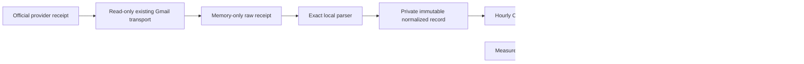
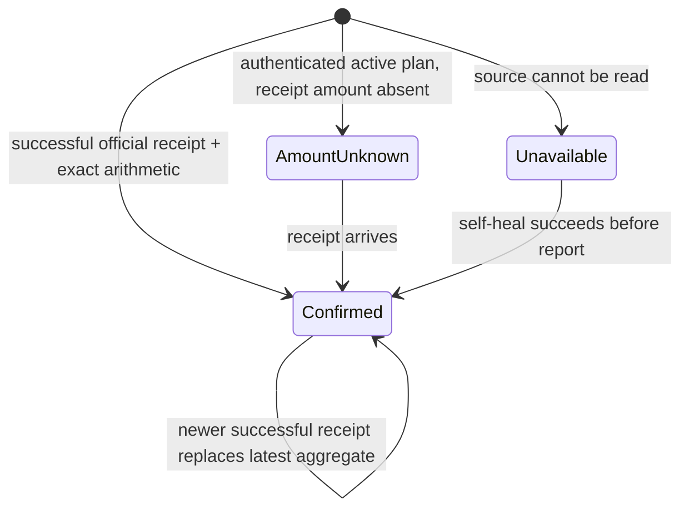

# Life Manager CFO — Subscription Receipt Truth

| Field | Value |
|---|---|
| Status | ACTIVE — CFO-2a3c.1 is the first unfinished slice |
| Parent | `docs/superpowers/specs/2026-08-06-life-manager-cfo-design.md` |
| Runtime | Local first; existing hourly launchd remains the only scheduler |
| First source | Official Anthropic receipt email through the existing authenticated `gog` transport |
| Excluded now | Public list price as spend, failed payments, Moneytree merchant persistence, new DB, browser automation in the hourly loop |

## 1. Goal

Report actual Codex/Claude subscription cash expense separately from API-equivalent token cost. A provider receipt is
`confirmed`; an authenticated plan without a receipt amount is `active_amount_unknown`; a public price is never spend.



## 2. Observed truth

- `claude auth status` reports an active first-party `max` subscription.
- The authenticated Gmail account contains successful official receipts from `mail.anthropic.com`; Gmail's own
  `Authentication-Results` reports both DKIM and DMARC pass for that exact domain. The latest observed
  successful receipt is dated 2026-07-20 and says `Max plan - 20x`, subtotal USD 200.00, Japan consumption tax USD
  20.00, and amount paid USD 220.00 for 2026-07-20 through 2026-08-20.
- Failed-payment emails also exist and MUST NOT be counted as expense.
- Codex's signed local ID token reports an active `pro` plan and its active interval, but no paid amount. No matching
  official OpenAI subscription receipt was found in the authenticated Gmail account, and the daily-driver browser is
  not logged into ChatGPT. Codex cash expense therefore remains `active_amount_unknown`.
- The current Moneytree hourly path reads balances only. Existing snapshots contain no transaction or merchant data.
  Moneytree can later cross-check a payment, but it is not the primary receipt source for this slice.

## 3. Ponytail full decision

Reuse `makeGogMail`, the existing private state root, immutable file pattern, hourly runner, and Telegram delivery.
Do not add a database, generic receipt framework, new scheduler, OCR, LLM parser, or persistent merchant description.
Build only the next observable slice and close it before continuing.

## 4. Normalized confirmed receipt

The eventual private normalized record has exactly:

`schema_version`, `provider`, `plan`, `billing_period_start`, `billing_period_end`, `subtotal`, `tax`, `total`,
`currency`, `paid_at`, `source_hash`, `evidence_status`.

Rules:

- `provider = anthropic`, `plan = max_20x`, `currency = USD`, `evidence_status = provider_receipt` for the observed
  layout;
- decimal strings remain exact; `subtotal + tax = total` and `amount paid = total`;
- the successful receipt period is half-open `[start, end)` and must match the body exactly;
- receipt number, invoice number, account, email, payment method, URLs, Gmail IDs, and raw body never enter state,
  logs, Telegram, OpenTelemetry, or public return values;
- dedupe identity is the SHA-256 of the validated raw receipt body; a same-hash rerun returns `existing`.

## 5. Truth states shown to the owner



The hourly report uses only `Confirmed` totals. `AmountUnknown` is visible as coverage, never zero. A transient read
failure is retried by the existing next hourly run; the last validated immutable receipt remains the financial truth.

## 6. Ordered TODO

- [ ] **CFO-2a3c.1 — Anthropic Gmail source.** Extend the existing `gog` transport with one read-only method that
      selects the newest valid successful Anthropic receipt, requires Google-authenticated DKIM and DMARC pass for
      `mail.anthropic.com`, and returns one frozen memory-only evidence object. No parsing, persistence, scheduler, or
      Telegram change. Plan:
      `docs/superpowers/plans/2026-08-11-life-manager-cfo-anthropic-receipt-source.md`.
- [ ] **CFO-2a3c.2 — Exact parser and immutable local record.** Parse only the observed successful receipt layout,
      verify arithmetic/period/plan, append a private `0600` hash-addressed record, and prove rerun dedupe.
- [ ] **CFO-2a3c.3 — Hourly aggregate and Telegram.** Reuse the one hourly launchd loop; publish actual subscription
      total and coverage separately from API-equivalent forecast. Run a real authenticated no-send E2E, then one real
      hourly Telegram delivery and verify its receipt.
- [ ] **CFO-2a3c.4 — OpenAI confirmed amount.** Ingest only an official OpenAI receipt or authenticated billing
      statement when one becomes accessible. Until then retain the signed active-plan evidence with amount unknown.

## 7. UI/UX contract

```text
AI費用
実支出: Claude $220.00 /月（領収書確認済み）
Codex: Pro利用中・請求額は未確認
APIへ移した場合: 約{forecast}（実測tokenによる予測）

[AI費用の内訳] [仕事別token] [戻る]
```

Failed payments, raw errors, IDs, and technical traces are not posted. If self-healing succeeds, the report uses the
validated receipt and may add one plain-language line saying the source was recovered.
