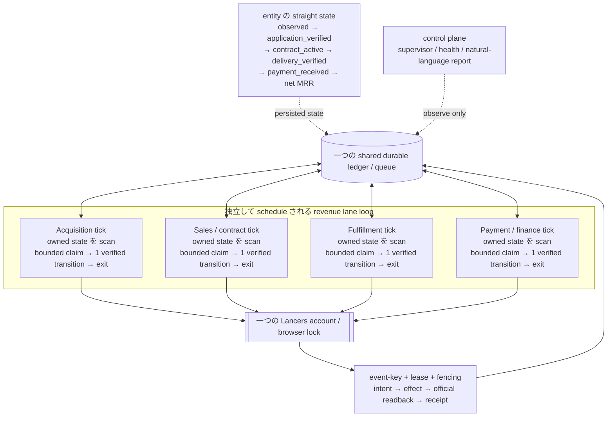
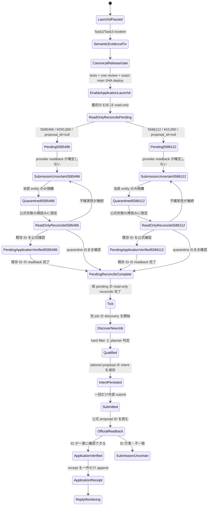
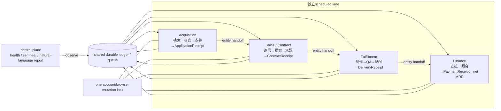

# Lancers 月額 SNS 運用で net MRR 20,000 USD を目指す設計仕様

**作成日:** 2026-08-13
**正本:** Life Manager (`Daisuke134/life-manager`)
**対象:** Lancers の acquisition、月額契約、納品、着金を一つの収益ループとして扱う
**状態:** G1 acquisition E2E完了、30分bounded loop稼働中。G2着手中。誤報する旧Telegram reporterだけをdisabled / unloaded

canonical repository は Life Manager とし、Lancers の credential、browser session、
runtime state、receipt、ledger は外部に残す。この仕様は runtime state を移動・複製・変更しない。

この文書をLancers money loopの**設計・acceptance gate・完了証拠・現在地・残TODOの唯一の正本**とする。
各TODOは一件ずつ実行し、完了証拠をこの文書へ反映してcommit/pushしてから次へ進む。実行時の件数・
金額・receiptの事実は外部runtime stateとappend-only ledgerを権威とし、この文書へ推測値を転記しない。

実行の基本形は、各 entity の business state を一本の直線として保持し、実行だけを
4 つの revenue lane に並列化する構成である。entity ごとの常駐 loop/process/cron や、
buyer・payment を何日も待つ一つの常駐プロセスは作らない。後段 lane の実装は slice ごとに
追加するが、この architecture contract は Slice 1 から固定する。

## 1. 目的と成功の定義

目的は、Lancers 上の単発応募数ではなく、実際に継続している顧客契約から
**net MRR 20,000 USD** を得ることにある。社内の安全目標は **25,000 USD** とする。
これは予測値や売上保証ではなく、公式 readback と受領証憑から再計算できる
受入条件である。

### 1.1 MRR の定義

計上対象は、Lancers 公式画面または公式通知で **active の月額 recurring contract**
と確認できる契約だけである。月額契約の公式フローは次の順序とする。

```text
相談・交渉 → client offer → client approval → active monthly contract
```

現在の MRR は一つの対象期間 `mrr_period`（契約の service period、形式 `YYYY-MM`）について
だけ計算する。receipt の取得日、銀行入金日、集計実行日ではなく、契約が提供する service
period に帰属させ、過去月の累積を現在の MRR に足さない。対象集合は、その `mrr_period` に
属する active recurring contract の `PaymentReceipt` だけである。

各 receipt の最低限の一意帰属キーは次である。

```text
payment_receipt_key = (contract_external_id, mrr_period, provider_receipt_id)
```

同じ `provider_receipt_id`、同じ contract、同じ `mrr_period` を二度 ledger に計上しない。
receipt は一つの `payout_batch_id` に一度だけ属し、一つの bank transaction に重複帰属させない。

対象 `mrr_period` の全 receipt を合算した net MRR は、次の式で計算する。

```text
net_mrr_usd(mrr_period) = recorded_fx(mrr_period,
  sum(gross_monthly_receipts_jpy for active recurring receipts in mrr_period)
  - sum(platform_fee_jpy for active recurring receipts in mrr_period)
  - sum(ai_cost_jpy for active recurring receipts in mrr_period)
  - sum(subcontractor_cost_jpy for active recurring receipts in mrr_period)
  - sum(refunds_jpy for active recurring receipts in mrr_period)
)
```

- `gross_monthly_receipts_jpy` は、Lancers が `confirmed/received` とした、手数料控除前の月額対価である。
- `platform_fee_jpy` は、Lancers の provider 明細にある手数料の実額である。
- `bank_settlement_jpy` は同じ provider payout batch に帰属する実際の銀行入金額であり、net の式に追加控除として入れない。
- `refunds_jpy` は同じ契約に帰属する provider-confirmed refund の実額である。AI 原価と外注原価もそれぞれ別項目として契約または支払に紐づける。
- `signed_provider_adjustment_jpy` は provider settlement 明細に記載された符号付き調整額だけであり、net の原価や fee に自動分類しない。
- provider の payout 対象額は別式で照合する。

```text
provider_payout_target_jpy(payout_batch_id) =
  sum(gross_monthly_receipts_jpy for receipts in payout_batch_id)
  - sum(platform_fee_jpy for receipts in payout_batch_id)
  - sum(refunds_jpy for receipts in payout_batch_id)
  + signed_provider_adjustment_jpy(payout_batch_id)

bank_reconciliation_delta_jpy(payout_batch_id) =
  bank_settlement_jpy(unique bank_transaction_id for payout_batch_id)
  - provider_payout_target_jpy(payout_batch_id)
```

`provider_payout_target_jpy` は provider の settlement 明細から再計算し、
各 `payout_batch_id` の対象 receipt、gross、fee、refund、符号付き adjustment は一度だけ合計する。
一つの batch に対応する `bank_transaction_id` は一件だけ、一つの bank transaction は一つの batch
だけにする。同じ receipt、bank transaction、batch の複数帰属を禁止する。
`bank_reconciliation_delta_jpy` は必ず `0` のときだけ `matched` とし、non-zero または対象 receipt、
bank transaction、provider 明細の欠落は `unknown` / `unmatched` とする。根拠付き adjustment が
あっても non-zero delta を `matched` としてはならず、G6/G7 を閉じない。手数料は net の式と
payout target の各一回だけに現れ、bank settlement を再度 fee として控除しない。
provider payout target、fee 明細、銀行入金のいずれかが未取得なら reconciliation は `unknown` とし、
MRR gate を開けない。

- `PaymentReceipt` が `received` であることを必須とし、対象 `mrr_period` 外の receipt、未受領の請求、提案額、見積額、予測、未受領の offer、単発売上は MRR に含めない。
- 為替は集計時に都合よく選ばず、取得時刻とレートを記録した `recorded_fx` を使う。
- 単発売上は別の `one_off_revenue` として表示し、gross MRR と net MRR に混ぜない。
- `$20,000` の受入判定と `$25,000` の安全目標は、同じ式・同じ証憑で検証する。

対象 `mrr_period` の公式 source readback 完了を示す `source_completeness_receipt`（または
明確に同等の source completeness evidence）があり、かつその source に対応する ledger 集合が
空または合計 `0` のときだけ、該当値を verified zero と表示する。PaymentReceipt の rows が
単に 0 件であること、source failure、未取得、missing timestamp だけでは zero と断定せず、
`unknown` / `unverified` とする。この source completeness schema/evidence は後段 finance slice
で追加する必須要件であり、Slice 1 では扱わない。

### 1.2 収益の流れ

```mermaid
flowchart LR
  A[公開案件を発見] --> B[適格性・利益性を判定]
  B --> C[意図を保存して応募]
  C --> D[公式 proposal ID readback]
  D --> E[ApplicationReceipt]
  E --> F[返信・交渉]
  F --> G[client offer]
  G --> H[承認]
  H --> I[active monthly contract]
  I --> J[月次制作・納品]
  J --> K[公式納品 readback]
  K --> L[PaymentReceipt received]
  L --> M[gross monthly receipts]
  L --> Q[provider payout target + fee statement]
  Q --> R[bank settlement readback]
  R --> S[bank reconciliation matched]
  S --> M
  M --> N[fee / AI / subcontract / refund を実額控除]
  N --> O[記録済み FX で USD 換算]
  O --> P[net MRR USD]
```



応募や storefront の件数は `P` の代替ではない。`PaymentReceipt` まで到達しない
枝は収益として閉じない。

## 2. 現行の検証済みベースライン

以下は今回観測した状態の記録であり、将来も維持される約束ではない。

| 観測 | 事実 | 計上・運用上の意味 |
|---|---|---|
| 応募 | `application_verified` が現在14件 | 直前baseline 11件から、readback-only reconcileで公式proposal ID `27803189`、`27808073`、`27808988`の3件が一意に増えた |
| 作業・納品・支払 | `WorkEvent`、`DeliveryReceipt`、`PaymentReceipt` は記録なし。記録された baseline ledger revenue は **¥0** だが PaymentReceipt source completeness は未確認 | source completeness がない記録なしは MRR の 0 を証明せず、active recurring contract の受入証拠もない |
| 現在の pending | 0件 | project `5585496 → 27803189`、`5586112 → 27808073`、`5585503 → 27808988`を公式readbackし、3件ともreceipt化してpendingから削除した。submitは0件 |
| application launchd incident | Task2 source が Task3 safety gate より先に schedule され、launchd が自動実行された。その review 前の実行で、二つ目の null-ID pending project `5586112`（¥10,000）が作成された | verified incidentとして記録する。Task 6C receipt acceptanceまでjobを停止し、acceptance後にcanonical normal releaseで再開した |
| storefront | 公式画面は受付中6、受付休止中0、非表示0、下書き0。canonical receipt IDは`1338233`の1件 | 受付中は合計6件で、canonical 1件に対する余分なduplicateは5件。販売・未処理件数ではない |
| storefront observability | 4 状態を合算し、合計を `unprocessed` として表示 | `partial 6/6 official_timestamp_missing` という誤解を生む |
| storefront 最新実行 | `listing_readback_mismatch` を観測 | 不一致に成功アイコンを付けてはならない |
| work-sync | プロセスは alive だが productive progress がない | alive と成果を同じ health signal にしない |
| ソース配置 | 現行の deployed source は canonical repo 外。worktree/feature branch を稼働 SSOT にしてはならない | canonical repo に source/schema/test/launchd template/spec/plan を揃え、検証済み main commit の release artifact だけを deploy する。runtime state は移動・削除しない |

過去 baseline の`application_verified=11`と、今回一意に追加された3 receiptを分けて保持する。
current reportはledger再測定値14件を使い、`observed`、`qualified`、`submitted`、`verified`を別状態で報告する。

## 3. 顧客・商品・価格

### 3.1 ICP

対象は、**日本語の商用組織案件として、継続SNS運用を外部ownerへ明示的に委任するbuyer**である。
`qualified` はkeyword一致ではなく、Lancers公式detailの`依頼主の業種`が空でなく、公開`依頼概要`に
SNS/channel、継続scope、外部委任の三つが明示される状態とする。`依頼主の業種`はbuyerが事業用途の
公式分類を選んだ証拠であり、buyer自身の顧客がB2Bだと推測する証拠には使わない。個人趣味、単発投稿、
継続不明、外部owner不明はG1のqualifiedにしない。clarificationでunknownをqualifiedへ昇格させず、
最初の応募前に公開detailから証拠を揃える。

### 3.2 商品境界

販売するのは、顧客のパスワードを預からない月次 SNS コンテンツ運用パックである。
含むものは、月次企画、投稿文の draft、画像の方向性、投稿カレンダー、月次改善レポート。

含まないものは、顧客アカウントへのログイン、直接投稿、広告運用、広告費の預かり・
支払い、電話営業、訪問作業である。AI を使うこと自体を価値主張にせず、顧客の課題に
結び付いた成果物を提示する。

### 3.3 パッケージ

| パッケージ | 価格 | 固定スコープ | revision の上限 |
|---|---:|---|---:|
| Founding（最初の 3 社、3 か月） | ¥98,000/月 | 1 channel、8 drafts/月、企画・画像方向性・カレンダー・改善レポート | 1 consolidated round |
| Standard | ¥198,000/月 | 1 channel、12 drafts/月、競合観察、企画・画像方向性・カレンダー・改善レポート | 1 consolidated round |
| Premium | ¥398,000/月 | 2 channels、24 drafts/月、企画・画像方向性・カレンダー・改善レポート | 2 consolidated rounds、優先 revision |

`draft` は投稿文の draft 1 件、対応する画像方向性 1 件、カレンダー上の配置 1 件を
一単位とする。revision は顧客からまとめて受け取る修正依頼を一回処理する単位であり、
上限を超える修正、追加 channel、追加 drafts、投稿代行は現契約に含めない。必要なら
別スコープとして再見積もりし、承認されるまで作業を開始しない。Premium の priority は
修正回数無制限を意味せず、許容された二回を capacity の範囲内で先に処理する意味である。

capacity は、契約が要求する base drafts と revision 最大数を合わせた draft-equivalent
で記録する。Founding は 16、Standard は 24、Premium は 72 units を一契約の上限消費と
する。capacity 使用率は、active contract が予約した units を現行 cap で割って求める。初期 intake cap は Founding 3 社分の 48 units/月とし、3 社を超える契約は、実際の
支払・納品時間・原価を測定して cap を更新するまで受けない。cap を自動で増やしたり、
スコープ外作業を capacity に隠したりしない。

### 3.4 目標構成（例示であり収益の真実ではない）

```text
3 Founding + 10 Standard + 7 Premium
= 3×¥98,000 + 10×¥198,000 + 7×¥398,000
= ¥5,060,000 gross MRR
```

この組合せは計画を考えるための例示にすぎず、受入判定は実際の `PaymentReceipt`、
実費、記録済み FX から計算する。見込み契約数や proposal 金額で置き換えない。

## 4. ループ構造と既存契約の再利用

acquisition は補助機能ではなく、最初に動かす **first-class primary loop** である。
ただし acquisition の完了は応募 receipt までであり、契約・納品・支払を省略して収益とは呼ばない。

### 4.1 四つの lane を並列に実行する architecture

business state は entity ごとに直線で進むが、実行は lane ごとの scheduled loop に分ける。
各 loop は**一つの shared durable ledger/queue**だけを読む。lane や project ごとに queue、
resident process、cron、browser lock を増やさない。



read/plan は lane・project をまたいで論理的に重なってよい。ただし一つの Lancers account に
対する browser/provider mutation は共有 lock の境界で直列化し、event key、lease、fencing、
intent/effect/readback/receipt の契約を一つの action envelope として守る。公式 readback が
返らない遷移は verified transition ではない。

#### state ownership と handoff

| lane | 所有する state / transition | 次 lane へ渡す公式証拠 |
|---|---|---|
| acquisition | `observed → qualified → submitted → application_verified` | 一意の `ApplicationReceipt` と公式 proposal ID readback |
| negotiation / contract（sales） | `application_verified` または `buyer_replied → contract_active / lost` | buyer reply、offer、approval、active monthly contract の公式 readback |
| fulfillment | `contract_active → delivery_verified` | 納品の公式 readback 後だけ `DeliveryReceipt` |
| payment / finance | `delivery_verified → payment_received → bank_reconciled → net_mrr` | `PaymentReceipt received`、provider settlement、bank readback、cost ledger |

handoff は状態名だけで成立させず、各 lane の公式 receipt/readback を伴わせる。どの lane も
official receipt を飛ばして次の state、金額、MRR を作らない。

#### scheduling、idempotency、backpressure

- 四つの lane はそれぞれ独立した scheduled tick とし、各 tick は一つの shared ledger/queue を scan して、その lane が所有する state だけを bounded batch で claim する。
- claim には lease と fencing を付け、各 entity は一 tick につき高々一つの verified transition だけを実行し、readback・receipt・ledger を永続化してから process が終了する。bounded batch は一つの lane の遅延や失敗が全体の queue を占有しないための上限である。
- buyer の返信、deadline、payment、次の review を待つときは `waiting_for` と `next_tick_at` を durable state に保存する。sleep、常駐待機、数日間続く straight-shot process は使わず、future tick が再開する。
- intent の一意 event key と at-most-once action envelope、authoritative readback、receipt の一意 key で再実行を冪等にする。不確実な effect は blind resend せず、read-only reconcile に戻す。
- 一つの entity の失敗はその entity だけを quarantine する。一つの lane の tick が失敗しても他 lane は bulkhead の内側で継続し、acquisition が capacity backpressure で pause しても sales・fulfillment・finance は停止しない。
- capacity は acquisition の claim/admit 上限として扱い、active contract が予約した draft-equivalent を超える応募を受け付けない。capacity/browser lock の待ち時間は観測対象であり、未測定の並列 mutation worker は追加しない。

#### control plane と storefront の境界

supervisor/health と natural-language report は**control plane**であり、五つ目の revenue lane
ではない。lane の進捗、stalled entity、incident、次の automatic action、active contract、
delivery、payment、net MRR を観測して報告するだけで、健康に見せるために receipt を製造したり
business state を変更したりしない。storefront は acquisition の表示・入口であり、revenue lane、
contract、payment、MRR の代替ではない。

### 4.2 lane ごとの責務

| lane | 責務 | 収益への閉じ方 |
|---|---|---|
| acquisition | 公開案件の発見、適格化、応募、proposal ID readback、`ApplicationReceipt` | 応募は契約・収益ではない |
| negotiation / contract | 返信分類、質問、月額 offer、scope・金額確認、active 化 | Lancers の公式 monthly contract 状態を確認 |
| fulfillment | ブランド文脈、月次制作、QA、納品、readback | `DeliveryReceipt` は公式納品 readback 後だけ |
| payment / finance | PaymentReceipt、手数料・原価・返金、銀行 settlement、ledger | received の実額だけを net MRR に反映 |

storefront は acquisition の表示面であり、独立した revenue lane ではない。listing の
数、published 状態、proposal 数を MRR と合算しない。

### 4.3 外部作用の共通契約

応募、offer、納品、支払記録などすべての外部作用は、次の順序で閉じる。

```text
intent → external effect → official provider readback → receipt → ledger
```

readback が不一致・欠落・null のときは成功として記録せず、既知の provider 状態を
再読して不確実状態を解消する。単一の状態を複数 receipt に変換しない。

### 4.4 既存 acquisition の扱い

application launchd が safe deployment 後に enable された正常稼働時、既存の acquisition は 30 分ごとに最大 20 件を discover し、planner が eligible / ineligible
を分類し、proposal・price・due date を生成して submit し、公式 proposal ID を readback して
receipt を記録する。この流れは再利用する。新しい crawler、vector DB、別の ranking 基盤、
新しい共通 kernel は作らない。

不足しているのは、利益性を含む選別と HOL isolation である。これを first slice の境界内で
最小限補う。

### 4.5 Coconala topology の再利用境界

Coconala で proven な general topology/contracts、すなわち lane loop、shared queue/ledger、
single browser lock、at-most-once action envelope、authoritative readback を再利用する。
巨大な `gig_pass.sh` や Coconala site 固有の DOM/business rule はコピーしない。Lancers adapter
だけが Lancers 固有の discovery、DOM、submit、readback を所有する。Coconala の ongoing refactor
が完了することは G1 の前提にせず、既存の proven contract をこの slice に必要な範囲で固定する。

### 4.6 canonical SSOT と安全な deployment

canonical repository は Life Manager の main だけである。source、schema、test、launchd template、
spec、plan はすべて canonical repo に置き、secret、browser session、runtime state、append-only
ledger、evidence は外部に残して不可侵とする。worktree は一時的な開発隔離であり、launchd/cron/service
が worktree や feature branch を実行してはならない。`~/.local` などの untracked mutable source を
唯一の runtime SSOT にもしない。

安全な順序は、(1) tests と許可された一回の fresh adversarial review を通す、(2) canonical main に
merge/push する、(3) exact main commit SHA から release artifact を install し manifest と deployed
SHA を記録する、(4) その後にだけ application service を enable する、である。repo 外で hotfix を
行った場合も、service enable 前に byte-for-byte で canonical repo に反映する。merge/deploy の検証後
は temporary worktree を削除するが、runtime state はこの source migration のために移動・削除しない。
application launchd は verified incident の blocker、canonicalization、safe deployment、provider-only検証、
最初の正常wakeを順に閉じた後だけ検証済みreleaseでenabledにする。現在はTask 6Cの本番acceptance待ちで
disabled / unloadedであり、receipt検証後に30分tickを再開する。qualified案件がないtickは外部送信せず
`no_eligible_project`で終了する。

### 4.7 ideal canonical folder tree

以下を最終的な最小treeとする。`[planned]`以外は現在存在する。laneごとのDB、queue、service package、
project別folderは追加せず、4 laneは同じLancers adapter、marketplace-core、ledgerを再利用する。

```text
life-manager/
├── apps/lancers-revenue/
│   ├── launchd/
│   │   ├── ai.anicca.lancers-revenue-application.plist
│   │   ├── ai.anicca.lancers-revenue-sales.plist             [planned G4]
│   │   ├── ai.anicca.lancers-revenue-fulfillment.plist       [planned G5]
│   │   └── ai.anicca.lancers-revenue-finance.plist           [planned G6]
│   ├── scripts/
│   │   └── install-local.sh
│   └── tests/
│       ├── test_application_loop_hol.py
│       └── test_install_local.py
├── skills/earn/lancers/scripts/
│   ├── lancers_adapter.py
│   ├── status.py
│   ├── application_loop.py
│   ├── application_tick.py
│   ├── sales_loop.py                                         [planned G4]
│   ├── fulfillment_loop.py                                   [planned G5]
│   └── finance_loop.py                                       [planned G6]
├── skills/_shared/marketplace-core/
│   ├── schemas/
│   │   ├── opportunity.schema.json
│   │   └── event.schema.json
│   └── scripts/
│       ├── application_transaction.py
│       ├── contracts.py
│       └── ledger.py
├── skills/gig-work/schemas/
│   └── application_decisions.schema.json
├── runtime/agent-runner/
│   ├── agent_runner.py
│   ├── token_budget.py
│   └── config.json
└── docs/superpowers/
    ├── specs/2026-08-13-lancers-20k-net-mrr-design.md
    └── plans/2026-08-13-lancers-first-verified-application.md
```

後続laneのtestは、実装時に既存`apps/lancers-revenue/tests/`へ各lane一つの最小E2E regressionとして
追加する。先に空file、抽象base class、共通orchestratorを作らない。

## 5. Acquisition の設計判断

### 5.1 検索面と hard filter

公開検索は provider の新着順を再利用する。G1のdefault queryは **`SNS運用` 一つ**に固定する。
無queryの全カテゴリ新着20件ではSNS案件が他カテゴリに押し出され、二回のofficial wakeがともに
20件全件ineligibleになった。一方、read-only比較では`SNS運用`が13 normalized案件、うち予算上限
¥98,000以上6件を返したため、最初の`ApplicationReceipt`へ進む最小修正として採用する。

次のquery群はG3のcoverage候補であり、G1でmulti-query aggregator、dedupe、global rankingを作らない。
最初のreceiptと実測funnel後、一tick一queryのdeterministic rotationが必要かを判断する。

```text
SNS投稿、コンテンツ制作、X運用、LinkedIn、B2Bマーケティング、
AI活用、継続依頼、長期、月額
```

coverage比較の一次結果は、無query 20件（¥98,000以上6件だがSNS中心ではない）、`SNS運用`
13件/6件、`SNS投稿`17件/1件、`コンテンツ制作`4件/1件、`LinkedIn`2件/1件、`月額`8件/4件である。
ここで分母はnormalized件数、後者は予算上限¥98,000以上の件数であり、qualified件数や収益ではない。
G1 default query接続はTDDで実装済みである。REDはdefault discoveryが`None`を受けることを再現し、
GREENはdefaultで`SNS運用`、明示overrideで指定queryをそのまま渡すことを確認する。production差分は
`application_loop.py`の定数と既存call boundaryだけで、status、adapter、state、ledger、schema、submitは
変更しない。統合後のmechanical verificationはapplication 10 tests、installer 2 tests、agent-runner
15 testsがPASSする。canonical main `9e26a71759b8918a1269a31f48b4a3f9bad6671f`をimmutable normal
releaseへdeployし、13 filesのmanifest hash一致後にofficial wakeを一回行う。結果はrun 1、exit 0、
stderr 0、`observed_count=13`、`eligible_count=0`、`submitted=false`、`no_eligible_project`であり、
default queryが本番で効いたことと、外部作用がゼロだったことを示す。

同じ13件をprovider-onlyで再分類したreason集計は`sns_staff_evidence_unknown=13`、
`small_b2b_evidence_unknown=6`、`budget_below_98000=6`である。検索カードのdescriptionは188–200文字で、
公開detail全文3件も確認したが、既存の`専任不在 / 少人数 / リソース不足` proxyは0件だった。
したがって次のbottleneckはquery配線やparserではなく、marketplace本文でほぼ観測できない
「SNS担当0–1人」を全応募の必須条件にしたICP contractである。承認後のread-only detail probeでは、
予算¥98,000以上6件の全件に公式`依頼主の業種`があり、全件にSNS＋継続scope、4件に外部委任、
2件に240文字以内で三信号を含む完全一致引用がある。したがって、次のproduction mutationは予算通過
カードだけのdetail enrichmentと、`commercial_buyer_evidence`＋`ongoing_sns_outsourcing_evidence`の
truthful contractへの置換である。資格decisionはstate/receiptへ永続化されないためmigrationは不要だが、
schema、prompt、runtimeは一つのexact-SHA releaseとして原子的にdeployする。

Task 6BのTDD実装は完了する。検索結果13件のうち予算通過カードだけを対象に公式detailを取得し、
6件をenrichする。detail取得/必須欄不一致は6件で、各rowのteaserを維持してfail-closedし、他rowを
止めない。qualificationは`commercial_buyer_evidence`と`ongoing_sns_outsourcing_evidence`へ原子的に
置換し、旧staff fieldはschema/runtimeで拒否する。実provider-onlyの同一snapshotではCodex/Lunaが
13 decisions中1件をeligibleとし、元schemaとruntime validationはerror 0、完全一致semantic evidence、
observed budget、¥98,000 minimum、fee 20% allowance、70% marginはすべて通る。実引用内の改行を跨ぐ
`運用`と`依頼`は40文字以内・双方向だけを認め、bareな`依頼`は拒否する。

mechanical verificationはLancers 15 tests、installer 2 tests、agent-runner 15 tests、py_compile、
schema JSON parse、diff checkがPASSし、application stateとledger hashは不変である。次の外部作用は、
このschema/prompt/runtimeを同一canonical main SHAとしてdeployしたofficial wake一回だけである。

canonical main `8487560899dfbf17b129e815b25148feea633293`をnormal immutable releaseとして
原子的にdeployし、13 filesのmanifest hash一致後にofficial wakeを一回行う。run 1、exit 0、stderr 0、
`observed=13`、`eligible=0`、`submitted=false`、`no_eligible_project`で終了し、このwake時点の二つのpending、
application/terminal/ledger hash、`application_verified=11`は不変である。保存済み同一snapshotで
runtime-validだったeligible候補は既存claim/pendingではないため、差は重複filterではなくfresh planner
decisionである。この時点ではAcquisitionを同releaseでenabledに維持し、次のbounded tickを実行した。

次のofficial wakeは`observed=13`、`eligible=1`でproject `5585503`（¥98,000）をsubmit境界へ進め、
stateへ一意claim/pendingを一件追加するが、公式ID readbackを閉じられず`submission_uncertain`になる。
normal schedulerは直ちにdisabled/unloadedへ戻し、3 pendingをreconcile-onlyで再読する。公式DOMのread-only
診断では`/mypage/proposals`にproject link、own `提案をみる` link、proposal ID `27808988`、対応card IDが
すべて存在する。root causeはreaderがURL username `keiodaisuke`と可変display name
`SNS・AI業務設計室`を同値と要求したことである。identityはproject ID、own proposal URL、official proposal
ID、card IDの一致で閉じ、可変display nameをidentity条件にしない。これをTDD修正し、readback-onlyで
amount/dueを含むtermsを再検証するまでnormal schedulerを再開しない。

projected net gross margin は proposal 時点の JPY 見積で次の式に固定する。

```text
projected_net_gross_margin = (
  proposal_price_jpy
  - expected_platform_fee_jpy
  - expected_ai_cost_jpy
  - expected_subcontractor_cost_jpy
  - expected_revision_refund_allowance_jpy
) / proposal_price_jpy
```

各 `expected_*` は算定 source と version を記録し、`projected_net_gross_margin < 70%` は
不適格とする。実績の fee、AI、外注、refund は別の finance ledger で照合し、projected 値で
net MRR を計上しない。

次をすべて満たさない案件は応募しない。

- 日本語の商用組織案件で、公式`依頼主の業種`があり、SNS/channel・継続scope・外部owner委任が公開`依頼概要`に明示される。
- remote で完結する。
- 顧客パスワードを要求しない。
- 直接投稿、広告費の取り扱い、電話営業、訪問を要求しない。
- AI 利用が許容されている。
- scope と deadline が現実的である。
- projected net gross margin が 70% 以上である。
- 継続契約への転換可能性がある。
- 現在の capacity 内で納品できる。

### 5.2 planner の ranking

planner 一つの決定で次の順に評価する。ML ranking system は導入しない。

1. 継続・月額の明示度
2. 継続SNS運用を外部ownerへ委任することが明示されているか
3. 公式業種欄を持つ商用組織案件か
4. Founding 以上の予算に見合うか
5. 商品の固定 deliverable に合うか
6. 要件が具体的か
7. 競争、revision、deadline のリスクが低いか

### 5.3 応募上限と重複防止

- 最初の 3 active recurring contracts に到達するまでは、capacity に応じて次を守る。
- capacity 使用率が 70% 未満なら、一 tick 最大 2 応募、Japan day あたり最大 10 応募。
- 70% 以上 90% 未満なら、一 tick 最大 1 応募、Japan day あたり最大 5 応募。
- 90% 以上なら Premium 候補だけを一 tick 最大 1 件受け付け、増分後の使用率が 100% 以下になる場合に限る。それ以外は pause する。
- 同一会社または同一 job に重複応募しない。
- `submission_uncertain` は当該 job だけを quarantine し、別 job の discovery・応募を止めない。

### 5.4 Proposal の固定構造

proposal は次の五要素を持つ。一般的な「AI で効率化できます」だけの文章は不採用とする。

1. buyer が明示した具体的な問題
2. 最初の 30 日で納品するもの
3. channel 数、draft 数、revision cap
4. 価格と due date
5. 継続 scope と、必要な clarification **一問だけ**

この clarification は、既に揃っている qualified 証拠の不足を埋めるためには使わない。
pure unknown を G1 の qualified に変える質問は送らない。

## 6. 応募後から契約までの状態

`application_verified` は proposal ID の公式 readback 後にだけ付与する。

| 状態 | 次の自動動作 |
|---|---|
| `application_verified` | reply monitoring に移る |
| `buyer_replied` | 5 分以内に内容を classify する |
| `clarification_required` | 質問は一問だけ送る |
| `monthly_offer_possible` | 月額 plan proposal を送る |
| `offer_received` | scope と money を公式画面で確認する |
| `contract_active` | fulfillment lane を開始する |
| `lost` | 理由を記録する |
| `submission_uncertain` | 当該 job を quarantine し、公式再読みに限定する |

`submission_uncertain` から成功状態へ推測で進めない。再送は provider readback が未実施
だからという理由だけで行わず、既存の intent・provider 状態・receipt の一意性を検証して
から判断する。

### 6.1 first slice の状態フロー



この flow は per-project process の図ではなく、shared ledger 上の durable state と future tick の
関係を示す。first slice の証明は、`5585496` と `5586112` の両方が二重 submit されず、両方が
readback-only quarantine に留まり、どちらも別の新規 qualified job の discovery・一回の検証済み
応募を block しないことを示すことである。application launchd が disabled の間は auto-discover や
blind resubmit を行わず、semantic evidence/schema の修正と read-only reconcile を先に行う。

## 7. Fulfillment と finance

### 7.1 Fulfillment

active contract ごとに durable な brand context を保持し、月次で次を生成する。

- 月次企画
- パッケージで定めた投稿 draft
- 各 draft の画像方向性
- 投稿カレンダー
- 月次改善レポート

納品前に factuality、禁止内容、重複、brand fit を QA する。revision cap を超えたら
作業を増やさず、契約外 scope として再見積もりに戻す。`DeliveryReceipt` は納品物を作った
時点ではなく、公式 provider readback が完了した時点でだけ append する。control tick が
再実行されても、active work を最初からやり直さず、既存 intent・receipt・state を読み取る。

### 7.2 Finance

`PaymentReceipt` が `received` であることを必須とし、次を分離して記帳する。

- gross receipts
- Lancers fee
- AI cost
- subcontractor cost
- refund
- one-off revenue
- active recurring MRR
- net MRR

各 receipt は `contract_external_id`、契約 service period の `mrr_period`、`provider_receipt_id`
へ一意に帰属させ、対象 `mrr_period` 外の receipt や過去月累積を現在 MRR に入れない。各
`payout_batch_id` の対象 receipt、gross、fee、refund、符号付き provider adjustment を一度だけ
合計し、unique `bank_transaction_id` 一件と照合する。同じ receipt、batch、bank transaction を
複数帰属させない。`bank_reconciliation_delta_jpy=0` だけを `matched` とし、non-zero または
missing は `unknown` / `unmatched` のまま G6/G7 を閉じない。
支払が pending、推定、画面表示だけで受領証拠がない場合は net MRR に入れない。

## 8. 真実性・安全不変条件

1. **外部作用の重複ゼロ:** intent の一意キー、provider readback、receipt の一意キーを使い、再実行で二重応募・二重納品・二重請求をしない。
2. **不確実状態の隔離:** null ID や readback mismatch は対象 job だけを quarantine し、blind resubmit と HOL block を禁止する。
3. **金額の過大計上ゼロ:** `PaymentReceipt received` 以外を net MRR に入れず、fee・原価・refund と FX を別記録する。
4. **secret 漏洩ゼロ:** 顧客 password、Lancers credential、browser session、認証コードを repo、proposal、通常 report、ledger の公開欄へ書かない。
5. **不一致を成功にしない:** provider の ID、状態、timestamp、金額が一致しないときは success icon、receipt、収益記帳を発行しない。
6. **商品境界を越えない:** 顧客 password、直接投稿、広告運用、広告費、電話営業、訪問作業は受けない。
7. **証拠と推論を分ける:** observed、qualified、submitted、verified、active、received を一つの件数に潰さない。

## 9. Observability と owner report

### 9.1 表示規則

- storefront は `published`、`paused`、`hidden`、`draft` を別々に表示する。四状態の合計を `unprocessed` と呼ばない。
- `listing_readback_mismatch` に成功アイコンを付けない。
- 応募は `observed`、`qualified`、`submitted`、`verified` を別々に表示する。
- 対象 `mrr_period` の `source_completeness_receipt`（または明確に同等の source completeness evidence）があり、公式 source readback 完了後の対応 ledger 集合が空または合計 `0` のときだけ verified zero を表示する。rows が 0 件だけ、source failure、missing timestamp は `unknown` / `unverified` とする。
- selector、内部 timestamp code、内部 lock code は通常の owner report に出さない。
- state change、incident、recovery は直ちに報告し、正常な executive summary は一日一回にまとめる。
- report には active recurring contracts、gross MRR、net MRR、delivery status、実際の costs、次の automatic action を含める。

### 9.2 現状を正しく表す report 例

```text
Lancers daily summary
- acquisition: ON、30分tick、最大1応募/tick
- last local observation: observed 13 / qualified 0 / submitted 0 / newly verified 0
- application receipts: 14 / pending: 0 / blocker: なし
- storefront official counts: 受付中6 / 受付休止中0 / 非表示0 / 下書き0
- storefront integrity: canonical receipt 1338233は1件、余分なduplicate 5件、latest readback mismatch
- official source timestamp: 未確認（local observation timeと混同しない）
- WorkEvent / DeliveryReceipt / PaymentReceipt / gross MRR / net MRR / bank settlement: source completeness未確認のためunknown
- AI processing cost: provider usage receipt未接続のためunknown
- next automatic action: acquisitionは次の30分tick。reporterはG2 canonical release検証まで停止
```

このreportは「14件応募したので売上見込みがある」「listing 6件なので未処理」と言わない。
未検証値は`unknown` / `unverified`または状態名で表し、推測値を補わない。公式source timestampと
local observation timeを別fieldにし、内部code `official_timestamp_missing`をownerへそのまま出さない。

### 9.3 G2 active slice

現行Telegram reporterはcanonical repo外のmutable sourceを5分ごとに実行し、4 laneを毎回enqueueする。
storefront readerは四状態を正しく読んだ後に合計6を`target_count`と`unprocessed_count`の両方へ入れ、
`partial / 未処理6件 / official_timestamp_missing`として送る。acquisition observerも実応募loopとは異なる
無query・最大100件の公開検索を行い、planner未通過32件を`observed_unprocessed_count=32`とするため、
実loopの`SNS運用`13件、qualified 0、submitted 0と一致しない。直近実行は一部messageを送った後に
`telegram_report_failed`を反復し、outboxはdelivered 1075、delivery_uncertain 34である。

誤報停止を優先し、`ai.anicca.lancers-revenue-telegram-report`だけをdisabled / unloadedにした。
application launchdはenabledのまま維持する。G2は新しい収益lane、DB、crawlerを作らず、既存ledger、
application state、application launchdの最終valid JSON、公式storefront四状態、既存durable outboxを再利用する。
通常summaryは一日一回、state change / incident / recoveryだけ即時とし、同じ状態を5分ごとに再送しない。

G2の実装は既存launchd labelと5分pollを維持するが、legacy 1,161行のreporter/observabilityを移植しない。
canonical releaseへ最小report tickと既存`telegram_outbox.py`のbyte-compatible snapshotだけを置く。
report tickは同じapplication account lockを使うread-only observerであり、lock busy時はprovider画面へ入らず
`account_lock_busy`をtruthful blockerとして扱う。application transaction、state、ledger、listingを変更しない。

一つのsnapshotは次だけを持つ。

- acquisition最終valid JSONの`observed_count / eligible_count / submitted / verified_count / reason / error`
- application stateのpending件数とledgerのcumulative `application_verified`件数
- ledger最新receiptの`observed_at`を`official_readback_observed_at`として表示する
- official storefrontの受付中 / 受付休止中 / 非表示 / 下書きとlatest listing readback error
- actual AI costはmeter未接続なら`unknown`。qualificationの予測費をactualと呼ばない
- `source_observed_at`はlocal observation time、provider event timeは`unknown`として分離する

dedupe keyは`lancers:g2:<JST YYYY-MM-DD>:<semantic-status-sha256>`とする。時刻文字列をhashへ入れず、
同じsemantic stateは同日一回、同日中にfunnel/pending/blocker/storefront状態が変わった時だけもう一回送る。
翌日は同じ状態でもdaily summaryを一回送る。provider message IDを受けた時だけdeliveredとし、送信開始後の
receipt欠落はdelivery uncertainへ隔離してblind retryしない。`partial / failed / readback mismatch`は`⚠️`、
全必須sourceが正常な時だけ`✅`を使う。

RED後の実測で、snapshot/render/dedupe/delivery/CLIだけで265 LOCを要し、公式`/myplan`四状態readerと
account lockがまだ含まれないことを確認した。180 LOC見積りはacceptanceを欠くため撤回する。変更規模の
soft targetはhandwritten reporter 320 LOC以下、既存outbox snapshotを除いてproduction 2 files、
installer/launchd 2 files、test 2 filesである。application loop、marketplace ledger schema、新DB、新service、
report envelope framework、CloudEvents、ML/agent compositionは作らない。

## 10. 段階的 acceptance gate

各 gate は、その前段の証拠が揃った後にだけ開ける。以下は実装ファイルの手順ではなく、
ユーザーが次に体験する収益 slice の境界である。

| Gate | 受入条件 | 必須証拠 |
|---|---|---|
| G0 定義 | MRR 式、商品境界、4 lane、shared ledger、per-entity straight state、serialized browser effect boundary、receipt 順序、安全不変条件がこの仕様と一致する | 仕様レビュー記録 |
| G0.5 canonical source / safe deployment | source/schema/test/launchd template/spec/plan を canonical Life Manager repo に揃え、tests と許可された一回の fresh adversarial review を通し、main に merge/push した exact commit SHA の release artifact を install して manifest/deployed SHA を記録する。worktree/feature branch/untracked `~/.local` source は実行せず、その後にだけ application service を enable する。runtime state、secret、browser session、append-only ledger、evidence は移動・削除しない | test result、レビュー記録、main commit、artifact manifest、deployed SHA、service enable の順序、runtime state 不変の確認 |
| G1 first slice | semantic evidence/schema、canonicalization、G0.5を完了してapplication launchdを再有効化する。既存null-ID pendingをblind resendせず公式readbackし、targetごとの金額・納期とproposal IDを照合して`ApplicationReceipt`へ確定する。その後、公式業種欄、継続SNS運用の外部委任証拠、70%以上のprojected margin、一tick最大1応募を持つnormal acquisitionを30分bounded loopで稼働させる。G1は後段laneを先取りしない | `5585496 → 27803189`、`5586112 → 27808073`、`5585503 → 27808988`、submit 0のreconcile、pending 3→0、receipt 11→14、normal wake `observed=13, eligible=0, submitted=false`、launchd enabled、deployed SHA `038bee20e9b331baf5dd84eb4b0c1cd23b3b6432` |
| G2 truthful acquisition | storefront の四状態、readback mismatch、応募の四段階、incident/report 頻度を正しく表示する | 6 duplicate listing を成功扱いしない report と state-change report |
| G3 profitable acquisition | 最初の 3 active recurring contracts まで、hard filter、固定式による 70% margin、recurring/B2B ranking、proposal 固定構造、capacity 使用率別 quota（<70%=2/10、70–<90%=1/5、>=90%=Premium のみかつ 100% 以下）、重複防止が実際に働く | qualified/ineligible 判定、ICP 証拠/proxy、margin 算定と各 source、応募上限、duplicate 拒否の readback |
| G4 contract | buyer reply を 5 分以内に classify し、一問の clarification、月額 offer、scope・money 確認を経て active contract を公式 readback する | provider の offer・approval・active 状態と契約 receipt |
| G5 fulfillment | brand context を再利用し、固定 scope と revision cap 内で制作・QA・納品し、公式 readback 後だけ `DeliveryReceipt` を出す | deliverable hash、QA 結果、revision count、delivery readback |
| G6 finance | 対象 `mrr_period` の active recurring contract receipts だけを `contract_external_id + mrr_period + provider_receipt_id` へ一意帰属させ、`source_completeness_receipt` で公式 source readback 完了を確認し、provider payout target、fee 明細、銀行 settlement を `payout_batch_id` ごとに照合する。unique bank transaction 一件との `bank_reconciliation_delta_jpy=0` だけを `matched` とし、non-zero/missing は `unknown` / `unmatched` のままにする。net 式では fee・AI・subcontract・refund を実額で一度だけ控除し、FX を記録して net MRR を再計算できる | 対象 mrr_period、source_completeness_receipt、provider receipt、receipt key、payout batch、payout target、fee 明細、unique bank transaction、銀行照合、cost attribution、ledger、計算結果 |
| G7 target | 対象 `mrr_period` の `source_completeness_receipt` があり、公式 source readback 完了後の active recurring Lancers contract receipts だけから net MRR が USD 20,000 以上。過去月の累積、未受領、単発、重複 receipt は除外し、USD 25,000 は内部安全目標として別表示する | 対象 mrr_period、source_completeness_receipt、複数契約の active readback、全 PaymentReceipt、receipt key、全 payout batch、各 unique bank transaction、全 cost、recorded FX、全 batch の `bank_reconciliation=matched`、再計算可能な ledger |

G1 が閉じるまで、product mutation、negotiation、fulfillment、新規 common kernel、新規 DB、
multi-account、別 marketplace は開始しない。

四 lane の architecture contract を G0/G1 で固定することは、後段 lane の実装を G1 に持ち込む
ことを意味しない。sales、fulfillment、finance はそれぞれ独立した後続 slice として一つずつ
実装し、G1 は acquisition の receipt 境界だけを閉じる。

### 10.1 現在地、残TODO、時間境界

G0の設計、canonical acquisition runtime、semantic ICP/margin gate、一tick一応募上限、exact-SHA
installer、planner isolation、許可されたadversarial review 1/1は完了している。商用ICP releaseの最初の
正常wakeは`observed=13, eligible=0`、次のwakeはproject `5585503`を唯一のeligibleとして一度だけ
provider境界へ進めた。公式read-only DOMではown proposal URL、card ID、proposal ID `27808988`を確認したが、
runtimeはURL username `keiodaisuke`と可変display name `SNS・AI業務設計室`の一致を要求したためreadbackを
空にした。さらに複数pending時に対象projectではなくsorted先頭descriptorの金額・納期を使う第二の照合不具合があった。

Task 6C commit `37410365dce1f513bfef6ada5379f88aa9f44308` は、構造的なproject/proposal/card検証を維持したまま
username/display-name一致だけを除去し、pending descriptorを対象`project_id`で選ぶ。null-ID pendingから
公式readback ID `27808988`を受けてreceipt化する回帰を含み、Lancers 18 tests、installer 2 tests、
agent-runner 15 tests、py_compile、diff checkが通る。production変更は`application_tick.py`の11 additions /
2 deletionsであり、新規state、DB、service、manual proposal adoptionは追加しない。

Task 6Cを含むcanonical main `250d7d5479f9bb744ce282951303cbc7142a25ad`を13-file exact-SHA
`reconcile-only` releaseとしてdeployし、official launchd ownerを一回だけ実行した。runはexit 0、stderr 0、
`submitted=false`で、3 pendingすべてを公式readbackした。project/proposal mappingは
`5585496 → 27803189`、`5586112 → 27808073`、`5585503 → 27808988`である。stateはpending 3→0、
ledgerは`application_verified` 11→14となり、各`lancers:application_receipt:<proposal_id>:v1`は一意である。
application launchdはreconcile検証直後にdisabled / unloadedへ戻した。その後、同じproduction codeを含む
最新canonical mainをnormal modeでinstallして30分schedulerを再開した。

SSOT更新後のcanonical main `038bee20e9b331baf5dd84eb4b0c1cd23b3b6432`をnormal modeでinstallした。
installはapplication stateとledgerを変更せず、rendered plistから`--reconcile-only`だけを除き、
`StartInterval=1800`を維持する。起動前preflightは公開`SNS運用`13件、account ready、planner route ready、
process/lockなしである。official launchd ownerの最初のnormal wakeはrun 1、exit 0、stderr 0、
`observed_count=13`、`eligible_count=0`、`submitted=false`、`reason=no_eligible_project`で終了した。
stateはfingerprints 19 / pending 0、ledgerは14 receiptのまま変わらず、launchdはenabled / loadedである。

G1は完了した。fresh adversarial reviewは許可された1/1だけで、追加reviewは行わない。
次の直列TODOは以下であり、一度に先頭一件だけを実装する。

| 順序 | 残TODO | 完了条件 | 作業時間の目安 |
|---|---|---|---:|
| 1 | G2 truthful acquisition/reporting | storefrontとapplicationを混ぜず、observed / qualified / submitted / verified / pending / blocker / costを公式timestamp付き自然言語で報告 | 0.5–1日 |
| 2 | G3 profitable acquisition | capacity、query coverage、ranking、応募率を実receipt funnelで調整 | 1–2日 |
| 3 | G4 Sales / Contract lane | 14 receiptを入力としてreply監視→分類→offer→公式contract readbackを実装 | 1–3日 |

G1で閉じたのは応募receiptであり、受注・納品・入金の証明ではない。

G1 後は G2→G3→G4→G5→G6→G7 を一つずつ閉じる。4 lane の実装・実E2Eは集中作業で
best 5日、base 10日、worst 20日以上を計画値とする。これは入金時間ではない。buyer acceptance、
delivery、provider payoutを含む最初の入金は best 1–3週、base 3–8週、worst 8週以上、
net MRR USD 20,000 は best 2–4か月、base 4–9か月、worst 9か月以上または未達を仮説レンジとする。
売上の事実は G6/G7 の公式 receipt と銀行照合だけで確定し、この時間レンジを収益証拠に使わない。



entity の business state は `discovered → applied → contract_active → delivered → paid` の直線である。
実行は上図の4 laneが独立tickで同じqueueをscanするため並列であり、projectごとの常駐loopも、
全工程を待ち続けるgiant passも作らない。

### 10.2 continuous activation policy

`nonstop` は、一つのprocessが常駐して無制限に応募し続ける意味ではない。各laneは短いscheduled tickで
起動し、shared ledgerからbounded件数だけを処理し、公式readbackとreceiptを保存して終了する。
対象がないtickは何も送信せず正常終了し、次tickを待つ。provider不確実性、capacity超過、lock競合、
schema不適合ではfail closedし、blind retryやgate緩和を行わない。

| lane | activation | schedule / bound | ONにする条件 |
|---|---|---|---|
| Acquisition | **ON** | 30分tick。G1/G2は最大1応募/tick | exact canonical normal release、receipt acceptance、正常wake完了 |
| Sales / Contract | OFF | 実装時にreply SLAを満たすbounded tick | 最初の一意な`ApplicationReceipt`を得て、reply分類・offer・公式contract readbackをTDD実装後 |
| Fulfillment | OFF | active contractだけをbounded claim | 最初の`ContractReceipt`を得て、固定scope・QA・revision cap・delivery readbackをTDD実装後 |
| Finance | OFF | payment/payout eventをbounded claim | `DeliveryReceipt`を得て、PaymentReceipt・fee/cost・bank reconciliationをTDD実装後 |

Acquisitionは保守boundで継続scanする。最初の公式proposal IDと`ApplicationReceipt`が得られた後も
停止せず、G3のcapacity規則が実測で有効になるまで最大1応募/tickを維持する。将来boundを上げる場合も、
最初の3 active recurring contractsと実測capacityを根拠にし、単に応募件数を増やすためには上げない。
後段laneは上流receiptが一件もない状態で空回しさせず、各activation gateを一つずつ閉じてからONにする。

## 11. First implementation slice の厳密な境界

Slice 1 は、application service を安全に戻す canonical source/deployment gate と、acquisition の
一つの実証だけである。4 lane の topology は指定するが、sales・fulfillment・finance の実装を
この slice に持ち込まない。

### 含むもの

1. application launchd を disabled のままにし、Task2/Task3 の順序事故で生じた semantic evidence/schema の blocker を修正する。
2. source、schema、test、launchd template、spec、plan を canonical Life Manager repo に揃える。secret、browser session、runtime state、append-only ledger、evidence は外部の不可侵領域に残し、worktree/feature branch/untracked `~/.local` source を runtime にしない。
3. tests と、ユーザーの明示 override がない限り slice につき最大一回の fresh adversarial review を通し、同じ実装者が必要な FIX_FIRST を行った後、primary が mechanical verification を実施する。Critical / Important は閉じるまで block、Minor は記録する。
4. canonical main に merge/push し、exact main commit SHA から release artifact を install、manifest と deployed SHA を記録する。これらが完了する前に application service を enable しない。
5. service を enable した後の最初の E2E は read-only reconcile とし、project `5585496`（¥250,000）と `5586112`（¥10,000）の両方が `proposal_id=null` の readback-only quarantine に留まり、blind resend されず、どちらも他 entity の progress を block しないことを確認する。
6. 既存 public search から新規案件を一件 discover する。application launchd が disabled の間は auto-discover せず、両 pending の reconcile と安全な service enable の後だけ行う。
7. hard filter と planner で qualified と判定する。
8. buyer の具体的課題を含む tailored proposal、価格、due date、継続 scope、質問一問を作る。
9. intent を保存し、外部 submit を一回だけ行う。
10. Lancers 公式画面で proposal ID を readback する。
11. verified な場合だけ `ApplicationReceipt` を正確に一件 append する。
12. 両 pending の状態にかかわらず、新規 job の discovery と上記応募が完了することを示す。

### 含まないもの

月額商品そのものの変更、buyer との negotiation、monthly offer の送信、契約の active 化、
納品、顧客ブランド context、直接投稿、広告運用、PaymentReceipt、net MRR 記帳、self-improvement、
new common kernel、new DB、multi-account、別 marketplace、per-project resident loop/process/cron、
数日間 buyer/payment を待つ monolithic process、lane を束ねる giant pass、browser mutation の
完全並列化は Slice 1 に含めない。

`mrr_period`、`contract_external_id`、`provider_receipt_id`、`payout_batch_id`、
`bank_transaction_id`、`source_completeness_receipt` の一意帰属 schema/evidence は後段 finance
slice の必須 schema evolution とする。Slice 1 ではこれらを作成・移行・記帳・readback せず、
応募 receipt の公式 ID 検証だけを行う。

Slice 1 の成功は「応募件数が増えた」ではなく、canonical source を安全に deploy した後、
二つの既存 null-ID pending が readback-only quarantine のまま再送されず、未確定 entity が
全体を止めない状態で、一件の新規応募が公式 ID と一件の receipt まで閉じることである。

## 12. 後段の順序と自己改善

後段は次の順で進める。

1. truthful acquisition / reporting
2. profitable B2B filter、tailored proposal、capacity
3. reply / monthly contract
4. fulfillment
5. payment / net MRR
6. self-improvement

self-improvement は最初の実支払の後にだけ開始する。比較するのは application volume ではなく、
product version、proposal version、job type ごとの net MRR、retention、revision cost である。
一度に一変数だけを変え、劣化したら戻す。最初の payment 前に learning infrastructure や ML
ranking を作らない。

後段の各 slice は既存の Superpowers workflow（writing-plans → using-git-worktrees → subagent-driven-development → TDD RED/GREEN → requesting/receiving-code-review → verification-before-completion → finishing branch）を参照する。ユーザーがその slice で明示的に override しない限り、fresh adversarial review は各 slice につきちょうど一回（最大一回）とする。FIX_FIRST なら同じ implementer が receiving-code-review / systematic-debugging の手順で修正し、primary が mechanical verification を実行する。二人目の reviewer は起動しない。一次証拠で Critical / Important は block、Minor / nitpick は記録する。

## 13. Best / base / worst の target path

| 経路 | 進み方 | net MRR の扱い |
|---|---|---|
| Best | 最初の 3 Founding 社が実支払・継続し、納品原価を保ったまま Standard/Premium へ拡張。例示構成の 3/10/7 契約を active 化し、recorded FX と実費控除後に USD 20,000 を超える | ¥5,060,000 は gross の例であり、net MRR は証憑からのみ確定する。USD 25,000 は安全目標として別 gate |
| Base | Founding 3 社を先に閉じ、capacity と margin を実測してから一件ずつ Standard/Premium を追加。支払・retention・revision cost が揃わない期間は target を未達のまま正直に表示 | proposal、offer、未受領請求を足して target 到達とは言わない |
| Worst | qualified job は見つかっても buyer が月額契約・支払に進まず、または原価・revision が margin を壊す | 対象 `mrr_period` の `source_completeness_receipt` があり、対応 ledger 集合が空または合計 `0` のときだけ net MRR は ¥0 相当として停止・原因報告する。source completeness がなければ `unknown` とし、応募数で穴埋めしない |

Best でも構成と為替は仮定であり、受入は G6/G7 の実証だけである。Base と Worst を
正常な結果として報告できることも設計の一部である。

## 14. 非目標

- Lancers 以外の marketplace や複数アカウントを同時に立ち上げること
- 新しい crawler、vector DB、ML ranking、新しい revenue DB、別の common kernel を作ること
- storefront listing 数、応募数、proposal 額を売上や MRR として表示すること
- 顧客 password を預かること、直接投稿、広告運用、広告費を扱うこと
- 単発案件を MRR に混ぜること、未受領の請求を収益にすること
- 実支払前に自律学習基盤を構築すること
- worktree、feature branch、untracked mutable source を launchd/cron/service の runtime SSOT にすること
- per-project resident loop/process/cron、buyer/payment を日単位で待つ monolithic process、lane を束ねる giant pass を作ること
- 単一 Lancers account の browser/provider mutation を完全並列化すること
- supervisor/health/report を五つ目の revenue lane にすること、または receipt を作って health を装うこと
- capacity/browser lock の throughput を実測する前に read collector や mutation worker を分割すること
- Slice 1 で negotiation、fulfillment、finance、product expansion を先取りすること

## 15. 最も強い棄却案と棄却理由

最も強い棄却案は、実装を単純に見せるために topology の分離境界を捨て、全 entity を一つの
常駐 pass に詰め込む案である。次の代替案はそれぞれ局所的な利点を持つが採用しない。

| 棄却する案 | 最強の主張 | 棄却理由 |
|---|---|---|
| entity ごとの resident loop/process/cron | 各 project が独立し、失敗を追いやすい | project 数に比例して process・lease・監視・browser競合が増え、shared ledger の durable state と二重管理になる。lane loop が bounded claim する方が同じ isolation を少ない topology で実現する |
| buyer/payment を一つの straight-shot process が何日も待つ | 最初から最後まで一つのコードパスで理解できる | sleep 中の process は再起動・lease切れ・重複作用に弱く、day-scale wait を実行資源に固定する。waiting state と future tick に分ける |
| acquisition→sales→fulfillment→finance の giant pass | schedule overhead が少なく、一回の pass で全体を進められる | 一 lane の障害が全 lane を止める。独立 tick と bulkhead なら一 entity/lane failure を隔離でき、acquisition pause 中も後段を進められる |
| browser/provider mutation の完全並列化 | account の throughput を最大化できる | 一つの Lancers account で race、duplicate effect、readback 混線を生む。shared account/browser lock と event-key/fencing/readback が先であり、分割は throughput の実測後だけ行う |
| 複数 marketplace・複数 account・大量応募を先に増やす | 案件母数と短期 funnel を増やせる | `submission_uncertain`、二つの null-ID pending、duplicate listing、receipt 不在を隠し、応募を MRR と誤認する。まず一つの Lancers topology で公式 readback・一意 receipt・実支払境界を閉じる |

storefront を独立 revenue lane にする案も同じ理由で棄却する。storefront は acquisition surface
であり、listing 数や proposal 額は contract、PaymentReceipt、net MRR の証拠ではない。

## 16. この設計が間違う最有力の筋

最有力の architecture risk は、capacity backpressure と一つの account/browser lock が throughput
を想定以上に serialize することである。まず lease wait、batch completion、browser hold time、
lane ごとの productive progress を測る。測定で read-only collection と serialized mutation が
真の bottleneck と分かった場合だけ、その二つを分割する。per-project loop や完全並列 mutation
を先に増やしてこの ceiling を隠さない。

最有力の business risk は、**日本の小規模 B2B がこの固定 scope と価格で月額契約を買うほどの
価値を感じないこと**である。G1〜G3 が通っても、qualified reply から offer・初回支払へ進まない、
または revision cost が 70% margin を壊すなら、この商品仮説が間違っている。応募数を増やして
隠さず、実支払・retention・revision cost を観測し、G4〜G6 を開けない理由として報告する。
self-improvement は最初の実支払後、一変数ずつ行う。
