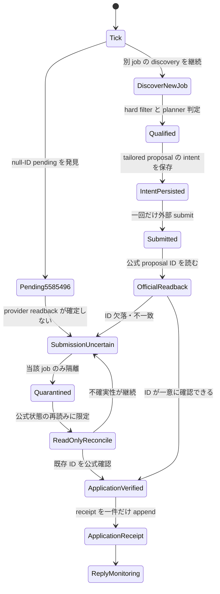

# Lancers 月額 SNS 運用で net MRR 20,000 USD を目指す設計仕様

**作成日:** 2026-08-13
**正本:** Life Manager (`Daisuke134/life-manager`)
**対象:** Lancers の acquisition、月額契約、納品、着金を一つの収益ループとして扱う
**状態:** 設計承認済み。実装計画・実装・ランタイム移行はこの仕様の後段

canonical repository は Life Manager とし、Lancers の credential、browser session、
runtime state、receipt、ledger は外部に残す。この仕様は runtime state を移動・複製・変更しない。

## 1. 目的と成功の定義

目的は、Lancers 上の単発応募数ではなく、実際に継続している顧客契約から
**net MRR 20,000 USD** を得ることにある。社内の安全目標は **25,000 USD** とする。
これは予測値や売上保証ではなく、公式 readback と受領証憑から再計算できる
受入条件である。

### 1.1 MRR の定義

計上対象は、Lancers 公式画面または公式通知で **active の月額 recurring contract**
と確認できる契約だけである。月額契約の公式フローは次の順序とする。

```text
相談・交渉 → client offer → client approval → active monthly contract
```

現在の MRR は一つの対象期間 `mrr_period`（契約の service period、形式 `YYYY-MM`）について
だけ計算する。receipt の取得日、銀行入金日、集計実行日ではなく、契約が提供する service
period に帰属させ、過去月の累積を現在の MRR に足さない。対象集合は、その `mrr_period` に
属する active recurring contract の `PaymentReceipt` だけである。

各 receipt の最低限の一意帰属キーは次である。

```text
payment_receipt_key = (contract_external_id, mrr_period, provider_receipt_id)
```

同じ `provider_receipt_id`、同じ contract、同じ `mrr_period` を二度 ledger に計上しない。
receipt は一つの `payout_batch_id` に一度だけ属し、一つの bank transaction に重複帰属させない。

対象 `mrr_period` の全 receipt を合算した net MRR は、次の式で計算する。

```text
net_mrr_usd(mrr_period) = recorded_fx(mrr_period,
  sum(gross_monthly_receipts_jpy for active recurring receipts in mrr_period)
  - sum(platform_fee_jpy for active recurring receipts in mrr_period)
  - sum(ai_cost_jpy for active recurring receipts in mrr_period)
  - sum(subcontractor_cost_jpy for active recurring receipts in mrr_period)
  - sum(refunds_jpy for active recurring receipts in mrr_period)
)
```

- `gross_monthly_receipts_jpy` は、Lancers が `confirmed/received` とした、手数料控除前の月額対価である。
- `platform_fee_jpy` は、Lancers の provider 明細にある手数料の実額である。
- `bank_settlement_jpy` は同じ provider payout batch に帰属する実際の銀行入金額であり、net の式に追加控除として入れない。
- `refunds_jpy` は同じ契約に帰属する provider-confirmed refund の実額である。AI 原価と外注原価もそれぞれ別項目として契約または支払に紐づける。
- `signed_provider_adjustment_jpy` は provider settlement 明細に記載された符号付き調整額だけであり、net の原価や fee に自動分類しない。
- provider の payout 対象額は別式で照合する。

```text
provider_payout_target_jpy(payout_batch_id) =
  sum(gross_monthly_receipts_jpy for receipts in payout_batch_id)
  - sum(platform_fee_jpy for receipts in payout_batch_id)
  - sum(refunds_jpy for receipts in payout_batch_id)
  + signed_provider_adjustment_jpy(payout_batch_id)

bank_reconciliation_delta_jpy(payout_batch_id) =
  bank_settlement_jpy(unique bank_transaction_id for payout_batch_id)
  - provider_payout_target_jpy(payout_batch_id)
```

`provider_payout_target_jpy` は provider の settlement 明細から再計算し、
各 `payout_batch_id` の対象 receipt、gross、fee、refund、符号付き adjustment は一度だけ合計する。
一つの batch に対応する `bank_transaction_id` は一件だけ、一つの bank transaction は一つの batch
だけにする。同じ receipt、bank transaction、batch の複数帰属を禁止する。
`bank_reconciliation_delta_jpy` は必ず `0` のときだけ `matched` とし、non-zero または対象 receipt、
bank transaction、provider 明細の欠落は `unknown` / `unmatched` とする。根拠付き adjustment が
あっても non-zero delta を `matched` としてはならず、G6/G7 を閉じない。手数料は net の式と
payout target の各一回だけに現れ、bank settlement を再度 fee として控除しない。
provider payout target、fee 明細、銀行入金のいずれかが未取得なら reconciliation は `unknown` とし、
MRR gate を開けない。

- `PaymentReceipt` が `received` であることを必須とし、対象 `mrr_period` 外の receipt、未受領の請求、提案額、見積額、予測、未受領の offer、単発売上は MRR に含めない。
- 為替は集計時に都合よく選ばず、取得時刻とレートを記録した `recorded_fx` を使う。
- 単発売上は別の `one_off_revenue` として表示し、gross MRR と net MRR に混ぜない。
- `$20,000` の受入判定と `$25,000` の安全目標は、同じ式・同じ証憑で検証する。

### 1.2 収益の流れ

```mermaid
flowchart LR
  A[公開案件を発見] --> B[適格性・利益性を判定]
  B --> C[意図を保存して応募]
  C --> D[公式 proposal ID readback]
  D --> E[ApplicationReceipt]
  E --> F[返信・交渉]
  F --> G[client offer]
  G --> H[承認]
  H --> I[active monthly contract]
  I --> J[月次制作・納品]
  J --> K[公式納品 readback]
  K --> L[PaymentReceipt received]
  L --> M[gross monthly receipts]
  L --> Q[provider payout target + fee statement]
  Q --> R[bank settlement readback]
  R --> S[bank reconciliation matched]
  S --> M
  M --> N[fee / AI / subcontract / refund を実額控除]
  N --> O[記録済み FX で USD 換算]
  O --> P[net MRR USD]
```



応募や storefront の件数は `P` の代替ではない。`PaymentReceipt` まで到達しない
枝は収益として閉じない。

## 2. 現行の検証済みベースライン

以下は今回観測した状態の記録であり、将来も維持される約束ではない。

| 観測 | 事実 | 計上・運用上の意味 |
|---|---|---|
| 応募 | `application_verified` が 11 件 | 公式応募 ID の readback は観測済みだが、売上を意味しない |
| 作業・納品・支払 | `WorkEvent`、`DeliveryReceipt`、`PaymentReceipt` は記録なし。baseline ledger revenue は **¥0** | 記録なしは source が official empty readback のときだけ 0 と表示し、active recurring contract の受入証拠はない |
| 不確実な応募 | project `5585496` が null-ID pending のまま繰り返し `submission_uncertain` | この job だけを隔離すべきで、現状は head-of-line (HOL) で discovery を止める |
| storefront | duplicate listing が 6 件。canonical receipt ID は `1338233` | 重複表示は販売実績ではなく、readback と重複排除の問題 |
| storefront observability | 4 状態を合算し、合計を `unprocessed` として表示 | `partial 6/6 official_timestamp_missing` という誤解を生む |
| storefront 最新実行 | `listing_readback_mismatch` を観測 | 不一致に成功アイコンを付けてはならない |
| work-sync | プロセスは alive だが productive progress がない | alive と成果を同じ health signal にしない |
| ソース配置 | deployed source は canonical repo 外 | この仕様でコピーせず、後段の versioned implementation でのみ移行する |

現状の `application_verified=11` は「応募が公式 ID まで検証された」という意味に
限定し、`observed`、`qualified`、`submitted`、`verified` を別状態で報告する。

## 3. 顧客・商品・価格

### 3.1 ICP

対象は、**SNS 担当者が 0 人または 1 人の日本の小規模 B2B 企業**である。
`qualified` は keyword 一致ではなく、公開案件本文または企業 profile に、日本の小規模 B2B で
あることと SNS 担当者 0–1 人の証拠がある状態とする。literal な人数表記がない案件では、
専任担当者がいない、代表または少人数で兼務している、初めて SNS 担当を募集している、を
強い proxy として認める。人数の明示も proxy もない pure unknown は G1 の qualified にしない。
clarification の一問で後から unknown を qualified に昇格させる設計にもせず、最初の応募前に
この証拠を揃える。依頼内容が B2B でなく、SNS 運用の継続課題が見えない案件も応募対象外とする。

### 3.2 商品境界

販売するのは、顧客のパスワードを預からない月次 SNS コンテンツ運用パックである。
含むものは、月次企画、投稿文の draft、画像の方向性、投稿カレンダー、月次改善レポート。

含まないものは、顧客アカウントへのログイン、直接投稿、広告運用、広告費の預かり・
支払い、電話営業、訪問作業である。AI を使うこと自体を価値主張にせず、顧客の課題に
結び付いた成果物を提示する。

### 3.3 パッケージ

| パッケージ | 価格 | 固定スコープ | revision の上限 |
|---|---:|---|---:|
| Founding（最初の 3 社、3 か月） | ¥98,000/月 | 1 channel、8 drafts/月、企画・画像方向性・カレンダー・改善レポート | 1 consolidated round |
| Standard | ¥198,000/月 | 1 channel、12 drafts/月、競合観察、企画・画像方向性・カレンダー・改善レポート | 1 consolidated round |
| Premium | ¥398,000/月 | 2 channels、24 drafts/月、企画・画像方向性・カレンダー・改善レポート | 2 consolidated rounds、優先 revision |

`draft` は投稿文の draft 1 件、対応する画像方向性 1 件、カレンダー上の配置 1 件を
一単位とする。revision は顧客からまとめて受け取る修正依頼を一回処理する単位であり、
上限を超える修正、追加 channel、追加 drafts、投稿代行は現契約に含めない。必要なら
別スコープとして再見積もりし、承認されるまで作業を開始しない。Premium の priority は
修正回数無制限を意味せず、許容された二回を capacity の範囲内で先に処理する意味である。

capacity は、契約が要求する base drafts と revision 最大数を合わせた draft-equivalent
で記録する。Founding は 16、Standard は 24、Premium は 72 units を一契約の上限消費と
する。capacity 使用率は、active contract が予約した units を現行 cap で割って求める。初期 intake cap は Founding 3 社分の 48 units/月とし、3 社を超える契約は、実際の
支払・納品時間・原価を測定して cap を更新するまで受けない。cap を自動で増やしたり、
スコープ外作業を capacity に隠したりしない。

### 3.4 目標構成（例示であり収益の真実ではない）

```text
3 Founding + 10 Standard + 7 Premium
= 3×¥98,000 + 10×¥198,000 + 7×¥398,000
= ¥5,060,000 gross MRR
```

この組合せは計画を考えるための例示にすぎず、受入判定は実際の `PaymentReceipt`、
実費、記録済み FX から計算する。見込み契約数や proposal 金額で置き換えない。

## 4. ループ構造と既存契約の再利用

acquisition は補助機能ではなく、最初に動かす **first-class primary loop** である。
ただし acquisition の完了は応募 receipt までであり、契約・納品・支払を省略して収益とは呼ばない。

### 4.1 四つの lane

| lane | 責務 | 収益への閉じ方 |
|---|---|---|
| acquisition | 公開案件の発見、適格化、応募、proposal ID readback、`ApplicationReceipt` | 応募は契約・収益ではない |
| negotiation / contract | 返信分類、質問、月額 offer、scope・金額確認、active 化 | Lancers の公式 monthly contract 状態を確認 |
| fulfillment | ブランド文脈、月次制作、QA、納品、readback | `DeliveryReceipt` は公式納品 readback 後だけ |
| payment / finance | PaymentReceipt、手数料・原価・返金、銀行 settlement、ledger | received の実額だけを net MRR に反映 |

storefront は acquisition の表示面であり、独立した revenue lane ではない。listing の
数、published 状態、proposal 数を MRR と合算しない。

### 4.2 外部作用の共通契約

応募、offer、納品、支払記録などすべての外部作用は、次の順序で閉じる。

```text
intent → external effect → official provider readback → receipt → ledger
```

readback が不一致・欠落・null のときは成功として記録せず、既知の provider 状態を
再読して不確実状態を解消する。単一の状態を複数 receipt に変換しない。

### 4.3 既存 acquisition の扱い

既存の acquisition は 30 分ごとに最大 20 件を discover し、planner が eligible / ineligible
を分類し、proposal・price・due date を生成して submit し、公式 proposal ID を readback して
receipt を記録する。この流れは再利用する。新しい crawler、vector DB、別の ranking 基盤、
新しい共通 kernel は作らない。

不足しているのは、利益性を含む選別と HOL isolation である。これを first slice の境界内で
最小限補う。

## 5. Acquisition の設計判断

### 5.1 検索面と hard filter

既存の公開検索に次の query を再利用する。

```text
SNS運用、SNS投稿、コンテンツ制作、X運用、LinkedIn、B2Bマーケティング、
AI活用、継続依頼、長期、月額
```

projected net gross margin は proposal 時点の JPY 見積で次の式に固定する。

```text
projected_net_gross_margin = (
  proposal_price_jpy
  - expected_platform_fee_jpy
  - expected_ai_cost_jpy
  - expected_subcontractor_cost_jpy
  - expected_revision_refund_allowance_jpy
) / proposal_price_jpy
```

各 `expected_*` は算定 source と version を記録し、`projected_net_gross_margin < 70%` は
不適格とする。実績の fee、AI、外注、refund は別の finance ledger で照合し、projected 値で
net MRR を計上しない。

次をすべて満たさない案件は応募しない。

- 日本語で、日本の小規模 B2B SNS 業務であり、SNS 担当者 0–1 人の明示証拠または強い proxy がある。
- remote で完結する。
- 顧客パスワードを要求しない。
- 直接投稿、広告費の取り扱い、電話営業、訪問を要求しない。
- AI 利用が許容されている。
- scope と deadline が現実的である。
- projected net gross margin が 70% 以上である。
- 継続契約への転換可能性がある。
- 現在の capacity 内で納品できる。

### 5.2 planner の ranking

planner 一つの決定で次の順に評価する。ML ranking system は導入しない。

1. 継続・月額の明示度
2. SNS 担当者不足が明示されているか
3. 日本の B2B 適合度
4. Founding 以上の予算に見合うか
5. 商品の固定 deliverable に合うか
6. 要件が具体的か
7. 競争、revision、deadline のリスクが低いか

### 5.3 応募上限と重複防止

- 最初の 3 active recurring contracts に到達するまでは、capacity に応じて次を守る。
- capacity 使用率が 70% 未満なら、一 tick 最大 2 応募、Japan day あたり最大 10 応募。
- 70% 以上 90% 未満なら、一 tick 最大 1 応募、Japan day あたり最大 5 応募。
- 90% 以上なら Premium 候補だけを一 tick 最大 1 件受け付け、増分後の使用率が 100% 以下になる場合に限る。それ以外は pause する。
- 同一会社または同一 job に重複応募しない。
- `submission_uncertain` は当該 job だけを quarantine し、別 job の discovery・応募を止めない。

### 5.4 Proposal の固定構造

proposal は次の五要素を持つ。一般的な「AI で効率化できます」だけの文章は不採用とする。

1. buyer が明示した具体的な問題
2. 最初の 30 日で納品するもの
3. channel 数、draft 数、revision cap
4. 価格と due date
5. 継続 scope と、必要な clarification **一問だけ**

この clarification は、既に揃っている qualified 証拠の不足を埋めるためには使わない。
pure unknown を G1 の qualified に変える質問は送らない。

## 6. 応募後から契約までの状態

`application_verified` は proposal ID の公式 readback 後にだけ付与する。

| 状態 | 次の自動動作 |
|---|---|
| `application_verified` | reply monitoring に移る |
| `buyer_replied` | 5 分以内に内容を classify する |
| `clarification_required` | 質問は一問だけ送る |
| `monthly_offer_possible` | 月額 plan proposal を送る |
| `offer_received` | scope と money を公式画面で確認する |
| `contract_active` | fulfillment lane を開始する |
| `lost` | 理由を記録する |
| `submission_uncertain` | 当該 job を quarantine し、公式再読みに限定する |

`submission_uncertain` から成功状態へ推測で進めない。再送は provider readback が未実施
だからという理由だけで行わず、既存の intent・provider 状態・receipt の一意性を検証して
から判断する。

### 6.1 first slice の状態フロー



first slice の証明は、`5585496` の不確実性を消すことではない。その job が二重 submit
されず、かつ別の新規 qualified job の discovery と一回の検証済み応募を妨げないことを
同じ実行で示すことである。

## 7. Fulfillment と finance

### 7.1 Fulfillment

active contract ごとに durable な brand context を保持し、月次で次を生成する。

- 月次企画
- パッケージで定めた投稿 draft
- 各 draft の画像方向性
- 投稿カレンダー
- 月次改善レポート

納品前に factuality、禁止内容、重複、brand fit を QA する。revision cap を超えたら
作業を増やさず、契約外 scope として再見積もりに戻す。`DeliveryReceipt` は納品物を作った
時点ではなく、公式 provider readback が完了した時点でだけ append する。control tick が
再実行されても、active work を最初からやり直さず、既存 intent・receipt・state を読み取る。

### 7.2 Finance

`PaymentReceipt` が `received` であることを必須とし、次を分離して記帳する。

- gross receipts
- Lancers fee
- AI cost
- subcontractor cost
- refund
- one-off revenue
- active recurring MRR
- net MRR

各 receipt は `contract_external_id`、契約 service period の `mrr_period`、`provider_receipt_id`
へ一意に帰属させ、対象 `mrr_period` 外の receipt や過去月累積を現在 MRR に入れない。各
`payout_batch_id` の対象 receipt、gross、fee、refund、符号付き provider adjustment を一度だけ
合計し、unique `bank_transaction_id` 一件と照合する。同じ receipt、batch、bank transaction を
複数帰属させない。`bank_reconciliation_delta_jpy=0` だけを `matched` とし、non-zero または
missing は `unknown` / `unmatched` のまま G6/G7 を閉じない。
支払が pending、推定、画面表示だけで受領証拠がない場合は net MRR に入れない。

## 8. 真実性・安全不変条件

1. **外部作用の重複ゼロ:** intent の一意キー、provider readback、receipt の一意キーを使い、再実行で二重応募・二重納品・二重請求をしない。
2. **不確実状態の隔離:** null ID や readback mismatch は対象 job だけを quarantine し、blind resubmit と HOL block を禁止する。
3. **金額の過大計上ゼロ:** `PaymentReceipt received` 以外を net MRR に入れず、fee・原価・refund と FX を別記録する。
4. **secret 漏洩ゼロ:** 顧客 password、Lancers credential、browser session、認証コードを repo、proposal、通常 report、ledger の公開欄へ書かない。
5. **不一致を成功にしない:** provider の ID、状態、timestamp、金額が一致しないときは success icon、receipt、収益記帳を発行しない。
6. **商品境界を越えない:** 顧客 password、直接投稿、広告運用、広告費、電話営業、訪問作業は受けない。
7. **証拠と推論を分ける:** observed、qualified、submitted、verified、active、received を一つの件数に潰さない。

## 9. Observability と owner report

### 9.1 表示規則

- storefront は `published`、`paused`、`hidden`、`draft` を別々に表示する。四状態の合計を `unprocessed` と呼ばない。
- `listing_readback_mismatch` に成功アイコンを付けない。
- 応募は `observed`、`qualified`、`submitted`、`verified` を別々に表示する。
- `0` は provider の official empty readback または ledger で検証済みの zero に限る。記録なしの観測、source failure、missing timestamp は `unknown` / `unverified` と表示する。
- selector、内部 timestamp code、内部 lock code は通常の owner report に出さない。
- state change、incident、recovery は直ちに報告し、正常な executive summary は一日一回にまとめる。
- report には active recurring contracts、gross MRR、net MRR、delivery status、実際の costs、次の automatic action を含める。

### 9.2 現状を正しく表す report 例

```text
Lancers baseline
- mrr_period: 2026-08 (service period の対象例。過去月累積なし)
- application_verified: 11
- WorkEvent: unknown (official empty readback 未確認) / DeliveryReceipt: unknown (official empty readback 未確認) / PaymentReceipt: unknown (official empty readback 未確認)
- gross MRR: ¥0 (ledger verified zero) / net MRR: USD 0 (ledger verified zero)
- bank settlement: unknown (provider payout target と銀行 readback 未確認)
- storefront: published・paused・hidden・draft を個別表示
- storefront incident: duplicate listing 6 件、canonical receipt 1338233、latest readback mismatch
- quarantined job: 5585496 (submission_uncertain)
- next automatic action: 5585496 を再送せず隔離したまま、別の qualified job を discover
```

この report は「11 件応募したので売上見込みがある」「listing 6 件なので未処理」とは
言わない。未検証の値は `unknown` / `unverified` または状態名で表し、推測値を補わない。

## 10. 段階的 acceptance gate

各 gate は、その前段の証拠が揃った後にだけ開ける。以下は実装ファイルの手順ではなく、
ユーザーが次に体験する収益 slice の境界である。

| Gate | 受入条件 | 必須証拠 |
|---|---|---|
| G0 定義 | MRR 式、商品境界、4 lane、receipt 順序、安全不変条件がこの仕様と一致する | 仕様レビュー記録 |
| G1 first slice | 日本の小規模 B2B と SNS 担当者 0–1 人の明示証拠または強い proxy、および 70% 以上の projected margin がある新規 qualified job を発見し、tailored proposal を一度 submit し、公式 proposal ID を readback し、`ApplicationReceipt` を正確に一件 append する。`5585496` は二重 submit されず、別 job の discovery を止めない | ICP の証拠/proxy、margin 式と各見積 source、provider ID、intent/effect/readback/receipt、5585496 quarantine 証拠、独立 discovery 証拠 |
| G2 truthful acquisition | storefront の四状態、readback mismatch、応募の四段階、incident/report 頻度を正しく表示する | 6 duplicate listing を成功扱いしない report と state-change report |
| G3 profitable acquisition | 最初の 3 active recurring contracts まで、hard filter、固定式による 70% margin、recurring/B2B ranking、proposal 固定構造、capacity 使用率別 quota（<70%=2/10、70–<90%=1/5、>=90%=Premium のみかつ 100% 以下）、重複防止が実際に働く | qualified/ineligible 判定、ICP 証拠/proxy、margin 算定と各 source、応募上限、duplicate 拒否の readback |
| G4 contract | buyer reply を 5 分以内に classify し、一問の clarification、月額 offer、scope・money 確認を経て active contract を公式 readback する | provider の offer・approval・active 状態と契約 receipt |
| G5 fulfillment | brand context を再利用し、固定 scope と revision cap 内で制作・QA・納品し、公式 readback 後だけ `DeliveryReceipt` を出す | deliverable hash、QA 結果、revision count、delivery readback |
| G6 finance | 対象 `mrr_period` の active recurring contract receipts だけを `contract_external_id + mrr_period + provider_receipt_id` へ一意帰属させ、provider payout target、fee 明細、銀行 settlement を `payout_batch_id` ごとに照合する。unique bank transaction 一件との `bank_reconciliation_delta_jpy=0` だけを `matched` とし、non-zero/missing は `unknown` / `unmatched` のままにする。net 式では fee・AI・subcontract・refund を実額で一度だけ控除し、FX を記録して net MRR を再計算できる | 対象 mrr_period、provider receipt、receipt key、payout batch、payout target、fee 明細、unique bank transaction、銀行照合、cost attribution、ledger、計算結果 |
| G7 target | 対象 `mrr_period` の active recurring Lancers contract receipts だけから net MRR が USD 20,000 以上。過去月の累積、未受領、単発、重複 receipt は除外し、USD 25,000 は内部安全目標として別表示する | 対象 mrr_period、複数契約の active readback、全 PaymentReceipt、receipt key、全 payout batch、各 unique bank transaction、全 cost、recorded FX、全 batch の `bank_reconciliation=matched`、再計算可能な ledger |

G1 が閉じるまで、product mutation、negotiation、fulfillment、新規 common kernel、新規 DB、
multi-account、別 marketplace は開始しない。

## 11. First implementation slice の厳密な境界

Slice 1 は acquisition の一つの実証だけである。

### 含むもの

1. 既存 public search から新規案件を一件 discover する。
2. hard filter と planner で qualified と判定する。
3. buyer の具体的課題を含む tailored proposal、価格、due date、継続 scope、質問一問を作る。
4. intent を保存し、外部 submit を一回だけ行う。
5. Lancers 公式画面で proposal ID を readback する。
6. verified な場合だけ `ApplicationReceipt` を正確に一件 append する。
7. project `5585496` は `submission_uncertain` として quarantine し、blind resubmit しない。
8. `5585496` の状態にかかわらず、新規 job の discovery と上記応募が完了することを示す。

### 含まないもの

月額商品そのものの変更、buyer との negotiation、monthly offer の送信、契約の active 化、
納品、顧客ブランド context、直接投稿、広告運用、PaymentReceipt、net MRR 記帳、self-improvement、
new common kernel、new DB、multi-account、別 marketplace は Slice 1 に含めない。

`mrr_period`、`contract_external_id`、`provider_receipt_id`、`payout_batch_id`、
`bank_transaction_id` の一意帰属 schema は既存 schema にないため、後段 finance slice の必須
schema evolution とする。Slice 1 ではこの schema を作成・移行・記帳せず、応募 receipt の
公式 ID 検証だけを行う。

Slice 1 の成功は「応募件数が増えた」ではなく、未確定 job が全体を止めない状態で、
一件の新規応募が公式 ID と一件の receipt まで閉じることである。

## 12. 後段の順序と自己改善

後段は次の順で進める。

1. truthful acquisition / reporting
2. profitable B2B filter、tailored proposal、capacity
3. reply / monthly contract
4. fulfillment
5. payment / net MRR
6. self-improvement

self-improvement は最初の実支払の後にだけ開始する。比較するのは application volume ではなく、
product version、proposal version、job type ごとの net MRR、retention、revision cost である。
一度に一変数だけを変え、劣化したら戻す。最初の payment 前に learning infrastructure や ML
ranking を作らない。

後段の各 slice は既存の Superpowers workflow（writing-plans → using-git-worktrees → subagent-driven-development → TDD RED/GREEN → requesting/receiving-code-review → verification-before-completion → finishing branch）を参照する。fresh adversarial
subagent は一次証拠で Critical / Important のみを block とし、Minor / nitpick は記録する。
fix と scoped review は一 slice 最大 3 round とし、3 round 後も load-bearing issue が残る
場合は round 4 を行わず、systematic debugging または architecture に戻る。

## 13. Best / base / worst の target path

| 経路 | 進み方 | net MRR の扱い |
|---|---|---|
| Best | 最初の 3 Founding 社が実支払・継続し、納品原価を保ったまま Standard/Premium へ拡張。例示構成の 3/10/7 契約を active 化し、recorded FX と実費控除後に USD 20,000 を超える | ¥5,060,000 は gross の例であり、net MRR は証憑からのみ確定する。USD 25,000 は安全目標として別 gate |
| Base | Founding 3 社を先に閉じ、capacity と margin を実測してから一件ずつ Standard/Premium を追加。支払・retention・revision cost が揃わない期間は target を未達のまま正直に表示 | proposal、offer、未受領請求を足して target 到達とは言わない |
| Worst | qualified job は見つかっても buyer が月額契約・支払に進まず、または原価・revision が margin を壊す | `PaymentReceipt` が official empty readback または ledger verified zero なら net MRR は ¥0 相当として停止・原因報告し、source failure なら `unknown` とする。応募数で穴埋めしない |

Best でも構成と為替は仮定であり、受入は G6/G7 の実証だけである。Base と Worst を
正常な結果として報告できることも設計の一部である。

## 14. 非目標

- Lancers 以外の marketplace や複数アカウントを同時に立ち上げること
- 新しい crawler、vector DB、ML ranking、新しい revenue DB、別の common kernel を作ること
- storefront listing 数、応募数、proposal 額を売上や MRR として表示すること
- 顧客 password を預かること、直接投稿、広告運用、広告費を扱うこと
- 単発案件を MRR に混ぜること、未受領の請求を収益にすること
- 実支払前に自律学習基盤を構築すること
- deployed source をこの仕様作成時に canonical repo へコピーすること
- Slice 1 で negotiation、fulfillment、finance、product expansion を先取りすること

## 15. 最も強い棄却案と棄却理由

最も強い代替案は、複数 marketplace・複数アカウント・大量応募を先に増やし、
storefront と応募件数を成長指標にしてから商品と payment を考える案である。短期的には
案件母数を増やし、空振りを減らせるように見える。

しかしこれは、現状の `submission_uncertain` が HOL を止め、duplicate listing が 6 件あり、
`WorkEvent`・`DeliveryReceipt`・`PaymentReceipt` に記録がないという一次観測を隠す。さらに
Lancers fee、AI 原価、revision cost、返金を追跡できず、応募の成功を MRR の成功と誤認する。
まず一つの Lancers lane で、公式 readback・一意 receipt・実支払までの境界を閉じる方が、
失敗時に戻せて実際の収益を測定できる。したがってこの代替案は採用しない。

## 16. この設計が間違う最有力の筋

最も起こりやすい誤りは、ループの信頼性ではなく、**日本の小規模 B2B がこの固定 scope と
価格で月額契約を買うほどの価値を感じないこと**である。G1〜G3 が通っても、qualified reply
から offer・初回支払へ進まない、または revision cost が 70% margin を壊すなら、この商品仮説
が間違っている。応募数を増やして隠さず、実支払・retention・revision cost を観測し、
G4〜G6 を開けない理由として報告する。self-improvement は最初の実支払後、一変数ずつ行う。
