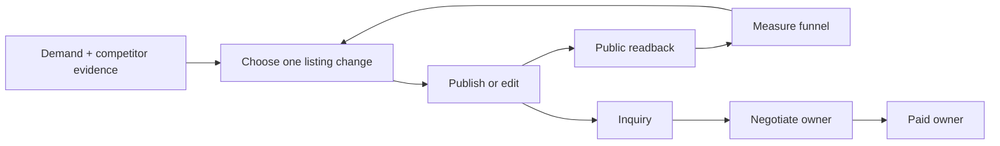
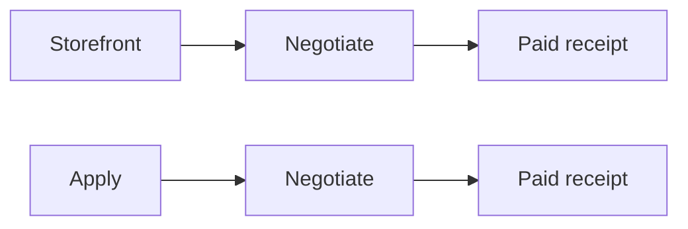
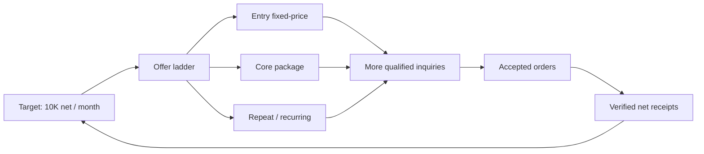

# Storefront Revenue Loop SSOT

Status: INCOMPLETE. The runner is wired and observable, but the Storefront revenue function is not complete. This document owns Storefront only.

## 1. Overview

Storefront turns verified demand and owned delivery capability into public, versioned marketplace services. It improves existing listings, creates a new listing only when evidence and delivery capacity justify it, verifies the public result, and attributes downstream revenue without taking ownership of buyer conversation or paid delivery.



The two earning funnels remain separately attributable:



Waiting is not work. A 14-day window may control when a hypothesis can be judged, but the TODO is to build the selector, executor, verifier, ledger, and reporter now. While one hypothesis matures, the loop may prepare evidence for the next hypothesis but must not silently overwrite the active experiment.

## 2. Ownership boundary

| Owner | Owns | Must not own |
|---|---|---|
| Storefront | market evidence, service contract, images/copy/scope/packages/price versions, create/edit, public readback, Storefront attribution and reporting | buyer replies, negotiation decisions, paid fulfillment |
| Negotiate | inquiry/talk-room replies using the exact service version and contract handed off by Storefront | listing mutation, paid artifact production |
| Paid | accepted/paid order, delivery, revision and real payment receipt | listing experiments, inquiry acquisition |
| Apply | outbound applications and Apply attribution | Storefront listing mutation |

Cross-loop integration is an immutable handoff event, not shared ownership: `platform`, `service_id`, `listing_version`, `origin=storefront|apply`, `conversation_id`, `order_id`, and timestamps. Git ownership follows the same boundary; Storefront changes never modify `paid_direct.py`.

## 3. Evidence-backed design rules

- Coconala says an unclear title is passed over without a click, recommends putting appeal points in service images, and says both supported and unsupported scope should be explicit. Source: [ココナラ「売上を増やすには」](https://coconala-support.zendesk.com/hc/ja/articles/218179338-%E5%A3%B2%E4%B8%8A%E3%82%92%E5%A2%97%E3%82%84%E3%81%99%E3%81%AB%E3%81%AF).
- Upwork Project Catalog recommends starting from demanded client requests, packaging fixed deliverables, offering up to three tiers, showing work samples, and collecting client requirements. Source: [Upwork Project Catalog guide](https://support.upwork.com/hc/en-us/articles/360057397533-How-to-create-a-project-in-Project-Catalog).
- GitHub documents `CODEOWNERS` as the mechanism for naming the people or teams responsible for repository areas. Storefront and Paid therefore require explicit file ownership and separate integration commits. Source: [GitHub CODEOWNERS](https://docs.github.com/en/repositories/managing-your-repositorys-settings-and-features/customizing-your-repository/about-code-owners).

These sources determine the listing contract: one buyer-visible outcome, exact inclusions and exclusions, required inputs, delivery time, revision rule, proof/gallery, tier or add-on ladder, FAQ, and a repeat/recurring path where the service genuinely supports repeat work.

## 4. Current verified state

- The historical implementation is in worktree `.worktrees/storefront-revenue-os`, branch `fix/storefront-revenue-os`, current HEAD `b8f15537a`. The four accidental Paid changes were reverted by `06e9ac0dc`, `1a6894b6f`, `5beb42ce2`, and `b8f15537a`; the branch remains forbidden from whole-branch merge.
- Latest `main` contains this Storefront SSOT and shared browser/outbox runtime, but not the Coconala Storefront production entrypoint. Active integration therefore uses clean worktree `.worktrees/storefront-main`, branch `feat/storefront-loop`, based on `origin/main`, and imports only the Storefront dependency closure.
- Paid is intentionally stopped by its owner. Storefront integration does not change its plist, release, process, project state, artifacts, receipts, or restart state.
- Launchd label `ai.anicca.hf-gig-storefront-direct` runs `storefront_direct.py --effect` every 1800 seconds. The latest observed pass completed normally with `official_services_read=11`, `competitor_evidence_count=8`, `effect/readback/duplicate=0/0/0`, released lease, and deduped Telegram reporting.
- The loop is operational but functionally stuck: `storefront_direct.py` hardcodes service `4330368`, field `FAQ`, and the `FAQ_ABSENT` guard. The official listing already has an FAQ, so it repeatedly returns a correct no-op and cannot select the next improvement.
- The scorecard already ranks the next actionable hypothesis as service `4330368`, field `image`, current score `0`, metric `views_to_inquiry`. The executor does not consume that backlog.
- Eleven official services are listed. The 20-slot quota is capacity, never authority to create nine more. A new service requires distinct demand evidence, owned capability evidence, and available delivery capacity.
- Clean Storefront commits are pushed on `feat/storefront-loop`: `d65f13bf9` imports the dedicated owner, `2854097ad` selects the scorecard hypothesis, and `b655a83d0` closes an active-experiment no-op before the LLM judge. Storefront tests are `22 passed`.
- Real pass `storefront-selector-live-b655a83d0` exposed that `origin/main` had obsolete fixed-`:9222`, tokenless CDP helpers. Commit `a695e79e4` restores the byte-identical installed fenced runtime and its existing tests; 40 focused checks pass.
- Real pass `storefront-selector-live-a695e79e4` then completed with official/competitor `11/8`, effect/readback/duplicate `0/0/0`, next hypothesis `4330368/image`, metric `views_to_inquiry`, Telegram `deduped/20073`, and lease released. The hypothesis is prepared but non-executable while the FAQ experiment remains active; the measurement window is not a TODO and does not block building the image adapter now.
- Commits `1a13109d0` and `0244e1660` add the verified 1220x1016 OpenCV hero asset/contract and the fenced multipart publication adapter. The asset regenerates to the exact contract SHA; the isolated seller form produced one blob preview and exact field `data[UploadedFile][n1][image_files]` without submitting. Forty-two focused checks pass. Real pass `storefront-image-fence-live-0244e1660` preserved the active-experiment fence with public image count `0`, effect/readback/duplicate `0/0/0`, and no residual Storefront lease.
- Commit `e53a70689` binds the official VBA listing version, JPY6,000 base, JPY3,000 add-on, JPY5,000 maintenance, required inputs and two inquiry answer patterns into the runtime contract ledger. Real loop runs appended `1` then replayed `0`. Commit `3649a0bb9` reports official/competitor counts, contract inventory, selected hypothesis and fence in natural Japanese; real Telegram delivery is `sent/20425`.
- Storefront now derives version-bound contracts for all 11 official services from six owned-capability families while preserving the VBA-specific override. Real pass `storefront-family-contract-live-37c975927` read official/competitor `11/8`, appended the missing `10`, and reached contract total `11`. The first replay exposed a transient truncated service DOM; the inventory reader now retries the full 120,000-character public page until the official service scope exists. Pass `storefront-family-contract-replay-fixed-37c975927` completed with appended `0`, total `11`, effect/readback/duplicate `0/0/0`, and a released lease.
- Read-only inspection of the installed Negotiate owner shows its composer currently receives only conversation, verified research and verified application context. It has no service-ID or Storefront-contract consumer. Storefront publishes the immutable versioned contract ledger, but the Negotiate owner must add the consumer; Storefront must not patch the Negotiate implementation to hide this boundary gap.
- The seller price select stores the tax-inclusive internal option value while its label and public page show the seller price: option `22000` reads `20,000円`, and option `3300` reads `3,000円`. Storefront contracts bind both values and reject a mutation unless the exact option/value pair exists; the loop never guesses the conversion.
- Storefront analytics now reads all 11 official service pages, not only OpenCV. Real pass `storefront-catalog-kpi-live-458fab724` recorded per-service snapshots and official 30-day totals of 441 views, 0 purchases and 3 favorites, preserving ten first-baseline deltas as unknown, and sent Telegram `20444`. Replay resolved all deltas to zero and sent the changed state as `20446`; a third identical pass returned `deduped/20446`. Every pass released the Storefront lease and produced no public mutation.
- Official search for `SEO 記事 構成 執筆` exposed 3,899 results; observed comparables include service `2329055` (216 sales, 185 reviews, JPY6,000), `1884761` (331 reviews, JPY20,000), and `1051841` (443 reviews, JPY35,000). The owned public portfolio contains `SEO記事執筆 構成案・執筆納品事例`, so the first distinct new-listing candidate is grounded in both demand and owned capability.
- Storefront created nonpublic Coconala draft `4355225` in the official category `19/372/150` and bound title, catchphrase, scope, exclusions, buyer inputs, JPY3,000 display price (`3300` option), five-day delivery and one-order capacity in `seo-article-v1.json`. The first live save exposed page-hydration and delayed-readback races; the adapter now waits for each dependent category option and polls exact saved-state equality. Full pass `storefront-new-draft-readback-a5a969097` completed with official/competitor `11/8`, draft `effect/readback/public_effect=0/1/0`, KPI `441/0/3`, released lease and Telegram `20482`. The earlier failed pass had already saved the exact draft; the successful replay correctly did not claim a second effect.
- The SEO hero is a deterministic 1220x1016 PNG bound to SHA `5e9ebb2f...` and contains only contract-backed claims. Blob preview was explicitly rejected as proof: the adapter now submits native multipart with hidden `mode=draft`, closes that tab, opens a fresh official tab, and requires all fields plus exactly one persisted image. Direct adapter proof produced `1/1/1/0` for effect/readback/image/public, then replay `0/1/1/0`. Full pass `storefront-new-draft-image-full-final-18b6c261b` reproduced replay `0/1/1/0`, official/competitor `11/8`, active contracts `11`, KPI `441/0/3`, released lease and Telegram `20519`.
- The SEO draft now binds its category-specific completeness and ladder: features `企画・構成/リサーチ/SEO対応`, industries `ビジネス・法律/IT・テクノロジー/メディア・マスコミ`, Japanese, deliverable format, one free revision, JPY1 per character, JPY3,000 for an extra 3,000 characters, and repeat purchase enabled with a 5% discount. The portfolio link is owned proof and the SHA-bound hero is the gallery asset. Direct save/readback then replay produced effect `1` then `0`; full pass `storefront-new-draft-ladder-full-3a940473d` reproduced `effect/readback/image/public=0/1/1/0`, sent Telegram `20527`, and released the lease.
- The publication adapter is present but remains mechanically fenced. It requires the exact fresh draft contract, one image, no duplicate title/service, catalog capacity, no existing-listing effect, and no higher-priority/active hypothesis; it then submits only `mode=open` and requires a fresh official public URL, title, catchphrase, price and image readback. Real pass `storefront-new-publish-fence-984414d4a` returned `publication_guard=active_experiment_measurement_open`, public effect `0`, deduped Telegram `20527`, and released the lease. Eligibility is an external terminal event, not a waiting task.
- Storefront commit `85eaa6d86` is on GitHub `main` and in readonly immutable release `/Users/anicca/gig/releases/life-manager/85eaa6d...`. Only `ai.anicca.hf-gig-storefront-direct` was reloaded. Its natural installed wake `storefront-direct-1786843673261706000-46042` exited `0` with official/competitor `11/8`, active contracts `11`, KPI `441/0/3`, draft `0/1/1/0`, active publication fence, Telegram `deduped/20527`, and released lease. Before/after SHA comparison found zero changes to every non-Storefront gig plist.
- Official analytics now retries each service independently and records an exhausted readback as `unknown`, never zero and never a reason to skip the rest of the Storefront wake. Reports separate unknown current values from unknown comparisons.

## 5. Acceptance criteria

The Storefront loop is complete only when all are true:

1. It inventories every owned public service and records an immutable listing version with exact public readback.
2. It selects one eligible hypothesis from the scorecard instead of a hardcoded FAQ target.
3. It can execute and verify the supported mutation for that hypothesis; the first required slice is the top-ranked image gap.
4. It refuses mutation when preconditions, identity, evidence, ownership, or duplicate guards fail.
5. It creates a new listing only through the evidence + capability + capacity gate, then proves one public creation and `duplicate=0` by official readback.
6. Each inquiry and paid receipt is attributable to `storefront` or `apply`; unknown attribution remains `unknown`, never coerced to zero or assigned by guess.
7. Hourly Telegram reporting is natural language, emoji-led, idempotent, and contains current funnel totals, changes since the last report, good news, bad news, errors, unknowns, and the next action. Same state produces `send=0`; changed state produces exactly `send=1`.
8. Storefront code/spec/config are on Life Manager `main`; the installed Storefront release is built from that main SHA; obsolete Hermes/gig-pass-shell entrypoints have zero executable reachability before their recoverable removal; temporary worktrees and branches are removed.
9. Storefront does not alter or restart Negotiate, Paid, or Apply owners during implementation or verification.

## 6. KPI contract

Event rows are append-only and deduped by a stable source event ID. Monetary metrics use real marketplace/payment evidence only.

| Stage | Required metrics | Derived KPI |
|---|---|---|
| Storefront exposure | listing impressions/views if officially available; otherwise `unknown` | view change by listing version |
| Consideration | service-page views, favorites if officially available, inquiries | `inquiries / views` when both known |
| Negotiation | qualified inquiries, offers, accepted orders, origin | `accepted / qualified inquiries` |
| Paid | gross receipt, fees, refund, net receipt, origin | `net revenue`, `revenue / accepted order` |
| Quality | revisions, completion, rating/review, repeat purchase | revision rate, completion rate, repeat rate |

Hourly snapshots and daily rollups use the same ledger. A report compares its cutoff cursor with the prior sent cursor, so replay cannot double count. Sample owner-facing message:

> 🏪 Storefront hourly: 11 services live. Since the last report: +120 views, +3 inquiries, +1 accepted order, ¥18,000 net receipt. Best mover: VBA image v3. ⚠️ One listing has unknown view data; it is excluded from conversion rate. Next: verify the public readback for listing 4330368. Apply-origin revenue is reported separately.

If no metric changed, the notifier records a deduped receipt and sends nothing. Errors send one concise alert with affected listing, failed stage, last known-good version, automatic containment, and next retry action.

## 7. Path to 10K monthly net revenue

`10K` is a target equation, not a guaranteed claim. Currency is configured explicitly. Only verified net receipts count.



The operating equation is `monthly_net = sum(verified net receipts attributed to storefront)`. Improvement diagnoses the first weak known edge: exposure → inquiry, inquiry → acceptance, acceptance → paid, or paid → repeat. It never lowers price by reflex when the failing edge is unknown.

## 8. Ordered execution plan — now to finish

Only the first unfinished item is active.

### S0 — Split and publish the Storefront SSOT

- [x] Create this Storefront-only spec from the latest Life Manager `origin/main`.
- [x] Push it to `main`, then remove its temporary documentation worktree and branch.

Verification: GitHub `main` contains this file; local worktree list has no `storefront-loop-ssot` entry.

### S1 — Integrate Storefront-only production code and replace the fixed FAQ selector

- [x] Import only `storefront_direct.py`, `listing_inventory.py`, `gig_paths.py`, Storefront config/schema/plist, Telegram outbox dependency, and Storefront tests into the clean `main`-based branch.
- [x] Read the official catalog and `storefront-catalog-scorecard.json`.
- [x] Select the first eligible backlog item under a one-active-experiment fence.
- [x] Persist hypothesis ID, listing version, field, baseline, success metric, evidence, and guard reason.
- [x] Bypass the LLM judge when an active experiment makes the prepared hypothesis non-executable; close a truthful guarded no-op instead.
- [x] Restore the already-proven fenced CDP helper dependency from the installed production release/history into clean main provenance; do not redesign it and do not restart another owner.
- [x] Re-run the real Storefront pass and prove `4330368/image`, effect/readback/duplicate=`0/0/0`, Telegram receipt, and released lease.

Verification: isolated selector check chooses `4330368/image` from the current scorecard; a real scheduled pass records that exact prepared hypothesis without touching other loops.

### S2 — Execute and verify the first real listing improvement

- [x] Build the first buyer-facing hero from verified capability and bind its dimensions, claims and SHA in a machine-readable contract.
- [x] Implement the authenticated multipart image adapter for only service `4330368`, including exact precondition, non-image field delta guard, durable intent and recovery.
- [x] Add official public readback for exact service identity, listing version, unique service image IDs and image count.
- [x] Prove with the real active experiment that the adapter remains fenced: image count `0`, effect/readback/duplicate `0/0/0`.
- [ ] On the first eligible Storefront wake, publish the prepared image, require image count `1`, effect/readback/duplicate `1/1/0`, then rerun and require no duplicate. Eligibility is external state, not a waiting TODO; all executable harness work continues below.
- [ ] Roll back to the last known-good listing version if the first eligible public readback disagrees.

Verification: official browser DOM and screenshot show the expected images; effect=1, readback=1, duplicate=0; a second execution is idempotent.

### S3 — Generalize supported listing contracts

- [ ] Make image, title/outcome, body/scope, package/add-ons, FAQ and price adapters consume the same versioned contract.
- [x] Add the first VBA inquiry playbook covering implementation-style questions, lookup/transfer questions, required samples and clarifications, delivery, add-on and recurring maintenance facts.
- [x] Bind the VBA playbook to the exact official service version and emit it once to the append-only Storefront contract ledger; replay appends zero.
- [x] Generate the remaining ten version-bound contracts from six explicit service-family playbooks; fail closed when an official service has neither a dedicated contract nor a family mapping.
- [x] Run the production loop and prove 11/11 contract coverage, first-run append 10 and replay append 0.
- [ ] Negotiate owner consumes the exact Storefront contract/version and attaches `conversation_id`; do not implement replies in Storefront.

Verification: one existing service per adapter can be rendered and diffed without publishing; the production change remains one selected field on one service.

### S4 — Complete the new-listing path

- [x] Rank unmet demand from official/competitor evidence against owned capability; choose one SEO article outcome, not unused quota.
- [x] Bind a distinct outcome, official category, exact delivery contract, exclusions, buyer inputs, price representation and capacity.
- [x] Create and exact-readback one nonpublic official draft through the real Storefront loop; replay performs zero duplicate save.
- [x] Create and bind the 1220x1016 hero image and add it to the same draft without publishing; fresh-tab replay proves one persisted image and zero duplicate upload.
- [x] Bind owned portfolio proof, SHA-bound gallery image, category completeness, one justified add-on and a 5% repeat-purchase path without unsupported claims.
- [x] Build the gated `mode=open` publisher, official public readback and already-public/duplicate/capacity guards; verify the active experiment produces public effect zero.
- Terminal event (not a waiting TODO): the first eligible wake publishes draft `4355225`, records its official public URL, and all later wakes observe `already_public` with zero duplicate service.

Verification: official service ID and URL exist, every contract field matches, duplicate=0, and a rerun does not create another service.

### S5 — Complete attribution, KPI ledger and Telegram reporting

- [x] Read official views, purchases and favorites for every owned service; retain unavailable impressions and revenue as unavailable rather than zero.
- [x] Persist service-ID snapshots, catalog totals and same-window deltas; keep missing baselines as unknown.
- [x] Emit the catalog totals/deltas in the natural-language hourly Telegram report and prove changed-state send plus identical-state dedupe.
- [ ] Join Storefront listing version → inquiry → Negotiate conversation → Paid receipt by stable IDs.
- [ ] Keep Apply attribution parallel and mutually exclusive; preserve `unknown` gaps.
- [ ] Add verified net receipt, revision, rating/review and repeat-purchase fields after the owning loops expose their immutable receipts.

Verification: reconcile ledger totals against official browser screens and real receipts; inject one replay and prove no double count/no duplicate Telegram send; inject missing view data and prove `unknown`, not zero.

### S6 — Production integration and cleanup

- [x] Preserve the completed Paid reverts and carry zero Paid implementation into Storefront.
- [x] Integrate the clean Storefront-only history into GitHub `main`; main and the feature tip both resolve to `85eaa6d86` at integration.
- [x] Keep runtime ownership explicit: the dedicated plist calls `storefront_direct.py` directly and Storefront imports or subprocesses no Hermes/gig-pass entrypoint.
- [x] Build a readonly immutable release from the main SHA and reload only `ai.anicca.hf-gig-storefront-direct`; non-Storefront plist hashes remain byte-identical.
- [x] Observe one installed release wake with exit 0, official readback, draft readback, Telegram dedupe and released lease.
- [ ] Remove the merged temporary Storefront worktree/branch and stale Storefront-only development pointers. Shared historical Hermes/gig-pass files remain untouched while another owner may still reference them; they have zero Storefront executable reachability.

Verification: `main` is the ancestor of the installed release SHA; Storefront launchd arguments point to that release; all Storefront checks and one real scheduled pass succeed; other three loop labels/config/state are byte-for-byte unchanged; `git worktree list`, local branches, remote branches, and reachability searches contain no obsolete Storefront development path.

## 9. Test matrix

| Risk | Proof |
|---|---|
| Wrong listing changed | exact service ID + precondition hash before effect; official readback after effect |
| Duplicate public service | catalog identity scan before create; second run creates zero |
| Unsupported claim or scope | every public claim links to owned proof; inclusions/exclusions round-trip |
| Lost/incorrect attribution | stable IDs across handoff; official receipt reconciliation; unknown preserved |
| Duplicate Telegram/report money | cutoff cursor + event dedupe + send receipt; replay proves zero duplicate |
| Cross-loop interference | diff launchd/config/state for Negotiate, Paid and Apply before/after |
| Legacy resurrection | reachability scan covers launchd, installers, imports, subprocesses, symlinks and authoritative docs |
| Branch/worktree fragmentation | installed SHA descends from GitHub main; temporary branch/worktree absence is asserted |

## 10. Repository target and intended tree

Repository SSOT: `Daisuke134/life-manager`.

```text
life-manager/
├── docs/superpowers/specs/2026-08-16-storefront-loop-ssot.md
└── skills/earn/gig/
    ├── scripts/storefront_direct.py
    ├── config/storefront-catalog-scorecard.json
    ├── contracts/storefront/
    ├── tests/storefront/
    └── launchd/ai.anicca.hf-gig-storefront-direct.plist
```

The exact final tree may reuse existing directories to minimize churn, but Storefront-owned production, config, contracts, tests, and launchd ownership must remain identifiable and must not be mixed into Paid implementation files.
