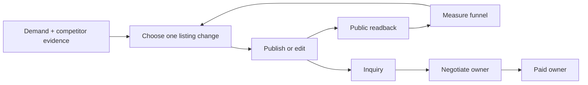
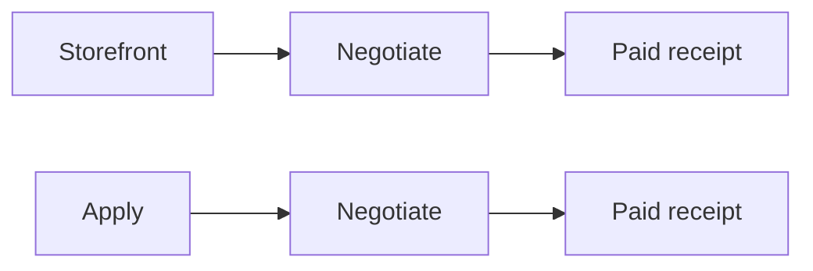
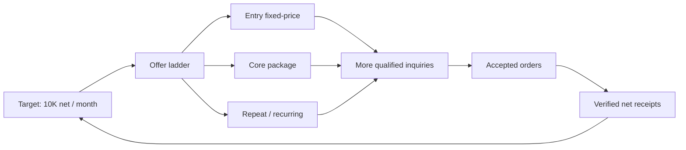

# Storefront Revenue Loop SSOT

Status: INCOMPLETE. The runner is wired and observable, but the Storefront revenue function is not complete. This document owns Storefront only.

## 1. Overview

Storefront turns verified demand and owned delivery capability into public, versioned marketplace services. It improves existing listings, creates a new listing only when evidence and delivery capacity justify it, verifies the public result, and attributes downstream revenue without taking ownership of buyer conversation or paid delivery.



The two earning funnels remain separately attributable:



Waiting is not work. A 14-day window may control when a hypothesis can be judged, but the TODO is to build the selector, executor, verifier, ledger, and reporter now. While one hypothesis matures, the loop may prepare evidence for the next hypothesis but must not silently overwrite the active experiment.

## 2. Ownership boundary

| Owner | Owns | Must not own |
|---|---|---|
| Storefront | market evidence, service contract, images/copy/scope/packages/price versions, create/edit, public readback, Storefront attribution and reporting | buyer replies, negotiation decisions, paid fulfillment |
| Negotiate | inquiry/talk-room replies using the exact service version and contract handed off by Storefront | listing mutation, paid artifact production |
| Paid | accepted/paid order, delivery, revision and real payment receipt | listing experiments, inquiry acquisition |
| Apply | outbound applications and Apply attribution | Storefront listing mutation |

Cross-loop integration is an immutable handoff event, not shared ownership: `platform`, `service_id`, `listing_version`, `origin=storefront|apply`, `conversation_id`, `order_id`, and timestamps. Git ownership follows the same boundary; Storefront changes never modify `paid_direct.py`.

## 3. Evidence-backed design rules

- Coconala says an unclear title is passed over without a click, recommends putting appeal points in service images, and says both supported and unsupported scope should be explicit. Source: [ココナラ「売上を増やすには」](https://coconala-support.zendesk.com/hc/ja/articles/218179338-%E5%A3%B2%E4%B8%8A%E3%82%92%E5%A2%97%E3%82%84%E3%81%99%E3%81%AB%E3%81%AF).
- Upwork Project Catalog recommends starting from demanded client requests, packaging fixed deliverables, offering up to three tiers, showing work samples, and collecting client requirements. Source: [Upwork Project Catalog guide](https://support.upwork.com/hc/en-us/articles/360057397533-How-to-create-a-project-in-Project-Catalog).
- GitHub documents `CODEOWNERS` as the mechanism for naming the people or teams responsible for repository areas. Storefront and Paid therefore require explicit file ownership and separate integration commits. Source: [GitHub CODEOWNERS](https://docs.github.com/en/repositories/managing-your-repositorys-settings-and-features/customizing-your-repository/about-code-owners).

These sources determine the listing contract: one buyer-visible outcome, exact inclusions and exclusions, required inputs, delivery time, revision rule, proof/gallery, tier or add-on ladder, FAQ, and a repeat/recurring path where the service genuinely supports repeat work.

## 4. Current verified state

- The historical implementation is in worktree `.worktrees/storefront-revenue-os`, branch `fix/storefront-revenue-os`, current HEAD `b8f15537a`. The four accidental Paid changes were reverted by `06e9ac0dc`, `1a6894b6f`, `5beb42ce2`, and `b8f15537a`; the branch remains forbidden from whole-branch merge.
- Latest `main` contains this Storefront SSOT and shared browser/outbox runtime, but not the Coconala Storefront production entrypoint. Active integration therefore uses clean worktree `.worktrees/storefront-main`, branch `feat/storefront-loop`, based on `origin/main`, and imports only the Storefront dependency closure.
- Paid is intentionally stopped by its owner. Storefront integration does not change its plist, release, process, project state, artifacts, receipts, or restart state.
- Launchd label `ai.anicca.hf-gig-storefront-direct` runs `storefront_direct.py --effect` every 1800 seconds. The latest observed pass completed normally with `official_services_read=11`, `competitor_evidence_count=8`, `effect/readback/duplicate=0/0/0`, released lease, and deduped Telegram reporting.
- The loop is operational but functionally stuck: `storefront_direct.py` hardcodes service `4330368`, field `FAQ`, and the `FAQ_ABSENT` guard. The official listing already has an FAQ, so it repeatedly returns a correct no-op and cannot select the next improvement.
- The scorecard already ranks the next actionable hypothesis as service `4330368`, field `image`, current score `0`, metric `views_to_inquiry`. The executor does not consume that backlog.
- Eleven official services are listed. The 20-slot quota is capacity, never authority to create nine more. A new service requires distinct demand evidence, owned capability evidence, and available delivery capacity.
- Clean Storefront commits are pushed on `feat/storefront-loop`: `d65f13bf9` imports the dedicated owner, `2854097ad` selects the scorecard hypothesis, and `b655a83d0` closes an active-experiment no-op before the LLM judge. Storefront tests are `22 passed`.
- Real pass `storefront-selector-live-b655a83d0` read the official inventory and eight competitor sources, then failed at `official_analytics_tab_open_failed`. The failure exposed that `origin/main` still has the obsolete fixed-`:9222`, tokenless CDP helpers while the installed release uses the fenced environment-selected `:9223` token/generation contract. The failed Storefront-only contexts were verified by task ID and released; no Apply, Negotiate, or Paid lease was changed.

## 5. Acceptance criteria

The Storefront loop is complete only when all are true:

1. It inventories every owned public service and records an immutable listing version with exact public readback.
2. It selects one eligible hypothesis from the scorecard instead of a hardcoded FAQ target.
3. It can execute and verify the supported mutation for that hypothesis; the first required slice is the top-ranked image gap.
4. It refuses mutation when preconditions, identity, evidence, ownership, or duplicate guards fail.
5. It creates a new listing only through the evidence + capability + capacity gate, then proves one public creation and `duplicate=0` by official readback.
6. Each inquiry and paid receipt is attributable to `storefront` or `apply`; unknown attribution remains `unknown`, never coerced to zero or assigned by guess.
7. Hourly Telegram reporting is natural language, emoji-led, idempotent, and contains current funnel totals, changes since the last report, good news, bad news, errors, unknowns, and the next action. Same state produces `send=0`; changed state produces exactly `send=1`.
8. Storefront code/spec/config are on Life Manager `main`; the installed Storefront release is built from that main SHA; obsolete Hermes/gig-pass-shell entrypoints have zero executable reachability before their recoverable removal; temporary worktrees and branches are removed.
9. Storefront does not alter or restart Negotiate, Paid, or Apply owners during implementation or verification.

## 6. KPI contract

Event rows are append-only and deduped by a stable source event ID. Monetary metrics use real marketplace/payment evidence only.

| Stage | Required metrics | Derived KPI |
|---|---|---|
| Storefront exposure | listing impressions/views if officially available; otherwise `unknown` | view change by listing version |
| Consideration | service-page views, favorites if officially available, inquiries | `inquiries / views` when both known |
| Negotiation | qualified inquiries, offers, accepted orders, origin | `accepted / qualified inquiries` |
| Paid | gross receipt, fees, refund, net receipt, origin | `net revenue`, `revenue / accepted order` |
| Quality | revisions, completion, rating/review, repeat purchase | revision rate, completion rate, repeat rate |

Hourly snapshots and daily rollups use the same ledger. A report compares its cutoff cursor with the prior sent cursor, so replay cannot double count. Sample owner-facing message:

> 🏪 Storefront hourly: 11 services live. Since the last report: +120 views, +3 inquiries, +1 accepted order, ¥18,000 net receipt. Best mover: VBA image v3. ⚠️ One listing has unknown view data; it is excluded from conversion rate. Next: verify the public readback for listing 4330368. Apply-origin revenue is reported separately.

If no metric changed, the notifier records a deduped receipt and sends nothing. Errors send one concise alert with affected listing, failed stage, last known-good version, automatic containment, and next retry action.

## 7. Path to 10K monthly net revenue

`10K` is a target equation, not a guaranteed claim. Currency is configured explicitly. Only verified net receipts count.



The operating equation is `monthly_net = sum(verified net receipts attributed to storefront)`. Improvement diagnoses the first weak known edge: exposure → inquiry, inquiry → acceptance, acceptance → paid, or paid → repeat. It never lowers price by reflex when the failing edge is unknown.

## 8. Ordered execution plan — now to finish

Only the first unfinished item is active.

### S0 — Split and publish the Storefront SSOT

- [x] Create this Storefront-only spec from the latest Life Manager `origin/main`.
- [x] Push it to `main`, then remove its temporary documentation worktree and branch.

Verification: GitHub `main` contains this file; local worktree list has no `storefront-loop-ssot` entry.

### S1 — Integrate Storefront-only production code and replace the fixed FAQ selector

- [x] Import only `storefront_direct.py`, `listing_inventory.py`, `gig_paths.py`, Storefront config/schema/plist, Telegram outbox dependency, and Storefront tests into the clean `main`-based branch.
- [x] Read the official catalog and `storefront-catalog-scorecard.json`.
- [x] Select the first eligible backlog item under a one-active-experiment fence.
- [x] Persist hypothesis ID, listing version, field, baseline, success metric, evidence, and guard reason.
- [x] Bypass the LLM judge when an active experiment makes the prepared hypothesis non-executable; close a truthful guarded no-op instead.
- [ ] Restore the already-proven fenced CDP helper dependency from the installed production release/history into clean main provenance; do not redesign it and do not restart another owner.
- [ ] Re-run the real Storefront pass and prove `4330368/image`, effect/readback/duplicate=`0/0/0`, Telegram receipt, and released lease.

Verification: isolated selector check chooses `4330368/image` from the current scorecard; a real scheduled pass records that exact prepared hypothesis without touching other loops.

### S2 — Execute and verify the first real listing improvement

- Build the buyer-facing image set from verified capability and the listing contract.
- Mutate only service `4330368` image fields through the existing authenticated browser path.
- Read the official page back with exact service identity, version/hash, image count and duplicate guard.
- Roll back to the last known-good listing version if readback disagrees.

Verification: official browser DOM and screenshot show the expected images; effect=1, readback=1, duplicate=0; a second execution is idempotent.

### S3 — Generalize supported listing contracts

- Make image, title/outcome, body/scope, package/add-ons, FAQ and price adapters consume the same versioned contract.
- Add a VBA inquiry playbook covering clarification, supported implementation styles, required sample/input, scope boundary, tier, revision rule, delivery, and recurring maintenance path.
- Pass the exact service contract/version to Negotiate; do not implement replies in Storefront.

Verification: one existing service per adapter can be rendered and diffed without publishing; the production change remains one selected field on one service.

### S4 — Complete the new-listing path

- Rank unmet demand from official/competitor evidence against owned capability.
- Require a distinct outcome, non-duplicate catalog position, exact delivery contract, proof/gallery, pricing ladder, and capacity.
- Create one evidence-qualified service, publish it, and read it back. Do not fill unused quota blindly.

Verification: official service ID and URL exist, every contract field matches, duplicate=0, and a rerun does not create another service.

### S5 — Complete attribution, KPI ledger and Telegram reporting

- Join Storefront listing version → inquiry → Negotiate conversation → Paid receipt by stable IDs.
- Keep Apply attribution parallel and mutually exclusive; preserve `unknown` gaps.
- Emit hourly natural-language KPI reports plus immediate material error/milestone reports with idempotent receipts.

Verification: reconcile ledger totals against official browser screens and real receipts; inject one replay and prove no double count/no duplicate Telegram send; inject missing view data and prove `unknown`, not zero.

### S6 — Production integration and cleanup

- Preserve the completed reverts of `ff5b96a8e`, `0bba80549`, `6ed25b976`, and `d150e4b1d`; never carry the original Paid changes into Storefront.
- Create a fresh integration branch from latest `origin/main` and bring only Storefront-owned files/commits with audited provenance.
- Add explicit ownership boundaries for Storefront vs Negotiate/Paid/Apply.
- Prove legacy Hermes/gig-pass shell paths have zero launchd, installer, import, subprocess, symlink, and documentation authority. Preserve immutable state/ledgers; remove only obsolete executable code and regenerateable artifacts.
- Push Storefront integration to `main`; build an immutable release from the resulting main SHA; change only the Storefront launchd owner through the coordinated installer path.
- Observe one natural scheduled receipt and official readback from that release.
- Remove obsolete Storefront worktrees, merged branches, unreachable legacy releases, and stale documentation pointers.

Verification: `main` is the ancestor of the installed release SHA; Storefront launchd arguments point to that release; all Storefront checks and one real scheduled pass succeed; other three loop labels/config/state are byte-for-byte unchanged; `git worktree list`, local branches, remote branches, and reachability searches contain no obsolete Storefront development path.

## 9. Test matrix

| Risk | Proof |
|---|---|
| Wrong listing changed | exact service ID + precondition hash before effect; official readback after effect |
| Duplicate public service | catalog identity scan before create; second run creates zero |
| Unsupported claim or scope | every public claim links to owned proof; inclusions/exclusions round-trip |
| Lost/incorrect attribution | stable IDs across handoff; official receipt reconciliation; unknown preserved |
| Duplicate Telegram/report money | cutoff cursor + event dedupe + send receipt; replay proves zero duplicate |
| Cross-loop interference | diff launchd/config/state for Negotiate, Paid and Apply before/after |
| Legacy resurrection | reachability scan covers launchd, installers, imports, subprocesses, symlinks and authoritative docs |
| Branch/worktree fragmentation | installed SHA descends from GitHub main; temporary branch/worktree absence is asserted |

## 10. Repository target and intended tree

Repository SSOT: `Daisuke134/life-manager`.

```text
life-manager/
├── docs/superpowers/specs/2026-08-16-storefront-loop-ssot.md
└── skills/earn/gig/
    ├── scripts/storefront_direct.py
    ├── config/storefront-catalog-scorecard.json
    ├── contracts/storefront/
    ├── tests/storefront/
    └── launchd/ai.anicca.hf-gig-storefront-direct.plist
```

The exact final tree may reuse existing directories to minimize churn, but Storefront-owned production, config, contracts, tests, and launchd ownership must remain identifiable and must not be mixed into Paid implementation files.
