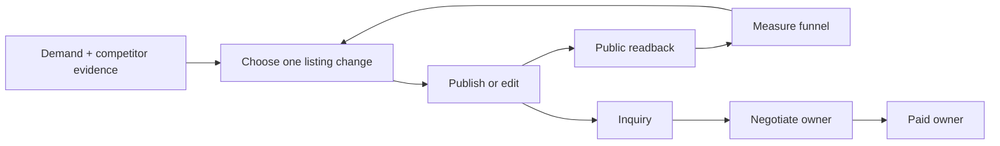
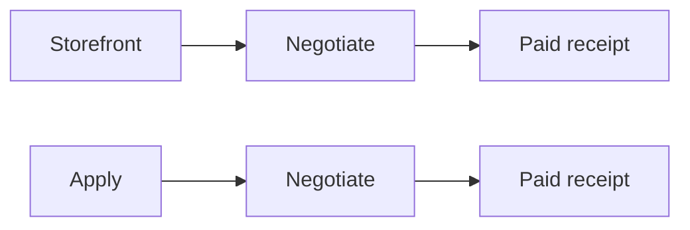
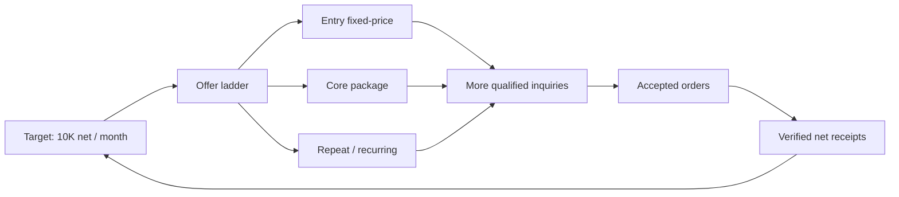

# Storefront Revenue Loop SSOT

Status: INCOMPLETE. Active item: S6, prove installed repetition, incremental sub-60-second operation, controlled minute/hour/day cutoffs and one contained stale/unknown failure recovery. S4 mutation guards, S5 funnel/reporting, the portfolio allocator, one real portfolio improvement, its replay, and the Storefront-side inquiry-context envelope are complete; Negotiate consumption/ACK remains an external owner gate. Finish order is fixed: S6 repeated installed E2E → S7 four-lane legacy cleanup → S8 cleanup-aftercare E2E. No earlier milestone may be called complete while a later finish gate remains open. This document owns Storefront implementation and records the final cross-owner cleanup contract without modifying another owner's code or live state.

## 1. Overview

Storefront turns verified demand and owned delivery capability into public, versioned marketplace services. It improves existing listings, creates a new listing only when evidence and delivery capacity justify it, verifies the public result, and attributes downstream revenue without taking ownership of buyer conversation or paid delivery.



The two earning funnels remain separately attributable:



Waiting is not work. A 14-day window may control when a hypothesis can be judged, but the TODO is to build the selector, executor, verifier, ledger, and reporter now. While one hypothesis matures, the loop may prepare evidence for the next hypothesis but must not silently overwrite the active experiment.

## 2. Ownership boundary

| Owner | Owns | Must not own |
|---|---|---|
| Storefront | market evidence, service contract, images/copy/scope/packages/price versions, create/edit, public readback, Storefront attribution and reporting | buyer replies, negotiation decisions, paid fulfillment |
| Negotiate | inquiry/talk-room replies using the exact service version and contract handed off by Storefront | listing mutation, paid artifact production |
| Paid | accepted/paid order, delivery, revision and real payment receipt | listing experiments, inquiry acquisition |
| Apply | outbound applications and Apply attribution | Storefront listing mutation |

Cross-loop integration is an immutable handoff event, not shared ownership: `platform`, `service_id`, `listing_version`, `origin=storefront|apply`, `conversation_id`, `order_id`, and timestamps. Git ownership follows the same boundary; Storefront changes never modify `paid_direct.py`.

## 3. Evidence-backed design rules

- Coconala says an unclear title is passed over without a click, recommends putting appeal points in service images, and says both supported and unsupported scope should be explicit. Source: [ココナラ「売上を増やすには」](https://coconala-support.zendesk.com/hc/ja/articles/218179338-%E5%A3%B2%E4%B8%8A%E3%82%92%E5%A2%97%E3%82%84%E3%81%99%E3%81%AB%E3%81%AF).
- Upwork Project Catalog recommends starting from demanded client requests, packaging fixed deliverables, offering up to three tiers, showing work samples, and collecting client requirements. Source: [Upwork Project Catalog guide](https://support.upwork.com/hc/en-us/articles/360057397533-How-to-create-a-project-in-Project-Catalog).
- GitHub documents `CODEOWNERS` as the mechanism for naming the people or teams responsible for repository areas. Storefront and Paid therefore require explicit file ownership and separate integration commits. Source: [GitHub CODEOWNERS](https://docs.github.com/en/repositories/managing-your-repositorys-settings-and-features/customizing-your-repository/about-code-owners).

These sources determine the listing contract: one buyer-visible outcome, exact inclusions and exclusions, required inputs, delivery time, revision rule, proof/gallery, tier or add-on ladder, FAQ, and a repeat/recurring path where the service genuinely supports repeat work.

## 4. Current verified state

- The historical mixed implementation remains quarantined in worktree `.worktrees/storefront-revenue-os`, branch `fix/storefront-revenue-os`, HEAD `b8f15537a`. The four accidental Paid changes were reverted by `06e9ac0dc`, `1a6894b6f`, `5beb42ce2`, and `b8f15537a`; the branch remains forbidden from whole-branch merge and is not a Storefront execution path.
- GitHub and local `main` contain integration point `c494a588f`. The temporary clean Storefront worktree and `feat/storefront-loop` branch are removed. Coconala Storefront production code, config, contracts, assets, tests, plist and this SSOT are all on `main`.
- Paid is intentionally stopped by its owner. Storefront integration does not change its plist, release, process, project state, artifacts, receipts, or restart state.
- Launchd label `ai.anicca.hf-gig-storefront-direct` runs `storefront_direct.py --effect` every 1800 seconds from a readonly immutable release built from GitHub `main`. The currently installed release is recorded by the latest proof below; historical release references in this section are evidence, not current pointers.
- The selector consumes the scorecard and prepares service `4330368`, field `image`, metric `views_to_inquiry`. It correctly blocks a second mutation on service `4330368` while that service's FAQ experiment is open.
- Eleven official services are listed. The 20-slot quota is capacity, never authority to create nine more. A new service requires distinct demand evidence, owned capability evidence, and available delivery capacity.
- Clean Storefront history is merged into `main`: `d65f13bf9` imports the dedicated owner, `2854097ad` selects the scorecard hypothesis, and `b655a83d0` closes an active-experiment no-op before the LLM judge. Later slices extend the same main ancestry through installed commit `85eaa6d86`.
- Real pass `storefront-selector-live-b655a83d0` exposed that `origin/main` had obsolete fixed-`:9222`, tokenless CDP helpers. Commit `a695e79e4` restores the byte-identical installed fenced runtime and its existing tests; 40 focused checks pass.
- Real pass `storefront-selector-live-a695e79e4` then completed with official/competitor `11/8`, effect/readback/duplicate `0/0/0`, next hypothesis `4330368/image`, metric `views_to_inquiry`, Telegram `deduped/20073`, and lease released. The hypothesis is prepared but non-executable while the FAQ experiment remains active; the measurement window is not a TODO and does not block building the image adapter now.
- Commits `1a13109d0` and `0244e1660` add the verified 1220x1016 OpenCV hero asset/contract and the fenced multipart publication adapter. The asset regenerates to the exact contract SHA; the isolated seller form produced one blob preview and exact field `data[UploadedFile][n1][image_files]` without submitting. Forty-two focused checks pass. Real pass `storefront-image-fence-live-0244e1660` preserved the active-experiment fence with public image count `0`, effect/readback/duplicate `0/0/0`, and no residual Storefront lease.
- Commit `e53a70689` binds the official VBA listing version, JPY6,000 base, JPY3,000 add-on, JPY5,000 maintenance, required inputs and two inquiry answer patterns into the runtime contract ledger. Real loop runs appended `1` then replayed `0`. Commit `3649a0bb9` reports official/competitor counts, contract inventory, selected hypothesis and fence in natural Japanese; real Telegram delivery is `sent/20425`.
- Storefront now derives version-bound contracts for all 11 official services from six owned-capability families while preserving the VBA-specific override. Real pass `storefront-family-contract-live-37c975927` read official/competitor `11/8`, appended the missing `10`, and reached contract total `11`. The first replay exposed a transient truncated service DOM; the inventory reader now retries the full 120,000-character public page until the official service scope exists. Pass `storefront-family-contract-replay-fixed-37c975927` completed with appended `0`, total `11`, effect/readback/duplicate `0/0/0`, and a released lease.
- Read-only inspection of the installed Negotiate owner shows its composer currently receives only conversation, verified research and verified application context. It has no service-ID or Storefront-contract consumer. Storefront publishes the immutable versioned contract ledger, but the Negotiate owner must add the consumer; Storefront must not patch the Negotiate implementation to hide this boundary gap.
- The seller price select stores the tax-inclusive internal option value while its label and public page show the seller price: option `22000` reads `20,000円`, and option `3300` reads `3,000円`. Storefront contracts bind both values and reject a mutation unless the exact option/value pair exists; the loop never guesses the conversion.
- Storefront analytics now reads all 11 official service pages, not only OpenCV. Real pass `storefront-catalog-kpi-live-458fab724` recorded per-service snapshots and official 30-day totals of 441 views, 0 purchases and 3 favorites, preserving ten first-baseline deltas as unknown, and sent Telegram `20444`. Replay resolved all deltas to zero and sent the changed state as `20446`; a third identical pass returned `deduped/20446`. Every pass released the Storefront lease and produced no public mutation.
- Official search for `SEO 記事 構成 執筆` exposed 3,899 results; observed comparables include service `2329055` (216 sales, 185 reviews, JPY6,000), `1884761` (331 reviews, JPY20,000), and `1051841` (443 reviews, JPY35,000). The owned public portfolio contains `SEO記事執筆 構成案・執筆納品事例`, so the first distinct new-listing candidate is grounded in both demand and owned capability.
- Storefront created nonpublic Coconala draft `4355225` in the official category `19/372/150` and bound title, catchphrase, scope, exclusions, buyer inputs, JPY3,000 display price (`3300` option), five-day delivery and one-order capacity in `seo-article-v1.json`. The first live save exposed page-hydration and delayed-readback races; the adapter now waits for each dependent category option and polls exact saved-state equality. Full pass `storefront-new-draft-readback-a5a969097` completed with official/competitor `11/8`, draft `effect/readback/public_effect=0/1/0`, KPI `441/0/3`, released lease and Telegram `20482`. The earlier failed pass had already saved the exact draft; the successful replay correctly did not claim a second effect.
- The SEO hero is a deterministic 1220x1016 PNG bound to SHA `5e9ebb2f...` and contains only contract-backed claims. Blob preview was explicitly rejected as proof: the adapter now submits native multipart with hidden `mode=draft`, closes that tab, opens a fresh official tab, and requires all fields plus exactly one persisted image. Direct adapter proof produced `1/1/1/0` for effect/readback/image/public, then replay `0/1/1/0`. Full pass `storefront-new-draft-image-full-final-18b6c261b` reproduced replay `0/1/1/0`, official/competitor `11/8`, active contracts `11`, KPI `441/0/3`, released lease and Telegram `20519`.
- The SEO draft now binds its category-specific completeness and ladder: features `企画・構成/リサーチ/SEO対応`, industries `ビジネス・法律/IT・テクノロジー/メディア・マスコミ`, Japanese, deliverable format, one free revision, JPY1 per character, JPY3,000 for an extra 3,000 characters, and repeat purchase enabled with a 5% discount. The portfolio link is owned proof and the SHA-bound hero is the gallery asset. Direct save/readback then replay produced effect `1` then `0`; full pass `storefront-new-draft-ladder-full-3a940473d` reproduced `effect/readback/image/public=0/1/1/0`, sent Telegram `20527`, and released the lease.
- The publication conflict is scoped by `service_id`, so the open experiment on `4330368` remains protected without blocking distinct draft `4355225`. Pass `storefront-direct-1786846676934847000-88255` published `https://coconala.com/services/4355225` once with public effect/readback `1/1`, duplicate `0`, official count `12`, exit `0`, and released lease.
- Public verification no longer accepts an arbitrary page image. Seller image identity `eab2ab35-9531685.png` must appear in the public CDN images, while title, catchphrase, full service body, buyer-input body, price and all three category labels must match the versioned contract. Passes `storefront-direct-1786847133578052000-66056`, `storefront-direct-1786847461472084000-2443`, and `storefront-direct-1786847667444581000-30337` proved `already_public`, effect `0`, exact readback `1`, duplicate `0`, and exit `0`.
- The first two publication reports timed out after send start and remain quarantined as `delivery_unknown`; they are never resent. Reporting now uses the real draft/public state, includes the official URL, permits a bounded 180-second provider ACK, and classifies a real public effect separately from a no-op. The corrected current-state report is provider-acked as Telegram `20596`; the identical replay is deduped to `20596` with send `0`.
- The image adapter now renders one immutable mutation contract from the latest official listing snapshot before any seller form action. Real snapshot `ba309b9b...` binds service `4330368`, only the image upload field, asset SHA `207e699e...`, rollback to zero images, official readback of exactly one image, metric `views_to_inquiry`, and a 14-day observation window. The executor, pre-send gate, public readback and crash recovery consume the same contract; stale versions, changed contract SHA and multi-field deltas fail closed. This proof renders and diffs only and does not publish.
- Commit `00b1a89ae` is installed as the Storefront-only readonly release. Real owner pass `storefront-direct-1786848245999543000-3943` exits `0`, reads official/competitor `12/8`, preserves the active `4330368` fence with effect/readback/duplicate `0/0/0`, exact-reads public SEO service `4355225` and image `eab2ab35-9531685.png`, retains KPI `441/0/3`, dedupes Telegram to `20596`, and releases the lease. Every non-Storefront gig plist remains byte-identical.
- The title/outcome adapter consumes the same runtime envelope. Commit `d5e78bc75` installs an evidence-bound proposal for presentation service `4308502`; pass `storefront-direct-1786848631268158000-51494` binds current official version `a345b678...`, renders only `data[Service][overview]`, retains the exact rollback title, records intended public title readback, and proves `published=false` under contract SHA `ccdcd7cd...`. The complete wake exits `0` with the existing fence, SEO readback, KPI, Telegram dedupe and released lease unchanged.
- The body/scope adapter reads the exact authenticated seller form rather than a collapsed public excerpt. Commit `d3e718921` binds service `4308502` to a bounded JPY5,000/maximum-five-slide scope with explicit inclusions, exclusions and estimate boundary. Pass `storefront-direct-1786849061129008000-97801` renders only `data[Service][head]`, retains the complete prior body as rollback, binds proposed public body SHA `e035c9a5...`, proves `published=false` under contract SHA `ba0df122...`, and completes with the other Storefront invariants unchanged.
- The package adapter keeps price ownership separate and changes only the existing add-on label. Commit `69f74c2b3` binds the authenticated JPY1,000 option on service `4308502` to the bounded label `追加スライド1枚（原稿支給・同一デザイン）`. Pass `storefront-direct-1786849420229880000-38442` renders only `data[Option][0][title]`, preserves rollback and price readback, proves `published=false` under contract SHA `348f2edb...`, and exits `0` with 12 services, SEO exact readback, Telegram `deduped/20596` and released lease.
- The FAQ adapter treats one question/answer pair as one logical listing field while still validating both seller controls. Authenticated seller form service `4308502` contains no FAQ. The versioned proposal renders logical delta `data[Faq][0]`, preserves `FAQ_ABSENT` rollback, binds exact public question/answer readback, and proves `published=false` under contract SHA `6362ed00...`.
- Installed FAQ wake `storefront-direct-1786850853324012000-9452` rendered all four mutation contracts and reached analytics service 11/12, then CDP ports `9222/9223` disappeared. The analytics read timed out; the tab-close timeout replaced that failure, and the lease-release timeout escaped the receipt boundary. This wake remains failed historical evidence. Storefront now catches cleanup subprocess timeouts so the original failure produces a durable failed receipt; recovery pass `storefront-direct-1786854719329508000-8615` supplies the later successful replay and released-lease proof.
- The shared browser slab on `main` had regressed from previously proven commit `e1e17a4bb`: `ensure_browser.sh` hardcoded port `9222` and spawned raw Chromium with `nohup`, while Storefront owns port `9223` through `ai.anicca.hf-gig-browser`. The restored managed-recovery path consumes `CLOAK_CDP_BASE_URL`, asks the canonical launchd owner to recover, waits for official CDP liveness and never starts a second raw process. The Storefront plist declares that browser owner, and every Storefront wake runs the guard before acquiring a lease. The installed recovery replay now passes.
- The first public recovery release exposed a deeper provenance gap before deployment: `main` had neither `launch_gig_browser.sh` nor the source `ai.anicca.hf-gig-browser.plist`, although the installed browser plist still referenced quarantined release `d150e4b1d...`. The two browser-owner files are restored individually from proven commit `f1209ea69`; the mixed branch is not merged. Public-main release `8fefa7a0c...` now closes this browser-source provenance gap.
- Public-main commit `8fefa7a0c` now contains the restored browser launcher and source plist. Readonly immutable release `/Users/anicca/gig/releases/life-manager/8fefa7a0c1a6ba1a86d36a587953006026ac2cf0` matches both source files and `storefront_direct.py`; the installed browser and Storefront plist files point only to this release, and the other five canonical plist files remain byte-identical. Failed recovery pass `storefront-browser-failure-c0c803f56` exits through the durable receipt boundary with `status=failed`, `reason=storefront_browser_unavailable:FAILED`, `effect/readback/duplicate=0/0/0`, and no lease. This proves fail-closed recording, not installed recovery success.
- After the Mac user session returned, OpenDirectory and GUI launchd manager both read UID `501`; canonical browser label `ai.anicca.hf-gig-browser` remained running on CDP `:9223`. The existing Storefront label was triggered once without reloading another owner. Recovery pass `storefront-direct-1786854719329508000-8615` completed with launchd exit `0`, official/competitor `12/8`, effect/readback/duplicate `0/0/0`, catalog KPI `441/0/3`, four authenticated mutation renders, public SEO readback `1`, Telegram `deduped/20596`, and released lease. CDP stayed alive through analytics 12/12, and the lease ledger ended empty. This closes S4r; the earlier bootstrap outage remains historical evidence, not a TODO.
- The price adapter uses the common mutation envelope and binds seller option identity separately from buyer-visible JPY. Readonly main release `76bd1117e...` is installed only for Storefront. Pass `storefront-direct-1786855420160162000-28208` authenticated the current service `4308502` version `a345b678...`, seller option `5500` / public JPY5,000, and proposed option `6600` / `6,000円`; it rendered only `data[Service][price]`, retained rollback `5500`, contract SHA `d9d5c930...`, and `published=false`. Removing the proposed option fails closed with `storefront_price_option_binding_invalid`. The full installed wake exits `0` with official/competitor `12/8`, all five mutation renders, KPI `441/0/3`, public SEO readback `1`, Telegram `deduped/20596`, and released Storefront lease. No price or listing was published.
- All six adapters now seal and validate the same mutation contract field set before any effect. The validator requires the official capability-family mapping, a 64-character listing precondition, exactly one `data[...]` delta, rollback equality, a nonempty official-readback contract, metric/window/evidence and a canonical contract SHA. Retained official seller/public snapshots render image, title, body, package, FAQ and price with `published=false`; independently resealed unsupported-family, multi-field and rollback mutations are rejected, while stale seller state and an unknown price option are rejected by their live adapter preconditions. The installed-owner proof remains the final S4g gate.
- Commit `448904405` is on GitHub `main` and installed as readonly Storefront release `4489044058a5ae5798bbb506f67f672409864498`; only the Storefront label was reloaded. Pass `storefront-direct-1786855932818098000-44055` completed with official/competitor `12/8`, six common-contract renders for image/title/body/package/FAQ/price, exact family/precondition/readback, one allowed delta, rollback equality and `published=false`. It retained KPI `441/0/3`, public SEO readback `1`, effect/readback/duplicate `0/0/0`, Telegram `deduped/20596`, exit `0` and a released Storefront lease. Every non-Storefront plist hash stayed unchanged. This closes S4g.
- The S5 joiner reads Negotiate transcripts, project linkage, Apply applications and immutable earnings receipts without modifying any source owner. Its isolated live-data reconciliation emits 110 stable events: one exact Storefront inquiry for conversation `10083449` and service `4313386`, zero presently provable Apply inquiries, 101 unknown-origin inquiries and eight unknown-origin net receipts totalling JPY126,438. Replay appends zero. Missing cross-owner links remain visible unknowns; money is not assigned to Storefront or Apply by title guessing. Each payment schema keeps gross/fee/refund/revision/rating/review/repeat unknown when its source receipt does not prove them. The installed wake and Telegram send/dedupe proof remain open.
- First installed S5 pass `storefront-direct-1786856329756823000-52997` failed before funnel append because the authenticated seller edit page returned a partially hydrated form; it emitted bounded Telegram error `20690` and released its lease. A direct official reread then matched all five existing mutation preconditions exactly, proving no listing drift. The seller snapshot reader now requires the universal title/body/price controls and retries the official DOM up to three times; it does not relax any mutation contract. Recovery and replay remain the active proof.
- Recovery pass `storefront-direct-1786856545678548000-64105` appended 110 stable funnel events, exact-attributed conversation `10083449` to Storefront service `4313386`, retained 101 inquiries and eight net receipts / JPY126,438 as unknown origin, sent emoji report `20696`, exited `0` and released its lease. Installed replay `storefront-direct-1786856694910219000-68172` appended zero, retained cutoff cursor `38c0856b...`, deduped Telegram to `20696`, exited `0` and released its lease. S5 attribution/reporting is complete.
- The versioned portfolio policy uses a 30-day complete window, 100-view retirement minimum, 20-slot capacity, recoverable unpublication and an all-required replacement gate. Current-data allocation evaluates all 12 listings under one evidence cursor as `KEEP 1 / IMPROVE 11 / RETIRE 0 / REPLACE 0`; replay appends zero. Italian UI translation `4312985` has 48 views, zero attributed inquiries/purchases/payments, but fails the minimum-sample, stronger-candidate and slot-pressure gates, so its deterministic action is `IMPROVE(scope)`, never deletion. Installed-owner proof remains open.
- Installed allocation pass `storefront-direct-1786857229141485000-80688` reproduced all 12 decisions, sent Telegram `20707`, exited `0` and released its lease. Its first replay exposed two idempotency defects without a public effect: timestamp-bearing analytics snapshot IDs generated a second identical allocation set, then the published SEO draft category select failed transient hydration and emitted bounded error `20710`. Allocation identity now hashes logical window+metrics+contracts+funnel rather than observation time, and published-draft readback uses the same bounded three-attempt hydration recovery as draft preparation. Isolated replay holds the same cursor and appends zero; installed recovery remains open.
- Installed recovery `storefront-direct-1786857651896268000-41115` completed with SEO readback `1`, the logical portfolio cursor, effect `0`, Telegram `20715`, exit `0` and released lease. Replay `storefront-direct-1786857762924258000-43624` retained the same cursor, appended zero allocations, deduped Telegram to `20715`, exited `0` and released its lease. Storefront can now materialize conversation `10083449` as an exact VBA context envelope for service `4313386`, version `dc08f7e2...`, base JPY6,000, two add-ons, deliverables, required inputs and its two dedicated answer patterns. Isolated context replay appends zero; Negotiate ACK remains missing.
- GitHub `main` commit `35f9bf165` first installed the context publisher. Pass `storefront-direct-1786858073692144000-52570` materialized exactly one envelope for conversation `10083449`, service `4313386` and version `dc08f7e2...`, then failed closed later at transient published-draft hydration with `effect=0`, Telegram `20724` and a released lease. Commit `2b9895817` makes that read-only draft check retry both missing dependent category options and a fully bounded readback mismatch. Its installed recovery `storefront-direct-1786858332158170000-73444` completed in 72 seconds with SEO public readback `1`, context `1/appended 0/ACK 0`, portfolio appended `0`, effect `0`, Telegram `20729` and a released Storefront lease. The installed plist points to readonly main release `2b98958172d493bd4f7ad760f58577be600fe87f`. `negotiate_context=missing` remains truthful until the Negotiate owner consumes and ACKs the exact context key.
- The selector now skips services with open experiments and stale/unimplemented backlog adapters instead of turning their measurement windows into work stoppages. It selected service `4308502`, mapped portfolio field `outcome` to the already rendered title contract, and bound old title `教育・研修資料を見やすく整え`, new title `研修資料を伝わる構成と見やすいスライドに整え`, current version `a345b678...`, and contract SHA `ccdcd7cd...`. Pass `storefront-direct-1786858876079556000-85436` submitted exactly `data[Service][overview]`; the official page and seller form both changed to the new title, but immediate public DOM hydration failed before ledger acceptance. The durable intent prevented a second submit. Recovery pass `storefront-direct-1786859267852094000-99307` confirmed the existing public effect, appended exactly one accepted effect row with `recovered=true`, sent Telegram `20748`, exited `0` and released its lease.
- Replay release `f4f997e68e741637b37e77cf228035e930728067` treats confirmed mutation contracts as published evidence and returns a truthful no-op when no current unfenced backlog item has an exact executable adapter; it never falls back to an unconstrained LLM mutation. Passes `storefront-direct-1786859590736053000-7425` and `storefront-direct-1786859712679726000-9983` both exited `0` with title effect `0`, portfolio/context append `0/0`, and released leases. The second identical pass deduped Telegram to `20755`. The title experiment has exactly one effect row. Paid, Apply and reply/Negotiate plist hashes remain byte-identical.
- Incremental commit `8b63da00b` adds official catalog, funnel, portfolio and inquiry-context readback without competitor crawl, LLM judgment or public mutation. Fixed-cutoff launchd passes proved minute `29781012`, hour `496350` and day `20681`; the same boundary replay initially exposed runtime-bound Telegram identity and then an outbox payload mismatch, both with public effect and ledger append `0`. Commits `6701bd292` and `09ad76871` keep runtime in the durable receipt but remove it from the idempotent Telegram payload and move incremental no-op identity to v2. Passes `storefront-direct-1786861199062378000-92397` and `storefront-direct-1786861258457124000-94015` completed in `20.823/32.043` seconds with the same accounting boundary, effect/readback `0/0`, all funnel/portfolio/context appends `0`, released leases, and Telegram `20785 sent → 20785 deduped`. Controlled +1-hour pass `storefront-direct-1786861305177044000-95405` produced minute/hour/day `29781072/496351/20681`; controlled +1-day pass `storefront-direct-1786861352356957000-96723` produced `29782452/496374/20682`. Both completed below 60 seconds with effect/append `0` and released leases.
- Auto-cadence commit `b8e8a14d4` is installed from readonly GitHub-main release `b8e8a14d49ec84053aa011b76f05d365887cc9bf`; its plist contains only `--effect --auto-cadence`, `StartInterval=60`, and no fixed verification cutoff. The first natural launchd wake `storefront-direct-1786861642399303000-3712` correctly selected `mode=full` because the previous full success was over 1800 seconds old, exited `0`, deduped Telegram to `20755` and released its lease. Without a manual kick, the next natural tick `storefront-direct-1786861794498416000-7088` selected `mode=incremental`, completed in `38.925` seconds with current cutoff minute/hour/day `29781030/496350/20681`, effect/readback `0/0`, all funnel/portfolio/context appends `0`, Telegram `20798`, exit `0` and released lease. Only the Storefront plist changed; other owner plists were not reloaded.
- Stale-catalog gate commit `fde71db0a` is installed from readonly GitHub-main release `fde71db0a45c3bd37727acc50399e10cc789c289`. One temporary wrong expected SHA stopped pass `storefront-direct-1786861989807466000-14946` after official inventory and before mutation with `official_catalog_version_stale`, exit `1`, effect/readback/duplicate `0/0/0`, exactly one bounded Telegram error `20803`, and released lease. The verification arguments were then removed from the installed plist. Recovery pass `storefront-direct-1786862036431947000-18508` completed in `36.845` seconds as normal auto-cadence incremental mode with effect/readback `0/0`, every append `0`, Telegram `20805`, exit `0` and released lease.
- Storefront commit `85eaa6d86` is on GitHub `main` and in readonly immutable release `/Users/anicca/gig/releases/life-manager/85eaa6d...`. Only `ai.anicca.hf-gig-storefront-direct` was reloaded. Its natural installed wake `storefront-direct-1786843673261706000-46042` exited `0` with official/competitor `11/8`, active contracts `11`, KPI `441/0/3`, draft `0/1/1/0`, active publication fence, Telegram `deduped/20527`, and released lease. Before/after SHA comparison found zero changes to every non-Storefront gig plist.
- Official analytics now retries each service independently and records an exhausted readback as `unknown`, never zero and never a reason to skip the rest of the Storefront wake. Reports separate unknown current values from unknown comparisons.

## 5. Acceptance criteria

The Storefront loop is complete only when all are true:

1. It inventories every owned public service and records an immutable listing version with exact public readback.
2. It selects one eligible hypothesis from the scorecard instead of a hardcoded FAQ target.
3. It can execute and verify the supported mutation for that hypothesis; the first required slice is the top-ranked image gap.
4. It refuses mutation when preconditions, identity, evidence, ownership, or duplicate guards fail.
5. It creates a new listing only through the evidence + capability + capacity gate, then proves one public creation and `duplicate=0` by official readback.
6. Each inquiry and paid receipt is attributable to `storefront` or `apply`; unknown attribution remains `unknown`, never coerced to zero or assigned by guess.
7. Hourly Telegram reporting is natural language, emoji-led, idempotent, and contains current funnel totals, changes since the last report, good news, bad news, errors, unknowns, and the next action. Same state produces `send=0`; changed state produces exactly `send=1`.
8. Storefront code/spec/config are on Life Manager `main`; the installed Storefront release is built from a main ancestor; all four earning owners must graduate from the obsolete gig-pass shell before its tracked driver, backup plists and mixed audit worktree are removed. Hermes gateway remains a separate continuing service and is not part of gig-pass retirement.
9. Storefront does not alter or restart Negotiate, Paid, or Apply owners during implementation or verification.
10. An open experiment blocks another mutation only when it can contaminate the same listing-level metric: the same `service_id` is blocked; a distinct new service with independent per-service attribution is not catalog-globally blocked.
11. Portfolio allocation evaluates every public listing as an asset and emits exactly one of `KEEP`, `IMPROVE`, `RETIRE`, or `REPLACE`. A niche label or short period with zero sales is never sufficient evidence to retire it. Replacement requires adequate exposure evidence or an explicitly unknown verdict, a stronger evidence-backed candidate, delivery capability, a slot/capacity reason, rollback, and official readback. Retirement is recoverable unpublication/archive before deletion so reviews, versions and evidence are preserved.
12. Storefront publishes an immutable inquiry-context envelope containing `platform`, `service_id`, `listing_version`, `origin=storefront`, `conversation_id`, offer/scope, required inputs, pricing/add-ons, exclusions and the inquiry playbook. Negotiate must acknowledge consuming that exact envelope before the end-to-end Storefront funnel is complete; application context alone is insufficient.

## 6. KPI contract

Event rows are append-only and deduped by a stable source event ID. Monetary metrics use real marketplace/payment evidence only.

| Stage | Required metrics | Derived KPI |
|---|---|---|
| Storefront exposure | listing impressions/views if officially available; otherwise `unknown` | view change by listing version |
| Consideration | service-page views, favorites if officially available, inquiries | `inquiries / views` when both known |
| Negotiation | qualified inquiries, offers, accepted orders, origin | `accepted / qualified inquiries` |
| Paid | gross receipt, fees, refund, net receipt, origin | `net revenue`, `revenue / accepted order` |
| Quality | revisions, completion, rating/review, repeat purchase | revision rate, completion rate, repeat rate |

Hourly snapshots and daily rollups use the same ledger. A report compares its cutoff cursor with the prior sent cursor, so replay cannot double count. Sample owner-facing message:

> 🏪 Storefront hourly: 11 services live. Since the last report: +120 views, +3 inquiries, +1 accepted order, ¥18,000 net receipt. Best mover: VBA image v3. ⚠️ One listing has unknown view data; it is excluded from conversion rate. Next: verify the public readback for listing 4330368. Apply-origin revenue is reported separately.

If no metric changed, the notifier records a deduped receipt and sends nothing. Errors send one concise alert with affected listing, failed stage, last known-good version, automatic containment, and next retry action.

## 7. Path to 10K monthly net revenue

`10K` is a target equation, not a guaranteed claim. Currency is configured explicitly. Only verified net receipts count.



The operating equation is `monthly_net = sum(verified net receipts attributed to storefront)`. Improvement diagnoses the first weak known edge: exposure → inquiry, inquiry → acceptance, acceptance → paid, or paid → repeat. It never lowers price by reflex when the failing edge is unknown.

## 8. Ordered execution plan — now to finish

Only the first unfinished item is active.

### S0 — Split and publish the Storefront SSOT

- [x] Create this Storefront-only spec from the latest Life Manager `origin/main`.
- [x] Push it to `main`, then remove its temporary documentation worktree and branch.

Verification: GitHub `main` contains this file; local worktree list has no `storefront-loop-ssot` entry.

### S1 — Integrate Storefront-only production code and replace the fixed FAQ selector

- [x] Import only `storefront_direct.py`, `listing_inventory.py`, `gig_paths.py`, Storefront config/schema/plist, Telegram outbox dependency, and Storefront tests into the clean `main`-based branch.
- [x] Read the official catalog and `storefront-catalog-scorecard.json`.
- [x] Select the first eligible backlog item under a one-active-experiment fence.
- [x] Persist hypothesis ID, listing version, field, baseline, success metric, evidence, and guard reason.
- [x] Bypass the LLM judge when an active experiment makes the prepared hypothesis non-executable; close a truthful guarded no-op instead.
- [x] Restore the already-proven fenced CDP helper dependency from the installed production release/history into clean main provenance; do not redesign it and do not restart another owner.
- [x] Re-run the real Storefront pass and prove `4330368/image`, effect/readback/duplicate=`0/0/0`, Telegram receipt, and released lease.

Verification: isolated selector check chooses `4330368/image` from the current scorecard; a real scheduled pass records that exact prepared hypothesis without touching other loops.

### S2 — Existing-listing image terminal gate (not a TODO)

- [x] Build the first buyer-facing hero from verified capability and bind its dimensions, claims and SHA in a machine-readable contract.
- [x] Implement the authenticated multipart image adapter for only service `4330368`, including exact precondition, non-image field delta guard, durable intent and recovery.
- [x] Add official public readback for exact service identity, listing version, unique service image IDs and image count.
- [x] Prove with the real active experiment that the adapter remains fenced: image count `0`, effect/readback/duplicate `0/0/0`.
- Terminal event: when service `4330368` becomes eligible, the loop publishes the prepared image, requires image count `1` and effect/readback/duplicate `1/1/0`, then replays with effect `0`. A mismatched readback triggers the already-built rollback to the last known-good listing version.

Verification: official browser DOM and screenshot show the expected images; effect=1, readback=1, duplicate=0; a second execution is idempotent.

### S3 — Publish the distinct SEO service now

- [x] Scope the active-experiment conflict guard by `service_id`, so the open experiment on `4330368` cannot block distinct draft `4355225`.
- [x] Preserve every existing fail-closed publication guard: exact draft contract, asset SHA, one persisted image, title/service duplicate scan, capacity, category, price, scope, inputs and fresh-tab official readback.
- [x] Run the installed Storefront loop and require one real `mode=open` effect for `4355225`, a fresh official public URL, exact contract/image readback and `duplicate=0`.
- [x] Run the same installed loop again and require `already_public`, effect `0`, readback `1`, duplicate service `0`, one Telegram state transition and subsequent dedupe.

Verification: the existing experiment on `4330368` remains unchanged; official service `4355225` is public exactly once; a second wake creates and edits nothing.

### S4 — Generalize supported listing mutations

- [x] Recover the failed installed FAQ wake without touching another owner's process: preserve the original error in a durable failed receipt, restore canonical launchd-owned browser self-healing, release the stale Storefront lease after shared-browser ownership is clear, then complete one installed replay with exit `0`.
- [x] Define the common versioned mutation envelope and migrate the proven image adapter, including exact official-version precondition, one allowed field delta, rollback and readback.
- [x] Migrate title/outcome to the same envelope and prove one deterministic no-publish diff.
- [x] Migrate body/scope to the same envelope and prove one deterministic no-publish diff from the authenticated seller form.
- [x] Migrate package/add-ons to the same envelope and prove one deterministic no-publish diff from the authenticated seller form.
- [x] Migrate FAQ to the same envelope and prove one authenticated logical-field no-publish diff with exact question/answer readback.
- [x] Migrate price to the same envelope and prove one authenticated no-publish diff with exact option/display-price binding.
- [x] Make image, title/outcome, body/scope, package/add-ons, FAQ and price adapters consume one versioned mutation contract instead of service-specific control flow.
- [x] Require every adapter to declare exact precondition hash, changed field, allowed delta, rollback value and official readback contract.
- [x] Render and diff one existing service per adapter without publishing; fail closed on unsupported family, stale version, unknown option value or multi-field delta.
- [x] Bind all 11 official services to six explicit capability-family contracts, including the dedicated VBA inquiry playbook; first production append fills 11/11 and replay appends zero.

Verification: each adapter produces a one-field deterministic diff from the current official version; no adapter publishes during this proof.

### S5 — Complete attribution, KPI ledger and Telegram reporting

- [x] Read official views, purchases and favorites for every owned service; retain unavailable impressions and revenue as unavailable rather than zero.
- [x] Persist service-ID snapshots, catalog totals and same-window deltas; keep missing baselines as unknown.
- [x] Emit the catalog totals/deltas in the natural-language hourly Telegram report and prove changed-state send plus identical-state dedupe.
- [x] Add the Storefront-owned append-only funnel joiner keyed by `platform`, `service_id`, `listing_version`, `origin`, `conversation_id`, `order_id` and source event ID.
- [x] Consume immutable Negotiate/Paid receipts when present without modifying those owners; missing cross-owner IDs remain `unknown` and never become zero or guessed Storefront revenue.
- [x] Keep `origin=storefront` and `origin=apply` mutually exclusive and report both funnels side by side from the same cutoff cursor.
- [x] Add verified gross, fee, refund, net, revision, rating/review and repeat-purchase fields; count money only from real immutable payment receipts and preserve unproved fields as unknown.
- [x] Emit one hourly natural-language Telegram report with `✅ good`, `⚠️ bad`, `❌ errors`, `❓ unknowns`, and `➡️ next action`; changed state sends once and identical state dedupes.
- External owner contract (not a Storefront TODO): Negotiate attaches `conversation_id` plus exact `service_id/listing_version/origin`; Paid attaches `order_id` and immutable payment receipt.

Verification: reconcile ledger totals against official browser screens and real receipts; inject one replay and prove no double count/no duplicate Telegram send; inject missing view data and prove `unknown`, not zero.

### S5d — Allocate the listing portfolio and hand context to Negotiate

- [x] Score every official listing from per-service exposure, inquiries, accepted orders, verified net receipts, reviews/repeat, evidence age, delivery capability and slot cost; missing evidence remains `unknown`.
- [x] Emit one deterministic action per listing: `KEEP`, `IMPROVE`, `RETIRE`, or `REPLACE`, with reason, evidence cursor, minimum-sample gate and rollback. Never use short-term sales `0` alone as a retirement reason.
- [x] For a weak niche such as Italian UI translation, improve its first weak funnel edge when evidence is sufficient; retire it recoverably and replace it only when a stronger demand+capability candidate wins the same constrained slot.
- [x] Execute at most one eligible portfolio action per service/version, require exact precondition and official public readback, and replay with effect `0`.
- [x] Materialize the immutable Storefront inquiry-context envelope keyed by exact `service_id/listing_version/conversation_id/origin` and include scope, inputs, price/add-ons, exclusions and inquiry playbook.
- External Negotiate-owner gate: consume and ACK that exact envelope before composing a Storefront inquiry. Until its owner implements this consumer, report `negotiate_context=missing`; do not silently fall back to Apply context or patch Negotiate from Storefront.

Verification: controlled current-data allocation produces one reasoned action per listing without publishing; one eligible action has official effect/readback/replay proof; conversation `10083449` resolves service `4313386` and its versioned VBA playbook, while a missing/mismatched version fails closed.

### S6 — Prove the installed loop repeats safely before cleanup

- [x] Preserve the completed Paid reverts and carry zero Paid implementation into Storefront.
- [x] Integrate Storefront history into GitHub `main`; the installed Storefront release is an ancestor of current main.
- [x] Keep a direct Storefront plist with zero Hermes/gig-pass executable reachability.
- [x] Observe installed wakes with official readback, Telegram dedupe, exit `0` and released lease while other owner plists remain byte-identical.
- [ ] Run the installed owner three consecutive times: one eligible state-changing run, one no-change replay and one further replay. Require no duplicate listing, ledger effect or Telegram send, exit `0` and released lease each time.
- [x] Measure full-wake duration and require it below the configured launch interval. Two identical installed replays each completed in 97 seconds against the 1800-second interval.
- [x] Add a configurable incremental wake contract for minute operation: either complete delta/readback/reporting in under 60 seconds or return a truthful locked/busy no-op without overlap. Do not claim every-minute capability before this passes.
- [x] Prove minute/hour/day accounting without passive waiting by controlled cutoff replays, and retain one natural launchd wake as scheduler evidence.
- [x] Prove a stale-version or unknown-metric failure creates no public effect, emits one bounded error/unknown report, releases its lease and succeeds on the next replay.

No measurement window or calendar delay is a TODO. Reuse the retained real state-changing publication evidence where valid and run immediate controlled replays/cutoffs; never wait 14 days, one hour or one day to close harness verification.

Verification: repeated installed wakes and controlled cutoffs prove idempotency at minute/hour/day boundaries; runtime is compatible with its declared cadence; Apply, Negotiate and Paid plist/process/state hashes remain unchanged.

### S7 — Retire the old gig-pass path only after S6 passes

- [x] Remove the merged temporary clean Storefront worktree and `feat/storefront-loop` branch.
- [x] Keep `fix/storefront-revenue-os` quarantined and unreachable until Paid audit evidence is preserved.
- [ ] Prove Apply, Negotiate, Paid and Storefront installed entrypoints are direct owners whose release SHA is an ancestor of GitHub `main`; do not reload another owner's process to manufacture proof.
- [ ] Remove registry and authoritative-document references that still identify `gig_pass.sh` as current execution or fuel evidence.
- [ ] Delete tracked `GIG_PASS_RUNBOOK.md`, `gig_pass.sh`, `gig-cli.sh` and `scripts/gig_single_instance.sh` only after all executable reachability is zero.
- [ ] Delete obsolete `ai.anicca.hf-gig-pass.plist.*` backups after confirming no installer or recovery path consumes them.
- [ ] After Paid evidence handoff, remove `.worktrees/storefront-revenue-os` and `fix/storefront-revenue-os`.
- [ ] Publish one canonical inventory showing all four direct owners on GitHub `main` ancestry and no legacy gig-pass owner. Hermes gateway remains because it is a separate continuing service.

Verification: tracked files, installed plists, launchctl, registry, imports, subprocesses, installers, symlinks and authoritative docs contain zero executable gig-pass reachability.

### S8 — Cleanup-aftercare and final completion gate

- [ ] Build the final readonly Storefront release from GitHub `main` after cleanup and reload only Storefront.
- [ ] Run Storefront twice after cleanup and require official catalog/readback, contract renders, KPI ledger, Telegram send-or-dedupe, exit `0` and released lease.
- [ ] Read-only verify Apply, Negotiate and Paid direct-owner health and provenance; do not restart or mutate them.
- [ ] Prove deleted legacy names cannot be resurrected by installer, recovery, launchd backup, registry or docs.
- [ ] Reconcile repository/worktree/branch inventory: main clean and pushed, no temporary or mixed Storefront worktree after Paid handoff.
- [ ] Mark this spec `COMPLETE` only after every S4–S8 checkbox is closed with evidence. Revenue and elapsed time never substitute for implementation or verification.

Verification: two post-cleanup Storefront wakes, four direct-owner provenance records, zero resurrection paths and clean GitHub `main`. Only then is Storefront finished.

## 9. Test matrix

| Risk | Proof |
|---|---|
| Wrong listing changed | exact service ID + precondition hash before effect; official readback after effect |
| Duplicate public service | catalog identity scan before create; second run creates zero |
| Unrelated experiment blocks revenue | conflict key includes `service_id`; open `4330368` experiment does not block distinct `4355225` |
| Unsupported claim or scope | every public claim links to owned proof; inclusions/exclusions round-trip |
| Lost/incorrect attribution | stable IDs across handoff; official receipt reconciliation; unknown preserved |
| Duplicate Telegram/report money | cutoff cursor + event dedupe + send receipt; replay proves zero duplicate |
| Cross-loop interference | diff launchd/config/state for Negotiate, Paid and Apply before/after |
| Legacy resurrection | reachability scan covers launchd, installers, imports, subprocesses, symlinks and authoritative docs |
| Branch/worktree fragmentation | installed SHA descends from GitHub main; temporary branch/worktree absence is asserted |

## 10. Repository target and intended tree

Repository SSOT: `Daisuke134/life-manager`.

```text
life-manager/
├── docs/superpowers/specs/2026-08-16-storefront-loop-ssot.md
└── skills/earn/gig/
    ├── scripts/storefront_direct.py
    ├── config/storefront-catalog-scorecard.json
    ├── contracts/storefront/
    ├── tests/storefront/
    └── launchd/ai.anicca.hf-gig-storefront-direct.plist
```

The exact final tree may reuse existing directories to minimize churn, but Storefront-owned production, config, contracts, tests, and launchd ownership must remain identifiable and must not be mixed into Paid implementation files.

## 11. Execution and E2E judgment

| Item | Value |
|---|---|
| UI change | Yes: Coconala seller listing publication and official public service readback |
| Judgment | Maestro not applicable; verification MUST use the authenticated official browser DOM, fresh public URL/readback, durable effect ledger and replay |

Remaining execution order is authoritative and may not be reordered:

1. External integration gate: Negotiate owner consumes and ACKs context key `storefront:inquiry-context:v1:10083449:4313386:dc08f7e2...`. Storefront continues reporting `negotiate_context=missing` and does not edit or restart Negotiate.
2. S6a: close the strict three-success sequence. The retained title publication required a failed submit/readback pass followed by successful recovery, so it does not satisfy the stricter requirement that the state-changing wake itself exit `0`; use the next safe executable Storefront action, then two no-change replays.
3. S7a: read-only inventory all four direct owners and route any missing provenance fix through that owner; never reload another owner's process to manufacture proof.
4. S7b: after executable reachability is zero, remove current registry/docs references, tracked `GIG_PASS_RUNBOOK.md`, `gig_pass.sh`, `gig-cli.sh`, `scripts/gig_single_instance.sh`, and obsolete gig-pass backup plists. Hermes remains.
5. S7c: after Paid evidence handoff, remove the quarantined mixed worktree/branch and publish one canonical four-lane inventory on GitHub `main`.
6. S8: build the post-cleanup readonly release, reload only Storefront, run it twice, read-only verify other owners, prove no legacy resurrection path, leave `main` clean/pushed, then mark this spec complete.
