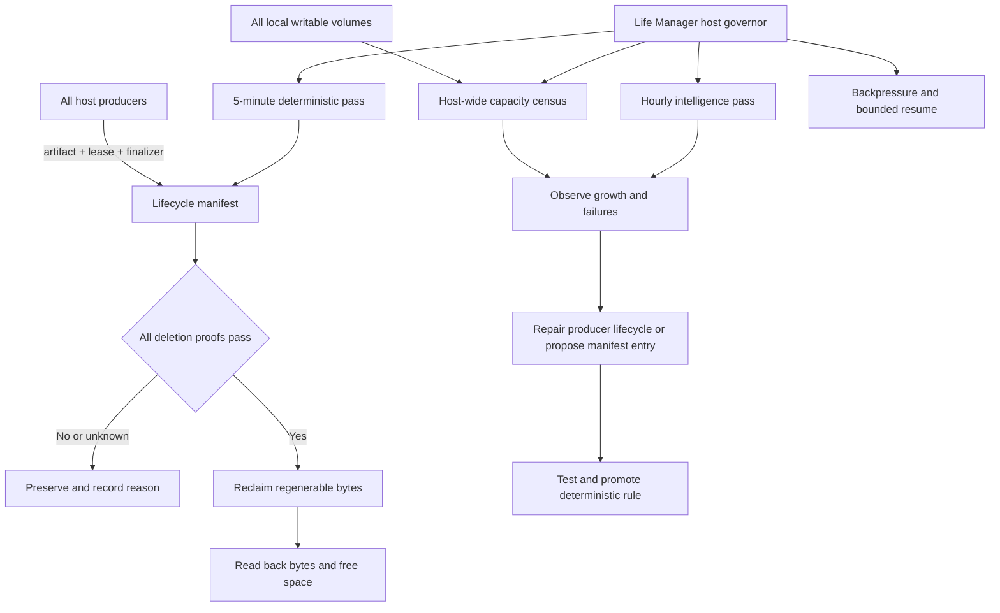

# Mac Host Storage Governor — Life Manager Disk Cleanup Loop 仕様

OSS公開名: **Life Manager Disk Cleanup Loop**  
実行authority: **Mac Host Storage Governor**  
公開skill: **`disk-cleanup`**

状態: Phase 1実装済み。Life Manager OSS skill、fail-closed governor、guard fallback、回帰テストは反映済み。host-wide census、hourly intelligence、全producer backpressure、launchd正式bootstrap、24時間/7日観測は未完了。

## 現行実装状況とOSS境界

この仕様は設計だけでなく、現在の実装と未完了のproduction workを追跡する。

| 領域 | 現在の状態 | 一次証拠 |
|---|---|---|
| OSS skill | 実装済み | `skills/self/disk-cleanup/disk_cleanup.py`、`SKILL.md`、`tests/`、`install-launchd.sh`、`launchd/*.plist` |
| fail-closed deletion | 部分実装 | protected root、unknown class、unproved candidate、active lease、symlink、open-path、probe errorをpreserveする実装と12件のLife Manager unit test。versioned manifest、owner必須、remote rebuild proofの統合契約は未完了 |
| clone coverage | 実装済み | Chrome (`com.google.Chrome.code_sign_clone`) と Chromium (`org.chromium.Chromium.code_sign_clone`) の両collectionをallow-list discovery |
| cadence | 部分実装 | OSS plistは`StartInterval=300`。通常passはbounded fast pass、`cleanup-full-pass.at`の1時間マーカー（または互換の`EMERGENCY_GUARD_FULL_PASS=1`）だけがbounded full cleanupを発火する。ただしこのMacではuser launchd bootstrapが`141: Reentrancy avoided`で未成立し、既存emergency guardがfallbackとして実行中 |
| runtime guard | 部分実装 | 通常の5分guardは`~/anicca-project/work`と`~/.openclaw/external`だけをbounded fast passし、host inventoryを毎回atomic writeする。Life Managerの`host-inventory-full.at`とfallbackの`cleanup-full-pass.at`を別々に管理し、各1時間 cadenceでfull census/cleanupを発火する。root size/unknown attributionは未完了 |
| ledger/receipt | 部分実装 | cleanup ledgerを32 MiBでrotateし、約282 MiBから56 KiB + gzip archiveへ縮小。bounded operational logとimmutable incident receiptの正式分離は未完了 |
| production recovery | 未完了 | 非リポジトリreceipt storm、3分超のworktree remote inspection、旧autopruneの無制限home `du` は封じた。131件のstale session guardだけを安全にTERMし、unknownな3件は保存した。旧autoprune/reclaim plistは`.disabled-20260821`へ可逆退避した。cleanでremote同期済みの`cfo-resume-spec` worktreeだけを`git worktree remove`で回収し、freeは5.8→7.7 GiBへ改善した。なお11 GiB未満で、24時間/7日観測とuser launchd復旧条件は未達 |

### 2026-08-21 incident fix evidence

`/tmp/anicca-*` のソケット・ログ・一時ファイルをGit cloneとして扱っていたため、各passで
`not_a_git_repository` receiptが大量生成され、同時にworktreeのremote inspectionが長時間実行されて
cleanup passを占有していた。Anicca側はclone候補を実体のある`.git`ディレクトリに限定し、通常の5分
guardではworktree remote inspectionを`fast_pass_deferred`として保留する。Life Managerのlegacy hourly
shimは同じhost guardを呼び、guard側の`cleanup-full-pass.at`（または明示的な
`EMERGENCY_GUARD_FULL_PASS=1`）で保留処理を永続的に飢餓させない。

実測証拠はAnicca cleanup test **56 passed**、Life Manager disk-cleanup test **12 passed**、guardの
実E2E約9秒（`errors=0`、`protected_deletions=0`、lock残留なし、初回free約5.2 GiB）である。
その後のlive readbackではfree約2.2 GiB、tier=`ULTRA`、`reclaimed=0`、`preserved_reasons={"open":1}`
となった。openなChrome code-sign clone約706 MiBとActions Runner診断ログ約291 MiBは、実行中のため
削除しない。これはloopが常時稼働している証明ではない。guardのログは毎分更新される一方、
`launchctl print gui/501/ai.anicca.life-manager-disk-cleanup` と `com.anicca.emergency-disk-guard`
は現在も`141: Reentrancy avoided`であり、正式なuser launchd domainのbootstrap/readback、24時間、
7日観測が残る。

### 2026-08-21 incident prevention evidence

同日後半の実測では、`cozempic.cli guard` が138件まで孤児化し、そのうち131件が6時間以上古いClaude
transcriptと1対1に対応していた。session UUID、transcript、親PID=1、6時間超のstale条件をすべて満たす
131件だけへTERMを送り、transcriptやsource、session stateは削除していない。unknownな3件は保存した。
guard総数は5件へ下がり、freeは約4.8 GiBへ戻った。

旧`ai.anicca.disk-autoprune`（毎時17分）は、0 GiB incidentの報告後に全homeの`du | sort | head`を
50分以上実行し続けていた。これはcleanup passを塞ぎ、容量警告を遅延させる直接原因だった。プロセスgroup
だけをTERMし、ファイルは削除していない。再起動時の再発を防ぐため、
`~/Library/LaunchAgents/ai.anicca.disk-autoprune.plist.disabled-20260821`へ退避した。
実行scriptが存在しない旧`ai.anicca.disk-reclaim.plist`も同じ方式で退避した。
さらに旧`disk-autoprune.sh`本体はバックアップを保持したまま、canonical emergency guardへ委譲する
compatibility shimへ置き換えた。旧無制限`du`とcache削除へ戻る実行経路は残していない。

Anicca側では、通常minute guardから巨大な`~/gig`を除外し、`cleanup-full-pass.at`のhourly
pass（互換の`EMERGENCY_GUARD_FULL_PASS=1`でも強制可能）だけが`~/gig`を走査するようにした。変更後の実測ログは`11:30:49 LOW DISK`、
`11:30:50 runtime manifest ready`で、従来の約3分16秒から約1秒へ短縮した。recovery health checkの
独自cache削除と重複日本語alertも廃止し、未接続だった`runtime/recovery-health-check.sh`も同じ観測専用
contractへ揃えた。容量変更とalertのauthorityをLife Managerへ一本化した。回帰testは両sourceから旧日本語
alertと広範囲cache削除が消えていることを固定した。
ただしfreeはなお5.9 GiBで、`launchctl` readbackは`141: Reentrancy avoided`のままである。

### 2026-08-21 bounded host census and safe reclaim evidence

Life Manager governorは`host-inventory.json`を毎pass atomic writeする。実機のfast readbackはmount
9件、root 23件、coverage gap 18件を記録し、unknown sizeを削除候補へ昇格させなかった。
fallback passは`host-inventory-full.at`を使い、launchd user domainが141で読めなくても1時間ごとにfull
censusを発火する。直近のfull readbackは約11秒、mode=`full`、mount 9件、root 17件、gap 11件で、追加した
managed-home familyは次回full marker更新後に反映される。
Anicca cleanup controlのgit/lsof/du probeにも15秒timeoutを設定し、さらにguard外側のgovernor、
runtime-manifest、sweep subprocessにも120秒（kill-after 10秒）のtimeoutを設定した。timeoutは
error/preserveとして扱い、runtime-manifest失敗時はhourly markerを進めない。これによりfull passの
probeが無期限にguard lockを占有しない。

`/Users/anicca/anicca-project`は約9.5 GiB、その`.worktrees`は約4.4 GiBだった。最大の
`cfo-resume-spec`（約1.08 GiB）は、dirty=0、branch upstream 0/0、process/open-path/leaseなしを
read backした後にだけ`git worktree remove`で回収した。branchとremoteは残り、再作成可能である。
active shellがcwdにしていた`affiliate-life-manager-spec`、dirtyまたはunpushedな全worktreeは保持した。
freeは5.8 GiBから7.7 GiBへread backできた。これはsafe reclaimの証拠であり、reserve 11 GiB回復や
host-wide census completeの証明ではない。

### OSS boundary

公開するdeterministic cleanupの正本はLife Manager repositoryの
`skills/self/disk-cleanup/` とする。ここにはpolicy、validator、tests、launchd template、legacy
compatibility shimだけを置く。ユーザー固有のhome path、process state、Telegram chat ID、credential、
receipt、runtime manifestの実データはrepositoryへ入れず、install時にlocal stateへrenderする。
LLMは削除権限を持たず、unknown pathを削除するための自由なshell実行も公開契約に含めない。

実装済みcommitはLife Managerの `857e12e8b`（hourly full-pass marker契約まで）を参照する。
Anicca側のguard integrationは作業branchの`7363a95dc`までローカルで検証済みだが、GitHub pushは
DNS解決失敗で未達である。これらのcommitは実装の到達点であり、production DONEの証明ではない。

## 1. Overview — What & Why

Life Manager は、Mac mini 上の全process、repository、agent、browser、build tool、
media pipeline、package manager、VM、system cacheがディスク枯渇でstate、receipt、session、
成果物を壊さず継続できるよう、host-wideな `disk-cleanup` skill と1つのcleanup authorityを
所有する。Life Managerは回収対象の中心ではなく、Mac全体を監督するownerであり、
Life Manager自身も他のagentやtoolと同じ1 producerとして計測される。

現在は次の3つが別々に存在する。

- `com.anicca.emergency-disk-guard`: 60秒間隔の回収owner。
- `com.anicca.disk-sentinel`: 60秒間隔の観測、snapshot thinning、stop flag owner。
- `ai.anicca.disk-janitor`: 3,600秒間隔の旧設定。実行scriptはLife Manager governorへ委譲するcompatibility shimであり、独立した削除ロジックを持たない。

過去には複数cleanerが同じcloneを異なる規則で削除し、producerの `.venv` を破壊した。
現在のguardは実行されているが、回収可能artifactを使い切ると
`no-eligible-reclaim` を反復する。active browserのcode-sign clone、dirty/unpushed
worktree、session、stateなどは正しく保護されるため、cleanup cadenceだけを増やしても
容量は回復しない。

現sentinelとguardは異なるroot集合を走査する。どちらにも含まれないrootはgrowth attributionにも
reclaim candidateにも現れない。このcoverage gapを残したままcadenceだけを増やしても、
Mac全体の容量問題は解決しない。

本仕様はData volumeと全local writable volumeをhost-wideに計測するが、削除対象をLLMに
自由判断させない。5分ごとのdeterministic passが、manifest、
owner、class、lease、open-path、再生成証明をすべて確認して回収する。1時間ごとの
intelligence passは原因分析、未分類artifact、producer lifecycle defectを診断するが、
未知のpathを削除する権限を持たない。

Apple `launchd.plist(5)` は `StartInterval` について、
“This optional key causes the job to be started every N seconds” とし、jobが実行中なら
次のintervalはmissされると明記する。したがって5分schedulerは重複実行を保証せず、
cleanup側もsingle-owner lockをMUSTで持つ。

ソース: [Apple OSS launchd.plist(5)](https://github.com/apple-oss-distributions/launchd/blob/main/man/launchd.plist.5)
/ 核心の引用: “If the job is running during an interval firing, that interval firing will likewise be missed.”

### Target architecture



### Ownership

| Component | Owns | MUST NOT own |
|---|---|---|
| Life Manager host governor | Mac全volume census、manifest contract、deterministic sweep、diagnostic report、backpressure | Life Manager配下だけへのscope限定、unknown pathの自由削除 |
| Producer loop | artifact登録、lease heartbeat、finalizer、終了時cleanup | machine-wide cleanup policy |
| Deterministic pass | 証明済みartifactの回収、decision receipt | LLM判断、source/state/session削除 |
| Intelligence pass | growth attribution、分類候補、producer defect、修正task | 直接削除、保護classの格下げ、自分の判断だけでmanifest mutation |
| Sentinel | disk測定、tier遷移、stop flag | artifact削除 |

## 2. Acceptance Criteria

### 2.1 Single authority

1. Life Manager repositoryに `skills/self/disk-cleanup/` が存在し、Mac全体を1 hostとして
   管理する全runtime entrypointをmanifest化する。
2. productionでartifactを削除できるentrypointは1つだけである。
3. legacy janitor/cleanerはparity確認後にdisableされ、削除ロジックを実行しない。
4. sentinelは観測とbackpressureだけを行い、削除しない。
5. schedulerは300秒間隔、atomic lock、bounded runtimeを持つ。同時実行数は常に1以下である。

### 2.2 Host-wide observation coverage

1. 毎pass、`/System/Volumes/Data` と全local writable mounted volumeのtotal、used、free、
   inode、mount stateを計測する。
2. top-level censusはMac全体を次のowner familyへ分類する。
   `system`、`user-home`、`agent-runtime`、`repository-worktree`、`browser`、`build`、
   `package-cache`、`vm-container`、`media`、`logs-ledgers`、`downloads-trash`、`unknown`。
3. censusは少なくとも次をcoverageに含める。
   `/Users`、`/Library`、`/private/var/folders`、`/private/tmp`、`/Volumes`、全user home、
   Xcode DerivedData/Archives/Simulator、Homebrew、npm/pnpm/yarn/bun、Cargo、Python/uv/pip、
   Docker/Colima/Lima、browser profiles/code-sign clones、全repository/worktree、agent runtime、
   generated media、logs、Trash、Downloads、APFS local snapshots、deleted-but-open files。
4. root listは観測と削除で別々に手書きしない。1つのversioned host inventoryから、
   observer viewとreclaimer viewを生成する。
5. rootが未分類でもsizeとgrowthは `unknown` として必ず可視化する。未分類は削除しない。
6. 5分passはfast censusと既知candidateだけを処理する。full host censusは1時間ごと、
   PRESSURE遷移時、または2 GiB/hour以上の説明不能growth時に実行する。
7. full census自身のtemporary file、log、ledgerにはhard size limitを持たせ、観測処理が
   ENOSPCを悪化させない。

### 2.3 Fail-closed deletion contract

artifactを削除できるのは、次の条件がすべて真の場合だけである。

1. versioned manifestにexact pathが登録されている。
2. `owner` が空でない。
3. classが `ephemeral`、`regenerable_output`、`managed_regenerable`、または
   remoteで復元可能なcollectionである。
4. active leaseが存在しない。
5. `lsof`/open-path probeが `confirmed-closed` を返す。
6. 削除直前の再検証でもleaseとopen-pathがclosedである。
7. regenerable outputはlockfile、installed binary、remote ref、またはnamed managed
   reclaimerのexact proofを持つ。
8. 回収後にpath absence、reclaimed bytes、free bytesをread backする。
9. probe error、unknown class、unknown owner、missing proofはすべてpreserveになる。

### 2.4 Permanently protected data

次を自動削除、移動、truncate、圧縮、class変更してはならない。

- `~/.claude/**`、`~/.codex/**`、`~/.config/ai/**`
- Claude、Codex、OpenClaw、Life Managerのsession、transcript、memory
- `**/state/*.jsonl`、money ledger、publication/payment receipt、database
- auth、cookie、browser identity、credential、secret
- source code、`.git`、current worktree
- dirty、unpushed、remote state unreadable、openのworktree
- producer leaseがactiveなartifact
- classificationまたはrebuild proofが不明なpath

protected pathは容量不足時も削除しない。protected dataだけでreserveを回復できない場合、
cleanupは成功を偽装せずcapacity incidentを発行し、write-heavy producerを停止する。

### 2.5 Producer lifecycle contract

Life Manager、OpenClaw、Claude、Codex、browser automation、Xcode、Docker、media renderer、
package managerを含む新規または既存のwrite-heavy producerは、開始前に次を宣言する。

```json
{
  "artifact_id": "writer-render-cache",
  "path": "/absolute/path/to/cache",
  "owner": "writer-loop",
  "class": "ephemeral",
  "ttl_seconds": 86400,
  "quota_bytes": 2147483648,
  "lease": {
    "path": "/absolute/path/to/writer-render-cache.lease",
    "max_age_seconds": 300
  },
  "finalizer": {
    "kind": "off_volume_quarantine"
  }
}
```

1. producerはartifact作成前にleaseを作る。
2. 実行中はleaseをheartbeatする。
3. 成功、失敗、timeout、signal終了のすべてでfinalizerを実行する。
4. leaseを閉じられなかった場合も、期限切れとopen-path closedの両方が揃うまで保存する。
5. browser/code-sign clone、build、render、temporary cloneはproducer ownerを特定する。
6. quota超過producerは新規artifact作成前に自分のexpired artifactを回収する。

### 2.6 Cadence and tier state machine

| Tier | Condition | Required action |
|---|---|---|
| NORMAL | free >= 20 GiB | 5分pass。producer通常運転 |
| PREVENTIVE | 11 GiB <= free < 20 GiB | expired regenerable artifactを回収。大規模build開始を拒否 |
| PRESSURE | 6 GiB <= free < 11 GiB | pressure override。hourly intelligenceを即時wake。write-heavy producerをdrain |
| CRITICAL | 3 GiB <= free < 6 GiB | 新規producer停止。進行中ownerはcheckpoint後に終了 |
| ULTRA | free < 3 GiB | 非必須write停止。state/receipt/checkpoint書き込みだけ許可 |

1. tierはData volumeのbytesで算出し、丸めたGBだけで判断しない。
2. tierを下げるには20 GiB reserveを2回連続観測する。
3. cleanup後も6 GiB未満なら成功扱いにしない。
4. stop flagは各producerのpreflightでMUST確認する。
5. recoveryは一度に全loopを起動せず、owner単位でbounded redispatchする。

### 2.7 Intelligence boundary

hourly intelligence passは、次だけを出力する。

- 直近1時間と24時間のfree-space delta
- 全local volumeの上位growth root、owner family、process owner
- cleanupのeligible/preserved/error/reclaimed集計
- `no-eligible-reclaim`、open-path、active-lease、missing-proofのstreak
- quota/lease/finalizerを守らないproducer
- manifest candidateと、その再生成証明
- host inventory coverage gapと新規mount/unclassified root
- 修正対象のproduction file、test、acceptance evidence

intelligence passはpathを削除せず、manifestを直接変更せず、protected classを格下げしない。
候補はfailing test、deterministic validator、review、production canaryを通った後にだけ昇格する。
正常時はLLMを呼ばない。次のいずれかの場合だけwakeする。

- PRESSURE以上へ遷移した。
- 2回連続でreserveを回復できない。
- 2 GiB/hour以上の未知growthを検出した。
- 同じownerで3回連続のlease/finalizer defectを検出した。

### 2.8 Reporting and audit

1. 1 passは `observed_at`、free before/after、tier、eligible count、reclaimed bytes、
   preserved reasons、owner、policy versionを1 receiptに記録する。
2. 高頻度decisionを無制限JSONLへ追記しない。集計可能なbounded operational logと、
   immutable incident receiptを分離する。
3. Telegramはtier遷移、2回連続failure、未知2 GiB growth、recoveryだけを通知する。
4. 同じ状態とpayloadはdedupeする。
5. report delivery failureはcleanupを失敗させないが、delivery failure receiptを残す。

### 2.9 Production completion

1. unit/integration testが全てpassする。
2. fixtureでactive session、active lease、open file、dirty worktree、unpushed worktree、
   state JSONL、secretが保存される。
3. fixtureでexpired cache、closed code-sign clone、verified build output、remote-recoverable
   clean worktreeだけが回収される。
4. production canaryは1つの既知regenerable artifactを回収し、readbackでbytes増加を確認する。
5. immediate replayはduplicate deletion 0、error 0である。
6. 24時間連続でfree >= 11 GiB、protected deletion 0、duplicate cleanup owner 0を観測する。
7. 7日間でENOSPC 0、state write failure 0、cleanup起因producer failure 0を観測する。
8. host inventory coverage reportでlocal writable volume missing 0、required owner family missing 0、
   1 GiB以上のunattributed root 0を観測する。

## 3. As-Is / To-Be

| Area | As-Is | To-Be |
|---|---|---|
| Scope | sentinelとguardが異なる限定rootを走査 | 全local writable volumeを1 inventoryで観測し、Mac全体をowner familyへ分類 |
| Ownership | guard、sentinel、janitorに責務が分散 | Life Manager host governorが唯一の削除authority。Life Manager自身も1 producer |
| Cadence | emergency guardは60秒、sentinelは60秒。legacy janitorはcanonical governor shim。旧autoprune/reclaim plistは可逆退避済み | OSSは5分deterministicを定義済み。user launchd bootstrapが未成立のため、現productionはemergency guard fallback。event-driven/hourly intelligenceは未実装 |
| Decision | manifest回収とlegacy path掃除が混在 | manifest proofのAND条件だけで削除 |
| Intelligence | 人間がalert後に広く調査 | abnormal stateだけLunaが診断しproducer defectをtask化 |
| Sessions | path規則により一部保護 | session/transcript/state/identityをpermanent protected contract化 |
| Active execution | open-path中心 | producer lease + heartbeat + open-pathの二重証明 |
| Worktrees | remote/dirty/open判定はcleanup側に存在 | producer ownershipとremote recovery receiptまで必須 |
| Backpressure | stop flag consumerが不均一 | 全write-heavy producer preflightで同じtier contractを実行 |
| Logs | ledgerが無制限に増加可能 | bounded ops log + immutable incident receipt |
| Recovery | reserve回復後に複数ownerが競合可能 | owner単位のbounded redispatch |

Test Matrixの`Cover=OK`は、必要な受入テストを定義済みであることを示す。現在の実測PASSは
§6のAtomic TODOとverification receiptに記録し、production未実装の項目をPASSとは扱わない。

## 4. Test Matrix

| # | To-Be | Test name | Cover |
|---:|---|---|---|
| 1 | production削除authorityが1つ | `test_production_has_one_cleanup_authority` | OK |
| 2 | 300秒schedulerとsingle lock | `test_cleanup_launchd_interval_and_singleton_lock` | OK |
| 3 | protected rootsを永久保存 | `test_protected_roots_never_enter_runtime_manifest` | OK |
| 4 | active leaseを保存 | `test_active_lease_preserves_artifact` | OK |
| 5 | expired leaseでもopen pathを保存 | `test_expired_lease_open_path_is_preserved` | OK |
| 6 | probe failureを保存 | `test_lsof_failure_fails_closed` | OK |
| 7 | dirty worktreeを保存 | `test_dirty_worktree_is_preserved` | OK |
| 8 | unpushed worktreeを保存 | `test_unpushed_worktree_is_preserved` | OK |
| 9 | remote recoverable clean worktreeを回収 | `test_closed_clean_remote_worktree_is_reclaimed` | OK |
| 10 | verified build outputを回収 | `test_closed_build_output_with_proof_is_reclaimed` | OK |
| 11 | unknown artifactを保存 | `test_unknown_artifact_is_preserved_and_reported` | OK |
| 12 | bytes単位tier判定 | `test_tier_boundaries_use_exact_free_bytes` | OK |
| 13 | reserve回復前はfailure | `test_reclaim_below_recovery_floor_remains_failed` | OK |
| 14 | hysteresis | `test_recovery_requires_two_consecutive_observations` | OK |
| 15 | stop flagを全producerが尊重 | `test_write_heavy_producers_share_disk_preflight` | OK |
| 16 | intelligenceが削除しない | `test_intelligence_output_cannot_mutate_or_delete` | OK |
| 17 | intelligence wakeを異常時に限定 | `test_intelligence_wakes_only_on_contract_triggers` | OK |
| 18 | logがbounded | `test_operational_log_respects_size_and_retention_bound` | OK |
| 19 | Telegram dedupe | `test_disk_transition_report_is_deduplicated` | OK |
| 20 | recoveryをowner単位に直列化 | `test_recovery_redispatch_is_bounded_by_owner` | OK |
| 21 | canary後のreplayがno-op | `test_production_canary_replay_has_zero_duplicate_effect` | OK |
| 22 | legacy cleanup ownerをdisable | `test_legacy_cleanup_jobs_have_no_delete_authority` | OK |
| 23 | 全local writable volumeを列挙 | `test_inventory_covers_all_local_writable_volumes` | OK |
| 24 | required owner familyを網羅 | `test_host_inventory_covers_required_owner_families` | OK |
| 25 | observerとreclaimerが同じinventoryを使用 | `test_observer_and_reclaimer_share_one_inventory` | OK |
| 26 | unknown rootを可視化して保存 | `test_unknown_large_root_is_attributed_and_preserved` | OK |
| 27 | full censusのdisk使用量をbounded化 | `test_full_census_respects_temp_log_and_ledger_limits` | OK |

### E2E judgment

| Item | Value |
|---|---|
| UI変更 | なし |
| 結論 | Maestro: 不要（理由: macOS launchd、filesystem、process leaseのruntime変更でありiOS UIを変更しない） |
| 代替E2E | 実launchd wake、実Data volume測定、既知regenerable canary、immediate replay、24時間/7日観測 |

## 5. Boundaries

### In scope

- Life Managerが所有するMac host-wide `disk-cleanup` skillとruntime manifest
- 全local writable volume、全user、system/user cache、repository、worktree、VM/container、
  browser、build、media、log、download、snapshot、deleted-open fileの観測
- 5分deterministic pass
- abnormal-state intelligence pass
- producer artifact/lease/finalizer contract
- disk tier、backpressure、bounded recovery
- legacy cleanup ownerの安全なdisable
- audit、Telegram、production E2E

### Out of scope

- protected session、transcript、memory、state、credentialの削除または圧縮
- Mac mini diskの増設または交換
- cloud storageへのsource/session自動移行
- browser identityの削除
- active browser/processの強制kill
- dirty/unpushed worktreeの自動commit、push、削除
- cleanup LLMによる自由なshell実行
- cleanup成功を売上またはloop成果として数えること

## 6. Execution Steps — Atomic TODO

この順序が実装と完了判定のSSOTである。後続itemを先に実行しない。

| # | Work | Completion evidence | State |
|---:|---|---|---|
| 1 | 全local volume、top-level root、guard/sentinel/janitor/plist/log/state/manifestをimmutable host censusへ記録 | mount/root/owner family、label、interval、program SHA、last exit、free bytes | 部分完了: bounded `host-inventory.json`はmount 9/root 17を実測。11件のgap、root size timeout、writable-volume attributionが残る |
| 2 | `skills/self/disk-cleanup/` にcanonical host inventory、manifest、runner、health interfaceを定義 | local writable volume missing 0、required owner family missing 0、schema PASS | 部分完了: inventory schema、atomic writer、fast/full mode、hourly marker、9 testsは実装。local writable missing 0とhealth readbackは未完了 |
| 3 | protected rootsとfail-closed validatorをTDDで固定 | Test Matrix 3–11 PASS | 部分完了: Life Manager governorとAnicca回帰testで主要保護を確認。全Matrix 3–11の統合証跡は未完了 |
| 4 | exact-byte tier、hysteresis、single lock、300秒schedulerをTDD実装 | Test Matrix 2、12–14 PASS | 部分完了: exact-byte tier、atomic lock、300秒plist、pressure/recovery floor、hourly full-pass marker、bounded fast/full passは実装・unit PASS。launchd正式bootstrapは未完了 |
| 5 | Mac全体のproducer censusを作り、artifact/lease/finalizer helperを上位growth ownerへ接続 | 1 GiB以上のunattributed root 0、active lease readback、orphan lease fixture PASS | 部分完了: Chrome/Chromium cloneと`cfo-*`のallow-list discoveryは実装。host-wide census、lease heartbeat/finalizer接続は未完了 |
| 6 | 全write-heavy producerへ共通disk preflightを接続 | producer census missing consumer 0、Test Matrix 15 PASS | 未完了: pressure blockは生成するが、全producerの共通preflight/drain接続は未完了 |
| 7 | bounded ops log、incident receipt、Telegram dedupeを実装 | Test Matrix 18–19 PASS、message ID | 部分完了: ledger rotationとlast receipt、milestone送信は実装。ops log/incident receiptの正式分離とdedupe契約は未完了 |
| 8 | intelligence input/output schemaとwake gateを実装 | deletion capability 0、Test Matrix 16–17 PASS | 未完了: deterministic cleanupにLLM削除権限はないが、hourly intelligence schema/wake gateは未実装 |
| 9 | owner単位のbounded recoveryを実装 | Test Matrix 20 PASS、duplicate redispatch 0 | 未完了: owner単位のcheckpoint、redispatch、重複抑止は未実装 |
| 10 | 全cleanup test、host inventory test、Life Manager regression suiteを実行 | failure 0、warning 0、Test Matrix 23–27 PASS | 部分完了: Life Manager disk-cleanup 12 tests、Anicca cleanup regression 56 tests、shell/plist lintはPASS。Matrix 23–27は未完了 |
| 11 | effect-free shadow passでlegacy ownerとcanonical ownerのdecision parityを比較 | protected mismatch 0、candidate mismatch説明済み | 未完了: legacy scriptはshim化済みだが、effect-free parity receiptは未作成 |
| 12 | 既知regenerable artifact 1件でproduction canaryを実行 | reclaimed bytes > 0、free bytes readback、protected deletion 0 | 部分完了: closed `cfo-*`とclone候補の実E2E回収・readbackを確認。正式canary receiptは未完了 |
| 13 | immediate replayを実行 | duplicate effect 0、error 0 | 部分完了: guard replayで保護対象削除0を確認。正式なproduction replay receiptは未完了 |
| 14 | legacy janitor/cleanerの削除authorityをdisableし、canonical labelだけをload | loaded delete owner 1、rollback plist保存 | 部分完了: legacy janitorはLife Manager governor shimで直接削除しない。hourly shimは`cleanup-full-pass.at`を持つcanonical guardのfull passへ委譲する。旧autoprune/reclaim plistは`.disabled-20260821`へ退避済み。user domainのloaded config disableとcanonical label単独loadは`launchctl` 141のため未完了 |
| 15 | 24時間連続観測 | free >= 11 GiB、ENOSPC 0、protected deletion 0 | 未完了: 現在free < 11 GiBでpressure blockが残り、観測開始条件未達 |
| 16 | 7日間連続観測とproducer lifecycle audit | state write failure 0、cleanup起因producer failure 0 | 未完了: 24時間観測後に開始 |
| 17 | rollback restore testと最終production receiptを保存 | prior label復元可能、final receipt、Telegram完了message ID | 未完了: launchd cutover、rollback実演、最終receiptが未完了 |

### 現時点の残TODO（実装完了まで）

次の順序で実行する。各項目は証拠が揃うまで完了扱いにしない。

1. **host-wide censusを完成** — bounded `host-inventory.json`の11件のgapを解消し、全local writable volume、必須owner family、1 GiB以上のunknown rootを同一versioned inventoryへ記録し、missing 0を出す。
2. **OSS contract testを完成** — protected roots、lease、open-path、probe error、dirty/unpushed worktree、unknown classの統合fixtureを追加し、Test Matrix 3–11をPASSにする。
3. **launchd正式bootstrapを復旧** — `ai.anicca.life-manager-disk-cleanup`をuser domainへ登録し、`StartInterval=300`、single lock、bounded runtime、kickstart/readbackを実測する。`141: Reentrancy avoided`を未解決のままDONEにしない。旧autoprune/reclaimの退避ファイルはrollback用に保持する。
4. **producer lifecycleを接続** — 上位growth owner（browser、build、media、VM/container、package manager、agent runtime、`~/gig/releases`）をcensusし、artifact登録、lease heartbeat、finalizer、quotaを実装する。旧`disk-reclaim`の安全なrelease proofはこのmanifestへ移植してから再有効化する。
5. **全producerにbackpressureを接続** — PREVENTIVE/PRESSURE/CRITICAL/ULTRAのpreflight、drain、checkpoint、bounded resumeを同じcontractで適用し、consumer missing 0にする。
6. **audit/reportingを完成** — bounded ops log、immutable incident receipt、Telegram状態遷移dedupe、delivery-failure receiptを実装し、message IDをreadbackする。
7. **hourly intelligenceを完成** — input/output schema、異常時wake gate、growth attribution、producer defect task化を実装する。intelligenceは削除・manifest mutationを持たないことをtestで固定する。
8. **owner単位recoveryを完成** — reserve回復後のredispatchをownerごとに直列化し、checkpoint、retry上限、duplicate redispatch 0を証明する。
9. **shadow parityと全テストを完了** — legacy shimとcanonical governorのeffect-free decision parityをreceipt化し、Test Matrix 18–27、Life Manager regressionをPASSにする。
10. **canaryとreplayを完了** — closedな既知regenerable artifactを1件だけ回収し、reclaimed/free readback、protected deletion 0、immediate replay duplicate 0をproduction receiptへ保存する。
11. **旧authorityをcutover** — 旧janitor/cleaner plistのdelete authorityをdisableし、canonical labelだけをloadする。rollback plistと復元手順を同じcommit/receiptへ保存する。
12. **容量を回復して観測** — growth ownerを特定してfree spaceを11 GiB以上へ戻し、24時間（ENOSPC 0、protected deletion 0、duplicate owner 0）を連続観測する。
13. **7日観測とrollbackを閉じる** — 7日間のstate write failure 0、cleanup起因producer failure 0を確認し、rollback restore testと最終Telegram完了message IDを保存する。

### Required verification commands

```bash
python3 -m pytest skills/self/disk-cleanup/tests -q
python3 -m pytest skills/self/loop-scale/tests -q
python3 -m py_compile skills/self/disk-cleanup/disk_cleanup.py
bash -n skills/self/disk-cleanup/install-launchd.sh skills/self/disk-cleanup/legacy-disk-janitor.sh
plutil -lint skills/self/disk-cleanup/launchd/*.plist
launchctl print gui/$(id -u)/ai.anicca.life-manager-disk-cleanup
df -k /System/Volumes/Data
```

### User GUI tasks

なし。CAPTCHA、OAuth、決済、公開操作を含まない。

### Completion claim rule

spec作成、unit test、launchd load、1回の回収だけではDONEではない。Atomic TODO 1–17が
順番に完了し、24時間と7日間のproduction observationを満たした時だけDONEとする。
