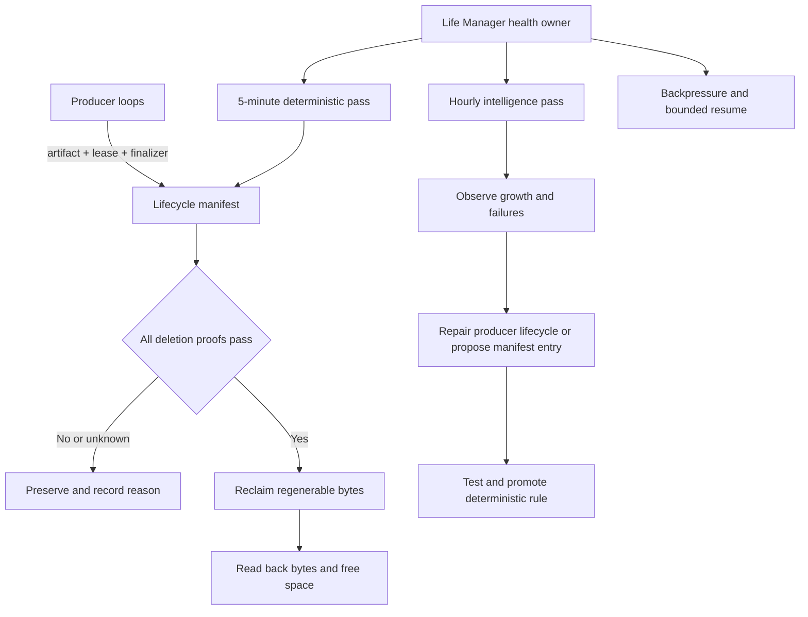

# Life Manager Disk Cleanup Loop 仕様

状態: 設計確定。実装・production cutover・長時間観測は未完了。

## 1. Overview — What & Why

Life Manager は、Mac mini 上の全loopがディスク枯渇でstate、receipt、session、
成果物を壊さず継続できるよう、1つの `disk-cleanup` skill と1つのcleanup authorityを
所有する。

現在は次の3つが別々に存在する。

- `com.anicca.emergency-disk-guard`: 60秒間隔の回収owner。
- `com.anicca.disk-sentinel`: 60秒間隔の観測、snapshot thinning、stop flag owner。
- `ai.anicca.disk-janitor`: 3,600秒間隔の限定的cache掃除。

過去には複数cleanerが同じcloneを異なる規則で削除し、producerの `.venv` を破壊した。
現在のguardは実行されているが、回収可能artifactを使い切ると
`no-eligible-reclaim` を反復する。active browserのcode-sign clone、dirty/unpushed
worktree、session、stateなどは正しく保護されるため、cleanup cadenceだけを増やしても
容量は回復しない。

本仕様は削除対象をLLMに自由判断させない。5分ごとのdeterministic passが、manifest、
owner、class、lease、open-path、再生成証明をすべて確認して回収する。1時間ごとの
intelligence passは原因分析、未分類artifact、producer lifecycle defectを診断するが、
未知のpathを削除する権限を持たない。

Apple `launchd.plist(5)` は `StartInterval` について、
“This optional key causes the job to be started every N seconds” とし、jobが実行中なら
次のintervalはmissされると明記する。したがって5分schedulerは重複実行を保証せず、
cleanup側もsingle-owner lockをMUSTで持つ。

ソース: [Apple OSS launchd.plist(5)](https://github.com/apple-oss-distributions/launchd/blob/main/man/launchd.plist.5)
/ 核心の引用: “If the job is running during an interval firing, that interval firing will likewise be missed.”

### Target architecture



### Ownership

| Component | Owns | MUST NOT own |
|---|---|---|
| Life Manager `disk-cleanup` skill | manifest contract、deterministic sweep、diagnostic report、backpressure | unknown pathの自由削除、credential、session本文 |
| Producer loop | artifact登録、lease heartbeat、finalizer、終了時cleanup | machine-wide cleanup policy |
| Deterministic pass | 証明済みartifactの回収、decision receipt | LLM判断、source/state/session削除 |
| Intelligence pass | growth attribution、分類候補、producer defect、修正task | 直接削除、保護classの格下げ、自分の判断だけでmanifest mutation |
| Sentinel | disk測定、tier遷移、stop flag | artifact削除 |

## 2. Acceptance Criteria

### 2.1 Single authority

1. Life Manager repositoryに `skills/self/disk-cleanup/` が存在し、全runtime entrypointを
   manifest化する。
2. productionでartifactを削除できるentrypointは1つだけである。
3. legacy janitor/cleanerはparity確認後にdisableされ、削除ロジックを実行しない。
4. sentinelは観測とbackpressureだけを行い、削除しない。
5. schedulerは300秒間隔、atomic lock、bounded runtimeを持つ。同時実行数は常に1以下である。

### 2.2 Fail-closed deletion contract

artifactを削除できるのは、次の条件がすべて真の場合だけである。

1. versioned manifestにexact pathが登録されている。
2. `owner` が空でない。
3. classが `ephemeral`、`regenerable_output`、`managed_regenerable`、または
   remoteで復元可能なcollectionである。
4. active leaseが存在しない。
5. `lsof`/open-path probeが `confirmed-closed` を返す。
6. 削除直前の再検証でもleaseとopen-pathがclosedである。
7. regenerable outputはlockfile、installed binary、remote ref、またはnamed managed
   reclaimerのexact proofを持つ。
8. 回収後にpath absence、reclaimed bytes、free bytesをread backする。
9. probe error、unknown class、unknown owner、missing proofはすべてpreserveになる。

### 2.3 Permanently protected data

次を自動削除、移動、truncate、圧縮、class変更してはならない。

- `~/.claude/**`、`~/.codex/**`、`~/.config/ai/**`
- Claude、Codex、OpenClaw、Life Managerのsession、transcript、memory
- `**/state/*.jsonl`、money ledger、publication/payment receipt、database
- auth、cookie、browser identity、credential、secret
- source code、`.git`、current worktree
- dirty、unpushed、remote state unreadable、openのworktree
- producer leaseがactiveなartifact
- classificationまたはrebuild proofが不明なpath

protected pathは容量不足時も削除しない。protected dataだけでreserveを回復できない場合、
cleanupは成功を偽装せずcapacity incidentを発行し、write-heavy producerを停止する。

### 2.4 Producer lifecycle contract

新規または既存のwrite-heavy producerは、開始前に次を宣言する。

```json
{
  "artifact_id": "writer-render-cache",
  "path": "/absolute/path/to/cache",
  "owner": "writer-loop",
  "class": "ephemeral",
  "ttl_seconds": 86400,
  "quota_bytes": 2147483648,
  "lease": {
    "path": "/absolute/path/to/writer-render-cache.lease",
    "max_age_seconds": 300
  },
  "finalizer": {
    "kind": "off_volume_quarantine"
  }
}
```

1. producerはartifact作成前にleaseを作る。
2. 実行中はleaseをheartbeatする。
3. 成功、失敗、timeout、signal終了のすべてでfinalizerを実行する。
4. leaseを閉じられなかった場合も、期限切れとopen-path closedの両方が揃うまで保存する。
5. browser/code-sign clone、build、render、temporary cloneはproducer ownerを特定する。
6. quota超過producerは新規artifact作成前に自分のexpired artifactを回収する。

### 2.5 Cadence and tier state machine

| Tier | Condition | Required action |
|---|---|---|
| NORMAL | free >= 20 GiB | 5分pass。producer通常運転 |
| PREVENTIVE | 11 GiB <= free < 20 GiB | expired regenerable artifactを回収。大規模build開始を拒否 |
| PRESSURE | 6 GiB <= free < 11 GiB | pressure override。hourly intelligenceを即時wake。write-heavy producerをdrain |
| CRITICAL | 3 GiB <= free < 6 GiB | 新規producer停止。進行中ownerはcheckpoint後に終了 |
| ULTRA | free < 3 GiB | 非必須write停止。state/receipt/checkpoint書き込みだけ許可 |

1. tierはData volumeのbytesで算出し、丸めたGBだけで判断しない。
2. tierを下げるには20 GiB reserveを2回連続観測する。
3. cleanup後も6 GiB未満なら成功扱いにしない。
4. stop flagは各producerのpreflightでMUST確認する。
5. recoveryは一度に全loopを起動せず、owner単位でbounded redispatchする。

### 2.6 Intelligence boundary

hourly intelligence passは、次だけを出力する。

- 直近1時間と24時間のfree-space delta
- 上位growth rootとowner
- cleanupのeligible/preserved/error/reclaimed集計
- `no-eligible-reclaim`、open-path、active-lease、missing-proofのstreak
- quota/lease/finalizerを守らないproducer
- manifest candidateと、その再生成証明
- 修正対象のproduction file、test、acceptance evidence

intelligence passはpathを削除せず、manifestを直接変更せず、protected classを格下げしない。
候補はfailing test、deterministic validator、review、production canaryを通った後にだけ昇格する。
正常時はLLMを呼ばない。次のいずれかの場合だけwakeする。

- PRESSURE以上へ遷移した。
- 2回連続でreserveを回復できない。
- 2 GiB/hour以上の未知growthを検出した。
- 同じownerで3回連続のlease/finalizer defectを検出した。

### 2.7 Reporting and audit

1. 1 passは `observed_at`、free before/after、tier、eligible count、reclaimed bytes、
   preserved reasons、owner、policy versionを1 receiptに記録する。
2. 高頻度decisionを無制限JSONLへ追記しない。集計可能なbounded operational logと、
   immutable incident receiptを分離する。
3. Telegramはtier遷移、2回連続failure、未知2 GiB growth、recoveryだけを通知する。
4. 同じ状態とpayloadはdedupeする。
5. report delivery failureはcleanupを失敗させないが、delivery failure receiptを残す。

### 2.8 Production completion

1. unit/integration testが全てpassする。
2. fixtureでactive session、active lease、open file、dirty worktree、unpushed worktree、
   state JSONL、secretが保存される。
3. fixtureでexpired cache、closed code-sign clone、verified build output、remote-recoverable
   clean worktreeだけが回収される。
4. production canaryは1つの既知regenerable artifactを回収し、readbackでbytes増加を確認する。
5. immediate replayはduplicate deletion 0、error 0である。
6. 24時間連続でfree >= 11 GiB、protected deletion 0、duplicate cleanup owner 0を観測する。
7. 7日間でENOSPC 0、state write failure 0、cleanup起因producer failure 0を観測する。

## 3. As-Is / To-Be

| Area | As-Is | To-Be |
|---|---|---|
| Ownership | guard、sentinel、janitorに責務が分散 | Life Manager `disk-cleanup` skillが唯一の削除authority |
| Cadence | 60秒guard、60秒sentinel、1時間janitor | 5分deterministic、event-driven intelligence、1時間health audit |
| Decision | manifest回収とlegacy path掃除が混在 | manifest proofのAND条件だけで削除 |
| Intelligence | 人間がalert後に広く調査 | abnormal stateだけLunaが診断しproducer defectをtask化 |
| Sessions | path規則により一部保護 | session/transcript/state/identityをpermanent protected contract化 |
| Active execution | open-path中心 | producer lease + heartbeat + open-pathの二重証明 |
| Worktrees | remote/dirty/open判定はcleanup側に存在 | producer ownershipとremote recovery receiptまで必須 |
| Backpressure | stop flag consumerが不均一 | 全write-heavy producer preflightで同じtier contractを実行 |
| Logs | ledgerが無制限に増加可能 | bounded ops log + immutable incident receipt |
| Recovery | reserve回復後に複数ownerが競合可能 | owner単位のbounded redispatch |

## 4. Test Matrix

| # | To-Be | Test name | Cover |
|---:|---|---|---|
| 1 | production削除authorityが1つ | `test_production_has_one_cleanup_authority` | OK |
| 2 | 300秒schedulerとsingle lock | `test_cleanup_launchd_interval_and_singleton_lock` | OK |
| 3 | protected rootsを永久保存 | `test_protected_roots_never_enter_runtime_manifest` | OK |
| 4 | active leaseを保存 | `test_active_lease_preserves_artifact` | OK |
| 5 | expired leaseでもopen pathを保存 | `test_expired_lease_open_path_is_preserved` | OK |
| 6 | probe failureを保存 | `test_lsof_failure_fails_closed` | OK |
| 7 | dirty worktreeを保存 | `test_dirty_worktree_is_preserved` | OK |
| 8 | unpushed worktreeを保存 | `test_unpushed_worktree_is_preserved` | OK |
| 9 | remote recoverable clean worktreeを回収 | `test_closed_clean_remote_worktree_is_reclaimed` | OK |
| 10 | verified build outputを回収 | `test_closed_build_output_with_proof_is_reclaimed` | OK |
| 11 | unknown artifactを保存 | `test_unknown_artifact_is_preserved_and_reported` | OK |
| 12 | bytes単位tier判定 | `test_tier_boundaries_use_exact_free_bytes` | OK |
| 13 | reserve回復前はfailure | `test_reclaim_below_recovery_floor_remains_failed` | OK |
| 14 | hysteresis | `test_recovery_requires_two_consecutive_observations` | OK |
| 15 | stop flagを全producerが尊重 | `test_write_heavy_producers_share_disk_preflight` | OK |
| 16 | intelligenceが削除しない | `test_intelligence_output_cannot_mutate_or_delete` | OK |
| 17 | intelligence wakeを異常時に限定 | `test_intelligence_wakes_only_on_contract_triggers` | OK |
| 18 | logがbounded | `test_operational_log_respects_size_and_retention_bound` | OK |
| 19 | Telegram dedupe | `test_disk_transition_report_is_deduplicated` | OK |
| 20 | recoveryをowner単位に直列化 | `test_recovery_redispatch_is_bounded_by_owner` | OK |
| 21 | canary後のreplayがno-op | `test_production_canary_replay_has_zero_duplicate_effect` | OK |
| 22 | legacy cleanup ownerをdisable | `test_legacy_cleanup_jobs_have_no_delete_authority` | OK |

### E2E judgment

| Item | Value |
|---|---|
| UI変更 | なし |
| 結論 | Maestro: 不要（理由: macOS launchd、filesystem、process leaseのruntime変更でありiOS UIを変更しない） |
| 代替E2E | 実launchd wake、実Data volume測定、既知regenerable canary、immediate replay、24時間/7日観測 |

## 5. Boundaries

### In scope

- Life Manager `disk-cleanup` skillとruntime manifest
- 5分deterministic pass
- abnormal-state intelligence pass
- producer artifact/lease/finalizer contract
- disk tier、backpressure、bounded recovery
- legacy cleanup ownerの安全なdisable
- audit、Telegram、production E2E

### Out of scope

- protected session、transcript、memory、state、credentialの削除または圧縮
- Mac mini diskの増設または交換
- cloud storageへのsource/session自動移行
- browser identityの削除
- active browser/processの強制kill
- dirty/unpushed worktreeの自動commit、push、削除
- cleanup LLMによる自由なshell実行
- cleanup成功を売上またはloop成果として数えること

## 6. Execution Steps — Atomic TODO

この順序が実装と完了判定のSSOTである。後続itemを先に実行しない。

| # | Work | Completion evidence | State |
|---:|---|---|---|
| 1 | 現在のguard/sentinel/janitor/plist/log/state/manifestをimmutable censusへ記録 | label、interval、program SHA、last exit、直近receipt、free bytes | 未着手 |
| 2 | `skills/self/disk-cleanup/` にcanonical manifest/runner/health interfaceを定義 | missing path 0、schema validation PASS | 未着手 |
| 3 | protected rootsとfail-closed validatorをTDDで固定 | Test Matrix 3–11 PASS | 未着手 |
| 4 | exact-byte tier、hysteresis、single lock、300秒schedulerをTDD実装 | Test Matrix 2、12–14 PASS | 未着手 |
| 5 | producer artifact/lease/finalizer helperを追加し、上位growth ownerへ接続 | active producerのlease readback、orphan lease fixture PASS | 未着手 |
| 6 | 全write-heavy producerへ共通disk preflightを接続 | producer census missing consumer 0、Test Matrix 15 PASS | 未着手 |
| 7 | bounded ops log、incident receipt、Telegram dedupeを実装 | Test Matrix 18–19 PASS、message ID | 未着手 |
| 8 | intelligence input/output schemaとwake gateを実装 | deletion capability 0、Test Matrix 16–17 PASS | 未着手 |
| 9 | owner単位のbounded recoveryを実装 | Test Matrix 20 PASS、duplicate redispatch 0 | 未着手 |
| 10 | 全cleanup testとLife Manager regression suiteを実行 | failure 0、warning 0 | 未着手 |
| 11 | effect-free shadow passでlegacy ownerとcanonical ownerのdecision parityを比較 | protected mismatch 0、candidate mismatch説明済み | 未着手 |
| 12 | 既知regenerable artifact 1件でproduction canaryを実行 | reclaimed bytes > 0、free bytes readback、protected deletion 0 | 未着手 |
| 13 | immediate replayを実行 | duplicate effect 0、error 0 | 未着手 |
| 14 | legacy janitor/cleanerの削除authorityをdisableし、canonical labelだけをload | loaded delete owner 1、rollback plist保存 | 未着手 |
| 15 | 24時間連続観測 | free >= 11 GiB、ENOSPC 0、protected deletion 0 | 未着手 |
| 16 | 7日間連続観測とproducer lifecycle audit | state write failure 0、cleanup起因producer failure 0 | 未着手 |
| 17 | rollback restore testと最終production receiptを保存 | prior label復元可能、final receipt、Telegram完了message ID | 未着手 |

### Required verification commands

```bash
python3 -m pytest skills/self/disk-cleanup/tests -q
python3 -m pytest skills/self/loop-scale/tests -q
bash -n skills/self/disk-cleanup/run.sh
plutil -lint skills/self/disk-cleanup/launchd/*.plist
launchctl print gui/$(id -u)/ai.anicca.life-manager-disk-cleanup
df -k /System/Volumes/Data
```

### User GUI tasks

なし。CAPTCHA、OAuth、決済、公開操作を含まない。

### Completion claim rule

spec作成、unit test、launchd load、1回の回収だけではDONEではない。Atomic TODO 1–17が
順番に完了し、24時間と7日間のproduction observationを満たした時だけDONEとする。
