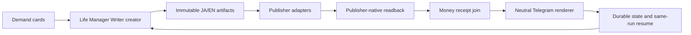

# Writer Loop を Life Manager に統合する仕様

状態: 実装順序を固定。公開成功を宣言する仕様ではない。

## 目的

WriterのコードをLife Managerリポジトリへ集約し、1つのcreator、1つのsame-run
resume、1つの収益台帳、1つのTelegram報告面で、需要カードから記事公開・実読戻し・
入金receiptまでを継続する。コードはリポジトリに置くが、credentialとmutable stateは
リポジトリ外のowner専用storeに置く。

## 現在の実測

- `daily-2026-08-20` はJA/EN原稿を生成し、active-fourの公開は1/4。
- Noteは安定キー `ne6da5b602b4a` を同じまま公開し、
  `https://note.com/anicca123/n/ne6da5b602b4a` の公開後読み戻し、¥500の有料設定、
  本文・画像・所有者を確認できた。Substack日英は下書きID
  `211988979` / `211988987`、Xは編集URLを再照合できたが、まだintentである。
- X日本語は編集URL `https://x.com/compose/articles/edit/2090392988765605888` を
  intentとして保持し、変更・公開していない。
- 20:36 JSTのdeterministicな公開tickはNoteのpaid API証拠不足で停止し、失敗回路保存も空き容量不足になった。20:44 JSTの次tickはNoteを再照合して公開・読み戻しを記録した。
- `launchctl bootstrap`/`kickstart` は `141: Reentrancy avoided`。plistがあることは稼働証拠ではない。
- 実行releaseは `/Users/anicca/profitable-claude-releases/writer/e9ab21ea/writer-agent`、
  stateは `/Users/anicca/profitable-claude/skills/writer-agent/state`。Life Manager checkoutは
  `/Users/anicca/Projects/life-manager-main` だが、Writer runtime treeは未移行。
- 現在はstate rootの `.publication-paused` が存在し、次のlaunchd tickは外部公開を行わずに終了する。JAは `SUBSTACK_PUBLICATION_JA`、ENは別の `SUBSTACK_PUBLICATION_EN` を必須とし、ENの既存draft `211988987` は公開禁止である。
- Telegramには初期化報告 `26065`、未完了報告 `26075`、Note公開を含む進捗報告 `26087` を送信済み。今後はdeterministic rendererだけが自然文を送る。実受取receiptは未確認。Substack公開はJA/EN identityが分離されるまで停止する。
- pause gateはresume workerとdaily creatorの両方で直接実行し、ロック・planner・publisherより前に終了コード0となることを確認した。変更対象の構文確認と、固定一時領域でのスケジュール／完了通知テスト `37 passed` も確認済み。外部公開の新規成功や売上receiptはまだ無い。
- Substack managed publisherのsource／active release契約fixtureは、JAのpublication identityをstateと環境へ明示してPASSした。これはローカル契約の確認で、外部Substack公開receiptではない。
- fresh adversarial reviewで空き容量は最新約382MiB（公開下限5GiB未満、直前は約704MiB）だったため、resumeにも同じfail-closedディスク判定を追加した。Substackの言語identity比較は正規化し、source circuitのpublisher timeoutをreleaseと同じ300秒へ揃え、間接ガード／readbackファイルも回路manifestへ含めた。EN/Xのidentity・media readbackが未確認なのでpauseは解除しない。

## 目標構成



```text
life-manager-main/
  skills/writer-agent/             # 唯一のWriter codeとadapter
    runtime/                       # model boundary、prompt、judge broker
    demand/                        # claim loop、demand cards
    publishers/                    # note、Substack JA/EN、X、free distribution
    receipts/                      # public readback、payment/publisher receipt
    reports/                       # natural-language Telegram renderer
    launchd/                       # creator/resume plist templatesとmanifest
  config/writer/                   # platform/account role registry（secret参照のみ）
  docs/superpowers/specs/          # この統合仕様と実測証拠

~/.local/state/life-manager/writer/ # run state、ledger、outbox、receipt、log
~/.config/life-manager/accounts/    # owner-approved credential references
```

唯一のcreatorは新しいrunを作り、resume ownerは同じrunの未完destinationだけを再開する。両者は
リポジトリの場所に依存しない共有fence（`~/.local/state/life-manager/writer/owner-fence`）を
先に取得し、ownerの絶対path、PID、起動時刻、state schema、run IDを記録する。旧rootと新rootの
同時稼働を許さず、cutoverでは全workerをdrainしてowner不在を確認してからstate/ledger/outboxを
原子的に移す。
platformは `revenue`（Note、Substack）と `discovery`（Dev.to、Zenn、X等）を分離する。
同じ全文を別言語・別publicationへ無差別複製しない。`substack/ja`と`substack/en`は
publication identity、読者、payout、ledgerを分ける。

## 完了条件

1. Life Managerのmanifestがsource SHA、実行release、state schema、全worker pathを固定し、
   missing pathが0になる。
2. 1回の実scheduler wakeでrun/artifact hash、creator PID、終了receiptを取得する。
3. 同一runのNote JA、Substack JA、Substack EN、X Article JAがpublisher-native URLを返し、
   URL本文・owner・artifact hash・media hashをreadbackする。
4. paymentまたはpublisherの実受取receiptをartifactへjoinする。未確認額は0に変換しない。
5. Telegram本文は自然文で、実際に起きたこと、外部理由、確認済みの公開URLまたは未確認、
   次の自動行動を説明する。`Codex:::`、`Claude:::`、生enum、stack traceは主文に出さない。
6. 14日間、重複外部作用0、同一run resume、日次/週次報告、revenue ledger整合を観測する。
7. 上記のparity receiptとrollback archiveが揃うまで、Writer専用releaseを含む旧実行rootを
   削除しない。`~/.openclaw`は認証・ブラウザ・gatewayの不可侵runtimeであり、永久に削除対象外。
   `/Users/anicca/profitable-claude`全体もWriter以外の稼働loopを含むため削除対象外とし、最後に
   可能なのは参照census・復元試験・shared fence確認を通ったWriter専用releaseのアーカイブだけである。

## Atomic TODO（この順番以外を先に進めない）

| # | 作業 | 完了証拠 | 状態 |
|---:|---|---|---|
| 1 | launchd実行コンテキストを復旧し、creator/resumeを一度だけ起動 | 20:44 JSTのresume logは取得済み。`launchctl print`のrc=141は未解消 | 一部完了 |
| 2 | DNSまたは承認済みnetwork transportを復旧 | NoteのHTTP公開・読み戻しは取得済み。Substack/Xは未確認 | 一部完了 |
| 3 | Writer runtimeを`skills/writer-agent`へ移しmanifestを生成 | SHA付きpath census | 未着手 |
| 4 | demand→artifact→publisher adapterを同じstate schemaへ接続 | run/artifact parity | 未着手 |
| 5 | Note/Substack/Xの実公開とreadbackを同一runで完了 | Note 1/4。Substack identityとXが未完了 | 進行中 |
| 6 | payment/publisher receipt collectorとmoney ledgerを接続 | artifact-level receipt | 未着手 |
| 7 | neutral Telegram rendererを日次・失敗・完了へ接続 | message ID `26075`/`26087` + semantic hash | 一部完了 |
| 8 | adversarial verifierで重複公開・誤金額・偽URL・secret漏洩を反証 | Note live境界とidentity gateのfresh review | 進行中 |
| 9 | Life Manager ownerをloadし、19個のWriter関連LaunchAgent（creator、resume、retry、money、report、health、learning、opportunityを含む）のpath/state/lockをmanifest化。shared fenceで旧ownerをdrain後にdisable | owner manifest + old/new parity + bounded wake | 未着手 |
| 10 | rollback archiveと復元試験を検証し、Writer専用releaseだけをアーカイブ。`.openclaw`と`profitable-claude`全体は削除しない | archive hash + restore receipt + deletion-scope receipt | 未着手 |

削除は最後の一件であり、現在は実行しない。
