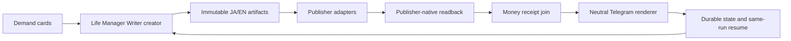

# Writer Loop を Life Manager に統合する仕様

状態: 実装順序を固定。公開成功を宣言する仕様ではない。

## Current SSOT（2026-08-21 実測）

### launchd control-plane の外部照合と現在の原因判定（2026-08-21）

- Appleの資料では、`~/Library/LaunchAgents`はログイン中ユーザー専用のLaunchAgent置き場であり、
  `StartInterval=300`は5分周期の正規設定である。したがってLife Managerの`StartInterval`自体は
  異常の説明にならない（Apple Support: https://support.apple.com/guide/terminal/script-management-with-launchd-apdc6c1077b-5d5d-4d35-9c19-60f2397b2369/mac、
  Apple Developer: https://developer.apple.com/library/archive/documentation/MacOSX/Conceptual/BPSystemStartup/Chapters/CreatinglaunchdJobs.html）。
- Web上の独立した同型事例では、WindowServer/loginwindowの再起動後にGUI bootstrapを失ったプロセスで
  `id -un`が数値UID、`dscl`がDirectory Services接続失敗、`launchctl asuser 501`が
  `Reentrancy avoided`、`log`がlogd接続失敗になることが報告されている。これは今回のMacの観測値と
  一致するが、WindowServerが今回の発火元だったとは断定しない（OpenAI Codex issue:
  https://github.com/openai/codex/issues/36696）。
- 今回のMacはmacOS 15.6 (24G84)、PID 1は`/sbin/launchd`だが、`id -un`は`501`、
  `launchctl managername`はrc=153、`managerpid`はrc=153、`launchctl print system`・
  `print user/501`・`print gui/501`・`asuser 501`はすべてrc=141 `Reentrancy avoided`、
  `dscl . -read /Users/anicca`は`eServerError`、`log show`はlogd接続失敗である。これは
  Writer固有のplistエラーではなく、ユーザーbootstrap／Directory Services／logdのホスト障害である。
- installed plistは14件すべてLife Manager current releaseと外部stateを指すが、過去のWriterログには
  loaded定義が`/Users/anicca/profitable-claude`や旧releaseを呼び続けた証拠が残る。つまり現在は
  「ファイル上のdesired stateはLife Manager」「launchdメモリ上のloaded stateはreadback不能で、
  過去にはstale定義が存在した」という切替不一致である。現在のloaded ownerを全件staleと断定せず、
  readbackでcurrent/staleを分ける。Life Manager以外のjob-searchやgigのspecにも同じrc=141が記録されており、
  このMac全体のcontrol-plane症状である。
- 復旧はrepo内で新executorを作ることではない。安全な順序は、(1)有効なコンソールGUIセッションを
  回復（必要ならユーザーlogout/loginまたはMac再起動。ただしlaunchd/loginwindow/opendirectorydを個別killしない）、
  (2)`id -un`が`anicca`、`launchctl managername`が有効なAqua/GUI manager、`dscl`と`log show`が成功することを確認、
  (3)旧14 Writer定義とretired 5 CLI labelをbootoutしてstale ownerをdrain、(4)14件のLife Manager plistを
  `bootstrap gui/501`し、各loaded `ProgramArguments`/environmentを`print`でreadback、(5)pauseを解除する前に
  creator/resumeを一度だけkickstartして同一run receiptを確認、である。現在は(1)のホスト復旧前なので、
  bootout/bootstrapを強行せず、公開処理を常時稼働とは宣言しない。

### execution plane と launchd control-plane の区別（2026-08-21 10:19 JST）

- 直近の実測では、Coconalaの`storefront_direct.py`、`application_direct.py`、
  `reply_detector.py --continuous`、`paid_direct.py`が生存し、いずれもPPID=1だった。
  これはCoconalaのexecution planeが動いている直接証拠であり、「launchd全体が停止した」とは言わない。
- 同じ観測窓で`launchctl managerpid`はrc=153、`launchctl list`はrc=141だった。
  これはこのセッションからのmanager RPC／bootstrap readbackが失敗している証拠であって、
  既に起動したworkerの内部pollingや、別の有効な起動経路まで停止した証拠ではない。
  launchdは一度起動したworkerを、`launchctl`の読出しが毎tick成功しなくても実行し続けられる。
- `paid_direct.py`の親は`life-manager/current`だが、子の一部はimmutableな旧release
  `e537b55e1917ea3ac8b80b5e3d684060af5d5dcb`を指していた。したがって「プロセスが生きている」ことと
  「現在のplist・current release・正しいjob labelから起動されている」ことを別の受入条件にする。
- Writer stateには`.article-daily.recovery.lockdir/owner.pid=40373`が残る一方、PID 40373は現在存在しない。
  これはstale owner fence候補であり、GUI/bootstrapとowner readbackを確認するまで削除しない。
- 以後の判定語を固定する。`process_alive`はexecution evidence、`launchctl_readback`はcontrol-plane
  evidence、`scheduler_recurrence`は自然tickの連続receiptであり、前二者を同じ成功に数えない。

### A1 control-plane復旧の安全な試行結果（2026-08-21 10:29 JST）

- 同じexecution contextでの再測定でも`managername/managerpid`はrc=153、`print gui/501`はrc=141、
  `dscl . -read /Users/anicca`は`eServerError`だった。Coconalaのcurrent workerはその間も生存していた。
- `launchctl reboot userspace`はrc=141で状態変化なし。`sudo`は「uid 501がpasswd databaseに存在しない」、
  `su`とroot SSHも同じユーザー解決失敗で起動できない。`/etc/passwd`にrootはあるがaniccaはなく、
  Directory Servicesが回復していない。
- 自動ログイン設定は確認できず、`launchctl reboot logout`は未実行である。launchctlの公式仕様でもlogoutは
  未保存データを失うリスクがあるため、手動ログインを保証できない現状では実行しない。
- よってA1は「診断済み・安全なagent-only復旧手段なし」のブロッカーとして保持する。Coconala worker、
  Writer state、旧releaseは停止・削除していない。

### 最新の同一run実測（2026-08-21）

- `daily-2026-08-21` は active-four の4件すべてを同じ不変原稿から native publish/readback まで完了した。
  Note JA は `https://note.com/anicca123/n/ncbdb8a56bb20`、Substack JA は
  `https://aniccabuddha.substack.com/p/1`、X Article JA は
  `https://x.com/diceai0/article/2090526616854405173`、Substack EN は
  `https://aniccaai2026.substack.com/p/stop-writing-first-and-selling-later` である。
  ENの安定draft/public IDは `212079208`。state/ledgerの4行はすべて
  `published=true`、`verified=true`、`reality_gate=PASS`である。
- ENはJAと別publication identity・別session cookieを使う。`SUBSTACK_PUBLICATION_JA=aniccabuddha.substack.com`、
  `SUBSTACK_PUBLICATION_EN=aniccaai2026.substack.com`をpairごとに解決し、ENにJAのhostまたはcookieを
  fallbackしない。identity migration receiptで旧同一host stateを隔離してから、EN draftを同一IDで
  publishした。EN native readbackは `destination_identity=aniccaai2026.substack.com`、
  `identity_verified=true`、`content_verified=true`、`asset_verified=true`、`body_media_verified=true`、
  preview画像の最大高さ382pxを確認した。英語と日本語を1つのSubstackへ混載しない。
- Substack DNS解決が通常経路で失敗しても、publisherの既存curl境界内で`dig @1.1.1.1`を使う
  再試行を許可し、別executorや別schedulerは作らない。今回のEN publishはこの同一publisher経路で
  `PUBLISHED`と公開canonical URLを取得した。
- 収益は公開receiptと分離する。最新のmoney readbackでは外部payment receiptは0件、Noteの
  観測済みアカウント売上は¥0・購入0件、Substackのpaid subscribers/MRR/累計収益は明示的な数値を
  得られず`unknown`である。価格設定、paywall、表示数、like、推定値は収益へ加算しない。したがって
  現在の確定収益は¥0（外部receipt 0件）であり、MRRは不明である。
- 公開完了時の標準Telegram通知は通常DNSで失敗したため、Bot API transportへ公開DNSの解決と
  `curl --resolve` fallbackを追加した。自然文の同一run報告を送信し、`message_id=26880`、
  `status=sent`、outboxのdelivery receiptをreadbackした。`Codex:::`などのharness接頭辞は付けない。
- 直接owner wakeとrelease/current切替は実測済みだが、`launchctl print`/`kickstart`は現在もrc=141
  `Reentrancy avoided`である。よって「公開処理は実行可能」と「5分周期schedulerがlive」を分け、
  launchdのreadbackを回復するまでloop全体を常時稼働とは宣言しない。

- 実行構成は Coconala parity のまま。独自 executor／scheduler は追加せず、
  `gig_release.py`、immutable `~/gig/releases/life-manager/current`、
  `gig_disk_guard.py`、owner fence、外部 state `~/.local/state/life-manager/writer` を使う。
  Coconalaの4 laneと同様、公開ownerは重複起動せず、外部作用の前にlock・state・receiptを確認する。
- current immutable releaseはrelease watcherがHEADから切り替える。直近source commitは
  `309998181e53ffd7b01fef6e4d4469d3acada978`。`daily-2026-08-21` は
  Note JA、Substack JA、X Article JA の
  native live receiptを同一runで確認済み。URLは `https://note.com/anicca123/n/ncbdb8a56bb20`、
  `https://aniccabuddha.substack.com/p/1`、`https://x.com/diceai0/article/2090526616854405173`。
  これは公開receiptであり、売上・入金receiptではない。
- `2026-08-20T23:00:07Z`のcurrent release direct owner wakeは、plannerが`daily-2026-08-07`
  の`note/ja`だけを回復対象として選択した。認証済みreadbackが曖昧だったため`REFUSED`、
  failure circuitを開いて外部公開を追加せず、lockは終了後に不在となった。Telegramの自然文報告は
  message ID `26780` で送信済み。`launchctl bootstrap`と`print`は同一contextでともにrc=141
  `Reentrancy avoided`のため、macOS control-plane復旧なしに5分周期のscheduler証明はできない。
- Note復旧用runtimeは、開発専用mitmproxy依存を入れない`uv sync --locked --no-dev`を正本とし、
  DNS障害時だけ既存共有runtimeを`fastmcp`／`note_mcp` import検証後にsymlinkを追わないwrapperとして使う。
  対象checkoutの`src/note_mcp/__init__.py`をimportしていること、`.venv`親がsymlinkでないことをuv実行前から検証する。
  wrapperのcache target／親symlink非破壊テスト、shell構文、関連14テストはPASSした。専用runtimeの外部
  downloadはDNSで失敗したが、実行用wrapperのimportはcurrent hostでPASSしている。
- daily creatorもpreflight cleanup後にCoconala canonicalの1GiBを再測定し、まだ床未満ならrun／model／publisherを開始せず、
  Telegramへ自然文の停止通知を出してrc=1で終了する。resumeと同じ失敗終了コードに揃え、creator・resume・launchd guardが
  同じ1GiB契約を共有する。隔離HOMEで両ownerのrc=1、run未作成、lock不残留を`disk-floor-contract.sh`で確認した。
- `2026-08-20T22:33:44Z`のread-onlyブラウザCDP readbackでは、Note key `n47735d9811e8`がHTTP 200、
  `status=published`、`price=500`、`is_limited=false`、`can_read=false`、eyecatch URLありだった。
  通常Python APIは同時刻のDNS失敗で接続できず、ブラウザreadbackのみを採用し、公開・入金receiptとは混同しない。
- Coconalaの公開owner順序をWriterにも固定した。`article-resume-pending.sh`は、まず
  `article_pending.py`で公開キューを確定する。`READY`でもself-healを1件だけ
  `--publication-backlog 1`でclaim/runbook receiptまで進め、通常のTerra調査は延期する。
  これで公開失敗が継続してもincident claimが飢餓しない。READY経路は回路所有者を含めて
  `--defer-model-always`を渡し、Terraを実行しない。`WAIT`/`BLOCKED`のときだけ公開lockを
  解放してから`writer_repair_dispatch.py --publication-backlog 0`を実行する。これによりTerraの
  公式文書調査が公開lockを保持せず、公開待ちの前にモデルが走る順序逆転も防ぐ。shell構文と
  Coconala parityの順序ガードを含む16 focused tests、既存Note circuit/media wiring、planner、
  failure circuitをPASSした。
- current releaseからの実owner直接wake（`2026-08-20T22:19:07Z`）は、plannerがNote recoveryを
  選択した。認証済みdestinationの曖昧性は`REFUSED`として外部公開を行わず、self-heal routingも
  evidence index不足で`UNRESOLVED`にfail-closedした。publisher lockは終了後に不在で、偽の公開URL・
  収益receipt・モデル成功を記録していない。これはcurrent codeのlock解放と安全停止のruntime receiptであり、
  `launchctl kickstart`の`141: Reentrancy avoided`とは別に、自然周期の実行証明はまだ未完了である。
- Xの画像挿入失敗は、canonical publisherが外部macOS clipboard helperを直接呼んでいたことが原因だった。
  その局所副作用だけをページ所有Clipboardへ差し替え、実ブラウザでHTML/PNG書込み、native readback、
  同一run state更新を確認した。fresh adversarial reviewはCritical/ImportantなしでSHIP。
- 完了通知はGateway CLIではなく、既存 `writer_report_worker.py` の直接Telegram Bot API transportを再利用する。
  pending outboxの再送は実message ID `26606`、`status=sent` で確認した。本文は自然文で、公開と入金を分離し、
  harness名の接頭辞を付けない。
- Substack ENは別publication identityとcredentialが未設定のため `unavailable` quarantineのまま。
  JA publicationへ英語を混載せず、英語用host・新draft・authenticated native readbackが揃うまで公開しない。
- `substack-publication-identity-conflict` は未知のprocess障害ではなく `publisher-identity` として
  incident queueへ取り込み、既存のread-only `publisher-identity-v1` runbookへルーティングする。
  これにより、identity未設定のENだけをPENDINGに残し、毎tickのTerra調査で公開ownerを消費しない。
- `launchctl activate`／`print`／bootstrap は全laneで rc=141 `Reentrancy avoided`。current symlink切替は確認できるが、
  loaded schedulerの所有者・argv・定期実行は証明できない。重複executorは起動せず、既存ownerのreceiptだけを採用する。
- Writerのdisk floorはCoconalaの`gig_disk_guard.py`と同じ1GiBへ統一する。外部公開は1GiB未満で
  fail-closedし、保護対象のstate／memory／rollbackは削除しない。過去の5GiB receiptsは履歴であり、現在の閾値ではない。
- `2026-08-20T22:43:23Z`の旧release `901be512b`からのresumeは空き容量`4,345,827,328` bytesで
  旧5GiB floor blocked、rc=0、lock=absentだった。Coconala canonical 1GiBへの統一後は、同じ空き容量を
  安全境界内として扱い、外部作用は実receiptを要求したまま次段へ進める。
- `daily-2026-08-20` のX Articleは、原稿内の相対 `headline-image.png` / `body-diagram.png` 重複が
  `prepared/`で欠損扱いになる根因を `prep-x-md.py` で修正した。なお本当にimmutable画像が欠ける場合は、
  同一X編集URLの認証付き `not-live` readback、identity一致、ledger/journalの無作用、同一lock内のintent再確認を
  全て満たした時だけ `unavailable` へ隔離する。probeだけで状態を上書きしない。
- `daily-2026-08-20` はその後、Note JA、Substack JA（draft ID `211988979` →
  `https://aniccabuddha.substack.com/p/0fc`）、X Article JA（edit ID
  `2090392988765605888` → `https://x.com/diceai0/article/2090541649873281459`）を、
  同一run・同一不変原稿・画像SHA一致のnative readbackでlive化した。各destinationのledger行は1件で、
  追加公開は行っていない。Substackのcanonical dispatch行（`platform=substack, lang=ja/en`）と
  旧channel表記の両方をresume可能にした。XはCDPの実ブラウザが取得済み画像bytesでreadbackし、
  認証proofなしの誤タブ（非X URL）ではquarantineしない。
- 現在の `publication-guard.py plan` は `resumable=false, reason=frozen-incomplete-pairs,
  frozen_pairs=[substack/en]`。英語Publicationの別identity・credential・native receipt・入金receiptは未確認で、
  JA Publicationへの混載はしない。
- 収益の実測は`measure-sales.py`で5項目を取得したが、Note売上/購入数とSubstack paid subscribers・MRR・累計収益は
  すべて明示数値を得られず`unknown`として保存した。`money_sync.py`のverified revenue eventは0件、
  Stripe receiptも0件であり、公開・価格表示・閲覧を入金へ変換していない。
- launchdは`launchctl print/kickstart`が引き続き`141: Reentrancy avoided`。同じ実行contextで`whoami`がUID `501`のみを返し、
  `dscl . -read /Users/anicca`も`eServerError`であるため、これはWriterコードではなくmacOSのユーザーdirectory/control-plane障害として隔離する。
  OS serviceのkill/restartやユーザーdirectoryの書換えは行わず、既存ownerの直接receiptだけを採用する。
- 過去receiptでは空き容量約4.97GiBが旧5GiB floorを下回っていた。現在はCoconala canonical 1GiBを
  fail-closed境界とし、disk guardの実runtime receiptで判定する。
- 06:11:52 JSTの実行では、Life Manager current配下の`article-resume-pending.sh`がowner fenceを通過して終了し、
  `daily-2026-08-10`のSubstack JAを既存draft ID `210519352`から
  `https://aniccabuddha.substack.com/p/ai14`へ公開・native readbackした。`article-resume.log`には
  `rc=0`とTelegram message ID `26684`のdelivery receiptが残る。起動中のCoconala laneと同様に、
  owner processのPPIDは1で、実行releaseはcurrent symlinkを指していた。
- 同じ観測窓で、article-resumeの次の300秒周期起動はまだ観測できず、`launchctl print/kickstart`は引き続き
  `141: Reentrancy avoided`である。したがって、このowner実行は「1回の実runtime receipt」として採用し、
  5分周期のscheduler readbackや二重起動ゼロを完了とは扱わない。
- 06:16:54 JSTには、次の300秒tickがPPID 1のowner fenceとして自然起動した。旧未完run
  `daily-2026-08-07`のNote recoveryを認証済みdestination readback不足で`REFUSED`し、
  外部公開・ledger・receiptは増やさず、`rc=2`で安全終了した。この実測で周期起動は1回増えたが、
  古いbacklogが日次creatorを抑止し得る問題を確認した。
- `9966d4f77`で、日次creatorを抑止するのは`LOCAL_DATE`より過去と厳密parseできたrunだけに限定した。
  同日・未来・欠落・不正daily ID・不正legacy timestampはfail-closedし、過去backlogは今日の生成後に
  同じownerがresumeする。回帰を24 focused testsで確認し、release watcher経由でcurrent symlinkへ公開した。
- `351f5aea4`で、Coconalaのlane契約に合わせてNoteの曖昧性回復を同一runの永続failure circuitへ接続した。
  回路は`note/ja`のpublisherと`publication_remote.py`／`publication_resume.py`を同じ実行文脈として追跡し、
  同じ失敗が閾値に達したらNoteだけをBLOCKし、Substack等の兄弟pairを継続する。plannerはNoteだけの回復も
  `READY`として次のtickへ渡し、同一pairのtarget・destination identity・media・draft identityが変わった時だけ再armする。
  兄弟のlive化でNote circuitが再armされないことを含む14 focused/behavioral tests、shell/Python構文、
  fresh adversarial review（Critical/Importantなし、SHIP）を確認した。release watcherはcurrentをこのcommitへ
  切り替えたが、launchd control-plane readbackは引き続き`141: Reentrancy avoided`であり、自然tickの新receiptは
  まだ追加確認していない。
- release切替後の自然owner receiptでは、06:52:04 JSTに同じNote拒否を`count=1`、06:57:52 JSTに
  `count=2/open=true`として記録した。直後のcurrent plannerは`daily-2026-08-07`について
  `blocked_pairs=[note/ja]`、`recovery_pairs=[]`、`eligible_pairs=[substack/ja]`を返し、lockも解放された。
  これはNote circuitが兄弟を継続させる実runtime証拠である。一方、07:02:57 JSTまでに次の自然tickと
  Substack native publish/readbackは発生していない。`launchctl print/kickstart`は引き続きrc=141のため、
  兄弟公開の実証はcontrol-plane復旧後の残TODOとして保持する。
- 06:11:52 JSTの同一ログには、空き容量`5,256,216,576` bytes（要求`5,368,709,120` bytes）で
  disk guardが公開をfail-closedにした記録もある。保護対象を削除せず、容量安定化までは外部公開を強行しない。
- 残TODOは順に、(1)保護対象を削除せず空き容量1GiB超を安定維持、(2)launchd control-plane readbackを復旧して
  Life Manager currentの新releaseで5分周期実行を2回以上連続して証明、(3)publisher/paymentの実receiptだけを
  収益ledgerへjoinし、Note/Substackの現在値を次回tickでも再測定、(4)14日間の重複外部作用0と
  需要カード→生成→JA/EN公開→native readback→Telegram報告の連続receiptを観測する。ENの別identity、
  credential、同一run native publish/readbackは完了済みなので、未完TODOとして再登録しない。

## 目的

WriterのコードをLife Managerリポジトリへ集約し、1つのcreator、1つのsame-run
resume、1つの収益台帳、1つのTelegram報告面で、需要カードから記事公開・実読戻し・
入金receiptまでを継続する。コードはリポジトリに置くが、credentialとmutable stateは
リポジトリ外のowner専用storeに置く。

## 現在の実測

### 2026-08-21 latest: Coconala parity lane の実行結果と公開境界

- Coconalaの実装を正本として、Writerは新しいexecutorや独自schedulerを追加しない。
  既存の`gig_disk_guard.py`、owner fence、immutableな
  `/Users/anicca/gig/releases/life-manager/current`、外部state
  `~/.local/state/life-manager/writer`、launchdのlane本体だけを使う。
- current releaseは`513d8fc0c7434acac4a4c2f993b707b8b228729a`へ切り替え済み。
  sourceのfocused checkはidentity 2件＋需要state 2件がPASSし、source／current releaseの
  `publication_resume.py`に同一Substack hostを拒否するidentity gateが存在する。
- 需要laneの最新実receiptは`2026-08-20T17:57:11Z`、`READY_WITH_SOURCE_OUTAGE`、観測231件、
  queue `1→1`（既存カードを安全に保持）、TECHiの7日以内のhash検証済み本文SHA
  `6604de6f1e9378bc9f3e8c3c83f41c597751f879ccc1b988339aabb67453f20b`を再利用した。
  queueには`paid-demand-e2a3be56…`の有効なカードが存在する。これは需要供給の復旧であり、
  記事公開や売上のreceiptではない。
- 既存resume workerが同じrunのNote JAだけを実公開し、stateの更新時刻は
  `2026-08-20T17:36:23Z`。native readbackは
  `https://note.com/anicca123/n/ncbdb8a56bb20`、所有者`anicca123`、公開時刻
  `2026-08-21T02:36:20+09:00`、有料設定¥500、本文・画像・artifact SHA
  `dae1d2fc17f9705e18e008c1188d2cb5c06fb6f0a6d7a813be1eb6b848da8156`を検証済みである。
  ¥500は価格設定であり、販売または入金receiptではない。
- 同じrunの`substack/ja`、`substack/en`、`x-article/ja`はintentのままで、native公開URL・
  readback・入金receiptはない。旧stateには日英Substackが同じ
  `aniccabuddha.substack.com`として保存されているが、新releaseはこのstateを公開前に拒否する。
  `SUBSTACK_PUBLICATION_EN`と別アカウントのcredentialは未設定であり、英語Publicationを
  推測したり、JA accountへ送ったりしない。
- launchctlのcontrol-plane readbackは引き続きrc=141 `Reentrancy avoided`で、loaded schedulerの
  稼働証拠とは扱わない。fresh adversarial reviewも、Noteの実receiptは認めたが、Substack
  identity未設定のままの再開をNO-GOとした。従って現在の結論は「需要→queueとNote JAの
  native receiptは実証済み、4 destinationの毎日公開と収益loopは未完了」である。
- 認証profileの実API readbackは、現在owner publicationが`aniccabuddha`の1件だけである。
  正規bundleが示す`POST /api/v1/publication`と、利用可能性を返す
  `/api/v1/check_subdomain?subdomain=...`を確認した。英語候補`aniccaglobal`は利用可能だったが、
  作成POSTは1回だけ実行してHTTP 401（追加CAPTCHA認証）で拒否された。exact hostのGETは404、
  profileはpublication 1件のままであり、作成済みとは扱わない。再POSTやCAPTCHA回避はしない。
- plannerが同一host stateを`IDLE`として隠さないよう、`article_pending.py`は有効runが無い場合に
  `status=BLOCKED`、`reason=invalid-incomplete-run`、`blocked_runs[*].reason=
  substack-publication-identity-conflict`を返すようにした。これで既存Coconala型の周期laneと
  自然文報告が、停止理由を捨てずに次の一手へ渡せる。

### 2026-08-21 latest Coconala parity recovery

- 公開停止markerは現在存在しない。Creatorは`gig_disk_guard.py → article-daily.sh`の
  installed ProgramArgumentsで起動し、過去ログではなく起動直前のfilesystem snapshotを
  pause判定に使う。`publication paused`という古いログ行を現在の停止証拠にしない。
- `daily-2026-08-21`は公開stateと公開ledger行が無いまま生成物だけを残して終了したため、
  Coconalaのbounded retryと同じ`interrupted-safe` archiveへ移した。archive時は同じtopicを
  再取得するため`topic-route-input.json`と`topic-route.json`をrunに残す。
- resume cardは完全なpaid-demand cardとして再検証できる。claim-loopの最新receiptが
  `DEMAND_CARD_INVALID`（TECHi source outage）でも、新規topicのauthorityはfail-closedのまま、
  同じrunの明示されたresume cardだけを`RESUME_CARD`として続行する。別topicの選択には使わない。
- `gates/topic-card-resume.json`はwrapperが作るowner-fence receiptであり、生成物ではない。
  pre-publication safe判定の許可リストに含め、Coconalaと同じく再開境界をレシートで保持する。
- current releaseは`aa31d9d4dc97...`へpublish済み。launchd bootstrap/readbackは引き続き
  `141: Reentrancy avoided`であり、これはcurrent release publishの失敗ではない。記事URL、
  publisher-native readback、収益receiptはまだ0件なので、公開成功とは宣言しない。
- `article-resume`はCoconala型のowner fence下で、同じrunのactive-four初期化を再開中である。
  `gates/topic-card-resume.json`はwrapper-owned receiptとして許可し、品質terminalの
  `ADVISORY`（continuous policy）を保持したまま、note/ja・substack/ja・substack/en・
  x-article/jaのtarget登録だけを行い、このtickでは公開しない。
- active-four初期化が先に4件のdormant skipを永続化してからactive targetを登録するため、その
  中断状態を「有効な未完runなし」と誤判定していた。`publication_resume.py`はこの
  dormant-only active-four stateを部分初期化として再開可能にし、installed pending laneで
  `initialization_pairs` 4件を再現できる。targetのnative URL/readbackと収益receiptはまだ0件。
- Coconala型のrelease/state分離を実行時にも確認した。resume laneの解決済み
  `ARTICLE_STATE_DIR`を子processへ明示exportし、managed stagingがimmutable releaseの
  `skills/writer-agent/state/`へ書かないことを確認した。報告transportにも30秒上限を設け、
  Telegram pending receipt `26454`を受領した後、owner fenceは解放された。
- 同じrunの初期化結果はnote/ja=`ncbdb8a56bb20`、substack/ja=`212035682`、
  x-article/ja=`https://x.com/compose/articles/edit/2090487802513506304`の3 intent。
  substack/enは別publication identity未設定（`SUBSTACK_PUBLICATION_EN`なし）かつ通常DNS
  失敗のためstable targetを作れず、`resumable=false`のまま公開を行わない。

### 2026-08-21 Coconala parity の需要ソース再利用修正

- `claim-loop-latest.json`の実receipt（`2026-08-20T17:24:26Z`）は、TECHiの取得がHTTP上は
  成功しても本文がinterstitialで`techi.title`を含まず、`DEMAND_CARD_INVALID`として
  queueを0件にしていた。既存の外部`demand-source-bodies.json`には、同日10:05 UTCに取得した
  4 evidence unit付きのfull-bodyと一致するSHAが残っていた。
- Coconalaと同じbounded reuse境界に合わせ、transport成功後の本文検証失敗も「信頼できない
  capture」として扱い、7日以内のhash検証済み外部receiptへ戻す。キャッシュが無い、期限切れ、
  SHA不一致の場合は従来どおりfail-closedで`DEMAND_CARD_INVALID`にする。モデルへ推測値や
  excerptを渡す変更ではない。
- focused checkは需要state pathとこの再利用回帰を2 passed、Python構文確認もPASS。sourceを
  commit後、同じCoconala型disk-guard/owner-fence laneで`claim-loop-latest.json`を再生成し、
  `DEMAND_CARD_INVALID`から`FILLED`または既存queueを保持する状態へ戻ることを実receiptで確認する。

### 2026-08-21 Substack identity gate の再固定

- 既存runのstateが`substack/ja`と`substack/en`を同じ`aniccabuddha.substack.com`として
  保存していたため、英語と日本語を同一publicationへ混載しない契約に反していた。これは
  live receiptではなく、公開前の誤ったintentである。
- `publication_resume.py`は、active-four初期化時に`SUBSTACK_PUBLICATION_EN`を必須にし、
  `SUBSTACK_PUBLICATION_JA`と異なる`.substack.com` hostだけをstateへ保存する。既存stateの
  identity shapeもtarget/readback前に検証し、同一hostや他platform identityの差し替えはfail-closedにする。
- focused identity check 2件と需要state check 2件、Python構文確認はPASS。英語publicationの
  実host/credentialは未設定なので、Substack ENの公開URL・native readback・収益receiptは
  まだ存在しない。設定が入るまでloopはJA/ENを同一Substackへ送らない。

### 2026-08-21 Coconala parity 再確認

- Coconalaの実行実体は、常駐Supervisorではなく、launchdが
  `gig_disk_guard.py`を先頭に置いたlane本体を周期起動し、`~/gig`の外部stateへ
  receiptを書き込む方式である。現在も`application_direct.py`、
  `storefront_direct.py`、`reply_detector.py`、`paid_direct.py`がlaunchdの子として
  実行され、直近のout logとstate更新を確認できた。
- Writerも同じ`config/launchd-jobs.json`、同じdisk guard、同じimmutable
  `current` release、外部stateを使っている。`writer-claim-loop`、
  `writer-money-sync`、`writer-report`、`writer-opportunity-response`、
  `writer-sales-measure`の直近receipt更新を確認した。`launchctl print`のrc=141は
  readback不能の証拠であり、周期laneの未実行を意味しない。
- Writerの公開経路は、外部stateのpause marker、同じlane本体、publisher-native readbackを
  別々に判定する。Coconala parityのlane構造と混同せず、Substack用の新しいSupervisorや
  独自schedulerは作らない。

- `daily-2026-08-20` はJA/EN原稿を生成し、active-fourの公開は1/4。
- Noteは安定キー `ne6da5b602b4a` を同じまま公開し、
  `https://note.com/anicca123/n/ne6da5b602b4a` の公開後読み戻し、¥500の有料設定、
  本文・画像・所有者を確認できた。Substack日英は下書きID
  `211988979` / `211988987`、Xは編集URLを再照合できたが、まだintentである。
- X日本語は編集URL `https://x.com/compose/articles/edit/2090392988765605888` を
  intentとして保持し、変更・公開していない。
- 20:36 JSTのdeterministicな公開tickはNoteのpaid API証拠不足で停止し、失敗回路保存も空き容量不足になった。20:44 JSTの次tickはNoteを再照合して公開・読み戻しを記録した。
- `launchctl bootstrap`/`kickstart` は `141: Reentrancy avoided`。plistがあることは稼働証拠ではない。
- Coconalaと同じrelease契約へ切り替える。実行releaseは
  `/Users/anicca/gig/releases/life-manager/current/skills/writer-agent`、sourceは
  `/Users/anicca/Projects/life-manager-main/skills/writer-agent`、mutable stateは
  `~/.local/state/life-manager/writer` とする。launchdのloaded readbackはまだrc=141で、current
  symlinkの公開後に14 Writer laneが実際にこのreleaseを読むことは未確認である。
- 現在はstate rootの `.publication-paused` が存在し、次のlaunchd tickは外部公開を行わずに終了する。JAは `SUBSTACK_PUBLICATION_JA`、ENは別の `SUBSTACK_PUBLICATION_EN` を必須とし、ENの既存draft `211988987` は公開禁止である。
- Telegramには初期化報告 `26065`、未完了報告 `26075`、Note公開を含む進捗報告 `26087` を送信済み。今後はdeterministic rendererだけが自然文を送る。実受取receiptは未確認。Substack公開はJA/EN identityが分離されるまで停止する。
- pause gateはresume workerとdaily creatorの両方で直接実行し、ロック・planner・publisherより前に終了コード0となることを確認した。変更対象の構文確認と、固定一時領域でのスケジュール／完了通知テスト `37 passed` も確認済み。外部公開の新規成功や売上receiptはまだ無い。
- Substack managed publisherのsource／active release契約fixtureは、JAのpublication identityをstateと環境へ明示してPASSした。これはローカル契約の確認で、外部Substack公開receiptではない。
- 下書きGETのpublication/subdomainと明示bylineを読み戻してから画像upload／PUTへ進むfail-closed判定をsource／releaseへ追加した。identity readbackが欠ける既存英語targetは環境変数だけで再利用しない。
- managed wrapperにもpair-specific identityとstate一致のゲートを追加し、remote receipt側は下書きidentityとredirect後の公開canonical hostを実読取してからliveを確定する。期待hostからURLを組み立てただけの値はreceiptにしない。
- Writerのtracked runtimeは474 files、tree hash `7db5fb4bbd409cf32c887d4a0230f14bc8db35ae22f71771450712a58f4839c8`で、Coconala parityのgit-archive releaseへ固定した。14 laneのmanifest renderとplist書き出しは完了し、全ProgramArgumentsは`~/gig/releases/life-manager/current/skills/writer-agent`、state/receipt/lockは`~/.local/state/life-manager/writer`を指す。新release `4adf17f2d6812e1a88e684bb1bfe8d951b27fe76`からcreator/resumeをpause下で直接wakeし、両方rc=0、target pauseログを実測した。launchd bootstrap/readbackは全14件rc=141のため、loaded owner、old/new drain、scheduler wakeは未完了である。
- 旧stateを移動・削除せずLife Manager targetへ複製し、18,326 files、590,863,796 bytes、tree SHA-256 `2a58d15a8b30dfa4edabb4ed0d845833d30a7844212b2d9ddb492d6c525e6e02` のcontent parityを実測した。target directoryは0700で、pause markerはsourceとtargetの両方に存在する。Life Manager版daily/resumeをtarget stateで停止ゲート実行し、両方rc=0を確認した。その後、coreとworkerの全14 plistをLife Manager code/target stateへ切り替えたが、launchctl readbackは`141: Reentrancy avoided`のため、owner切替・旧owner drain・bounded wakeは未完了である。
- 公開停止を維持したまま、core 3 label（daily/resume/Zenn）のinstalled plistをLife Manager codeとtarget stateへ切り替え、旧plistを`~/.local/state/life-manager/rollback/writer-core-cutover-20260820-a`へ保存した。各plistは`plutil`とpath readbackをPASSしたが、`launchctl print`は3件とも`141: Reentrancy avoided`で、loaded owner・旧owner drain・bounded wakeは未証明である。続けて残り11 labelもLife Manager pathへ揃え、旧plistを別rollback archiveへ保存した。
- 旧`~/.local/bin/writer`を呼ぶ5 label（book/daily/learn daily/learn weekly/resume）はinstalled LaunchAgentsから退避し、rollback archiveを残した。旧engine processは0件だが、launchctl readbackはrc=141のため、過去にloadedだったかのreadbackは未取得である。
- 停止範囲は現在、active releaseを呼ぶdaily/resumeとZenn deferred workerで実測済みである。別rootの`~/.local/bin/writer` legacy CLIについては、停止ゲートが適用されることをまだ証明していないため、停止中という表現をそのCLIへ拡張しない。
- 現在の空き容量は約5.6GiBで、公開下限5GiBを上回る。ただし実行環境の通常DNSは名前解決に失敗し、1.1.1.1で解決したIPを`curl --resolve`に指定するとNote／Substack／XはHTTP 200になる。DNSを固定変更せず、Substackの言語identity・Xのmedia readback・Life Manager owner移行が確認できるまでpauseは解除しない。
- 2026-08-20の追加診断では、`launchctl managerpid/list/print`（system、user/501、gui/501）と`launchctl asuser 501`がすべて`141: Reentrancy avoided`を返した。`dscacheutil`でaniccaユーザーを解決できず、`dscl`は`eServerError`、`log show`はlogdへ接続できず、`open -n -a /Applications/ChatGPT.app`も`kLSNoExecutableErr (-10827)`で失敗した。同時に、`writer-claim-loop.err`（23:18:46）、`article-healthcheck.err`（23:27:17）、`article-zenn-retry.out`（23:26:29）、`writer-money-sync/report`（23:25:30）、`article-resume.log`（23:30:13）が更新され、古い`/Users/anicca/profitable-claude`を呼ぶloaded jobが周期起動していることが分かった。claim/money/report/healthcheckはENOENT、resume/Zennは旧pause gateで終了しており、公開は確認されていない。したがって瞬間的なprocess=0や`launchctl` rc=141だけで完全停止・未loadを断定しない。現状は「installed plistはLife Manager、loaded定義はstaleで旧root」の切替不一致であり、launchdの根本原因は未確定のまま、公開pauseを維持する。
- 同日23:40 JSTの再測定でも状態は変わらない。`article-resume.log`（23:40:14）、`writer-report.err`と`writer-money-sync.err`（23:40:31）が更新され、旧rootのresumeはpause gate、report/money syncは旧スクリプト不存在で終了した。Life Manager target stateには直近2時間の新しいrun／receiptがなく、`launchctl managerpid`は153、`gui/501`のreadbackは141である。よって「旧stale jobは起動して失敗、Life Managerの意図したloopは未load/readback、外部公開は未確認」を現在値とする。
- Coconala parity release `a3d500bd2499` の14 Writer plistを書いた後、既存loopを `launchctl kickstart` でcreator、resume、claimへ発火したが、3件すべてrc=141 `Reentrancy avoided`。current releaseからのpause-gated direct wakeはcreator/resumeともrc=0である。自然言語の実測報告はTelegram message ID `26338`。したがって現在の事実は「コードと生成済みplistはLife Manager、release currentは切替済み、launchd実行だけ未証明、公開と収益receiptは未発生」である。

### 2026-08-21の追加実測

- 需要証拠のreceipt解決を、immutable release内の`release/state`から外部state
  `~/.local/state/life-manager/writer`へ修正した。source configとmutable stateを混同しない回帰テストを追加し、Writer demand/stateのfocused testとmodel-runner contractは7 passed、3 subtests passedである。
- Writerのmodel runtimeもLife Managerへ固定した。launchdの`writer_env`はmodel rootをcurrent release、model state・health・logをtarget stateへ渡し、未設定時の`model-runner.sh`／`judge-broker.sh`既定値も旧rootを参照しない。creatorとpublisher gateの既定パスも`ARTICLE_ROOT`／`ARTICLE_SKILL_DIR`から解決し、旧writer-rootのstateを読む実行経路を除去した。互換プロンプト内の旧パス文字列と履歴・移行用コードは残るため、censusの判定は「実行時の旧root read=0」とし、文字列0とは宣言しない。
- demand card normalizationの既存full-body分岐が、モデルの`buyer`等のbindingを捨てて`observation_ids`だけ返す不具合を修正した。回帰テストで6 binding fieldsを保持することを確認した。
- current release `2224b11e9f4740b4a368351a6b52e44f292ce37b`を使うclaim loopを固定時刻`2026-08-21T01:00:00Z`で構造検証し、`claim-loop-latest.json`が`FILLED`、`queue_before=0`、`queue_after=1`、`source_body_sha256s`が3件（TECHiの公式full-bodyを含む）になった。これはscheduleの実時刻receiptではない。続く実時刻`2026-08-20T15:39:10Z`（JST 00:39:10）のtarget-state実行は、既存queueが1件あったため`READY_WITH_SOURCE_OUTAGE`、`demand.observations=231`、`queue_before=1`、`queue_after=1`となった。4つのwatch sourceはDNS/network outageだが、需要観測の読み込みと既存queueの安全な保持は確認できた。
- 同じcurrent releaseのcreator laneをpublication pause下で実行し、終了コード0とtarget pause markerの追記を確認した。これはcreatorが公開を完了した証拠ではなく、queueを消費する前に外部公開を停止できる証拠である。新しい記事URL、publisher-native readback、収益receiptはまだ存在しない。
- `launchctl kickstart`／`activate`のshell readbackは引き続き`141: Reentrancy avoided`（release symlinkの切替自体は完了）である。したがって「launchdが新releaseを定期実行中」とは宣言せず、今回のFILLED receiptはloaded plistではなく、manifestと同じdisk-guard lane commandの実runtime receiptとして扱う。
- 最終確認としてcurrent release（full-repo SHA `10d425a9065ad9c412b28885d52388f42411f8ed`、Writer treeはruntime commit `b79cad7cbcac1f09fe17361078b3006269147247`と一致）を同じdisk-guard laneで再実行した。claimは`2026-08-20T15:54:37Z`にrc=0、`READY_WITH_SOURCE_OUTAGE`、観測231件、queue 1→1、watch source outage 4件。creatorはrc=0でtarget pause marker直後に終了し、planner／publisherは起動していない。よって「Life Manager currentから需要保持と公開停止まで」は再現できるが、記事生成・外部公開・publisher-native readback・収益receiptは未確認である。
- この最終状態は自然文のTelegram message ID `26372`として送信済みで、公開成功や収益を成功扱いにしていない。

### 2026-08-21の敵対レビュー後の修正

- fresh read-only reviewで、`article-daily.sh`の最終プロンプトに旧パスが残ることを再現した。静的なprompt本文にある`~/profitable-claude/skills/writing-craft/...`は、展開済み`$HOME`の置換だけでは消えず、pause解除後にモデルが旧rootを読もうとする状態だった。
- `41140e53b7b5f6f0e63ca6751d38a1faa368ee68`で、展開済みパスとliteral `~/profitable-claude/...`の両方を、同じ最終境界で`ARTICLE_ROOT/reference/...`へ置換した。sourceからprompt部分を抽出して実際に置換を通した検証では、最終promptの旧writing-craft pathは0件で、Life Managerの`reference/CRAFT.md`と`reference/formats/article.md`を指した。shell構文、writing-craft contract（10 passed）、article-daily start controlはPASSである。
- `440698add6529c51135ce73c9747a13848935286`をCoconala parity watcherでimmutable currentへ切り替えた。manifestはWriter treeの479ファイルとSHA `bd43a827572c40042d8d886778298b4d1d6b31e8f7b677a0336baad1c352510a`で一致し、source runtime commitは`41140e53b7b5f6f0e63ca6751d38a1faa368ee68`として記録した。manifestのcurrent symlink記述は特定full-repo SHAに固定せず、watcherが公開するimmutable currentを正本とする。
- launchdのcontrol planeは依然として`launchctl` rc=141 `Reentrancy avoided`で、loaded argv/env、旧owner drain、実scheduler wakeは未証明である。target pause markerは維持し、記事生成・publisher-native URL/readback・収益receiptはまだ発生していない。
- 同じ停止中検証で、active-fourの`publication_resume.py init`がX短文をCTA gateから外していたため、X短文のCTA欠落fixtureが初期化を通る不具合も見つけた。`67e74c1f80863def5c6c66cd2d1ec11880dc8258`で、任意の`--x-post-ja`をJA/ENと同じCTA・1〜280文字検査へ含めた。CTA欠落3種を初期化前に拒否し、valid fixtureだけstateを作る契約テスト、Note managed、Substack managedがPASSした。外部公開は実行していない。
- CTA修正後の再releaseでWriter tree SHAが変わったことを検出し、manifestの古いSHAを残さず`aad2b209163e05e13c17c1a561fea356cc8297e314b803b7a19a5afde39f5590`へ更新した。current release `ddc010b866d6473cea531fb8ccffaf8af9fb3208`の479ファイルを再計算してtree match=true、最終promptの旧craft path=0を確認した。
- この一連の自然文報告はTelegram message ID `26383`（current claim/creator）と`26388`（CTA境界とprovenance）で送信済みである。
- 検証時のcurrent release `61afd77d6865e2302d4a07467ba526c2d0b75cfd`からclaim `rc=0`（観測231、queue 1→1、source outage 4）とcreator `rc=0`（pause停止）を再実行した。14 installed Writer plistは旧root argv=0だが、14件すべてのlaunchd readbackは`141: Reentrancy avoided`である。自然文の最終報告はTelegram message ID `26391`。その後のspec-only commitもwatcherでcurrentへ切り替えている。

### 2026-08-21 identity-conflict quarantine slice

- Coconala parityの「1 destinationの失敗は兄弟laneを止めない」契約に合わせ、旧runのSubstack ENだけを
  `substack-publication-identity-conflict` として隔離するbounded migrationを追加した。通常のidentity
  validatorは同一hostを拒否したまま、明示的なquarantine record、EN=`unavailable`、receiptなし、
  exact identity key setだけを持つstateに限って persisted boundaryを通す。
- quarantineはローカル状態だけで推測せず、同じdraft targetをSubstackのauthenticated draft APIで再読戻しし、
  `status=not-live`、identity/source一致、target不変、同一runのEN ledger行なしを確認してから書き込む。
  `live`、`ambiguous`、target競合、canonical path/layout不一致は拒否する。migration専用CLIだけが通常
  boundary validationを一段迂回し、method側の全検証を維持する。通常のpublish/guard CLIは従来どおり
  full validationを通る。
- quarantine後はENをpublish eligibilityから除外し、同じrunのSubstack JAとX Article JAを既存workerが続行する。
  ENは完了receiptに変換せず、別の承認済みpublication identityと新しいEN draftが作成されるまで未完了として残す。
- focused identity/pending/CLI regressionは8 passed、pycompile、shell syntax、diff check、fresh adversarial
  reviewはCritical/Importantなしでship判定。実stateへのquarantine適用と、その後のsame-run native publication
  readbackは次のruntime actionで行い、まだ成功扱いにしない。
- 実state migrationのreadbackで、publication stateはcanonical化済みでもmedia-create receiptの
  `destination`だけが旧rootを指していることを検出した。既存migrationをrun/gates下の全JSON receiptへ
  拡張し、記事・画像bytesを変更せず別のappend-only path-migration receiptへ記録する。これを完了してから
  quarantineのlayout検証を再試行する。
- その拡張時、過去のdiagnostic tracebackを含むmalformed JSON receiptも検出した。旧rootを含まない
  malformed diagnosticはbyte-preservingでskipし、旧rootを含むmalformed controlは拒否するfail-closed
  境界を追加した。publication/media controlはparse可能なまま移行する。
- migration後のledger readbackでは、過去runに外部作用のない`staged`/`unavailable`行が残ることが分かった。
  authenticated exact-target not-live proofとtopic一致を併せ、固定した監査キーallowlist以外のキーを
  一つでも持つ行は拒否する。必須の`published=false`、`verified_logged_in=false`と、
  `live_url/public_id/receipt/published_at/reality_gate`の空値、`staged`または危険語を含まない
  `staged:<token>`/`unavailable:<token>`だけをno-effect行として許容する。`provider_receipt`、
  `post_id`、`url`など未知または外部作用を示せるキー、`staged:published`/`unavailable:live`は拒否し、
  それ以外のEN rowはlive不確実性として扱う。
- Substackのmanaged resumeは、画像upload/同一ID PUTを行うrefreshがlive guardより先に呼ばれるため、refresh自身が
  authenticated draft readbackの`is_published=false`かつ`post_date`空を必須にする。既公開または曖昧なdraftでは
  media upload/PUTを一切行わず拒否し、receipt欠落時の既公開記事上書きを防ぐ。
- Substackの通常DNSが`nodename nor servname`で失敗し、`nslookup`と`curl --resolve`だけが到達できる環境差を
  実測した。Coconala release watcherと同じく、通常urllib/curlを先に試し、DNS failure時だけ`nslookup`のIPv4を
  TLS hostnameへ固定するtransport fallbackを使う。identity hostはSubstack domainに限定し、IP直指定をreceiptやURLへ
  保存しない。
- authenticated draftのbylineはこのpublicationでは`draft_bylines`ではなく`postBylines[].user_id`で返ることを実測した。
  refreshは両方のreadback形を同じ所有user IDへ正規化し、タイトルとbylineが一致しない限りmedia upload/PUTへ進まない。

### 2026-08-21 stale owner lock cleanup correction

- source-level reproductionで、`article-daily.sh`がrecovery lockの`owner.token`だけを消してから`rmdir`するため、`owner.pid`/`owner.start`が残り、次のwakeを偽のstale ownerとして扱う不具合を確認した。さらにpublication lockの終了trapが生成開始時に上書きされ、早期終了時にrecovery/publicationの後始末が分岐していた。
- `release_recovery_lock`はtoken一致時に3つのowner metadataを消してからdirectoryを閉じ、recovery/publication双方を所有PIDとstart tokenで検証する`cleanup_article_locks`へ統合した。生成用judge brokerを止めるtrapも同じcleanupを呼ぶため、終了trapの上書きでlockが残らない。
- 外部サービスに触れない隔離実行で、通常取得とstale recovery/publication lockの再取得をそれぞれexpected-dateによる生成前終了まで進め、終了コード0、lock directory 0件、run directory 0件、外部publish 0件を確認した。別の隔離実行ではlive ownerのPID/start tokenを保持し、別ownerのlockを削除しないことを確認した。`bash -n`、`git diff --check`、article-daily start control、disk-floor contractもPASSである。
- これはA6の実行時state recovery完了ではない。macOS launchd control-planeがreadback不能なため、実stateの`owner.pid=40373`を削除・移動せず、A1〜A5復旧後に同じ所有権検証を通したruntime receiptを取得する。

### 2026-08-21 post-release control-plane readback

- `33f0eb197`をpush後、release watcherは`/Users/anicca/gig/releases/life-manager/current`を同じimmutable releaseへ切り替え、release内の`article-daily.sh`と作業ツリーのSHA-256一致を確認した。watcherの判定は「current published、launchd readback unavailable、legacy jobs left running」である。
- 反映直後のreadbackでも`launchctl managername`/`managerpid`はrc=153、`launchctl print gui/501/ai.anicca.article-daily`はrc=141 (`Reentrancy avoided`)で、Writerの定期プロセスは観測できなかった。これはprocess不在だけで停止を断定せず、loaded definitionと自然tick未証明として扱う。
- target stateでは`claim-loop-latest.json`が11:04 JST、`reporting/latest.json`が11:00 JSTに更新され、recovery lockは`owner.pid=40373`（対応processなし）、publication lockは不在だった。A1〜A5を飛ばしてこのstale候補を削除・移動する操作は行わない。
- 追加のread-only照合では、シェルの実効UIDは501だが`logname`はroot、`/etc/passwd`にはanicca/UID 501の行がなく、`dscl`/ユーザーplistのreadbackは権限エラーになった。`launchctl manageruid/name`と`variant/version`もそれぞれ153/141で、通常のユーザーdomainを所有する有効な実行contextがない。`launchctl help`が示すとおり、`user/<uid>`/`gui/<uid>`の変更は対象ユーザーまたはroot contextが必要なため、現セッションだけで安全にbootstrapできる証拠はない。
- この診断ではlogout、reboot、`launchd`/loginwindow/opendirectorydのkill、bootstrap/bootout/kickstartを実行していない。A1は「agent-onlyで安全に復旧できる手段なし」のまま、外部コンソールまたは正しいroot/user sessionを得た後のreadbackが必要である。
- 同じ時点でCoconala側には`paid_direct.py`、`reply_detector.py`、`storefront_direct.py`、`application_direct.py`が`PPID=1`で残っている一方、Writerの`article-daily`/`article-resume` processは観測できなかった。これは以前に起動されたexecution processがlauncherから孤立して存続している証拠であり、現在のlaunchd labelのloaded状態や次のscheduleが生きている証拠ではない。Coconalaだけ動いて見える理由とWriterが定期報告を返さない理由を、process_aliveとscheduler_recurrenceの別証拠として扱う。

### 2026-08-21 installed definition parity check

- 最新`origin/main=6ca268753d86bbaab51c2093fcef283ca34fcd49`をrelease watcherでimmutable `current`へ公開した。Coconala parityの`gig_release.py`でrenderしたWriter 14 labelのdesired plistと、`~/Library/LaunchAgents`のinstalled plistを比較したところ、ProgramArguments/env/pathは一致したが、rendererが`StartCalendarInterval`を出力していなかったため、5つのcalendar scheduleはinstalled plistから消えていた。したがって先の`disk-desired=PASS`はrenderer自身の欠落を見逃した不十分な比較であり、schedule健全性の証拠にはしない。
- `article_daily_start_control.py`の現在判定は`block-incomplete`（`daily-2026-08-21`は`all-complete`）で、production stateにはrecovery lockの停止中候補`owner.pid=40373`だけが残り、publication lockはない。Writer processがないことも再確認した。
- renderer修正前のdisk parityは不十分だった。現在はlaunchd loaded stateを触らず、修正済みrendererから5つのcalendar値だけを14 installed plistへatomic反映し、全14件のplistlib完全一致を確認した。production stale lockの直接削除やscriptの直接起動は、未読の旧loaded definitionとの同時起動を作り得るため、A1〜A5のcontrol-plane復旧後にA6を実施する。

### 2026-08-21 calendar renderer correction

- `gig_release.py:plist_for`がmanifestの`StartCalendarInterval`をコピーしない欠陥を修正した。focused renderで`article-daily` 06:00、`writer-craft-train` 23:10、`article-self-improve` 22:30、日曜22:00のaudit、日曜03:00のwhitelistを読み戻し、既存の7件のgig disk-guard testも含めてPASSした。
- `c217cdace11a`をcurrentへ公開し、installed 14 plistへ5 calendar値を反映した。`article-daily` 06:00、craft 23:10、self-improve 22:30、日曜audit 22:00、日曜whitelist 03:00がdisk上に存在する。launchdのloaded stateは別証拠なので、bootstrap/readbackが復旧するまで「定期実行中」とは宣言しない。

### 2026-08-21 control-plane readback再確認（11:27 JST）

- パイプや`head`で出力を切らずに同じ実行contextから読み取ったが、`launchctl list`、`launchctl print gui/501`、`launchctl print system`、`launchctl print-disabled gui/501`はすべてrc=141（`Reentrancy avoided`）、`managername`/`manageruid`/`managerpid`はすべてrc=153だった。従って前回の141はSIGPIPEではなく、現contextからlaunchd control planeへ接続できない実測である。
- 一方、`article-resume`は11:25:15 JSTにPID 81389、PPID 1、current releaseの`writer_owner_fence.py`として起動し、`article-resume-pending.sh`を実行した。ログはSubstack EN draft `212037498`の認証付き未公開readbackと不変hash検証を記録し、「公開は一切していない」「次の300秒tickが公開を担当」と明記している。プロセスは観測中に終了し、native publish URL・公開完了receipt・入金receiptは増えていない。`writer-money-sync`もPPID 1で起動したが、最新money readbackは外部payment receipt 0件のままである。
- この実行痕跡は、Coconala laneと同じく過去にlaunchdから起動されたworkerが実行平面に残る可能性を示すが、loaded label、current argv/env、次回の自然tickを証明しない。Appleのlaunchd説明でも、`~/Library/LaunchAgents`はユーザー単位の定義場所であり、管理対象の確認・操作は`launchctl`のdomainで行う契約である（[Apple Support: Script management with launchd](https://support.apple.com/guide/terminal/script-management-with-launchd-apdc6c1077b-5d5d-4d35-9c19-60f2397b2369/mac)）。
- `owner-fence/owner.json`は現在`article-resume`のPID 81389を記録し、観測終了後に実ownerが消滅した。recovery lockの`owner.pid=40373`・`owner.start=Fri Aug 21 01:56:52 2026`は変わらず、A1〜A5を飛ばして削除・移動していない。logout、reboot、launchd/loginwindow/opendirectorydのkill、bootstrap/bootout/kickstartも行っていない。
- `writer-report.out.log`は133件のJSON結果を保持し、12件は`status=sent`のTelegram delivery receipt、直近の複数tickは同一semantic hashで`deliveries=[]`だった。これは同一内容・同一状態のdedupeであり、送信transport failureではない。新しい公開・入金・障害差分が発生していないため、report workerが同じ文面を毎回再送していないことを「Telegram loop停止」とは扱わない。
- 11:34 JSTのtarget-state readbackでは`claim-loop-latest.json`（`status=READY`、queue `1→1`、observations `231`、source totalsはOK 3 / unavailable 1）と`reporting/latest.json`（生成時刻11:34:47、記事98件）が更新された。`money.payout_receipts`は0件で、観測値・価格設定・閲覧を入金receiptへ変換していない。これは需要・報告workerの一回の実行証拠であり、article-dailyの新規公開証拠ではない。
- 実行中のCoconala PID（`application_direct`、`reply_detector`、`storefront_direct`、`paid_direct`）を`launchctl bsexec`しても`gui/501`・`user/501`のprintは全てrc=141だった。localhost SSHで同じUIDの新しいsessionを作る試行も`No user exists for uid 501`で拒否された。したがって、別workerのbootstrap namespaceへ逃がしてもreadbackは復旧せず、UID 501のDirectory Services/user recordまたはGUI bootstrapを外部の正しいmacOS管理contextで復旧する必要がある。現セッションからuser recordを作成・serviceをkill/restartする操作は行わない。
- 結論は「disk上の14 plistと5 calendar scheduleは修復済み」「一回のWriter worker実行は観測」「launchd loaded stateと5分周期の再発は未証明」であり、Writerを常時公開中とは宣言しない。A1（正しいGUI/user contextでcontrol-plane readbackを復旧）が引き続き先頭TODOである。

### 2026-08-21 report truth correction（11:47 JST）

- `writer_report.py`が、今日の公開がない時に保存済みの過去runを表示しながら「公開は動いています」と解釈していた。`report_articles_scope`を`today`／`latest_saved_run`／`none`に分け、過去runのURLには「今回tickの新規公開ではない」と明示する。
- 解釈は`render_message`が選択したcadence period（todayまたはweek）を使うように修正した。週内の確認済みreceiptを「今日の受取0件」と矛盾させない。本文version `2`と記事scopeをsemantic hashへ含め、既存dedupe stateでも今回の文面修正を一度だけdelivery対象にする。
- focused regressionは6件PASS。週次の確認済みreceipt、過去記事fallback、公開receiptなし、収益receiptあり、semantic hash versionの全ケースを最終renderで確認した。既存のdedupe stateを一時ディレクトリへコピーした実測では、Telegram transport呼出し2チャンク、delivery 1件、過去runラベルあり、旧「公開は動いています」文言なしだった。production workerはhidden launchd jobとの二重送信を避けるため直接起動していない。
- この時点のsliceはreport本文とdedupeだけを修正し、記事公開・価格・入金の意味は変更しない。広い既存テストには`devto/en`の`revenue_role`期待値不一致が1件残るため、次の独立TODOとして扱った。

### 2026-08-21 active-four role fixture correction（11:56 JST）

- 既存の`test_writer_revenue_intent_incident.py`は、現在の`publication_contract.py`が定める
  active-four（Note JA、Substack JA/EN、X Article JA）を検証するファイルなのに、fixtureだけが
  `active-six`の名残で`devto/en`をintentとして置き、非ブロッキング配信の期待値を付けていた。
  現行契約ではDev.toはdormant、非ブロッキング配信はX Article JAであるため、production role判定を
  旧fixtureへ戻す変更はしなかった。
- fixtureをactive-fourへ揃え、Dev.to・Zenn・X Article EN・X Post JAをdormant skip、X Article JAを
  open retry circuit付きのnon-blocking distributionとして記録した。これにより「事故はdurable
  incidentへ記録するが、収益出荷をblockingしない」という同じ挙動を現行destinationで検証する。
- focused bridge/revenue/unknown testsは`12 passed`、report truth testsは`6 passed`、対象スクリプトの
  `py_compile`と`git diff --check`もPASSした。これはtest/state fixtureの修正であり、production workerの
  起動、外部公開、入金receiptの生成は行っていない。
- fresh adversarial reviewもSHIP判定で、隣接bridgeを含む`7 passed`、contract絞り込み`7 passed`を
  再確認した。Writer全体suiteで残る1件は、今回のfixtureとは無関係な旧`profitable-claude` pathを
  期待する既存plistテストであり、次の独立TODOとして残す。

## 目標構成

### 実行トポロジー（Coconala parity）

Writerは独自Supervisorを持たない。Coconalaで実稼働している次の契約をそのまま共有する。

1. `skills/earn/gig/scripts/gig_release.py` が `git archive` でSHA固定releaseを作り、
   `~/gig/releases/life-manager/current` を原子的に切り替える。
2. `config/launchd-jobs.json` の14 Writer laneは、各自が同じ `gig_disk_guard.py` を先頭に置き、
   creator、resume、demand、report、money、learningを別ownerとして実行する。
3. codeはrelease、state/receipt/lockは `~/.local/state/life-manager/writer` に分離する。
4. release watcherはlaneごとのloaded argvをreadbackし、実行中laneは自然なgapまでreloadしない。

この構成で確認できないものは成功にしない。特にplistの存在、source checkoutのmtime、
モデルprocessの生存だけでは稼働receiptにならない。



```text
life-manager-main/
  skills/writer-agent/             # 唯一のWriter codeとadapter
    runtime/                       # model boundary、prompt、judge broker
    demand/                        # claim loop、demand cards
    publishers/                    # note、Substack JA/EN、X、free distribution
    receipts/                      # public readback、payment/publisher receipt
    reports/                       # natural-language Telegram renderer
    launchd/                       # creator/resume plist templatesとmanifest
  config/writer/                   # platform/account role registry（secret参照のみ）
  docs/superpowers/specs/          # この統合仕様と実測証拠

~/.local/state/life-manager/writer/ # run state、ledger、outbox、receipt、log
~/.config/life-manager/accounts/    # owner-approved credential references
```

唯一のcreatorは新しいrunを作り、resume ownerは同じrunの未完destinationだけを再開する。両者は
リポジトリの場所に依存しない共有fence（`~/.local/state/life-manager/writer/owner-fence`）を
先に取得し、ownerの絶対path、PID、起動時刻、state schema、run IDを記録する。旧rootと新rootの
同時稼働を許さず、cutoverでは全workerをdrainしてowner不在を確認してからstate/ledger/outboxを
原子的に移す。
platformは `revenue`（Note、Substack）と `discovery`（Dev.to、Zenn、X等）を分離する。
同じ全文を別言語・別publicationへ無差別複製しない。`substack/ja`と`substack/en`は
publication identity、読者、payout、ledgerを分ける。

## 完了条件

1. Life Managerのmanifestがsource SHA、実行release、state schema、全worker pathを固定し、
   missing pathが0になる。
2. 1回の実scheduler wakeでrun/artifact hash、creator PID、終了receiptを取得する。
3. 同一runのNote JA、Substack JA、Substack EN、X Article JAがpublisher-native URLを返し、
   URL本文・owner・artifact hash・media hashをreadbackする。
4. paymentまたはpublisherの実受取receiptをartifactへjoinする。未確認額は0に変換しない。
5. Telegram本文は自然文で、実際に起きたこと、外部理由、確認済みの公開URLまたは未確認、
   次の自動行動を説明する。`Codex:::`、`Claude:::`、生enum、stack traceは主文に出さない。
6. 14日間、重複外部作用0、同一run resume、日次/週次報告、revenue ledger整合を観測する。
7. 上記のparity receiptとrollback archiveが揃うまで、Writer専用releaseを含む旧実行rootを
   削除しない。`~/.openclaw`は認証・ブラウザ・gatewayの不可侵runtimeであり、永久に削除対象外。
   `/Users/anicca/profitable-claude`全体もWriter以外の稼働loopを含むため削除対象外とし、最後に
   可能なのは参照census・復元試験・shared fence確認を通ったWriter専用releaseのアーカイブだけである。

## Milestone gate history

| # | 作業 | 完了証拠 | 状態 |
|---:|---|---|---|
| 0 | Coconalaのrelease/launchd/disk-guard契約をWriter 14 laneへ再利用 | `config/launchd-jobs.json`のWriter 14 lane、immutable release/current argv、旧rootなし、Coconala既存テストを含む48 passed | 完了（公開停止は維持） |
| 1 | stale loaded定義をdrainし、launchd実行コンテキストを復旧してcreator/resumeを一度だけ起動 | 旧14定義＋retired 5 CLI labelのbootout/drain、loaded ProgramArguments/envの照合、Life Manager 14 labelのload/readback、pause下bounded wake、旧rootログの1 schedule interval再発0、実行receiptを取得 | ブロッカー（公開停止） |
| 2 | DNSまたは承認済みnetwork transportを復旧 | 通常DNSは失敗。1.1.1.1解決＋`curl --resolve`ではNote／Substack／XがHTTP 200。publisher実行経路の再読戻しは未確認 | 一部完了 |
| 3 | Writer runtimeを`skills/writer-agent`へ移しmanifestを生成 | SHA付きpath census、Life Manager current release、実行時の旧root read=0 | 完了（launchd readbackは別TODO。履歴・互換文字列のcensus 0ではない） |
| 4 | demand→artifact→publisher adapterを同じstate schemaへ接続 | TECHi本文のtransport-success/interstitialを7日以内のhash検証済み外部receiptへbounded reuseするfocused checkはPASS。実時刻claim receiptは`READY_WITH_SOURCE_OUTAGE`、queue `0→1`、有効なpaid-demand cardを確認 | 完了（artifact消費は次の未完run） |
| 5 | Note/Substack/Xの実公開とreadbackを同一runで完了 | `daily-2026-08-21`はNote JA、Substack JA、X Article JAのnative live receiptを確認済み。Substack ENは同一host混載を避けて`unavailable` quarantine。別publicationの実host/credentialと新EN draftが未設定。identity衝突は既知runbookへルーティング済み。旧`daily-2026-08-20`のXはimmutable画像欠落で安全拒否され、quarantine未実装 | 一部完了（EN identity＋旧X quarantine待ち） |
| 6 | payment/publisher receipt collectorとmoney ledgerを接続 | artifact-level receipt | 未着手 |
| 7 | neutral Telegram rendererを日次・失敗・完了へ接続 | pending outboxを直接Bot APIで再送し、message ID `26606`と`status=sent`を確認。outbox lockで同時送信を直列化 | 一部完了（クラッシュ後のprovider重複はat-least-once境界として観測） |
| 8 | adversarial verifierで重複公開・誤金額・偽URL・secret漏洩を反証 | fresh reviewでNote native receiptを確認し、Substack同一host／EN credential欠落をNO-GOとして反証。identity gateはcurrent releaseへ反映済み | 完了（別EN identity設定後に再検証） |
| 9 | Life Manager release ownerをloadし、14個のWriter laneをCoconala parity manifestからbootstrap。旧5 CLI labelはrollback archiveへ退避し、shared fenceで旧ownerをdrain | current symlinkは`767f8c03891e`へ切替済み。全laneのbootstrap/readbackはrc=141 `Reentrancy avoided`で、loaded ProgramArguments/env、owner drain、定期wakeは未証明 | ブロッカー（launchd control-plane） |
| 10 | rollback archiveと復元試験を検証し、Writer専用releaseだけをアーカイブ。`.openclaw`と`profitable-claude`全体は削除しない | archive hash + restore receipt + deletion-scope receipt | 未着手 |

この表は過去のmilestone状態を保持する履歴である。現在の実行順序は次の原子TODOを正本とする。

## Current atomic remaining TODO（2026-08-21 11:56 JST）

各行は一つの外部状態または証拠だけを変える。前行の完了証拠がない限り、次行を開始しない。

| ID | 原子作業 | 完了証拠 | 状態 |
|---:|---|---|---|
| A1 | 有効なmacOS GUI／user bootstrapを復旧する | `id -un=anicca`、有効な`managername`/`managerpid`、`dscl`と`log show`が同じ実行contextで成功。個別のlaunchd/loginwindow/opendirectoryd killは行わない | ブロッカー・診断済み。安全なagent-only復旧手段なし |
| A2 | 復旧したcontrol-planeから全14 Writer labelをreadbackする | `launchctl print gui/501/<label>`でlabel、owner、ProgramArguments、EnvironmentVariables、state rootを取得 | A1待ち |
| A3 | stale定義とcurrent定義の対応表を確定する | 各labelについて旧root/current、PID、owner fence、rollback pathを1行receiptへ保存。推測でstale判定しない | A2待ち |
| A4 | stale Writer 14件とretired CLI 5件をbootoutし、旧ownerをdrainする | 旧root process=0、owner fence不在、旧root logの新規schedule interval再発=0をreadback | A3待ち |
| A5 | Life Manager currentの14 plistだけをbootstrapする | 14件すべてのloaded argv/envが`/Users/anicca/gig/releases/life-manager/current`と`~/.local/state/life-manager/writer`を指す | A4待ち |
| A6 | 残存Writer owner fenceを検証・回復する | `owner.pid=40373`のstale候補を実ownerと照合し、正当なowner不在を確認してから、重複起動なしの回復receiptを保存 | A5待ち（source cleanup修正済み、runtime receipt未取得） |
| A7 | pause下でcreator/resumeを各1回だけkickstartする | 1回ずつのPID、run ID、終了コード、lock消滅、Telegram自然文receiptを取得。公開はpauseで外部作用0 | A6待ち |
| A8 | 5分周期の自然tickを2回連続で検証する | 2回ともcurrent argv、単一owner、run/receipt更新、重複外部作用0を確認。`process_alive`だけでは完了にしない | A7待ち |
| A9 | control-plane復旧後の新規same-run公開を検証する | Note JA、Substack JA、Substack EN、X Article JAの各native URL・本文・owner・artifact/media hashを同一runでreadbackし、Telegram送信receiptを取得 | A8待ち |
| A10 | 実payment/publisher receiptをmoney ledgerへ接続する | receipt ID、金額、通貨、destination identity、artifact/run IDをjoin。未取得は`unknown`のまま保持 | 未着手 |
| A11 | 14日間の運用観測を完了する | 重複外部作用0、同一run resume、自然文の成功/失敗報告、revenue ledger整合を連続receiptで確認 | A9/A10待ち |
| A12 | rollback検証後にWriter専用旧releaseだけをアーカイブする | archive hash、restore receipt、削除対象scope receipt。`.openclaw`と`/Users/anicca/profitable-claude`全体は削除しない | A11待ち |

削除はA12の最後であり、現在は実行しない。
