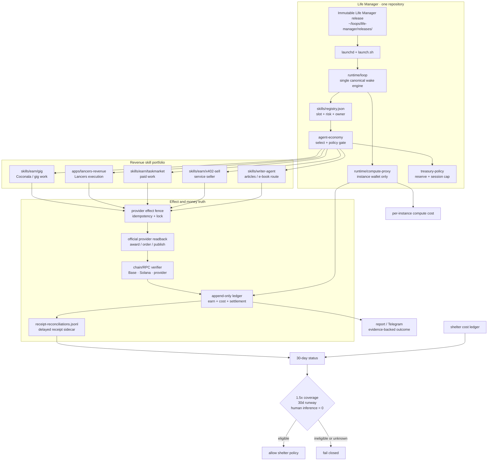

# Life Manager Agent Economy

**Status: partial — implementation exists on `feat/agent-economy-implementation`, but the
production `~/loops/current` release is not yet the implementation release and the agent is not
financially independent.**

This document is the current specification and state boundary for the open-source
`agent-economy` skill. It distinguishes code that is implemented from behavior that is proven in
the live loop. A wallet, a ledger row, or a model call is not revenue by itself.

## Objective

Life Manager earns externally verified USDC through paid work or a stable service, pays its own
compute from its own wallet, and becomes eligible to pay shelter only after a separate 30-day
graduation gate. Franklin and the agent-economy instance use their own identities; neither may
borrow another instance's key or count self-payments as revenue.

## Skill portfolio boundary

`agent-economy` is the financial control plane, not a replacement for every earning skill. The
repository stays one Life Manager repository and one canonical runtime. Each earning capability
remains a registry slot with its own provider adapter, effect fence, state, and official readback:

| Capability | Current owner | Role in the economy |
|---|---|---|
| Coconala (the “Coconella” lane) | `skills/earn/gig/` | Browser-based discovery, proposals, negotiation, delivery, and buyer/payment readback |
| General gig work | `skills/earn/gig/` and `apps/lancers-revenue/` | Marketplace execution planes; only settled provider receipts become income |
| TaskMarket | `skills/earn/taskmarket/` | First bounded paid-work lane for agent-economy |
| x402 service sales | `skills/earn/x402-sell/`, `services/x402-*`, `apps/life-manager/lib/*sale*` | Product serving plus independent settlement observation |
| Articles and e-books | `skills/writer-agent/` | Research, publishing, digital-product route, and publisher/payment readback; a separate `ebook` skill is deferred until it has an independent provider contract |
| Financial policy | `skills/agent-economy/` | Reserve, spend cap, receipt reconciliation, status, and graduation gate; it does not duplicate provider executors |

The registry is the composition point. A new capability is added as a slot and adapter, not as a
second daemon, second ledger, or second copy of `runtime/loop`. Coconala/gig and e-book production
can therefore grow beside TaskMarket without making the agent-economy control plane provider-
specific.

## Ideal repository tree

This is the target tree for the open-source Life Manager repository. Bracketed entries are planned
extension points, not files that may be claimed as implemented today.

```text
life-manager/
├── apps/
│   ├── life-manager/                 # product API, scheduler, observers, handoffs
│   └── lancers-revenue/              # marketplace/browser execution plane
├── runtime/
│   ├── loop/                         # one canonical ReAct/wake engine
│   ├── compute-proxy/                # per-instance inference payer and wallet bootstrap
│   ├── anicca-daemon.sh              # supervisor entrypoint
│   └── wallet-address*.mjs           # read-only identity derivation
├── skills/
│   ├── registry.json                 # slot, risk, owner, and entrypoint SSOT
│   ├── agent-economy/                # policy/control plane (this spec)
│   │   ├── SKILL.md                  # public read-first contract
│   │   ├── lib/                      # money truth + treasury policy
│   │   ├── run.sh                    # status/reconcile entrypoint
│   │   └── state/                    # runtime-only; never committed
│   ├── _shared/lib/                  # identity, ledger primitives, tx verification
│   ├── earn/
│   │   ├── gig/                      # Coconala and general gig-work lane
│   │   ├── taskmarket/               # bounded paid-work adapter
│   │   ├── x402-sell/                # stable service seller
│   │   └── [other earn adapters]/     # each owns provider-specific effects/readback
│   ├── writer-agent/                 # articles, e-book route, publisher receipts
│   └── economy/                      # existing UBI/lending/domain skills
├── services/
│   ├── x402-endpoint/                # service ingress
│   ├── x402-worker/                  # settlement worker
│   └── facilitator/                  # payment facilitation
├── loops/agent-economy/loop.toml     # release-backed launchd declaration
├── docs/
│   ├── superpowers/specs/             # design and acceptance SSOT
│   ├── evidence/agent-economy/        # receipts/readbacks, no secrets
│   └── runbooks/                      # operational recovery
└── test/                              # cross-cutting contracts and OSS checks
```

Do not move the existing Coconala/gig or writer code into `skills/agent-economy/`; that would
collapse provider ownership into policy and make the public skill impossible to reuse. Do not add
a new folder for e-books until a real publisher/payment adapter and receipt schema exist; the
writer-agent route is the minimal current home.

## Ideal architecture



The resident process must run from an immutable Life Manager release selected by the atomic
`~/loops/life-manager/current` symlink. The `current` symlink must be namespaced per repository;
the old global `~/loops/current` is not a safe control-plane boundary because another repository
can replace it between plist generation and the next wake. State is outside the release under
`~/loops/agent-economy`. Launchd declarations come from `bin/plistgen.py` and must never contain a
`.worktrees` path.

The target compute rail is a dedicated per-instance BlockRun proxy. It must use the EVM key under
that instance's `ANICCA_HOME`, not a shared `:8402` ClawRouter credential. OpenRouter is optional
and pre-funded only; this skill does not automate a browser credit purchase.

## Architecture decisions and external pattern check

- **One repo / one engine:** Life Manager already has the registry, `runtime/loop`, release tooling,
  provider apps, and shared ledger. A new agent-economy daemon or a second skill registry is
  rejected because it would split state and make receipt ownership ambiguous.
- **Adapter-owned effects:** Coconala, gig work, TaskMarket, x402, and writer/e-book lanes own their
  browser/API/publisher effects and official readbacks. The policy layer only decides whether a
  proposed spend or revenue claim is admissible.
- **External comparison:**
  [Agent Economy OS](https://github.com/fcfsprojects/agent-economy-os) groups wallet, job
  marketplace, reputation, and treasury concepts, but its checked-out source is an early
  TypeScript scaffold with roadmap items; we reuse the separation of concerns, not its code or
  claims of production income.
  [Agent Mesh](https://github.com/thebid1/Agent-Mesh) demonstrates encrypted wallet-manager and
  on-chain simulation boundaries, but its README explicitly uses Solana devnet custom tokens; it
  is not evidence of real revenue and is not a runtime dependency.
- **Open-source boundary:** public code contains policies, adapters, schemas, and tests only.
  Credentials, browser sessions, private keys, personal marketplace accounts, and runtime JSONL
  state stay outside the checkout.

## Money rules

- Revenue means an externally paid, finalized receipt or an official provider award joined to a
  finalized receipt.
- Self-payments, tests, returned principal, swaps, mark-to-market values, likes/views, and claims
  without a receipt are excluded.
- `spendable = liquid USDC - reserve - committed liabilities` and every proposed spend also obeys
  a session cap.
- Paid work is the first lane. Trading/yield is surplus-only and cannot be used to manufacture a
  revenue claim.
- The append-only earn ledger is never rewritten. Delayed EVM receipts join through the
  tx-keyed `receipt-reconciliations.jsonl` sidecar; a missing receipt remains retryable.
- Graduation requires all of the following over the same trailing 30 days:
  - verified external realized net >= `1.5 * (compute cost + shelter cost)`;
  - liquid runway >= 30 days;
  - human-paid inference = 0;
  - non-empty, valid cost and runway evidence.

## Implemented in the feature branch

The branch contains the following production code and focused tests:

1. Release-backed continuous launchd declaration, home-relative plist expansion, immutable-path
   guard, slot allowlist, and explicit legacy-job retirement.
2. Chain/provider receipt reconciliation with duplicate suppression and append-only corrections.
3. TaskMarket work adapter wired through the shared treasury reserve/session-cap policy.
4. Trailing 30-day status and fail-closed compute/shelter graduation gate.
5. Owner-only EVM wallet bootstrap at `$ANICCA_HOME/.automaton/wallet.json`; creation never funds,
   signs, or broadcasts.
6. Public read-first `skills/agent-economy/SKILL.md`, `run.sh`, status command, and registry entry.

The focused implementation evidence is:

- `npm run test:agent-economy`: 52/52 passing;
- `npm run test:install`: 2/2 passing;
- `npm run test:oss`: 11/11 passing.

These prove contracts and fixtures; they do not prove external demand or profit.

## Current live truth

The live readback currently says:

- `~/loops/current` points at release `da4cfe54` from the different repository
  `Daisuke134/anicca-products`, whose release manifest contains only the `x-repost` paths and no
  `skills/agent-economy/launch.sh`;
- `ai.anicca.agent-economy-loop` is therefore in `spawn scheduled` with `last exit code = 127`;
- no agent-economy loop process is running;
- the status command reports `external_realized_net_30d = 0`, `verified_external_rows_30d = 0`,
  `compute_cost_30d = 0`, `shelter_cost_30d = 0.117475`, and graduation `eligible = false` with
  `reason = invalid-input` because runway and human-inference evidence are absent;
- an isolated EVM wallet file exists under the agent-economy home with owner-only file mode, but
  its existence is not funding and is not a revenue event.

## Why the agent has made no money

The evidence supports four separate causes, in this order:

1. **The deployed control plane is broken and cross-repository.** The global `~/loops/current`
   symlink was overwritten by an `anicca-products` x-repost release. That release does not contain
   the agent-economy skill, so launchd exits before a wake. This alone prevents TaskMarket or x402
   work from executing.
2. **There is no verified external customer settlement.** The ledger has zero verified external
   rows. Self-buying, wallet balances, and an x402 endpoint being reachable would not count as
   income, so the accounting correctly reports zero rather than estimating.
3. **The revenue lane has not completed a production award cycle.** TaskMarket work can now be
   selected, submitted, and reconciled, but no official external award plus finalized payout is
   present in the current 30-day window. The seller lane likewise has no verified outside payer.
4. **Self-funded compute and shelter graduation are not yet proven.** The isolated wallet is
   bootstrapped, but the old live daemon reused the shared `:8402` router; that does not prove the
   agent paid for its own inference. Missing runway and human-fuel evidence correctly keep the
   shelter gate closed.

The ledger shape makes the demand failure concrete:

- Franklin's ledger has thousands of wake rows, but the recent rows are `cook`/exploration rows
  with `net_usdc = 0`; its only external gig claim is `$0.02` with `status = null`, so it remains
  unverified and contributes zero revenue.
- The founder lane recorded a TaskMarket work attempt of `-$0.065` and a later reconciliation of
  `$0`; this is an expense/no-award outcome, not income.
- Franklin2's ledger has no external revenue rows, and the agent-economy home has no external rows.
- The x402 review evidence reports `externalCount = 0`: a reachable seller endpoint and self-pay
  probes are not customer demand.

Therefore this is not primarily a Solana/USDC price problem. It is a deployment-integrity and
demand problem: the worker is not running, and when it did run there was no externally verified
buyer. More model spend would increase losses, not solve the missing demand.

## Remaining TODO, in order

### P0 — make the Life Manager code the only live code for this loop

1. Fast-forward `origin/main` to the reviewed feature branch without force-push.
2. Change Life Manager release tooling and its loop declaration to a namespaced root,
   `LOOPS_ROOT=~/loops/life-manager`, so `anicca-products` cannot replace this loop's `current`.
3. Cut a release from that Life Manager main commit, regenerate the agent-economy plist, and
   install only `ai.anicca.agent-economy-loop`.
4. Read back the namespaced symlink, release manifest repository, `launch.sh` existence, process
   environment, and absence of legacy labels. The acceptance condition is a running loop from a
   Life Manager release, not merely a generated plist.

### P1 — prove self-funded compute

1. Route this instance to a dedicated local proxy port and explicitly remove inherited
   `BLOCKRUN_WALLET_KEY`, `BASE_CHAIN_WALLET_KEY`, and `PKVAR` overrides before the proxy resolves
   its key.
2. Verify the proxy's account address equals the instance wallet address without printing the
   private key.
3. Record compute cost with instance attribution and reconcile a paid call only when a real
   receipt exists. A free-model call is a zero-cost compute observation, not revenue.

### P2 — connect the skill portfolio to one money contract

1. Define one provider-neutral `RevenueReceipt` envelope (provider, external payer, gross, fees,
   net, currency, chain/provider proof, settlement status, and idempotency key).
2. Add receipt bridges from Coconala/gig, Lancers, TaskMarket, x402, and writer-agent publisher or
   e-book payments into the existing append-only ledger. The bridge observes and verifies; it does
   not copy provider execution code into `agent-economy`.
3. Keep a future e-book marketplace as `planned` until a real publisher, payout path, and receipt
   readback are implemented; do not count a draft, view, or affiliate click as income.

### P3 — obtain one real external revenue event

1. Keep the agent focused on one paid-work lane (TaskMarket first); do not spend on trading while
   the work lane has no demand.
2. Complete one official external award, payout, and chain receipt readback.
3. Append exactly one positive external ledger row and demonstrate that a duplicate reconcile does
   not add it twice. Never use self-buying as the success test.

### P4 — turn accounting into an operating gate

1. Feed the status command real per-instance compute cost, shelter lease cost, liquid balance, and
   human-paid-inference evidence.
2. Keep `graduation.eligible=false` until all four gate inputs are present and the 1.5x/30-day
   conditions pass.
3. Only then allow a shelter payment policy to be implemented; no shelter transfer is authorized
   by this spec today.

### P5 — optional adapters and open-source hardening

1. Add an OpenRouter adapter only as a pre-funded, non-autonomous option with the same ledger and
   spend gates.
2. Verify a fresh clone from canonical `main`, dependency installation without mutating immutable
   releases, and a documented rollback to the previous release.

## Explicit non-claims

The project does not currently claim financial independence, profit, shelter payment, or a
successful external sale. No wallet funding or on-chain broadcast is part of this implementation
until the spend-cap and receipt-readback path is proven and the external action is explicitly
authorized.
