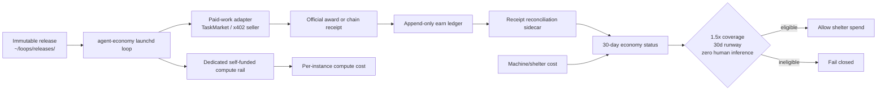

# Life Manager Agent Economy

**Status: partial — implementation exists on `feat/agent-economy-implementation`, but the
production `~/loops/current` release is not yet the implementation release and the agent is not
financially independent.**

This document is the current specification and state boundary for the open-source
`agent-economy` skill. It distinguishes code that is implemented from behavior that is proven in
the live loop. A wallet, a ledger row, or a model call is not revenue by itself.

## Objective

Life Manager earns externally verified USDC through paid work or a stable service, pays its own
compute from its own wallet, and becomes eligible to pay shelter only after a separate 30-day
graduation gate. Franklin and the agent-economy instance use their own identities; neither may
borrow another instance's key or count self-payments as revenue.

## Target architecture

The resident process must run from an immutable release selected by the atomic
`~/loops/current` symlink. State is outside the release under `~/loops/agent-economy`. Launchd
declarations come from `bin/plistgen.py` and must never contain a `.worktrees` path.

The target compute rail is a dedicated per-instance BlockRun proxy. It must use the EVM key under
that instance's `ANICCA_HOME`, not a shared `:8402` ClawRouter credential. OpenRouter is optional
and pre-funded only; this skill does not automate a browser credit purchase.

## Money rules

- Revenue means an externally paid, finalized receipt or an official provider award joined to a
  finalized receipt.
- Self-payments, tests, returned principal, swaps, mark-to-market values, likes/views, and claims
  without a receipt are excluded.
- `spendable = liquid USDC - reserve - committed liabilities` and every proposed spend also obeys
  a session cap.
- Paid work is the first lane. Trading/yield is surplus-only and cannot be used to manufacture a
  revenue claim.
- The append-only earn ledger is never rewritten. Delayed EVM receipts join through the
  tx-keyed `receipt-reconciliations.jsonl` sidecar; a missing receipt remains retryable.
- Graduation requires all of the following over the same trailing 30 days:
  - verified external realized net >= `1.5 * (compute cost + shelter cost)`;
  - liquid runway >= 30 days;
  - human-paid inference = 0;
  - non-empty, valid cost and runway evidence.

## Implemented in the feature branch

The branch contains the following production code and focused tests:

1. Release-backed continuous launchd declaration, home-relative plist expansion, immutable-path
   guard, slot allowlist, and explicit legacy-job retirement.
2. Chain/provider receipt reconciliation with duplicate suppression and append-only corrections.
3. TaskMarket work adapter wired through the shared treasury reserve/session-cap policy.
4. Trailing 30-day status and fail-closed compute/shelter graduation gate.
5. Owner-only EVM wallet bootstrap at `$ANICCA_HOME/.automaton/wallet.json`; creation never funds,
   signs, or broadcasts.
6. Public read-first `skills/agent-economy/SKILL.md`, `run.sh`, status command, and registry entry.

The focused implementation evidence is:

- `npm run test:agent-economy`: 52/52 passing;
- `npm run test:install`: 2/2 passing;
- `npm run test:oss`: 11/11 passing.

These prove contracts and fixtures; they do not prove external demand or profit.

## Current live truth

The live readback currently says:

- `~/loops/current` points at release `c3497d11`, which is an `origin/main` release without
  `skills/agent-economy/launch.sh`;
- `ai.anicca.agent-economy-loop` is therefore in `spawn scheduled` with `last exit code = 127`;
- no agent-economy loop process is running;
- the status command reports `external_realized_net_30d = 0`, `verified_external_rows_30d = 0`,
  `compute_cost_30d = 0`, `shelter_cost_30d = 0.117475`, and graduation `eligible = false` with
  `reason = invalid-input` because runway and human-inference evidence are absent;
- an isolated EVM wallet file exists under the agent-economy home with owner-only file mode, but
  its existence is not funding and is not a revenue event.

## Why the agent has made no money

The evidence supports four separate causes, in this order:

1. **The deployed control plane is broken.** The current release does not contain the new skill,
   so launchd exits before a wake. This alone prevents TaskMarket or x402 work from executing.
2. **There is no verified external customer settlement.** The ledger has zero verified external
   rows. Self-buying, wallet balances, and an x402 endpoint being reachable would not count as
   income, so the accounting correctly reports zero rather than estimating.
3. **The revenue lane has not completed a production award cycle.** TaskMarket work can now be
   selected, submitted, and reconciled, but no official external award plus finalized payout is
   present in the current 30-day window. The seller lane likewise has no verified outside payer.
4. **Self-funded compute and shelter graduation are not yet proven.** The isolated wallet is
   bootstrapped, but the old live daemon reused the shared `:8402` router; that does not prove the
   agent paid for its own inference. Missing runway and human-fuel evidence correctly keep the
   shelter gate closed.

Therefore this is not primarily a Solana/USDC price problem. It is a deployment-integrity and
demand problem: the worker is not running, and when it did run there was no externally verified
buyer. More model spend would increase losses, not solve the missing demand.

## Remaining TODO, in order

### P0 — make the committed code the live code

1. Fast-forward `origin/main` to the reviewed feature branch without force-push.
2. Cut a new release from that main commit, regenerate the agent-economy plist, and install only
   `ai.anicca.agent-economy-loop`.
3. Read back `launchctl print`, the release symlink, `launch.sh` existence, process environment,
   and the absence of legacy labels. The acceptance condition is a running loop, not merely a
   generated plist.

### P1 — prove self-funded compute

1. Route this instance to a dedicated local proxy port and explicitly remove inherited
   `BLOCKRUN_WALLET_KEY`, `BASE_CHAIN_WALLET_KEY`, and `PKVAR` overrides before the proxy resolves
   its key.
2. Verify the proxy's account address equals the instance wallet address without printing the
   private key.
3. Record compute cost with instance attribution and reconcile a paid call only when a real
   receipt exists. A free-model call is a zero-cost compute observation, not revenue.

### P2 — obtain one real external revenue event

1. Keep the agent focused on one paid-work lane (TaskMarket first); do not spend on trading while
   the work lane has no demand.
2. Complete one official external award, payout, and chain receipt readback.
3. Append exactly one positive external ledger row and demonstrate that a duplicate reconcile does
   not add it twice. Never use self-buying as the success test.

### P3 — turn accounting into an operating gate

1. Feed the status command real per-instance compute cost, shelter lease cost, liquid balance, and
   human-paid-inference evidence.
2. Keep `graduation.eligible=false` until all four gate inputs are present and the 1.5x/30-day
   conditions pass.
3. Only then allow a shelter payment policy to be implemented; no shelter transfer is authorized
   by this spec today.

### P4 — optional adapters and open-source hardening

1. Add an OpenRouter adapter only as a pre-funded, non-autonomous option with the same ledger and
   spend gates.
2. Verify a fresh clone from canonical `main`, dependency installation without mutating immutable
   releases, and a documented rollback to the previous release.

## Explicit non-claims

The project does not currently claim financial independence, profit, shelter payment, or a
successful external sale. No wallet funding or on-chain broadcast is part of this implementation
until the spend-cap and receipt-readback path is proven and the external action is explicitly
authorized.
