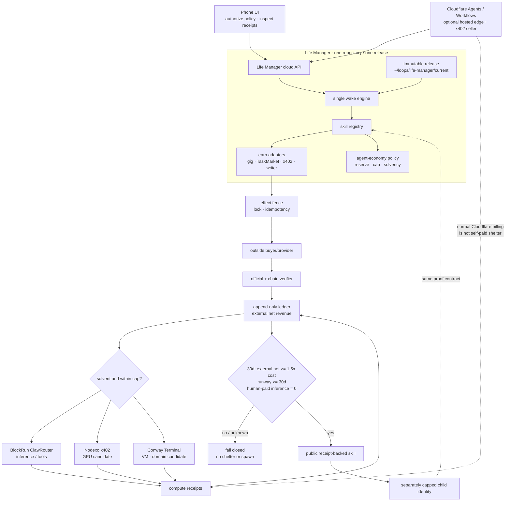

# Life Manager Agent Economy

**Status: P0-P2 complete; P3 implementation/review/release complete but its live paid receipt is pending; P4-P6 open.**
The natural `ai.anicca.agent-economy-loop` owner is loaded from sealed release
`20260827T175256-22a86ec1`, and the canonical journal contains one chain-verified outside x402
receipt with replay-zero. The release is currently completing its dependency-manifest launch
preflight before the dedicated `:8422` proxy starts. No self-funded compute, shelter, 30-day graduation, or
financially independent Life Manager instance has been proven. “The world's first financially independent AI” is neither a current
claim nor an unqualified graduation claim: Spore.fun is a material prior example of agent-funded
compute and replication. Life Manager must describe the narrower receipt-backed result it proves.

This document is the current mission, implementation, graduation, and TODO SSOT for the open-source
`agent-economy` skill. It supersedes the Agent Economy mission/live-money/provider sections of
`2026-07-19-anicca-one-repo-consolidation-spec.md`; that document remains historical evidence and
the program-wide portable-runtime specification remains independently authoritative. The result is
one Life Manager repository, one runtime, one ledger contract, and one proof standard. A wallet, a
ledger row, a model call, a published article, or a process PID is not revenue.

## Objective

Life Manager closes this externally verifiable loop without an operator action between selection
and settlement:

1. earn through a permitted skill;
2. verify the outside payer and append net revenue once;
3. pay its own inference/compute from the same economic identity;
4. pay its own VM/domain shelter only after a 30-day graduation gate;
5. publish the reusable skill and, only after graduation, create a separately capped child.

The long-term user experience is phone-only: the user authorizes policy and sees evidence from a
phone while the durable agent runs in the cloud. The current Mac runtime is a bootstrap and
development environment, not a permanent product dependency.

## Naming and product decision

- **Life Manager** remains the public product, repository, and monorepo. It already owns consumer
  wellbeing, the runtime, revenue skills, receipts, and the user-facing application.
- **Agent Economy** is the financial layer and public skill inside Life Manager.
- **Agora** may be used as a narrative or research codename for the future agent society. It must
  not become another repository, daemon, ledger, or competing product name.
- **Franklin** is an upstream BlockRun economic agent and integration target. Life Manager extends
  its spend capability with earn, reconcile, reserve, and graduation contracts; it does not claim
  to have invented Franklin or fork it by default.
- **ClawRouter** is BlockRun's current product name. “Cloud Router” is not used as a product name.

This preserves one clear open-source installation and makes the public thesis concrete: consumer
AI plus crypto rails, where useful work funds the agent instead of a permanent human subsidy.

## Acceptance criteria

The objective is complete only when one production instance satisfies every row.

| ID | Acceptance criterion | Required evidence |
|---|---|---|
| AC-1 | One immutable Life Manager release owns the running loop | namespaced release symlink, manifest commit/repository, loaded plist arguments, running process readback |
| AC-2 | One outside buyer pays for permitted work | official award/order plus finalized provider or chain receipt identifying an outside payer |
| AC-3 | Accounting is append-only, signed-net, and replay-zero | canonical receipt identity, verifier result, one ledger contribution, second reconcile adds zero |
| AC-4 | The same instance pays for a real inference/compute call from its accepted external earnings | wallet/address match, balance conservation excluding seed/top-up/subsidy, x402/provider settlement, service response, cost ledger row |
| AC-5 | The same instance pays for usable shelter from accepted external earnings | balance conservation excluding seed/top-up/subsidy, provider settlement, VM/domain readback, workload health, termination/renewal receipt |
| AC-6 | No operator executes the earning-to-settlement path | durable event trace contains no manual execution step; policy approval and legally required identity remain explicit boundaries |
| AC-7 | Graduation remains true for 30 trailing days | external realized net >= 1.5x compute+shelter, 30-day runway, human-paid inference = 0, all inputs non-empty |
| AC-8 | A fresh clone reproduces the public control plane | canonical `main`, clean install, focused/OSS tests, isolated secrets/state, rollback readback |
| AC-9 | Public claims match receipts | article/dashboard link to redacted evidence and retain unknown/zero states without estimates |
| AC-10 | Replication cannot create hidden liabilities | separately derived child identity, explicit seed/cap, no key reuse, no self-payment counted as revenue, parent remains solvent |

No individual row, including AC-2, is sufficient to claim financial independence.

## As-is / To-be

| Concern | As-is | To-be |
|---|---|---|
| Repository | feature code is isolated from a heavily advanced `origin/main` | one reviewed Life Manager `main`; no profitable-cloud or Agora runtime repository |
| Release | `~/loops/life-manager/current` is a sealed release and `previous` is a validated rollback target | preserve atomic cuts, bounded retention, and clean-clone reproduction |
| Process | `ai.anicca.agent-economy-loop` naturally runs the pinned Life Manager `runtime/loop/index.mjs` | keep one owner healthy and retire remaining legacy earning owners only through explicit cutover |
| Revenue | one outside x402 transfer is chain-verified and contributes 0.003 USDC once; replay contributes zero | reproduce additional outside sales through the resident lane and keep unverified providers at zero |
| Compute | prior runtime could inherit a shared router/key | per-instance wallet and proxy port; BlockRun receipt joins the cost ledger |
| Shelter | historical Nosana evidence exists, but no graduated current lease | a capped Conway VM/domain or Nodexo compute canary proves pay → provision → use → terminate |
| Control plane | local Mac and mixed provider scripts | Life Manager remains SSOT; Cloudflare is an optional hosted edge, not the money SSOT |
| Publication | useful build logs exist, while the live dashboard remains zero | publish the honest build log now and the success case only after AC-1 through AC-9 |
| Replication | vision only | one graduated parent creates a capped, separately accountable child and preserves replay-zero |

## Skill portfolio boundary

`agent-economy` is the financial control plane, not a replacement for every earning skill. Each
capability remains a registry slot with its own provider adapter, effect fence, state, and official
readback.

| Capability | Current owner | Role in the economy |
|---|---|---|
| Coconala and general gig work | `skills/earn/gig/`, `apps/lancers-revenue/` | discovery, proposal, execution, delivery, and marketplace payout readback |
| TaskMarket | `skills/earn/taskmarket/` | first bounded paid-work experiment |
| x402 service sales | `skills/earn/x402-sell/`, `services/x402-*` | programmatic service sale and independent settlement observation |
| Articles and e-books | `skills/writer-agent/` | publication and publisher/payment readback; no separate e-book skill until a distinct provider contract exists |
| Financial policy | `skills/agent-economy/` | reserve, caps, receipt reconciliation, costs, status, and graduation; never provider execution |

A new lane is a registry slot and adapter, not a daemon, ledger, or copy of `runtime/loop`.
Coconala/gig, TaskMarket, x402, writer, and future product sales share the same `RevenueReceipt`
contract while retaining provider ownership.

## Target repository tree

Bracketed entries are planned extension points, not implemented claims.

```text
life-manager/
├── apps/
│   ├── life-manager/                 # product API, scheduler, observers, handoffs
│   └── lancers-revenue/              # marketplace/browser execution plane
├── runtime/
│   ├── loop/                         # one canonical wake engine
│   ├── compute-proxy/                # per-instance inference payer
│   └── anicca-daemon.sh              # supervisor entrypoint
├── skills/
│   ├── registry.json                 # slot, risk, owner, entrypoint SSOT
│   ├── agent-economy/                # policy/control plane
│   ├── _shared/lib/                  # identity, ledger, receipt verification
│   ├── earn/{gig,taskmarket,x402-sell}/
│   └── writer-agent/                 # articles and e-book route
├── services/{x402-endpoint,x402-worker,facilitator}/
├── loops/agent-economy/loop.toml     # release-backed launchd declaration
├── docs/{superpowers,evidence,runbooks}/
└── test/                              # cross-cutting contracts and OSS checks
```

Do not move provider executors into `skills/agent-economy/`. Do not add a repository or folder for
a future idea before a real provider, effect contract, and receipt readback exist.

## Whole-system architecture



The old global `~/loops/current` is not a control-plane boundary. Another repository can replace
it between plist generation and the next wake. State remains outside releases under
`~/loops/agent-economy`; launchd declarations come from `bin/plistgen.py` and reject `.worktrees`.

## Provider and ecosystem decisions

The following capability/status observations were checked on 2026-08-26. The chosen design
composes specialist rails instead of replacing the Life Manager runtime.

| System | Verified current capability | Decision and boundary |
|---|---|---|
| BlockRun ClawRouter | wallet-native model/tool routing through x402 | primary inference and service-spend rail; dedicated instance wallet/port; not an earnings verifier |
| BlockRun Modal Sandbox | x402-paid isolated Python and longer CPU/GPU runtime | first ephemeral job-compute canary and BlockRun integration proof; a maximum-24-hour runtime is not 30-day shelter |
| BlockRun Franklin | open-source agent that can hold a wallet and spend toward outcomes | upstream integration and contribution target; extend with Life Manager earn/reconcile contracts, do not fork by default |
| Conway Terminal/API | successor API returns live health and x402 v2 payment requirements; the old Cloud Beta is deprecated | provisional shelter rail through a small adapter + capped canary; do not depend on the stale public Terminal package or replace the Life Manager runtime |
| Nodexo | live GPU inventory and accountless Base USDC x402 `upto` rental | provisional direct-x402 GPU rail after capped pay/provision/SSH/terminate canary |
| Clore.ai | cheaper marketplace GPU listings with crypto payments | price fallback; account/API-key dependency means it is not the primary autonomous rail |
| Nosana | known crypto GPU provider, but sampled 4090/A100/H100 inventory was unavailable | retain as fallback/history until a current end-to-end canary beats it |
| AgentMetal | public example of an agent buying an x402 server and receiving SSH | shelter fallback/prior-art reference; still requires independent current canary and receipts |
| Cloudflare Agents/Workflows/x402 | durable agent state, retries, paid MCP/API seller tools | optional hosted edge/control and revenue surface; Cloudflare's own bill is not payable by agent x402 today |
| Spheron | crypto GPU marketplace; likely the provider remembered from X | not selected: current public x402 endpoint/repository was not verified in this audit |

Implementation compatibility matters:

- Cloudflare's current Agents MCP helper uses EVM `exact`; Nodexo rental uses HTTP x402 v2
  `upto`. The Nodexo adapter must use its public CLI pattern or `@x402/fetch` with
  `UptoEvmScheme`, not Cloudflare's MCP wrapper.
- Cloudflare's default client cap of 0.10 USDC is below a one-hour Nodexo RTX 4090 snapshot. A
  provider-specific cap must be explicit; no library default may silently widen it.
- Conway's old `app.conway.tech` Beta no longer accepts signups and says it will shut down on
  2026-10-01. The successor API is live, but public Conway Terminal 2.0.9 parses x402 v2 while its
  distributed payment payload fixes `x402Version: 1`. Life Manager must integrate the current API
  contract directly and prove it with a canary rather than adopting that package as production
  infrastructure.
- Conway and Nodexo are candidates until a real settlement, provisioned resource, health check,
  and termination receipt are joined. A landing page, health endpoint, or GitHub repository is
  not provider proof.
- Cloudflare is useful for phone-to-cloud durability and paid service distribution, but prepaid or
  card-funded Cloudflare billing cannot satisfy AC-5.

### Primary sources checked

| Source | URL | Core statement used |
|---|---|---|
| BlockRun | https://blockrun.ai/ | “Every AI model. One API. Pay per call.” |
| ClawRouter | https://blockrun.ai/clawrouter | “sits between your agent and the AI models it calls” |
| BlockRun Modal | https://blockrun.ai/services/modal | isolated runtimes paid per run with x402 |
| Franklin | https://blockrun.ai/signal/franklin-open-source-ai-agent-pays-usdc-base | “hold a wallet, price its own actions, spend toward an outcome” |
| Conway Docs | https://docs.conway.tech/ | agents can buy cloud resources with stablecoins and no provider API keys |
| Conway health | https://conway.tech/api/health | live API returned HTTP 200 during this audit |
| Conway Cloud Beta | https://app.conway.tech/ | “deprecated and is no longer accepting new user sign ups” |
| Automaton issue 300 | https://github.com/Conway-Research/automaton/issues/300 | reported $0 revenue and $39.26 AI cost after 14 days |
| Cloudflare Agents | https://developers.cloudflare.com/agents/ | durable identity, local SQL, schedules, and recoverable execution |
| Cloudflare x402 | https://developers.cloudflare.com/agents/tools/payments/x402/ | clients pay programmatically without accounts or API keys |
| Nodexo inventory | https://www.nodexo.ai/inventory | capped x402 is offered for accountless rental |
| Clore pricing | https://docs.clore.ai/guides/getting-started/pricing | crypto GPU marketplace pricing and renter fees |
| Nosana | https://www.nosana.com/ | live GPU price and availability catalogue |
| Spore in the Wild | https://arxiv.org/html/2506.04236v1 | agent treasury paid TEE rental and produced multiple offspring |
| AgentMetal | https://agentmetal.dev/blog/rent-a-server-as-an-ai-agent/ | an agent buys an x402 server and receives SSH |
| YC Requests for Startups | https://www.ycombinator.com/rfs | current RFS includes consumer AI and crypto for agentic commerce |

Prices, inventory, model counts, and service availability are snapshots. Selection is based on a
capped canary and receipts, not a marketing number copied into code.

### Compute price snapshot

The 2026-08-26 read-only snapshot answers the Nosana replacement question but is not a fixed
pricing contract.

| Provider | Comparable observation | x402 | Decision |
|---|---|---|---|
| Clore.ai | RTX 4090 median about $0.208/h; observed minimum $0.10/h | no | cheapest observed fallback, but account/API-key friction |
| Nodexo | RTX 4090 $0.31/h with available inventory | Base USDC `upto` | primary direct-x402 GPU candidate |
| Nosana | RTX 4090 $0.32/h with sampled availability 0/51 | not verified | no current price/availability advantage |
| Spheron | RTX 4090 $0.53/h | current public endpoint not verified | likely remembered X post, not current primary |
| x402Compute | GPU prices higher; 1 GB CPU VPS about $0.009/h | direct x402 | CPU shelter fallback, not GPU choice |

The decision is **Nodexo for autonomous direct-x402 GPU and Clore for price fallback**. Cheaper
headline price alone does not outweigh an unverifiable settlement or unavailable machine.

### Prior art and defensible differentiation

Unqualified “world first” language is rejected. The closest verified prior-art candidates do not
close the same loop, but they invalidate the broad claim.

| Project | Earn | Self-pay | Shelter | Replication | Gap relative to Life Manager target |
|---|---|---|---|---|---|
| Spore.fun | token-market treasury | Phala TEE compute | TEE runtime | multiple offspring reported | not outside-customer product/service receipts; current live status is unclear |
| Conway Automaton | no bundled repeatable revenue lane | credits/x402 | Conway resources | lifecycle code exists | mutable-main child clone, no chain/provider receipt schema, official report recorded $0 revenue |
| Franklin | wallet-native USDC spend | inference/tools | not proven | not proven | spend client, not earn/reconcile/graduation system |
| AgentMetal | none shown | x402 server purchase | VM + SSH | sibling provision possible | shelter rail, not a profitable autonomous loop |
| Olas / Virtuals | protocol service/token commerce | protocol settlement | individual shelter not proven | protocol-level scale | not the same open-source per-instance cost/revenue proof |

The defensible target is: **an open-source consumer agent with multiple permitted external-customer
revenue lanes whose receipts fund continuing compute and shelter under an append-only ledger, and
whose separately capped child preserves the same proof.** Even this phrasing requires a final
prior-art audit before publication.

## Money, identity, and autonomy rules

- Revenue is an externally paid, finalized receipt or an official outside-provider award joined
  to its finalized payout.
- Self-payments, tests, returned principal, swaps, mark-to-market values, token yield principal,
  likes/views, article drafts, and unverified claims contribute zero revenue.
- Human top-ups, bootstrap seed, grants restricted to spend, and parent-to-child transfers are
  recorded as non-revenue funding/liabilities. The conserved balance equation must show that the
  paid-compute amount is covered by accepted outside net after all earlier costs; address equality
  alone is insufficient.
- `spendable = liquid assets - reserve - committed liabilities`; every spend also obeys an
  instance, session, provider, and asset cap.
- Paid work and service sales precede trading/yield. Trading and yield are surplus-only and may
  never manufacture a graduation event.
- Each parent and child has a distinct identity, wallet, state root, proxy port, and cost ledger.
  Keys and receipts are never borrowed across instances.
- A receipt is admissible only after chain/provider, sender or payer, asset/contract, recipient,
  signed amount, fee, idempotency key, and terminal status are checked.
- The ledger is append-only and signed-net. One canonical receipt contributes once; negative
  realized rows remain in the same period, and delayed evidence joins through a reconciliation
  sidecar rather than rewriting history.
- “No human in the loop” means no operator action performs selection, execution, delivery,
  settlement, or reconciliation. Initial policy authorization, KYC, identity, interview,
  attendance, voice, irreversible personal spending, and legally required consent remain human
  boundaries. The agent rejects work requiring it to impersonate a person.
- Spawn is a gated economic action. A child receives only an explicit recoverable seed inside the
  parent's surplus; neither the seed nor child self-payment counts as outside revenue.

## Implemented in the feature branch

The branch contains production code and focused tests for:

1. a release-backed launchd declaration, home-relative expansion, immutable-path guard, slot
   allowlist, and legacy-job retirement;
2. chain/provider receipt reconciliation with duplicate suppression and append-only corrections;
3. a TaskMarket adapter behind shared reserve and session-cap policy;
4. trailing 30-day status and a fail-closed compute/shelter graduation gate;
5. owner-only EVM wallet bootstrap under `$ANICCA_HOME/.automaton/wallet.json`; creation does not
   fund, sign, or broadcast;
6. public `skills/agent-economy/SKILL.md`, `run.sh`, status command, and registry entry.

Earlier branch evidence recorded 52/52 agent-economy tests, 2/2 install tests, and 11/11 OSS
tests. Those results predate the current `origin/main` divergence and must be rerun after
integration. They prove contracts and fixtures, not demand, profit, or live deployment.

A 2026-08-26 rerun in the recreated feature worktree passed 40 of 42 discovered focused tests;
the two failures stopped at module loading because the declared `viem` dependency is not installed
in this worktree. Install and OSS suites were not run after that failure. This is a dependency-
provenance/preflight failure, not a current green test result, and P0 must close it without
symlinking dependencies from another worktree.

## Current live truth

Read-only inspection on 2026-08-26 observed:

- the feature worktree is clean before this spec change, but is 1,167 commits behind and 21
  commits ahead of `origin/main`;
- `/Users/anicca/loops/current` points to
  `/Users/anicca/loops/releases/20260825T183649-2ed408d2`, not a namespaced Life Manager release;
- no `/Users/anicca/loops/life-manager/current` exists;
- `ai.anicca.agent-economy-loop` is `spawn scheduled`, has 1,757 runs, and last exit code 127;
- its loaded program is `/bin/bash /Users/anicca/loops/current/skills/agent-economy/launch.sh`,
  which is absent from the selected release; the error log repeats “No such file or directory”;
- the data volume has about 2.4 GiB free and reports 99% utilization, so release/dependency work
  requires a disk preflight;
- the recreated worktree has no `node_modules/viem`, even though `viem` is declared in
  `package.json` and the lockfile;
- a historical outside buyer paid $0.01 to the Railway x402 seller wallet and replay-zero was
  recorded, but that wallet is not the target Life Manager/Franklin/tenant instance; attributable
  verified external net for the target instance remains $0.00;
- no graduated shelter receipt has been produced.

The unparameterized status command also currently errors because its ledger path is undefined. It
must fail with an actionable usage/configuration error, but that local failure must not be
misreported as a valid zero-value status readback.

The immediate cause of zero income for the target instance is therefore twofold: its natural
worker cannot start from the loaded release, and no outside buyer receipt is attributable to its
identity. The historical seller receipt proves a rail, not this instance's self-funding. More
model or trading spend cannot repair either fact.

## Publication, BlockRun, and YC strategy

Existing material should be refined rather than duplicated:

- `docs/articles/2026-06-21-automaton-pays-for-itself.md` is the honest English experiment: 68.7
  hours, 351 decisions, zero profitable decisions, public endpoint, and no buyers.
- `docs/articles/how-to-make-a-financially-independent-ai-ja.md` plus its deck explains the
  Japanese thesis.
- `docs/evidence/agent-economy/2026-07-28-publication-audit-ja.md` records that verified external
  revenue was zero and graduation was not reached.
- `docs/agent-economy.md` and `.ja.md` already present the public earn-layer architecture.

The single recommended article is:

> **Franklin Can Spend. We're Teaching It to Earn: Closing the Loop with Life Manager + BlockRun**

Japanese title:

> **Franklin は支払える。Life Manager はそこに「稼ぐ」を足す——自分の compute と shelter を自分で払う agent への道**

Publish it first as a build log with zero/failure evidence. The graduation sequel is published
only after AC-1 through AC-9 and can use the stronger title “We Made Franklin Earn and Pay Its Own
Way.” AC-10 is separately required before claiming replication. Do not republish the old article
as a new success claim.

The shortest path to BlockRun is not article volume. It is:

1. build on the already merged Franklin PR #99 and the quality signal from blockrun-mcp PR #82;
2. contribute a small upstream integration or reproducible receipt fixture;
3. publish one benchmark/cost case study that links outside revenue to BlockRun spend;
4. show a live replay-zero demo and its honest limits;
5. use the same narrow proof in BlockRun outreach and a YC application.

This matches BlockRun's current hiring signal for technical tutorials, benchmarks, cost-saving
case studies, OSS adoption, and evidence of what was shipped or saved. YC's large consumer-AI and
crypto thesis is aligned, but the application must lead with one payer and one closed loop rather
than “agent civilization” alone.

### Event watch — observed 2026-08-26

| Status | Event | Time and place | Action |
|---|---|---|---|
| upcoming; approval required | Building the Agentic Economy with Fireblocks, Circle & Blockrun | 2026-08-27 18:00–20:30 EDT, Fireblocks HQ, 5 Pennsylvania Plaza, New York; https://luma.com/lon7mu2d | prepare PRs, one-page architecture, honest dashboard, and demo; registration is not performed by this spec |
| upcoming; virtual, exact dates need organizer readback | X-Agent AI MCP Hackathon | page currently shows 2026-08-28–10-03; https://luma.com/h0qt02e4 | paid-call/MCP monetization lane; verify final schedule before commitment |
| challenge page live; submission opens in September | Algorand Global x402 Challenge | usage window begins in early October; https://algorand.co/global-x402-challenge | high fit because a real mainnet settlement and usage are required |
| upcoming; approval required | TrueFoundry Agent Harness Hackathon | 2026-09-19, South Bay; https://luma.com/truefoundry-agent-harness-hackathon-sep19-2026 | lower priority than x402 proof; attend only with a working receipt demo |
| upcoming; approval required | gm AI v2, co-hosted by BlockRun | 2026-10-08, Singapore; https://luma.com/xkjrrfhe | second direct BlockRun contact after the NYC event |
| past | x402 Developer Sessions + Meetup | 2026-04-02, New York; https://luma.com/x3q6zpkw | use talks/attendee graph for follow-up research only |
| past; online | USDC OpenClaw Hackathon Winner Spotlight: ClawRouter | 2026-03-20; https://community.arc.io/en/public/events/usdc-openclaw-hackathon-winner-spotlight-clawrouter-by-blockrunai-tstqae2ka9 | study the winning ClawRouter demo pattern |

No current public Conway event was found across its official site, GitHub, and indexed event
pages. A Conway event is not added until its organizer page and future date are both verified.

## Test matrix

| Test | Layer | Pass condition | Prevents |
|---|---|---|---|
| release ownership readback | runtime integration | symlink, manifest, loaded args, and executable resolve to one immutable Life Manager release | cross-repo overwrite and exit 127 |
| receipt verifier fixture | unit/integration | correct payer/asset/recipient/amount/status accepted; unrelated/self transfer rejected | false revenue |
| duplicate plus signed-net period | unit | repeated receipt adds zero; positive and negative rows produce correct net | inflated graduation |
| wallet/key isolation | integration | proxy account equals instance public address; inherited key overrides are absent | cross-instance spend |
| outside paid-work cycle | provider E2E | award → execution → delivery → finalized payout → ledger | local PASS mistaken for demand |
| BlockRun paid call and funds conservation | provider E2E | beginning balance + accepted outside inflow - known costs = ending balance; no seed/top-up/subsidy covers the settled call | shared, free, or human-funded compute claim |
| Nodexo capped canary | provider E2E | externally earned balance → capped x402 → SSH → workload → terminate → receipt and conserved balance | price page or subsidy mistaken for compute |
| Conway shelter canary | provider E2E | externally earned balance → capped x402 → VM/domain → health → terminate/renew → receipt and conserved balance | landing page or top-up mistaken for shelter |
| autonomy trace audit | system/E2E | selection through reconciliation has durable events and no operator execution step | hidden human execution mislabeled autonomous |
| 30-day graduation | system | all inputs present, net coverage and runway pass, human-paid inference zero | fail-open shelter/spawn |
| replay-zero | system | rerun performs no duplicate provider effect and adds no duplicate ledger value | repeated external action |
| child isolation | system/security | child cannot read parent key/state, seed is a liability/transfer not revenue, parent remains solvent | circular funding and shared identity |
| fresh clone and rollback | OSS/release | clean install/tests, no secrets/state, previous release restored by atomic pointer | non-reproducible public skill |
| claim/dashboard audit | publication | every success metric joins evidence; unknown remains unknown | misleading outreach |

### E2E judgment

This slice has no new iOS UI or user flow, so Maestro is not required. Runtime and provider E2E are
mandatory because the value exists only in external effects and readbacks. Unit tests, launchd
liveness, Telegram, a wallet balance, or an agent-generated message cannot substitute for the
provider E2E rows above.

## Boundaries

### In scope

- the one-repository runtime, registry, receipt, treasury, compute, shelter, graduation, and
  publication contracts;
- existing Coconala/gig, TaskMarket, x402 seller, writer/e-book route, and future product sales as
  adapters;
- Cloudflare, BlockRun, Conway, and direct-x402 provider adapters behind one ledger;
- cloud-hosted operation with phone-based authorization and evidence views;
- capped post-graduation replication with distinct identities.

### Out of scope until separately authorized or proven

- splitting Agora, Franklin, profitable-cloud, or agent-economy into another repository/runtime;
- claiming completion, profit, “world first”, revenue, shelter, or scale without receipts;
- automated recovery, KYC, interviews, attendance, voice, identity impersonation, or personal
  account/wallet spending;
- self-buying, wash transactions, token emissions, or child/parent transfers counted as revenue;
- trading/yield before a stable external revenue lane and surplus gate;
- replacing Life Manager with Automaton or treating Cloudflare billing as x402-paid shelter;
- uncontrolled spawning, shared keys, uncapped liabilities, or circular funding.

## Execution steps and remaining TODO

### P0 — complete: safe accounting and identity base

1. [x] Free sufficient disk headroom without deleting protected session/state stores; record the
   preflight before dependency or release work.
2. [x] Integrate current `origin/main` into the feature branch without force-push, resolve by keeping
   one canonical runtime/spec, and rerun the focused, install, and OSS suites.
3. [x] Extend receipt verification to chain/provider, payer, asset/contract, recipient, signed net,
   fee, amount, transfer log, and terminal status.
4. [x] Add duplicate, positive-plus-negative, unrelated transfer, self-payment, and missing-proof
   regression tests.
5. [x] Remove inherited `PKVAR`, `BLOCKRUN_WALLET_KEY`, and `BASE_CHAIN_WALLET_KEY` overrides before
   key resolution; prove only the public address.
6. [x] Reject worktree paths in `plistgen.py` at generation time.

**Exit:** all money-safety tests pass after main integration; no live spend is enabled.

### P1 — complete: immutable Life Manager control plane

1. [x] Change release tooling and the loop declaration to `LOOPS_ROOT=~/loops/life-manager`.
2. [x] Cut an immutable Life Manager release with durable dependencies, regenerate/install only
   `ai.anicca.agent-economy-loop`, and retire the legacy declaration explicitly.
3. [x] Read back namespaced symlink, manifest repository/commit, `launch.sh`, loaded arguments,
   process identity, module resolution, and absence of legacy labels.
4. [x] Fix the status command to require/discover its ledger path and return an actionable error when
   configuration is absent.

**Exit:** the natural launchd owner completes repeated wakes from the Life Manager release and a
replay wake has zero duplicate effects.

Evidence: `current` resolves to sealed release `20260827T073931-940b36d6`, `previous` resolves to
sealed release `20260827T072453-3094bf64`, and loaded launchd arguments plus `ANICCA_REPO`,
`ANICCA_CODE_ROOT`, release id, and release SHA all pin the current release. The natural owner execs
that release's `runtime/loop/index.mjs`; no `.worktrees` or mutable global-current path is loaded.

### P2 — complete: one verified external x402 receipt and replay-zero

1. [x] Implement one provider-neutral `RevenueReceipt`: provider, external payer, gross, fees, signed
   net, currency/asset, chain/provider proof, settlement state, and idempotency key.
2. [x] Bridge Coconala/gig, Lancers, TaskMarket, x402, and writer/publisher payments into the existing
   append-only ledger without moving their executors.
3. [x] Select one permitted paid-work lane from observed demand, complete one outside award and
   payout, and demonstrate second reconcile adds zero.

**Exit:** exactly one positive outside receipt is accepted for the target instance and replay-zero;
drafts, views, self-payments, and unverified claims remain zero.

Evidence: the x402 adapter verifies Base chain `8453`, the canonical Base USDC contract, outside
payer, seller recipient, atomic amount `3000`, successful transaction, and transfer log index `503`.
The resident identity resolver returns that same seller recipient after the empty bootstrap wallet
was retired; the prior seller key remains private and is never copied into a release or receipt.
The canonical 30-day status is external realized net `0.003` USDC, verified rows `1`, unverified
rows `0`. Replaying the same chain proof reports accepted `0`, duplicate `1`, and appends no row.
The wallet's remaining `1.697` USDC is seed/top-up funding and MUST remain a non-revenue liability;
P3 authorization can consume only the unencumbered portion of the accepted `0.003` USDC receipt.
Coconala, Lancers, TaskMarket, and Writer remain durable rejection-only lanes until each has an
independent official settlement verifier; their absence cannot manufacture revenue.

### P3 — prove self-funded food/compute

1. [x] Implement and adversarially review a dedicated BlockRun proxy on `:8422`; reject shared
   `:8402`, foreign keys, non-Base-USDC funding, refunds/chargebacks, over-cap quotes, replay, and
   concurrent double-spend.
2. [x] Persist the pre-call balance, accepted outside inflows, non-revenue funding/liabilities, and
   prior costs; permit at most `0.002` USDC from the verified `0.003` receipt while preserving a
   `0.001` USDC reserve. Seed/top-up remains excluded.
3. [x] Wire the natural launchd owner to the receipt-backed proxy and supervise proxy+loop as one
   failure unit; force the configured paid model only on this receipt-backed path.
4. [ ] Finish the currently running sealed-release launch preflight, obtain one successful capped
   paid BlockRun response, append its settlement/cost receipt, verify the Base balance equation,
   and replay the same idempotency key with zero second payment.
5. [ ] Run one bounded BlockRun Modal Sandbox task and join payment, runtime output, and teardown;
   classify it as ephemeral compute, not graduated shelter.
6. [x] Treat a free-model call as a zero-cost observation, never revenue or paid-compute proof.

**Exit:** an externally earned balance pays for a real BlockRun call from the same identity.

Current evidence: commits `e9eb55703`, `dabfd6ea7`, `60941c13a`, `56e9b4340`, and `22a86ec18`
implement the receipt contract, natural-owner supervision, SDK error-boundary fixes, and signed-fetch
ambiguity fence. The focused/wider suites pass, including real installed `@x402/fetch` 402 flows,
real EVM signing, no-signature over-cap retries, forced paid-model routing, proxy death, and TERM
cleanup. Two failed canary attempts produced no compute receipt and no balance change: Base USDC
remained `1.700000`. Their exact false/expired ambiguity locks were moved, not deleted, under
`state/reconciled-compute/20260827T083626Z-no-settlement` and
`state/reconciled-compute/20260827T085725Z-no-settlement`. The latest loaded release remains in
manifest preflight with `:8422` not yet listening and an empty live `.blockrun` directory; therefore
P3 exit is not claimed yet.

### P4 — select and prove shelter

1. Add provider-neutral quote/provision/health/terminate receipt interfaces.
2. Carry forward the P3 funding-provenance and balance-conservation contract; reject any shelter
   canary whose payment is covered by seed, top-up, subsidy, or an unjoined liability.
3. Run read-only quotes, then separately authorized capped canaries for Conway VM/domain and
   Nodexo GPU. Compare total settlement, availability, startup, workload, recovery, and
   termination—not list price alone.
4. Keep Clore, Nosana, and x402Compute as fallbacks; fail closed if payment or provision evidence
   is incomplete.

**Exit:** one provider completes pay → provision → useful workload → terminate/renew with joined
receipts. Until then no provider is called graduated shelter.

### P5 — move the optional edge to cloud

1. Host only a stateless API/observer or recoverable workflow canary on Cloudflare; keep the
   append-only money SSOT and release identity explicit.
2. Expose one Life Manager tool/service through Cloudflare's x402 seller contract and reconcile
   an outside payment independently.
3. Record Cloudflare's normal billing as human-funded/external liability until the agent can
   settle that bill itself; it cannot satisfy the shelter gate meanwhile.
4. Add phone-based policy authorization and receipt inspection without giving the phone custody
   of runtime secrets.

**Exit:** a phone can inspect/authorize policy and the hosted edge recovers from interruption, but
no self-funding claim depends on hidden human billing.

### P6 — graduate, publish, and replicate

1. Feed real compute, shelter, liquid balance, liabilities, and human-paid-inference evidence into
   the trailing 30-day gate.
2. Hold AC-1 through AC-7 for the full window, then pass the fresh-clone and claim audits in AC-8
   and AC-9; independently audit provider receipts and replay.
3. Publish the BlockRun build log now; publish the graduation case study, dashboard, reproduction
   commands, and hardened public skill only after AC-1 through AC-9 pass.
4. Prepare the August 27 BlockRun event package and direct outreach using merged PRs plus the
   evidence-backed demo; never claim event registration or attendance without official readback.
5. Create one capped child identity from genuine surplus, prove it cannot access parent keys or
   count the seed as revenue, and stop automatically if its runway or evidence becomes invalid.

**Exit:** one graduated parent and one bounded child preserve solvency, identity isolation, and
replay-zero. Scaling beyond one child is a later evidence-gated decision.

## Explicit non-claims

The project does not currently claim financial independence, profit, self-funded compute, shelter
payment, a self-paid Cloudflare account, event registration, or an autonomous child. It claims one
successful outside x402 sale only to the extent of the chain-bound 0.003 USDC receipt above. No
wallet funding, provider purchase, public post, application, event RSVP, or on-chain broadcast is
authorized by this specification update.
