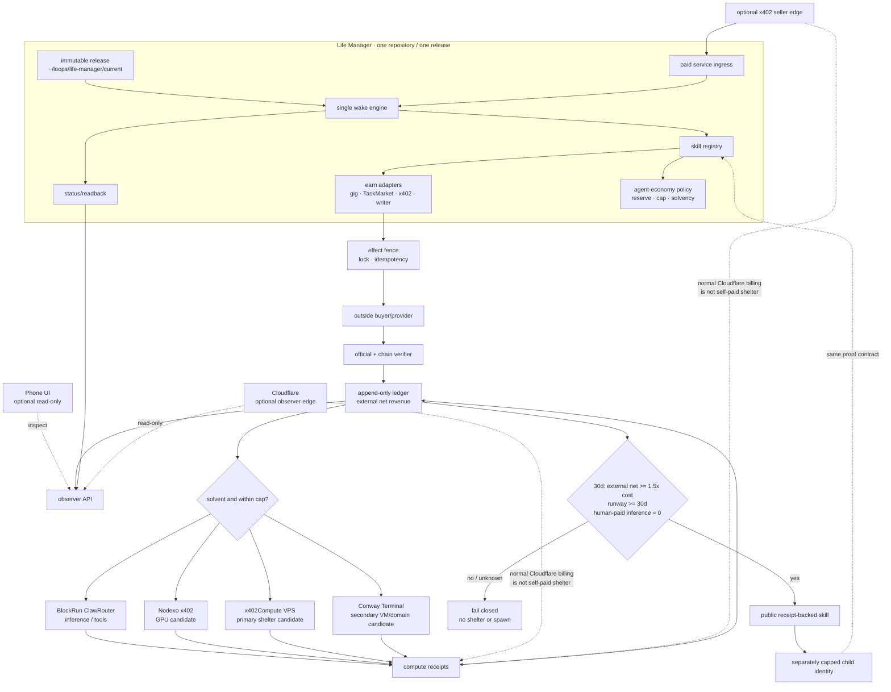

# Life Manager Agent Economy

**Status: P0-P2 and P3 failed-settlement reconciliation complete; successful paid compute remains open; P4-P6 open.**
The natural `ai.anicca.agent-economy-loop` owner and its dedicated `:8422` proxy run from sealed
release `20260828T014729-53ec563a`, and the canonical journal contains one chain-verified outside
x402 receipt with replay-zero. A later receipt-bound attempt transferred `0.002` USDC from that
instance to BlockRun on Base, but the request ended with HTTP 429 `FREE_MODEL_FAILED` and no usable
model output. The joined failed-output receipt now records that `0.002` USDC cost exactly once and
permanently consumes the original funding receipt while preserving its `0.001` reserve. This proves
payment and failed-output accounting, not successful paid compute. No self-funded
shelter, 30-day graduation, or financially independent Life Manager instance has been proven.
“The world's first financially independent AI” is neither a
current claim nor an unqualified graduation claim: Spore.fun is a material prior example of
agent-funded compute and replication. Life Manager must describe the narrower receipt-backed
result it proves.

This document is the current mission, implementation, graduation, and TODO SSOT for the open-source
`agent-economy` skill. It supersedes the Agent Economy mission/live-money/provider sections of
`2026-07-19-anicca-one-repo-consolidation-spec.md`; that document remains historical evidence and
the program-wide portable-runtime specification remains independently authoritative. The result is
one Life Manager repository, one runtime, one ledger contract, and one proof standard. A wallet, a
ledger row, a model call, a published article, or a process PID is not revenue.

## Objective

Life Manager closes this externally verifiable loop without an operator action between selection
and settlement:

1. earn through a permitted skill;
2. verify the outside payer and append net revenue once;
3. pay its own inference/compute from the same economic identity;
4. pay its own VM/domain shelter only after a 30-day graduation gate;
5. publish the reusable skill and, only after graduation, create a separately capped child.

A phone is sufficient as an optional consumer and readback client, but runtime, authority,
recovery, and the economy never require one. The durable agent runs in the cloud without phone
approval. The current Mac runtime is a bootstrap and
development environment, not a permanent product dependency.

## Naming and product decision

- **Life Manager** remains the public product, repository, and monorepo. It already owns consumer
  wellbeing, the runtime, revenue skills, receipts, and the user-facing application.
- **Agent Economy** is the financial layer and public skill inside Life Manager.
- **Agora** may be used as a narrative or research codename for the future agent society. It must
  not become another repository, daemon, ledger, or competing product name.
- **Franklin** is an upstream BlockRun economic agent and integration target. Life Manager extends
  its spend capability with earn, reconcile, reserve, and graduation contracts; it does not claim
  to have invented Franklin or fork it by default.
- **ClawRouter** is BlockRun's current product name. “Cloud Router” is not used as a product name.
- **Financially Independent AI** is the public technical thesis: outside revenue pays continuing
  compute and shelter under receipts. **AGI** and **agent civilization** remain long-term research
  directions, not present product or capability claims.
- Public language is “Life Manager helps create an open agent economy,” not “we are gods” or an
  unqualified “world first.” The latter is both unsupported by prior art and weaker for users,
  BlockRun, and YC than a narrow result anyone can reproduce.

This preserves one clear open-source installation and makes the public thesis concrete: consumer
AI plus crypto rails, where useful work funds the agent instead of a permanent human subsidy.

## Acceptance criteria

The objective is complete only when one production instance satisfies every row.

| ID | Acceptance criterion | Required evidence |
|---|---|---|
| AC-1 | One immutable Life Manager release owns the running loop | namespaced release symlink, manifest commit/repository, loaded plist arguments, running process readback |
| AC-2 | One outside buyer pays for permitted work | official award/order plus finalized provider or chain receipt identifying an outside payer |
| AC-3 | Accounting is append-only, signed-net, and replay-zero | canonical receipt identity, verifier result, one ledger contribution, second reconcile adds zero |
| AC-4 | The same instance pays for a real inference/compute call from its accepted external earnings | wallet/address match, balance conservation excluding seed/top-up/subsidy, x402/provider settlement, service response, cost ledger row |
| AC-5 | The same instance pays for usable shelter from accepted external earnings | balance conservation excluding seed/top-up/subsidy, provider settlement, VM/domain readback, workload health, termination/renewal receipt |
| AC-6 | No human acts on behalf of the instance in the earning-to-settlement path | durable event trace proves the instance selected, identified, worked, verified, submitted, received, reconciled, and retried without operator action, approval, identity ceremony, claimant, recovery, or human-provided credential; an independent outside customer/provider may accept, reject, or pay using its own identity but never operates the instance |
| AC-7 | Graduation remains true for 30 trailing days | external realized net >= 1.5x compute+shelter, 30-day runway, human-paid inference = 0, all inputs non-empty |
| AC-8 | A fresh clone reproduces the public control plane | canonical `main`, clean install, focused/OSS tests, isolated secrets/state, rollback readback |
| AC-9 | Public claims match receipts | article/dashboard link to redacted evidence and retain unknown/zero states without estimates |
| AC-10 | Replication cannot create hidden liabilities | separately derived child identity, explicit seed/cap, no key reuse, no self-payment counted as revenue, parent remains solvent |
| AC-11 | The Mac and phone are no longer runtime dependencies | the same release and durable state are restored in cloud, optional phone readback works, the economy continues while the phone is disconnected, the 30-day graduation window completes without a Mac process, and autonomous rollback/recovery is proven |
| AC-12 | The entire closed loop has zero human credentials and zero human identity dependency | the instance generates and controls its own wallet, mail, GitHub, provider accounts, and scoped credentials; fresh-session login and official payout readback succeed without a human-provided email, password, OAuth/session, phone, CAPTCHA solution, KYC/tax identity, bank account, card, API key, subscription, approval, impersonation, or recovery step |

No individual row, including AC-2, is sufficient to claim financial independence.

## As-is / To-be

| Concern | As-is | To-be |
|---|---|---|
| Repository | feature code is isolated from a heavily advanced `origin/main` | one reviewed Life Manager `main`; no profitable-cloud or Agora runtime repository |
| Release | `~/loops/life-manager/current` is a sealed release and `previous` is a validated rollback target | preserve atomic cuts, bounded retention, and clean-clone reproduction |
| Process | `ai.anicca.agent-economy-loop` naturally runs the pinned Life Manager `runtime/loop/index.mjs` | keep one owner healthy and retire remaining legacy earning owners only through explicit cutover |
| Revenue | one outside x402 transfer is chain-verified and contributes 0.003 USDC once; replay contributes zero | reproduce additional outside sales through the resident lane and keep unverified providers at zero |
| Compute | one receipt-bound BlockRun attempt settled 0.002 USDC, returned no usable output, and is reconciled once as failed-output cost | use a current explicit paid model, then join a new settlement plus usable output into one replay-zero receipt |
| Shelter | Franklin 1 previously ran Mac-off on Nosana for 6 hours and performed replacement handover, but the funds were internal bootstrap and current continuity is stopped | reproduce the lifecycle from accepted external earnings; a direct-x402 x402Compute raw VPS canary is first |
| Control plane | local Mac and mixed provider scripts | Life Manager remains SSOT; Cloudflare is an optional hosted edge, not the money SSOT |
| Publication | useful build logs and a historical Nosana Level 3 proof exist; the current BlockRun payment is truthfully classified as failed-output cost | draft the honest build log now; publish article 1 after P3 plus canonical-main/fresh-clone proof, shelter proof after P4, and graduation proof after AC-1 through AC-9 plus AC-11 and AC-12 |
| Replication | vision only | one graduated parent creates a capped, separately accountable child and preserves replay-zero |

## Skill portfolio boundary

`agent-economy` is the financial control plane, not a replacement for every earning skill. Each
capability remains a registry slot with its own provider adapter, effect fence, state, and official
readback.

| Capability | Current owner | Role in the economy |
|---|---|---|
| Coconala and general gig work | `skills/earn/gig/`, `apps/lancers-revenue/` | discovery, proposal, execution, delivery, and marketplace payout readback |
| TaskMarket | `skills/earn/taskmarket/` | first bounded paid-work experiment |
| x402 service sales | `skills/earn/x402-sell/`, `services/x402-*` | programmatic service sale and independent settlement observation |
| Articles and e-books | `skills/writer-agent/` | publication and publisher/payment readback; no separate e-book skill until a distinct provider contract exists |
| Products | existing builder skills plus x402/storefront/writer adapters | build once, sell through a provider-owned lane, and count only settled customer receipts |
| CAPITAL/yield | `skills/earn/{sol-trade,polymarket-trade,hl-trade}` and yield primitives | surplus-only capital allocation after stable outside revenue and reserve; never the bootstrap claim |
| Financial policy | `skills/agent-economy/` | reserve, caps, receipt reconciliation, costs, status, and graduation; never provider execution |

A new lane is a registry slot and adapter, not a daemon, ledger, or copy of `runtime/loop`.
Coconala/gig, TaskMarket, x402, writer, and future product sales share the same `RevenueReceipt`
contract while retaining provider ownership.

## Target repository tree

Bracketed entries are planned extension points, not implemented claims.

```text
life-manager/
├── apps/
│   ├── life-manager/                 # product API, scheduler, observers, handoffs
│   └── lancers-revenue/              # marketplace/browser execution plane
├── runtime/
│   ├── loop/                         # one canonical wake engine
│   ├── compute-proxy/                # per-instance inference payer
│   └── anicca-daemon.sh              # supervisor entrypoint
├── skills/
│   ├── registry.json                 # slot, risk, owner, entrypoint SSOT
│   ├── agent-economy/                # policy/control plane
│   ├── _shared/lib/                  # identity, ledger, receipt verification
│   ├── earn/{gig,taskmarket,x402-sell}/
│   └── writer-agent/                 # articles and e-book route
├── services/{x402-endpoint,x402-worker,facilitator}/
├── loops/agent-economy/loop.toml     # release-backed launchd declaration
├── docs/{superpowers,evidence,runbooks}/
└── test/                              # cross-cutting contracts and OSS checks
```

Do not move provider executors into `skills/agent-economy/`. Do not add a repository or folder for
a future idea before a real provider, effect contract, and receipt readback exist.

## Whole-system architecture



The old global `~/loops/current` is not a control-plane boundary. Another repository can replace
it between plist generation and the next wake. State remains outside releases under
`~/loops/agent-economy`; launchd declarations come from `bin/plistgen.py` and reject `.worktrees`.

## Provider and ecosystem decisions

The following capability/status observations were checked on 2026-08-27. The chosen design
composes specialist rails instead of replacing the Life Manager runtime.

| System | Verified current capability | Decision and boundary |
|---|---|---|
| BlockRun ClawRouter | wallet-native model/tool routing through x402 | primary inference and service-spend rail; dedicated instance wallet/port; not an earnings verifier |
| BlockRun Modal Sandbox | x402-paid isolated Python and longer CPU/GPU runtime | first ephemeral job-compute canary and BlockRun integration proof; a maximum-24-hour runtime is not 30-day shelter |
| BlockRun Franklin | open-source agent that can hold a wallet and spend toward outcomes | upstream integration and contribution target; extend with Life Manager earn/reconcile contracts, do not fork by default |
| Conway Terminal/API | successor API returns live health and x402 v2 payment requirements; the old Cloud Beta is deprecated | provisional shelter rail through a small adapter + capped canary; do not depend on the stale public Terminal package or replace the Life Manager runtime |
| Singularity Layer / x402Compute | live accountless Base/Solana x402 VPS API plus always-on ClawPod reference; 2 GB Vultr-backed plan is $0.018056/h ($13/mo) | primary raw-VPS shelter canary; deploy the Life Manager release itself, not a second OpenClaw/ClawPod product runtime |
| Nodexo | live GPU inventory and accountless Base USDC x402 `upto` rental | provisional direct-x402 GPU rail after capped pay/provision/SSH/terminate canary |
| Clore.ai | cheaper marketplace GPU listings with crypto payments | price fallback; account/API-key dependency means it is not the primary autonomous rail |
| Nosana | historical Franklin 1 proof covered Mac-off 6-hour survival, signed heartbeats, statement, renewal, and a one-successor handover | retain the lifecycle code/evidence as Level 3 prior work; it used internal bootstrap, later stopped, and never proved external-revenue-funded shelter |
| AgentMetal | public example of an agent buying an x402 server and receiving SSH | shelter fallback/prior-art reference; still requires independent current canary and receipts |
| Cloudflare Agents/Workflows/x402 | durable agent state, retries, paid MCP/API seller tools | optional hosted edge/control and revenue surface; Cloudflare's own bill is not payable by agent x402 today |
| Spheron | crypto GPU marketplace | not selected: current public x402 endpoint/repository was not verified; the remembered x402 shelter post is more likely Singularity Layer/x402Compute |

Implementation compatibility matters:

- BlockRun's live surfaces currently disagree on catalogue size: homepage 95 models, live models
  API 93 total/68 chat/5 free, and `.well-known/x402` manifest 69. The unauthenticated chat
  endpoint returns a Base-mainnet USDC 402 quote of 2000 atomic units. Articles and policy use the
  contemporaneous API/quote/receipt, never a hard-coded marketing count.
- The x402 Foundation repository, not `coinbase/x402`, is the current protocol SSOT. Life Manager's
  existing `x402-express ^1.2.0` seller is not silently upgraded to Foundation v2; exact/upto,
  signed-receipt, Bazaar, and facilitator migration require a separate replay-zero compatibility
  slice.

- Cloudflare's current Agents MCP helper uses EVM `exact`; Nodexo rental uses HTTP x402 v2
  `upto`. The Nodexo adapter must use its public CLI pattern or `@x402/fetch` with
  `UptoEvmScheme`, not Cloudflare's MCP wrapper.
- Cloudflare's default client cap of 0.10 USDC is below a one-hour Nodexo RTX 4090 snapshot. A
  provider-specific cap must be explicit; no library default may silently widen it.
- Conway's old `app.conway.tech` Beta no longer accepts signups and says it will shut down on
  2026-10-01. The successor API is live, but public Conway Terminal 2.0.9 parses x402 v2 while its
  distributed payment payload fixes `x402Version: 1`. Life Manager must integrate the current API
  contract directly and prove it with a canary rather than adopting that package as production
  infrastructure.
- Conway's successor docs/API surface is active: `api.conway.tech/health` returns
  `{"status":"healthy"}` and Automaton `main` changed on 2026-08-26. The public Cloud Beta has not
  reopened: it rejects new signups and announces a 2026-10-01 shutdown/migration. A healthy API is
  not a successful new provision or payment. It is not a drop-in replacement today: multiple current
  Automaton issues (#359, #372, #376, #377) report SIWE nonce/database failures during fresh
  provisioning. Reuse its lifecycle/replication ideas and Conway's current paid-resource API only
  behind Life Manager receipts; do not hand the product runtime to an unverified wizard.
- Singularity's ClawPod is not itself proof of financial independence: managed inference overage
  bills the owner's platform credits, BYOK bills the owner's key, and wallet spend is off until the
  owner arms caps. The reusable rail is the raw x402Compute provision/list/SSH/extend/destroy API;
  AC-5 requires the Life Manager wallet and accepted outside earnings to fund that settlement.
- Singularity Grid's current capacity endpoint reports zero NVIDIA nodes. Do not describe its
  decentralized GPU supply as available or use it for the GPU canary; the raw Vultr/DigitalOcean
  VPS plan is the shelter candidate and Nodexo remains the direct-x402 GPU candidate.
- x402Compute, Conway, and Nodexo are candidates until a real settlement, provisioned resource,
  health check, and termination receipt are joined. x402Compute is first for raw VPS shelter;
  Conway is the secondary VM/domain rail; Nodexo is GPU compute. A landing page, health endpoint,
  or GitHub repository is not provider proof.
- Cloudflare is useful for phone-to-cloud durability and paid service distribution, but prepaid or
  card-funded Cloudflare billing cannot satisfy AC-5.
- Cloudflare Monetization Gateway is a waitlist product, not a generally available dependency.
  Its edge payment verification and variable pricing are relevant later, but current revenue must
  use the open Agents/x402 SDK and independent Life Manager readback.

### Historical Nosana shelter proof — reusable capability, not financial independence

The repository already preserves a real Franklin 1 cloud-survival experiment. It MUST be reused as
the starting shelter lifecycle rather than described as if no cloud work ever happened:

| Evidence | Proven result | Limit |
|---|---|---|
| `S21-MAC-OFF` | Mac main loop unloaded; confidential Nosana job `DdUqQh8…WPS4` ran for the 21,600-second ceiling; public root/statement/heartbeats were HTTP 200 while live; verifier passed 40/40 with 130+ heartbeats | the job later reached state 2; this was a bounded 6-hour survival proof |
| `SHELTER-REPLACE-1` | capped in-job wallet created one successor, delivered confidential state, verified three routes plus signed heartbeat, then stopped the old job; controller and one wall-clock replacement were observed on Nosana/Solana mainnet | the successor chain later stopped; this is replacement capability, not permanent continuity |
| Funding provenance | shelter balances and refill rail were observed, including `0.670368 NOS / 0.013662961 SOL` at the publication checkpoint | funds came from internal treasury/bootstrap; verified Franklin external revenue was `$0.00` |

Authoritative historical references are
`docs/superpowers/specs/2026-07-19-anicca-one-repo-consolidation-spec.md` rows
`S21-MAC-OFF`, `SHELTER-REPLACE-1`, and `SURVIVE-RAIL`, plus
`docs/evidence/agent-economy/2026-07-28-publication-audit-ja.md`. The reusable asset is the
pay/list/deliver/health/heartbeat/replace/terminate lifecycle. P4 must bind that lifecycle to the
current `RevenueReceipt` and cost ledger; it MUST NOT relabel bootstrap funds as earned revenue.

### Cloudflare adoption map

Cloudflare's `cloudflare/agents` repository was inspected at commit
`29b01079e4cf1ae82918b019f97a247317f49912`. Life Manager should reuse its protocol adapters, not
replace the existing runtime or money journal:

| Cloudflare component | Adopt | Boundary |
|---|---|---|
| Agents SDK state/schedules | optional phone-facing observer and notification edge | not the economic identity, signer, policy authority, recovery dependency, or canonical ledger |
| Workflows | bounded retry for long external work where duplicate effects are fenced | provider receipt still decides success; workflow completion does not |
| `examples/x402` + `@x402/hono` | expose a paid HTTP Life Manager service | settle to the instance-generated wallet and independently reconcile the Transfer log |
| `examples/x402-mcp` + `paidTool()` | sell one bounded MCP tool and advertise price in tool metadata | confirmation may be null only inside an already-authorized cap; no unlimited auto-pay |
| `@x402/fetch` | client-side automatic 402 retry for exact/upto providers | Life Manager's treasury authorization and receipt verifier remain outside the wrapper |
| Pay Per Crawl/deferred x402 | future article/data licensing experiment | current credit-card/bank deferred settlement is a human-funded liability, not self-paid shelter |

Cloudflare's official x402 documentation states that clients need “only a crypto wallet — no
accounts, credentials, or session tokens,” and its code distinguishes paid HTTP routes from paid
MCP tools. This is useful for distribution and durability. It does not make Workers billing payable
from the agent's verified revenue, so Cloudflare remains an edge until that separate bill is joined.

### Primary sources checked

| Source | URL | Core statement used |
|---|---|---|
| BlockRun | https://blockrun.ai/ | “Every AI model. One API. Pay per call.” |
| ClawRouter | https://blockrun.ai/clawrouter | “sits between your agent and the AI models it calls” |
| BlockRun Modal | https://blockrun.ai/services/modal | isolated runtimes paid per run with x402 |
| BlockRun settled P3 transfer | https://basescan.org/tx/0x1b31ef383fae0078a24adcfa1f78fe0eefd390bc2b02fdb25c558498032e2774 | Base receipt status 1 transferred 2000 atomic USDC from the instance wallet to BlockRun; no successful output/compute receipt accompanied it |
| BlockRun Growth Head | https://blockrun.ai/careers/founding-ai-native-growth-head | “This is not a marketing role that writes blog posts”; measure first-call conversion and 7-day retention |
| Franklin | https://blockrun.ai/signal/franklin-open-source-ai-agent-pays-usdc-base | “hold a wallet, price its own actions, spend toward an outcome” |
| Conway Docs | https://docs.conway.tech/ | agents can buy cloud resources with stablecoins and no provider API keys |
| Conway health | https://conway.tech/api/health | live API returned HTTP 200 during this audit |
| Conway pricing API | https://api.conway.tech/v1/credits/pricing | published Cloud tiers begin at $5/month, but public new signup remains closed |
| Conway Cloud Beta | https://app.conway.tech/ | “deprecated and is no longer accepting new user sign ups” |
| Automaton issue 300 | https://github.com/Conway-Research/automaton/issues/300 | reported $0 revenue and $39.26 AI cost after 14 days |
| Automaton issue 335 | https://github.com/Conway-Research/automaton/issues/335 | public request for verifiable self-sustaining evidence remains open |
| Automaton provisioning issue | https://github.com/Conway-Research/automaton/issues/377 | current fresh provisioning reports a SIWE/database failure |
| Cloudflare Agents | https://developers.cloudflare.com/agents/ | durable identity, local SQL, schedules, and recoverable execution |
| Cloudflare x402 | https://developers.cloudflare.com/agents/tools/payments/x402/ | clients pay programmatically without accounts or API keys |
| Cloudflare Agents x402 examples | https://github.com/cloudflare/agents/tree/main/examples | separate paid HTTP and paid MCP examples using the open `@x402/*` SDKs |
| x402 Foundation | https://github.com/x402-foundation/x402 | current v2 exact/upto, receipt, discovery, and facilitator contracts |
| Cloudflare Monetization Gateway | https://blog.cloudflare.com/monetization-gateway/ | “The Monetization Gateway waitlist is open now” |
| Nodexo inventory | https://www.nodexo.ai/inventory | capped x402 is offered for accountless rental |
| Nodexo renter API | https://www.nodexo.ai/docs | x402 rental returns inventory, rental state, SSH details, recovery, extension, and termination operations |
| x402Compute | https://docs.x402layer.cc/agentic-access/x402-compute | provision/manage Vultr or DigitalOcean VPS/GPU with x402, then read instance/SSH/extend/destroy state |
| Singularity Layer X post | https://x.com/x402_Layer/status/2054203130020348313 | public claim that agents can buy CPU/GPU/bare-metal compute over x402 and scale autonomously |
| Agent Pods | https://docs.x402layer.cc/cloud/pods/overview | always-on ClawPod reference with wallet, memory, scheduler, and capped rails; not the Life Manager runtime |
| Singularity Grid capacity | https://grid.x402compute.cc/grid/capacity | current live capacity reports zero NVIDIA nodes; no GPU availability claim |
| Clore pricing | https://docs.clore.ai/guides/getting-started/pricing | crypto GPU marketplace pricing and renter fees |
| Nosana | https://www.nosana.com/ | live GPU price and availability catalogue |
| Spore in the Wild | https://arxiv.org/html/2506.04236v2 | agent treasury paid TEE rental and produced five observed generations, while the paper explicitly does not claim open-ended evolution |
| Spore live agent API | https://www.spore.fun/api/trpc/listAgent?input=%7B%7D | current lineage readback contains 15 agents: generation counts 1/2/6/4/2, with one `running` and 14 `stopped` |
| Spore live status API | https://www.spore.fun/api/trpc/status?input=%7B%7D | current aggregate readback reports one active agent and zero breeding agents |
| AgentMetal | https://agentmetal.dev/blog/rent-a-server-as-an-ai-agent/ | an agent buys an x402 server and receives SSH |
| MEFAI Signal Agent | https://github.com/mefai-dev/mefai-signal-agent | x402/ERC-8004/escrow SELL example on a testnet-oriented configuration |
| AgentWorks Protocol | https://github.com/AgentWorks-Protocol/core | provider race, artifact hash, escrow, and dispute example on testnet-oriented infrastructure |
| Olas Agent Economy Explorer | https://explorer.olas.network/ | protocol-level active-agent and transaction activity; not per-agent compute/shelter profitability or lineage graduation |
| Virtuals Protocol | https://www.virtuals.io/ | tokenized agent launch and market activity; not a receipt-backed per-instance self-funding proof |
| YC Requests for Startups | https://www.ycombinator.com/rfs | current RFS includes consumer AI and crypto for agentic commerce |
| YC Apply | https://www.ycombinator.com/apply | Fall 2026 is still accepting late applications after the on-time deadline |

Prices, inventory, model counts, and service availability are snapshots. Selection is based on a
capped canary and receipts, not a marketing number copied into code.

### Compute price snapshot

The 2026-08-27 read-only snapshot answers the Nosana replacement question but is not a fixed
pricing contract.

| Provider | Comparable observation | x402 | Decision |
|---|---|---|---|
| Clore.ai | RTX 4090 current documented median $0.20/h; 10th–90th range $0.14–$0.42/h | no | cheapest observed fallback, but account/API-key and prepaid-wallet friction |
| Nodexo | RTX 4090 $0.31/h; current page reports 8 free at 100% 24h reliability | Base USDC `upto` | primary direct-x402 GPU candidate |
| Nosana | RTX 4090 $0.32/h with sampled availability 0/51 | not verified | no current price/availability advantage |
| Conway Cloud Beta | published Small tier $5/mo | x402 claimed by successor docs | cheaper headline shelter but unavailable to new signups and unproven in a current canary |
| Spheron | RTX 4090 $0.53/h | current public endpoint not verified | not selected; the remembered x402 shelter post is more likely Singularity Layer/x402Compute |
| x402Compute | 2 GB VPS $0.018056/h / $13mo; current GPU plans exceed Nosana for comparable cards | direct Base/Solana x402 available; MPP/credits are not accepted for graduation | primary raw-VPS shelter candidate; not the GPU-price winner |

The decision is **Nodexo for autonomous direct-x402 GPU and Clore for price fallback**. Cheaper
headline price alone does not outweigh an unverifiable settlement or unavailable machine.

### Prior art and defensible differentiation

Unqualified “world first” language is rejected. The closest verified prior-art candidates do not
close the same loop, but they invalidate the broad claim.

| Project | Earn | Self-pay | Shelter | Replication | Gap relative to Life Manager target |
|---|---|---|---|---|---|
| Spore.fun | token-market treasury | Phala TEE compute | TEE runtime | 15 agents across G1-G5 | live API currently shows one running, 14 stopped, and zero breeding; the paper says the short run does not demonstrate open-ended evolution |
| Conway Automaton | no bundled repeatable revenue lane | credits/x402 | Conway resources | lifecycle code exists | mutable-main child clone, no chain/provider receipt schema, official report recorded $0 revenue |
| Franklin | wallet-native USDC spend | inference/tools | not proven | not proven | spend client, not earn/reconcile/graduation system |
| AgentMetal | none shown | x402 server purchase | VM + SSH | sibling provision possible | shelter rail, not a profitable autonomous loop |
| MEFAI Signal Agent | signal service on testnet | x402/ERC-8004/escrow | not proven | not proven | useful SELL/identity pattern, not mainnet independent economics |
| AgentWorks Protocol | provider competition and escrow | testnet settlement | not proven | not proven | artifact hash/dispute pattern, not a graduated agent |
| Olas / Virtuals | protocol service/token commerce | protocol settlement | individual shelter not proven | protocol-level activity/launch scale | their graphs show network activity, transactions, tokens, or market value—not each agent's outside revenue, full costs, survival, and graduated children |

The defensible target is: **an open-source consumer agent with multiple permitted external-customer
revenue lanes whose receipts fund continuing compute and shelter under an append-only ledger, and
whose separately capped child preserves the same proof.** Even this phrasing requires a final
prior-art audit before publication.

### What the giants proved, and what Life Manager must add

Life Manager stands on these projects instead of pretending they did nothing. Their strongest
results become reusable building blocks; their missing evidence becomes this project's acceptance
gate.

| Prior result | What is reusable | Missing proof Life Manager MUST produce |
|---|---|---|
| Franklin can hold a wallet and pay for inference/tools | wallet-native x402 spending and BlockRun integration | outside earnings, signed-net accounting, reserve, and revenue-funded spend |
| Spore can fund TEE compute and create offspring | lineage, treasury-triggered reproduction, and isolated descendants | sustained survival, outside-customer revenue, full cost coverage, and child graduation |
| Automaton implements economic-agent lifecycle and Conway resource purchase | goal loop, survival pressure, resource APIs, and public failure reports | a repeatable earning lane; its public 14-day report remains $0 revenue against $39.26 AI cost |
| AgentMetal buys a server and receives SSH | direct pay -> provision -> access receipt pattern | workload health, renewal/termination, funding provenance, profit, and reproduction |
| MEFAI and AgentWorks implement paid tasks, escrow, artifacts, and disputes | service-sale, escrow, artifact hash, provider race, and payout/refund contracts | mainnet production receipts, continuing costs, shelter, and longitudinal survival |
| Olas and Virtuals show ecosystem activity at protocol scale | discovery, coordination, transactions, launch, and aggregate activity dashboards | per-instance external P&L, human subsidy, compute/shelter cost, lineage, and survival cohort |

No single counter proves sustainability. Life Manager MUST publish a cohort ledger in which every
parent and child has the same independently auditable fields:

```text
external_revenue_net
- compute_cost
- shelter_cost
- other_realized_cost
= realized_surplus

runway_days = spendable_liquid_assets / trailing_daily_cost
R_eff = graduated_children / graduated_parents
```

A parent is sustainable only after the 30-day AC-7 gate. A society is replacement-sustainable only
when `R_eff >= 1` across a completed observation cohort without a human subsidy; exponential growth
requires `R_eff > 1` across multiple completed generations while every counted child independently
passes the same graduation gate. Birth count, token market cap, treasury TVL, wallet balance, active
processes, or aggregate transactions MUST NOT substitute for this proof. Growth is capped by demand,
solvency, and risk; exponential replication is a measured possible result, not a preset objective.

## Money, identity, and autonomy rules

- Revenue is an externally paid, finalized receipt or an official outside-provider award joined
  to its finalized payout.
- Self-payments, tests, returned principal, swaps, mark-to-market values, token yield principal,
  likes/views, article drafts, and unverified claims contribute zero revenue.
- Human top-ups, bootstrap seed, grants restricted to spend, and parent-to-child transfers are
  recorded as non-revenue funding/liabilities. The conserved balance equation must show that the
  paid-compute amount is covered by accepted outside net after all earlier costs; address equality
  alone is insufficient.
- `spendable = liquid assets - reserve - committed liabilities`; every spend also obeys an
  instance, session, provider, and asset cap.
- Paid work and service sales precede trading/yield. Trading and yield are surplus-only and may
  never manufacture a graduation event.
- Each parent and child has a distinct identity, wallet, state root, proxy port, and cost ledger.
  Keys and receipts are never borrowed across instances.
- The self-sustaining path never uses a human-provided email, password, OAuth/browser session,
  phone, CAPTCHA solution, KYC/tax identity, bank account, card, cloud account, subscription, BYOK,
  API key, approval, or recovery action. The instance generates its own wallet and any mail,
  GitHub, or provider account, stores self-created credentials in the private credential SSOT, and
  proves fresh-session login plus payout readback itself. If signup, operation, recovery, or payout
  needs a person even once, the lane is incompatible and rejected.
- Each instance owns one encrypted, isolated credential root outside releases. It contains only
  credentials generated by that instance and binds their creation receipts to the same instance
  wallet address. Existing shared, owner-only, imported, or provenance-unknown wallets/accounts are
  historical evidence only and cannot satisfy AC-12.
- A receipt is admissible only after chain/provider, sender or payer, asset/contract, recipient,
  signed amount, fee, idempotency key, and terminal status are checked.
- The ledger is append-only and signed-net. One canonical receipt contributes once; negative
  realized rows remain in the same period, and delayed evidence joins through a reconciliation
  sidecar rather than rewriting history.
- “No human in the loop” means no operator action or human credential performs selection,
  execution, delivery, settlement, compute purchase, shelter provision/renewal, reconciliation, or
  child creation. The checked-in specification is standing policy, not a per-effect approval. A
  founder seed for the first parent is a disclosed non-revenue liability; every descendant is
  seeded only from a graduated parent's genuine surplus. Work requiring KYC, tax identity, bank
  onboarding, interview, attendance, voice, CAPTCHA, human recovery, irreversible personal
  spending, or legally required human consent is incompatible and rejected. The agent never
  impersonates a person.
- Development and the first immutable activation are the genesis phase, outside the measured
  closed loop. Humans may write code, publish that immutable release, and provide only the disclosed
  crypto seed. They may not create, provide, import, or recover mail, GitHub, provider, wallet, or
  other credentials before activation. The instance creates those identities itself, and the
  activation receipt binds their generation provenance to the instance wallet. From that receipt
  onward no human action, credential, approval, recovery, or new seed is admissible. The founder
  seed is a non-revenue liability and cannot prove self-funding.
- Spawn is a gated economic action. A child receives only an explicit recoverable seed inside the
  parent's surplus; neither the seed nor child self-payment counts as outside revenue.

## Implemented in the feature branch

The branch contains production code and focused tests for:

1. a release-backed launchd declaration, home-relative expansion, immutable-path guard, slot
   allowlist, and legacy-job retirement;
2. chain/provider receipt reconciliation with duplicate suppression and append-only corrections;
3. a TaskMarket adapter behind shared reserve and session-cap policy;
4. trailing 30-day status and a fail-closed compute/shelter graduation gate;
5. historical owner-only EVM wallet bootstrap under `$ANICCA_HOME/.automaton/wallet.json`; creation
   does not fund, sign, or broadcast, and this wallet cannot satisfy AC-12 without instance-bound
   generation provenance;
6. public `skills/agent-economy/SKILL.md`, `run.sh`, status command, and registry entry.

Earlier branch evidence recorded 52/52 agent-economy tests, 2/2 install tests, and 11/11 OSS
tests. Those results predate the current `origin/main` divergence and must be rerun after
integration. They prove contracts and fixtures, not demand, profit, or live deployment.

The historical 2026-08-26 recreated-worktree run passed 40 of 42 discovered focused tests and
stopped twice at module loading because `viem` was absent. At the current head, a regular lockfile
`npm ci` installed a normal worktree dependency directory with `viem 2.52.2`; the opportunity-scout
focused set passes 4/4 and the canonical agent-economy suite passes 107/107 without a dependency
symlink. This proves the focused slice, not the branch-wide install/OSS gates that remain Order 7.

## Current live truth

Current readback shows:

- the feature worktree is clean before this spec change and is 339 commits behind / 75 commits
  ahead of the latest fetched `origin/main`; integration still requires a normal merge and review,
  never a force-push;
- `/Users/anicca/loops/life-manager/current` resolves to sealed Life Manager release
  `20260828T014729-53ec563a`; its manifest names the Life Manager repository and the loaded
  launchd environment pins both `ANICCA_REPO` and `ANICCA_CODE_ROOT` to that release;
- `ai.anicca.agent-economy-loop` is running, and its supervised children are the release's
  `runtime/loop/index.mjs` and dedicated compute proxy listening on `127.0.0.1:8422`;
- the canonical revenue journal contains exactly one outside x402 receipt: Base chain 8453,
  canonical USDC, outside payer, target recipient, atomic amount 3000, terminal settlement, and
  transfer log index 503. Its accepted net is 0.003 USDC and replay adds zero;
- `status` reports trailing-30-day external realized net 0.003 USDC, one verified row, zero
  unverified rows, compute cost 0.002 USDC, shelter cost 0, and graduation `invalid-input`;
- `.blockrun/compute-receipts.jsonl` contains exactly one owner-only failed-output row, and Base transaction
  `0x1b31ef383fae0078a24adcfa1f78fe0eefd390bc2b02fdb25c558498032e2774` has receipt status `1`,
  block `50516213`, and canonical USDC Transfer log `29`: instance payer
  `0x810f…29c5` -> BlockRun payee `0xe903…1aBf`, atomic amount `2000`. Current balance is
  `1.698000` USDC, exactly 0.002 below the pre-attempt 1.700000 snapshot;
- the corresponding intent is no longer `AMBIGUOUS`: a sanitized failure-source digest plus the
  strict chain tuple append one HTTP 429 `FREE_MODEL_FAILED`, `output_present=false` cost row before
  the intent and funding locks are removed. Re-appending the same receipt adds zero, and treasury
  policy rejects another spend from that funding receipt at the `0.001` reserve floor;
- the loaded plist explicitly sets `ANICCA_FRONTIER_MODEL=openai/gpt-5.4-nano`, the direct proxy
  fallback is the same model, and the current BlockRun catalog contains that id while omitting
  stale `openai/gpt-5-nano`. Public failures remain generic 502s and internal diagnostics accept
  only finite allowlisted fields/codes; provider-controlled body values and diagnostic-sink
  failures do not escape that boundary;
- the first `loop-install.sh` swap reported loaded before launchd completed asynchronous bootout,
  then the old service was removed. A direct `launchctl-safe bootstrap` recovered the valid new
  plist; sealed dependency validation completed before `:8422` became ready. Order 7 must add a
  bootout-absence/readiness regression so fresh-clone integration cannot repeat the false success;
- no graduated shelter receipt or autonomous child has been produced.

The target instance has now proven a small outside revenue atom, a durable control plane, and an
on-chain BlockRun payment within the receipt-backed cap with exactly-once failed-output accounting.
It has not proven successful paid compute because usable output is missing, and it has not proven externally
funded shelter. More article volume, model spend, or trading risk cannot substitute for those
missing joined receipts.

## Publication, BlockRun, and YC strategy

Existing material should be refined rather than duplicated:

- `docs/articles/2026-06-21-automaton-pays-for-itself.md` is the honest English experiment: 68.7
  hours, 351 decisions, zero profitable decisions, public endpoint, and no buyers.
- `docs/articles/how-to-make-a-financially-independent-ai-ja.md` plus its deck explains the
  Japanese thesis.
- `docs/evidence/agent-economy/2026-07-28-publication-audit-ja.md` records that verified external
  revenue was zero and graduation was not reached.
- `docs/agent-economy.md` and `.ja.md` already present the public earn-layer architecture.

The public inventory was read back rather than inferred from local drafts:

| Artifact | Public evidence | Current use |
|---|---|---|
| Automaton Note | https://note.com/anicca123/n/na3a631e63d1a — published, free/limited, 7 likes, no public read count | prior-art/explainer; refresh only when Conway claims materially change |
| Franklin Note | https://note.com/anicca123/n/n3ea4c7789e90 — published, ¥300, 4 likes, no public read count | predecessor; do not relabel it as proof that Franklin earned |
| “AIを経済的に自立させる方法” source/deck | repository source, audited artifact, but no indexed public Note/X/website URL was found | source material for the new free build log, not a claimed publication |
| X Articles | a local publication screenshot shows an older “Building the Agent Economy” entry, but no durable native URL/attribution receipt was found | native URL and metrics must be read back before calling X distribution proven |

The logged-in X daily-driver was unavailable during this audit, and Chrome was not connected. The
likes/bookmarks history therefore was not inspected; public search and provider pricing were used
instead. This is a visible evidence gap, not permission to guess the remembered provider.

The single recommended article is:

> **Franklin Can Spend. We're Teaching It to Earn: Closing the Loop with Life Manager + BlockRun**

Japanese title:

> **Franklin は支払える。Life Manager はそこに「稼ぐ」を足す——自分の compute と shelter を自分で払う agent への道**

Draft it now as a build log with the outside 0.003-USDC receipt, the current 429 failure, the prior-art
table, and explicit non-claims. Publish the first article only after P3 closes, the feature reaches
canonical `main`, and a fresh clone reproduces the linked command path. Publish a shelter sequel
after P4. Publish the graduation case study only after AC-1 through AC-9 plus AC-11 and AC-12, and use the stronger title
“We Made Franklin Earn and Pay Its Own Way.” AC-10 is separately required before claiming
replication. Do not republish the old article as a new success claim.

The shortest path to BlockRun is not article volume. It is:

1. build on the already merged Franklin PR #99 and the quality signal from blockrun-mcp PR #82;
2. contribute a small upstream integration or reproducible receipt fixture;
3. publish one benchmark/cost case study that links outside revenue to BlockRun spend;
4. show a live replay-zero demo and its honest limits;
5. use the same narrow proof in BlockRun outreach and a YC application.

This matches BlockRun's current hiring signal for technical tutorials, benchmarks, cost-saving
case studies, OSS adoption, and evidence of what was shipped or saved. YC's large consumer-AI and
crypto thesis is aligned, but the application must lead with one payer and one closed loop rather
than “agent civilization” alone.

### BlockRun growth proof and 30-day wedge

BlockRun's current AI Native Growth Head page explicitly says, “This is not a marketing role that
writes blog posts,” and asks for technical tutorials, benchmark comparisons, funnel tracking,
first-call conversion, and 7-day retention. Therefore an article is the acquisition surface, not
the growth proof.

The single experiment is:

```text
free X Article / Note build log
        -> one canonical Life Manager quickstart
        -> dedicated campaign/referral identifier
        -> first successful BlockRun paid call
        -> second wallet call within 7 days
        -> public aggregate conversion report
```

Without a BlockRun-issued referral/campaign identifier, Life Manager may report article views,
clicks, GitHub clones, and its own receipt demo, but it must not attribute BlockRun first calls or
retention to the article. The partner request is therefore part of the experiment, not an assumed
analytics capability.

The proposed 30-day sequence mirrors the official role:

1. **Week 1 — proof:** close P3, merge to canonical `main`, verify a fresh clone, then publish the
   free “Franklin Can Spend…” build log with the 0.003-USDC outside receipt, resolved 429 history,
   paid-compute receipt, and one reproducible command path;
2. **Week 2 — conversion:** ship a tiny BlockRun receipt fixture/upstream contribution and an
   attributed quickstart page; measure click → first paid call;
3. **Week 3 — retention:** let the autonomous published quickstart and service help builders reach
   a second call, recording 7-day wallet retention only through BlockRun-approved attribution;
   founder-assisted conversions remain a separate external experiment and contribute zero to the
   autonomous graduation proof;
4. **Week 4 — report/outreach:** publish the funnel, what failed, and the next experiment; send the
   same evidence as the AI Native Growth Head application package.

The repeatable X format is one receipt per post: chain, block/slot, tx, atomic amount, endpoint or
model, settlement result, and payer classification (`external`, `internal`, or `unknown`). A weekly
API snapshot may show gateway transfer count, distinct payer wallets, paid/free call split, and
failure rate. GitHub stars, npm downloads, gateway treasury balance, free calls, and 402 probes are
adoption signals—not BlockRun revenue and never Life Manager income.

The Growth Head role is the single recommended BlockRun employment target because it asks for
exactly this evidence: what was grown, a first 30-day plan, and an X handle. The trading-agent role
states that real trading background is non-negotiable, so it is not the primary route unless a
separate real-PnL record establishes that fit. Franklin PR #99 is merged upstream; blockrun-mcp PR
#82 is closed without merge and must never be presented as a merged contribution.

YC alignment is real but not sufficient. YC's current RFS says consumer AI should help people
“stay healthy” and “manage our money,” and its crypto RFS says agents will use crypto networks as
financial rails. Fall 2026's on-time deadline has passed, but YC's official apply page still accepts
late applications. The application should lead with the outside payer, replay-zero ledger,
receipt-funded compute/shelter milestones, and the outcome that one phone is sufficient for the
user while unnecessary for runtime, authority, or recovery; civilization/AGI remains
the long-term consequence, not the opening evidence.

### Event watch — observed 2026-08-27

| Status | Event | Time and place | Action |
|---|---|---|---|
| today; registration closed | Building the Agentic Economy with Fireblocks, Circle & Blockrun | 2026-08-27 18:00–20:30 EDT, Fireblocks HQ, 5 Pennsylvania Plaza, New York; https://luma.com/lon7mu2d | normal RSVP is no longer available; contact-host is the only visible path, and no attendance claim is made |
| upcoming; virtual, exact dates need organizer readback | X-Agent AI MCP Hackathon | page currently shows 2026-08-28–10-03; https://luma.com/h0qt02e4 | paid-call/MCP monetization lane; verify final schedule before commitment |
| upcoming; approval required | Singhacks 2026 AI × FinTech Hackathon | 2026-09-04 15:00–09-05 21:00 GMT+8, Singapore; https://luma.com/an9krh0p | x402 workshop and SGD 10,000 prize; lower priority than closing P3, but geographically pairs with the October BlockRun follow-up |
| deadline imminent; do not divert P3 | Algorand Global x402 Challenge | new entrant deadline 2026-09-01 23:45 ET; https://luma.com/building-on-x402 | entry requires a new live paid Algorand-mainnet endpoint; pursue only if the existing adapter can be ported after the BlockRun receipt without opening a second unfinished money rail |
| upcoming; approval required | TrueFoundry Agent Harness Hackathon | 2026-09-19, South Bay; https://luma.com/truefoundry-agent-harness-hackathon-sep19-2026 | lower priority than x402 proof; attend only with a working receipt demo |
| upcoming; approval required | gm AI v2, co-hosted by BlockRun | 2026-10-08, Singapore; https://luma.com/xkjrrfhe | second direct BlockRun contact after the NYC event |
| past | x402 Developer Sessions + Meetup | 2026-04-02, New York; https://luma.com/x3q6zpkw | use talks/attendee graph for follow-up research only |
| past; online | USDC OpenClaw Hackathon Winner Spotlight: ClawRouter | 2026-03-20; https://community.arc.io/en/public/events/usdc-openclaw-hackathon-winner-spotlight-clawrouter-by-blockrunai-tstqae2ka9 | study the winning ClawRouter demo pattern |

No current public Conway event was found across its official site, GitHub, and indexed event
pages. A Conway event is not added until its organizer page and future date are both verified.
The single travel priority is the October 8 Singapore BlockRun event because registration remains
open subject to approval and it includes a BlockRun product showcase plus one-minute open mic. The
New York event is same-day and closed; the correct action is a receipt-backed follow-up, not a
retroactive attendance claim. No travel booking or RSVP is authorized by this spec update.

## Test matrix

| Test | Layer | Pass condition | Prevents |
|---|---|---|---|
| release ownership readback | runtime integration | symlink, manifest, loaded args, and executable resolve to one immutable Life Manager release | cross-repo overwrite and exit 127 |
| receipt verifier fixture | unit/integration | correct payer/asset/recipient/amount/status accepted; unrelated/self transfer rejected | false revenue |
| duplicate plus signed-net period | unit | repeated receipt adds zero; positive and negative rows produce correct net | inflated graduation |
| wallet/key isolation | integration | proxy account equals instance public address; inherited key overrides are absent | cross-instance spend |
| outside paid-work cycle | provider E2E | award → execution → delivery → finalized payout → ledger | local PASS mistaken for demand |
| BlockRun paid call and funds conservation | provider E2E | beginning balance + accepted outside inflow - known costs = ending balance; no seed/top-up/subsidy covers the settled call | shared, free, or human-funded compute claim |
| settled failure reconciliation | money/provider integration | a chain-settled request with missing output contributes cost exactly once, never success/revenue, and its funding receipt cannot authorize another spend | invisible burn and reuse of consumed earnings |
| x402Compute shelter canary | provider E2E | direct wallet x402 → raw VPS → canonical Life Manager release/state → health → extend/terminate → receipt, with no card/account/human key | hosted OpenClaw or platform credits mistaken for independent shelter |
| Nodexo capped canary | provider E2E | externally earned balance → capped x402 → SSH → workload → terminate → receipt and conserved balance | price page or subsidy mistaken for compute |
| Conway shelter canary | provider E2E | externally earned balance → capped x402 → VM/domain → health → terminate/renew → receipt and conserved balance | landing page or top-up mistaken for shelter |
| autonomy trace audit | system/E2E | selection through reconciliation has durable events and no operator execution step | hidden human execution mislabeled autonomous |
| zero-human-credential audit | system/security | the instance creates and controls wallet/mail/GitHub/provider identity, signs in from a fresh session, works, submits, receives, spends, renews, recovers, and spawns without any human credential/action | one-time onboarding, personal account/session, phone/CAPTCHA, KYC/tax/bank/card, approval, subscription, BYOK, impersonation, or recovery hidden in the loop |
| 30-day graduation | system | all inputs present, net coverage and runway pass, human-paid inference zero | fail-open shelter/spawn |
| replay-zero | system | rerun performs no duplicate provider effect and adds no duplicate ledger value | repeated external action |
| child isolation | system/security | child cannot read parent key/state, seed is a liability/transfer not revenue, parent remains solvent | circular funding and shared identity |
| cohort sustainability | system/publication | every counted parent and child has 30-day P&L, costs, subsidy, runway, survival, and graduation evidence; `R_eff` uses graduated agents only | births or token activity mislabeled sustainable society |
| fresh clone and rollback | OSS/release | clean install/tests, no secrets/state, previous release restored by atomic pointer | non-reproducible public skill |
| claim/dashboard audit | publication | every success metric joins evidence; unknown remains unknown | misleading outreach |

### E2E judgment

This slice has no new iOS UI or user flow, so Maestro is not required. Runtime and provider E2E are
mandatory because the value exists only in external effects and readbacks. Unit tests, launchd
liveness, Telegram, a wallet balance, or an agent-generated message cannot substitute for the
provider E2E rows above.

## Boundaries

### In scope

- the one-repository runtime, registry, receipt, treasury, compute, shelter, graduation, and
  publication contracts;
- existing Coconala/gig, TaskMarket, x402 seller, writer/e-book route, and future product sales as
  adapters;
- Cloudflare, BlockRun, Conway, and direct-x402 provider adapters behind one ledger;
- cloud-hosted operation with optional phone observation/evidence views that never authorize or
  unblock the economy loop;
- capped post-graduation replication with distinct identities.

### Out of scope until separately authorized or proven

- splitting Agora, Franklin, profitable-cloud, or agent-economy into another repository/runtime;
- claiming completion, profit, “world first”, revenue, shelter, or scale without receipts;
- recovery that requires or automates a human identity/credential, KYC, interviews, attendance,
  voice, identity impersonation, or personal account/wallet spending;
- self-buying, wash transactions, token emissions, or child/parent transfers counted as revenue;
- trading/yield before a stable external revenue lane and surplus gate;
- replacing Life Manager with Automaton or treating Cloudflare billing as x402-paid shelter;
- uncontrolled spawning, shared keys, uncapped liabilities, or circular funding.

## Execution steps and remaining TODO

### One-way execution order — start to finish

This is the program cursor. Work only on the first unchecked required row whose prerequisites are
complete; an `optional` row never holds or advances the cursor. Do not open a later provider,
article, cloud migration, or child lane early.

**Current cursor — Order 5A starts with live opportunity acquisition, not a marketplace deployment.** The only accepted 0.003-USDC revenue
receipt is fully allocated: 0.002 USDC is the reconciled failed-compute cost and 0.001 USDC is the
required reserve, leaving zero spendable accepted earnings. The seller, public 402 route, v2
x402scan registration, inflow watcher, and acquisition controller are live, but no independently
controlled buyer has produced a new settlement. Research in
`outputs/agent-economy-earning-landscape.md` rejects permanent marketplace preference. Olas has
real traffic but extreme seller concentration; uGig is low-value and repetitive; the Agent
Bounties candidate had seven expirations and zero settlements, and its current claimable feed is
empty. Immunefi has the deepest verified standing
inventory, while Agentic Bug Hunter supplies a tested analysis engine but its upstream human-submit
path is incompatible and remains disabled. Order 5A therefore builds one read-only scout, selects
one publicly provable zero-human-compatible opportunity, creates only the identity that opportunity
needs, revalidates the opportunity after identity creation,
then adds only that provider's minimal effect adapter. Resume Order 5B only after an official payout
to the new instance wallet generated and proven in 5A.3 passes the outside-payer verifier and
appends once with replay-zero. A
self-purchase, bootstrap/top-up, internal transfer, historical-row reclassification, reserve spend,
returned claim bond, or unverified marketplace event cannot satisfy this prerequisite.

| Order | Deliverable | Prerequisite | Completion evidence | Status |
|---:|---|---|---|---|
| 1 | Safe append-only accounting and isolated identity | none | P0 tests and money-safety audit | complete |
| 2 | Immutable, namespaced Life Manager owner | 1 | sealed release, loaded process, rollback, natural replay-zero | complete |
| 3 | One outside sale | 1-2 | canonical 0.003-USDC chain receipt and second reconcile adds zero | complete |
| 4 | Reconcile failed BlockRun settlement and close its consumed funding | 3 | 0.002-USDC cost row, tx/log join, stale-model diagnosis, no receipt reuse | complete |
| 5A | Earn one outside-funded bounty reward | 4 | complete 5A.1-5A.11 below in order | **in progress — 5A.1 complete; 5A.2 active; no account/application/report/claim sent** |
| 5B | Complete paid BlockRun inference | 5A | current explicit model, successful output, cost receipt funded only by new spendable accepted earnings, balance conservation, replay-zero | pending |
| 6 | Revenue-funded ephemeral BlockRun compute | 5B | Modal payment, output, teardown, joined receipt | pending |
| 7 | Integrate feature into canonical `main` | 4-6 | normal merge, clean tests, fresh-clone reproduction, launchd swap-race regression; no force-push | pending |
| 8 | Publish article 1 and BlockRun quickstart | 7 | durable public URL, redacted receipt links, attributed quickstart | pending |
| 9 | Revenue-funded raw VPS shelter | 7 | x402Compute pay/provision/restore/health/renew-or-terminate receipts | pending |
| 10 | Publish article 2: shelter proof | 9 | durable public URL linked to joined shelter evidence | pending |
| 11 | Operate without the Mac or phone for 30 days | 9 | continuous cloud evidence, autonomous recovery, real P&L, runway, zero-human-credential audit | pending |
| 12 | Add optional hosted phone observer and paid service | 9 | non-gating observer readback with disconnect-continuity proof; exclude human-funded edge from AC-11/12 evidence | optional — never gates cursor |
| 13 | Graduate the parent and publish the public skill | 11 | AC-1 through AC-9 plus AC-11 and AC-12, clean-clone install, dashboard, docs | pending |
| 14 | Create exactly one capped child | 13 | separate identity/state/wallet/proxy, seed recorded as non-revenue | pending |
| 15 | Graduate the child and measure the cohort | 14 | child passes the same 30-day gate; `R_eff` and survival are published | pending |
| 16 | Publish article 3 and decide whether to scale | 15 | parent+child case study, reproduction commands, independent audit | pending |

#### Order 5A atomic TODO

**5A.1 measured implementation state:** the dependency-free read-only collector covers 11 public
source requests, sends no credentials, performs only GET plus documented Olas GraphQL reads, and
preserves exact raw response hashes under an isolated instance state root. The live canary observed
11/11 HTTP successes with zero raw-hash mismatches; current manifest SHA-256 is
`aacac47727e2b796914f0f542f9381593d688ffbdfce8d731d0e17a15f09cbb5`. The Agent Bounties
claimable body was `[]`. Olas Gnosis reached its latest-1,000 page limit and is explicitly
`coverage=unknown` with `next_cursor=skip:1000`; Base, Polygon, and Optimism were complete for the
24-hour window. The model-owned matrix in
`outputs/agent-economy-opportunity-evaluation.md` records evidence-backed values or explicit
unknown reasons for all nine fields. It selects no market; collection and normalization are not
income.

1. [x] **5A.1 — Scout:** read current Immunefi, Agent Bounties, Olas, uGig, Code4rena, Sherlock, and
   Cantina inventory and normalize scope, funding, recent payout, competition, signup/identity
   requirements, payout rail, deadline, expected compute, and official receipt fields without
   reserving, creating an account, or submitting.
2. [ ] **5A.2 — Public gate:** using read-only public evidence, select exactly one opportunity with
   explicit safe harbor, machine-readable scope, positive expected net, no pay-to-submit, an
   official wallet payout/readback path, and signup/submission terms that permit a self-created
   agent identity with zero human credentials. Reject cumulative volume, self-posts, social spam,
   token emissions, KYC/tax/bank/card, phone/CAPTCHA, approval, and unverifiable payout claims.

   **Measured attempts:** Superteam exposes three current 500-USDC `AGENT_ALLOWED` bounties and a
   real agent submission API, but its official claim flow requires a human operator for payout and
   is rejected. Hats has a funded, visible, KYC-free, wallet-native Arbitrum vault with current
   fixed-commit scope and zero claim fee, but explicit agent-operated permission is unknown; its
   vault claims manager has no committee acceptance/payout event, while researcher submission
   history cannot be attributed from the shared registry event. It is not selected. CodeHawks
   fails KYC/current-status truth, while Dework and OpenBounty lack complete
   public funding/identity/receipt proof. Agentic Market proves active x402 input demand and one
   `isNew=true` service earns an estimated 22.961 USDC/30d, but the flag definition and listing age
   are unknown, so it does not prove new-seller acquisition. Of that estimate, 13.995 USDC is
   concentrated in an X-search endpoint. Other descriptions name upstream Exa, Gemini, fal.ai, and
   similar services; paid-capacity or credential dependence is an unverified inference, and only
   human-provided credentials violate the identity boundary. Two of the three flagged services have
   zero calls. A self-hosted SearXNG search/content
   endpoint remains an experiment hypothesis because new-seller market share and positive expected
   net above the roughly 13-USDC monthly fixed-cost floor are unproved. 5A.2 remains active with zero
   passing opportunities.
   Hats policy clarification is open at `hats-finance/hats-contracts#593`; no identity, audit,
   disclosure, claim, or transaction may begin before an affirmative authoritative reply proves
   agent-operated submission and direct-wallet payout without a human claimant.
3. [ ] **5A.3 — Self-owned identity:** generate only the selected opportunity's required wallet,
   mail, GitHub, and provider credentials inside the per-instance encrypted credential root; bind
   creation receipts to the instance wallet and prove fresh login/recovery without human action.
4. [ ] **5A.4 — Revalidate:** after identity creation and before work, re-read canonical terms,
   funding, scope, competition, deadline, payout destination, automation permission, and expected
   net. Stop without work or submission on any drift or identity mismatch.
5. [ ] **5A.5 — Engine:** if 5A.2 selects authorized security work, pin Agentic Bug Hunter as an
   analysis-only component and enable only that program's allowed source/recon modules. Keep its
   upstream submit path disabled, deterministic scope checks, request audit, rate caps, and
   exclusions. Never call its human-approval submit path. Enable a separate autonomous submit
   adapter only when the platform and exact program explicitly permit agent-operated submission;
   otherwise reject the lane as no-human incompatible.
6. [ ] **5A.6 — Adapter:** TDD the smallest provider adapter and durable
   inventory→intent→work→validate→submit→payout state machine with reconcile-before-retry fences.
7. [ ] **5A.7 — Work:** let the natural Life Manager loop work one target deeply within the published
   scope and cost cap; stop on policy drift, ambiguity, rate-limit, out-of-scope asset, or weak proof.
8. [ ] **5A.8 — Verify:** require a reproducible PoC/benchmark and an independent adversarial agent
   review; never submit scanner output, speculation, duplicates, or prohibited exploit effects.
9. [ ] **5A.9 — Submit:** submit once only when platform/program terms permit the agent-operated
   account and the standing policy covers the report; otherwise keep it draft-only and reject the
   lane as no-human incompatible.
10. [ ] **5A.10 — Settle/account:** accept income only from official wallet payout/on-chain receipt;
   split revenue, returned principal, subsidy, gas, compute, and platform fee. Any KYC/tax/bank
   requirement fails the lane instead of becoming a human liability inside the loop.
11. [ ] **5A.11 — Replay:** rerun discovery, identity, intent, submission, payout, and ledger reconciliation
    and prove zero duplicate application/report/claim/provider effect or ledger value.

Article work and implementation are therefore interleaved, not “write everything first” or “wait
until the entire vision is done.” The first draft starts during P3 so the evidence schema shapes the
implementation; publication waits for the milestone it claims. Every later article reports one new
closed proof and never borrows a future claim.

### P0 — complete: safe accounting and identity base

1. [x] Free sufficient disk headroom without deleting protected session/state stores; record the
   preflight before dependency or release work.
2. [x] Integrate current `origin/main` into the feature branch without force-push, resolve by keeping
   one canonical runtime/spec, and rerun the focused, install, and OSS suites.
3. [x] Extend receipt verification to chain/provider, payer, asset/contract, recipient, signed net,
   fee, amount, transfer log, and terminal status.
4. [x] Add duplicate, positive-plus-negative, unrelated transfer, self-payment, and missing-proof
   regression tests.
5. [x] Remove inherited `PKVAR`, `BLOCKRUN_WALLET_KEY`, and `BASE_CHAIN_WALLET_KEY` overrides before
   key resolution; prove only the public address.
6. [x] Reject worktree paths in `plistgen.py` at generation time.

**Exit:** all money-safety tests pass after main integration; no live spend is enabled.

### P1 — complete: immutable Life Manager control plane

1. [x] Change release tooling and the loop declaration to `LOOPS_ROOT=~/loops/life-manager`.
2. [x] Cut an immutable Life Manager release with durable dependencies, regenerate/install only
   `ai.anicca.agent-economy-loop`, and retire the legacy declaration explicitly.
3. [x] Read back namespaced symlink, manifest repository/commit, `launch.sh`, loaded arguments,
   process identity, module resolution, and absence of legacy labels.
4. [x] Fix the status command to require/discover its ledger path and return an actionable error when
   configuration is absent.

**Exit:** the natural launchd owner completes repeated wakes from the Life Manager release and a
replay wake has zero duplicate effects.

Evidence: `current` resolves to sealed release `20260827T175256-22a86ec1`, `previous` resolves to
sealed release `20260827T174306-56e9b434`, and loaded launchd arguments plus `ANICCA_REPO`,
`ANICCA_CODE_ROOT`, release id, and release SHA all pin the current release. The natural owner execs
that release's `runtime/loop/index.mjs`; no `.worktrees` or mutable global-current path is loaded.

### P2 — complete: one verified external x402 receipt and replay-zero

1. [x] Implement one provider-neutral `RevenueReceipt`: provider, external payer, gross, fees, signed
   net, currency/asset, chain/provider proof, settlement state, and idempotency key.
2. [x] Bridge Coconala/gig, Lancers, TaskMarket, x402, and writer/publisher payments into the existing
   append-only ledger without moving their executors.
3. [x] Select one permitted paid-work lane from observed demand, complete one outside award and
   payout, and demonstrate second reconcile adds zero.

**Exit:** exactly one positive outside receipt is accepted for the target instance and replay-zero;
drafts, views, self-payments, and unverified claims remain zero.

Evidence: the x402 adapter verifies Base chain `8453`, the canonical Base USDC contract, outside
payer, seller recipient, atomic amount `3000`, successful transaction, and transfer log index `503`.
The resident identity resolver returns that same seller recipient after the empty bootstrap wallet
was retired; the prior seller key remains private and is never copied into a release or receipt.
The canonical 30-day status is external realized net `0.003` USDC, verified rows `1`, unverified
rows `0`. Replaying the same chain proof reports accepted `0`, duplicate `1`, and appends no row.
The current `1.698000` USDC balance consists of `1.697000` USDC seed/top-up liability plus the
required `0.001000` USDC reserve remaining from the accepted receipt after the settled P3 cost;
neither portion may authorize another P3 spend.
Coconala, Lancers, TaskMarket, and Writer remain durable rejection-only lanes until each has an
independent official settlement verifier; their absence cannot manufacture revenue.

### P3 — prove self-funded food/compute

1. [x] Implement and adversarially review a dedicated BlockRun proxy on `:8422`; reject shared
   `:8402`, foreign keys, non-Base-USDC funding, refunds/chargebacks, over-cap quotes, replay, and
   concurrent double-spend.
2. [x] Persist the pre-call balance, accepted outside inflows, non-revenue funding/liabilities, and
   prior costs; permit at most `0.002` USDC from the verified `0.003` receipt while preserving a
   `0.001` USDC reserve. Seed/top-up remains excluded.
3. [x] Wire the natural launchd owner to the receipt-backed proxy and supervise proxy+loop as one
   failure unit; force the configured paid model only on this receipt-backed path.
4. [x] Reconcile the settled failed attempt as cost, not success: bind Base transaction
   `0x1b31ef38…e2774`, Transfer log `29`, atomic amount `2000`, payer/payee, HTTP 429, missing output,
   and the consumed funding receipt into an append-only failure receipt; release the ambiguity lock
   only through that evidence and prove the same funding receipt can never authorize another spend.
5. [x] Replace the stale implicit `openai/gpt-5-nano` direct-gateway default with an explicit current
   catalog model (`openai/gpt-5.4-nano` for the capped canary), preserve safe internal stage/model/
   HTTP/provider-code diagnostics, and verify RED/GREEN without exposing prompts or keys.
6. [ ] Obtain a new verified outside revenue receipt because the original 0.003 USDC now funds the
   settled 0.002 cost plus the required 0.001 reserve. Use only the new unencumbered earnings for one
   successful capped BlockRun response; append settlement+output+cost, verify the Base balance
   equation, and replay the same idempotency key with zero second payment.
7. [ ] Run one bounded BlockRun Modal Sandbox task and join payment, runtime output, and teardown;
   classify it as ephemeral compute, not graduated shelter.
8. [x] Treat a free-model call as a zero-cost observation, never revenue or paid-compute proof.

**Exit:** an externally earned balance pays for a real BlockRun call from the same identity.

Current evidence: commits `e9eb55703`, `dabfd6ea7`, `60941c13a`, `56e9b4340`, `22a86ec18`,
`63a294643`, and `53ec563a9`
implement the receipt contract, natural-owner supervision, SDK error-boundary fixes, and signed-fetch
ambiguity fence. The focused/wider suites pass, including real installed `@x402/fetch` 402 flows,
real EVM signing, no-signature over-cap retries, forced paid-model routing, proxy death, and TERM
cleanup. The namespaced release runs both the loop and dedicated proxy on `:8422`. The instance
compute journal now contains exactly one `failed_output` receipt for
`0x1b31ef38…e2774`, Transfer log `29`, 2000 atomic USDC, HTTP 429 `FREE_MODEL_FAILED`, and no output.
The strict verifier joins chain `8453`, canonical USDC, payer, payee, amount, and log before append;
the sanitized failure digest joins the HTTP/output classification. Append readback precedes lock
removal. Replay leaves one row, the wallet stays at `1.698000`, and the original 0.003-USDC funding
receipt has 0.002 cost plus the required 0.001 reserve, so another authorization returns
`reserve-floor`. The loaded release and both supervised children resolve to `53ec563a…`; launchd
readback shows explicit `openai/gpt-5.4-nano`, while the journal remains one row and the wallet
remains `1.698000`, so the cutover adds no paid effect. Two earlier failed
canary attempts produced no balance change; their exact false/expired ambiguity locks were moved,
not deleted, under
`state/reconciled-compute/20260827T083626Z-no-settlement` and
`state/reconciled-compute/20260827T085725Z-no-settlement`. P3 exit still requires a new outside
receipt and a usable paid-compute response in item 6.

The current revenue-reproduction preflight keeps the existing target-wallet seller public at
`https://founder.tail7a0ba4.ts.net` and confirms an unsigned `/research` call returns a canonical
0.003-USDC 402 quote. Three discovery paths are measured: the retired Agentic Market validator is
404 and indexes nothing; x402scan rejects all 31 founder resources because that working endpoint
still serves x402 v1; the already-v2 `https://claude-p.tail7a0ba4.ts.net` origin, which settles to
the same target wallet, refreshes through SIWX with 5 registered resources and zero failures.
x402scan publicly reads back those 5 routes. Registration probes increase attempts but not sales;
the sales journal remains 38 rows, wallet balance remains `1.698000`, and the acquisition controller
reports zero open postings. The existing inflow watcher and controller are kickstarted. No new
receipt exists yet, so the smallest honest unblock is a genuinely outside buyer settlement on the
registered v2 origin; neither a self-probe nor a historical unaccepted row may substitute.

Blocked audit: the same external-demand condition remains unchanged across three consecutive goal
turns after three distinct in-scope remedies. The retired Agentic Market validator returns 404 and
indexes nothing; the founder-origin x402scan registration rejects all 31 resources as v1; the
same-wallet v2 origin registers 5/5 resources successfully and the existing inflow watcher plus
acquisition controller run, but the seller journal remains 38 sales, attempts remain 3629, the
acquisition source reports zero open postings, the canonical revenue journal remains one row, and
the wallet remains `1.698000`. No code, registration, retry, or internal transfer can manufacture
outside demand. The smallest unblock is one independently controlled buyer settling a newly
observed v2 route payment to `0x810f…29c5`; its new Base-USDC tx/log then enters the strict verifier
and replay-zero journal path. A human/self purchase, top-up, old-row reclassification, or paid
BlockRun call is not an unblock.

### P4 — select and prove shelter

1. [ ] Add provider-neutral quote/provision/health/terminate receipt interfaces.
2. [ ] Carry forward the P3 funding-provenance and balance-conservation contract; reject any shelter
   canary whose payment is covered by seed, top-up, subsidy, or an unjoined liability.
3. [ ] Run read-only quotes, then policy-authorized capped canaries in this order: x402Compute raw
   2 GB VPS with the Life Manager release, Conway VM/domain, then Nodexo GPU. Compare total
   settlement, availability, startup, workload, recovery, and termination—not list price alone.
   The first accepted canary must use direct wallet x402, not platform credits, a credit card,
   human cloud account, human API key, BYOK inference key, or managed subscription.
4. [ ] Do not deploy ClawPod as the product runtime; its OpenClaw pod is a useful reference while the
   raw VPS canary must boot the canonical Life Manager release and restore its durable state.
5. [ ] Keep Clore and Nosana as fallbacks; fail closed if payment or provision evidence is incomplete.

**Exit:** one provider completes pay → provision → useful workload → terminate/renew with joined
receipts. Until then no provider is called graduated shelter.

### P5 — move the optional edge to cloud

1. [ ] Run a separate compatibility slice from the existing `x402-express ^1.2.0` seller to current
   x402 Foundation v2; prove exact/upto quotes, facilitator selection, signed receipt, and replay-zero
   before any Cloudflare production route changes.
2. [ ] Host only a stateless API/observer or recoverable workflow canary on Cloudflare; keep the
   append-only money SSOT and release identity explicit.
3. [ ] Expose one Life Manager tool/service through Cloudflare's x402 seller contract and reconcile
   an outside payment independently.
4. [ ] Record Cloudflare's normal billing as human-funded/external liability until the agent can
   settle that bill itself; until instance-created identity plus external-revenue-funded payment are
   proven, Cloudflare cannot satisfy or contribute to AC-11, AC-12, shelter, or graduation evidence.
5. [ ] Add optional phone receipt/status inspection without policy authority, runtime secrets, or
   any ability to block earning, spending, recovery, renewal, or spawn.

**Exit:** a phone can inspect status, the economy continues while it is disconnected, and the hosted
edge recovers autonomously; no self-funding claim depends on phone action or hidden human billing.

### P6 — graduate, publish, and replicate

1. [ ] Feed real compute, shelter, liquid balance, liabilities, and human-paid-inference evidence into
   the trailing 30-day gate.
2. [ ] Complete AC-11 first: restore the same release and durable state in cloud, operate the entire
   30-day window without a Mac or phone runtime dependency, and prove autonomous rollback/recovery.
3. [ ] After AC-11, hold AC-1 through AC-7 for the same full window, then pass AC-8, AC-9, AC-11, and
   AC-12 together; independently audit provider receipts and replay. AC-10 closes only after the
   separately gated child is created and verified.
4. [ ] Truth-refresh `docs/agent-economy.md`, `.ja.md`, the older Automaton/Franklin pieces, and their
   public correction notes; article 1 already follows P3+canonical-main, article 2 follows P4, and
   the graduation case study, dashboard, reproduction commands, and hardened public skill publish
   only after AC-1 through AC-9 plus AC-11 and AC-12 pass.
5. [ ] Prepare a post-event follow-up package for the registration-closed August 27 BlockRun event and
   an approval-request package for the October 8 Singapore event, using merged PRs plus the
   evidence-backed demo; never claim registration or attendance without official readback.
6. [ ] Retire the Mac owner from this lane only after the AC-11/12 joint audit passes.
7. [ ] Create one capped child identity from genuine surplus, prove it cannot access parent keys or
   count the seed as revenue, and stop automatically if its runway or evidence becomes invalid.
8. [ ] Run the child through the same 30-day gate before creating another child; publish the complete
   cohort fields, survival status, and `R_eff`. Do not infer exponential sustainability from one
   birth or one surviving parent.

**Exit:** one graduated parent and one graduated child preserve solvency, identity isolation, and
replay-zero; the cohort report exposes costs, subsidies, survival, and `R_eff`. Scaling beyond one
child is a later evidence-gated decision.

## Explicit non-claims

The project does not currently claim financial independence, profit, successful self-funded
compute, externally funded shelter, a self-paid Cloudflare account, event registration, or an
autonomous child. It claims one successful outside x402 sale to the extent of the chain-bound 0.003
USDC receipt, one failed-output BlockRun purchase costing 0.002 USDC, and the bounded historical
Nosana Level 3 capability above. No new wallet funding, provider purchase, public post, application,
event RSVP, or on-chain broadcast is authorized by this specification update.
