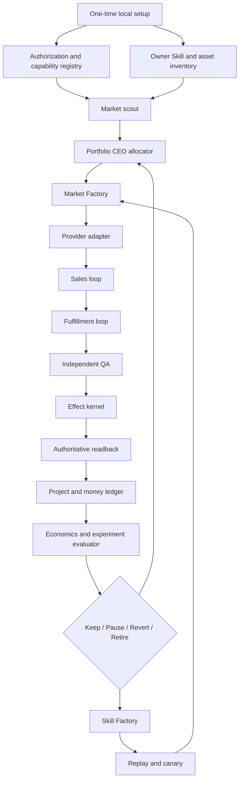
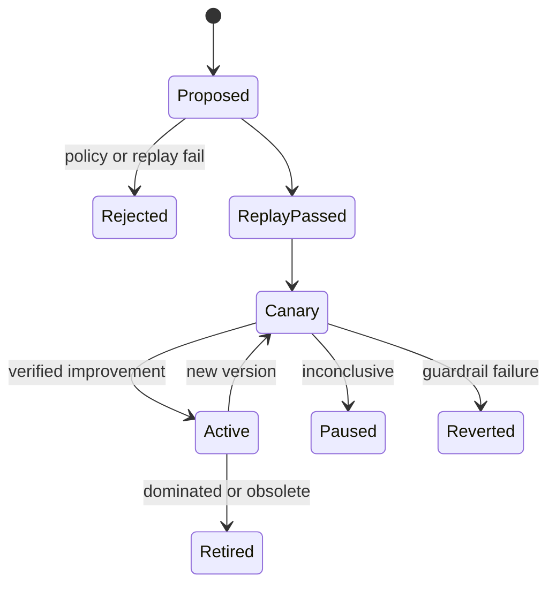

# Life Manager Open-Source Money Loop Design

## 0. Decision

Life Manager ultimately contains one revenue system, not one harness per marketplace. The active
delivery slice is now **Upwork only**. Coconala continues running independently and is neither an
Upwork dependency nor an Upwork capacity source. Fiverr, LinkedIn, Mercor, TELUS Digital,
Welocalize, uTest, Prolific, Outlier and Babel Audio stay frozen until Upwork closes one real
proposal-to-received-payment path.

The target is an open-source, local-first agent that discovers demand, builds or selects Skills,
sells work, fulfills it, verifies delivery and payment, and reallocates effort toward the highest
verified net return. It minimizes human intervention; it does not replace identity, biometrics,
CAPTCHA, tax, payout or genuinely human-only work when the provider requires those acts.

Dais has stated that the operating accounts have special approval for the intended Upwork and
Coconala automation. That authorization is an input to the capability registry, not a reason to
force those lanes into read-only mode. Public OSS installations start with no private approval and
must establish their own action-level authorization receipts.

This document changes design and implementation order only. It does not start, stop or modify the
current Coconala runtime. `skills/earn/gig/TODO.md` remains the production-repair SSOT.

The Upwork account bootstrap uses the owner's normal email/password flow. It MUST NOT choose Google,
Apple or another social-login button. It creates an account only when the owner email has no Upwork
account; otherwise it signs into the existing account to avoid duplicate-account creation. Every
adapter refinement follows authenticated observed Upwork state, not a speculative cross-provider
abstraction.

Current bootstrap state: the owner confirmed no prior Upwork account. A new freelancer account was
created through Continue with Email, its verification email was completed, and a fresh normal
email/password login returned `/nx/create-profile/` with the same owner identity twice. No
Google/Apple/social-login route was used. U1 and U2 are closed; U3 factual profile onboarding is the
first incomplete outcome.

U3 is saved through every required factual field except the authentic owner profile photo. Upwork's
authoritative validation reports only `Add a profile photo.` An AI-generated Coconala headshot and a
GitHub logo avatar are explicitly ineligible. U3 cannot close until an authentic owner headshot is
uploaded, the review succeeds, and the published profile and availability are read back.

## 1. Goal, objective and boundaries

### 1.1 Goal

Build a portfolio agent that repeatedly performs:

```text
demand → qualified offer → sale → verified fulfillment → received money
       → attributed economics → one bounded improvement → repeat
```

The first portfolio outcome gate is USD 10,000 verified net monthly revenue. The long-range gate is
JPY 10,000,000 verified net monthly revenue. Neither is an income promise.

### 1.2 Objective function

The allocator maximizes long-run verified contribution, not gross proposal value:

```text
verified_net = received_gross
             - provider_fee
             - Connects_or_bid_cost
             - model_and_tool_cost
             - subcontractor_cost
             - refund_and_chargeback

portfolio_utility = expected_verified_net
                  - capital_at_risk
                  - deadline_and_refund_risk
                  - account_health_risk
                  - scarce_human_minutes_cost
```

Hard constraints always dominate the score: authorization, identity, customer confidentiality,
budget caps, delivery capacity, quality, effect idempotency and receipt integrity.

During the Upwork proof, `delivery capacity` means active Upwork contracts only. Coconala orders,
projects and stale Coconala talkroom states MUST NOT make an Upwork opportunity eligible or
ineligible. Portfolio-wide allocation begins only after Upwork receives its first real payment.

One-off revenue, repeat revenue and MRR remain separate. Missing evidence is `unknown`, not zero.
Only received payment plus actual cost evidence enters `verified_net`.

### 1.3 Human-minimized contract

Normal operation is autonomous. Human involvement is represented as a typed ceremony, never an
open-ended “please do the rest” handoff:

| Ceremony | Example | Resume evidence |
|---|---|---|
| `identity` | KYC, live interview, biometric or CAPTCHA | Provider state changed to verified |
| `financial` | Bank, tax or payout ownership | Official payout method ID/state |
| `physical_capture` | Required human voice, device or location observation | Bound source artifact hash |
| `client_reserved` | A client explicitly reserves a decision for a human | Client message/contract clause |

The scheduler continues all unrelated lanes while one ceremony waits. The optimizer measures both
net revenue and human minutes so that agent-doable work is preferred when expected economics are
otherwise equal.

### 1.4 Non-goals

- No second scheduler, second commerce ledger or second browser harness.
- No guaranteed-income or “everyone becomes a millionaire” claim.
- No identity impersonation or falsified experience, location, credentials or work receipts.
- No blind retries after an uncertain external effect.
- No revenue recognition from views, proposals, offers, balances, estimates or test payments.
- No self-modification of authorization, effect fences, receipt validation or accounting rules.
- No simultaneous implementation of ten markets before the preceding market closes its gate.
- No Google/Apple/social login for the owner Upwork account.
- No new cross-provider abstraction before the first Upwork proposal is submitted and read back.

## 2. Evidence and repository lessons

### 2.1 Existing Life Manager evidence

| Existing component | Reuse |
|---|---|
| `application_direct.py` | Discover, qualify, persist intent, apply and reconcile pattern |
| `reply_detector.py` | Changed-thread detection, durable inbox identity, concurrent bounded replies |
| `paid_direct.py` | Contract/order fulfillment and delivery owner pattern |
| `storefront_direct.py` | Inbound catalogue/storefront management |
| `connector_outbox.py` | SQLite intent/action lifecycle, lease, retry and dead-letter behavior |
| `application_effect_fence.py`, `project_effect_fence.py` | Exactly-once mutation fence |
| `project_ledger.py`, `work_event_projector.py` | Canonical project and work state |
| `category_bandit.py`, `experiment_evaluator.py` | Bounded allocation and keep/revert decisions |
| `gig_self_fix.py`, `selfimprove_consumer.py` | Evidence-bound repair proposal and execution |
| `apps/life-manager/lib/loop-adapter-registry.js` | `plan/execute/reconcile/verify/report` adapter contract |

The adapter registry focused suite passed 13/13 and the Founder CEO evaluator, bandit, registry,
rollback and scale suites passed 75/75 during design research. These results justify reuse; they do
not prove any new marketplace path.

### 2.2 External repositories: learn what, reject what

| Repository | Learn | Reject |
|---|---|---|
| [OpenClaw@4c866a9](https://github.com/openclaw/openclaw/tree/4c866a9) | Skill discovery diagnostics; durable cron lease and interrupted-owner recovery | Replacing Life Manager or adding another resident agent |
| [OpenAI Agents JS@a47c6ee](https://github.com/openai/openai-agents-js/tree/a47c6ee) | Deferred Skill discovery, call/result correlation, tool guardrails and tracing | Provider policy or commerce state delegated to prompts |
| [Temporal TS samples@69c5360](https://github.com/temporalio/samples-typescript/tree/69c5360) | Reverse-order Saga compensation and recoverable workflow identity | A Temporal service dependency before local SQLite fails |
| [Argo Rollouts@9f8d111](https://github.com/argoproj/argo-rollouts/tree/9f8d111) | `Successful/Failed/Inconclusive`, canary pause, abort and rollback window | Kubernetes as the local runtime |
| [CloakBrowser@7b08984](https://github.com/CloakHQ/CloakBrowser/tree/7b0898497626153a76ce3fd07fbba9b86ca317bc) | Persistent authorized sessions, Playwright surface, CDP input and browser isolation | Treating transport reliability as authorization |
| [browser-use@85ddbfe](https://github.com/browser-use/browser-use/tree/85ddbfedf609166b2d2c76c3d80506649fee82a9) | Serializable history, page fingerprints, loop detection and recovery | Replacing CloakBrowser or trusting model-declared success |
| [upwork/python-upwork@a8d8c1a](https://github.com/upwork/python-upwork/tree/a8d8c1a349d4331b07d57e60c95cb929e37a68fc) | Client/auth fixture shape; its inspected suite passed 116/116 | Deprecated OAuth1 SDK as a runtime dependency |
| [AIHawk@79155b5](https://github.com/feder-cr/Jobs_Applier_AI_Agent_AIHawk/tree/79155b52faccfbd19b834680af285eac70dd2df4) | Profile, resume and generated-artifact organization | Interactive auto-apply runtime without authoritative readback |
| [FiverrAutomation@131f3cf](https://github.com/OminousIndustries/FiverrAutomation/tree/131f3cf9e13eb5edbeb397f32fcb87625a3b6858) | Negative example: why effect identity and readback are mandatory | Fixed coordinates, OCR success guesses and unverified Deliver clicks |

The Agent Skills format supplies a portable directory with at least `SKILL.md`: [Agent Skills
specification](https://agentskills.io/specification). Life Manager adds a machine-readable manifest
and workflow next to it rather than inventing a second Skill format.

### 2.3 Provider evidence and authorization precedence

Public rules are the safe open-source default. Account-specific or project-specific written
approval may authorize more, but only for the named account, action, transport, jurisdiction and
terms version.

| Provider | Public evidence used by default installations | Design consequence |
|---|---|---|
| Upwork | [Automation policy](https://support.upwork.com/hc/en-us/articles/43342677368467-Use-bots-and-other-automation-properly) directs automation users to request an API key. [GraphQL docs](https://www.upwork.com/developer/documentation/graphql/api/docs/index.html) expose scoped read/write operations. | Dais's special approval enables the recorded actions; API is preferred and approved CloakBrowser fills authorized UI gaps. |
| Fiverr | [Community Standards](https://help.fiverr.com/hc/en-us/articles/32242973123985-Our-Community-Standards) reject unauthorized access and automated mass messaging. [AI guidelines](https://help.fiverr.com/hc/en-us/articles/34998793899665-Using-AI-on-Fiverr-Guidelines-for-freelancers-and-clients) preserve freelancer accountability. | Record exact approval before external automation; reuse official Personal Assistant/Auto-reply where useful, not as a human handoff. |
| LinkedIn | [User Agreement §8.2](https://www.linkedin.com/legal/user-agreement) rejects unauthorized bots, scraping and messages. | Only recorded approved/API actions become effects; otherwise it remains a lead source. |
| Mercor | [AI interview guidance](https://talent.docs.mercor.com/support/ai-interview) restricts LLM-generated interview performance. | Agent handles discovery, profile assets, scheduling and post-hire work only to the exact approved boundary; identity/interview stays a ceremony when required. |
| Prolific | [Participant AI policy](https://participant-help.prolific.com/en/articles/445029-can-i-use-ai-assistance-tools-in-my-submission) allows AI only when the researcher asks. | Permission is study-specific, not account-wide. Eligible studies may become agent lanes; others are mechanically excluded. |
| Outlier | [Community Guidelines](https://outlier.ai/legal/community-guidelines) require work without bots/scripts unless specifically required. | Project-specific authorization is mandatory; never infer it from general account access. |
| TELUS Digital | Current job descriptions include assessment, identity verification and human judgment. | Split agent-doable preparation/administration from any irreducible human judgment and measure net per human minute. |
| uTest | [Tester Guidelines](https://www.utest.com/utest-guidelines) impose cycle confidentiality. | Use an isolated project workspace and exact cycle permission; never publish customer data or fixtures. |
| Babel Audio | [Contributor jobs](https://www.babel.audio/jobs) include human voice capture. | The agent may source, schedule, validate and submit artifacts; required human voice is a typed physical-capture ceremony. |
| Welocalize | Public careers/legal/job surfaces do not establish one global automation boundary. | Resolve authorization per project and task type before mutation. |

Social posts and screenshots are opportunity hypotheses only. Claimed earnings never enter the
ledger without provider and payout receipts.

## 3. Capability and authorization model

### 3.1 Action-level receipt

Every external action resolves from this precedence:

```text
project-specific written approval
  > account-specific special approval
  > official API scope
  > current public provider rule
  > unknown
```

An authorization receipt is scoped by:

```text
(provider, account, action, transport, jurisdiction,
 terms_version, evidence_hash, issued_at, expires_at)
```

It contains no credential. Private evidence lives outside the repository. The public manifest only
declares the schema and safe defaults.

### 3.2 Runtime states

| State | Meaning | Runtime behavior |
|---|---|---|
| `approved_api` | Named API scope authorizes the action | Autonomous effect behind the shared fence |
| `approved_browser` | Special/project approval authorizes browser execution | Autonomous CloakBrowser effect behind the same fence |
| `approved_assisted` | Agent may assist but an explicit human act is required | Produce a typed ceremony and resume from provider readback |
| `denied` | Current evidence prohibits the action | Do not execute or repeatedly retry |
| `unknown` | No valid evidence | Research and read-only probe only |

No agent or self-improvement Skill may create, broaden or renew its own authorization receipt.

## 4. Full architecture



### 4.1 Local product setup

The installer performs one bounded ceremony:

1. Create owner-only runtime directories and isolated browser profiles.
2. Import or create the owner's factual profile, portfolio and deliverable assets.
3. Connect one provider at a time through its normal login/KYC/payout flow.
4. Record action-level authorization without storing proof or secrets in Git.
5. Configure hard caps: spend, Connects/bids, concurrent jobs, minimum margin and human minutes.
6. Run a read-only capability probe and produce an account health receipt.
7. Generate only service packages that installed Skills can fulfill and verify.
8. Start the first canary with one external effect at a time.

### 4.2 Market Factory

Every market passes the same gates. The factory creates no provider code until the previous gate
has evidence:

```text
research
→ authorization matrix
→ authenticated read-only probe
→ normalized opportunity
→ eligible offer fixture
→ one canary sales effect
→ conversation/contract readback
→ one fulfilled job
→ delivery readback
→ payment and payout receipt
→ three-job replay
→ active portfolio lane
```

The generic adapter contract is:

```text
discover() -> Opportunity[]
inspect(opportunity_id) -> OpportunityDetail
plan_effect(action, payload) -> EffectIntent
reconcile(intent) -> ProviderState
execute(intent) -> TransportAck
readback(intent) -> ProviderReceipt
list_projects() -> ProjectState[]
list_payments() -> PaymentState[]
```

Adapters own transport, selectors/API schema and provider normalization. The kernel owns eligibility,
pricing bounds, capacity, intent, QA, ledger, learning and reporting.

### 4.3 Sales loop

```text
discover → inspect → eligibility → expected economics → tailored offer
→ persist intent → reconcile → apply/message → official readback
→ negotiate → contract readback
```

The system never sprays proposals. It applies whenever the measured expected utility is positive,
capacity exists, the deliverable is provable and the action is authorized. Rate is an output of
economics and account health, not an arbitrary desire for maximum clicks.

### 4.4 Fulfillment loop

Each sellable package binds requirements to installed Skills before sale:

```text
contract scope
→ immutable project workspace
→ execution workflow
→ artifact hashes and provenance
→ independent QA
→ revision if needed
→ delivery intent
→ provider delivery readback
```

The builder cannot approve its own artifact. Private client material remains in owner-only project
storage and is excluded from public fixtures, prompts not authorized for that data, logs and
Telegram.

### 4.5 Exactly-once effect kernel

Every mutation uses:

```text
authorization receipt
→ immutable intent(effect_key, payload_hash, source_identity)
→ read-only reconcile
→ at most one external effect
→ authoritative provider readback
→ canonical receipt
→ ledger projection
```

An HTTP success, DOM click or model claim is not success. A crash after a possible effect enters
`reconcile_unknown`; it never causes a blind retry.

### 4.6 Skill Factory

A Skill bundle is immutable and versioned:

```text
skills/<name>/SKILL.md
skills/<name>/skill.manifest.json
skills/<name>/workflow.json
skills/<name>/tests/
```

Lifecycle:



The factory may compose existing Skills before creating code. It may change offer copy, price within
bounds, category allocation, schedule and workflow ordering. It may not mutate authorization,
identity, accounting, receipt or effect-fence rules.

### 4.7 Portfolio CEO

The CEO chooses one next action from all active lanes:

1. Protect deadlines, revisions, account health and already-paid work.
2. Reconcile unknown external effects before creating new ones.
3. Complete the highest expected verified-net work within capacity.
4. Acquire the highest expected-utility eligible opportunity.
5. Run one bounded experiment when the causal window is complete.
6. Build or repair one Skill only when an observed bottleneck has no existing Skill solution.
7. Retire dominated, unprofitable or authorization-expired lanes.

This is the general money-maximizing agent: not an unconstrained model, but a durable portfolio
allocator whose rewards come only from external receipts.

## 5. Market sequence

Markets are completed one at a time. The default queue is deterministic; after Upwork closes its
three-job gate, the CEO may reorder the remaining queue only from measured opportunity, margin,
authorization and human-minute evidence.

| Order | Market | Intended lane | Unique lesson / Skill |
|---:|---|---|---|
| 0 | Coconala | Existing full sales/fulfillment/payment loop | Reference effect fence, inbox, paid project, receipt and learning |
| 1 | Upwork | First complete new autonomous adapter | Outbound proposals, Connects economics, contract/milestone lifecycle |
| 2 | Fiverr | Inbound catalogue plus custom offers | Storefront/Gig experiments, inquiry qualification, order/revision lifecycle |
| 3 | LinkedIn | Lead discovery and approved outreach to off-platform service sales | Relationship graph, lead qualification, CRM attribution |
| 4 | Mercor | Role matching and approved post-onboarding work | Resume/role matching, scheduling, identity ceremony boundary |
| 5 | Welocalize | Project-specific language/data work | Project authorization, locale QA, heterogeneous task normalization |
| 6 | TELUS Digital | Assessor/data projects with human-minute accounting | Human-assisted workflow packets and evidence-bound submission |
| 7 | uTest | Confidential testing cycles | Isolated client workspace, reproduction evidence, bug-report QA |
| 8 | Prolific | Study-specific eligible tasks | Per-study AI permission and short-task profitability |
| 9 | Outlier | Project-specific authorized AI work | Rubric-bound production and strict provenance |
| 10 | Babel Audio | Human voice/data contribution | Physical-capture ceremony, audio QA and submission receipts |

Each market may finish as `active`, `assisted`, `denied` or `unprofitable`. A denial or negative
margin is a valid completed experiment; it is not a reason to weaken the kernel.

## 6. Upwork reference adapter

Upwork is the first proof that the Coconala kernel generalizes.

```mermaid
flowchart LR
  J[Official job receipt] --> Q[Qualification and margin]
  Q --> P[Proposal intent and effect]
  P --> PR[Proposal ID and Connects readback]
  PR --> M[Message and negotiation]
  M --> C[Offer and contract]
  C --> W[Skill workflow]
  W --> QA[Artifact QA]
  QA --> D[Milestone delivery]
  D --> PAY[Payment, fee and payout]
  PAY --> B[Category/client/price bandit]
```



Required Upwork receipts are job ID, proposal ID, Connects before/after, message/story ID, offer ID,
contract ID, milestone/submission ID, transaction/fee ID and payout availability. Browser and API
effects share the same effect identity, so transport fallback cannot duplicate an action.

## 7. Self-improvement and promotion

An evaluation window returns exactly one of:

- `insufficient_evidence`
- `keep`
- `pause`
- `revert`
- `retire`

Every application, conversation, contract, artifact, delivery and payment is attributed to a Skill
and strategy version. Only one variable changes per canary. A guardrail failure immediately pauses
new acquisition and preserves already-paid fulfillment. Code changes require fixture replay, focused
tests, immutable release, canary and rollback receipt before promotion.

The agent improves in this order:

1. Fix failed readback or duplicate-risk defects.
2. Improve fulfillment quality and delivery time.
3. Improve qualification and close rate.
4. Improve price and package mix.
5. Reallocate across categories and markets.
6. Compose existing Skills.
7. Create a new Skill only when evidence proves a missing capability.

## 8. Open-source product boundary

The repository includes source, schemas, safe provider templates, redacted fixtures, replay tests,
installer and local operating documentation. It excludes credentials, browser profiles, customer
content, real proposal bodies, identity documents, payout details and runtime ledgers.

Every installer owns their accounts and authorization. Safe public defaults are `unknown`; a local
authorization receipt enables approved actions. The product is reproducible automation, not a
promise of earnings.

## 9. Stage gates

| Gate | Acceptance evidence |
|---|---|
| G0 continuity | Coconala release/TODO remain unchanged while development tests pass |
| G1 authorization | Private action-level receipts exist and public defaults remain safe |
| G1A Upwork identity | Normal owner email/password flow returns the same authenticated Upwork identity twice; no social-login route is used |
| G2 Upwork discovery | One authenticated official job normalizes with zero mutation |
| G3 Upwork proposal | One intent, one proposal, proposal ID and Connects readback |
| G4 Upwork contract | Message, offer and active contract IDs reconcile |
| G5 Upwork delivery | Artifact QA, one delivery effect and official submission state |
| G6 first cash | Received payment, fee, cost and payout evidence reconcile to the project |
| G7 repeatability | Three independent paid Upwork jobs; zero blind duplicate effects |
| G8 second market | Fiverr reaches one verified payment without kernel duplication |
| G9 market factory | A third market is added from templates without changing kernel contracts |
| G10 learning | One strategy/Skill canary produces an evidence-backed keep or revert |
| G11 USD 10k | Complete sources prove USD 10,000 verified monthly net |
| G12 JPY 10m | Provider and bank sources prove JPY 10,000,000 verified monthly net |
| G13 replication | A clean third device completes setup and one authorized receipt path |

### 9.1 Upwork live-path test matrix

| To-Be | Verification | Cover |
|---|---|---|
| Email account bootstrap selects existing-login or signup without duplication | Authenticated identity and account-state receipt | Required |
| Profile contains only factual owner data and is application-ready | Official profile completeness readback | Required |
| Discovery reflects current Upwork state | Same job IDs across two authenticated reads | Required |
| Qualification ignores Coconala runtime state | Upwork active-contract count and provider-scoped ledger query | Required |
| Proposal submits at most once | Proposal ID and Connects before/after, then zero-delta replay | Required |
| Negotiation creates no duplicate message | Official story/message IDs across replay | Required |
| Contract, delivery and money reconcile | Contract ID, submission ID, transaction ID and actual fee/cost evidence | Required |

| E2E item | Value |
|---|---|
| UI change | Yes: external Upwork signup/login/profile/application workflow |
| Conclusion | Maestro not required; authenticated CloakBrowser E2E and official Upwork readback are mandatory because this is not an iOS UI path |

## 10. Scenario and contrary case

| Scenario | Result |
|---|---|
| Worst | A market proves denied, technically inaccessible or negative-margin; it is retired with no duplicate effects and the next market is tested. |
| Base | Upwork and Fiverr produce repeat paid work while assisted markets improve net per human minute. |
| Best | Several independent lanes reach capacity-safe positive contribution and the CEO reallocates toward USD 10k then JPY 10m gates. |

The strongest argument for implementing all ten adapters immediately is faster market coverage. It
is rejected because ten unproved transports hide whether demand, conversion, fulfillment or payment
is broken. One complete market at a time produces reusable evidence.

The most likely way this design is wrong is that Upwork's close rate or fulfillment margin is lower
than expected. The correction is automatic portfolio reallocation after the first complete payment
windows, not protecting Upwork as a permanent favorite.

## 11. Implementation boundary

The ordered atomic plan is
`docs/superpowers/plans/2026-08-22-life-manager-gig-economy-loop.md`. Only its first unfinished task
is active. Each coding slice targets at most three files and about 100 changed production/test lines;
larger slices are split before execution.
