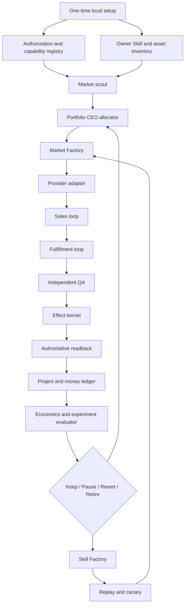
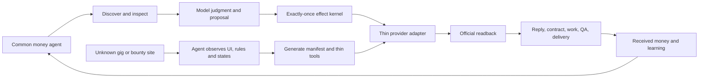
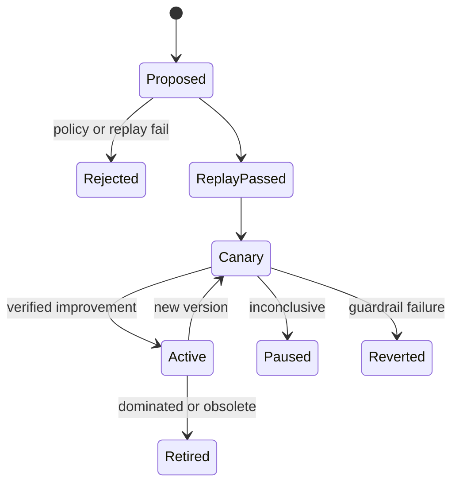
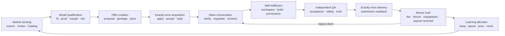

# Life Manager Open-Source Money Loop Design

## 0. Decision

Life Manager ultimately contains one revenue system, not one harness per marketplace. The active
delivery slice starts with **Upwork**, while Coconala is the proven reference implementation. Upwork
must close one real proposal readback before another marketplace mutation lane opens, but read-only
research and thin-adapter generation for other gig and bounty markets may proceed earlier. After that
receipt, the same resident agent may activate additional zero-spend canaries while Upwork continues
toward one complete calendar month at USD 10,000 verified net received. A new market never receives a
new decision brain.

The target is an open-source, local-first agent that discovers demand, builds or selects Skills,
sells work, fulfills it, verifies delivery and payment, and reallocates effort toward the highest
verified net return. It minimizes human intervention; it does not replace identity, biometrics,
CAPTCHA, tax, payout or genuinely human-only work when the provider requires those acts.

Dais has stated that the operating accounts have special approval for the intended Upwork and
Coconala automation. That authorization is an input to the capability registry, not a reason to
force those lanes into read-only mode. Public OSS installations start with no private approval and
must establish their own action-level authorization receipts.

This document changes design and implementation order only. It does not start, stop or modify the
current Coconala runtime. `skills/earn/gig/TODO.md` remains the production-repair SSOT.

The Upwork account bootstrap uses the owner's normal email/password flow. It MUST NOT choose Google,
Apple or another social-login button. It creates an account only when the owner email has no Upwork
account; otherwise it signs into the existing account to avoid duplicate-account creation. Every
adapter refinement follows authenticated observed Upwork state, not a speculative cross-provider
abstraction.

Current bootstrap state: the owner confirmed no prior Upwork account. A new freelancer account was
created through Continue with Email, its verification email was completed, and a fresh normal
email/password login returned `/nx/create-profile/` with the same owner identity twice. No
Google/Apple/social-login route was used. U1 and U2 are closed; U3 factual profile onboarding is the
first incomplete outcome.

U3 is closed. The authentic owner headshot is attached and Upwork reports `Your profile is ready!`.
Published profile `~01f5fe272d6df34084` reads back Status Online, More than 30 hrs/week and 40%
completion. Identity remains Unverified and Connects is 0; U4 must observe a real proposal entry to
determine whether either state is a submission gate before money is spent.

U4 is closed with a zero-effect live receipt. The observed proposal entry requires 18 Connects while
the account has 0 and presents `Buy Connects to apply`; no identity-verification gate appeared at
that entry. Search and detail fields are now grounded in live Upwork DOM rather than inferred provider
schemas. U5 performs two independent discoveries before any Connects purchase decision.

U5 is closed: two independent reads of the same recency query returned the same ordered ten job IDs.
Saved jobs, proposals, messages, Connects spend and payments remained zero. U6 may now qualify one
live job, but it must use only installed Skills and Upwork-owned capacity; Coconala activity is not
part of the capacity calculation.

U6/U7 proved qualification, proposal freezing and effect fencing on job
`~022091070478975551162`, but the job is **parked, not the first acquisition target**. It requires 26
Connects, already has 50+ proposals and asks a new 40%-complete profile with no Upwork history to win
a broad $3,000 build. Positive modeled margin did not prove first-contract probability. Treating its
Connects purchase as the next outcome was a sequencing error. The immutable payload
`9fab22a29ea169632f30c3d1a22597c1091ecb97a2897c987ac788ce1d110d19` remains retained for later
requalification; no purchase, proposal, message, contract or payment effect occurred.

U8 is closed. Upwork publicly reads back `Applied AI / AI Agent` at Mitsubishi UFJ Information
Technology, Ltd., April 2025–Present, with the sanitized factual description. The official Find Work
progressbar changed from 40% to `aria-valuenow=70` / `70% completed`; no proposal, Connects or
payment effect occurred. U9 is in progress. Portfolio proof 1, `Life Manager — Open-Source AI Agent`,
is publicly readable as project `2091143267699150848`; its bound image SHA-256 is
`ed3cef563fc2c43603f82517a48330758f1917b679f96c9ff6ac11bbff4e5136`, and the official Find Work
progressbar changed from 70% to `aria-valuenow=75` / `75% completed`. Portfolio proof 2,
`Life Manager iOS — Interactive UX Prototype`, is publicly readable as project `2091143845069127680`;
its bound image SHA-256 is `fe867ffd64ef8d055a0b326eefa641aa919a67a77cba6f9db8cc497c07eb4e6d`,
and the official progressbar then read `aria-valuenow=80` / `80% completed`. Portfolio proof 3,
`Daily Affirmations — Published iOS App`, is publicly readable as project `2091144398831636480`;
its bound image SHA-256 is `13746c887768c85292980c7a7068396b935bad81e355d57e932f7e538344ef2d`,
and the official progressbar then read `aria-valuenow=85` / `85% completed`. GitHub linking was not
used because no GitHub web credential or session exists and resetting the account would disrupt existing
repository operations. Instead, the factual second Employment History item, `Marketing Intern` at A10 Lab,
January 2020–January 2021, is publicly readable and moved official completion to
`aria-valuenow=95` / `95% completed`. U9 is closed: the factual `EEG and Machine Learning Research`
Other Experience item is publicly readable with NAIST/ATR, April 2024–April 2026, EEG, machine
learning and mind-wandering detection preserved exactly. The official Find Work progressbar now reads
`aria-valuenow=100` / `100% completed`. The main Upwork path next searches for and applies to a
small paid job with bounded scope, low competition and delivery in one to three days. The unfinished
Project Catalog project remains a private draft. Under the locked zero-spend policy it now becomes an
inbound bootstrap gate alongside invitations and direct offers. For each qualified public job
the loop opens the proposal surface, records the exact Connects requirement, and submits immediately
when authorized free Connects capacity is sufficient. Freelancer Plus, Availability Badge and
proposal boosting are not prerequisites. With Connects purchasing permanently disabled, the loop
MUST continue read-only discovery, candidate aging,
qualification, factual proposal sealing, onboarding-reward inspection, inbox/invitation polling and
Project Catalog inbound acquisition so a zero balance never blocks all acquisition work.

U10–U12 are now closed for first candidate `~022091106411892491962`, a $15 fixed-price
20–30 minute student usability test posted two hours before observation. The owner evidence matches
all explicit gates: current NAIST master's student, age 24, English-capable, AI-tool user, and willing
to share screen/audio for the recorded session. Official job readback showed 10–15 proposals, zero
interviews, verified payment and phone, seven required Connects, and zero available Connects. Connects
History has zero balance and zero transactions; the account UI exposes no free onboarding reward or
monthly grant, while Buy Connects offers only 100 for $15 plus tax. The exact $15 proposal and five
screening answers are frozen at SHA-256
`c37eed9c7a41a712f373504ea1a0555eb6be4a60b4f772763c64d8899c68e926` with no unsupported
claims or attachments. Submission still needs seven Connects; no proposal effect occurred. U13 now
keeps this and at least two backup applications submission-ready while wallet authority is absent.
The official Proposals and Offers readback also shows Offers 0, Invites 0, Active proposals 0 and
Submitted proposals 0; the Invites tab is empty and no educational Connects reward banner is exposed.
There is therefore no current zero-Connect submission path for this account. Free monthly Connects
are offer-dependent rather than a guaranteed refill on a known date; the account's official Connects
history is the only acceptance source for a grant. Publishing a Project Catalog listing does not
create proposal capacity, but it lets clients purchase a bounded service without a freelancer proposal;
therefore it is a distinct zero-Connect acquisition path rather than a prerequisite for outbound jobs.

The proposal effect kernel remains ready before live execution. Under the zero-spend policy, the
active work is to re-read the first candidate, mark it stale if its official state changes, maintain at
least three independently qualified backup candidates, seal one factual proposal per live candidate,
and poll Connects history, invitations and messages without mutation. It persists the full canonical proposal and
Connects pre-state, admits one concurrent submitter through an atomic compare-and-set, re-hashes the
durable body before effect, and verifies only a matching official proposal plus Connects post-state.
Timeout or lost-ack without readback remains `reconcile_unknown` and cannot resend. Live submit and
live replay remain intentionally unclaimed until the replacement first-job candidate passes the new
bootstrap qualification gate.

The production read-only browser provider is implemented. It uses the hidden-target helper and the
dedicated `gig-upwork` profile; sharing the logged-in Coconala browser is forbidden. Live readback
previously proved balance 0, no Connects transactions, Offers 0, Invites 0, Active proposals 0 and
Submitted proposals 0. The five-minute provider contains no buy, billing, Plus or boost command.
Its missing production dependency is now explicit: `ai.anicca.life-manager-upwork-browser` owns the
existing authenticated profile on 9233 by reusing `launch_gig_browser.sh`; the provider names that
label. Native launchd has accepted the exact plist and release, but the host disk policy blocks the
browser before Chromium starts. The provider therefore keeps the last official inventory unchanged;
fresh 9233 readback remains open.
The dedicated label `ai.anicca.life-manager-upwork-free-loop` is loaded from immutable release
`c8d2a990351f02d72537d521c10faad2525b867c` at a 300-second interval. Two real wakes both exited
zero, updated only `observed_at`, reproduced identical official evidence hashes and emitted zero
stderr bytes; no proposal, Connects or payment effect occurred.

## 1. Goal, objective and boundaries

### 1.1 Goal

Build a portfolio agent that repeatedly performs:

```text
demand → qualified offer → sale → verified fulfillment → received money
       → attributed economics → one bounded improvement → repeat
```

The first portfolio outcome gate is USD 10,000 verified net received revenue in one complete calendar
month. The long-range gate is
JPY 10,000,000 verified net monthly revenue. Neither is an income promise.

### 1.2 Objective function

The allocator maximizes long-run verified contribution, not gross proposal value:

```text
recognized_cash(M) = sum(official payout rows with status=received and received_month=M)
                   - sum(post-payout refunds and chargebacks whose occurrence_month=M)

verified_net_received(M) = recognized_cash(M)
                         - Connects_or_bid_cost_charged_once_in_M
                         - model_and_tool_cost_charged_once_in_M
                         - subcontractor_cost_charged_once_in_M

portfolio_utility = expected_verified_net
                  - capital_at_risk
                  - deadline_and_refund_risk
                  - account_health_risk
                  - scarce_human_minutes_cost
```

Hard constraints always dominate the score: authorization, identity, customer confidentiality,
budget caps, delivery capacity, quality, effect idempotency and receipt integrity.

For the open-source Upwork bootstrap, `spend_cap_usd` is exactly `0`. The loop MUST NOT purchase
Connects, subscribe to Freelancer Plus, boost a proposal/profile or open a billing flow. It may submit
only when the official current free balance covers the exact sealed `connects_cost`, or when an
official invitation requires zero Connects. Insufficient balance keeps the candidate sealed and
continues discovery/reconciliation; it is not an error and never triggers a purchase fallback.

Zero-spend acquisition MUST run all provider-supported paths in this order: claim only account-visible
onboarding/education rewards, respond to qualified invitations at zero Connects, publish and monitor
one bounded Project Catalog service, accept qualified direct offers, then spend only granted or returned
Connects on a small public job. A normal public `Apply now` path is never classified as zero-cost unless
its official proposal surface explicitly reads back `connects_cost=0`.

During the Upwork proof, `delivery capacity` means active Upwork contracts only. Coconala orders,
projects and stale Coconala talkroom states MUST NOT make an Upwork opportunity eligible or
ineligible. Portfolio-wide allocation begins only after Upwork closes G11; first cash starts the
Upwork learning ladder but does not unlock another market.

Each received payout must equal its gross payment minus fee and every refund/chargeback occurring on
or before that payout. Those pre-payout adjustments are already inside the payout amount and are not
subtracted again; only later adjustments become separate negative revenue. The provider fee is also
never subtracted twice.
`Work in progress`, `In review`, `Pending` and `Available` remain operational pipeline fields only;
none is revenue. A payout received after the contract month enters the payout's received month. A
later refund or chargeback enters its actual later month as negative revenue without charging the
original execution cost twice. A transaction ID may belong to only one occurrence month.

One-off revenue, repeat revenue and MRR remain separate. Missing source windows, fees, payout IDs or
project joins are `unknown`, not zero. Only official payout `received` plus complete actual cost
evidence enters `verified_net_received` or the USD 10,000 gate.

### 1.3 Human-minimized contract

Normal operation is autonomous. Human involvement is represented as a typed ceremony, never an
open-ended “please do the rest” handoff:

| Ceremony | Example | Resume evidence |
|---|---|---|
| `identity` | KYC, live interview, biometric or CAPTCHA | Provider state changed to verified |
| `financial` | Bank, tax or payout ownership | Official payout method ID/state |
| `physical_capture` | Required human voice, device or location observation | Bound source artifact hash |
| `client_reserved` | A client explicitly reserves a decision for a human | Client message/contract clause |

The scheduler continues all unrelated lanes while one ceremony waits. The optimizer measures both
net revenue and human minutes so that agent-doable work is preferred when expected economics are
otherwise equal.

### 1.4 Non-goals

- No second scheduler, second commerce ledger or second browser harness.
- No guaranteed-income or “everyone becomes a millionaire” claim.
- No identity impersonation or falsified experience, location, credentials or work receipts.
- No blind retries after an uncertain external effect.
- No revenue recognition from views, proposals, offers, balances, estimates or test payments.
- No self-modification of authorization, effect fences, receipt validation or accounting rules.
- No simultaneous implementation of ten markets before the preceding market closes its gate.
- No Google/Apple/social login for the owner Upwork account.
- No speculative framework. Extract only behavior already proven by Coconala and Upwork, then require
  every later market to reuse it without kernel changes.

## 2. Evidence and repository lessons

### 2.1 Existing Life Manager evidence

| Existing component | Reuse |
|---|---|
| `application_direct.py` | Discover, qualify, persist intent, apply and reconcile pattern |
| `reply_detector.py` | Changed-thread detection, durable inbox identity, concurrent bounded replies |
| `paid_direct.py` | Contract/order fulfillment and delivery owner pattern |
| `storefront_direct.py` | Inbound catalogue/storefront management |
| `connector_outbox.py` | SQLite intent/action lifecycle, lease, retry and dead-letter behavior |
| `application_effect_fence.py`, `project_effect_fence.py` | Exactly-once mutation fence |
| `project_ledger.py`, `work_event_projector.py` | Canonical project and work state |
| `category_bandit.py`, `experiment_evaluator.py` | Bounded allocation and keep/revert decisions |
| `gig_self_fix.py`, `selfimprove_consumer.py` | Evidence-bound repair proposal and execution |
| `apps/life-manager/lib/loop-adapter-registry.js` | `plan/execute/reconcile/verify/report` adapter contract |

The adapter registry focused suite passed 13/13 and the Founder CEO evaluator, bandit, registry,
rollback and scale suites passed 75/75 during design research. These results justify reuse; they do
not prove any new marketplace path.

### 2.2 External repositories: learn what, reject what

| Repository | Learn | Reject |
|---|---|---|
| [OpenClaw@4c866a9](https://github.com/openclaw/openclaw/tree/4c866a9) | Skill discovery diagnostics; durable cron lease and interrupted-owner recovery | Replacing Life Manager or adding another resident agent |
| [OpenAI Agents JS@a47c6ee](https://github.com/openai/openai-agents-js/tree/a47c6ee) | Deferred Skill discovery, call/result correlation, tool guardrails and tracing | Provider policy or commerce state delegated to prompts |
| [Temporal TS samples@69c5360](https://github.com/temporalio/samples-typescript/tree/69c5360) | Reverse-order Saga compensation and recoverable workflow identity | A Temporal service dependency before local SQLite fails |
| [Argo Rollouts@9f8d111](https://github.com/argoproj/argo-rollouts/tree/9f8d111) | `Successful/Failed/Inconclusive`, canary pause, abort and rollback window | Kubernetes as the local runtime |
| [CloakBrowser@7b08984](https://github.com/CloakHQ/CloakBrowser/tree/7b0898497626153a76ce3fd07fbba9b86ca317bc) | Persistent authorized sessions, Playwright surface, CDP input and browser isolation | Treating transport reliability as authorization |
| [browser-use@85ddbfe](https://github.com/browser-use/browser-use/tree/85ddbfedf609166b2d2c76c3d80506649fee82a9) | Serializable history, page fingerprints, loop detection and recovery | Replacing CloakBrowser or trusting model-declared success |
| [upwork/python-upwork@a8d8c1a](https://github.com/upwork/python-upwork/tree/a8d8c1a349d4331b07d57e60c95cb929e37a68fc) | Client/auth fixture shape; its inspected suite passed 116/116 | Deprecated OAuth1 SDK as a runtime dependency |
| [AIHawk@79155b5](https://github.com/feder-cr/Jobs_Applier_AI_Agent_AIHawk/tree/79155b52faccfbd19b834680af285eac70dd2df4) | Profile, resume and generated-artifact organization | Interactive auto-apply runtime without authoritative readback |
| [FiverrAutomation@131f3cf](https://github.com/OminousIndustries/FiverrAutomation/tree/131f3cf9e13eb5edbeb397f32fcb87625a3b6858) | Negative example: why effect identity and readback are mandatory | Fixed coordinates, OCR success guesses and unverified Deliver clicks |

The Agent Skills format supplies a portable directory with at least `SKILL.md`: [Agent Skills
specification](https://agentskills.io/specification). Life Manager adds a machine-readable manifest
and workflow next to it rather than inventing a second Skill format.

### 2.3 Provider evidence and authorization precedence

Public rules are the safe open-source default. Account-specific or project-specific written
approval may authorize more, but only for the named account, action, transport, jurisdiction and
terms version.

| Provider | Public evidence used by default installations | Design consequence |
|---|---|---|
| Upwork | [Automation policy](https://support.upwork.com/hc/en-us/articles/43342677368467-Use-bots-and-other-automation-properly) directs automation users to request an API key. [GraphQL docs](https://www.upwork.com/developer/documentation/graphql/api/docs/index.html) expose scoped read/write operations. | Dais's special approval enables the recorded actions; API is preferred and approved CloakBrowser fills authorized UI gaps. |
| Fiverr | [Community Standards](https://help.fiverr.com/hc/en-us/articles/32242973123985-Our-Community-Standards) reject unauthorized access and automated mass messaging. [AI guidelines](https://help.fiverr.com/hc/en-us/articles/34998793899665-Using-AI-on-Fiverr-Guidelines-for-freelancers-and-clients) preserve freelancer accountability. | Record exact approval before external automation; reuse official Personal Assistant/Auto-reply where useful, not as a human handoff. |
| LinkedIn | [User Agreement §8.2](https://www.linkedin.com/legal/user-agreement) rejects unauthorized bots, scraping and messages. | Only recorded approved/API actions become effects; otherwise it remains a lead source. |
| Mercor | [AI interview guidance](https://talent.docs.mercor.com/support/ai-interview) restricts LLM-generated interview performance. | Agent handles discovery, profile assets, scheduling and post-hire work only to the exact approved boundary; identity/interview stays a ceremony when required. |
| Prolific | [Participant AI policy](https://participant-help.prolific.com/en/articles/445029-can-i-use-ai-assistance-tools-in-my-submission) allows AI only when the researcher asks. | Permission is study-specific, not account-wide. Eligible studies may become agent lanes; others are mechanically excluded. |
| Outlier | [Community Guidelines](https://outlier.ai/legal/community-guidelines) require work without bots/scripts unless specifically required. | Project-specific authorization is mandatory; never infer it from general account access. |
| TELUS Digital | Current job descriptions include assessment, identity verification and human judgment. | Split agent-doable preparation/administration from any irreducible human judgment and measure net per human minute. |
| uTest | [Tester Guidelines](https://www.utest.com/utest-guidelines) impose cycle confidentiality. | Use an isolated project workspace and exact cycle permission; never publish customer data or fixtures. |
| Babel Audio | [Contributor jobs](https://www.babel.audio/jobs) include human voice capture. | The agent may source, schedule, validate and submit artifacts; required human voice is a typed physical-capture ceremony. |
| Welocalize | Public careers/legal/job surfaces do not establish one global automation boundary. | Resolve authorization per project and task type before mutation. |

Social posts and screenshots are opportunity hypotheses only. Claimed earnings never enter the
ledger without provider and payout receipts.

## 3. Capability and authorization model

### 3.1 Action-level receipt

Every external action resolves from this precedence:

```text
project-specific written approval
  > account-specific special approval
  > official API scope
  > current public provider rule
  > unknown
```

An authorization receipt is scoped by:

```text
(provider, account, action, transport, jurisdiction,
 terms_version, evidence_hash, issued_at, expires_at)
```

It contains no credential. Private evidence lives outside the repository. The public manifest only
declares the schema and safe defaults.

### 3.2 Runtime states

| State | Meaning | Runtime behavior |
|---|---|---|
| `approved_api` | Named API scope authorizes the action | Autonomous effect behind the shared fence |
| `approved_browser` | Special/project approval authorizes browser execution | Autonomous CloakBrowser effect behind the same fence |
| `approved_assisted` | Agent may assist but an explicit human act is required | Produce a typed ceremony and resume from provider readback |
| `denied` | Current evidence prohibits the action | Do not execute or repeatedly retry |
| `unknown` | No valid evidence | Research and read-only probe only |

No agent or self-improvement Skill may create, broaden or renew its own authorization receipt.

## 4. Full architecture



### 4.1 Local product setup

The installer performs one bounded ceremony:

1. Create owner-only runtime directories and isolated browser profiles.
2. Import or create the owner's factual profile, portfolio and deliverable assets.
3. Connect one provider at a time through its normal login/KYC/payout flow.
4. Record action-level authorization without storing proof or secrets in Git.
5. Configure hard caps: spend, Connects/bids, concurrent jobs, minimum margin and human minutes.
6. Run a read-only capability probe and produce an account health receipt.
7. Generate only service packages that installed Skills can fulfill and verify.
8. Start the first canary with one external effect at a time.

### 4.2 Market Factory

Every market passes the same gates. The factory creates no provider code until the previous gate
has evidence:

```text
research
→ authorization matrix
→ authenticated read-only probe
→ normalized opportunity
→ eligible offer fixture
→ one canary sales effect
→ conversation/contract readback
→ one fulfilled job
→ delivery readback
→ payment and payout receipt
→ three-job replay
→ active portfolio lane
```

The generic adapter contract is:

```text
discover() -> Opportunity[]
inspect(opportunity_id) -> OpportunityDetail
plan_effect(action, payload) -> EffectIntent
reconcile(intent) -> ProviderState
execute(intent) -> TransportAck
readback(intent) -> ProviderReceipt
list_projects() -> ProjectState[]
list_payments() -> PaymentState[]
```

Adapters own transport, selectors/API schema and provider normalization. The kernel owns eligibility,
pricing bounds, capacity, intent, QA, ledger, learning and reporting.

### 4.2A Adapter compression law

Marketplace expansion becomes smaller with every proven provider. The resident agent owns one
commercial loop; provider adapters are replaceable I/O skins, not mini-products.



Directly reusable across every market are pagination and bounded snapshots, model-owned qualification/
pricing/proposals, leases and effect fencing, project/QA/delivery, received-cash accounting and funnel
learning. Provider-specific code is limited to authenticated transport, stable entity extraction,
form actions, official state/readback mapping, provider fees/currency and unavoidable signup/KYC/
payout ceremonies. Semantic fit, category routing, price and proposal content never enter provider
code. Fixed-format provider IDs, URLs, amounts and official states may be parsed mechanically.

| Provider generation | Intended maximum new production surface | Kernel change |
|---|---:|---|
| Coconala + Upwork | Source patterns to consolidate | Only deletion of proven duplication |
| Next market | At most 3 provider files / about 300 LOC | None |
| Third market | At most 2 provider files / about 150 LOC | None |
| Later market | One manifest plus exceptional transport glue / about 100 LOC | None |

Exceeding a target pauses that adapter and first identifies the missing common primitive; it never
justifies another scheduler, planner, ledger or provider-specific decision engine. For an unknown
market the agent performs `observe → map states → read-only replay → generate manifest → one canary
effect → official readback`. It completes ordinary signup/login itself. CAPTCHA, identity proof, tax,
payout ownership and legally human-only acts become typed resumable ceremonies. A new delivery Skill
is created only after an observed profitable opportunity cannot use existing Skills.

### 4.3 Sales loop

```text
discover → inspect → eligibility → expected economics → tailored offer
→ persist intent → reconcile → apply/message → official readback
→ negotiate → contract readback
```

The system never sprays proposals. It applies whenever the measured expected utility is positive,
capacity exists, the deliverable is provable and the action is authorized. Rate is an output of
economics and account health, not an arbitrary desire for maximum clicks.

### 4.4 Fulfillment loop

Each sellable package binds requirements to installed Skills before sale:

```text
contract scope
→ immutable project workspace
→ execution workflow
→ artifact hashes and provenance
→ independent QA
→ revision if needed
→ delivery intent
→ provider delivery readback
```

The builder cannot approve its own artifact. Private client material remains in owner-only project
storage and is excluded from public fixtures, prompts not authorized for that data, logs and
Telegram.

### 4.5 Exactly-once effect kernel

Every mutation uses:

```text
authorization receipt
→ immutable intent(effect_key, payload_hash, source_identity)
→ read-only reconcile
→ at most one external effect
→ authoritative provider readback
→ canonical receipt
→ ledger projection
```

An HTTP success, DOM click or model claim is not success. A crash after a possible effect enters
`reconcile_unknown`; it never causes a blind retry.

### 4.6 Skill Factory

A Skill bundle is immutable and versioned:

```text
skills/<name>/SKILL.md
skills/<name>/skill.manifest.json
skills/<name>/workflow.json
skills/<name>/tests/
```

Lifecycle:



The factory may compose existing Skills before creating code. It may change offer copy, price within
bounds, category allocation, schedule and workflow ordering. It may not mutate authorization,
identity, accounting, receipt or effect-fence rules.

### 4.7 Portfolio CEO

The CEO chooses one next action from all active lanes:

1. Protect deadlines, revisions, account health and already-paid work.
2. Reconcile unknown external effects before creating new ones.
3. Complete the highest expected verified-net work within capacity.
4. Acquire the highest expected-utility eligible opportunity.
5. Run one bounded experiment when the causal window is complete.
6. Build or repair one Skill only when an observed bottleneck has no existing Skill solution.
7. Retire dominated, unprofitable or authorization-expired lanes.

This is the general money-maximizing agent: not an unconstrained model, but a durable portfolio
allocator whose rewards come only from external receipts.

## 5. Market sequence

Markets are completed one at a time. The default queue is deterministic; after Upwork closes its
three-job gate it keeps scaling Upwork, and only after G11 may the CEO reorder the remaining queue
from measured opportunity, margin,
authorization and human-minute evidence.

| Order | Market | Intended lane | Unique lesson / Skill |
|---:|---|---|---|
| 0 | Coconala | Existing full sales/fulfillment/payment loop | Reference effect fence, inbox, paid project, receipt and learning |
| 1 | Upwork | First complete new autonomous adapter | Outbound proposals, Connects economics, contract/milestone lifecycle |
| 2 | Fiverr | Inbound catalogue plus custom offers | Storefront/Gig experiments, inquiry qualification, order/revision lifecycle |
| 3 | LinkedIn | Lead discovery and approved outreach to off-platform service sales | Relationship graph, lead qualification, CRM attribution |
| 4 | Mercor | Role matching and approved post-onboarding work | Resume/role matching, scheduling, identity ceremony boundary |
| 5 | Welocalize | Project-specific language/data work | Project authorization, locale QA, heterogeneous task normalization |
| 6 | TELUS Digital | Assessor/data projects with human-minute accounting | Human-assisted workflow packets and evidence-bound submission |
| 7 | uTest | Confidential testing cycles | Isolated client workspace, reproduction evidence, bug-report QA |
| 8 | Prolific | Study-specific eligible tasks | Per-study AI permission and short-task profitability |
| 9 | Outlier | Project-specific authorized AI work | Rubric-bound production and strict provenance |
| 10 | Babel Audio | Human voice/data contribution | Physical-capture ceremony, audio QA and submission receipts |

After G11, each later market may finish as `active`, `assisted`, `denied` or `unprofitable`. Before
G11, Upwork denial or negative margin pauses this design and exposes its evidence; it does not
automatically unlock the next market or weaken the kernel.

## 6. Upwork reference adapter

Upwork is the first proof that the Coconala kernel generalizes.

```mermaid
flowchart LR
  J[Official job receipt] --> Q[Qualification and margin]
  Q --> P[Proposal intent and effect]
  P --> PR[Proposal ID and Connects readback]
  PR --> M[Message and negotiation]
  M --> C[Offer and contract]
  C --> W[Skill workflow]
  W --> QA[Artifact QA]
  QA --> D[Milestone delivery]
  D --> PAY[Payment, fee and payout]
  PAY --> B[Category/client/price bandit]
```

### 6.1 First-contract acquisition policy

The first Upwork objective is one verified paid review, not maximum headline contract value and not
maximum application volume. The deterministic acquisition order is:

1. Add the required factual Employment History item and read back the required-profile baseline.
2. Publish three reusable portfolio proofs, then add only truthful optional items until the main
   profile reaches official 100% readback.
3. Complete account-visible free onboarding/education tasks and verify any Connects award in history.
4. Publish one narrow Project Catalog service and monitor qualified inbound orders/messages.
5. Monitor qualified invitations and direct offers, which require no purchased proposal capacity.
6. Discover recent jobs and prefer clear acceptance criteria, low proposal count, verified payment,
   client hiring history, low Connects and one-to-three-day delivery.
7. Maintain at least three live qualified candidates while free submission capacity is unavailable; re-read
   official job state before every proposed effect.
8. Freeze a tailored proposal only when the reusable proof matches the job; never deliver the
   client's complete solution as unpaid application work.
9. Use invitations or granted/returned Connects when present; never purchase acquisition capacity.
10. Submit each authorized proposal exactly once, then close contract, delivery, received payment and
   honest review before increasing price or scope.

The loop optimizes the measured funnel
`discovered → qualified → proposed → viewed → interviewed → hired → delivered → paid → reviewed`.
Ten qualified proposals without a view trigger a profile/first-lines/proof correction; they do not
automatically authorize more Connects spend. Project Catalog, invitations and proposals share the
same contract, delivery, payment and review receipts after acquisition.

### 6.1A Beginner-to-USD-10k operating ladder

The strategy assumes no prior reviews, invitations, repeat clients or referrals. It cannot guarantee
income; it runs staged evidence gates until cash reaches USD 10,000 or Upwork proves unprofitable.

| Stage | Objective | What the loop does | Exit evidence |
|---|---|---|---|
| Control plane | Restore trustworthy observation | Native Aqua owner verifies or restarts the existing browser job; one fresh provider wake reconciles account, Connects, Catalog, candidates, inbox, offers, contracts and finance | Complete official inventory; external effects 0 |
| 0 reviews → first cash | Buy trust with a small outcome, not unpaid work | Keep the approved $75 three-day API package live, retain three recent low-competition one-to-three-day candidates, tailor only evidence-backed proposals, and prioritize qualified Catalog orders, invitations and Direct Offers | One contract, independently verified delivery, honest review and official payout `received` |
| 1 → 3 paid reviews | Repeat the proven unit | Reuse the same Skill/package before adding categories, preserve fast response and delivery, ask only for an honest review, and prefer repeat work from satisfied clients | Three independent contract, delivery, payout and review identities with complete economics |
| Repeatable → USD 3k/month | Raise value without widening failure surface | Test one variable at a time across package, price, proof or proposal opening; keep the active-contract cap; retain only changes that improve received net without late work, revision or refund regressions | One complete month at least USD 3,000 verified net received |
| USD 3k → USD 10k/month | Scale the proven winner | Favor repeat clients and larger bounded milestones built from the winning Skill, add Catalog variants only for observed demand, and allocate capacity by received net per constrained delivery hour | One complete month at least USD 10,000 verified net received |

The allocator chooses ticket size from observed close rate, delivery time, revisions, fee and
adjustments; it does not forecast income from a preferred mix. Upwork's guidance supports a complete
profile, niche, tailored proposals, portfolio, feedback, repeat clients and specialized fixed-price
Catalog work. Qualification uses the displayed contract fee, not a universal percentage.

Sources: [beginner tips](https://www.upwork.com/resources/how-to-get-more-jobs-on-upwork), [Project Catalog](https://support.upwork.com/hc/en-us/articles/360057397533-Project-Catalog-for-freelancers), [fees](https://support.upwork.com/hc/en-us/articles/211062538-Freelancer-Service-Fees), [earnings statuses](https://support.upwork.com/hc/en-us/articles/211068418-How-to-track-the-status-of-your-earnings-on-Upwork).

### 6.2 Continuous application reconciliation

Upwork is one continuous state-reconciliation loop, not separate search and delivery scripts. Every
wake first reconciles existing work before creating new acquisition effects. The canonical proposal
states are:

```text
sealed → submitted → viewed → messaged/interviewing → offered → contracted
                    ↘ declined | archived | job_closed | platform_removed
submitted → withdrawn only through a separately authorized owner effect
any nonterminal read failure → unknown, never inferred as rejected or closed
```

Each state transition MUST bind `job_id`, `proposal_id` when assigned, official provider state,
`observed_at`, source surface, receipt hash and Connects delta/refund when exposed. A disappearance
from one surface is not terminal evidence: the loop cross-checks active/submitted proposals, the job
detail, messages, offers and contracts. It records `stopped_reason` only from an official terminal
readback; otherwise it records `unknown` and retries read-only reconciliation without resubmitting.

The single loop uses three cadences under one lease and one ledger:

| Cadence | Required reconciliation |
|---|---|
| Every 5 minutes | Submitted/active proposals, invitations, unread messages, offers and active contracts |
| Every 30 minutes | Refresh open jobs, age sealed candidates, replace closed/stale candidates and keep three submission-ready applications |
| Every 60 minutes | Free Connects history/refunds, contract deadlines, submitted work, payments, fees and payout availability; never purchase capacity |

Paid work, unread client messages, offers and `unknown` effects always preempt discovery. A terminal
proposal releases only acquisition capacity; it does not delete its evidence or count as revenue.
The loop reports each new terminal reason once and never withdraws, resubmits or spends Connects merely
because a proposal is old.

The first-job qualifier rejects a candidate if any of these hold: broad multi-week build, proposal
count above 20, unclear acceptance criteria, unsupported proof requirement, negative expected net,
delivery capacity unavailable, or paid acquisition required before the free bootstrap is complete.
It prefers a reusable micro-service that can be truthfully delivered from installed Skills within
one to three days. This rule is a bootstrap constraint; after three independent paid reviews, the
normal expected-verified-net allocator may select larger work.

Qualification, proposal strategy, negotiation, fulfillment planning and learning are model judgments,
not keyword/regex routing. Deterministic code only parses official machine fields, enforces money and
capacity limits, freezes payloads, fences effects and verifies receipts. The model receives the full
official job/client/thread/contract evidence, owner facts, installed Skill manifests, current capacity
and economics, then returns a schema-bound decision with cited evidence. Unsupported facts or a
deliverable not covered by an installed Skill force `skip` or `capability_gap`; they never trigger a
fabricated claim.

### 6.3 Upwork money-printer Skill system

The Upwork product is not a proposal helper. The existing launchd-owned Upwork loop owns the complete
commercial lifecycle continuously; Codex does not manually choose jobs, write proposals, reply,
negotiate, build, deliver or mark money. Login/signup/KYC are recoverable account ceremonies and may be
added later because the current dedicated profile is already authenticated.



One resident loop composes five bounded Skill families rather than creating another scheduler or
ledger:

| Skill family | Autonomous responsibility | Required terminal proof |
|---|---|---|
| `upwork-acquire` | Search current jobs, inspect full detail/client evidence, reconcile invites/offers/Catalog, qualify against installed Skills, keep the ready queue replenished, generate and seal truthful job-specific proposals, execute an authorized acquisition | Official job/order/invitation/offer identity; proposal or acceptance ID; exact Connects delta; replay effect 0 |
| `upwork-sell` | Detect and answer every new client message, ask only missing scope questions, negotiate profitable bounded terms, accept only supported work | Official message/story ID, offer terms hash and active contract ID; duplicate reply/accept 0 |
| `upwork-fulfill` | Compile the contract into an immutable project, select/compose installed delivery Skills, produce artifacts, run independent acceptance QA, revise when requested and deliver | Artifact/provenance hashes, verifier PASS, official submission/revision ID; duplicate delivery 0 |
| `upwork-money` | Reconcile contract transactions, fees, refunds, disputes, chargebacks and payouts without confusing earnings states with cash | Only official payout `received` enters revenue; Pending/Available excluded; later adjustments attributed once in occurrence month |
| `upwork-learn` | Attribute the entire funnel and unit economics to Skill/strategy versions, diagnose the current bottleneck, change one variable, keep/revert from later evidence and prioritize repeat clients | Evidence-backed keep/pause/revert plus complete discovered-to-received funnel |

`upwork-acquire` owns candidate replenishment. When fewer than three current submission-ready public
jobs remain, it searches the authenticated Upwork market, opens current details, asks the model to
select or skip, and atomically persists both the public evidence record and owner-only sealed proposal.
A static candidate JSON is a cache/output of this Skill, never a human-maintained input dependency.
The same wake may submit a newly sealed proposal only after a fresh official Connects read proves the
exact cost is covered and the effect fence is clear. The zero-spend bootstrap remains in force:
Connects purchase, Plus and boosting require a separately authorized money-policy change.

Work priority on every wake is `unknown effect → paid deadline/revision → unread client → offer/
contract → delivery/payment → acquisition → learning experiment`. A failure in discovery cannot stop
paid work; a failure in fulfillment pauses new acquisition before deadlines are endangered. The loop
runs indefinitely through launchd, uses bounded retries/backoff, retains durable state across restart,
and emits a fail-visible health receipt instead of silently becoming idle.



Required Upwork receipts are job ID, proposal ID, Connects before/after, message/story ID, offer ID,
contract ID, milestone/submission ID, transaction/fee ID and payout availability. Browser and API
effects share the same effect identity, so transport fallback cannot duplicate an action.

## 7. Self-improvement and promotion

An evaluation window returns exactly one of:

- `insufficient_evidence`
- `keep`
- `pause`
- `revert`
- `retire`

Every application, conversation, contract, artifact, delivery and payment is attributed to a Skill
and strategy version. Only one variable changes per canary. A guardrail failure immediately pauses
new acquisition and preserves already-paid fulfillment. Code changes require fixture replay, focused
tests, immutable release, canary and rollback receipt before promotion.

The agent improves in this order:

1. Fix failed readback or duplicate-risk defects.
2. Improve fulfillment quality and delivery time.
3. Improve qualification and close rate.
4. Improve price and package mix.
5. Reallocate across categories and markets.
6. Compose existing Skills.
7. Create a new Skill only when evidence proves a missing capability.

## 8. Open-source product boundary

The repository includes source, schemas, safe provider templates, redacted fixtures, replay tests,
installer and local operating documentation. It excludes credentials, browser profiles, customer
content, real proposal bodies, identity documents, payout details and runtime ledgers.

Every installer owns their accounts and authorization. Safe public defaults are `unknown`; a local
authorization receipt enables approved actions. The product is reproducible automation, not a
promise of earnings.

## 9. Stage gates

| Gate | Acceptance evidence |
|---|---|
| G0 continuity | Coconala release/TODO remain unchanged while development tests pass |
| G1 authorization | Private action-level receipts exist and public defaults remain safe |
| G1A Upwork identity | Normal owner email/password flow returns the same authenticated Upwork identity twice; no social-login route is used |
| G2 Upwork discovery | One authenticated official job normalizes with zero mutation |
| G2A Upwork bootstrap | Official 100% profile, three proof artifacts, Connects history readback and at least three live submission-ready candidates |
| G3 Upwork proposal | One bootstrap-qualified intent, one proposal, proposal ID and Connects readback |
| G4 Upwork contract | Message, offer and active contract IDs reconcile |
| G5 Upwork delivery | Artifact QA, one delivery effect and official submission state |
| G6 first cash | Received payment, fee, cost and payout evidence reconcile to the project |
| G7 repeatability | Three independent paid Upwork jobs; zero blind duplicate effects |
| G8 second market | After G11, Fiverr reaches one verified payment without kernel duplication |
| G9 market factory | A third market is added from templates without changing kernel contracts |
| G10 learning | One strategy/Skill canary produces an evidence-backed keep or revert |
| G11 Upwork USD 10k | One complete calendar-month source window proves at least USD 10,000 `verified_net_received`; Pending/Available are excluded and later chargebacks enter their occurrence month |
| G12 JPY 10m | Provider and bank sources prove JPY 10,000,000 verified monthly net |
| G13 replication | A clean third device completes setup and one authorized receipt path |

### 9.1 Upwork live-path test matrix

| To-Be | Verification | Cover |
|---|---|---|
| Email account bootstrap selects existing-login or signup without duplication | Authenticated identity and account-state receipt | Required |
| Profile contains only factual owner data and is application-ready | Official profile completeness readback | Required |
| First acquisition is zero-spend and review-oriented | 100% profile, three reusable proofs, free-reward inventory, one live Project Catalog service, invitation/direct-offer monitoring, three live qualified public-job candidates and no paid effect | Required |
| Discovery reflects current Upwork state | Same job IDs across two authenticated reads | Required |
| Discovery and ready-queue replenishment are loop-owned | With fewer than three ready candidates, one launchd wake searches current jobs, model-selects or skips with evidence, and atomically seals truthful proposals without manual candidate editing | Required |
| First-job qualification rejects high-competition broad builds | Bounded 1-3 day deliverable, proposals <=20, explicit acceptance and evidence-backed proof | Required |
| Qualification ignores Coconala runtime state | Upwork active-contract count and provider-scoped ledger query | Required |
| Proposal submits at most once | Proposal ID and Connects before/after, then zero-delta replay | Required |
| Applied work is continuously reconciled | Every official proposal ID maps to one current canonical state and last-observed receipt | Required |
| Stopped work has an evidence-backed reason | Declined, archived, job closed, platform removed or owner-withdrawn requires matching official readback; absence remains unknown | Required |
| Reconciliation preempts acquisition | Unread message, offer, paid deadline or unknown effect blocks a new proposal tick until reconciled | Required |
| Negotiation creates no duplicate message | Official story/message IDs across replay | Required |
| Contract, delivery and money reconcile | Contract ID, submission ID, transaction ID and actual fee/cost evidence | Required |
| USD 10k uses cash truth | Complete calendar-month window; only payout `received`; Pending/Available excluded; cross-month payout and later chargeback attributed once | Required |
| Resident operation survives restart and market drought | launchd restarts the same loop; durable lease/effect state resumes; paid work remains first; no-work wakes end healthy with a next wake rather than terminal success | Required |

| E2E item | Value |
|---|---|
| UI change | Yes: external Upwork signup/login/profile/application workflow |
| Conclusion | Maestro not required; authenticated CloakBrowser E2E and official Upwork readback are mandatory because this is not an iOS UI path |

## 10. Scenario and contrary case

| Scenario | Result |
|---|---|
| Worst | Upwork proves denied or negative-margin; effects stop safely and a separately approved design decides whether to change constraints or markets. |
| Base | Upwork reaches repeat paid work and climbs the received-cash ladder before the second market opens. |
| Best | Upwork closes the USD 10k gate with repeat clients and bounded high-value milestones, then the CEO generalizes the proven receipts. |

The strongest argument for implementing all ten adapters immediately is faster market coverage. It
is rejected because ten unproved transports hide whether demand, conversion, fulfillment or payment
is broken. One complete market at a time produces reusable evidence.

The most likely way this design is wrong is that Upwork's close rate or fulfillment margin is lower
than required for USD 10,000 within the fixed capacity and zero-spend policy. The loop must expose
that with complete funnel and cash evidence; it may not report a guarantee or substitute
Pending/Available for revenue. Changing the zero-spend constraint or opening another market requires
a separately authorized design change.

## 11. Implementation boundary

The ordered atomic plan is
`docs/superpowers/plans/2026-08-22-life-manager-gig-economy-loop.md`. Only its first unfinished task
is active. Each coding slice targets at most three files and about 100 changed production/test lines;
larger slices are split before execution.
