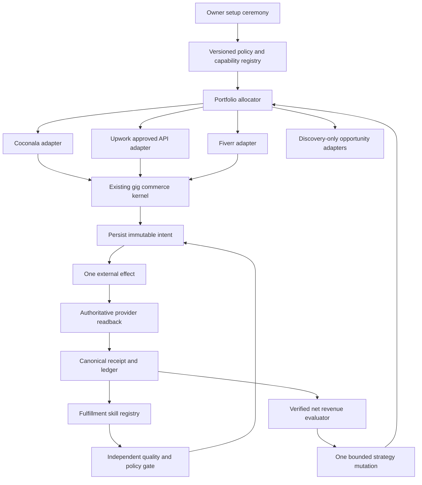

# Life Manager Gig Economy Loop Design

## 0. Decision

Life Manager does not gain a second money-making harness. The existing Coconala package under
`skills/earn/gig/` becomes the one commerce kernel, and every additional marketplace is a thin,
capability-gated adapter around that kernel.

The first new revenue surface is Upwork, but only after an approved API key and an exact capability
readback prove which actions the account may automate. Fiverr is the second candidate. LinkedIn is
discovery-only. Mercor, Prolific, Outlier, TELUS Digital, uTest, Welocalize and Babel Audio are not
autonomous execution lanes unless their current project terms explicitly authorize the proposed
automation.

This design preserves the current Coconala production loop. It does not deploy, enable, stop or
modify any runtime. The current Coconala repair order remains exclusively owned by
`skills/earn/gig/TODO.md`; this document must not move that cursor.

## 1. Goal and non-goals

### Goal

Build one local-first, open-source agent that repeatedly converts permitted marketplace demand into
verified net revenue, learns from verified outcomes, and adds new marketplace adapters without
duplicating the commerce engine.

The first portfolio gate is **USD 10,000 verified net monthly revenue**. The longer portfolio gate
is **JPY 10,000,000 verified net monthly revenue**. These are outcome gates, not forecasts or income
promises.

### Non-goals

- No guaranteed-income or “anyone becomes a millionaire” claim.
- No KYC, interview, biometric, CAPTCHA or identity impersonation.
- No scraping or messaging where the provider forbids unapproved automation.
- No counting proposals, offers, balances, test payments or estimates as revenue.
- No autonomous execution of work that a marketplace requires the participant to perform personally.
- No new workflow service, vector database, resident agent framework or second browser harness.
- No self-modification of policy gates, effect fences, receipt validation or accounting rules.

## 2. Evidence register

### 2.1 Existing system evidence

| Evidence | Observation | Consequence |
|---|---|---|
| `skills/earn/gig/README.md` | Four production lanes already share one browser, release system and official readback discipline. | Reuse the installed topology. |
| `skills/earn/gig/TODO.md` | Current Paid, Negotiate, Storefront and packaging failures are measured and ordered. | Do not divert its active cursor. |
| `project_ledger.py`, `application_effect_fence.py`, `work_event_projector.py` | Effect identity, durable fences and canonical work events already exist. | Extract interfaces only when the first adapter requires them. |
| `category_bandit.py`, `experiment_evaluator.py` | Bounded learning already exists. | Do not introduce a new optimizer before payment evidence. |
| Existing Freelancer adapter laboratory | Its focused contract suite passed 70/70 in the research checkout. | Reuse the adapter vocabulary, not a parallel runtime. |

### 2.2 Provider rules

| Provider | Primary evidence | Binding design consequence |
|---|---|---|
| Upwork | [Automation policy](https://support.upwork.com/hc/en-us/articles/43342677368467-Use-bots-and-other-automation-properly): “request an Upwork API key”; spam proposals and scraping remain prohibited. | API-first. No browser bot, scraping or proposal spray. Every mutation requires a discovered approved capability. |
| Upwork | [Freelancer service fee](https://support.upwork.com/hc/en-us/articles/211062538-Learn-about-the-Freelancer-Service-Fee): the contract fee is shown before proposal/offer and then fixed. | Store the observed contract fee; never use one global fee estimate as realized cost. |
| Fiverr | [AI guidelines](https://help.fiverr.com/hc/en-us/articles/34998793899665-Using-AI-on-Fiverr-Guidelines-for-freelancers-and-clients): AI must support, not replace, the freelancer's skill and effort. | AI-assisted fulfillment is allowed only with accountable quality/originality gates; raw generic output is not delivery. |
| LinkedIn | [User Agreement §8.2](https://www.linkedin.com/legal/user-agreement): unauthorized bots may not access services or send messages. | No autonomous outreach or scraping. Official integrations or owner-visible discovery only. |
| Prolific | [AI assistance policy](https://participant-help.prolific.com/en/articles/445029-can-i-use-ai-assistance-tools-in-my-submission): AI is disallowed unless the researcher asks for it. | Exclude from autonomous execution by default. A project-specific permission may open only that project. |
| Outlier | [Community Guidelines](https://outlier.ai/legal/community-guidelines): tasks must be completed without bots/scripts unless specifically required. | Exclude from the autonomous portfolio. |
| Mercor | [AI interview guidance](https://talent.docs.mercor.com/support/ai-interview): LLM-composed interview answers and evaluations are prohibited. | Identity/interview is an owner ceremony; do not automate applicant performance. |
| TELUS Digital | [Japanese assessor role](https://jobs.telusdigital.com/jobs/18120754-personalized-internet-assessor-japanese-jp) requires assessment, identity verification and human judgment. | Discovery-only opportunity card, not an autonomous earning lane. |
| uTest | [Tester guidelines](https://www.utest.com/utest-guidelines) prohibit publicizing customer information outside its cycle. | Project data stays isolated; automation remains denied until the exact cycle authorizes it. |
| Babel Audio | [Contributor jobs](https://www.babel.audio/jobs) describe voice recording and AI-training contribution. | Human-voice work is not delegated to the agent; discovery-only by default. |
| Welocalize | The inspected official [careers](https://www.welocalize.com/careers/), [legal](https://www.welocalize.com/legal/) and [jobs](https://jobs.lever.co/welocalize) surfaces did not provide action-level automation permission. | `unknown` is denied, not treated as permission. Evaluate each written project contract. |

The screenshot and Kosuke posts are lead hypotheses, not revenue evidence. Their amounts are not used
in forecasts or acceptance. The useful hypotheses are Japanese-language differentiation and the service
categories in his [profile-positioning post](https://x.com/kosuke_dekasegi/status/2089834740543348861),
an English resume from his [starter roadmap](https://x.com/kosuke_dekasegi/status/2070265793825349991),
and the market leads in the [screenshot's source post](https://x.com/kosuke_dekasegi/status/2090197128459227479).
Each still passes provider policy, owner capability and margin gates.

### 2.3 Open-source code comparison

All candidates were cloned into an isolated temporary directory, inspected at a fixed commit, compiled
or tested, then removed from the working directory. README-only conclusions were not used.

| Repository | Code observation | Adopt / reject |
|---|---|---|
| [upwork/python-upwork@a8d8c1a](https://github.com/upwork/python-upwork/tree/a8d8c1a349d4331b07d57e60c95cb929e37a68fc) | Official SDK; its test suite passed 116/116. It is an OAuth1-era deprecated SDK. | Adopt endpoint/auth test shapes as reference. Do not make the deprecated SDK a new runtime dependency; use the currently approved API contract. |
| [AIHawk@79155b52](https://github.com/feder-cr/Jobs_Applier_AI_Agent_AIHawk/tree/79155b52faccfbd19b834680af285eac70dd2df4) | Current entry point is interactive and saves generated job artifacts locally; it lacks authoritative effect readback. | Reject as runtime. Life Manager already has stronger durable identity and receipts. |
| [browser-use@85ddbfe](https://github.com/browser-use/browser-use/tree/85ddbfedf609166b2d2c76c3d80506649fee82a9) | Serializable agent history, loop detection, page fingerprints and failure recovery are useful. | Copy the patterns only where an approved browser adapter needs them. Do not replace the current browser or commerce kernel. |
| [Temporal samples@e652a4d](https://github.com/temporalio/samples-python/tree/e652a4d0e85042a34ec8fc46a4a03e51681fd7f9) | Stable workflow identity plus update-with-start demonstrates durable orchestration. | Reject the service dependency. Existing intent/readback ledgers already provide the required local behavior. |

## 3. Marketplace capability model

Every account and action resolves to one of five states. Missing data resolves to `unknown`, never
to permission.

| State | Meaning | Runtime action |
|---|---|---|
| `approved_api` | Provider-approved API explicitly covers this action. | Autonomous effect allowed behind the common fence. |
| `approved_browser` | Written provider/project permission explicitly covers browser automation. | Bounded browser effect allowed with receipt/readback. |
| `owner_ceremony` | Identity, bank, tax, KYC, interview or CAPTCHA must be performed by the owner. | Pause only this account/action and name the ceremony. Other lanes continue. |
| `human_work_only` | The provider requires genuine personal work or forbids the proposed assistance. | Agent may surface the opportunity but may not execute it. |
| `unknown` | Permission or current rule is not proved. | Deny mutation; permit policy research and read-only evidence capture only. |

Capabilities are scoped by `(provider, account, action, jurisdiction, terms_version, evidence_hash)`.
One provider-level boolean is insufficient: read/search, proposal submission, messaging, contract
acceptance, delivery and finance readback may have different permissions.

## 4. Architecture



### 4.1 Shared commerce contract

Adapters implement only provider-specific transport and normalization:

1. `discover()` returns normalized opportunities plus source evidence.
2. `inspect()` returns full official scope and current provider state.
3. `reconcile(intent)` performs read-only recovery before any retry.
4. `apply()` or `message()` executes one permitted effect.
5. `readback()` returns authoritative provider identity and state.
6. `list_contracts()`, `list_deliveries()` and `list_payments()` normalize official receipts.

The kernel owns qualification, capacity, artifact production, QA, accounting, experiments and
reporting. Adapter code may not decide that an effect succeeded from an HTTP 2xx, a DOM click or a
model answer.

### 4.2 Exactly-once boundary

Every mutation follows:

```text
capability receipt
  → intent(effect_key, payload_hash, source_identity) persisted
  → read-only reconcile
  → at most one effect
  → authoritative provider readback
  → canonical receipt
  → ledger projection
```

The identity is `(provider, account, resource, action, payload_hash)`. A crash after a possible
effect enters `reconcile_unknown`; it never causes a blind retry. A changed payload is a new intent
and must re-run policy, capacity and quality gates.

### 4.3 Work and fulfillment

The system sells only packages that pass a concrete preflight against installed skills, permitted
tools, deadlines, revision capacity and data boundaries. A proposal is ineligible when the system
cannot produce and independently verify the deliverable before the buyer's deadline.

Each paid job follows `requirements → fixed artifact → independent review → revision or PASS →
delivery intent → official delivery readback`. The builder cannot authorize its own delivery.
Credentials and customer content stay in owner-only runtime storage and are excluded from repo,
model logs, public fixtures and owner reports.

### 4.4 Portfolio allocator

The allocator maximizes verified expected net contribution subject to hard constraints:

```text
recognized_net = received_gross
               - provider_fee
               - AI_cost
               - subcontractor_cost
               - refunds
               - chargebacks
```

One-off revenue and recurring revenue are separate. `MRR` means received revenue attributable to
active recurring contracts in the measured period. A provider balance is not bank income. A zero
requires a complete official source receipt; missing evidence is `unknown`.

Before sufficient payments exist, the allocator is deterministic: policy eligibility, delivery
capacity, projected net, then stable provider order. After payments exist, it may compare one
strategy variable at a time. The mutable variables are offer, price within configured bounds,
proposal version, category allocation and schedule. Policy, accounting, receipt validation,
identity and safety fences are immutable from the learning loop.

## 5. Market order

| Order | Surface | Initial mode | Advancement evidence |
|---:|---|---|---|
| 0 | Coconala | Existing production | Keep its current official four-lane receipts and repair order healthy. |
| 1 | Upwork | Approved API capability probe, then read-only discovery | API approval + exact action matrix + first official opportunity receipt. |
| 2 | Upwork | One bounded application, sales, fulfillment, finance | One official application ID, then one received payment and matched fee statement. |
| 3 | Fiverr | Policy probe and inbound catalogue shadow | Written automation boundary, one official inquiry/order/payment path. |
| 4 | Lancers / Freelancer | Re-evaluate existing code and live marginal value | Only add the thinner/highest-EV adapter after current receipts prove demand. |
| 5 | Human-work platforms | Discovery-only | Never advance without project-specific written permission for the exact action. |

Upwork comes before a broad ten-site rollout because it is the largest explicitly requested demand
surface and has an official API path. The strongest case for starting all sites together is faster
demand coverage. It is rejected because it multiplies account-policy uncertainty, mutable transports
and failure modes before one new end-to-end payment path is proved.

## 6. Self-improvement loop

Each evaluation window produces one of `insufficient_evidence`, `keep`, `revert`, or `quarantine`.

1. Bind every application, conversation, contract, delivery and payment to provider IDs.
2. Attribute received net revenue, time, revision cost, refund and quality failures to the exact
   strategy version.
3. Require a complete causal window; do not turn missing outcomes into zero.
4. Mutate one variable within a declared range.
5. Preserve a holdout or prior version.
6. Keep only when verified net contribution improves without degrading policy, refund, quality or
   account-health constraints.
7. Revert automatically on a guardrail failure; quarantine ambiguous effects for read-only reconcile.

The agent may propose code changes, but code changes use tests, replay, a branch and a canary. The
running model may not edit and hot-reload its own effect or accounting gates.

## 7. Open-source boundary

The public repository contains code, schemas, policy evidence formats, redacted fixtures, replay
tests and local install instructions. It never contains credentials, browser profiles, customer
content, proposals tied to real buyers, identity documents, payout details or runtime ledgers.

Each installer uses owner-owned accounts and completes provider ceremonies locally. Open-source
defaults are effect-off until the capability registry proves the action. The project promises a
verifiable automation system, not earnings.

## 8. Stage gates

| Gate | Acceptance |
|---|---|
| G0 — continuity | Current Coconala release and current TODO cursor remain unchanged; adequate disk headroom exists for development/test. |
| G1 — policy | Versioned action-level capability receipts exist; unknown actions fail closed. |
| G2 — Upwork read | Approved auth succeeds and one official opportunity is normalized with zero mutation. |
| G3 — Upwork apply | One eligible proposal has persisted intent, exactly one effect and official application readback. |
| G4 — first cash | One contract reaches verified delivery, received payment, actual fee and net ledger entry. |
| G5 — repeatability | Three independent paid jobs replay with zero duplicate effects and bounded fulfillment capacity. |
| G6 — second market | Fiverr or the next measured best adapter reaches its first verified net payment without kernel duplication. |
| G7 — learning | One bounded mutation is kept or reverted from complete outcome evidence. |
| G8 — USD 10k | A complete monthly source set proves at least USD 10,000 net; recurring and one-off are separately reported. |
| G9 — JPY 10m | A complete monthly source set proves at least JPY 10,000,000 net with provider and bank reconciliation. |
| G10 — public replication | A clean third device completes setup and one permitted end-to-end receipt path without private operator data. |

## 9. Scenario model

These are arithmetic scenarios, not predictions.

| Scenario | Assumption | Outcome |
|---|---|---|
| Worst | Upwork mutation permission is denied or no profitable qualified work closes. | New-market revenue remains verified zero or unknown; Coconala continues and no account-ban risk is knowingly taken. |
| Base | Three retained packages each produce USD 1,000 monthly net. | USD 3,000 verified net monthly revenue. |
| Best | Ten retained packages each produce USD 1,000 monthly net while capacity and quality gates hold. | USD 10,000 verified net monthly revenue. |

The most likely way this design is wrong is that API-permitted Upwork supply has lower close rate or
margin than expected; the answer is to measure the first payment funnel, not broaden automation in
violation of provider rules.

## 10. Implementation boundary

Implementation follows the atomic plan in
`docs/superpowers/plans/2026-08-22-life-manager-gig-economy-loop.md`. Only the first unfinished
slice is active. Every coding slice targets at most three files and 100 changed production/test LOC;
if it cannot, it must be re-designed before implementation.
