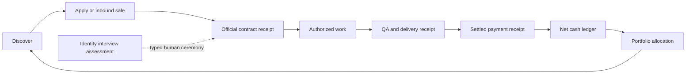

# Mercor → Life Manager 統合仕様

**Status:** runtime-regression / scheduler not loaded / ledger pending review
**Canonical repository:** `https://github.com/Daisuke134/life-manager`
**Canonical checkout:** `/Users/anicca/Projects/life-manager-main`

## 1. Repository boundary

`life-manager`だけがMercorのコード、skill、spec、loop、test、releaseの正本である。`profitable-claude`は移行元の履歴であり、移行完了後はMercorのproduction sourceとして参照しない。

「1つのrepository」はsource controlを1つにする意味であり、credentials、Google session、Mercor Cookie、resume PDF、個人プロフィール、応募台帳などのprivate runtime stateをGitへ入れる意味ではない。

## 2. Canonical layout

```text
life-manager/
├── skills/
│   ├── job-hunter/                         # fact bank/materials owner
│   │   ├── SKILL.md
│   │   └── references/mercor.md            # provider-specific reference
│   └── mercor/                             # user-facing Mercor skill facade
│       ├── SKILL.md
│       └── agents/openai.yaml
├── apps/job-search-loop/                   # sole browser/application side-effect owner
│   ├── job_search_loop/                    # deterministic state, adapters, evidence
│   ├── prompts/                            # bounded agent prompts
│   ├── schemas/                            # pass/application/result contracts
│   └── tests/
├── loops/job-hunter/                       # hourly/inbox/learning cadence
│   ├── loop.toml
│   └── registry.yaml
├── runtime/agent-runner/                   # provider/model routing and validation
└── docs/superpowers/specs/                 # this migration and acceptance evidence
```

Private runtime state remains outside the repository:

```text
~/.config/anicca/job-search/profile.json
~/.local/share/anicca/job-search/materials/
~/.local/state/anicca/job-search/mercor/
```

## 3. Ownership and no-duplication contract

| Responsibility | Canonical owner |
|---|---|
| Candidate facts and approved resume variants | `skills/job-hunter/` + private profile SSOT |
| Mercor auth and provider policy | `skills/mercor/SKILL.md` + `skills/job-hunter/references/mercor.md` |
| Mercor browser, form submission, read-back, locks, evidence | `apps/job-search-loop/` |
| Hourly/inbox/learning scheduling | `loops/job-hunter/` |
| Model/provider execution | `runtime/agent-runner/` |
| Private resume, Cookie, ledger and evidence | `~/.local/state/anicca/job-search/` |

Do not create `profitable-claude`-style second executors, a second Mercor loop, or a browser script inside the skill. The skill provides policy and routing; the existing job-search runtime owns side effects.

## 4. Mercor authentication boundary

- Use ordinary Google sign-in with the Keychain credential.
- Never click a browser Google 2FA button whose accessible name is `はい`; only the user taps `はい` inside the Gmail iOS app.
- Never click account recovery, reset, registration, recovery-email, or recursive alternate-method paths.
- If recovery/reset/wait appears, record the visible URL/text and stop.
- Use a dedicated Mercor browser profile; never navigate the job-search or trusted daily-driver tab.

## 5. Global role and locale scope

Mercor is not a Japanese-only lane. The provider must route every supported locale and role family through the same Job Hunter fact gate: Japanese, English, bilingual, business operations, AI-agent evaluation, research, data/CRM, product, and other roles are eligible when the approved profile and the live listing support them. Locale selects the approved material variant; it does not restrict discovery to Japanese jobs.

## 6. Loop behavior

The existing hourly Job Hunter acquisition loop becomes the single Mercor-capable loop. It must:

1. Reconcile the oldest in-progress Mercor application before discovering new work.
2. Deduplicate by stable Mercor listing/application identifier.
3. Apply only to grounded forms using approved facts and a verified resume artifact.
4. Route interviews, assessments, CAPTCHA, unsupported free-response questions, and ambiguous attestations to `needs_human`; never impersonate a candidate interview or assessment.
5. Re-open the application list after any submit and store evidence plus the external result.
6. Record settled earnings only when the Mercor Earnings UI proves payment; views, invitations, offers, and estimates are not earnings.

### 6.4 End-to-end money state machine

An application is only the first state; it is not income. The complete flow is:

```text
DISCOVERED
  → GROUNDED_READY
  → SUBMITTED_PENDING_REVIEW
  → SELECTED_OR_REJECTED
  → CONTRACTED
  → AUTHORIZED_WORK
  → WORK_ACCEPTED
  → PAID_SETTLED
  → REVENUE_LEDGER
```

The resident loop owns discovery, grounded submission, Gmail/status reconciliation, Calendar scheduling, evidence, and settled-payout read-back. It does not impersonate a human interview/assessment or perform work when the contract prohibits AI/automation. `PAID_SETTLED` requires a real Mercor Earnings/contract payment row; the hourly rate, an offer, an invitation, a selected application, or a pending balance never advances the revenue ledger.

Current money diagnosis: the account has three `SUBMITTED_PENDING_REVIEW` applications, no observed selection/contract, and Mercor Earnings says `No payment history yet`. The installed Mercor, Inbox, and Mercor-browser plists exist, but none of their three labels is loaded in `gui/501`; therefore the resident acquisition and reconciliation loop is currently stopped. Settled revenue is not observed, not zeroed as a fabricated success, and no `$10K` claim is valid.

### 6.1 Ready-to-submit queue

The loop may submit a new listing without human intervention when the live application page proves all of the following:

- `3 of 3 steps completed` and `100%`;
- the completed `Domain Expert Interview` is explicitly reused;
- `Submit application` is visible;
- the listing/application identifier is not already in the private application ledger.

For each wake, select at most one new ready-to-submit listing, submit it once, reopen the application result, and append one evidence row. Never resubmit `submitted_pending_review`, click `Start` on a new interview, or infer readiness from a title alone.

An ungrounded or human-gated candidate is not a reason to end the wake. The model must continue through distinct candidates until it finds one grounded submit-ready listing, reaches an irreversible submit/unknown boundary, or exhausts the verified queue. The one-submit-per-wake cap remains unchanged.

Current ready queue observed in Mercor before the resident pass:

1. Data analysis / quantitative readouts Evaluator — $80–$120/hour (submitted in the resident pass below)
2. General business strategy / management Evaluator — $80–$120/hour
3. Humanities / arts / culture Evaluator — $80–$120/hour
4. Media / journalism / communications Evaluator — $80–$120/hour

Japanese language / cultural fluency Evaluator and Software / AI / IT / data Evaluator are already submitted and excluded from the queue.

## 6.3 Model-led execution decision

The Mercor macro loop must be model-led rather than a large selector script. The model observes the live page, decides the next safe action from the task packet, and adapts when the page changes. Deterministic code owns only the boundaries that must not drift: operator/profile isolation, lease ownership, approved domains, application dedupe, the single irreversible submit wrapper, read-back, evidence, and ledger writes.

### OSS code evidence and adopted patterns

The implementation comparison was performed against fixed public commits:

| OSS | Fixed commit | Observed mechanism | Adoption decision |
|---|---|---|---|
| `browser-use/browser-use` | `85ddbfedf609166b2d2c76c3d80506649fee82a9` | Model-led `Agent` loop; `AgentState`; `BrowserStateSummary`; short/long browser error memory; domain-filtered `ActionRegistry`; structured output schema; failure/loop budgets | Adopt the state/error/action-boundary pattern; do not copy the whole runtime |
| `browserbase/stagehand` | `a21633d53930abc5d62b8dbd6b608995f2ccb4b1` | Narrow `observe`, `act`, and schema-validated `extract` verbs over an owned browser session; explicit session cleanup | Adopt the narrow verbs and extraction contract; keep the existing Life Manager CDP owner |

The selected call graph is:

```text
existing launchd wake
  → job-hunter loop lease
  → runtime/agent-runner (model-led Mercor prompt)
  → observe live Mercor page
  → model selects next grounded action
  → guard validates domain/state/dedupe
  → act through owned browser session
  → extract success/read-back
  → deterministic evidence + ledger append
```

Do not encode every Mercor selector, role title, or page branch in shell/Python. When a page changes, the model re-observes and returns a structured `blocked`, `needs_human`, `submitted`, or `observed_no_action` result. A bounded retry may re-observe; it may not repeat an ambiguous submit.

## 6.2 Open-source reusable macro loop

The Mercor lane is a reusable open-source macro loop for any operator, not a promise that every operator will earn $10K. Each operator supplies their own private inputs and completes identity-bound steps; the shared code owns the repeatable orchestration.

### Operator onboarding (human once per account)

1. Provide a private resume/fact profile and approve the material baseline.
2. Authenticate the operator's own Google/Mercor account in an isolated browser.
3. Complete Mercor's required profile, work authorization, payment setup, interview, and assessment steps personally.
4. Connect the operator's own Gmail and Google Calendar through the existing Job Hunter integration.
5. Set the operator's target rate, weekly capacity, locales, role families, and hard exclusions.

### Resident loop (minimal human runtime)

- `acquisition`: hourly discovery, dedupe, fact matching, ready-to-submit queue, one bounded submit.
- `inbox`: 15-minute Gmail/Mercor reconciliation, selection/contract/rejection transitions.
- `calendar`: FreeBusy, idempotent interview event, reminders, prep pack delivery.
- `work`: track only authorized human/approved work; never impersonate an interview or violate task AI-use rules.
- `earnings`: reconcile Mercor Earnings/settled payouts and calculate verified monthly run-rate.
- `guardian`: leases, browser ownership, retries, duplicate-submit protection, and evidence integrity.
- `learning`: weekly role/rate/conversion analysis without fabricating success.

### Public/private boundary

Public repository: adapters, schemas, prompts, tests, launchd templates, provider policy, and redacted fixtures. Private runtime: resume, fact ledger, Google/Mercor session, Calendar IDs, Gmail thread IDs, payment details, application ledger, evidence, and earnings. A new operator gets a fresh private state root and never receives Dais's credentials or profile.

### $10K verification contract

The loop reports `$10K verified` only after the operator has actual settled payout evidence for three consecutive monthly cycles. It must never convert an offer, application, view, estimated rate, or unworked weekly cap into revenue. The expected-hours planner uses the contract's displayed rate and weekly cap; it does not promise a result.

The contract-level work harness is implemented in `apps/job-search-loop/job_search_loop/mercor_work_harness.py`, and its private append-only/idempotent event store is `mercor_work_store.py`. It rejects invalid work transitions, requires `authorization_policy=explicitly_allowed` for `authorized_work`, requires `acceptance_status=accepted` for `accepted`, routes human-bound work to `needs_human`, and accepts a revenue record only from a `paid_settled` event with a positive amount, settled status, payment ID, and evidence reference. This is a partial provider-local state machine: it does not yet require QA/artifact evidence, a shared DeliveryReceipt, actual fee/cost evidence, or bank/payout matching. Those are active engineering work, not an external wait.

### 6.5 Target portfolio closed-loop contract

Mercor is one provider lane in the Life Manager money loop. The cross-provider design SSOT is `docs/superpowers/specs/2026-08-22-life-manager-gig-economy-loop-design.md`; this Mercor spec owns only Mercor transport, state, policy, and evidence. Coconala, Lancers, CrowdWorks, and Upwork do not call the Mercor executor and Mercor does not call theirs.



The target shared contract is receipt identity, not shared mutable execution: `ApplicationReceipt → ContractReceipt → AuthorizationReceipt → QAReceipt → DeliveryReceipt → PaymentReceipt → bank/payout match`. It is not implemented end-to-end today: the current shared marketplace contract has Application/Delivery/Payment-shaped records but lacks Contract/Authorization/QA receipt types, does not make QA and Delivery evidence a mandatory joined sequence, and does not prove actual fee/cost or bank matching in PaymentReceipt. Each provider keeps its own schedule, browser/profile, policy gate, rate limit, entity lock, and private state. Reporting and allocation read the receipts without becoming a fifth side-effect owner. A provider with a stopped scheduler, unknown authorization, missing contract, prohibited AI use, or no settled payment remains visibly open; another provider may continue independently.

## 7. Calendar and minimal-human-glue flow

Mercor interview messages enter the existing Job Hunter inbox lane. Reuse `apps/job-search-loop/job_search_loop/interview_scheduling.py` and `calendar_sync.py`; do not create a Mercor-specific Calendar writer.

1. Classify the Gmail/Mercor message and require a clear role, source thread, timezone, start, and end.
2. Read Google Calendar FreeBusy for the primary calendar.
3. Choose the earliest explicitly offered slot that is free; never invent a time.
4. Create or update one idempotent private Calendar event keyed by the source thread and normalized start time, with 3-day and 1-day reminders.
5. Register the interview-prep job and deliver grounded prep windows through the existing inbox/prep loop.
6. Human glue remains only for Gmail/Calendar authorization, ambiguous scheduling, and attending the interview or taking a human-bound assessment. The system never impersonates the interview.

## 8. Current migration state

- Mercor skill/spec exist in the migration source and have been read back.
- Canonical Life Manager repo already owns `skills/job-hunter/`, `apps/job-search-loop/`, and `loops/job-hunter/`.
- The Mercor profile was authenticated and its resume/profile fields were verified in the browser at the recorded checkpoint; the stopped browser owner means this is not a current session-health claim.
- Japanese evaluator application has the 14-minute `Domain Expert Interview` completed and its recorded application read-back says `3 of 3 steps done`, `Your application has been submitted!`, with review expected within four weeks. Submission used the user's explicit attestation of Japanese native fluency and 24 years living in Japan; do not resubmit while selection is pending.
- Related evaluator pages for Data analysis, General business strategy, Humanities/arts/culture, and Media/journalism/communications read `3 of 3 steps completed` with `Submit application` visible and reuse the completed Domain Expert Interview. Software/AI/IT/data was the strongest next candidate and is now submitted with a four-week review window.
- The resident model-led pass at `mercor-20260822-200153-55024` inspected the already-submitted Software listing, selected Data analysis / quantitative readouts, submitted it once, reopened the result, and read back the visible submitted state. The result is recorded in the private ledger and evidence paths under `~/.local/state/anicca/job-search/mercor/`; no `needs_human` or `blocked` result was returned.
- At the initial enablement checkpoint, the dedicated browser transport `ai.anicca.job-search-mercor-browser` was `KeepAlive`/`RunAtLoad` with CDP `127.0.0.1:9334`, and `ai.anicca.job-search-mercor` was registered with a 3600-second wake interval. The first recovery pass blocked while the browser was down; the next pass `mercor-20260822-204000-83882` read back `browser-owner=ready`, inspected the existing Software application, and observed the Data quality / CRM operations listing without submitting because the private fact bank did not verify its 5+ years requirement. The pass exited 0, wrote fresh evidence, and left the ledger at three submitted applications. This historical state is superseded by the stopped-runtime read-back below.
- Operational meaning of 24/7 is a persistent browser transport plus an hourly bounded wake, not a busy loop that clicks continuously. Each wake may submit at most one grounded listing; `observed_no_action` is a successful safe pass when no listing is fully supported by verified facts.
- The first live resident pass after enablement inspected `Data quality / CRM operations Evaluator`, but did not submit because the private facts did not verify the listing's five-year requirement. This is the expected grounded behavior; adding a role-specific fact is only allowed when the operator can truthfully evidence it.
- At that checkpoint, pass reporting was wired through the existing idempotent Telegram outbox. Pass `mercor-20260822-213818-48917` was delivered with Telegram `message_id=28848`; it contained the status, inspected job titles, and no-action reason without resume/profile secrets.
- The installed intended cadence at that checkpoint was generic acquisition/daily every 3600 seconds, Mercor acquisition every 3600 seconds, inbox every 900 seconds (15 minutes), learning every Monday at 09:15 Asia/Tokyo, and the dedicated Mercor browser transport KeepAlive. There was no Mercor 30-minute or 5-minute submit loop. Installed cadence is not proof that the labels are currently loaded.
- The provider-local work harness and private event store pass their existing tests: they cover explicitly authorized work → acceptance → paid-settled → revenue, reject missing authorization/acceptance and pending/offer payment evidence, route AI-prohibited work to `needs_human`, and persist idempotent state events without profile/resume secrets. They do not yet prove the stronger shared QA/delivery/net-cash contract defined in Section 6.5.
- At that checkpoint, Earnings capture ran after each Mercor pass. E2E pass `mercor-20260822-224541-76805` reconciled the Japanese submission and continued through four Explore candidates: Generalist (Macbook User) was `needs_human` for an assessment/device-fact gate, Biology Research Scientist lacked U.S. work eligibility and biology/assay facts, and Generalist Expert lacked native-English evidence. It captured Earnings with `Your total earnings to date are $0.00` / `No payment history yet`, synced `not_observed` with zero events, and delivered Telegram ACK `message_id=28953`. No duplicate submit occurred.
- That pass briefly wrote three model-generated evidence artifacts to the repo root; they were moved to the private pass evidence directory and the prompt now explicitly forbids repository-root evidence writes. No private artifact was committed.
- At that checkpoint, human-bound gates became durable in `~/.local/state/anicca/job-search/mercor/human-gates.jsonl`; Project Thor assessment and Finance Interview each had an idempotent gate ID and evidence reference.
- The live pass `mercor-20260822-231155-58248` inspected five distinct listings, submitted none, and read back the two human-bound gates (Project Thor assessment and Finance Interview) plus two grounded fact-gate failures. The model returned stale evidence paths from an older `model-pass-*` directory; the parent rejected them fail-closed, persisted `evidence-validation-error.json` under the current private run, reported `status=blocked`, captured Earnings `empty`, and delivered Telegram `message_id=29006`. The pass context now binds the exact current `evidence_dir`, and non-empty evidence paths outside that directory or missing on disk are rejected without allowing a submit claim.
- The follow-up pass `mercor-20260822-231916-82217` verified the repair: it inspected the existing submitted Software listing plus six distinct candidates, returned `observed_no_action` with no submit, wrote all DOM/screenshot evidence beneath the bound current run directory, captured Earnings `empty`, and delivered Telegram `message_id=29012`. The ledger remains at three submitted applications.
- At that checkpoint, human-gate replay collapsed wording drift for the reusable Project Thor assessment and Finance Interview without rewriting the append-only history; the private `pending()` projection contained two logical gates.
- The follow-up pass `mercor-20260822-233559-30906` inspected the existing Software application plus five candidates, returned `observed_no_action`, and delivered Telegram `message_id=29043`; no application was added and Earnings remained `empty`. The parent post-pass mode normalization made every model-created evidence file `600` and directory `700`, while repeated Finance Interview reporting reused one gate ID.
- At that recovery checkpoint, the Inbox LaunchAgent had been loaded from stale `/Users/anicca/lm-loops-core`; a safe bootout/bootstrap reloaded the existing plist from `/Users/anicca/Projects/life-manager-main`, and the read-back showed canonical `run-inbox.sh`. That checkpoint's canonical Inbox run exited 0: SQLite confirmation-integrity errors were recorded as `ledger_integrity_blocked`, uncertain Telegram delivery was recorded as `delivery_unknown` without blind retry, and an unrelated Workday account-verification email remained unopened. This does not supersede the current absent-label read-back below.
- The Mercor pass contract now requires bounded pagination (up to four additional Explore pages and twelve candidate-detail pages per wake) when the first page has no grounded candidate. Run `mercor-20260823-000556-22147` exercised the expanded queue but hit a transient owned-target navigation conflict caused by a concurrent read-only probe; it returned `blocked`, made no submit attempt, captured Earnings `empty`, and delivered Telegram `message_id=29084`. Future probes must use an isolated target or wait until the resident pass is idle.
- The clean follow-up `mercor-20260823-001448-50548` ran without external target interference: it reconciled the existing Software submission, inspected the expanded candidate queue, made no new submit, routed Project Thor to the durable human gate, captured Earnings `empty`, delivered Telegram `message_id=29099`, and left the application ledger at three rows. Parent evidence normalization produced `600` files under the current private run.
- The next resident wake `mercor-20260823-002500-92325` completed the bounded pagination queue with no new submit. It routed a required assessment to `needs_human`, recorded one incomplete detail inspection as `blocked`, captured Earnings `empty`, delivered Telegram `message_id=29108`, and left the application ledger at three rows. No interview, assessment, recovery screen, or Submit control was clicked.
- The live read-only Earnings page at `https://work.mercor.com/earnings` was opened in the dedicated Mercor profile. It read `Your total earnings to date are $0.00`, `No payment history yet`, and `Once you receive your first payout, it will appear here`. The private read-back is `status=not_observed`, `revenue_credited=false`, and `verified_monthly_run_rate_usd=null`; no application, offer, rate estimate, or `$0.00` placeholder is counted as earnings.
- Failure fixtures now cover page drift, stale/non-Mercor tabs, transient CDP failure, ambiguous submit read-back, recovery/reset/Google `はい` screens, and authoritative successful read-back. The guard fails closed and never retries an ambiguous submit or clicks recovery UI.
- A redacted two-operator fixture now proves separate operator IDs, state roots, application ledgers, evidence files, resume paths, and CDP endpoints; no cross-operator listing or evidence is visible.
- The reproducible application-runtime release artifact passed extraction and clean-home install tests with a non-Dais redacted profile; the archive excludes private state, and the tracked public tree has no private-key/token credential matches. A fresh production-scope scan finds no tracked plist/template/installer for the dedicated `ai.anicca.job-search-mercor-browser` transport even though `run-mercor.sh` consumes CDP `9334`; the installed launcher points to a private-state script. Portable browser-owner packaging is therefore still open.
- A production-scope reference scan found zero `profitable-claude` or legacy absolute-path dependencies in `apps/job-search-loop`, `loops/job-hunter`, `skills/mercor`, or the Mercor provider reference; canonical runtime/launchd/job-hunter contract tests pass 17/17.
- Deletion-gate read-back found `/Users/anicca/profitable-claude` is a separate 2.0G Git repository with uncommitted changes. The redacted read-only inventory at `~/.local/state/anicca/job-search/mercor/evidence/legacy-consumer-inventory-20260822.json` contains 463 jobs total and 15 enabled `profitable_claude` jobs (5 currently loaded); a broader plist path scan finds 38 files including disabled/legacy entries. No deletion, move, unload, or process termination was performed; removing it now would break unrelated active loops. The final destructive step remains pending migration or an explicit stop plan for those consumers.
- Mercor Summary currently resets after reload and is tracked as `summary_unpersisted`.
- Current runtime read-back at `2026-08-26 00:43 JST` finds installed plists for `ai.anicca.job-search-daily`, `ai.anicca.job-search-inbox`, `ai.anicca.job-search-learning`, `ai.anicca.job-search-mercor`, and `ai.anicca.job-search-mercor-browser`, but `launchctl print gui/501/<label>` returns service-not-found for all five. No process owns CDP `9334`. The last successful model pass started at `2026-08-25 16:21 JST`, returned `needs_human`, submitted nothing, and left the ledger at three rows. The next pass at `17:32 JST` failed in three seconds without a result; its retained log shows an agent-runner `rc=1`, and neighboring runs also show CDP timeout and an invalid Earnings snapshot. The failure cause of the missing launchd registration is not yet proven.
- The logical human-gate projection now contains 13 pending entries, including Project Thor, Finance Interview, Professional Work Survey, Business Development assessment, ML code-review/interview, and Agent Engineer interview. Wording drift creates several provider-semantic duplicates; deduplication must key provider step/listing identity rather than free-text reason.
- The filesystem fell below the existing Life Manager `512 MiB` last-resort write floor and retained Inbox logs include `no space left on device`. Removing only regenerable OSS/Homebrew/Adobe cache data produced brief gains, but fresh read-backs during this verification fluctuated between about `258 MiB` and `381 MiB`. The write floor is not stably recovered. This is not claimed as the cause of the missing LaunchAgent labels without a matching launchd receipt.

## 9. Migration acceptance gate

Do not delete or archive the migration source until all are true:

- Mercor skill, provider reference, and this spec are committed and pushed to `Daisuke134/life-manager`.
- `apps/job-search-loop` has the Mercor adapter, application dedupe, result schema, and tests; the
  application-side browser-owner logic alone does not satisfy this gate.
- The repo includes a redacted portable Mercor browser transport template/installer, and clean-home
  installation proves the operator-specific profile/CDP owner without credentials or Dais paths.
- `loops/job-hunter` has one canonical hourly route; no second executor exists.
- A real read-only pass and one authorized form submission have fresh evidence and no duplicate application.
- Private runtime state is copied to `~/.local/state/anicca/job-search/mercor/` with mode `700/600`, and no secret or private resume is committed.
- A repository-wide reference scan shows no production Mercor path still depends on `profitable-claude`.
- Only after the above read-back may `profitable-claude` be archived/deleted as a separate destructive operation.

## 10. Atomic completion sequence (one active item at a time)

Only the first unchecked item is active. Finish its evidence and read-back before starting the next item. A `needs_human` result is a durable state, not permission to skip the next independent item.

1. [x] **Canonical source:** keep skill, spec, provider reference, and runtime state under the Life Manager boundary; no private secrets in Git.
2. [x] **Canary evidence:** complete and submit Japanese Evaluator plus Software/AI/IT/data Evaluator; store fresh submitted read-back and evidence.
3. [x] **Queue discovery:** read the four `3/3 + Submit` ready listings and exclude submitted application IDs.
4. [x] **Model contract:** add a model-led `mercor_pass` prompt and structured result schema to `runtime/agent-runner`; allowed results are `submitted`, `observed_no_action`, `needs_human`, and `blocked`.
5. [x] **Provider adapter:** implement Mercor discovery/application reconciliation in `apps/job-search-loop/`; keep Gmail, Calendar, ledger, and browser ownership in existing modules.
6. [x] **Submit guard:** implement exactly one deterministic irreversible wrapper requiring `3/3 + visible Submit + ledger dedupe`, followed by mandatory post-submit read-back.
7. [x] **Operator onboarding:** add private per-operator state roots and setup for resume, account, Calendar, payment, capacity, locale, role families, and exclusions.
8. [x] **Calendar fixture:** test Gmail classification → FreeBusy → idempotent Calendar event → prep reminders with a redacted Mercor fixture.
9. [x] **Resident cadence live enablement:** install the dedicated Mercor browser transport and the existing `ai.anicca.job-search-mercor` LaunchAgent, kickstart one real pass, and read back service state plus pass evidence. The browser transport is KeepAlive, the job wake interval is 3600 seconds, and the live pass exited 0 with a grounded `observed_no_action` result and no duplicate submit.
10. [x] **Dais full pass:** run one real model-led pass at `mercor-20260822-200153-55024`; submit Data analysis once, read back the submitted page, and persist the ledger/evidence result.
11. [x] **Earnings gate:** implement the settled-only parser/schema and perform a live Earnings read-back. The current account has no payment history, so the durable result is `not_observed` with no revenue credited; the first real settled payout remains an external runtime condition for a future `$10K verified` claim.
12. [x] **Failure fixtures:** test page drift, stale tab, transient failure, ambiguous submit, recovery/reset screen, and successful read-back.
13. [x] **Multi-operator test:** run a second redacted operator fixture with separate state, browser, ledger, and evidence; confirm no cross-operator data.
14. [ ] **Portable Mercor browser owner:** add a redacted repo-owned browser transport template and installer for an operator-specific profile/CDP endpoint, include it in the release, and prove clean-home install plus browser-owner readback without credentials or Dais paths. The previous release proof covered the application runtime but omitted this transport.
15. [x] **Reference cleanup:** remove all production references to `profitable-claude` and confirm the canonical Life Manager runtime still passes.
16. [x] **Pass reporting:** send every Mercor pass status, inspected job, submit/no-action reason through the idempotent Telegram outbox and record the ACK/evidence without leaking private profile or resume data.
17. [x] **Work-harness contract/store:** enforce submitted → selected → contracted → authorized_work → accepted → paid_settled → revenue_recorded transitions, with fail-closed settlement evidence, `needs_human` routing, private append-only events, and idempotent event IDs.
18. [x] **Work-harness Inbox sync:** accept optional strict `mercor_work_events` from the Inbox result, persist transitions in the private idempotent event store, and emit one Telegram receipt per event.
19. [x] **Work-harness Calendar/Earnings wiring:** connect Calendar event artifacts and explicit authorization/acceptance evidence to the durable private work state. Calendar artifact sync, provider-local authorization/acceptance gates, and live Earnings capture/settled-snapshot sync are implemented; the stronger shared money receipt contract remains open below.
20. [ ] **Shared money receipt contract:** add Contract, Authorization, QA, Delivery, and net Payment receipts to `skills/_shared/marketplace-core`; require artifact/QA evidence, actual fee/cost evidence, and official payout/bank matching before net revenue or portfolio allocation. Migrate Mercor and each provider lane through fixtures before claiming closed-loop E2E.
21. [ ] **Resident runtime recovery:** restore at least `512 MiB` free space, bootstrap the five canonical Job Search labels from the current Life Manager release, read back exact program paths/cadences, run one Mercor wake and one Inbox wake, and require fresh terminal receipts plus zero duplicate submit before declaring the loop live.
22. [ ] **Deletion gate:** only after every prior read-back succeeds, migrate or explicitly stop the 15 enabled old-repo jobs (and reconcile the broader 38-file plist scan), then archive/delete `/Users/anicca/profitable-claude` as a separate destructive operation. Current status: blocked by active consumers and dirty old-repo worktree; no destructive action was taken.

### 10.1 Remaining operational TODO from the current stopped runtime

These are runtime milestones, not additional submit clicks:

1. **Open-source the browser owner:** move the redacted transport contract into Life Manager, parameterize operator profile/CDP/state, include it in clean-home release/install tests, and keep credentials/session data private.
2. **Restore the resident owner:** recover at least `512 MiB` free space, bootstrap daily/inbox/learning/Mercor/Mercor-browser from the current release, and prove two consecutive scheduled Mercor wakes plus one Inbox wake.
3. **Repair terminal failure handling:** a model-runner failure, CDP timeout, or malformed Earnings snapshot must still write a terminal run receipt, preserve the last good earnings truth, and send one deduplicated failure report.
4. **Canonicalize human gates:** collapse the current 13 pending rows by provider step/listing identity while retaining append-only history and preserving genuinely distinct interviews/assessments.
5. **Implement the shared money receipts:** require Contract, Authorization, QA, Delivery, net Payment, and bank/payout-match evidence before revenue or allocation across every provider.
6. **Selection/inbox reconciliation:** let the 15-minute inbox lane classify Mercor selection, rejection, and contract messages; persist each transition and evidence.
7. **Contract/calendar handoff:** for an explicit interview offer, use FreeBusy and the existing idempotent Calendar/prep flow; the user attends any human-bound interview or assessment.
8. **Authorized work and QA:** only after a contract explicitly permits the tool/model, track artifacts, independent QA, delivery, and acceptance; otherwise route the task to `needs_human`.
9. **Settled payout:** read back the first real paid/settled Mercor row, join actual fees/costs and official payout/bank evidence, and calculate the trailing-30-day verified net amount; do not count pending or estimated balances.
10. **Revenue proof:** require three consecutive settled monthly cycles before reporting `$10K verified`; until then the revenue ledger remains `not_observed` when no payout evidence exists.
11. **Legacy cleanup:** separately migrate/stop the old-repo consumers before deleting `profitable-claude`; this is not a reason to disable the Mercor loop.

### 10.2 Actionable now versus external state

There is actionable engineering work now; the system is not reduced to passive waiting:

- **Actionable now:** open-source the missing Mercor browser owner, recover disk headroom, restore the canonical LaunchAgents, make all runner/CDP/Earnings failures terminal and observable, then prove scheduled Mercor and Inbox wakes before resuming application-volume optimization.
- **External state:** Mercor must independently select an application, issue a contract, authorize the actual work, accept delivery, and settle a payout. The loop cannot force those provider decisions or fabricate the missing evidence.
- **Current diagnosis:** three applications are pending review, all Mercor-related LaunchAgents are unloaded, the last pass failed without a result, and the latest Earnings capture has no payment history. The private revenue state remains `not_observed`, not a guessed zero or a claimed income.
- **Capacity economics:** `apps/job-search-loop/job_search_loop/mercor_economics.py` computes a capacity-capped projection only. At the current 40 hours/week and displayed $80–$120/hour, three accepted applications still project $13,866.67–$20,800 gross/month total; the naive three-full-time calculation ($41,600.00–$62,400.00) is shown separately and is not feasible under the 40-hour capacity or revenue evidence contract.
