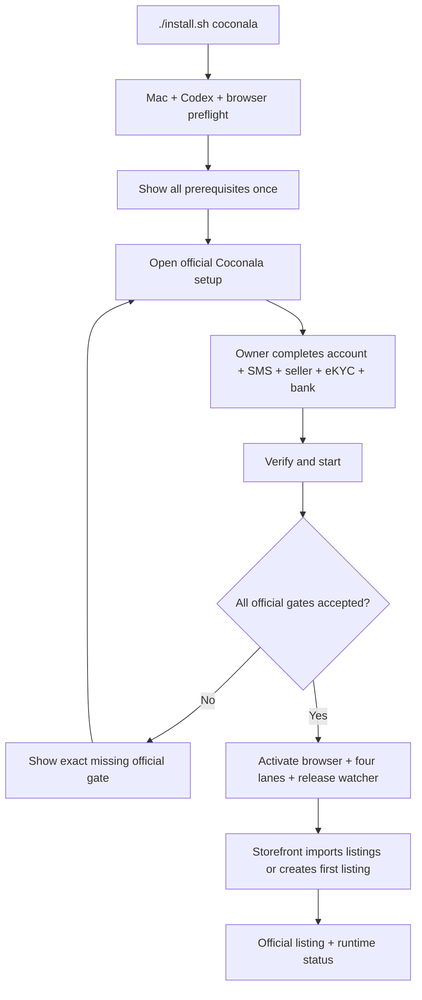

# Coconala One-Session Onboarding Design

## Goal

A non-technical owner starts with a Mac and a ChatGPT/Codex subscription. The installer
shows the official Coconala prerequisites and opens the registration surface. The owner
completes the entire account, SMS, seller, eKYC, consent, and bank setup directly on the
official site in one uninterrupted session. Life Manager then verifies that setup and
starts the four existing Coconala lanes without ongoing approval prompts.

The public command is:

```bash
./install.sh coconala
```

## Selected approach

Use one official-site handoff before activation. The owner completes registration, SMS,
seller information, required consents, eKYC, and bank registration without alternating
control with the agent. This is selected over field-by-field automation because repeated
agent/owner handoffs create more friction than one guided official session. KYC remains
front-loaded because Coconala requires approved identity verification for withdrawal and
unwithdrawn sales can expire.

## Human boundary

The owner performs the complete official account setup once:

1. create or recover the Coconala account and verify its email;
2. complete SMS verification, seller information, and required consents;
3. use a smartphone to photograph the accepted identity document and their face;
4. register the matching domestic payout account;
5. return to the installer and select `Verify and start`.

The owner does not choose categories, write copy, set prices, make images, configure
launchd, create local files, approve applications, approve replies, approve estimates,
or approve deliveries.

## Architecture

The root installer dispatches `coconala` to one package-owned onboarding controller. The
controller checks prerequisites, opens the official setup URL, waits for the owner to
finish, and then uses browser readback and release-activation tools. It never asks the
owner to duplicate official identity or bank facts in Life Manager.

The controller resumes from a private state receipt. Re-running the command never creates
an account, repeats identity submission, duplicates a listing, or loads a second copy of
a launchd job. Account creation and recovery remain owner actions on the official site.



## Data handling

Identity documents, face images, SMS codes, bank account values, passwords, and session
tokens never enter Git, model prompts, logs, Telegram, email reports, or test fixtures.
Sensitive fields are entered only on official Coconala/eKYC surfaces. Life Manager does
not collect or persist a second copy. The mode-0600 onboarding receipt contains only
official state names and hashes, not raw identity data.

The public repository contains only schemas, tool contracts, prompts, placeholder
examples, and tests.

## State machine and recovery

Each accepted official boundary has one terminal receipt: preflight, authenticated,
email_verified, sms_verified, seller_information, identity_approved, bank_registered,
launchd_readback, and storefront_listing_readback. A crash resumes at the first missing
receipt. An unknown or contradictory page fails closed and reports the exact official
blocker; it does not start the money loops early.

The initial official setup is one owner-controlled session, not a sequence of alternating
agent prompts. Authentication expiry opens the same official recovery surface and resumes
after readback; Life Manager never creates another account.

## Activation gate

Apply, Negotiate, Storefront, and Paid are activated only after all of these are true:

- authenticated Coconala session is read back;
- SMS status is accepted;
- seller information is accepted;
- eKYC is officially approved;
- matching domestic payout account is read back;
- public package tests and launchd render checks pass.

An existing listing is not an onboarding gate. After activation, Storefront imports any
existing listings. When the official listing count is zero, Storefront owns capability
discovery, initial service selection, truthful copy/assets, creation, and official
readback. Apply can operate before that listing exists; Negotiate and Paid remain idle
until official buyer activity exists.

Paid remains independently subject to its production delivery acceptance. The onboarding
controller may activate the existing Paid job but cannot manufacture a Paid completion
claim.

## Acceptance

On a clean friend-owned Mac, the owner runs only `./install.sh coconala`, follows one link,
completes all official setup, returns, and selects `Verify and start`. Acceptance requires
official readback for every state, one loaded owner for each launchd label, no marketplace
effect before authentication, no duplicate listing/effect on rerun, and no private value
in the public tree or logs.

Business completion remains receipt-based: one official Apply application with replay
zero, one official Negotiate reply/estimate with replay zero, one Storefront listing
mutation with replay zero, one Paid delivery with replay zero, and one permitted withdrawal
that arrives at the registered bank. Process exit zero, local state, or a notification is
not a substitute.
