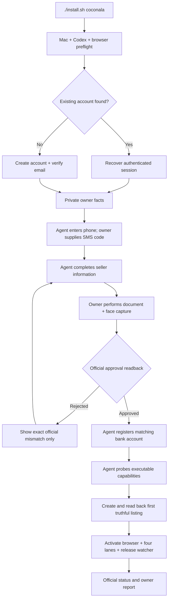

# Coconala One-Session Onboarding Design

## Goal

A non-technical owner starts with a Mac, a ChatGPT/Codex subscription, an email
address, a Japanese mobile phone, accepted Japanese identity documents, and a matching
domestic bank account. One command completes everything delegable, groups every
non-delegable identity action into one guided session, then starts the four existing
Coconala lanes without ongoing approval prompts.

The public command is:

```bash
./install.sh coconala
```

## Selected approach

Complete SMS, eKYC, seller information, required consents, and bank registration before
activating any money loop. This is selected over selling before KYC because Coconala
requires approved identity verification for withdrawal, and unwithdrawn sales can expire.
It is selected over a manual checklist because browser forms, account recovery, email
verification, configuration, first-listing construction, and launchd activation are all
delegable work.

## Human boundary

The owner performs only actions that prove their identity or express personal legal
consent:

1. provide or confirm their email address, Japanese mobile number, legal seller facts,
   and matching bank facts through private local input;
2. read the received SMS code when the Mac cannot consume it directly;
3. review and accept Coconala and eKYC consent text on the official surface;
4. use a smartphone to photograph the accepted identity document and their face;
5. correct official rejection only when Coconala reports a mismatch in owner-supplied
   identity facts.

The owner does not choose categories, write copy, set prices, make images, configure
launchd, create local files, approve applications, approve replies, approve estimates,
or approve deliveries.

## Architecture

The root installer dispatches `coconala` to one package-owned onboarding controller.
The controller is an agent with browser, mailbox, private-input, receipt-readback, and
release-activation tools. The model decides the next browser action from the official
page and tool feedback. Deterministic code is limited to input validation, secret-safe
storage, fixed-format parsing, idempotency, receipts, and launchd bookkeeping.

The controller resumes from a private state receipt. Re-running the command never creates
a second account, repeats an accepted identity submission, duplicates a listing, or loads
a second copy of a launchd job.



## Data handling

Identity documents, face images, SMS codes, bank account values, passwords, and session
tokens never enter Git, model prompts, logs, Telegram, email reports, or test fixtures.
Sensitive fields are entered on official Coconala/eKYC surfaces whenever possible. Any
value needed for resumability is stored only in the existing private credential SSOT or
a mode-0600 private onboarding receipt; receipts contain state names and hashes, not raw
identity data.

The public repository contains only schemas, tool contracts, prompts, placeholder
examples, and tests.

## State machine and recovery

Each accepted official boundary has one terminal receipt: preflight, account,
email_verified, sms_verified, seller_information, identity_approved, bank_registered,
capability_verified, listing_readback, and launchd_readback. A crash resumes at the first
missing receipt. An unknown or contradictory page fails closed and reports the exact
official blocker; it does not start the money loops early.

Email verification is automated through the owner's authorized mailbox adapter. SMS and
eKYC pause on one explicit owner action and resume automatically after official readback.
Authentication expiry uses the same account and recovery path; it never signs up again.

## Activation gate

Apply, Negotiate, Storefront, and Paid are activated only after all of these are true:

- authenticated Coconala session is read back;
- SMS status is accepted;
- seller information is accepted;
- eKYC is officially approved;
- matching domestic payout account is read back;
- at least one truthful listing is officially public;
- public package tests and launchd render checks pass.

Paid remains independently subject to its production delivery acceptance. The onboarding
controller may activate the existing Paid job but cannot manufacture a Paid completion
claim.

## Acceptance

On a clean friend-owned Mac, the owner runs only `./install.sh coconala`. The setup asks
for identity facts once, guides the minimum SMS/eKYC/consent actions, then finishes without
terminal commands from the owner. Acceptance requires official readback for every state,
one loaded owner for each launchd label, no marketplace effect before authentication, no
duplicate account/listing/effect on rerun, and no private value in the public tree or logs.

Business completion remains receipt-based: one official Apply application with replay
zero, one official Negotiate reply/estimate with replay zero, one Storefront listing
mutation with replay zero, one Paid delivery with replay zero, and one permitted withdrawal
that arrives at the registered bank. Process exit zero, local state, or a notification is
not a substitute.
