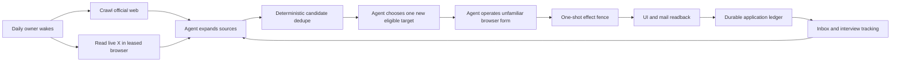

# Life Manager Fundraiser Agent Design

## 1. Objective

Life Manager independently discovers and applies to one new, eligible accelerator, fellowship, grant,
startup program, or public investor intake per daily acquisition pass, then tracks the application
through confirmation, reply, interview, decision, and funded readback.

The system operates on programs whose pages and forms it has never seen. Adding a program must not
require a script, provider adapter, selector, field map, or checked-in program config.

## 2. Non-goals

- No funder-specific Python, JavaScript, shell, selector, or browser adapter.
- No fixed accelerator inventory as a capability whitelist.
- No hardcoded keyword, regex, or numeric scoring for fit judgment.
- No hourly reapplication attempt.
- No success claim from a click, HTTP status, or model output.
- No acceptance of investment terms, SAFE execution, KYC, founder interview, founder video recording,
  visa declaration, legal attestation, or funds movement when personal participation is required.
- No mass email blast or guessed private contact information.

## 3. Operating model



One scheduled acquisition pass runs per day. Inbox reconciliation is a separate read-mostly pass and
cannot claim a new application effect.

## 4. Agent versus deterministic tools

### Model judgment

The model receives current startup facts, past outcomes, source evidence, visible browser state, and
typed bookkeeping tools. It decides:

- which searches to run today;
- which links and X posts point to real funding opportunities;
- whether Life Manager fits an opportunity;
- which new eligible opportunity is most valuable today;
- how to answer each visible question truthfully;
- which visible browser action to take next;
- whether a contradiction or missing fact blocks submission;
- what to learn from replies, interviews, passes, and offers.

These decisions use natural-language guidance and canonical examples. They are not implemented as
keyword lists, regexes, fixed weights, or provider branches.

### Deterministic bookkeeping

Typed tools validate and persist only mechanical facts:

- canonical URL and normalized organization/program/cohort identity;
- official-source URL, captured text digest, observation time, and freshness;
- application account and previous application identity;
- context, application, and effect digests;
- daily acquisition claim and one-shot Submit claim;
- UI receipt, confirmation message/thread IDs, and timestamps;
- state transition validity, duplicate, suppression, stop, and ambiguity status.

## 5. Dynamic source discovery

The source ledger begins with official pages for YC, Solo Founders, Base, Antler, a16z, DelightX,
Techstars, relevant Japanese programs, and sources found by prior runs. These are seeds, not a closed
registry.

Each daily pass:

1. Reads current product, geography, solo-founder status, AI/consumer/crypto positioning, and verified
   traction.
2. Reads prior source yield and previously applied identities.
3. Generates new English and Japanese web searches.
4. Crawls official program, fund, ecosystem, university, government, and accelerator pages.
5. Leases the authenticated X browser read-only and generates live X searches.
6. Follows promising links to official sources.
7. Records every checked official URL and the source chain that led to it.
8. Adds sources and opportunities without a repository change.

An X post is discovery evidence, not program truth. Deadline, eligibility, terms, location, and the
application route must come from the official page before qualification or submission.

## 6. Opportunity and application identity

The deterministic identity tuple is:

`organization + program + cohort_or_rolling_window + application_account`

Canonical URLs and provider application IDs are aliases. A changed marketing URL does not create a new
opportunity. A genuinely new cohort may be eligible when a prior cohort was submitted.

For rolling programs, a second application is blocked unless the provider explicitly invites
reapplication or publishes a materially new window. The source and reason must be recorded first.

## 7. State contract

```text
source_seen
  -> opportunity_verified | source_rejected
  -> eligible | ineligible | evidence_blocked
  -> preparing
  -> ready_to_submit | human_required
  -> submit_claimed
  -> submitted_ui | submit_unknown | not_submitted
  -> confirmed
  -> interview | rejected | withdrawn | waitlisted
  -> offer
  -> funded
```

Rules:

- only one `submit_claimed` transition may consume the daily acquisition claim;
- `submit_unknown` never automatically returns to `submit_claimed`;
- confirmation requires a provider UI receipt or matching provider message;
- `funded` requires executed terms plus provider/bank readback;
- every active state has a durable next action and next check time;
- already-applied identities stay visible but cannot receive another claim.

## 8. Browser execution

Fundraiser uses the existing Life Manager browser and its general navigation, observation, click, type,
select, upload, screenshot, and readback tools.

The agent works from rendered feedback:

1. Navigate to the official application route.
2. Observe visible page and controls.
3. Select and execute one action.
4. Observe again.
5. Continue until blocked, human-required, or ready to submit.
6. Re-read the complete review page and current Life Manager evidence.
7. Claim the one-shot effect and click Submit once.
8. Capture a fresh post-effect observation.

No program name appears in browser execution code. Provider hints may not be added to make one form
pass. If a general browser capability is missing, improve the shared browser tool.

## 9. Daily cadence

- Acquisition: once per day at 06:30 local time.
- Inbox/status reconciliation: every four hours, read-mostly, no acquisition capability.
- Source revisit: chosen dynamically from freshness, deadline proximity, yield, and contradictions.
- One new application is the target, not a false success quota.

When no eligible new opportunity exists, the pass records official sources checked, X searches,
rejection reasons, contradictions, missing evidence, and the next check. It does not reapply, submit
an obvious mismatch, or invent an accelerator.

## 10. Human boundaries

Life Manager may discover, qualify, prepare, fill, submit, reconcile, and track applications under the
delegation in this request.

It checkpoints with zero further external effect for CAPTCHA, founder video, interview attendance,
KYC, unverified visa or relocation statements, binding investment documents, banking, funds movement,
or a declaration whose truth cannot be established from current private SSOT and evidence.

## 11. Evidence and reporting

Every pass produces a receipt containing source queries, checked URLs, candidate decisions, browser
evidence, transitions, effects, readbacks, and replay status.

Telegram distinguishes prepared, submitted-ui, confirmed, interview, offer, and funded. It never
compresses these into "applied successfully" without the corresponding receipt.

## 12. Acceptance

1. Three unrelated live forms complete without program-specific code.
2. The owner discovers an opportunity absent from the release-time source set.
3. An already-submitted application stays excluded across the next daily pass.
4. A new cohort of the same program remains distinguishable.
5. Ambiguous Submit produces no second provider effect.
6. X discovery uses the registered browser lease and leaves x-repost state untouched.
7. Confirmation mail updates the same application identity.
8. The next daily pass has zero duplicate application effects.
9. No unverified revenue, user, media, or funding claim enters a submitted payload.

## 13. Source basis

- [Anthropic, Building Effective Agents](https://www.anthropic.com/engineering/building-effective-agents):
  agents use tools from environmental feedback in a loop.
- [Anthropic, Writing Tools for Agents](https://www.anthropic.com/engineering/writing-tools-for-agents):
  tools contract deterministic systems with non-deterministic agents.
- [Outreachr pinned source](https://github.com/lalalune/outreachr/tree/8340cfbcf197d5aa38fcd9766cba7af2f43f030d):
  claim-before-send and authoritative reconciliation.
- [Venture-Ops pinned source](https://github.com/Desperado/venture-ops/tree/7f6d03a31a565a455b4a0a2714d0564cb98233a7):
  current-term and next-action tracking; fixed scores rejected.
- [fundraising-skills pinned source](https://github.com/oncesylvia/fundraising-skills/tree/084b22d3db00611ea231ec12813ccb071b84bc33):
  sourced targeting, warm paths, truthful traction, and bounded follow-up.
- [DelightX](https://delightx.delight-ventures.com/en/): dynamic source seed and contradiction fixture.
