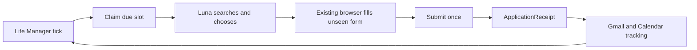
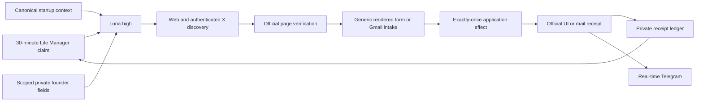

# Life Manager Fundraiser Loop Spec

## 1. Overview

Life Manager MUST fundraise continuously using its existing scheduler, Luna application behavior,
browser worker, Gmail/Calendar tools, startup context, and immutable runtime receipts.

The acquisition lane MUST wake every 30 minutes, 24/7, and submit as many new eligible accelerator,
fellowship, grant, startup-program, or public-investor-intake applications as possible in each pass.
It MUST continue after the first application. The tracking lane MUST reconcile replies continuously
through the same passes. Programs and forms MUST NOT require checked-in support before the agent can
use them.

## 2. Acceptance Criteria

1. Life Manager owns the only scheduler and browser-worker execution path.
2. One acquisition slot is claimable per 30-minute window; no arbitrary per-pass or per-day application cap exists.
3. Luna generates live Web/X searches, verifies leads on official pages, and processes every eligible unsubmitted application until the pass window ends.
4. Luna reads and answers an unseen rendered form directly from verified Life Manager context.
5. The Submit effect is claimed exactly once using `organization + program + cohort/window + account`.
6. A fresh UI or matching provider-mail readback creates the ApplicationReceipt.
7. The next 30-minute slot cannot reapply to the same receipt identity; `submit_unknown` is never retried automatically.
8. Confirmation, rejection, waitlist, interview, offer, and funded status advance the same receipt lineage.
9. Interview confirmation creates a Calendar event and interview brief.
10. CAPTCHA, founder video, interview attendance, KYC, binding terms, banking, and funds movement stop for the human.
11. Three unrelated live forms complete without any production-code change between them.
12. Missing canned answers do not end a pass: Luna makes reasonable inferences for ordinary narrative and judgment fields, checkpoints human-only ceremonies, and continues with other candidates.
13. Production contains no accelerator-specific script, selector, field map, compiler, registry, numbered catalog, dedicated fundraising database, dedicated MCP, extra scheduler, or extra executor.
14. Every application outcome and the pass aggregate use the existing real-time Telegram reporting path.

## 3. As-Is / To-Be

| Area | As-Is | To-Be |
|---|---|---|
| Application behavior | Working Luna/browser application behavior exists | Fundraiser supplies the general fundraising objective and verified Life Manager context |
| Scheduling | Life Manager already runs its own organ scheduler | Fundraiser becomes one native organ with a 30-minute acquisition/tracking claim |
| Browser | Life Manager already has a generic browser worker, but browser jobs are Telegram-source-shaped | The same worker handles unseen forms after the shared job contract accepts a runtime source reference |
| State | Runtime jobs, effects, and immutable receipts already exist; `application` is not yet an allowed effect class | Extend the shared effect/reconciliation contract with `application`; add no fundraising table |
| Follow-up | Gmail and Calendar tools already exist | The tracking prompt advances the receipt and prepares interviews |

The native organ MUST only claim, queue, read back the queue row, and return. Long Luna/browser work
MUST stay in Life Manager's existing worker so the scheduler continues serving other organs and users.

## 4. Test Matrix

| # | To-Be | Test | Cover |
|---|---|---|---|
| 1 | General Luna fundraising objective | `fundraiser-loop.test.mjs` | OK |
| 2 | 30-minute Life Manager slots and uncapped per-pass processing | `fundraiser-runtime.test.js` | OK |
| 3 | Native scheduler wiring and tenant isolation | `fundraiser-wiring.test.js` | OK |
| 4 | Same application identity is replay-zero | `runtime-job-store.test.js` | OK |
| 5 | Unseen forms need no provider code | `fundraiser-loop.test.mjs` unseen-form cases | OK |
| 6 | Ambiguous Submit is not retried | `fundraiser-loop.test.mjs` submit-unknown case | OK |
| 7 | Mail advances the original receipt | `inbox-loop.test.mjs` | OK |
| 8 | Human-only actions stop before effect | `fundraiser-loop.test.mjs` human-gate cases | OK |
| 9 | Natural 24/7 owner and live readback | `fundraiser-live-acceptance.md` | PARTIAL: manual live readback proven; unattended recurrence pending |

| Item | Value |
|---|---|
| UI変更 | なし |
| 結論 | Maestro: 不要（既存browser workerのprovider readbackとlive acceptanceで検証するため） |

## 5. Boundaries

- The model owns search generation, qualification, prioritization, answers, and browser actions.
- Deterministic code owns cadence claims, effect uniqueness, receipts, and replay-zero only.
- The agent uses canonical context, scoped private founder data, official opportunity evidence, and founder-attested claims with provenance. It makes reasonable inferences for ordinary narrative/judgment fields without fabricating identities, credentials, legal registrations, banking details, signatures, or consent.
- X is lead evidence; eligibility, deadline, terms, and application route MUST come from an official page.
- Failed or ineligible discovery remains run evidence and MUST NOT become a funder/source registry.
- The acquisition target is maximum truthful throughput every 30 minutes. Zero applications is a failed pass, and one submission does not end a pass.

## 6. Execution Steps

1. Add the Fundraiser daily prompt and semantic evals to the existing Luna application behavior.
2. Let runtime-owned work enter the existing browser queue and connect the native Fundraiser organ to the existing scheduler and Luna runner.
3. Extend runtime effect/receipt identity with `application` for exactly-once Submit and prior-application reads.
4. Add the read-only inbox prompt, Gmail/Calendar outcome tracking, and human handoffs.
5. Deploy through the existing Life Manager owner and prove unseen-form submission, official readback, next-day replay-zero, and four-hour tracking.

## 7. Implementation State

- Task 0 predecessor audit and architecture selection: complete.
- Task 1 continuous Luna behavior and canonical fundraising context: complete and pushed.
- Native 30-minute scheduler claim and durable `fundraiser.acquire` enqueue: implemented and locally verified.
- A production canary owner is loaded as `ai.anicca.fundraiser` with `StartInterval=1800` and
  `RunAtLoad=true`. It invokes the provider-agnostic Fundraiser prompt, authenticated Web/X CDP,
  Gmail, receipt ledger, and Telegram paths. This is an interim owner until the native Life Manager
  runtime job hands work to the shared browser worker.
- The live runner is measured as `gpt-5.6-luna` with high reasoning through the existing
  `application-intent-planner` route. Silent fallback to Terra is a wiring failure.
- Official live submissions currently proven by exact Gmail Sent readback:
  - Samsung Catalyst Fund, San Jose pitch-deck intake.
  - Cana, San Francisco AI-native SaaS investment inquiry.
  - B Capital, official funding intake.
- A later live pass discovered and processed Hustle Fund, Forum Ventures, SherVentures, and
  B Capital without adding provider-specific production code. Their current terminal states are
  recorded in the runtime receipt ledger.
- Outcome tracking from provider replies through interview, offer, funded, and Calendar creation is
  not yet implemented.
- An unattended launchd recurrence is proven: run 13 started naturally at 08:02:27 UTC after run 12
  completed at 07:32:25 UTC. It used one `gpt-5.6-luna` high attempt with no fallback, submitted six
  new identities, preserved prior submitted identities as replay barriers, and sent Telegram reports.

## 8. Current Operating Policy

- Geography: Tokyo and the United States only, with San Francisco Bay Area first.
- Format: prefer in-person programs where the founder can work with other founders. Base Batches is
  an explicit virtual exception.
- Priority order: Base Batches, Open Network Lab / Digital Garage, DelightX / Delight Ventures,
  a16z Speedrun, then other deadline-near eligible Tokyo or United States programs.
- Y Combinator is `hold_do_not_submit` until the founder explicitly releases it.
- Kenya, Singapore, and every other geography are rejected even when an old receipt exists.
- Ordinary missing narrative answers are inferred from canonical context. Missing identity, legal,
  signature, consent, binding equity, attendance, visa, banking, KYC, or funds-movement authority is
  never invented; that candidate is checkpointed and the pass continues.

## 9. Current Candidate State and Blockers

| Candidate | Current state | Blocking fact or next action |
|---|---|---|
| Samsung Catalyst Fund | submitted | Exact Gmail Sent receipt exists; track reply |
| Cana | submitted | Exact Gmail Sent receipt exists; track reply |
| Hustle Fund | retrying | Hidden duplicate Typeform input fault is repaired with generic visible CSS fill; verify live resubmission |
| Forum Ventures Foundry | checkpoint | Official intake requires North America base; authorized context does not attest it |
| Forum Ventures Pitch Us | checkpoint | City HQ was absent from scoped founder profile; infer Tokyo when the question is descriptive, but do not invent a legal headquarters |
| SherVentures | ineligible | Official page states a $500K+ ARR minimum; only approximately $1,000 founder-attested revenue is supported |
| B Capital | submitted | Retry succeeded; exact Gmail Sent receipt exists; track reply |
| Scion Ventures | submitted | Exact Gmail Sent receipt exists; track reply |
| Lobby Capital | submitted | Exact Gmail Sent receipt exists; track reply |
| Llama Ventures | submitted | Exact Gmail Sent receipt exists; track reply |
| Lightside Venture Capital | submitted | Exact Gmail Sent receipt exists; track reply |
| Eastlink Capital | submitted | Exact Gmail Sent receipt exists; track reply |
| TechLink Ventures | submitted | Exact Gmail Sent receipt exists; track reply |
| SF Startup Labs | retryable failure | Form and deck were completed, but the browser target became unresponsive before Submit |
| 43 | checkpoint | Complete founding team and SF residence or relocation commitment are not attested |
| Camford Capital | checkpoint | Privacy-policy and terms consent is required before Submit |
| Base Batches 004 | checkpoint | Required founder video is absent |
| Open Network Lab | checkpoint | Separate participation, investment-discussion restrictions, and share agreement require founder authority |
| DelightX | checkpoint | Six months in San Francisco, visa/housing/cost commitment, and $60K for 5% require founder authority |
| JETRO GSAP StartX | checkpoint | Three-minute English pitch video, full participation, and terms acceptance require founder action |
| Y Combinator | held | Explicitly do not submit yet |

## 10. Open-source Boundary

The public repository contains the general harness only:

- `skills/fundraiser-agent/SKILL.md`: behavioral contract.
- `skills/fundraiser-agent/prompts/daily.md`: provider-agnostic search/apply/report loop.
- `skills/fundraiser-agent/runtime/run.sh`: bounded runtime entrypoint.
- `skills/browser/scripts/cdp.py`: generic rendered-browser actions.
- `.agents/startup-context.json` and generated `fundraising/application-kit/`: public startup facts and application assets.
- Runtime receipts, credentials, private founder fields, authenticated browser state, and Telegram
  secrets remain outside Git under local private state. The open-source harness reads only scoped
  values at runtime and never copies them into repository artifacts or public evidence.

## 11. Remaining Acceptance Work

1. Let native `fundraiser.acquire` runtime jobs enqueue the existing shared browser worker using a
   runtime source reference; remove the interim standalone owner only after equivalent live proof.
2. Store application effects and reconciliation in the shared immutable runtime receipt contract,
   including replay-zero for `submit_unknown`.
3. Preserve the proven unattended 30-minute recurrence in the native Life Manager owner after the
   interim standalone launchd owner is removed.
4. Maintain the proven provider-agnostic behavior. Nine official live applications are now proven,
   including six in one natural Luna pass without a production-code change between providers.
5. Add Gmail reply reconciliation for confirmation, rejection, waitlist, interview, offer, and
   funded, plus Calendar event and interview brief creation.
6. Verify Hustle Fund with the repaired generic visible-field action. B Capital's retryable Gmail
   transport failure is resolved with an exact Sent receipt.
7. Audit the public tree for secrets and private receipts, then record final live acceptance evidence.

The historical file-level implementation breakdown remains in
`docs/superpowers/plans/2026-08-26-life-manager-fundraiser-agent.md`; this spec's
Implementation State and Remaining Acceptance Work are authoritative for current status.
