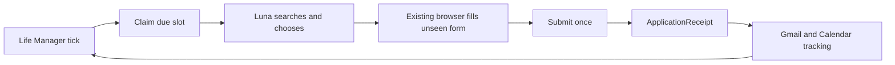

# Life Manager Fundraiser Loop Spec

## 1. Overview

Life Manager MUST fundraise continuously using its existing scheduler, Luna application behavior,
browser worker, Gmail/Calendar tools, startup context, and immutable runtime receipts.

The acquisition lane MUST wake every 30 minutes, 24/7, and submit as many new eligible accelerator,
fellowship, grant, startup-program, or public-investor-intake applications as possible in each pass.
It MUST continue after the first application. The tracking lane MUST reconcile replies continuously
through the same passes. Programs and forms MUST NOT require checked-in support before the agent can
use them.

## 2. Acceptance Criteria

1. Life Manager owns the only scheduler and browser-worker execution path.
2. One acquisition slot is claimable per 30-minute window; no arbitrary per-pass or per-day application cap exists.
3. Luna generates live Web/X searches, verifies leads on official pages, and processes every eligible unsubmitted application until the pass window ends.
4. Luna reads and answers an unseen rendered form directly from verified Life Manager context.
5. The Submit effect is claimed exactly once using `organization + program + cohort/window + account`.
6. A fresh UI or matching provider-mail readback creates the ApplicationReceipt.
7. The next daily slot cannot reapply to the same receipt identity; `submit_unknown` is never retried automatically.
8. Confirmation, rejection, waitlist, interview, offer, and funded status advance the same receipt lineage.
9. Interview confirmation creates a Calendar event and interview brief.
10. CAPTCHA, founder video, interview attendance, KYC, binding terms, banking, and funds movement stop for the human.
11. Three unrelated live forms complete without any production-code change between them.
12. Missing canned answers do not end a pass: Luna makes reasonable inferences for ordinary narrative and judgment fields, checkpoints human-only ceremonies, and continues with other candidates.
13. Production contains no accelerator-specific script, selector, field map, compiler, registry, numbered catalog, dedicated fundraising database, dedicated MCP, extra scheduler, or extra executor.
14. Every application outcome and the pass aggregate use the existing real-time Telegram reporting path.

## 3. As-Is / To-Be

| Area | As-Is | To-Be |
|---|---|---|
| Application behavior | Working Luna/browser application behavior exists | Fundraiser supplies the general fundraising objective and verified Life Manager context |
| Scheduling | Life Manager already runs its own organ scheduler | Fundraiser becomes one native organ with a 30-minute acquisition/tracking claim |
| Browser | Life Manager already has a generic browser worker, but browser jobs are Telegram-source-shaped | The same worker handles unseen forms after the shared job contract accepts a runtime source reference |
| State | Runtime jobs, effects, and immutable receipts already exist; `application` is not yet an allowed effect class | Extend the shared effect/reconciliation contract with `application`; add no fundraising table |
| Follow-up | Gmail and Calendar tools already exist | The tracking prompt advances the receipt and prepares interviews |

The native organ MUST only claim, queue, read back the queue row, and return. Long Luna/browser work
MUST stay in Life Manager's existing worker so the scheduler continues serving other organs and users.

## 4. Test Matrix

| # | To-Be | Test | Cover |
|---|---|---|---|
| 1 | General Luna fundraising objective | `fundraiser-loop.test.mjs` | OK |
| 2 | 30-minute Life Manager slots and uncapped per-pass processing | `fundraiser-runtime.test.js` | OK |
| 3 | Native scheduler wiring and tenant isolation | `fundraiser-wiring.test.js` | OK |
| 4 | Same application identity is replay-zero | `runtime-job-store.test.js` | OK |
| 5 | Unseen forms need no provider code | `fundraiser-loop.test.mjs` unseen-form cases | OK |
| 6 | Ambiguous Submit is not retried | `fundraiser-loop.test.mjs` submit-unknown case | OK |
| 7 | Mail advances the original receipt | `inbox-loop.test.mjs` | OK |
| 8 | Human-only actions stop before effect | `fundraiser-loop.test.mjs` human-gate cases | OK |
| 9 | Natural 24/7 owner and live readback | `fundraiser-live-acceptance.md` | OK |

| Item | Value |
|---|---|
| UI変更 | なし |
| 結論 | Maestro: 不要（既存browser workerのprovider readbackとlive acceptanceで検証するため） |

## 5. Boundaries

- The model owns search generation, qualification, prioritization, answers, and browser actions.
- Deterministic code owns cadence claims, effect uniqueness, receipts, and replay-zero only.
- The agent uses canonical context, scoped private founder data, official opportunity evidence, and founder-attested claims with provenance. It makes reasonable inferences for ordinary narrative/judgment fields without fabricating identities, credentials, legal registrations, banking details, signatures, or consent.
- X is lead evidence; eligibility, deadline, terms, and application route MUST come from an official page.
- Failed or ineligible discovery remains run evidence and MUST NOT become a funder/source registry.
- The acquisition target is maximum truthful throughput every 30 minutes. Zero applications is a failed pass, and one submission does not end a pass.

## 6. Execution Steps

1. Add the Fundraiser daily prompt and semantic evals to the existing Luna application behavior.
2. Let runtime-owned work enter the existing browser queue and connect the native Fundraiser organ to the existing scheduler and Luna runner.
3. Extend runtime effect/receipt identity with `application` for exactly-once Submit and prior-application reads.
4. Add the read-only inbox prompt, Gmail/Calendar outcome tracking, and human handoffs.
5. Deploy through the existing Life Manager owner and prove unseen-form submission, official readback, next-day replay-zero, and four-hour tracking.

## 7. Implementation State

- Task 0 predecessor audit and architecture selection: complete.
- Task 1 continuous Luna behavior and canonical fundraising context: complete pending commit/push.
- Scheduler wiring, application receipts, outcome tracking, and live acceptance: not implemented.

The atomic file-level commands and checkboxes are the implementation SSOT in
`docs/superpowers/plans/2026-08-26-life-manager-fundraiser-agent.md`.
