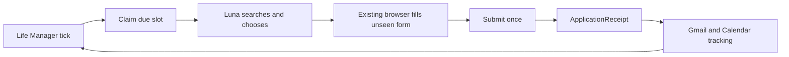

# Life Manager Fundraiser Loop Spec

## 1. Overview

Life Manager MUST fundraise continuously using its existing scheduler, Luna application behavior,
browser worker, Gmail/Calendar tools, startup context, and immutable runtime receipts.

The acquisition lane MUST wake every minute, 24/7, and submit as many new eligible accelerator,
fellowship, grant, startup-program, or public-investor-intake applications as possible in each pass.
It MUST continue after the first application. The tracking lane MUST reconcile replies continuously
through the same passes. Programs and forms MUST NOT require checked-in support before the agent can
use them.

## 2. Acceptance Criteria

1. `ai.anicca.fundraiser` is the only Fundraiser scheduler and uses Life Manager's existing browser-worker execution path.
2. One acquisition slot is claimable per one-minute window; the run lock prevents overlap and no arbitrary per-pass or per-day application cap exists.
3. Luna generates live Web/X searches, verifies leads on official pages, and processes every eligible unsubmitted application until the pass window ends.
4. Luna reads and answers an unseen rendered form directly from verified Life Manager context.
5. The Submit effect is claimed exactly once using `organization + program + cohort/window + account`.
6. A fresh UI or matching provider-mail readback creates the ApplicationReceipt.
7. The next one-minute slot cannot reapply to the same receipt identity; `submit_unknown` is never retried automatically.
8. CAPTCHA, founder video, interview attendance, KYC, binding terms, banking, and funds movement stop for the human.
9. Three unrelated live forms complete without any production-code change between them.
10. Missing canned answers do not end a pass: Luna makes reasonable inferences for ordinary narrative and judgment fields, checkpoints human-only ceremonies, and continues with other candidates.
11. Production contains no accelerator-specific script, selector, field map, compiler, registry, numbered catalog, dedicated fundraising database, dedicated MCP, competing scheduler, or provider-specific executor.
12. Every application outcome and the pass aggregate use the existing real-time Telegram reporting path.

## 3. As-Is / To-Be

| Area | As-Is | To-Be |
|---|---|---|
| Application behavior | Working Luna/browser application behavior exists | Fundraiser supplies the general fundraising objective and verified Life Manager context |
| Scheduling | Life Manager uses launchd for local proactive loops | `ai.anicca.fundraiser` is the single Fundraiser owner with a one-minute interval and non-overlap lock |
| Browser | Life Manager has an authenticated local CDP worker | Luna leases that same worker for rendered X discovery and unseen forms |
| State | Local loops use private durable JSONL receipts | Fundraiser stores immutable application identities and provider readback outside Git; add no database |
| Follow-up | Gmail and Calendar tools already exist | The tracking prompt advances the receipt and prepares interviews |

The launchd owner MUST reject overlapping passes with its local lock. Luna/browser work stays inside
that bounded owner; no second daemon, database worker, provider adapter, or MCP is added.

## 4. Test Matrix

| # | To-Be | Test | Cover |
|---|---|---|---|
| 1 | General Luna fundraising objective | `fundraiser-loop.test.mjs` | OK |
| 2 | One-minute cadence, non-overlap lock, and uncapped per-pass processing | launchd readback + `fundraiser-loop.test.mjs` | OK |
| 3 | Single owner, overlap lock, and natural recurrence | `fundraiser-live-acceptance.md` | OK |
| 4 | Same application identity is replay-zero | natural run receipt audit | OK |
| 5 | Unseen forms need no provider code | `fundraiser-loop.test.mjs` unseen-form cases | OK |
| 6 | Ambiguous Submit is not retried | `fundraiser-loop.test.mjs` submit-unknown case | OK |
| 7 | Mail advances the original receipt | post-acceptance extension | DEFERRED |
| 8 | Human-only actions stop before effect | `fundraiser-loop.test.mjs` human-gate cases | OK |
| 9 | Natural 24/7 owner and live readback | `fundraiser-live-acceptance.md` | PARTIAL: manual live readback proven; unattended recurrence pending |

| Item | Value |
|---|---|
| UI変更 | なし |
| 結論 | Maestro: 不要（既存browser workerのprovider readbackとlive acceptanceで検証するため） |

## 5. Boundaries

- The model owns search generation, qualification, prioritization, answers, and browser actions.
- Deterministic code owns cadence claims, effect uniqueness, receipts, and replay-zero only.
- The agent uses canonical context, scoped private founder data, official opportunity evidence, and founder-attested claims with provenance. It makes reasonable inferences for ordinary narrative/judgment fields without fabricating identities, credentials, legal registrations, banking details, signatures, or consent.
- X is lead evidence; eligibility, deadline, terms, and application route MUST come from an official page.
- Failed or ineligible discovery remains run evidence and MUST NOT become a funder/source registry.
- The acquisition target is maximum truthful throughput with a one-minute wake. Zero applications is a failed pass, and one submission does not end a pass.

## 6. Execution Steps

1. Add the Fundraiser daily prompt and semantic evals to the existing Luna application behavior.
2. Install one launchd owner that invokes the existing Luna runner and authenticated browser worker every minute with a non-overlap lock.
3. Use the private application receipt ledger for exactly-once Submit and prior-application reads.
4. Deploy through the existing Life Manager owner and prove unseen-form submission, official readback, and next-slot replay-zero.

## 7. Implementation State

- Task 0 predecessor audit and architecture selection: complete.
- Task 1 continuous Luna behavior and canonical fundraising context: complete and pushed.
- The production owner is loaded as `ai.anicca.fundraiser` with `StartInterval=60` and
  `RunAtLoad=true`. It invokes the provider-agnostic Fundraiser prompt, authenticated Web/X CDP,
  Gmail, receipt ledger, and Telegram paths. It is the canonical simple local OSS architecture.
- The live runner is measured as `gpt-5.6-luna` with high reasoning through the existing
  `application-intent-planner` route. Silent fallback to Terra is a wiring failure.
- Official live submissions currently proven by exact Gmail Sent readback:
  - Samsung Catalyst Fund, San Jose pitch-deck intake.
  - Cana, San Francisco AI-native SaaS investment inquiry.
  - B Capital, official funding intake.
- A later live pass discovered and processed Hustle Fund, Forum Ventures, SherVentures, and
  B Capital without adding provider-specific production code. Their current terminal states are
  recorded in the runtime receipt ledger.
- Outcome tracking from provider replies through interview, offer, funded, and Calendar creation is
  a post-acceptance extension, not a blocker for the continuous application loop.
- An unattended launchd recurrence is proven: run 13 started naturally at 08:02:27 UTC after run 12
  completed at 07:32:25 UTC. It used one `gpt-5.6-luna` high attempt with no fallback, submitted six
  new identities, preserved prior submitted identities as replay barriers, and sent Telegram reports.

## 8. Current Operating Policy

- Geography: Tokyo and the United States only, with San Francisco Bay Area first.
- Format: prefer in-person programs where the founder can work with other founders. Base Batches is
  an explicit virtual exception.
- Priority order: Base Batches, Open Network Lab / Digital Garage, DelightX / Delight Ventures,
  a16z Speedrun, then other deadline-near eligible Tokyo or United States programs.
- Y Combinator is `hold_do_not_submit` until the founder explicitly releases it.
- Kenya, Singapore, and every other geography are rejected even when an old receipt exists.
- Ordinary missing narrative answers are inferred from canonical context. Missing identity, legal,
  signature, consent, binding equity, attendance, visa, banking, KYC, or funds-movement authority is
  never invented; that candidate is checkpointed and the pass continues.

## 9. Current Candidate State and Blockers

| Candidate | Current state | Blocking fact or next action |
|---|---|---|
| Samsung Catalyst Fund | submitted | Exact Gmail Sent receipt exists; track reply |
| Cana | submitted | Exact Gmail Sent receipt exists; track reply |
| Hustle Fund | retrying | Hidden duplicate Typeform input fault is repaired with generic visible CSS fill; verify live resubmission |
| Forum Ventures Foundry | checkpoint | Official intake requires North America base; authorized context does not attest it |
| Forum Ventures Pitch Us | checkpoint | City HQ was absent from scoped founder profile; infer Tokyo when the question is descriptive, but do not invent a legal headquarters |
| SherVentures | ineligible | Official page states a $500K+ ARR minimum; only approximately $1,000 founder-attested revenue is supported |
| B Capital | submitted | Retry succeeded; exact Gmail Sent receipt exists; track reply |
| Scion Ventures | submitted | Exact Gmail Sent receipt exists; track reply |
| Lobby Capital | submitted | Exact Gmail Sent receipt exists; track reply |
| Llama Ventures | submitted | Exact Gmail Sent receipt exists; track reply |
| Lightside Venture Capital | submitted | Exact Gmail Sent receipt exists; track reply |
| Eastlink Capital | submitted | Exact Gmail Sent receipt exists; track reply |
| TechLink Ventures | submitted | Exact Gmail Sent receipt exists; track reply |
| SF Startup Labs | retryable failure | Form and deck were completed, but the browser target became unresponsive before Submit |
| 43 | checkpoint | Complete founding team and SF residence or relocation commitment are not attested |
| Camford Capital | checkpoint | Privacy-policy and terms consent is required before Submit |
| Base Batches 004 | checkpoint | Required founder video is absent |
| Open Network Lab | checkpoint | Separate participation, investment-discussion restrictions, and share agreement require founder authority |
| DelightX | checkpoint | Six months in San Francisco, visa/housing/cost commitment, and $60K for 5% require founder authority |
| JETRO GSAP StartX | checkpoint | Three-minute English pitch video, full participation, and terms acceptance require founder action |
| Y Combinator | held | Explicitly do not submit yet |

## 10. Open-source Boundary

The public repository contains the general harness only:

- `skills/fundraiser-agent/SKILL.md`: behavioral contract.
- `skills/fundraiser-agent/prompts/daily.md`: provider-agnostic search/apply/report loop.
- `skills/fundraiser-agent/runtime/run.sh`: bounded runtime entrypoint.
- `skills/browser/scripts/cdp.py`: generic rendered-browser actions.
- `.agents/startup-context.json` and generated `fundraising/application-kit/`: public startup facts and application assets.
- Runtime receipts, credentials, private founder fields, authenticated browser state, and Telegram
  secrets remain outside Git under local private state. The open-source harness reads only scoped
  values at runtime and never copies them into repository artifacts or public evidence.

## 11. Operational Follow-up

1. Maintain the proven provider-agnostic behavior. Nine official live applications are now proven,
   including six in one natural Luna pass without a production-code change between providers.
2. Add optional Gmail reply reconciliation for confirmation, rejection, waitlist, interview, offer,
   and funded, plus Calendar event and interview brief creation.
3. Retry Hustle Fund and SF Startup Labs naturally with the generic browser actions. B Capital's retryable Gmail
   transport failure is resolved with an exact Sent receipt.
4. Fundraiser's public surface passes gitleaks with zero findings. The wider repository currently has
   two unrelated pre-existing hardcoded-identifier findings in the Honne marketing lane.

The historical file-level implementation breakdown remains in
`docs/superpowers/plans/2026-08-26-life-manager-fundraiser-agent.md`; this spec's
Implementation State and Remaining Acceptance Work are authoritative for current status.
