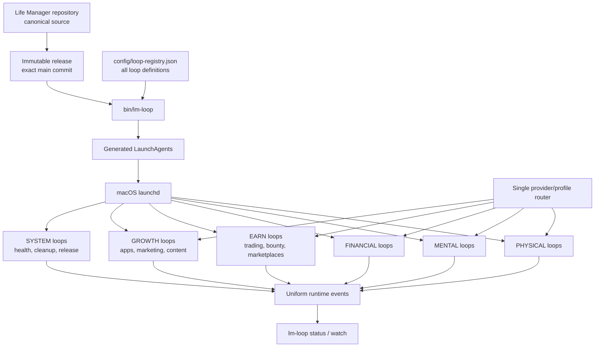

# macOS Life Manager Loop Control Plane

**Status:** Account auto complete — global current invariant, full-fleet OSS E2E, and security backlog remain
**TODO ID:** `MACOS-LOOP-CONTROL-PLANE-1`  
**Canonical registry:** `config/loop-registry.json`  
**Scope:** macOS launchd only

## Active P0 — prevent WindowServer panic and recover local loops after boot

This P0 precedes marketplace repair. “The Mac never restarts” is not a truthful acceptance
criterion: hardware, power and the operating system can always force a reboot. The required outcome
is no recurrence of the measured panic under normal loop load, automatic recovery after an ordinary
boot, and an explicit pre-login alert when macOS itself refuses automatic login after a panic.

Measured incident evidence:

- The latest boot is `2026-09-03 06:45:31 JST`; `last` has no preceding orderly shutdown.
- `/Library/Logs/DiagnosticReports/panic-full-2026-09-03-064551.0002.panic` records a userspace
  watchdog panic after WindowServer missed check-ins for 120 seconds and suffered two induced
  crashes. The compressor had reached 100% of its segment limit.
- The associated WindowServer stack was blocked through TCC on `tccd`; `sandboxd` had reached its
  64-thread soft limit. Later WindowServer watchdog reports exist, including `2026-09-06`, so this
  is a live recurrence risk rather than a closed historical incident.
- The `2026-09-06` incident was not a host reboot: `kern.boottime` and `last reboot` remain at
  `2026-09-03 06:45:31 JST`. Jetsam reports at `14:09:05`, `14:14:47`, and `14:14:59` show about
  `10.93-11.02 GiB` in the compressor with only `117-120 MiB` free. The first report contains 53
  Node processes with about `20.0 GiB` aggregate resident-page footprint and 78 Chromium renderers
  with about `9.8 GiB`; these are pressure attribution counters and can exceed physical RAM because
  compressed/shared accounting overlaps, not additive physical-memory claims.
- At `14:16:27`, WindowServer's main thread missed its check-in for 40 seconds while blocked through
  TCC waiting for `tccd`; the console session ended at `14:16`. The host stayed booted but returned
  to loginwindow. Manual console login at `18:18` recreated the Aqua session, after which user
  LaunchAgents and Chromium owners resumed. Therefore the current failure boundary is GUI-session
  loss under host-wide process/browser pressure, followed by an unowned pre-login gap.
- Disk capacity is a separate failure class. The September 6 Jetsam and WindowServer reports prove
  memory/compressor exhaustion and a TCC wait; they do not identify disk-full I/O as the trigger.
  Disk headroom remains independently guarded because a full volume can break atomic state writes,
  release construction and browser profiles, but disk cleanup is not the repair for this incident.
- FileVault is off. `sysadminctl` reports automatic login user `anicca`, `autoLoginUser=anicca`, and
  `/etc/kcpassword` exists with root-only permissions. Manual password entry after the panic was not
  caused by missing normal auto-login configuration.
- The host runs macOS 15.6 build `24G84`. The local official updater offers recommended macOS
  15.7.9 build `24G830` and separately offers the larger Tahoe 26 major upgrade.
- Current memory pressure reports 40% free, but cumulative swap/compressor activity is high and many
  Chromium renderer processes are active. This is correlation evidence; no individual loop is yet
  proven to have caused the watchdog.

Execute exactly in this order:

1. [x] `PANIC-1` Add one read-only boot/panic evidence collector to the existing control plane.
   PASS = on every boot it records boot ID/time, prior orderly-shutdown presence, panic/reset report
   identity, WindowServer/tccd/sandboxd watchdog evidence, memory/compressor counters, disk free
   bytes, and browser-owner/process/tab counts without credentials or customer data. It identifies
   the failing component boundary; it does not kill or restart a process.
   Production receipt: `boot-panic-evidence` is loaded from immutable main release
   `a3c77aafe372c8c3434e4e5122c3bb51c7514850` with `RunAtLoad`, last exit `0`, and a terminal
   `pass`. The current boot has exactly one mode-`0600` receipt keyed by boot session UUID; it
   records prior orderly shutdown `false`, component boundary `WindowServer`, four panic identities,
   six reset identities, WindowServer/tccd/sandboxd evidence, memory/compressor and disk counters,
   and aggregate browser owner/process/renderer/endpoint/tab counts. A receipt scan found zero URLs,
   user paths, bearer tokens, or API-key-shaped values. `lm-loop doctor` remains green with 175
   managed entries and zero missing, unmanaged, or installed-retired labels.
2. [ ] `PANIC-2` Measure and bound GUI-browser ownership at the source. PASS = every registered
   browser owner has a finite context/tab/renderer retention contract, stale resources are reclaimed
   only after ownership/open-file checks, and a sustained real workload no longer grows browser or
   TCC pressure without bound. Do not globally kill Chromium, WindowServer, tccd, sandboxd, Remote,
   ChatGPT, Claude, or another loop. Treat finite idempotent wakes, unique resource ownership,
   host-headroom admission, durable cursors, bounded retry/backoff, and official effect receipts as
   the shared loop-development contract; do not create a Coconala-only or browser-only supervisor.
   First source-control atom: one host-wide CDP-port lease now fail-closes a second owner with
   `browser_port_owned`/exit `75`, while distinct ports remain concurrent. Both the Life Manager
   daily-driver and Job Search browser enter through this same primitive. Focused ownership and
   dispatch tests pass (28), Job Search browser tests pass (38), and host tests pass (5). This is not
   yet released or applied; the two already-running `9222` owners remain untouched because applying
   the new contract must not kill or restart a live browser. The remaining PANIC-2 work is owner
   inventory reconciliation, unique profile/PID enforcement, finite retention, and host-headroom
   admission under sustained load.
3. [ ] `PANIC-3` Install the recommended macOS 15.7.9 maintenance update, not the Tahoe major
   upgrade, in an explicitly approved maintenance window. This step requires a restart and therefore
   waits for user approval immediately before execution. PASS = exact OS/build readback, no missing
   loop state or credentials, and the panic evidence collector starts on the new boot.
4. [ ] `PANIC-4` Prove ordinary-boot automatic recovery. PASS = controlled restart, automatic login
   reaches the `anicca` Aqua session without manual typing, every enabled managed loop returns from
   its immutable release, `lm-loop doctor` is green, and representative effect-owning loops emit
   natural terminal receipts with replay-zero. A PID alone is insufficient.
5. [ ] `PANIC-5` Make panic/login failure visible without weakening login security. PASS = a minimal
   pre-login boot-gap owner detects that the expected Aqua session and loop heartbeat did not return,
   sends one deduplicated alert through a repository-owned credential-safe path, and sends a recovery
   receipt after login. It must not store or type the account password, disable secure login, or claim
   that panic-path auto-login is guaranteed.
6. [ ] `PANIC-6` Close recurrence. PASS = seven days of normal concurrent loop load with no new
   WindowServer/tccd/sandboxd watchdog panic, bounded memory/browser counts, no unowned boot gap, and
   no duplicate external effect across recovery.

### Active execution ownership

Parallel work continues; one agent must not absorb every lane merely to avoid a handoff. Isolation
comes from exact ownership, dedicated worktrees and receipt-based integration:

| Owner | Current scope | May edit | Must not edit |
|---|---|---|---|
| PANIC/Paid owner (current Codex session) | `PANIC-2`, shared all-domain runtime contracts, Coconala Paid buyer outcomes | `runtime/loop`, shared browser ownership/admission only when required by `PANIC-2`, Paid-owned files, this control-plane spec | Apply or Storefront business behavior |
| Apply Claude owner | Coconala Apply discovery, eligibility, submission and official application readback | Apply-owned entrypoint, adapter, fixtures and acceptance notes | Paid, Storefront or host-wide runtime primitives |
| Storefront Claude owner | Coconala listing analysis, mutation, publication and official listing readback | Storefront-owned entrypoint, adapter, fixtures and acceptance notes | Paid, Apply or host-wide runtime primitives |

Each owner fetches current public `main`, works in its own locked worktree and pushes one focused
branch. If Apply or Storefront discovers a missing shared primitive, it records the required contract
and failing fixture instead of creating a lane-local scheduler, browser manager, retry framework,
ledger or watchdog. The PANIC/Paid owner implements that shared boundary once. Integration preserves
all owner commits, then proves each lane independently from one public-main immutable release. The
Claude owners should continue unless they are editing outside these boundaries or cannot provide a
focused pushed commit and acceptance evidence.

### Durable completion map

This map retains every requested outcome so later sessions cannot forget it. It does not replace or
reorder the `PANIC-1` through `PANIC-6` sequence above or the established Gig TODO sequence. Only the
first unfinished item in the controlling sequence is active; process health and buyer/business
completion remain separate.

1. [ ] Complete `PANIC-2`: attribute every Node/Python/browser owner; enforce unique profile/port/PID,
   finite runtime/worker/context/tab/renderer retention and host memory admission; defer work durably
   under pressure and reclaim only owner-proven stale resources. The current first defect is the two
   owners bound to CDP port `9222`.
   - [x] Add and test one shared host-wide CDP-port ownership primitive; route Life Manager
     daily-driver and Job Search through it in source control.
   - [x] Reconcile the historical active-label fixture: the removed Telegram bot is explicitly
     retired after its gateway cutover; production doctor remains green.
   - [x] Add registry-level browser profile/port ownership validation and record six unique owners:
     Affiliate provider/Impact/X, Gig, Lancers and the shared daily-driver. Duplicate declared
     profiles or ports now fail registry validation before apply.
   - [x] Route the Gig/Coconala browser launcher through the shared host-wide ownership primitive.
     The wrapper owns the entire launcher/Chromium process tree, while existing vault restore and
     signal forwarding remain unchanged. Focused launcher and ownership tests pass. The live Gig
     browser was not restarted; enforcement begins on its next source-derived natural launch.
   - [x] Route all three Affiliate browser owners through that same ownership primitive from their
     single shared launcher. Provider, Impact and X retain their distinct declared profile and port;
     focused launcher and ownership tests pass. Running browsers were not restarted, so enforcement
     begins on each owner's next source-derived natural launch.
   - [x] Route the Lancers browser launcher through that same ownership primitive with its declared
     profile, port and owner. Focused ownership tests and shell parsing pass. The running browser was
     not restarted; enforcement begins on its next source-derived natural launch.
   - [x] Enforce runtime profile ownership in addition to the port lease. A second owner using the
     same canonical profile on a different port now fails closed with `browser_profile_owned`, and
     each live receipt attributes both the lease supervisor PID and browser-root PID without exposing
     the profile path. Focused ownership tests pass (5).
   - [x] Enforce a finite per-owner tab admission limit in the shared target registry. The default
     is one live claimed tab per owner (matching Coconala's connector contract); room-scoped Paid
     owners remain parallel. A racing surplus target is immediately closed, while foreign and
     unowned targets remain untouched. Focused target-ownership tests pass (8).
   - [x] Release an owner's leased BrowserContext when its final claimed tab closes, including
     normal close, close-owned and hidden-target teardown. Contexts remain live while another tab
     from that owner exists. Shared lease/ownership regression tests pass (32), bounding the seed
     target and renderer lifetime without touching another owner's work.
   - [x] Add one domain-neutral macOS memory-admission primitive under `runtime/host`. It reads the
     native `memory_pressure -Q` free percentage, defaults to a 15% floor, persists a mode-`0600`
     pass/deferred receipt, and exits `75` without starting new work when pressure is unsafe or
     unmeasurable. Unit tests pass (4); no running process is killed or restarted.
   - [x] Route Coconala Paid, Apply, Reply and Storefront through memory admission before their
     existing disk guard. Their business argv and modes remain unchanged; only a new unsafe-memory
     wake is deferred. Dispatch, memory and browser-owner tests pass (24).
   - [x] Route Gig's legacy `cdp_nav_snapshot.hidden_page_target` through the shared target-owner
     ledger. It claims immediately after creation and releases after close; a killed helper leaves
     an attributable row instead of an unknowable tab. New and existing navigation/ownership tests
     pass (19).
   - [x] Route session-vault localStorage, keepalive and X re-login targets through the same owner
     ledger and put close/release in `finally` beginning immediately after target creation. Attach,
     evaluate or navigation failure can no longer bypass cleanup. Session and ownership tests pass
     (18).
   - [x] Make the shared raw-CDP CLI require an explicit or environment owner for `new` and `close`.
     New targets are atomically claimed under the same per-owner limit and closed on claim failure;
     foreign close fails before any CDP mutation. Browser CLI/session/ownership tests pass (22).
   - [x] Route the shared authenticated-page scout through target ownership with cleanup beginning
     immediately after create. Attach/evaluate failures now close and release the target. A production
     source audit finds seven remaining `Target.createTarget` paths; each is governed by the shared
     target ledger, context-lease ledger, and/or immediate `finally` teardown. Browser tests pass (23).
   - [ ] Close the remaining live-retention gap. A source-driven 25-cycle open/close probe left zero
     lease and target-owner rows and did not increase page count (2 before/after). A later 5x10 probe
     also left both ledgers empty and reduced Chromium RSS from 1.21 GiB to 1.06 GiB, but concurrent
     old-release lanes moved total pages 3→5 and renderers 6→9. Four stable unowned legacy pages and
     transient unowned hidden targets remain, so sustained host-wide boundedness is not yet proved.
   - [x] Resolve Job Search ownership from official consumer readback. The latest Job Search daily
     browser receipt at `2026-09-06T20:35 JST` names `http://127.0.0.1:9222` and the exact websocket
     ID exposed by the shared daily-driver; that endpoint held 13 targets. The dedicated Job Search
     Chromium bound only IPv6 `[::1]:9222` and held one blank target. Retire that unused Life Manager
     owner in source and make Job Search healthcheck verify `ai.anicca.life-manager-daily-driver`.
     Keep the standalone OSS launcher available outside the Life Manager registry. Production still
     runs the old dedicated owner until a separately safe, approved retirement removes its loaded
     plist; no browser was stopped or restarted during this source atom.
   - [ ] Inventory every remaining browser/Node/Python owner, then enforce bounded
     context/tab/renderer retention. Registered browser profile/port/PID ownership is now enforced.
2. [ ] Complete Coconala Paid current liabilities: preserve Ryu `18211957` official send/readback as
   completed and replay-zero; advance every other actionable purchased room independently to a useful
   buyer-visible artifact or an exact retry-owned blocker; require aggregate `failed=0`. Formal
   delivery remains off unless the separately defined authority condition becomes true.
   - [x] Bound historical terminal-room reconciliation so it cannot consume the Paid five-minute
     cadence. Each wake rotates through at most one absent/terminal candidate with a dedicated
     90-second collector timeout and 15-second owned-target cleanup budget (105 seconds worst case,
     below half the cadence); buyer-targeted readback retains its separate 180-second timeout.
     Paid-focused regression tests pass (108).
   - [ ] Production observation after release `363b78ce`: the install-time wake at `21:31 JST`
     lost the per-label nonblocking apply lock and exited `78` once, then launchd naturally retried
     at `21:36:12 JST` (`runs=2`, PID `16514`) without a kick, restart or browser intervention.
     Follow that exact run to a terminal receipt and require room `18180857` to leave `pending`;
     the latest aggregate before this run is observed `5`, pending `1`, failed `0`.
   - [x] Preserve a verified authentication-recovery blocker as retry-owned `pending`, not a
     mechanical Paid failure. An unauthenticated wait is accepted only when the result remains
     blocked with both required outcomes false and carries a provider-, URL- and readback-bound
     authentication/login recovery receipt; an unauthenticated generic blocker still fails closed.
     Paid remote regression tests pass (88). This closes the production `18180857` failure where
     TikTok exposed neither an authenticated `@anicca.jp` owner view nor an available login form.
3. [ ] Integrate the Apply owner's focused public-main commit and require complete eligible-set
   accounting, every authorized application submitted, exact official readback and replay-zero.
4. [ ] Integrate the Storefront owner's focused public-main commit and require one verified authorized
   listing effect or a truthful evidence-backed no-op, complete catalog/KPI readback and replay-zero.
5. [ ] Prove the four Coconala lanes together from one immutable public-main release: Paid has
   `failed=0`, Reply has no unowned actionable message, Apply has complete accounting, Storefront has
   verified effect/no-op, and no lane waits on or mutates a sibling owner.
6. [ ] Prove all-domain reuse with two real consumers: route one Coconala path and one non-gig loop
   (first candidate: Affiliate) through the same lifecycle, admission, ownership, durable cursor,
   retry, event and effect-receipt contracts before extracting any further abstraction.
7. [ ] Complete the provider-neutral gig contract with Coconala plus one second live marketplace;
   then add Lancers and CrowdWorks only as provider session/discovery/message/effect/readback adapters.
8. [ ] Move remaining Affiliate, trading, publishing, social, health and future loops onto the shared
   runtime when each is next changed; remove a duplicated primitive only after its replacement passes
   that loop's existing official outcome check.
9. [ ] Prove local/cloud continuity: equivalent durable work-item and receipt schemas, distributed
   effect lease before multi-host execution, safe resume after worker loss and duplicate effects zero.
10. [ ] Complete `PANIC-5` and `PANIC-6`: detect GUI/login gaps externally, send one deduplicated alert,
    record recovery, then observe seven days of normal concurrent load with bounded memory/browser and
    disk headroom, no new WindowServer watchdog and no duplicate external effect.

`PANIC-3` and `PANIC-4` retain their original positions and approval requirements above. Current work
stops at that boundary after `PANIC-2`; it does not silently advance the P0 sequence while the explicit
no-restart instruction remains active. No later item may claim that an OS update or controlled reboot
occurred until those acceptance steps are actually authorized and measured.

## 1. Overview

Life Manager will operate hundreds of loops across physical life, mental life,
financial life, trading, bounties, marketplaces, mobile-app revenue, marketing,
and system maintenance. Today those loops are installed, released, started,
observed, and cleaned through several independent manifests, plist families,
scripts, release roots, and log formats. That fragmentation makes runtime truth
hard to read and makes a new loop easy to install incorrectly.

`MACOS-LOOP-CONTROL-PLANE-1` makes the Life Manager repository the single source
for every macOS loop. `config/loop-registry.json` becomes the only operational
registry. One CLI renders launchd jobs from it, applies an immutable repository
release, and provides the same lifecycle and observability commands for every
loop. Mutable business state, credentials, logs, evidence, and receipts remain
outside the repository and outside immutable releases.

The control plane manages lifecycle. Existing loop adapters continue to own
business effects through `plan → execute → reconcile → verify → report`.
Individual loops MUST NOT implement their own installer, account switcher,
release selector, monitor, or global cleanup policy.

The control plane is domain-neutral. Gig marketplaces, affiliate revenue,
trading, publishing, health and future money/life loops reuse the same lifecycle,
capacity admission, resource ownership, durable cursor, bounded retry, event,
effect-receipt and recovery primitives. Domain modules add only behavior proven
common to two real consumers. Provider adapters add only API/DOM/session terms
and official effect/readback. A loop adds only its objective, model context and
cursor. New domains must not copy these primitives into their own skill tree or
introduce a second scheduler, watchdog, provider router, event format or ledger.

```text
runtime/loop (all domains)
  -> domain kernel (only proven domain behavior)
    -> provider adapter (API/DOM/session/effect readback)
      -> loop objective and cursor
```



## 2. Acceptance Criteria

1. `config/loop-registry.json` contains every Life Manager-owned macOS launchd
   label. No second manifest is authoritative for installation or lifecycle.
2. Every registry entry has exactly one stable loop ID, launchd label, domain,
   repository-relative entrypoint, cadence, effect class, state root, log root,
   cleanup contract, and provider route.
3. `bin/lm-loop apply` validates the complete registry, resolves one exact
   immutable release, generates every plist, loads changed jobs through
   `launchctl-safe`, and reads the loaded arguments back. Invalid entries cause
   zero launchd mutation.
4. `bin/lm-loop start|stop|restart <loop-id|all>` is the only lifecycle command
   documented for operators. `all` expands from the registry and records every
   label result without stopping after the first failure.
5. `bin/lm-loop status [<loop-id|all>]` reports loop ID, domain, launchd state,
   PID when present, installed release SHA, provider/profile alias, last pass,
   last terminal result, next eligible run, and current blocker.
6. `bin/lm-loop watch [<loop-id|all>]` continuously renders the same fields and
   updates from uniform runtime events. It does not infer business success from
   PID existence or exit code alone.
7. Every loop emits JSONL events using one envelope: `version`, `event_id`,
   `timestamp`, `loop_id`, `domain`, `run_id`, `phase`, `status`, `release_sha`,
   `provider`, `profile_alias`, `effect_class`, `effect_status`, `blocker`, and
   `evidence_refs`. Secret values and credential identifiers are forbidden.
8. All model execution goes through one shared provider/profile router. Loop
   code cannot read or replace `auth.json`, choose `CODEX_HOME`, or implement
   account fallback independently.
9. Each loop owns bounded cleanup of its regenerable run artifacts using the
   registry cleanup contract. The central cleanup owner handles only shared
   releases, shared caches, and orphaned artifacts. State ledgers, receipts,
   active releases, protected sessions, and credentials are never cleanup
   candidates.
10. A new loop becomes operable by adding one registry entry plus its tested
    repository-relative entrypoint. No handwritten plist or new monitoring
    integration is required.
11. At least 500 valid registry entries validate and render deterministically;
    `status all` completes within five seconds on the target Mac without starting
    a model or browser.
12. Migration never stops all production loops together. Each label moves only
    after its generated plist, immutable entrypoint, state path, and loaded
    arguments pass readback; failure retains the prior loaded job.
13. After a Mac reboot, enabled loops return through launchd, `doctor` reports no
    unmanaged Life Manager labels, and a natural scheduled pass emits a uniform
    event from the installed release.
14. Every loop change follows `skills/loop-development/SKILL.md`: one locked
    worktree, one registry owner, repository-contained source, state outside the
    release, test-first change, exact release apply, loaded readback, natural
    event, and replay-zero. `AGENTS.md` and `CLAUDE.md` route agents to that
    contract rather than duplicating it.

### Operator interface

```text
bin/lm-loop apply
bin/lm-loop doctor
bin/lm-loop start <loop-id|all>
bin/lm-loop stop <loop-id|all>
bin/lm-loop restart <loop-id|all>
bin/lm-loop status [<loop-id|all>]
bin/lm-loop watch [<loop-id|all>]
```

### Registry contract

```json
{
  "schema_version": 2,
  "loops": {
    "fundraiser": {
      "label": "ai.anicca.fundraiser",
      "domain": "earn",
      "entrypoint": "skills/fundraiser-agent/runtime/run.sh",
      "cadence": {"start_interval_seconds": 60},
      "effect_class": "application",
      "state_root": "~/.local/state/life-manager/fundraiser",
      "log_root": "~/.local/state/life-manager/fundraiser/logs",
      "cleanup": {"max_runs": 100, "max_age_days": 14},
      "provider_route": "shared-agent-runner"
    }
  }
}
```

The example defines the contract shape; implementation validates allowed domain,
effect, cadence, and route values centrally. Registry values never contain
credential paths or credential contents.

Allowed values are closed and versioned with the registry schema:

- `domain`: `physical`, `mental`, `financial`, `earn`, `growth`, `system`
- `effect_class`: `none`, `publish`, `message`, `money`, `application`, `trade`,
  `account_mutation`
- `provider_route`: `deterministic`, `shared-agent-runner`
- `cadence`: exactly one of `start_interval_seconds`, `calendar_interval`,
  `run_at_load`, or `keep_alive`

## 3. As-Is / To-Be

| Concern | As-Is | To-Be |
|---|---|---|
| Registry | `config/loop-registry.json`, Gig manifest, job-search plists, and independent plist families | `config/loop-registry.json` only |
| Install | Per-loop installers and direct plist edits | `bin/lm-loop apply` |
| Runtime source | Several release roots and some working-tree paths | One exact immutable Life Manager commit per applied generation |
| Lifecycle | Raw `launchctl`, individual scripts, label knowledge | `lm-loop start/stop/restart` by loop ID |
| Observation | PID, logs, ledgers, and provider receipts inspected separately | Uniform event envelope plus official effect evidence |
| Provider/profile | Per-loop `CODEX_HOME`, auth file, or runner config | One shared provider/profile router |
| Cleanup | Central cleanup plus inconsistent local retention | Per-loop bounded cleanup plus central shared-artifact GC |
| Scaling | Adding a loop requires bespoke plumbing | One registry row plus entrypoint |
| Runtime truth | plist text or working tree can be mistaken for production | loaded launchd args + release SHA + event/effect readback |

## 4. Test Matrix

| # | To-Be | Test name | Cover |
|---:|---|---|---|
| 1 | One authoritative registry | `test_registry_covers_all_life_manager_launchagents` | OK |
| 2 | Complete validated entry | `test_registry_rejects_missing_or_secret_fields` | OK |
| 3 | Atomic apply and loaded readback | `test_apply_is_atomic_and_reads_loaded_arguments` | OK |
| 4 | One lifecycle interface | `test_lifecycle_all_collects_every_label_result` | OK |
| 5 | Uniform status | `test_status_reports_runtime_and_business_truth_separately` | OK |
| 6 | Uniform watch | `test_watch_updates_from_event_envelopes` | OK |
| 7 | Event contract | `test_event_envelope_rejects_secret_and_unknown_fields` | OK |
| 8 | Shared provider router only | `test_loop_entrypoints_do_not_select_auth_or_codex_home` | OK |
| 9 | Cleanup ownership | `test_cleanup_preserves_receipts_active_releases_and_sessions` | OK |
| 10 | One-row onboarding | `test_new_registry_loop_needs_no_handwritten_plist` | OK |
| 11 | 500-loop scale | `test_render_500_loops_and_status_under_five_seconds` | OK |
| 12 | One-label migration safety | `test_failed_migration_retains_prior_loaded_job` | OK |
| 13 | Reboot recovery | `test_bootstrap_generation_has_enabled_recoverable_jobs` | OK |
| 14 | Natural runtime E2E | `test_natural_pass_reports_installed_release_and_effect_state` | OK |
| 15 | Safe loop development | `skills/loop-development/SKILL.md` plus completion audit | OK |

### E2E judgment

| Item | Value |
|---|---|
| UI変更 | なし（terminal CLIのみ） |
| 結論 | Maestro: 不要（iOS UIを変更しない） |
| 必須E2E | clean macOS user install、launchd loaded readback、Mac reboot、自然scheduled pass、`status/watch` readback |

## 5. Boundaries

- macOS launchd only. Linux, Windows, Kubernetes, and cross-platform scheduler
  abstractions are out of scope.
- No new daemon, database, web dashboard, TUI framework, or message bus.
- The mutable repository checkout is never a production entrypoint.
- Business decisions remain inside loop agents and adapters; the control plane
  does not decide trades, applications, publications, messages, or spending.
- The control plane does not count PID, process liveness, local PASS, or model
  output as a completed external effect.
- Credentials remain in private per-profile stores. The repository contains
  aliases and route names only.
- The router does not combine personal ChatGPT subscriptions to circumvent
  provider usage limits. Provider-supported API capacity and explicit profile
  selection remain separate concerns.
- Account/profile management is not duplicated inside loop definitions.
- Historical logs and specs are not rewritten; only current runtime authority
  moves to this control plane.

## 6. Execution Steps and Ordered TODO

| Order | TODO | Done evidence |
|---:|---|---|
| 1 | ✅ Inventory every installed `ai.anicca.*` Life Manager label and classify owner/domain/effect/state/release | `docs/evidence/runtime/2026-08-28-macos-loop-control-plane-inventory.{md,json}`; 226 installed labels, 208 classified Life Manager-owned, 14 disabled/unloaded installed ambiguous, loaded/disabled-only rows retained |
| 2 | ✅ Upgrade `config/loop-registry.json` to schema v2 and import all active definitions without changing launchd | 169/169 active classified labels, one external and two retired labels; fixture SHA-256 `35e3b1ae25ed87a815772b14c00c4a87e7e38a87e125bba98f1c04661b9b6c49`; `docs/evidence/runtime/2026-08-28-macos-loop-control-plane-schema-v2.md` |
| 3 | ✅ Implement `bin/lm-loop doctor/status/watch` as read-only commands | five focused tests; live 172-row status/watch; runtime/effect truth separated; `docs/evidence/runtime/2026-08-28-macos-loop-control-plane-readonly-cli.md` |
| 4 | ✅ Implement plist generation and fail-closed `apply` using `launchctl-safe` | five focused tests; production invalid generation zero mutation; isolated exact loaded argv readback and cleanup; `docs/evidence/runtime/2026-08-28-macos-loop-control-plane-atomic-apply.md` |
| 5 | ✅ Implement `start/stop/restart` for one ID and `all`, collecting every return code | four focused tests; isolated one-label start/restart/stop; real collect-all `[0,2,0]`; cleanup remaining 0; `docs/evidence/runtime/2026-08-28-macos-loop-control-plane-lifecycle.md` |
| 6 | ✅ Add the uniform runtime event envelope at the shared runner boundary | exact 15-field schema; private idempotent JSONL; shared-runner integration; invalid-event spoof rejection; existing ledgers unchanged; `docs/evidence/runtime/2026-08-28-macos-loop-control-plane-runtime-events.md` |
| 7 | ✅ Consolidate all model/profile selection into the shared provider router | one explicit `acct2` profile; account rotation and caller provider override 0; duplicate runner 0; active entrypoint direct auth/CODEX_HOME selection 0; Writer normal/repair/session delegated; `docs/evidence/runtime/2026-08-28-macos-loop-control-plane-provider-boundary-progress.md` |
| 8 | ✅ Add per-loop cleanup contracts and central shared-artifact GC reconciliation | immutable loop-run wrapper; marker/terminal/protected gates; loaded/current release protection; isolated 2,097,203-byte pressure recovery; protected deletion 0; `docs/evidence/runtime/2026-08-28-macos-loop-control-plane-cleanup.md` |
| 9 | ✅ Migrate active labels one by one: system, growth, earn, financial, mental, physical | reboot candidate 168/168 exact generated plist and loaded argv; unsafe AutoHedge subsequently retired; current managed 167, retired 43 |
| 10 | ⚠️ Remove superseded installers/manifests only after registry parity and replay-zero | Tier1 is retired, but obsolete `hf-gig-release-watch` was retained and currently exits 2 every five minutes; retire it instead of integrating it |
| 11 | ✅ Run 500-loop scale test and clean-user install E2E | persistent scale test; isolated empty-user 168/168 install/readback; no model/browser starts |
| 12 | ✅ Run reboot and natural scheduled-pass E2E on the target Mac | boot ID changed; 168/168 recovered from existing release; doctor PASS; 356 boot-window events across 72 loops; process/effect truth separated |
| 13 | ✅ Make safe loop development discoverable to every coding agent | `skills/loop-development/SKILL.md`; one-line routing in `AGENTS.md` and `CLAUDE.md`; worktree locked against prune/remove |

Implementation commands are standardized by this spec:

```bash
python3 -m unittest discover -s runtime/loop/tests -p 'test_*.py'
node --test apps/life-manager/lib/loop-adapter-registry.test.js
bin/lm-loop doctor
bin/lm-loop apply
bin/lm-loop status all
bin/lm-loop watch all
```

No user GUI task is required. Authentication stays in existing private profile
stores; this control-plane slice never creates or copies credentials.

### TODO 7 execution state

Account rotation and per-caller provider overrides are removed. Gig, Job
Search, Connector, Life Manager daily, Lancers portable releases, and all X
model calls use the canonical runner with one explicit `acct2` profile. The
duplicate Gig runner is removed after token-budget/history/context parity is
moved. Writer opportunity discovery/response use the shared adapter, while the
legacy Writer CLI delegates production normal and repair/session modes to the
canonical router. Direct active-entrypoint auth/profile selection is zero. Evidence:
`docs/evidence/runtime/2026-08-28-macos-loop-control-plane-provider-boundary-progress.md`.

### TODO 9–13 execution state

The 168-label reboot candidate recovered through the same launchd control plane
after a real Mac reboot. AutoHedge was then found to bypass the shared provider
boundary while being misclassified as effect `none`, so it was retired rather
than silently left unsafe. Current registry truth is 167 managed, 43 retired,
and 20 explicit external labels. Runtime source, dependencies, argv, cleanup, provider
routing, and terminal events resolve through immutable releases. Natural
boot-window events keep process status separate from official effect status;
failed business loops remain visible rather than being counted as healthy.
The final merged release applies 167/167 labels, emits 167/167 install events,
and gives every registered loop an event at the installed SHA. `doctor` passes
with unmanaged, missing-entrypoint, and installed-retired counts all zero.

Loop development now has one repository contract:
`skills/loop-development/SKILL.md`. Agents work in locked linked worktrees,
change one registry TODO, keep source in this repository and state outside the
release, use only `lm-loop` for lifecycle, and require exact loaded readback plus
a natural event before Done. Completion evidence:
`docs/evidence/runtime/2026-08-28-macos-loop-control-plane-completion.md`.

### Post-completion operational repair cursor

> Current scope override: this cursor owns only Account auto rollout and OSS
> startup. Marketplace-specific repair (including Lancers and CrowdWorks) is
> outside this session. Business work is always performed by the owning loop;
> Codex repairs source/spec/releases, triggers that real loop, and observes
> authoritative readback.

The control plane is complete; business-loop repair continues one loop at a
time from `lm-loop status all`. Current measured inventory is 167 rows: 36
loaded-running and 131 loaded-idle. Terminal history contains 61 pass, 80 fail,
and 26 without a terminal result. A terminal failure is retained as audit
history while a KeepAlive process is running, so 80 is not by itself an
actionable repair count.

#### Target operating model

- Coconala remains the working local reference and is never stopped merely to
  generalize the system. The shared job-doing kernel owns goal, capability,
  context, effect fence, delivery, official readback, replay-zero, and revenue;
  marketplace-specific URLs, selectors, fees, message rooms, and receipts stay
  in thin adapters.
- Upwork remains intentionally off. Its code may serve as implementation
  evidence, but its retired launchd labels are not restarted and it is not an
  activation TODO.
- Lancers and CrowdWorks remain separate marketplace backlogs. They are not
  Account auto or OSS-startup tasks and are not touched by this cursor.
- Delivery order is local-first, then the same contract on the cloud worker,
  then an OSS setup that a new user can start with a few documented commands.
  The current `scripts/local-up.sh` starts only the Docker API, scheduler, and
  worker; it does not install or run all 167 macOS loops. The clean-user launchd
  test renders and reads back jobs without starting workloads. Therefore
  few-command full-loop OSS startup is not yet implemented.
- Account 1 primary to Account 2 fallback is implemented in the shared runner.
  Expansion uses `account_profile_order=[acct1,acct2]`; Account 2 is attempted
  only for transient quota/auth failure with no fresh result, agent message,
  tool item, or external effect. PR #2983 proves Account 1 success and a
  controlled Account 1 quota to real Account 2 success with effect 0.

#### Daily operation and repair

1. Build one resolver view containing managed, external, retired, and unmanaged
   labels. Continuous jobs are healthy only while loaded-running. Scheduled
   jobs are healthy while loaded-idle only when their next eligible time is not
   overdue and their latest due pass has a valid terminal event.
2. Remove unused jobs instead of healing them. Retirement removes the registry
   owner, installed job, legacy installer/recreator, and active process while
   preserving audit receipts and proving recreation zero.
3. Rank the remaining queue: unmanaged or duplicate owners first, overdue
   external-effect loops second, failed deterministic support loops third, and
   missing-event classification last. Work one loop at a time.
4. Repair in a locked worktree, merge main, cut one immutable release, apply one
   label, and prove loaded argv plus natural runtime event. Never restart all
   loops to repair one.
5. For messages, applications, publication, delivery, payment, or trade, require
   official provider/account readback and replay-zero. Process exit zero is not
   business success.
6. Send one daily Telegram summary with resolver totals, deleted unused jobs,
   the one repaired loop, official effect evidence, remaining cursor, and any
   fail-closed blocker.

Completed implementation history:

Completed evidence: `affiliate-browser` is repaired by PRs #2946, #2947, and
#2949. Account 1 primary/Account 2 pre-effect fallback is merged by PR #2983
and deployed at `3d69c74b`; real controlled reads prove `acct1` success and
`acct1 quota -> acct2 success` with effect 0. Obsolete `hf-gig-release-watch`
is retired by PR #2986, not loaded, not installed, and has no production
recreator. Completed items are not part of the remaining queue.

1. ✅ Implement Account 1 to Account 2 pre-effect fallback in the shared runner.
   PR #2983 is merged; controlled real readback proves both primary success and
   quota-triggered fallback success.
2. ✅ Finish loop-owned Account auto rollout. `life-manager-dev` now cuts pushed
   main into a complete immutable release and reconciles only
   `shared-agent-runner` rows that are `loaded-idle`; `loaded-running` rows are
   reported and untouched. PRs #3010, #3012, and #3015 are merged. A real owner
   pass completed `eligible=63`, `failed=0`, and `skipped_running=12`. The final
   capability audit covers all 78 consumers: installed SHA missing 0 and every
   installed release is a descendant of Account auto merge `3d69c74b`. Current
   runtime state is 61 loaded-idle, 16 loaded-running, and 1 unloaded; exact
   equality with mutable `current` is not a capability gate while main advances.
3. ✅ Make the portable OSS subset startup truthful: a few commands provision local-only state,
   secrets, choose supported loops, start local scheduler/workers, install the
   platform-appropriate supervisor, and show runtime ownership. PR #3024 makes
   `scripts/local-up.sh` build the shared runtime image once, then starts the
   Compose stack without duplicate builds; it also makes `lm-loop apply
   --help` fail before mutation. A clean Colima run created the local-only
   password and brought API, scheduler, worker, liveness, Postgres, and object
   store to healthy from one command.
4. ✅ Prove the portable OSS supervisor owns parallel work after the initiating shell
   exits. PR #3025 extends `local-up.sh status` with scheduler owner,
   `loops_enabled`, effect scheduler flags, worker capabilities, and liveness
   last-poll readback. After the start shell exited, all six services remained
   healthy; scheduler PID 3176 and worker PID 3193 were distinct and both used
   `restart=unless-stopped`. Default supported capabilities were
   `runtime.noop,marketing.liveness.telegram`; financial and all marketing
   external-effect schedulers read back false. Do not claim every private Dais
   loop is portable; unsupported or unconfigured capabilities remain
   explicitly off.
5. ✅ Track repo-wide nonrequired security-CI debt separately from loop health.
   Latest main measures OSS self-contained boundary 336 findings (stale source
   root and absorbed-source inventories), PII shape gate 28 redacted findings,
   Python syntax failures 0, and production dependency audit 24 findings (17
   low, 2 moderate, 5 high, 0 critical). The high findings are transitive
   OpenTelemetry, `brace-expansion`, and `fast-uri` paths. These are a separate
   security/consolidation backlog; they do not change Account auto, local
   supervisor health, or external-effect receipts, and are not silenced with a
   blanket allowlist or breaking `npm audit fix --force`.

#### Current measured state and remaining TODO — execute only in this order

Current registry has 166 managed rows and unmanaged labels 0. Account auto is
present in all 78 shared-runner consumers with installed SHA missing 0. Current
runtime has 61 loaded-idle, 16 loaded-running, and 1 unloaded shared-runner
consumer. Every installed release SHA contains Account auto merge `3d69c74b`. The
controlled proof remains Account 1 success plus Account 1 quota/auth failure to
real Account 2 success with external effect 0. Clean-user launchd E2E is not an
Account auto acceptance gate.

The global release invariant remains red after the earlier recovery. Active
`current` is sparse `c38659a4` with paths limited to control/runtime, shared
browser, Gig, and Writer code. `lm-loop doctor` reports 107 missing
entrypoints, unmanaged 0, and retired-installed 0. Existing loops
continue from their installed immutable releases, so this does not remove
Account auto, but new fleet-wide operations cannot use `current` as a complete
release. The two-file invariant fix is committed and pushed as `dc8d165b` in
PR #3108. Its merge-result checks are all green, including Loop control, OSS
self-contained, PII shape, Python, shell, gitleaks, and TruffleHog. This is not
production completion until PR #3108 is merged, a full release is deployed,
and live readback stays green after a later sparse cut.

Full-fleet OSS startup is partially implemented by PR #3047. The existing
`scripts/local-up.sh` now provides `loops-up <id>...`, `loops-status`, and
`loops-down`. Selection is explicit with default zero, saved as a local
mode-600 profile, and supervised by existing launchd/`lm-loop`; unknown IDs and
missing or mis-permissioned user credential stores fail before release or
launchd mutation. Docker behavior is unchanged. Completion remains unproven:
PR #3049 adds `loops-init`, which atomically creates or validates the canonical
version-1 `credentials` list without adding or printing values. An isolated
clean HOME proves parent mode 700, file mode 600, and byte-identical replay.
The clean-user natural-run E2E remains and is required only for the public
full-fleet OSS claim. Production labels are not reused for this proof.

Security gates on PR #3108 already prove OSS self-contained, PII shape, Python
syntax, shell syntax, and secret scans green for its merge result. The remaining
security acceptance is the production dependency audit: critical and high must
both read 0 without `npm audit fix --force` or compatibility regression.

| Order | Remaining TODO | Done evidence | Working-time estimate |
|---:|---|---|---|
| 1 | Close the global `current` invariant. Merge PR #3108; a sparse cut must leave `current` byte-identical, target-specific apply may use its explicit immutable release, and all-label apply must still require the full current release. Then cut/deploy one full main release through the owner without restarting running loops. | `current/RELEASE.json` is `ALL`; sparse-cut replay leaves its symlink unchanged; `lm-loop doctor` is green with missing 0, unmanaged 0, and retired-installed 0; every installed argv points to an existing immutable release; running loops were not restarted. | 30–90 minutes, including full release build and live readbacks. |
| 2 | Finish full-fleet OSS startup by running the clean-user natural E2E for the implemented profile, credential initialization, and launchd supervisor commands. This is not required to re-prove Account auto. Never reuse a production label, bundle Dais credentials, or claim private provider loops work without user-owned setup. | From an isolated macOS user/domain: documented few-command setup, user-owned secret initialization, selected effect-none loop starts, initiating shell exits, supervisor retains it, a natural terminal event carries the installed SHA, and the resolver separates liveness, blocker, terminal result, and effect status; test-only state is removed afterward. | 30–60 minutes after an isolated macOS user/domain is available. |
| 3 | Close the remaining security backlog without blanket allowlisting or `npm audit fix --force`: remeasure production dependencies, then upgrade only the parent packages responsible for critical/high findings. | Current merge-result OSS/PII/Python/shell/secret gates stay green; dependency audit critical 0 and high 0; focused runtime compatibility checks pass. | 1–3 hours, depending on transitive upgrade compatibility. |

### TODO 1 execution state

The read-only capture joins installed plist text with loaded and disabled
launchd readback. It records the complete 266-label union, including 40 labels
without an installed plist, rather than treating plist presence as runtime
truth. The installed set contains 208 classified Life Manager-owned labels. The
169 loaded jobs are represented by schema-v2 entries; 39 disabled jobs remain
migration inventory. Fourteen installed disabled/unloaded labels and 29
loaded/disabled-only labels remain explicitly ambiguous. Unknown releases,
mutable checkout paths, and three invalid plists fail closed for migration. No
launchd mutation or cleanup occurred during inventory.
