# Life Manager Cloud Telegram-First Product UX Design

状態: APPROVED — launch coreを先にreleaseし、その後local/cloud共通harnessをElizaOSへ段階移行する。発売前の全面rewriteは禁止

正本範囲: public QRから始まる初回体験、日常のTelegram体験、cloud/self-host共通境界、将来の会話runtime

実装契約と現在地:

- on-time coreのMUST/DO NOT → `2026-08-26-life-manager-cloud-on-time-core-design.md`
- atomic implementation order → `../plans/2026-08-28-life-manager-cloud-on-time-core-finish.md`
- 測定済みstatusとreceipt → `.superpowers/sdd/2026-08-26-life-manager-cloud-on-time-core/progress.md`

## 1. Telegramが製品で、Webは3分の設定画面に限定する

Telegramが製品である。

Life Manager Cloudは、ユーザーが予定表や乗換アプリを何度も開かなくても、次の予定へ時間どおり動ける状態を作る。日常の主画面はTelegramと電話で、Webは初回設定、接続状態、課金確認にだけ使う。

MVPではGoogle Calendarを予定の保存先として1回接続する。ユーザーはGoogle Calendarを毎日開く必要はない。Calendarそのものを不要にするには、後続phaseでTelegramから予定を作成・変更する会話機能を追加する。

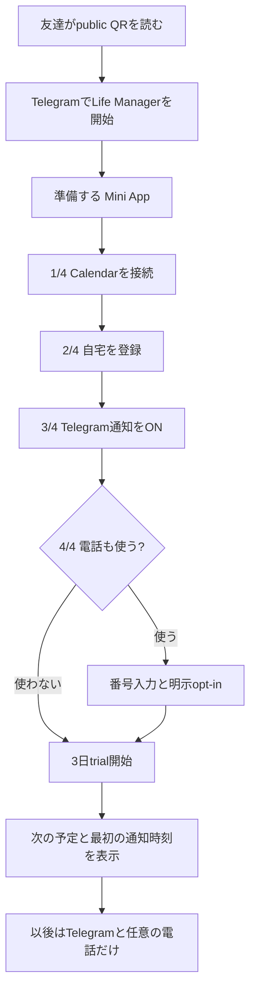

## 2. 初回画面は一画面一判断にする

迷わせない。

Telegramの署名済みactorがtenant identityになる。Supabase loginは表示しない。Google画面はCalendar consentの1回だけ開く。Telegram profileに名前があれば名前入力も表示しない。

### 2.1 QRから最初の価値まで

```text
┌─────────────────────────────┐
│ Telegram                    │
│                             │
│ Life Manager                │
│ 遅刻しないための準備を      │
│ 3分で終わらせます。          │
│                             │
│ [ 準備する ]                 │
└─────────────────────────────┘
                │
                ▼
┌─────────────────────────────┐
│ Life Manager          1 / 4 │
│                             │
│ カレンダーをつなぐ           │
│ 予定を読み、必要な時だけ      │
│ Telegramで知らせます。       │
│                             │
│ [ Calendarを接続 ]           │
└─────────────────────────────┘
                │
                ▼
┌─────────────────────────────┐
│ Life Manager          2 / 4 │
│                             │
│ 住んでいる場所               │
│ [ 東京都新宿区……………… ]    │
│                             │
│ [ 次へ ]                     │
│ 位置共有中は現在地を優先      │
└─────────────────────────────┘
                │
                ▼
┌─────────────────────────────┐
│ 準備できました ✓             │
│                             │
│ 次の予定                     │
│ 08:40  MUIT 出社             │
│                             │
│ ✓ 移動時間を自動追加          │
│ ✓ 出発5分前に乗換を送信       │
│ ✓ 電話ONならT-10/T-5に着信    │
│                             │
│ 無料期間  残り3日             │
│ [ Telegramへ戻る ]           │
└─────────────────────────────┘
```

### 2.2 画面契約

| 画面 | 主操作 | 表示してはいけないもの |
|---|---|---|
| Telegram `/start` | `準備する` | uid、chat ID、token、Google login |
| Calendar | `Calendarを接続` | Supabase login、別のaccount作成 |
| Home | 住所入力 | background GPSを取得しているという表現 |
| Notifications | `通知を有効にする` | 電話同意との抱き合わせ |
| Phone | 入力またはskip | 入力しただけでcall ON |
| Call | `電話で確認する`またはskip | default opt-in |
| Ready | 次予定、提供価値、trial期限 | 必須checkout、未検証の成功表示 |

## 3. 日常は三つの先回りだけに絞る

通知は三つだけでよい。

ユーザーが日常的に受け取るのは、移動block、Telegram乗換、任意の電話である。設定画面を開かせる通知や、価値のない定期メッセージは送らない。

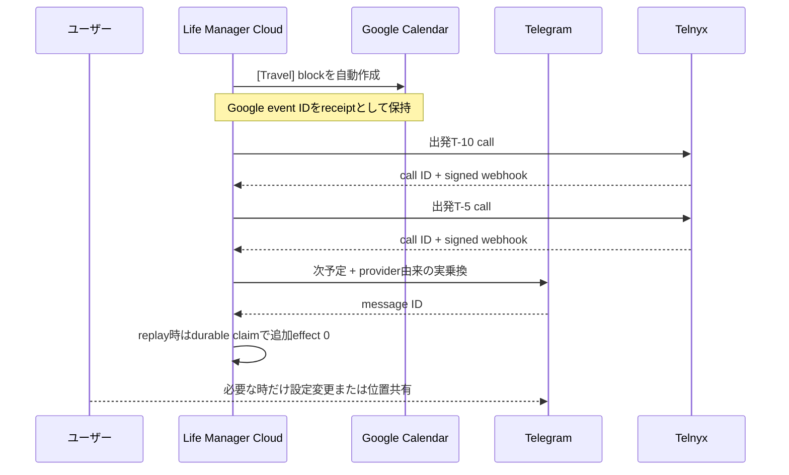

### 3.1 Telegram本文

```text
🚆 次は 08:40「MUIT 出社」

08:14 出発 → 08:40 到着予定
目的地: MIRSUBISHI UFJ INFORMATION TECHNOLOGY

08:18 信濃町駅
中央・総武線 → 四ツ谷駅
丸ノ内線 → 赤坂見附駅
徒歩 6分 / 乗換 1回

[今から出る] [位置情報を送る] [通知設定]
```

表示するのはproviderが返した事実だけである。出口、最適車両、混雑を推測しない。元eventのtitle/locationは表示とclaim identityに残し、経路計算だけにautofill済み住所を使う。

## 4. 既存coreを守り、ElizaOSをlocal/cloud共通agent harnessとして採用する

置き換えない。

on-time coreは決められた時刻に同じ結果を出す必要がある。LLMの自由判断をscheduler、dedupe、provider receiptへ混ぜない。将来の会話runtimeは、ユーザーの依頼を既存toolへ翻訳する入口として追加する。

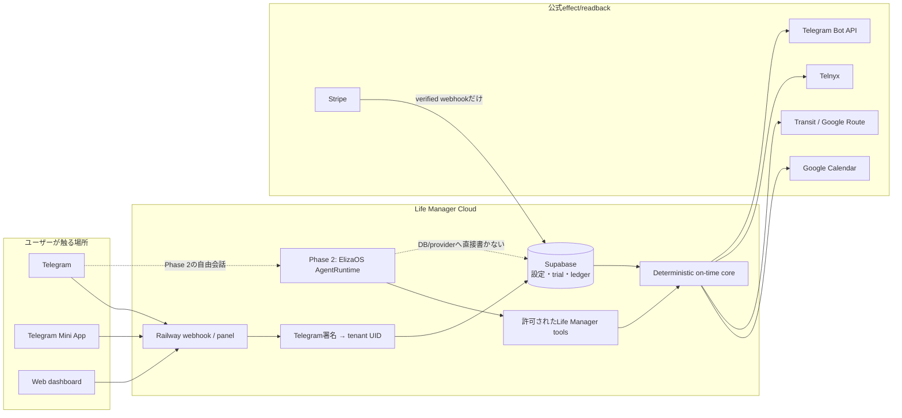

### 4.1 唯一の選択: ElizaOS

agent runtimeを比較し続けない。localとcloudの両方で固定commitのElizaOSを使う。OpenClaw、Hermes、OpenClawMU、独自agent loopは採用しない。Life ManagerはEliza plugin/actions/servicesだけを所有する。

cloneしたEliza固定commit`29bed1bb394a2c0c7c0df6dc12babbe28667efbe`のproduction codeから、次を確認した。

1. `AgentRuntime`がagentごとのactions、providers、evaluators、services、model routing、memory、database adapter、message loopを一つのkernelとして所有する。
2. local agent serverとcloud dedicated agent-serverが同じ`@elizaos/core` AgentRuntimeとplugin packagesを実行する。
3. cloudにはcontainer-free shared tierと、isolated containerを持つ`dedicated-lazy`/`dedicated-always` tierが既にある。
4. Shared conversationはCloudflare Durable Objectでagent/roomごとに順序化され、client message IDのclaim/replay/conflictを持つ。
5. Personal Telegram edgeはprovider message IDを保存するstrongly ordered delivery ledgerを持ち、ambiguous sendをtombstoneにして再送を防ぐ。
6. schedulerはPostgres-backed task store、atomic `claimForFire`、idempotency key、CAS update、apply receiptを実装している。
7. cloud control planeはorganization/user tenancy、agent quota、shared→dedicated cutover、container lifecycle、warm pool、billing、Stripe、tenant DBを既に持つ。
8. local Dockerとremote dedicated containerのproviderが同じsandbox interfaceに実装されている。

したがって、agent loop、plugin system、session/memory schema、Telegram connector、cloud turn coordinator、scheduler、container control plane、shared/dedicated tierをLife Manager側で再実装しない。

### 4.2 OpenClawとのcode-backed比較

| 判断軸 | OpenClaw固定commit | Eliza固定commit | Life Manager判断 |
|---|---|---|---|
| local personal assistant | Gateway、Telegram spool、SQLite replay guard、cronが強い | AgentRuntime、desktop/mobile、plugin ecosystemがある | 両方可 |
| cloud multi-tenant | upstreamはsingle operator。AWS sampleを別途接続する必要がある | shared/dedicated tier、org/user tenancy、billing、container lifecycleが同repo | Eliza |
| Telegram exactly-once | disk spool + bot/chat/message replay guard | Durable Object delivery ledger + provider message IDs + uncertain tombstone | CloudではEliza |
| local/cloud同一code | 同じGatewayをtenant別containerで動かせる | local/dedicatedは同じAgentRuntime/plugin。sharedは互換subset | Eliza dedicated-lazyを基準にする |
| scheduler | local SQLite cron | Postgres task store、atomic fire claim、CAS、receipt | Eliza |
| billing/plan | なし。Life Manager側でcontrol planeが必要 | quota、credits、Stripe、compute billing、shared→dedicated upgradeあり | Eliza |
| 導入の軽さ | 小さく始めやすい | cloud全体は大きくbeta | OpenClaw |
| 独自cloud architecture量 | 多い | 少ない | Eliza |

OpenClawのTelegram実装は良いが、Life Managerが必要とするpublic SaaS、tenant、billing、shared/dedicated computeをOpenClawの外で設計する必要がある。それは「独自architectureを作らない」という決定に反する。Eliza Cloudは巨大で運用も複雑だが、複雑さそのものが既にupstream codeとして実装されているため、Life Managerが新しく設計する量は少ない。

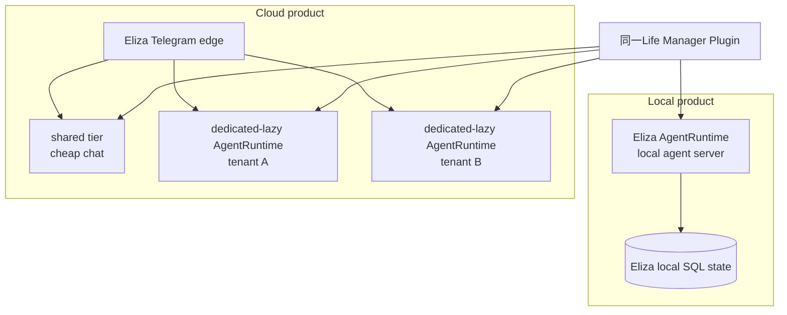

Eliza Cloudをゼロからcopyして独自mini-cloudを作らない。upstream forkを固定し、Life Manager pluginとbranding/provider settingsだけを差分にする。既存Supabase/Stripe/on-time ledgerは移行期間中のauthorityとして残し、Elizaのtenant/billingへ一度に置換しない。

Eliza Cloudのshared tierはfull AgentRuntime containerを持たない互換subsetである。local/cloud parityの基準は`dedicated-lazy` agent-serverとし、shared tierはtext-onlyの低コスト経路としてparityが証明されたtoolだけを後から許可する。

### 4.3 車輪を作らない — 借りる層とLife Manager固有の薄い層

新しく作るのは「遅刻しないための判断と証拠のつなぎ方」だけである。chat app、login、OAuth、DB、決済、agent loop、cloud runtimeは作らない。

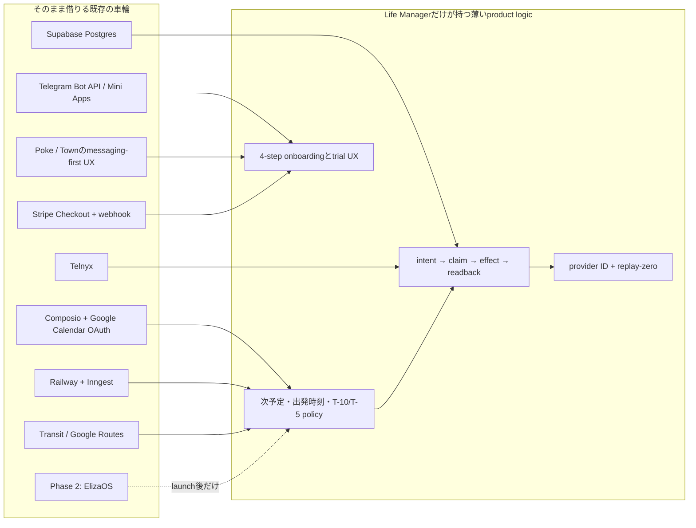

| 層 | 再利用するもの | Life Managerが薄く足すもの | 作らないもの |
|---|---|---|---|
| 会話画面 | Telegramの1対1 chat、Mini App、`initData` | `/start`、通知本文、4-step setup | 独自messenger、mobile app、chat protocol |
| UXパターン | Pokeの「既存text内で先回り」、Townの「同じthreadで依頼と承認」 | 遅刻防止に必要な三つの先回りだけ | 万能assistant UI、常用dashboard |
| identity | Telegram署名actor | actor→tenant UIDの固定binding | password account、Supabase Google login、raw `?tg=` identity |
| Calendar接続 | ComposioのGoogle consent/provider status | ACTIVEだけを受理するstate machine | OAuth broker、Calendar clone |
| runtime | Railway deploy、Inngest schedule | bounded scheduler owner | VM orchestrator、独自queue、独自cron platform |
| durable state | Supabase/Postgres、unique constraint、RLS | effect key、claim、trial deadline | agent独自DB、client deadline、memoryをauthority化 |
| 課金 | Stripe hosted Checkout、signed webhook | value-first 3-day trialとentitlement filter | card form、billing engine、`paid`の別writer |
| route/call | provider response、Telnyx signed webhook | provider factsの整形と最大1回policy | 乗換engine、電話carrier、推測route |
| 自由会話 | Eliza AgentRuntime、Telegram edge、memory、actions、scheduler | Life Manager pluginとprovider adapters | agent loop、plugin kernel、session DB、cloud coordinatorの再実装 |

## 5. cloudとself-hostは同じEliza AgentRuntimeとLife Manager pluginを使う

同じsource artifactを使うが、全ユーザーを一つのunscoped processへ詰め込まない。localは一人につき一つのEliza AgentRuntime、cloudはEliza Cloudのorganization/user/agent scopeでsharedまたはdedicated-lazy runtimeを使う。予定選択、出発時刻、route整形、effect keyを同じLife Manager pluginとして両方へinstallする。

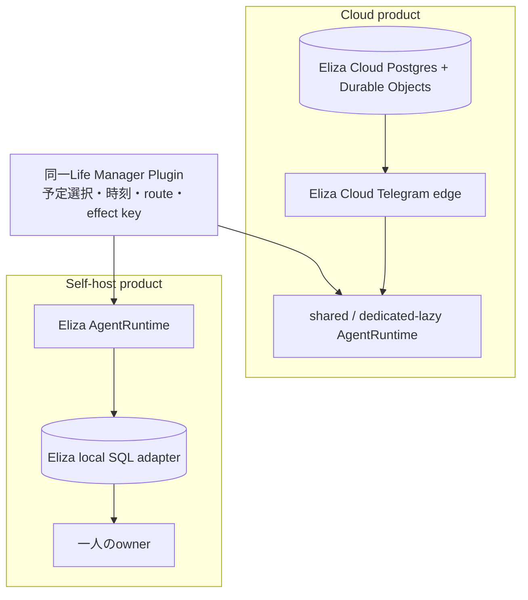

local loopを別architectureのままcloudへ複製しない。ユーザー価値が確認された機能を一つずつEliza action/service/plugin contractへ切り出し、同じpackageをlocal/dedicated cloudへinstallする。現行launch coreはprovider acceptanceを取り終えるまで挙動を変えず、その後の移行で既存receipt/replay testをそのままport gateにする。

## 6. trialは価値を体験した後に1回だけ課金を求める

Calendar consent、home、notificationsが揃った瞬間に、serverが`now + 3 days`を一度だけ保存する。phoneとcall opt-inはtrial開始の条件にしない。trial中はpaid userと同じon-time coreを使う。

期限切れ後はexternal effectを止め、Stripe checkoutを含むupgrade Telegramを最大1回送る。延長はしない。再scan、再onboarding、client時計、localStorageのどれも期限を変えられず、Stripe webhookだけが`paid`を書ける。

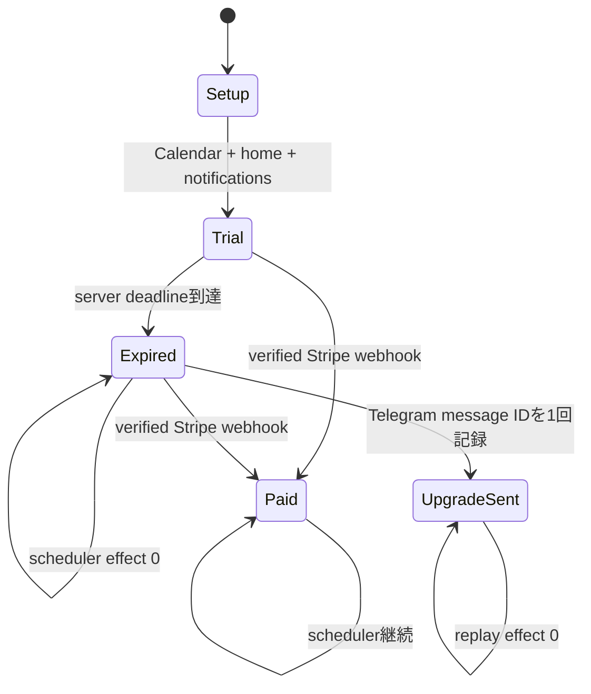

## 7. 証拠がそろうまで「完成」と表示しない

証拠が先である。

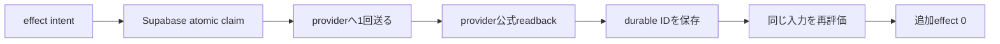

| ユーザー価値 | 完了証拠 |
|---|---|
| 移動block | Google Calendar event IDとstatus |
| T-10/T-5電話 | Telnyx call ID、signed webhook、Supabase wake ledger |
| T-5乗換 | Telegram message ID、route provider、travel ledger |
| tenant onboarding | Telegram initData、別UID、cross-actor read 0 |
| trial | Supabase期限、trial中effect、期限後effect 0 |
| 課金 | Stripe webhook event ID、paid readback |
| deploy | GitHub Deployment、Railway health、exact SHA |

## 8. 実装順はlaunch coreとconversationを混ぜない

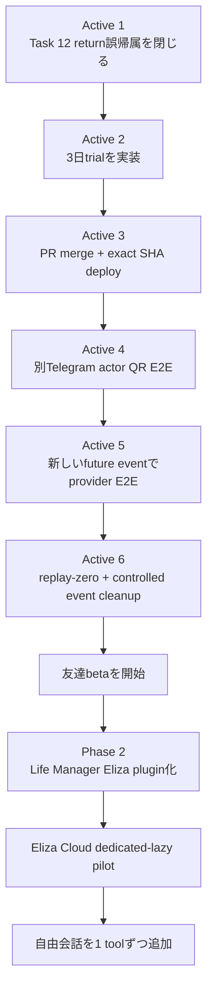

Active TODOの測定済み状態と最新の一手はprogress.mdだけに置く。Phase 2はActive 1–6がprovider evidence付きで完了するまでproduction codeへ入れない。

### 8.1 友達が使えるまでの残TODO — ユーザー体験順

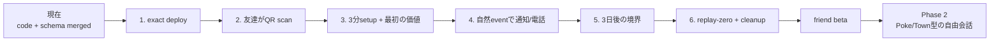

| 順番 | 友達から見える状態 | 残作業とDone証拠 | 現在 |
|---|---|---|---|
| 1 | botが常時cloudで動く | GitHub DeploymentとRailway `/health.build`が同じexact SHA | Railway deployment backlog incidentの解消待ち。code/schema/health fixはmerged |
| 2 | QR→Telegram→`準備する` | 実在するDais以外のTelegram actorがscan。uid/chat/secretをQRに含めず、Google/Supabase loginなし | public payloadは`https://t.me/LifeManagerBotbot?start=lp`まで証明済み。clean-device real actorが未完 |
| 3 | Calendar→home→通知→phone任意→Ready | distinct tenant、Calendar ACTIVE、trial期限、次予定preview、cross-actor read/write 0 | server flow実装済み。real actor provider E2Eが未完 |
| 4 | 移動block、T-10/T-5電話、T-5 Telegram乗換 | 新しいfuture physical eventとno-location eventでGoogle event ID、Telnyx call/signed webhook、Telegram message ID、Supabase ledger | 旧no-location eventsは両call level/AMD ledgerあり。新physical route/message receiptとprovider call IDsが未完 |
| 5 | 期限までは価値、期限後は1回だけupgrade | 同じactorの自然な3日deadlineでcohort除外、paid=false、upgrade message最大1、期限延長0 | schema/logic適用済み。自然時間のproduction readbackが未完 |
| 6 | 同じ予定を再評価しても二重に来ない | 新Travel 0、新call 0、新Telegram 0、claims不変。controlled eventsを`send-updates=none`で削除しcancelled | 未完。receipt取得前は旧eventを削除しない |

UI polishでlaunchを遅らせない。QR landing、Telegram `/start`、4-step Mini App、Ready card、日常の乗換message、期限切れupgradeの六画面だけをbeta対象にする。自由入力chat、voice、photo、email作業、agent memory UIはbeta後である。

## 9. Superpowersを毎回同じ順序で使う

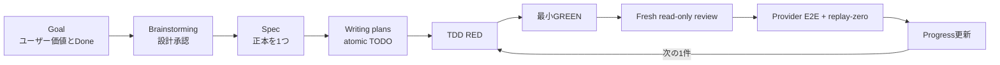

primaryだけがspec、plan、progress、完了判定を更新する。workerは割当code/testだけ、reviewerはexact commitのread-onlyとする。各sliceはPonytail fullで既存再利用を先に通す。

## 10. 採用する設計と棄却する設計

| 論点 | 採用 | 棄却 |
|---|---|---|
| 主UI | Telegram | 常用Web dashboard、新しいmobile app |
| 初回identity | Telegram署名actor | raw query ID、Supabase Google login |
| Calendar | consent 1回、以後background | 毎日のCalendar操作 |
| 電話 | phone任意、別の明示opt-in | phone入力を同意扱い |
| trial | server-owned 3日、1回だけ | localStorage、再登録延長、usage meter新設 |
| 会話runtime | ElizaOSだけ | OpenClaw、Hermes、OpenClawMU、独自agent loop |
| cloud/local共有 | 同じAgentRuntime + 同じLife Manager plugin | 別harness、挙動の異なる再実装 |
| 完了判定 | provider ID + durable ledger + replay-zero | local test、log文、process liveness |

## 11. Current launchの範囲外

- 自由会話、voice note、画像理解、email作業、browser作業。
- Eliza plugin移行とEliza Cloud cutover。これはlaunch acceptance後のPhase 2で行う。
- Gmail connector、native event store、Google Calendar不要化。
- local loopの一括cloud移植。
- 新しいroute provider、agent memory DB、sandbox、quota service。
- annual plan、価格変更、usage-based billing。

## 12. 一次資料

- Poke: https://poke.com/ — messagingを主画面にし、接続serviceとmemoryから先回りする製品例。
- Town Telegram: https://www.town.com/features/telegram と https://www.town.com/integrations/telegram — text、photo、voiceを同じthreadへ入れ、effectをapprovalへ戻す製品例。
- Eliza AgentRuntime: https://github.com/elizaOS/eliza/blob/29bed1bb394a2c0c7c0df6dc12babbe28667efbe/packages/core/src/runtime.ts — actions/providers/services/model/memory/database/message loopのkernel。
- Eliza shared turn coordinator: https://github.com/elizaOS/eliza/blob/29bed1bb394a2c0c7c0df6dc12babbe28667efbe/packages/cloud/shared/src/lib/services/shared-runtime/conversation-coordinator.ts — Durable Objectのturn順序、claim/replay/conflict、cutover seal。
- Eliza Telegram edge: https://github.com/elizaOS/eliza/blob/29bed1bb394a2c0c7c0df6dc12babbe28667efbe/packages/cloud/api/eliza-app/webhook/_telegram-edge.ts — connector identity、idempotent internal turn、provider delivery ledger。
- Eliza Telegram delivery ledger: https://github.com/elizaOS/eliza/blob/29bed1bb394a2c0c7c0df6dc12babbe28667efbe/packages/cloud/api/src/personal-telegram-delivery.ts — strongly ordered provider message ID receiptとuncertain tombstone。
- Eliza scheduled task store: https://github.com/elizaOS/eliza/blob/29bed1bb394a2c0c7c0df6dc12babbe28667efbe/plugins/plugin-scheduling/src/scheduled-task/store.ts — Postgres atomic fire claim、CAS、apply receipts。
- Eliza sandbox lifecycle: https://github.com/elizaOS/eliza/blob/29bed1bb394a2c0c7c0df6dc12babbe28667efbe/packages/cloud/shared/src/lib/services/eliza-sandbox.ts — shared/dedicated tier、quota、idempotent create、container lifecycle。
- Eliza local/remote provider: https://github.com/elizaOS/eliza/blob/29bed1bb394a2c0c7c0df6dc12babbe28667efbe/packages/cloud/shared/src/lib/services/sandbox-provider.ts — local Dockerとremote Dockerの共通interface。
- OpenClaw comparison evidence: https://github.com/openclaw/openclaw/blob/90a9622a6cf5740ab4b9f6f65d9081d47ffbc4e4/extensions/telegram/src/message-dispatch-dedupe.ts と https://github.com/aws-samples/sample-openclaw-multi-tenant-platform/blob/2cb44f7f0a359ef8054cac8be02f07c035e88f4d/helm/applicationset.yaml。
