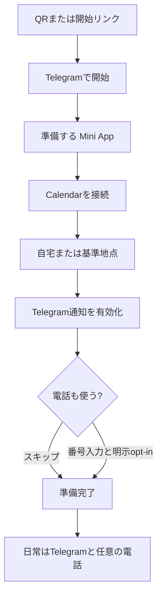
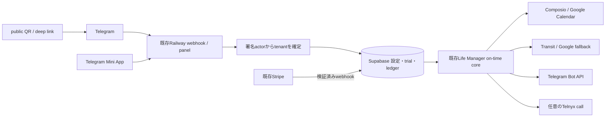

# Life Manager Cloud Telegram-First Product UX Design

状態: APPROVED — 2026-09-06 owner execution-order revision。既存Life Manager Cloudの日常機能を出荷する。新しいagent frameworkへの移行は行わない。

正本範囲: public QR/deep linkからの初回体験、日常のTelegram通知、任意の電話、既存Stripe課金、友達betaと公開までの残作業。

## 0. 最新のowner決定と正本の優先順位

- 今回の担当はCloudの日常機能の出荷だけ。local loopの修理・運用・12 loopのcloud移植はこのチェックリストに含めない。local事情を把握するlocal Codex側の別作業とする。
- ElizaOS / Eliza Cloud / `@elizaos/plugin-life-manager`は採用しない。旧採用比較、plugin化、cutoverを本specから削除した。発売後の必須Phase 2としても復活させない。
- 既存Life Manager runtime、Railway、Supabase、Calendar接続、Transit/Google、Telegram、Telnyxを再利用する。別runtime、別queue、別ledgerへ全面rewriteしない。
- 課金は既存Stripeを維持する。Telegram Stars比較・導入・決済基盤移行は今回の開発TODOに含めない。これは実装スコープの決定であり、外部サービスの規約についての適合性証明ではない。
- 1件ずつ実装・検証する。local作業を取り合わず、他ループの障害や将来の無料化をCloudの日常版出荷条件にしない。
- 2026-09-06追加指示: 友達テストと本人操作は最後の引き渡しにする。その前に進められる実装、自動テスト、Cloud運用確認、既存Stripe検証、公開ページ/README/DM文面の準備を終える。友達待ちを独立作業の停止理由にしない。

正本の役割:

- 本spec §8: 現在の残作業順。古いplanやprogress中の旧移行方針・旧Active Orderに優先する。
- `2026-08-26-life-manager-cloud-on-time-core-design.md`: 既存の技術契約。§8の各実装で変更するACは、同じsliceで明示的に更新する。
- `../plans/2026-08-28-life-manager-cloud-on-time-core-finish.md`: 既存coreの詳細実装・検証手順。完了済みsliceを再実装せず、適用可能な手順だけ再利用する。
- `../../../.superpowers/sdd/2026-08-26-life-manager-cloud-on-time-core/progress.md`: 測定済み状態とreceiptの履歴。過去の証拠は保存し、旧Eliza移行決定は本owner決定で失効する。

この文書の更新自体は、機能実装・本番deploy・fresh-user E2E完了を意味しない。

## 1. Telegramが製品で、public Webは開始導線に限定する

Life Manager Cloudは、ユーザーが予定表や乗換アプリを繰り返し開かなくても、次の予定へ時間どおり動ける状態を作る。日常の主画面はTelegramと任意の電話である。

`/life-manager`と`/lm`は同じ製品へ案内する。QRとタップ可能なTelegram deep linkを用意する。同じスマホでInstagram/LINEを見ている人に、QR scanだけを要求しない。public Webはtenant identity、onboarding state、日常dashboardを所有しない。

初回設定と接続状態の確認はTelegramから開くMini Appで行う。独立したpassword accountやSupabase loginを追加しない。Life Manager専用native appのdownloadも不要とする。Telegramがない人には導入方法を案内する。

Google Calendarは本人が初回に接続・同意する。PC不要・個人APIキー不要であって、Google accountやサービスへの同意まで不要という意味ではない。Calendarそのものを不要にする自由会話での予定作成・変更は今回の出荷条件にしない。



## 2. 初回設定は最小限にする

Telegram署名済みactorからtenant identityを確定する。Telegram profileの名前があれば再入力を要求しない。Google consentの途中で中断した場合も、安全に同じ本人の設定へ戻れるようにする。

| 画面 | 主操作・表示 | 禁止 |
|---|---|---|
| `/start` | `準備する` | uid/chat ID/tokenの手入力 |
| Calendar | `Calendarを接続`、server側の接続確認 | 別password account、接続未確認の成功表示 |
| Home | 自宅または基準地点の登録 | 常時GPSを取得しているとの表現 |
| Notifications | 通知ON/OFF | 電話同意との抱き合わせ |
| Phone | 番号入力またはskip、別途call opt-in | 番号登録だけで電話ON |
| Ready | 次予定、通知予定時刻、trial期限、設定への戻り方 | 未取得の次予定・未送信通知を成功扱い |

3分以内を初回設定の目標とし、実測前に保証しない。電話なしでもtrialとTelegram通知を使える。再scan/reloadは同じtenantへ戻り、trialや接続を重複作成しない。

## 3. 日常の通知を、そのまま行動できる案内にする

Cloud v1の中心は、Calendarの移動block、出発前のTelegram案内、任意の電話。価値のない定期メッセージは送らない。

### 3.1 物理的な移動

各移動ごとに次を順番に表示する。

1. 予定名・予定開始時刻、基準出発地、家や現在地を出る時刻、providerによる到着見込み。
2. 出発地から最初の駅までの徒歩。
3. 乗車時刻、駅、路線、種別、行先、存在する番線、降車時刻・駅。
4. 乗換があれば、その徒歩区間と次の乗車。
5. 最後の駅から目的地までの徒歩、取得できた運賃。

徒歩を最後の合計だけにまとめて省略しない。距離・番線・入口・出口・号車は、同じ採用経路に対応したsource factが取得できた場合だけ表示する。取得できないfieldをLLMで補わない。全駅の入口・出口・推奨号車対応や新provider契約は友達betaの前提にしない。

経路providerの各時刻、access/transfer/egressの徒歩時間と、Calendarの移動block・Telegram・電話の基準時刻を整合させる。予定開始時刻をproviderの到着見込みとして表示しない。providerのdepartureが駅発かdoor発かを確認し、徒歩やbufferを二重加算しない。

通知基準は電車の発車5分前ではなく、移動を始める5分前。1日複数移動も個別eventで処理する。送信予定時刻と実際のprovider受付時刻を記録し、端末到達の秒単位保証はしない。

基準出発地はfreshな本人の共有位置、条件を満たす直前予定の場所、登録基準地点の順。位置共有がなければ現在地を把握していると表示しない。ユーザー間で位置や経路を流用しない。

### 3.2 オンライン・場所なし・経路不明

- online eventは開始5分前に予定通知を送る。鉄道絵文字・出発/到着・乗換検索を使わない。
- 確認できた参加URLを表示できる。イベント案内ページしか分からない時は`イベント詳細`とし、参加用URLだと断定しない。
- 場所なしeventにも偽の移動を作らない。
- physical eventで経路を取得できない時は、予定名・開始時刻・目的地と取得失敗を明示する。確認済みの基準出発時刻がある場合だけ、その根拠とともに表示し、予定開始を出発/到着へ代入しない。
- 失敗を無言で捨てず、同じ障害を連投しない。送信成否不明の時は即再送せずreconciliationを優先する。

### 3.3 変更・取消・電話

予定の変更/取消、送信済み予定、同時刻の別event、オンラインと対面の混在を区別する。古い経路の送信を止め、再評価で無条件に新しいclaimを作って二重通知しない。

電話は`call_enabled === true`と有効な電話番号がある人だけ。physicalは同じ出発時刻のT-10/T-5、online・場所なし・起床・就寝は既存policyに従い予定開始基準。睡眠推定など未実装の機能を出荷済みとして扱わない。

## 4. 既存Life Manager Cloudを使う



時刻計算、scheduler ownership、atomic claim、provider receiptをLLMの自由判断へ移さない。既存認証・Calendar接続・queue・cache・ledger・provider adapterを先に再利用する。別agent frameworkやplugin kernelを追加しない。

## 5. Phone-onlyの境界

一般Cloudユーザーは、自分やDaisのMac mini、localhost、local browser session、gog、Keychain、local launchd、手動tunnelを実行時の依存にしない。Cloudのscheduler・保存先・秘密情報・provider接続だけで動くことを証明する。

self-host/localは別surfaceとして維持し、この出荷作業で変更しない。将来のloop移植はlocal Codex側と別計画で1件ずつ進める。業務ロジックやskillsを共有できても、owner個人の認証・wallet・browser profileを他ユーザーへコピーしない。

## 6. 既存Stripeと3日trialを維持する

Calendar consent、home、notificationsが揃った時にserverが3日trialを1回だけ付与する。phoneとcall opt-inはtrial開始条件にしない。再scan、client時計、localStorageで期限を延長しない。

既存Stripe Checkout・署名検証webhook・entitlement・解約処理を再利用し、支払い成功/失敗/重複/更新/解約でserver側の利用権が正しくなることを確認する。client入力で`paid`を設定しない。trial期限後は仕様どおりの利用権へ切り替え、upgrade通知はdurable claimで最大1回とする。

課金テストはtest modeを優先する。実カードへの請求、通話残高の補充、有料契約は金額・通貨・支払元についての許可なく行わない。決済基盤の追加・比較は本チェックリストの対象外。

## 7. 完了には実際の効果と証拠が必要

| 価値 | 完了証拠 |
|---|---|
| 移動block | Google Calendar event IDとstatus |
| T-10/T-5電話 | Telnyx call ID、署名検証済みwebhook、同じwake ledger |
| T-5通知 | 採用routeと予定時刻、Telegram message ID、travel ledger |
| 初回設定 | 本人以外の実Telegram client、別tenant、他tenantへのread/write 0 |
| trial/Stripe | server期限、正式なStripe event、利用権のreadback |
| deploy | 対象serviceのexact SHAとhealth。deploy成功を通知成功の代わりにしない |
| restart/replay | 設定・claim・receiptが残り、余分なCalendar/Telegram/call effect 0 |

raw initData、OAuth token、電話、住所、座標、provider payloadを公開repoや通常logへ残さない。合成actorのテストは本物の新規ユーザーの操作テストの代用にしない。

## 8. 出荷までの残TODO — この順で1件ずつ

2026-09-06 owner改定。IDは既存のCLOUD-01〜08を維持するが、実行順は次のとおり。
友達テストが終わるまでStripeや公開準備を待つ旧順序は失効する。未確認と未実装は区別し、既存機能を作り直さない。

```text
実装・開発側検証: CLOUD-01 → 02 → 03 → 04 → 05 → 07 → 08（公開準備）
        ↓
必要な権限がある運用担当のCloud実測を完了 → ENGINEERING_READY_FOR_UAT
        ↓
本人へまとめて引き渡し: CLOUD-06（自分/友達の実機・本人同意・3日beta）
        ↓
不具合があれば修正・再検証 → CLOUD-08（最終公開判定）
```

各項目はcode / automated-test / review / merge / deploy / provider-proof / user-acceptanceを別々に記録する。
友達に依存する実機確認はCLOUD-06へ集める。ここに記した順番は出荷証拠の免除ではない。

| 実行順 / ID | 先に開発側で完了すること | 最後の本人確認との境界 |
|---|---|---|
| 1 / CLOUD-01 | 徒歩→乗車→乗換→最後の徒歩、online/場所なし/経路失敗表示。回帰テスト、検査判定、レビュー、merge、対象Cloudへ反映し承認済みテスト先で実通知receipt/replayを確認。 | 新formatterの送信証拠を用意する。友達への無断テスト送信はしない。 |
| 2 / CLOUD-02 | 同じ採用経路でdoor出発・到着・Calendar・Telegram・任意の電話を整合。出発T-5、1日3移動、出発順の逆転、変更/取消、同時刻event、重複防止を検証。 | 端末の使いやすさ/実受信の最終確認はCLOUD-06。予定時刻とprovider受付時刻は開発側で測る。 |
| 3 / CLOUD-03 | `/lm`と`/life-manager`の開始リンク/QR、Telegram署名actor、Google接続と戻り、基準地点、通知、電話skip、中断再開を実装・自動検証。 | 実際のiPhone/Android・Instagram/LINE内からの操作、本人のGoogle同意はCLOUD-06。合成actorでは代替しない。 |
| 4 / CLOUD-04 | Cloud-onlyテスト環境でMac/localhost/個人credential依存なし、ユーザー分離、再起動後の設定/claim/receipt保持を検証。 | 本人のGoogleアカウントを開発者が代理同意しない。他tenantの設定/予定/送信先/課金にアクセス不可。 |
| 5 / CLOUD-05 | 通知ON/OFF、住所変更、明示位置共有、再接続、電話opt-in/skip、問い合わせ/解除/削除案内、認証切れと障害時の連投防止を実装・検証。 | 友達に操作を教えないと止められないUIにしない。使いやすさを最後に確認する。 |
| 6 / CLOUD-07 | 既存Stripeと3日trialをtest mode中心で検証。trial一度だけ、期限境界、支払い成功/失敗/重複/更新/解約とserver利用権を照合。 | 友達を課金テストの支払者にしない。実請求や有料契約は金額・通貨・支払元の別途許可が必要。 |
| 7 / CLOUD-08（公開準備） | 公開ページ、英日README、実際の対象URLから作るQRと同じスマホ用tap link、通知例、料金、privacy/support、DM/X投稿の下書き、テスト手順を用意。 | QRのdecode結果と開始リンクを照合。未検証なのに「誰でも完成版を利用可能」と書かず、自動投稿/友達招待はしない。 |
| 引き渡し / CLOUD-06 | 上記の技術作業と必要な運用実測を閉じ、以下の引き渡しpacketを用意。 | Dais/友達が自分のTelegram/Googleで初回設定し、iPhone/Androidで実通知・複数移動・3日betaを確認。開発者のDB手修正なし。 |
| 公開 / CLOUD-08（最終判定） | UAT不具合を修正・再検証し、実物と料金/説明を再照合して公開可否を記録。 | 友達betaと有料一般公開を区別。UATを省略してGAにしない。 |

### 8.1 待たずに進める作業と、止める境界

- ChatGPT側でアクセスできるrepoの実装、純粋/結合テスト、レビュー対応、説明資料を先に進める。
- 本番credentialや管理画面の権限が足りない項目は`BLOCKED-OPERATOR`として操作・対象service・必要権限・期待証拠を記録し、権限を持つlocal Codex等へ限定して渡す。代替ツールの有無は実際に確認する。
- operator待ちの項目を完了にせず、それと独立した実装/Stripe test-mode準備/README等は進める。後続sliceが未mergeコードに依存する場合は依存関係を明示し、まとめて未検証deployしない。
- 重大な秘密情報、tenant分離、認証、重複送信の不具合や必須検査の失敗は本番反映/招待前に解消または正規reviewで判定する。検査を無効化しない。
- 必須Cloud実測が残っている間は`ENGINEERING_READY_FOR_UAT`と宣言しない。友達をまだ動かない接続/デプロイのデバッグ要員にしない。

### 8.2 本人へ渡すもの

1. 確認済みの開始URLと、同じURLへdecodeできるQR画像。生成イラスト内のQRを実用QRとして使わない。
2. 操作手順: Telegram開始 → 自分のGoogle同意 → 基準地点 → 通知 → 電話skip/明示opt-in → Ready。
3. 試すシナリオ: 対面移動、online、1日複数予定、予定変更/取消、停止/再開、中断からの再開。
4. 本人側に期待する画面/通知と、問題の報告方法。秘密情報や全Calendarの公開は要求しない。
5. 3日trialの条件、料金表示、実請求の有無、テスト停止・接続解除・supportの方法。
6. 開発側の対象commit/deployed SHA、合格した自動テスト/承認済みprovider readback、既知の制限。
7. DM/X投稿の下書きは下書きと表示し、配布/公開判断は本人へ引き渡す。

入口/出口/推奨号車の追加取得、主要loopの移植、自由会話、agent economyによる費用補填は別計画。
既存StripeとEliza不採用の決定を変えず、今回の完了条件を増やさない。

## 9. 作業の分担と記録

| 担当 | 作業 | 完了証拠 |
|---|---|---|
| このチャット/Cloud開発担当 | 実装・テスト・PR・レビュー・spec・README・公開/引き渡し資料 | exact commit、検査結果、変更範囲。ツールがないsubagent実行を装わない |
| 必要権限を持つ運用担当（local Codex等） | 対象Railway service、DB、Google接続設定、Stripe test mode等の限定されたCloud操作・実測 | deployed SHA/build設定、health、秘匿したprovider receipt、replay結果。秘密値をチャット/Gitへコピーしない |
| Dais/友達 | 最後の実機操作、本人同意、3日利用の確認、配布判断 | 実際の設定完了・受信・操作性の確認。合成actorを実機完了と混同しない |

local Codexを開発/運用に使うことと、Cloud製品がMac常時稼働に依存することは別である。
local loopの修理や後続移植は別streamのままにし、このCloud作業でlaunchdや他の稼働loopを変更しない。
primaryがspec/plan/progressの判定をまとめ、source修正・merge・deploy・provider成功・UAT・GAを混同しない。

READMEは読者向け入口であり、live ledgerそのものではない。主要workstream、registry job ID、Cloud対応、
self-host要件、計測日時、receipt根拠を分離し、古いauditの売上/稼働値を現在値として転記しない。
英日READMEへ同じ出荷状態と導線を反映する。loop数は一覧と根拠から決め、数字に合わせて機能を作らない。

Docker整理: `scripts/local-up.sh` → `deploy/local/compose.yaml` → `apps/life-manager/Dockerfile.runtime`
は参照されているself-host経路であり削除対象ではない。Cloudの各builderはservice設定/build logで確認する。
未使用候補はreference 0、active deploy/CI/install参照0、rollback不要、データ保全を確認して別途整理する。
このdocs更新でDockerの停止・image/volume削除・本番builder変更を行わない。

## 10. 今回変更しないもの

- local launchd/12 loopの修理、稼働設定、移植、投資・cryptoの実行。
- self-host版の削除や全面rewrite。
- 別agent framework、plugin migration、決済基盤移行。
- 新しい経路provider契約、全駅の出口/号車対応。
- annual plan、価格変更、usage-based billing、無料化の約束。
- 提出済みhackathonの提出物や審査導線。

## 11. 根拠と実装参照

- Owner decisions: 2026-09-05のscopeを維持。2026-09-06に「開発側でできることを先に終え、友達/本人テストを最後へまとめる」「Dockerの実使用を確認し、READMEも更新する」と明示。
- 技術契約: `2026-08-26-life-manager-cloud-on-time-core-design.md`。
- 実測履歴: `../../../.superpowers/sdd/2026-08-26-life-manager-cloud-on-time-core/progress.md`。
- Source: `apps/life-manager/lib/travel-reminder.js`、`transit.js`、`travel.js`、`calendar-interpreter.js`、`panel-api.js`、`panel-ui.js`、`telegram-onboard.js`、`payment-link.js`、`user-selector.js`、`apps/life-manager/scheduler.js`。
- 公開入口の確認元: `Daisuke134/anicca-products`の`apps/landing/app/life-manager/LifeManagerBody.tsx`と`apps/landing/app/lm/LmBody.tsx`。変更前に実際の公開source/deployを再確認する。
- 改定前の設計比較はGit履歴に残るが、採用決定・実行計画としては無効。
