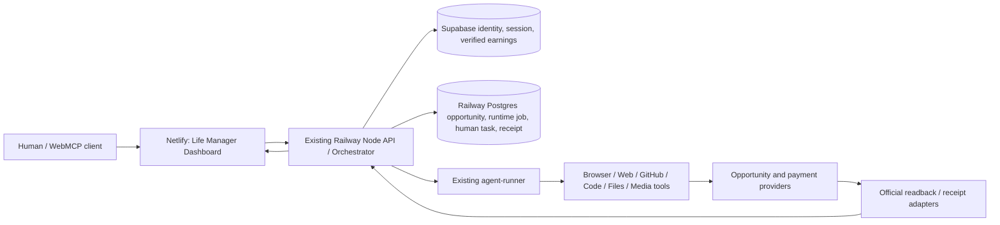

# WebMCP Challenge Winning Contract

**Status:** Draft for Dais review — official contract snapshot verified / product concept recommended / implementation not started  
**Canonical repository:** `https://github.com/Daisuke134/life-manager`  
**Submission deadline:** September 3, 2026 1:00 PM PT / **September 4, 2026 05:00 JST**  
**Product name:** `Life Manager`
**Primary objective:** WebMCP Challenge top 10に入り、賞金・ChatGPT Pro・Codex Micro等を獲得する  
**Long-term objective:** Life Managerが継続的に収益機会を発見し、応募・実行・納品・着金確認まで閉じるentrepreneur agentになる

**中心主張:** Life Managerは、Web上のbounty、gig、hackathon等の有償機会を発見し、実作業、応募・納品、公式receipt確認まで進めるopen-source Money Printerである。Agentが99%を実行し、本人性、権限、口座、現実世界の作業など人間にしかできない1%だけを`Needs You`へ出す。人間が一件を返すと同じworkroomから自動再開する。WebMCPは、人とagentが同じopportunity、work、human task、money proofを共同操作するinterfaceである。

---

## 0. このspecの役割

この文書は、製品案が変わっても残る正本を先に固定する。

1. **不変層:** WebMCPとは何か、公式ルール、提出物、審査構造、失格条件
2. **戦略層:** 審査4軸を満たすための勝利条件、judge experience、競合基準
3. **可変層:** Life ManagerのWork boardとcanonical demo
4. **長期層:** hackathon後もLife Managerが機会を探し、収益へ変えるloop

Visual identityと最初のopportunity sourceは変更できる。製品名は`Life Manager`で固定する。公式要件、WebMCPの技術境界、審査証拠、外部作用の安全境界は変更しない。公式ページと本specが衝突した場合は、最新の公式ルールを再取得し、本specを置換する。

## 1. Goal / Done

### 1.1 Hackathon Done

Hackathon Submittedは、Section 3のofficial pass/failとSection 14のofficial gatesを閉じ、Devpost側の提出状態を期限内にread backし、submitted artifactsのfreezeを開始した時に成立する。Winning ReadyはSection 7のinternal readiness rubricで別に判定する。

本specでは、次の語を一貫して使う。

- **shared artifact:** 人とagentが同じ画面で閲覧・編集する成果物と、そのversioned state
- **authority boundary:** agentが実行できる操作と、人の確認・承認が必要な操作の境界
- **durable receipt:** 再読み込み後も残り、外部作用の結果を照合できる記録
- **replay-zero:** 同一idempotency keyで再実行しても新規effectが0であること

### 1.2 Winning Done

受賞は外部審査であり保証できない。内部のwinning-ready判定は、Section 7の4軸すべてで証拠付き10/10 targetを満たし、fresh reviewerが各claimを反証できない状態とする。

### 1.3 Long-term Done

Life Managerのentrepreneur loopは、単なる発見数や応募数では完了しない。状態の正本はSection 11.1に置く。`PAID_SETTLED`にはprovider、bank、Stripe、on-chain等の公式receiptが必要である。応募、view、offer、rate、pending balance、agentの`completed`は収益ではない。

---

## 2. VERIFIED FACT — WebMCPの技術境界

### 2.1 定義

WebMCPは、Webページがagentへstructured toolsを公開する提案中のopen Web standardである。サイトはtop-level pageでtoolを登録し、agentは現在のpage/sessionからtoolを発見して呼び出す。

```js
await document.modelContext.registerTool({
  name: "inspect_opportunity",
  description: "Read the selected opportunity, its requirements, deadline, and current evidence coverage.",
  inputSchema: {
    type: "object",
    properties: {
      opportunityId: { type: "string", description: "Stable opportunity identifier." }
    },
    required: ["opportunityId"],
    additionalProperties: false
  },
  annotations: { readOnlyHint: true },
  execute: async ({ opportunityId }) => inspectOpportunity(opportunityId)
}, { signal: controller.signal });
```

標準flow:

```text
人とagentが同じlive page / signed-in sessionを開く
  → pageがdocument.modelContext.registerTool()でtoolsを登録
  → agentがname / description / JSON Schemaからtoolを選ぶ
  → browserがtool invocationをsafety review
  → executeが既存application logicを呼ぶ
  → UIとshared stateが更新される
  → structured resultをagentへ返す
  → agentがenvironment feedbackから次のtoolを決める
```

### 2.2 WebMCPと通常MCP

| 境界 | WebMCP | MCP server / backend loop |
|---|---|---|
| 発見 | agentがpageを訪れた時 | clientがserverへ接続した時 |
| session | 現在のlive page / browser session | open pageから独立できる |
| 主用途 | shared visual artifact、browser-local action | background search、cron、API、長時間処理 |
| page close | toolが利用不能になり得る | 継続可能 |
| Life Managerでの役割 | visible collaboration/control plane | 24/7 opportunity discovery/execution plane |

WebMCPを24/7 schedulerだと説明しない。Life Managerは両方を使う。

### 2.3 現在のChatGPT Site tools制約

- ChatGPT built-in browserはtop-level JavaScriptのimperative registrationを使う
- declarative HTML form APIは現時点でSite toolsとして未対応
- iframe内のtoolsは現時点で発見されない
- toolは現在のpageに属し、navigate/closeで消え得る
- consequential actionには通常のconfirmation/safety policyが適用される
- tool definitionとresultはuntrusted contentとして扱われる
- normal UI、認証、認可、server-side validationを維持する

### 2.4 WebMCP tool設計原則

- 1 tool = 1つの意味あるfunction
- overlapping toolsを作らない
- page stateで必要な時だけregisterし、不要時はregistration signalをabortする
- read-only toolには`readOnlyHint`
- 外部/UGCを返すtoolには`untrustedContentHint`
- parameterは具体的typeと短いdescriptionを持つ
- strict validationはschemaだけに依存せずserver側で行う
- tool完了後にUIを更新し、agentと人が同じ結果を見る
- navigation-only toolを増やさない
- toolはhuman UIと同じdomain functionを呼ぶ

Primary sources:

- OpenAI: `https://learn.chatgpt.com/docs/webmcp`
- Chrome: `https://developer.chrome.com/docs/ai/webmcp`
- Best practices: `https://developer.chrome.com/docs/ai/webmcp/best-practices`
- Security: `https://developer.chrome.com/docs/ai/webmcp/secure-tools`
- Specification: `https://webmachinelearning.github.io/webmcp/`

---

## 3. VERIFIED FACT — 公式Challenge契約

### 3.1 What to build

人とagentがWeb上で対話・協働・創作できる未来を示す、WebMCP対応のWebアプリを作る。新規appを推奨する。既存appでも、submission period開始後にWebMCPによる実質的な拡張を加え、その差分をcommit history等で証明すれば応募できる。

### 3.2 Stage One pass/fail

最低限、themeに合理的に適合し、required WebMCP API/SDKを実際に使い、video/textどおりに動く必要がある。third-party SDK/API/dataは利用権を持つものだけを使う。

### 3.3 必須提出物

1. **Working live URL**
   - ChatGPT built-in browserまたはChrome WebMCP環境からaccess可能
   - 認証が必要ならjudge credentialsをsubmission formに記載
   - judging期間終了まで無料・無制限でtesting可能
2. **English text description**
   - Why the use case is a strong fit for WebMCP
   - How it creates a better user experience
   - What people and agents can do together that was difficult or impossible before
   - How WebMCP was implemented
3. **Public code repository**
   - GitHub / GitLab / Bitbucket
   - necessary source、assets、instructions
   - repository topで検出可能なOSS license
   - actual `document.modelContext.registerTool(...)` implementation
4. **Public YouTube video under 3 minutes**
   - working productのclear demo
   - audioでwhat was builtとhow WebMCP was usedを説明
   - 無許可の商標、音楽、copyrighted materialを含めない
5. **Language**
   - English、または全materialにEnglish translation

### 3.3A Devpost pluginで取得した実提出フォーム

提出時のrequired fieldsは次で固定する。`App Status`は`Existing`を選び、submission period中に追加したWebMCP Work board、tools、human handoff、receipt flowを説明する。

| Field ID | Field | Planned answer |
|---:|---|---|
| 28249 | Submitter Type | Individual |
| 28250 | Country of residence | Japan |
| 28252 | App Status | Existing |
| 28254 | Live URL | final Netlify `/money-printer` URL |
| 28256 | Public Code Repo | `https://github.com/Daisuke134/life-manager` |
| 28257 | Tested WebMCP agents/clients | ChatGPT in-app browser and Chrome WebMCP testing; final実測だけ記載 |
| 28258 | AI tools used | Codex、ChatGPT等、実際に使ったtoolsだけ記載 |
| 28259 | Level of learning | Significant |
| 28260 | Career AI value | Yes |

Optional fieldsは、organization name、existing appで更新した内容、judge-only testing instructionsである。提出物はworking live URL、4問に答えるEnglish description、public OSS repository、audio付き3分未満のpublic YouTube demoである。zipは不要。

Devpost登録自体は未完了である。登録前に参加形態、職業、Codex利用頻度、WebMCP経験、ChatGPT in-app browser経験、eligibility、rules、termsへの明示同意が必要である。

Judgesはlive appを操作しなくても、text、images、videoだけで採点できる。したがって動画だけで、解く問題、WebMCPが必要な理由、実際の動作、得られる結果まで伝わる必要がある。Live appは追加の検証経路として提供する。

### 3.4 Deadlineとfreeze

- submission close: September 3, 2026 1:00 PM PT / September 4, 2026 05:00 JST
- deadline後はDevpost submissionを変更しない
- FAQに従い、submitted repoとlive siteもjudging終了まで固定する
- 継続開発は別branch/fork/deploymentで行う

### 3.5 Prize

Top 10 each:

- OpenAI cash USD 3,000
- Netlify cash prize USD 500
- total cash USD 3,500
- ChatGPT Pro one year for covered team members
- Codex Micro
- OpenAI swag
- sponsor credits/benefits from Cloudflare、Vercel、Render、Shopify、Google Chrome等

Tax、fees、受取条件はofficial rulesに従う。

Primary sources:

- `https://openai.com/webmcp-challenge/`
- `https://webmcp.devpost.com/`
- `https://webmcp.devpost.com/rules`
- `https://webmcp.devpost.com/resources`

### 3.6 Known submission fields and link gates

| Field | Final value / creation gate | Current status | Final gate |
|---|---|---|---|
| Project name | `Life Manager` | fixed | Devpost readback matches |
| Tagline | `An open-source, 24/7 AI money printer that finds paid opportunities, does the work, and asks you only for the human 1%.` | fixed draft | authenticated form review |
| Live URL | `https://aniccaai.com/money-printer` | not deployed | Work board deploy SHA + isolated guest E2E + `registerTool()` discovery |
| Public repository | `https://github.com/Daisuke134/life-manager` | public | challenge source/instructions + clean clone verified |
| OSS license | `https://github.com/Daisuke134/life-manager/blob/main/LICENSE` | GitHub detects MIT | license visible in submitted repo |
| Demo video title | `Life Manager — The Agent That Finishes Work With You` | reserved copy | final E2E edit complete |
| Public YouTube URL | created by the final verified upload | not created | public URL + duration/audio readback |
| Devpost entry URL | created when the authenticated draft is first saved | not created | every required field read back |
| Testing instructions | isolated guest `https://aniccaai.com/money-printer` + one WebMCP prompt + Chrome 149 steps | planned | clean-browser judge replay |

Devpost pluginから実提出fieldsを取得済みである。正本はSection 3.3Aとし、authenticated draft作成後は送信前に同じfieldsをread backする。

---

## 4. Showcaseから固定する製品原則

公式showcaseは現在10作品ある。

| App | Shared artifact / experience | 公開tool規模 | 採用する学び |
|---|---|---:|---|
| Margin Editor | document + comments | 10、3R/7W | agent identityとdiscussion historyを残す |
| Fieldwork // 12 | beat sequencer | 3 capabilities | 少数toolでも即時に聴けるmagic moment |
| WanderNote | itinerary + map + feedback | 11 | context→plan→feedback→revision→export |
| Sunday Table | meals + recipes + groceries | 非掲載 | human editをagentが壊さない |
| Paperie | card + image + envelope | 13 | external contextをshared canvasへ持ち込む |
| Webroom | photo editing | 28、4R/24W | page自体をagentのvisible viewportにする |
| Verdant Market | catalog + shared cart | 9 | hidden stateを削りtool activityを見せる |
| Crossword Desk | word pool + grid + clues | 5、1R/4W | reasoningを構造変化として見せる |
| Modeling Studio | 3D scene | 3 capabilities | agent自身にtoolsを使わせschema/latencyを改善 |
| Cubecade | Rubik's Cube | 2 | full-state read + move executionだけでmagic moment |

共通contract:

```text
READ LIVE STATE
  → MEANINGFUL MUTATION
  → SHARED ARTIFACT CHANGES VISIBLY
  → HUMAN CAN DIRECTLY INSPECT OR EDIT
  → AGENT OBSERVES FEEDBACK AND CONTINUES
```

Tool数をscoreだとみなさない。visible state change、human correction、失敗回復、artifact qualityをscoreとみなす。

Sponsor demoから追加採用する原則:

- **The Archive:** 人間に見えるvisual evidenceとagentだけがtoolで取得するstructured evidenceを組み合わせる
- **Mabel's Table:** sold out、alternative、hold、confirm、cancelというreal state machineと意図的failureを持つ
- **Tagboard:** validation、rate limit、moderation、untrusted content、visible activity logを持つ
- **Kurio:** agent actionとhuman cartが同じstateへ収束する

---

## 5. INFERENCE — Sponsor / adminのhidden desire

以下は、公式文言、審査軸、sponsor構成から導いた推論であり、公式claimではない。WebMCPの将来価値をworking productで正直に証明するために使う。審査員を欺く表現や未実装機能の誇張には使わない。

1. **WebMCPをscaleする理由が欲しい**
   - 公式は「future of the open web」「app becomes meaningfully better」と述べる
   - 既存browser automationより速いだけでなく、新しいcategoryのUXを示す必要がある
2. **Web所有者とagentの両方に価値が欲しい**
   - agentだけが得をするscraperではなく、site ownerが安全なcapability、traffic、conversion、receiptを保持する
3. **Open standard adoptionの証拠が欲しい**
   - browser、hosting、commerce各sponsorが参加している
   - 特定model/APIだけのdemoより、normal web UIとportable structured toolsが重要
4. **Human-agent collaborationのcredible patternが欲しい**
   - mechanical workはagent、taste/identity/authorityはhuman、同じartifactでhandoffする
5. **Toyではなくcomplete productが欲しい**
   - Executionが独立の均等配点であり、proof of conceptでは不十分と明記される

Pitchの中心を、検証可能な共同作業に置く。

> WebMCP turns websites from interfaces agents must imitate into shared workspaces where people and agents can inspect the same state, divide work by capability, and complete verifiable outcomes together.

---

## 6. Competitive bar

Devpost galleryは調査時点で未公開。GitHub exact phrase searchでは公開候補repoが少なくとも59件あった。valid submissions数と競合数は未確定だが、公開build activityはすでに大きい。

| Competitor | Strongest evidence | Life Managerが超える点 |
|---|---|---|
| SpendMCP | x402、policy、dynamic 9→10 tools、idempotency、delivery receipt、143 tests | 購入だけでなく、機会発見→workroom→成果→入金まで閉じる |
| ONE | 4 independent sites、stale intent、slot loss recovery、exact-resource approval | 一目標の購入から、任意の短期・長期workを継続実行するgeneral runtimeへ広げる |
| Deal Floor | visitors' agentsがlive bid/counter/accept、人がmandate/veto | 交渉だけでなく、実work、human handoff、proof、paymentを一つのruntimeで扱う |
| Verdant | polished 3D garden、13 tools、preview、background jobs | creative toyではなく、specific economic outcomeとverified moneyへ集中する |

単なるgarden、trip planner、shopping cart、task board、approval dashboard、chatbotは棄却する。これらのUI patternは利用してよいが、product conceptにしない。

---

## 7. Internal 10/10 readiness rubric — official scoringではない

公式の4軸は各5点尺度である。本節の10/10は、提出前に不足を見つけるための内部rubricである。WebMCP Leverage → Execution → Potential Impact → Creativity & Ambitionの順で優先する。

### 7.1 WebMCP Leverage — target 10/10

必要証拠:

- read、constraint update、human task、continuation、pause、receiptまで複数段階でWebMCPを使う
- toolsは現在のworkspace stateに応じてregister/unregisterされる
- human UIとtoolsが同じdomain functionsを使う
- tool callごとにactivity、input summary、result、actor、timestampが画面へ出る
- agentがworkroom stateとartifactsを変更し、人が直接inspect/steerできる
- human回答でblocked workroomが同じthreadからcontinuationする
- transient failureでretry/backoffし、agentがerror contextから自己修正する
- application、delivery、payment receiptをagentと人が同じ画面で確認する
- replayがoriginal receiptを返し、duplicate effect 0
- video内で「通常browser clickingとの違い」をbefore/afterで示す

失点条件:

- `registerTool()`が単なるAPI wrapper
- agentの変更がUIに見えない
- 一回のfilter/searchだけ
- hidden backend orchestrationが主役
- tool数だけを深さとして主張

### 7.2 Execution — target 10/10

必要証拠:

- zero-login live demo
- one copyable judge prompt
- initial magic moment 20秒以内
- happy path 90秒以内
- intentional failure + recovery 45秒以内
- reset可能なguest account
- responsive、accessible、normal browserでもhuman UIが動く
- server-side validation、rate limit、safe error messages
- guest accountで同じpublic opportunityとhuman-task flowを再現
- Chrome/ChatGPT real E2E receipt
- public repo、license、setup、judge guide、tests
- video、description、screenshotsがlive behaviorと一致

### 7.3 Potential Impact — target 10/10

Audience:

- independent builders
- freelancers
- researchers
- small teams
- autonomous/assisted earning agents
- people who miss paid opportunities because discovery、requirements、evidence、submissionが分断されている

Problem:

- opportunitiesがX、GitHub、Devpost、marketplaces、mail等に散在
- deadline、eligibility、deliverables、judging criteriaが自然言語で異なる
- agentが成果物を作っても、何がrequirementを満たすか人が監査しにくい
- human-only ceremonyとagent-executable workが混ざる
- submitとpaymentのofficial readbackが別systemにある
- application countをrevenueと誤認しやすい

Impact proof:

- one real public opportunityを発見・qualify・claim
- 24/7 scoutがpageを閉じても複数のnatural cycleを継続し、新規opportunityをdedupe付きで追加
- 複数opportunity/workroomが`Working`、`Needs You`、`Waiting`等の異なるstateで同時に存在
- workroom progress/proof before/after
- human task数とmechanical stepsの削減
- complete real work/application + provider readback
- verified receipt/replay-zero
- long-termにはwon/contracted/delivered/paid conversionを追跡
- 同じreal opportunityでmanual baselineとWebMCP flowを比較し、操作step、requirement coverage、human task数、failure数を測る

### 7.4 Creativity & Ambition — target 10/10

必要証拠:

- 一件の短いreal bounty/gigを、発見からwork、human handoff、delivery、official readbackまで同じworkroomで閉じる
- recurring scoutがその一件の前後にも止まらず、次のopportunityを発見・qualifyする
- general workroomが複数turnを継続し、proof付きでterminalへ進む
- genuine human authority/identity/actionとagent-only executionを同じworkroomで統合する
- state進行により新しいtoolsがunlockされる
- one opportunityを応募で終えず、long-term economic outcomeへ接続するarchitecture
- one real external opportunityの実物が、future architectureの説明なしでも独創性を示す

Ambitionはfeature数ではない。「open Web上の仕事を、人とagentが検証可能な成果へ変える新しいwork surface」を完成品として見せる。

### 7.5 Evidence matrix

各claimは、live proof、再現手順、video timestampを持つ。`status=verified`以外は提出copyへ昇格させない。

| Criterion | Claim | Required artifact | Verification / E2E | Video timestamp | Status |
|---|---|---|---|---|---|
| Leverage | stateに応じてtoolsが変わる | registered-tools before/after snapshot | ChatGPT + Chrome readback | final-cut gate | planned |
| Leverage | 対応agentがlive artifactを共同編集する | visible revision diff + actor trace | inspect → revise → human review | final-cut gate | planned |
| Leverage | human task回答後に同じagent runが続く | task + thread/workroom trace | blocked → answer → continuation | final-cut gate | planned |
| Leverage | replayで新規effect 0 | original receipt + duplicate count | same idempotency key twice | final-cut gate | planned |
| Execution | zero-loginで90秒以内に完走 | public judge URL + reset | clean browser E2E | final-cut gate | planned |
| Execution | failureが説明可能で回復する | error + retry/recovery trace | controlled transient failure | final-cut gate | planned |
| Execution | runtime restart後も同じworkroomを再開する | durable workroom + artifact revision | terminate → restart → continue、duplicate 0 | final-cut gate | planned |
| Impact | manualよりsupervisionを減らす | before/after measurement | same opportunity comparison | final-cut gate | planned |
| Impact | human-only workが正確なtaskになる | task cards + dedupe readback | repeated model wording → one stable task | final-cut gate | planned |
| Creativity | earning agentが実作業を進め、人間の1%だけを待って自動再開する | end-to-end paid-opportunity workroom | discovery → work → Needs You → delivery → receipt | final-cut gate | planned |

### 7.6 Product replacement gate

Visual surfaceは変更可能である。Life Managerの中核architectureを置き換えるのは、一次証拠で次をすべて満たす場合だけにする。

- 4軸internal rubricが現Life Manager案以上
- 20秒以内のmagic momentが明確
- 90秒以内のjudge pathを実装可能
- humanとagentが同じshared artifactを変更する
- 意図的failureとagent recoveryを見せられる
- 残り期間でlive URL、repo、video、submissionまで閉じられる

---

## 8. Recommended product — Life Manager

### 8.1 One sentence

**Life Manager is an open-source, 24/7 AI money printer that continuously finds paid opportunities, does the work, submits or delivers it, and asks you only for the human 1% it cannot or should not perform.**

### 8.2 Product boundary

今回提出するLife Managerは、bounty、gig、hackathon、paid task等の収益機会を一つのgeneral earning runtimeで進めるMoney Printerである。X、Web、GitHub、Devpost、marketplaces、mail等から公開・許可済みのopportunityを発見し、実作業、応募・納品、結果確認、着金確認まで追う。応募数、offer、agentの`done`を収益とは呼ばず、official receiptがある結果だけを表示する。

既存Mercor、Lancers、gig、TaskMarket等のcodeは、general runtimeが再利用できるtools、browser state、evidence、historyとして段階的に吸収する。Core orchestratorはprovider名でexecutorを固定せず、Modelが現在のopportunityとenvironment feedbackを読み、利用可能なtoolsから次の行動を選ぶ。Coconalaはsubmission source、UI、demo、product storyに含めない。そこで実証済みのprovider-neutral isolation、effect fence、resume、receipt patternsだけを内部実装として再利用する。

### 8.3 Canonical judge demo — one traced opportunity inside a 24/7 product

製品runtimeはX、Web、GitHub、mail、search、任意marketplace URLから継続的にopportunityを見つけるEntrepreneur Agentである。Modelがmarket、reward、requirements、deadline、capability、cost、riskを読み、どこで何をすれば収益になるかを判断し、scout、qualify、claim、work、human handoff、delivery、reconciliationを繰り返す。LancersとMercorは最初の実証adapterであってproduct boundaryではない。三分動画では、現行codeがあるLancers application kernelを修復し、公開listing一件をdiscovery→fit判断→proposal preparation→`Needs You`→one fenced application→official readbackまで追う。一件を処理して停止するdemo executorやone-shot POCは作らない。

Canonical flowは七段だけである。

1. Opportunity Scoutがpublic sourceから有償機会を発見する
2. Modelがreward、deadline、eligibility、required work、cost、riskを判断する
3. Orchestratorが一件をclaimし、persistent isolated workroomを作る
4. General earning agentがbrowser、code、files、media等を使って実作業を進める
5. Proposal authority、private profile、provider-required identity等が本当に必要な時だけ`Needs You`を一件出す
6. 人間の回答後、同じworkroomとagent threadから自動再開し、一度だけ応募・納品する
7. Providerのofficial readback、cost、verified moneyをDashboardへ記録する

WebMCPの主役は、対応agentと人間が同じMoney Printer Dashboardを共有する点である。Agentはtyped toolsでopportunity、workroom、human task、artifact、receiptを読み書きし、人は`Needs You`だけを処理する。WebMCPを24/7 background schedulerとは説明しない。Background continuationはLife Manager runtimeが担う。

WebMCP Challenge応募自体をMoney Printerへ実行させない。Hackathon応募は通常の開発・提出processで行う。Primary traceはLancers application一件で閉じるが、DashboardにはMercorとgeneric bounty intakeを含む複数source、複数cycle、複数opportunity、dedupe、restart recoveryを表示する。Lancersの契約獲得、Mercorの選考結果、cash settlementは外部都合のため今回のDone条件にしない。

### 8.3A Launch adapters — general capabilityをprovider listへ縮めない

| Source | Product role | Human boundary | Hackathon proof |
|---|---|---|---|
| Lancers | Primary live marketplace。日本向け短期gig/application sourceで、公開searchに多数の新着task/projectあり | profile/private answers、proposal authority、provider-required本人操作 | application receiptとmultiple-opportunity pipelineをprimary demoにする。acceptance/cashは必須にしない |
| Mercor | 高単価AI project/job source。公開listingに$70–250/hr級rolesあり | 約20分のcamera/microphone AI interview、本人の経験回答。Interview中のAI代答は禁止 | public listing→fit判断→application steps→`Needs You`まで。2〜4週間の選考結果は必須にしない |
| Open Web / arbitrary URL | X、Web、GitHub、mail、search、User入力、任意marketplace URLからopportunityを受けるgeneral lane | claim、public delivery authority、payout setup、provider-specific ceremony | ModelがURL、requirements、environment feedbackから次のtoolsを選ぶ。mechanical effectに必要な時だけthin adapterを追加する |

Rejected for primary proof: Opire public APIの56 recordsをGitHub一次証拠で照合すると、33 closed、7 missing/deleted、openは16だけだった。Open案件も大半が競争済みまたは大規模で、唯一の低競争候補はstale listing、22 competing PRs、payout uncertaintyを持っていた。Algoraはopen bounty 0。OnlyDustはservice終了。X discoveryはproduct capabilityに残すが、live searchはdaily-driverにlogged-in X tabがなく現在blockedであり、Lancers primary E2Eの提出gateにはしない。

General-agent invariant:

- Provider inventoryをcapability whitelistにしない
- Unknown URLでもModelがopportunity、requirements、feasibility、expected value、next actionを判断する
- Browser、Web、GitHub、code、files、media、mail等のgeneral toolsを先に使う
- Platform固有codeはauth、selectors、typed effect、official readbackだけを持つthin mechanical adapterにする
- Adapter不足を理由にcustomer workを人へ丸投げしない。Agentが対応可能ならadapterを作り、test→fence→readback後にeffectを行う
- External effectだけは「既存adapter＋auth＋intent＋idempotency＋official readback」が揃うまでfail closedにする

Primary sources:

- Mercor Experts: `https://www.mercor.com/experts/`
- Mercor AI interview: `https://talent.docs.mercor.com/support/ai-interview`
- Lancers work search: `https://www.lancers.jp/work/search`
- Opire rewards: `https://app.opire.dev/`
- Opire public API: `https://api.opire.dev/rewards`
- Algora bounties: `https://algora.io/algora/bounties`
- OnlyDust closure notice: `https://onlydust.com/`

### 8.3B Why this mix can win the four criteria

| Official criterion | 5/5 target evidence from this source mix |
|---|---|
| WebMCP Leverage | ChatGPTがX/Webで発見した任意opportunity、Lancers、Mercorを同じtyped toolsでinspect/qualify/claimし、application、artifact、human interview taskを同じvisible workroomで扱う。`Needs You`回答後のsame-agent continuationとreceipt確認までWebMCPを使う |
| Execution | Zero-login live Dashboard、24/7 multi-source scout、multiple concurrent workrooms、Lancersのreal application receipt、Mercorのreal application-step state、generic bounty intake、ChatGPT/Chrome E2Eを実物で見せる。単なるfixture/POCにしない |
| Potential Impact | Mercorの$70–250/hr級AI roles、Lancersの多数のlive freelance projects、X/Web上の新しい機会を対象にする。特定marketplaceに閉じず、任意URLから新しい収益機会を処理する。Human minutes、agent steps、applications、deliveries、official moneyを別々に測る |
| Creativity & Ambition | Symphonyのper-work-item agent orchestrationをcoding repo内からopen Web上のeconomic opportunitiesへ拡張する。人はhuman-only 1%だけを行い、未知marketplaceでも同じworkroom contractとmoney-truth ledgerで閉じる |

満点はsource数ではなく証拠の深さで決まる。動画ではLancers一件をofficial application readbackまで追い、Mercorと任意URL intakeは同じgeneral agentが既知・未知marketを扱うlive evidenceとして短く見せる。

### 8.4 Visual surface

```text
┌──────────────────── Life Manager / Money Printer ────────────────────┐
│ Paid & verified │ Agents working │ Needs You │ Opportunity value     │
├─────────────────┴────────────────┴───────────┴───────────────────────┤
│ Found │ Working │ Needs You │ Waiting │ Done │ Paid                  │
├───────┴─────────┴───────────┴─────────┴──────┴───────────────────────┤
│ Lancers project  live reward  Needs You: approve proposal           │
│ Public bounty URL live reward Working                                │
│ Mercor role       $85/hr       Needs You: take interview             │
├───────────────────────────────────────┬──────────────────────────────┤
│ Selected workroom                    │ Live activity                 │
│ goal / plan / artifact / next action │ agent + WebMCP calls + proof │
│ one exact human action when required │ official receipt / duplicate │
└───────────────────────────────────────┴──────────────────────────────┘
```

Telegramは重要なstate changeをpushする。Web pageは全体状況、workroom、人間task、proof、moneyを確認・操作する。両者は同じstate、action、ledgerを参照する。

Life Manager workerはWebMCP toolsと同じdomain state-transition functionsを使う。内部の細かな`READY_FOR_EFFECT`、`QA_ACCEPTED`、`SUBMITTED`等は保持するが、人間UIでは`Found → Working → Needs You → Waiting → Done → Paid`の六列へ投影する。Background workerのcall自体はpage-local WebMCP invocationではないが、WebMCP-visible stateを通らないhidden work、hidden task、hidden effectを禁止する。WebMCP agent、人間UI、background workerの全操作が同じboard、workroom、artifact、human task、receiptへ収束する。

人間は全列をreadできる。通常のwrite操作はChatGPT conversationまたは`Needs You` cardから、一件の回答、選択、file upload、本人操作完了を返すことに限定する。回答後はcardをagentへ戻し、同じworkroomを自動再開する。緊急停止のため全体`Pause`だけは常時表示する。

### 8.5 Human task card

Agentが実行できない、または越えるべきでないhuman-only boundaryだけをcard化する。対象は本人確認、創造的判断、最終承認、規約上のhuman-only step、現実世界での操作である。

```text
Task: Approve the final public delivery
Why you: This consequential submission requires your authority
Agent prepared: completed artifact, requirement coverage, risks, and provider destination
Required action: [Approve] [Request changes]
Resume: Life Manager submits once and continues receipt reconciliation after approval
State: waiting_for_human
```

各taskはstable ID、opportunity ID、reason、deadline、prepared context、exact action、return path、status、`human_boundary_ref`を持つ。同じlogical taskをwording差で重複生成しない。Human-onlyかどうかはModelがcurrent work、available tools、policyを読んで判断し、deterministic codeはそのjudgment receiptのreference形式、dedupe、state transitionだけを検証する。Keywordやreason-code allowlistでhuman handoffを判断しない。

Minimal-human invariant:

- profile、過去回答、connected account、provider readback、available toolsで解ける限り人へ聞かない
- 「できない」「不明」だけを理由にhandoffせず、agentが調査・tool利用・retryを先に尽くす
- 本人性、権限、private fact、payment destination、規約上のhuman action、現実世界の行為だけを質問候補にする
- 質問は一度に一件だけ出し、なぜ人が必要か、必要形式、deadline、回答後に何を再開するかを示す
- 同じ情報を再質問せず、再利用可能な回答はprivate profileへversion付きで保存する
- 答えが来るまでそのworkroomだけを`NEEDS_HUMAN`にし、他のagent/workroom/scoutは止めない

### 8.6 WebMCP tools

WebMCPはbackground runtimeではないが、Life Manager全体のagent-native control surfaceである。人間と対応agentが同じboard、workroom、artifact、human taskを読み書きし、background runtimeの全状態とeffectもこのsurfaceへ投影する。

- **Task 4:** `inspect_money_printer` — opportunities、running、blocked、human tasks、verified moneyを読む。現時点で実在するtenant-bound GETだけを最初に登録する
- **Task 5:** `inspect_next_human_task`、`record_human_answer` — exact human taskを読み、本人の明示入力refを一度だけ記録してsame workroomをresumeする
- **Task 7:** `add_opportunity`、`inspect_workroom`、`inspect_receipt` — hosted goal ingress、workroom readback、typed receipt sourceへ接続してから登録する
- **Deferred until a real domain action exists:** `set_constraints`、`continue_work`、`pause_work`、`revise_work_artifact`。未実装endpointをtoolとして公開しない

ToolsはUIと同じdomain functionsを呼ぶ。AgentがWebMCP toolを使うたび、Dashboardの同じstateが更新される。Tool countはscoreではないため、実在domain actionのないtool、overlapするtool、動画で使わないtoolは登録しない。

---

## 9. Agent / deterministic boundary

### 9.1 Modelが判断する

- opportunityがuser goal、capability、time、expected valueに合うか
- requirementの意味と必要artifact
- どのevidenceがclaimを支えるか
- どの成果物をどう作るか
- unclear requirementをどう調査するか
- failure後にどのtoolを次に使うか
- humanへ何を説明すべきか

これらの判断をkeyword、regex、provider別のif/elseへ固定しない。目的、判断基準、少数のcanonical examplesを自然言語promptでmodelへ渡す。

### 9.2 Deterministic codeが守る

- stable IDs
- timestamps / deadline arithmetic
- eligibilityの明示machine condition
- schema validation
- source URLとretrieved-at
- revision/version checks
- human task dedupe
- spend cap
- idempotency key
- effect fence
- provider receipt
- replay/duplicate count
- money arithmetic
- append-only state transition
- secret/PII boundary

### 9.3 判断に必要な抽象度のprompt

Agent promptは目的、証拠基準、authority boundary、canonical examplesを伝える。全providerの画面分岐、職種keyword、応募文patternを列挙しない。

### 9.4 Symphonyから採用するarchitecture

OpenAI Symphony commit `8001b52e3062495a16e520e4ceaf8f9de868c4d0`のSPECとreference implementationを比較した。Symphonyはissue trackerをpollし、issueごとのisolated workspaceを作り、repo-owned `WORKFLOW.md`をprompt/config contractとしてCodexを継続実行する。Orchestratorはsingle authoritative runtime state、claim、bounded concurrency、retry、reconciliationを持つ。Agent turnが正常終了してもissueがactiveなら同じworkspace/threadでcontinuationする。一時失敗はexponential backoffする。Human handoffはworkflow/agentが`Human Review`等のstateへ移し、orchestratorがeligibilityとstateを再照合する。Dashboardはrunning、retrying、blocked、last event、tokens、workspace、runtimeを表示する。

Life Managerはこの構造を次のようにadaptする。

| Symphony | Life Manager |
|---|---|
| Issue tracker | Opportunity inbox |
| Issue | Paid opportunity / work item |
| WORKFLOW.md | Work contract + Life Manager policy |
| Code workspace | Isolated workroom |
| Coding agent | General earning agent |
| PR / CI proof | Application / artifact / delivery / payment proof |
| Human Review | Exact human task |
| Done | Verified terminal outcome |

採用するのはpoll、isolated workroom、continuation、retry、reconciliation、observabilityである。Symphonyのcoding-only assumption、特定tracker、PR-centric completionは採用しない。

---

## 10. General Money Printer runtime

### 10.1 One orchestrator, not provider routing

Coreはprovider名でexecutorを選ばない。Opportunityはstable ID、source URL、goal、reward、deadline、terms、current state、workroom、human tasks、cost、proofを持つgeneric work itemである。General agentは同じtool surfaceからbrowser、Web、GitHub、files、code、media、mail、calendar、ledger等を使い、environment feedbackを受けて次の行動を決める。

既存Mercor、Lancers、generic gig kernel、Connector、TaskMarket、uGig、x402 codeは削除しない。新coreのadmission whitelistや固定routeにも使わない。再利用価値があるbrowser session、tool、prompt example、effect guard、receipt readerをgeneral runtimeへ段階的に提供する。専用skillは反復作業を速くするcacheであり、能力の上限ではない。

### 10.2 Runtime flow

```text
Opportunity Scout
  → normalized opportunity
  → model-led qualification
  → claim + persistent per-opportunity workroom
  → general agent turns
  → environment feedback
      ├─ continue automatically
      ├─ retry transient failure
      ├─ create exact human task
      ├─ quarantine uncertain effect
      └─ verify terminal proof
  → result / cost / verified money ledger
```

正常turn終了はDoneを意味しない。Opportunityがactiveで残作業がある限り、同じworkroomとagent threadでcontinuationする。Short taskは1 turnで閉じ、hackathonのようなlong-horizon taskは複数turn・複数日でstateとartifactsを保持する。

Workroomのisolationはopportunity、tenant、credential、effectの交差を防ぐ境界である。Fake tools、fake effects、別製品のjudge-only executorを意味しない。

### 10.3 Start small without narrowing the product

最初のimplementation sliceはgeneral architectureのまま、低risk・短時間のreal opportunitiesで実証する。

1. X、Web、GitHub、mail、Lancers、Mercor、任意marketplace URLからopportunityを継続発見
2. 30分〜半日で完了可能なbounty/taskを一件選ぶ
3. persistent per-opportunity workroomでagentが実作業する
4. 必要ならhuman taskを一件出す
5. 実提出とofficial readbackを閉じる
6. costとverified resultをDashboardへ表示する
7. terminal後もscoutが次cycleへ進み、次のopportunityをdedupe付きで追加する

製品を短期task専用にしない。短いopportunityでorchestrator、continuation、human handoff、effect、proofを先に実証し、その同じcontractで長い仕事へ進む。

### 10.4 Existing Life Manager assets

現行repoにはbrowser ownership、leases、agent runner、private state、human gates、Telegram ACK、effect fences、provider readback、earnings ledgerがある。Life Managerはこれらをcopyせず再利用する。ただし各capabilityの`live / partial / planned`を再測定し、未完のshared money contractや未着金を完成済みと表示しない。

Telegramは重要なstate changeをpushする。Web dashboardは全体状況、workroom、人間task、proof、moneyを確認・操作する。WebMCPは同じdashboard stateをagentへ公開する。

#### 10.4A Measured reuse audit

Current `lm-loop status all`、現行entrypoints、focused tests、既存gig kernelを照合した。Money Printerは新しいagent platformを一から作らず、既存loopsのverified primitivesを一つのWebMCP-visible control planeへ接続する。Coconala providerそのものは採用しない。

| Existing asset | Current evidence | Money Printerで再利用するもの | 今回依存しないもの |
|---|---|---|---|
| Generic gig kernel | Existing Paid regressionでproject別isolated owner、different-key parallelism、resume、effect/readbackを実証済み | per-opportunity owner/workspace、context compiler、artifact/effect checkpoints、resume、receipt contract | Coconala provider、selector、buyer data、customer state、未完liabilityをsubmissionへ含めない |
| Runtime job store | focused tests pass | tenant-bound immutable job、atomic claim、lease、heartbeat、complete/fail、reconciliation、unique effect | 新しいqueue frameworkを作らない |
| Browser job store | focused tests pass | durable browser queue、trace、terminal result、tenant isolation | 新しいbrowser schedulerを作らない |
| Shared agent runner | current production provider routeで使用、bounded evidence/cost/provider abstractionあり | provider-neutral model turns、task class、usage/evidence、model failover boundary | loop内でprovider credentialやAPIを直接選ばない |
| Human ask/reply | callback visibility tests pass。既存calendar flowでmodel-led resolve→ask→replyを実装済み | `Needs You` dedupe、exact question、answer acknowledgement、known factならaskしない原則 | calendar-specific question copyを再利用しない |
| Effect reconciler | focused tests pass | present/absent/unknown readback、unknown時no-resend、bounded dead-letter | unknown external effectのblind retry |
| Existing Panel | panel API/auth/ledger focused tests pass | session/tenant auth、cost/financial projection、safe UI validation、control actions | 現行Life Manager panelを別dashboardとしてforkしない |
| Earnings runtime | isolated focused tests 14/14 pass | exact atomic/minor-unit money、entry-key dedupe、private-key rejection、database/read failure honesty、monthly report | provider receiptなしのrowを収益に昇格しない |
| TaskMarket ledger | installed loop latest terminal pass、isolated focused tests 6/6 pass | award/work receipt shape、Base verification、self-award rejection、duplicate-safe earnings projection | primary demo sourceにはまだ固定しない |
| x402 observers | acquisition、inflow、sale observerのlatest terminal pass、isolated focused tests 11/11 pass | on-chain receipt verification、sale/work ledger、external-buyer/self-pay boundary | seller/service processesは複数fail中。demoのlive earning pathに依存しない |
| Affiliate/X | source refresh/composition pass、browser ownersと一部posting loopsはfail | recurring source cadence、source/effect separation、X session ownership pattern | X Repostをpaid-opportunity scoutと誤認しない。新しいread-only opportunity prompt/adapterが必要 |
| Lancers | application/browser/storefront/work-syncは現在fail。Repoにはapplication loop/tickとmarketplace coreがある | Primary live sourceとしてbrowser/auth/application readbackを修復し、generic contractへ接続 | repairとofficial readback前にworking sourceと主張しない |
| Mercor / Job Hunter assets | profile、Mercor reference、ATS/application receipt contractsあり。既存local Workday ownerはpause | public role inventory、fit判断、application-step state、human interview task | 既存Workday ownerは再開しない。Mercor interviewの本人回答をagentに代行させない |
| Opire audit | UIは79 availableと表示するがpublic API二pageは56 records。GitHub照合で33 closed、7 missing/deleted、16 open | generic bounty intakeのnegative example、stale-source reconciliation requirement | Primary sourceにしない。Open案件も競争・scope・payout uncertaintyが高い |

Focused reuse suiteはruntime/browser jobs、ask/reply、reconciliation、panelで38/38 pass。Earnings、TaskMarket、x402はlocked `@noble/hashes` / `@noble/curves`だけを隔離tempへinstallして31/31 passし、合計69/69 pass。最初のfull `npm ci`はdisk headroom不足で中断したため、生成されたworktree node_modulesだけを削除した。Ledger logicの不確実性は解消したが、submission releaseのclean install前にdisk headroom確保とexact runtime import smokeを必須とする。

#### 10.4B Code-verified primitives — live proofとは別

- **Agent fleet:** existing generic gig kernelでprojectごとのisolated ownerとdifferent-key parallelismが既にある。Symphony相当のwork ownershipをゼロから発明しない
- **Durable orchestration:** runtime job store、browser job store、leases、heartbeat、retry/reconciliationが既にある
- **Minimal human loop:** model-led resolve、semantic dedupe、question、reply acknowledgementの既存contractがある。ただし現行実装はcalendar系に限定され、generic `HumanTask`とoriginal job resumeは未実装
- **External-effect safety:** application fence、effect keys、official readback、unknown quarantine、replay-zero patternsがある
- **Money truth:** earnings、TaskMarket、x402でapplication/activityとverified receiptを分けるledger contractがある
- **UI/auth base:** existing Life Manager Panelのsession、tenant、financial projection、control actionを拡張できる

#### 10.4C Remaining uncertainties and decisions

1. **Primary end-to-end source:** Opire inventoryは質・freshness・competition gateを通らないためskipする。Lancers existing adapterを修復し、一件のpublic listingをofficial application readbackまで閉じる
2. **Second source:** Mercor public inventoryとapplication stepsを接続し、human interviewを`Needs You`へ出す。Selection/cashはdeadline gateにしない
3. **Unknown marketplaces:** provider inventoryをadmission whitelistにしない。X、Web、GitHub、mail、search、任意URLをgeneric opportunityとして受け、Modelがrequirementsとavailable toolsから実行可否・次actionを判断する。Mechanical effect/readbackが不足する場合だけthin adapterを追加する
4. **Unified projection:** existing loopsは別state rootsを持つ。新しいbusiness executorを作らず、各loopのreadbackをgeneric `Opportunity / Workroom / HumanTask / Receipt`へ投影するadapterが必要
5. **WebMCP layer:** existing loopsはWebMCPを公開していない。既存domain functionsとprojectionを呼ぶtop-level toolsは新規実装である
6. **Dependency/disk headroom:** focused reused-contract testsは69/69 pass。残るのはcode uncertaintyではなくdisk空き約630MiBで、clean installとexact submission runtime import smokeに不足する可能性である
7. **Current production failures:** Lancers current ownersはfail中なので、repair→read-only inventory→one fenced application→official readbackの順で復旧する。Affiliate browser、x402 sellers等のfailをMoney Printer全体の失敗と混同しない
8. **Real outcome timing:** Lancers acceptance、Mercor selection、cash settlementは外部依存。Primary proofはLancers official application readbackまでを必須とし、提出copyでは実際に得たterminalだけを主張する
9. **Current live proof:** Lancers application ownerとMercor hourly ownerは停止中で、保持browser pageも`about:blank`である。process、CDP、cookie、過去rowはauthenticated inventory、current application、24/7 cycleの証拠にしない
10. **Deployment source:** `https://aniccaai.com/lm`は既存Life Manager onboarding、Telegram連携、Google認証の正規routeなので上書きしない。Hackathon control roomは`https://aniccaai.com/money-printer`へ配備する。現時点では未deployなので、正規Netlify build入口、required headers、deployed SHAを先に固定する

#### 10.4D Current execution checkpoint

| Gate | Measured state | Next action |
|---|---|---|
| Implementation branch | `feat/webmcp-money-printer`をcurrent `origin/main`からlocked worktreeとして作成し、WebMCP spec/plan/draft/mockupを統合、remoteへpush済み | Production editsはこのworktreeだけで行う |
| Official challenge | Devpost pluginでrules、required fields、4 criteria、deadlineをlive取得。Project `1404362`は存在し、Hackathon entryの`submitted_at`はnull | Final deploy/video後にfieldsを更新し、explicit final confirmation後だけsubmit |
| Public route | `/lm`は既存onboardingとして保全。Money Printer canonical URLは`https://aniccaai.com/money-printer` | Devpost live URLは実deploy readback後だけ更新 |
| Dependencies | Data volume free 11 GiB。Life Manager clean `npm ci`はnetwork待ちで進展せず中断。既存locked dependency runtimeでgeneral-agent focused baseline 27/27 pass | Network回復後にclean installを再実行。未installをfeature failureと数えない |
| Lancers | Focused suiteは2 pass / 1 fail。Failureは現実装が全card detailをenrichするのに、testが旧budget-qualified-only期待を保持するdrift。別locked Lancers application ownerが存在し、isolated Codex app-serverではlaunchctl readback不可 | 別ownerを侵害せず、current product contractとowner resultを照合してからtest/codeを一方だけ修正。live auth/application claimはblockedのまま |
| Netlify source | `aniccaai.com` production sourceは`/Users/anicca/anicca-project`の`anicca-products` remoteとsite ID `d67537f0-21bd-477e-ac1a-323f7ec6d5cd`。shared checkoutはdirty | Dedicated website worktreeを作り、Life Manager public sourceと同じ `/money-printer` pageを同期する |
| Task 2 | `money-printer-projection.js`をfocused TDDで実装。RED `MODULE_NOT_FOUND`、GREEN 2/2、parent rerun 2/2、commit `ec321cd1b` | Task 3で同じprojectionをtenant-bound Panel API/UIへ接続する |
| Task 3 | Tenant-bound `GET /api/panel/money-printer`と六列Panel sectionをfocused TDDで実装。RED 2 failures、GREEN projection+Panel 58/58、commit `7b82045eb` | Empty/fake server sourceは作らない。Task 5/7でdurable human task/opportunity sourceを実dataへ接続する |
| Task 4 | Top-level `inspect_money_printer` Site toolを実装。RED module missing、Luna GREEN 27/27、parent rerun 27/27、credential/CSRFなし、commit `9a68c5f9d` | Task 5で実human-task endpointが完成した後だけread/write toolsを追加する |
| Task 5A | Model judgment refに束縛したstable HumanTask、vault-answer ref、tenant/open dedupe、`waiting_human`、atomic same-job requeue SQLを実装。RED module missing、Luna/parent 4/4、commit `3f4ef9bdb` | DB applyは未実施。Task 5Bでauthenticated APIとstate-dependent WebMCP toolsへ接続する |
| Task 5B | Tenant-bound next/answer API、CSRF/origin/idempotency、Supabase RPC store、state-dependent inspect/answer toolsを実装。registration Promise raceを修正後、Luna/parent 65/65、commits `4f01d717d` + `78b03fe56` | Migration apply、same-job live resume、visible UI transitionはTask 8 E2Eで閉じる |
| Task 7 measured gap | `general-agent-work` contract/registry testsは22/22 passするが、production `runBoundedSpecialist` service、durable opportunity/goal body、Dashboard live sourceが存在しない。Current workerはserviceなしでadapterを呼ぶため実jobを完了できない | Task 7Aでatomic opportunity/job store＋source、7Bでreal API/WebMCP/worker specialistを接続する。Fixtureをgenerality proofにしない |
| Task 7A | Provider-neutral opportunity identity/table、atomic runtime job RPC、tenant-scoped live sourceを実装。Optional walletと`record_type=application_receipt`修正後、Luna/parent 7/7、commits `610a39d7a` + `ee63a7569` | DB applyは未実施。Task 7BでPanel/WebMCP create/readとproduction specialistを接続する |
| Task 7B1 | Authenticated opportunity create、tenant workroom GET、`add_opportunity`、`inspect_workroom`、server live sourceを実装。Luna/parent 70/70、commit `75db2fa17` | Task 7B2でproduction specialistをwire。`inspect_receipt`はLancers real receipt source後だけ登録する |
| Task 7B2 | `general-agent.work`をexisting agent-runnerへwireし、stored public goalをbounded research/qualificationへ渡す。Internal receiptは`completed`、Opportunityは`QUALIFIED`で、deliveryは主張しない。Luna/parent 36/36、commits `bf4733775`、`8eb7506d6`、`e5826d59d`、`1088ce939` | Migration/deploy後にlive qualification receiptを取得。Delivery/applicationは専用effect laneのofficial readbackだけが設定する |
| Production adversary gate | Fresh Sol reviewはattempt resume、qualification terminal、write idempotency、currency、untrusted content、visible refresh、worker capabilityの7件を`fix-first`。修正後scoped reviewでprompt boundary/refresh propagationの2件を追加修正し、fresh final scoped review=`ship` | Code gate closed。DB apply、deploy、live E2Eは別証拠として続行 |
| Production data audit | Supabaseは`lm_users`等Panel identity/sessionを持つがruntime/opportunity/human tablesは404。Railway Postgresもruntime tablesは未適用。Life-callにはSupabase credentialsとRailway private `LM_FEEDBACK_DATABASE_URL`がある | Identity/session/verified earningsはSupabase、runtime queue/opportunities/human tasks/receiptsはRailway Postgresへ固定。Life-call APIが両方をtenant-bound joinし、runtime migrationsはRailway Postgresへapplyする |

### 10.5 One product, one mode

Hackathonで提供するmodeは一つだけである。Primary experienceは、Userが`https://aniccaai.com/money-printer`を開き、「Turn on my Money Printer」と頼むflowである。Site tools accessがある場合はChatGPT desktopのin-app browserがpage toolsを発見し、同じDashboard上でconstraints設定、opportunity確認、`Needs You`回答、continuation、receipt確認を行う。WebMCP自体にLife Manager API keyは不要だが、ChatGPT Site toolsのavailabilityはrollout、account、plan、model、workspaceに依存する。通常browser UIはChatGPT/Codex契約なしで使える。別product、別judge system、別local/cloud modeを作らない。

Life Managerのagent runtimeは同じcloud productの一部としてworkroomを24/7進める。Pageを閉じるとWebMCP toolsは一時的に利用不能になるが、workroomとscoutは同じdurable state上で継続する。Userがpageを再び開くと、対応agentは最新stateと未回答`Needs You`を再発見する。Judgeは支払い、Life Manager API key、private owner credentialなしのisolated guest tenantで試せる。Guest sessionの生成方式は実装とclean-browser E2Eで固定し、zero-loginという語はその実証前に使わない。Normal browser UIはfallbackとして同じ機能を持つが、primary demoとproduct storyはChatGPT in-app browserに置く。

Canonical first-use UX:

1. UserがChatGPT in-app browserでLife Managerを開く
2. 「Turn on my Money Printer. Ask only when you genuinely need me」と頼む
3. WebMCP agentが既存profileとcurrent constraintsをinspectする
4. 稼働に不可欠で未取得の情報だけを一問ずつ`Needs You`で聞く
5. Minimum setupが揃うと24/7 scoutとagent fleetを開始する
6. Agentは自律実行し、human-only boundaryでのみ質問する
7. UserがChatGPT conversationまたはcardで答えると、同じworkroomが自動再開する
8. Userは後から「What is working, what needs me, and how much is verified?」と聞き、同じlive stateを確認する

#### 10.5A Exact screen experience

別wizard、別admin、複数modeは作らない。Desktop、mobile、ChatGPT in-app browserは同じDashboardを使う。

1. **Arrival:** `/money-printer`を開くと、上段に`Paid & verified / Agents working / Needs You / Opportunity value`、中央に六列board、下または右にselected workroomを表示する。Guestなら`Judge guest — external effects disabled`を明示する
2. **Start:** Userは通常UIの`Start Money Printer`、またはChatGPTの一文promptを使う。WebMCP clientが利用可能ならcurrent toolsと最初のcallを`How WebMCP works` drawerへ表示する
3. **Autonomous work:** New opportunitiesとagent eventsが同じboardへ追加される。Userは各agent turnを承認せず、selected workroomでgoal、plan、artifact、last event、next action、proofをreadする
4. **Needs You:** Human-only boundaryが発生した時だけ一枚のmodal/cardを開く。`Why you / Agent prepared / Required action / Resume after answer`を表示し、一問、一選択、または一file uploadだけを受ける
5. **Resume:** 回答後はmodalが閉じ、同じcardが`Working`へ戻る。新しいworkroomやchatを作らず、activityにhuman answer refとresumed job refを並べる
6. **Truthful result:** `Application / Contract / Delivery / Payment`を別receiptとして表示する。Payment receiptがなければ`Paid & verified`は0のままにする
7. **Return visit:** Pageを閉じてもhosted runtimeは継続し、再訪時に最新boardと未回答`Needs You`を復元する。WebMCP toolsはpageを開いている間だけ利用可能と説明する
8. **Mobile:** 四metricsは横scroll、boardは一列ずつswipe、`Needs You` countをsticky buttonにする。Desktopと異なる機能やstateは持たない

Human write surfaceは`Needs You`回答とglobal `Pause`だけである。Opportunity追加、constraint変更、workroom continuationはWebMCP clientまたは同じserver-validated domain actionを使い、UIだけの隠れ状態を作らない。

将来のpricing、自前model接続、self-hostingは今回のsubmission scope外とする。Consumer ChatGPT subscriptionを第三者SaaSのbackground APIとして流用できるとは主張しない。

Testing clients:

- **Primary:** latest ChatGPT desktop in-app browser。OpenAIのSite tools対応環境でGPT-5.6 SolまたはTerraを使う。availabilityはrollout、plan、region、workspace settingsに依存し、Enterprise/Eduでは現在利用不可
- **Secondary:** Chrome 149+で`chrome://flags/#enable-webmcp-testing`を有効化してtool discovery、schema、execution、visible state changeを検証する
- **Fallback:** normal browserで同じDashboardと`Needs You` flowを操作する。WebMCP非対応を理由にproductを利用不能にしない

### 10.6 Deployment architecture



- **Netlify:** 既存`/lm`を保全し、`/money-printer`にresponsive Dashboardとtop-level `document.modelContext.registerTool()`を配信する
- **Browser security:** Netlifyは`Origin-Agent-Cluster: ?1`と`Permissions-Policy: tools=(self)`を返す。iframe/declarative registrationへ依存せず、clean browserのresponse headersとtool discoveryをreadbackする
- **Railway:** 既存Life Manager Node serviceをAPI、claim、continuation、retry、reconciliationのorchestratorとして再利用する
- **Durable stores:** Supabaseは既存identity/session/verified earnings、Railway Postgresはopportunity、runtime job、human task、effect fence、receiptを持つ。Life-call APIだけがtenant identityでjoinし、同じbusiness stateを二重保存しない
- **Agent runner:** provider-neutralなtaskを受け、modelがenvironment feedbackから次のtoolを選ぶ。provider別hardcoded workflowをcoreへ作らない
- **Tools/adapters:** 既存browser ownership、GitHub/Web/code/media、effect fence、official readback、earnings ledgerを再利用する
- **WebMCP:** background agentそのものではなく、同じdomain functionsとversioned stateを人と対応agentへ公開するcontrol surfaceである

一つのopportunityにつき一つのisolated workroomを持つ。Orchestratorはbounded concurrencyでclaimし、agent turn終了後もterminal proofがなければ同じthreadを続行する。`NEEDS_HUMAN`ではrunを止めるがworkroomを捨てず、人間のexact answerが記録されると再開する。External effectがunknownなら再送せずreconciliationへ進む。

### 10.7 24/7 product gate — POCとの境界

Working productは、一件のscripted walkthroughが成功しただけでは成立しない。次をすべて実測する。

- Browser pageやWebMCP sessionを閉じてもhosted scout/orchestratorが稼働を続ける
- 最低24時間、少なくとも3回のnatural scheduled scout cycleが同じdeployed releaseからterminal eventを出す
- 最低二つのlive sourceをpollし、複数のreal opportunityを発見する
- 同じopportunityを再発見してもstable source identityで重複workroomを作らない
- bounded concurrencyで複数workroomを保持し、一件の終了後も次のopportunityへ進む
- runtime restart後もactive workroom、human task、effect fence、receiptを復元する
- `NEEDS_HUMAN`回答後に同じworkroom/threadから自動再開する
- transient failureはbackoffして再評価し、unknown external effectは再送しない
- Dashboardがcycle history、active/blocked/waiting、cost、official receipt、verified moneyをlive readbackする

Judge videoはこの継続productの一件を追う。READMEとDashboardでは24時間のcycle history、複数opportunity、restart recoveryを追加証拠として見せる。Guest resetはjudgeの操作stateだけを戻し、production scoutやactual receiptsをfakeに置き換えない。

---

## 11. State and safety

### 11.1 Opportunity states

Canonical state:

```text
DISCOVERED → QUALIFYING → QUALIFIED | INELIGIBLE | EXPIRED
QUALIFIED → CLAIMED → WORKING ↔ NEEDS_HUMAN
WORKING → READY_FOR_EFFECT → EFFECT_UNCERTAIN | SUBMITTED | DELIVERED
SUBMITTED → WON | LOST | CONTRACTED
WON → PAYMENT_PENDING
CONTRACTED → WORKING → QA_ACCEPTED → DELIVERED
DELIVERED → PAYMENT_PENDING → PAID_SETTLED → REVENUE_RECORDED
```

同じstate machineをbounty、job application、content delivery、hackathonへ使う。Opportunity typeごとに不要なstateは飛ばしてよいが、provider名をcore stateへ入れない。

Work boardはcanonical stateのprojectionであり、独立したstate machineではない。

| Board column | Canonical states |
|---|---|
| Backlog | `DISCOVERED`, `QUALIFYING` |
| Ready | `QUALIFIED`, `CLAIMED` |
| Working | `WORKING` |
| Needs You | `NEEDS_HUMAN` |
| Review | `READY_FOR_EFFECT` |
| Waiting | `EFFECT_UNCERTAIN`, `SUBMITTED`, `WON`, `CONTRACTED`, `PAYMENT_PENDING` |
| Done | `INELIGIBLE`, `EXPIRED`, `LOST`, `DELIVERED` |
| Paid | `PAID_SETTLED`, `REVENUE_RECORDED` |

### 11.2 External effect fence

Production effectでは次を必須にする。

- exact opportunity/provider identity
- current revision
- eligibility evidence
- terms/policy allow
- exact artifact packet hash
- no existing terminal or uncertain effect
- authorized effect owner
- stable idempotency key
- provider readback path

Effect開始後に結果が不明なら`EFFECT_UNCERTAIN`へ進み、別account、別browser、別agentで再送しない。official readbackで成功/失敗を確定してから次へ進む。

### 11.3 Security

- tool outputのexternal textはuntrusted
- prompt injection textをinstructionとして実行しない
- credentials、resume、private profile、payment detailsをWebMCP resultへ出さない
- guest accountはpublic opportunitiesとdemo identityだけを持ち、Dais/clientのprivate stateを共有しない
- public repoにsecret/PIIを含めない
- write toolsはserver-side auth/validation/rate limitを持つ
- sensitive production actionsはnormal application policyを維持する

---

## 12. Judge experience and demo script

### 12.1 Judge path

- landing pageにone-sentence value
- ChatGPT in-app browserで`Try Life Manager`を開き、同じproduction productのguest accountへ入る
- Life Manager側のAPI key、wallet、private credentialは不要
- primary judge pathはzero-login live URL + video + README
- WebMCP E2Eは主催者の対応環境とChrome 149+の両経路を記載する
- copyable prompt 1つ: `Turn on my Money Printer. Do everything you can autonomously and ask me only when you genuinely need human input.`
- reset button 1つ
- `How WebMCP works` drawerにcurrent toolsとrecent calls
- under-one-minute judge guide

JudgeはDashboardを直接確認でき、対応WebMCP clientからの操作もできる。Guestは同じproduction product上でinternal state、visible artifact revision、human handoff、agent continuationまで実行できる。実外部提出権限は持たない。Daisのactual runで得たexternal submission/receiptはvideoとread-only proofとして表示する。別sandboxやmock executorは作らない。

### 12.2 Under-3-minute video

| Time | Content |
|---:|---|
| 0:00–0:15 | AIで稼ぐ個別事例はあるが、公開・再現可能なend-to-end agent systemがない問題 |
| 0:15–0:30 | Money Printer Dashboard: opportunities、workrooms、Needs You、verified money |
| 0:30–0:48 | 対応agentがWebMCP toolsを発見し、real public bounty/gigを追加 |
| 0:48–1:15 | Life Managerがqualifyし、persistent workroomで実artifactを作る |
| 1:15–1:35 | 本当に必要な権限境界だけが`Needs You`へ移る |
| 1:35–1:52 | 人間がphoneで完成物とdestinationを確認し、一件だけapproveする |
| 1:52–2:15 | Life Managerが同じworkroomから再開し、一度だけsubmit/deliverする |
| 2:15–2:30 | `Actual Owner Run — read-only`でofficial readback、cost、duplicate 0を表示 |
| 2:30–2:45 | WebMCP tool call logと同じUI stateが更新された証拠を表示 |
| 2:45–2:58 | agentが99%、人間がhuman-only 1%を担当し、verified moneyまで追うと説明 |

動画で実装していないX watcher、application、work、payoutを成功として見せない。各claimは公式readbackがある範囲に限定する。

### 12.3 Exact recording plan — one 16:9 video

最終deliverableは16:9のYouTube video一つにする。Codexが実E2Eを最初から最後までMac上でcaptureし、Daisへclean MP4を渡す。DaisはそのMP4をZoomで画面共有しながら英語でnarrateし、Zoomのlocal recordingを最終videoにする。顔出しは不要で、条件はclear demo、audio、3分未満、public YouTubeである。WebMCP interactionはChatGPT desktopまたはChrome 149+でcaptureし、人間が`Needs You`を完了する場面だけiPhone captureを挿入する。Phone-only recordingはWebMCP tool discoveryを証明できないため採用しない。

| Time | Recorded screen | Narration |
|---:|---|---|
| 0:00–0:15 | Title + scattered posts/prompts about earning with AI | “People share countless ways to make money with Claude, Codex, and AI through bounties, gigs, apps, and online work. What is missing is a public, reproducible agent system that actually runs the whole process.” |
| 0:15–0:30 | Full Money Printer Dashboard | “Life Manager is that system. It finds paid opportunities, does the work, submits or delivers it, and tracks the result on one board.” |
| 0:30–0:45 | ChatGPT/Chrome Site tools drawer | “The page exposes WebMCP tools, so my WebMCP agent reads and changes the same state I see instead of guessing at buttons.” |
| 0:45–1:00 | WebMCP agent adds one live public bounty/gig | “I add one real paid opportunity. Life Manager checks its reward, deadline, eligibility, required work, cost, and risk, then opens an isolated workroom.” |
| 1:00–1:20 | Worker events and real artifact appear | “The earning agent uses its browser and work tools to complete the task without me supervising every turn.” |
| 1:20–1:40 | Card moves to Needs You with completed packet | “Only when it reaches a boundary that genuinely requires my authority does it create one prepared human task.” |
| 1:40–1:55 | iPhone: review and approve one exact action | “On my phone, I review the finished work and approve the exact public delivery. I do not reconstruct context or manage the agent.” |
| 1:55–2:15 | Mac: same workroom resumes and submits once | “The same workroom resumes automatically and delivers the work exactly once.” |
| 2:15–2:32 | `Actual Owner Run — read-only`; provider receipt and duplicate 0 | “The provider readback proves what was submitted or delivered. Applications and model claims are not counted as money.” |
| 2:32–2:45 | WebMCP call log beside matching visible state | “Every WebMCP call changes the same state I can see, so the agent and I share one source of truth.” |
| 2:45–2:56 | Dashboard with active, Needs You, receipts, verified money | “The agent does the ninety-nine percent it can do. I provide the human one percent, and Life Manager keeps working until the outcome is verified.” |

Recording assets:

- Mac landscape screen capture of the real WebMCP E2E
- iPhone portrait capture of the real `Needs You` task
- DaisのZoom local recordingによるEnglish narration
- no copyrighted music; silence or an original/submission-safe bed only
- captions generated from the final narration and manually checked

---

## 13. English submission description — v0.1

**TARGET DRAFT — claims must be replaced or confirmed by verified E2E evidence before submission.** この節は提出copyの事前契約である。Section 14の該当機能と実E2Eが成立するまで、実装済みを示す現在形のまま外部提出してはいけない。実装が変わった場合は、video、live app、repoの実物に合わせてclaimを削る。

### Project summary

**Life Manager is an open-source, 24/7 AI money printer that continuously discovers paid opportunities, does the work, submits or delivers it, and tracks the verified outcome. Its agent handles the routine ninety-nine percent and asks a person only for the one percent that genuinely requires human identity, authority, judgment, payment information, or real-world action.**

### Why this use case is a strong fit for WebMCP

Money Printer runs autonomously across many turns, but real earning work still contains moments when a person and an agent must share exact context: approving a consequential public delivery, providing identity-bound or payout information, making a genuine taste decision, or performing a physical action. WebMCP turns Life Manager's live Dashboard into a shared control surface. A compatible agent can inspect opportunities, open a workroom, revise a visible artifact, record one human answer, resume the work, and verify provider receipts through typed site tools instead of guessing at dashboard controls.

Every WebMCP action updates the same versioned state that the person sees. The page therefore becomes the shared control plane for an autonomous agent rather than a passive monitoring dashboard.

### How it creates a better user experience

Without WebMCP, an agent must infer Life Manager's interface from pixels and DOM controls, while the person has to translate state between the Dashboard, chat, and external opportunity sites. With WebMCP, the agent uses typed tools to read and update the same visible workroom the person sees. The person receives one prepared `Needs You` card instead of supervising every turn, supplies the missing approval, identity, payout detail, or real-world action, and the earning agent resumes from the exact same state. This removes repeated navigation and context reconstruction, makes every handoff visible, and lets both sides verify the same delivery and payment evidence.

### What people and agents can do together that was difficult before

People share many isolated ways to use Claude, Codex, and other AI systems to make money through bounties, gigs, apps, content, and online work. What has been missing is a public, reproducible end-to-end agent system that continuously discovers those opportunities, evaluates them, performs the work, pauses only at a genuine human boundary, resumes after the answer, submits or delivers once, and follows the result to an official receipt.

Life Manager lets people and agents divide real earning work according to what each does best. The agent handles discovery, qualification, research, planning, creation, execution, recovery, submission, and receipt reconciliation. The person contributes only identity, authority, judgment, payment information, or physical action when one of those is truly required. Both work from the same visible workroom, so the handoff is not a context-losing message; it is part of the durable work state. Together they can pursue short bounties and multi-day opportunities with minimal human involvement while keeping human control at the moments that must remain human.

### How WebMCP was implemented

The top-level page registers focused tools with `document.modelContext.registerTool()`. The tools let a compatible agent inspect the Money Printer, add an opportunity, inspect a workroom, revise an artifact, record an exact human answer, continue or pause work, and inspect the final receipt. Each tool calls the same server-validated domain functions as the visible UI, so every successful agent action immediately appears on the Dashboard. Server-side revision checks, spend limits, effect fences, and idempotency prevent stale updates, unauthorized effects, and duplicate submissions. Without WebMCP, the same Dashboard remains usable by a person.

### Impact and future

The initial product is a general entrepreneur agent that continuously searches X, the Web, GitHub, mail, Lancers, Mercor, and arbitrary marketplace URLs for paid opportunities. Its primary proof follows one Lancers project from public listing through qualification, proposal preparation, one genuine human boundary, a fenced application, and official readback. Mercor demonstrates high-value roles and a provider-required human interview boundary. The same agent can inspect an unfamiliar marketplace URL and explain the work, tools, and missing mechanical adapter without a provider-specific routing branch. Life Manager remains free and unrestricted to judges throughout the judging period and records revenue only when an official receipt confirms that money was received.

---

## 14. Submission checklist

### Official eligibility/compliance — PASS/FAIL

公式要件は内部rubricと分けて判定する。1件でも`pass`以外ならsubmitしない。

| Official gate | Required evidence | Status |
|---|---|---|
| entrant/team/representativeがeligible | Devpost account + eligibility confirmation | pending |
| Devpostへ期限内登録 | registration receipt | pending |
| original work / sole ownership | repository history + contributor declaration | pending |
| third-party SDK/API/dataの利用権 | dependency/data source license ledger | pending |
| 既存部分とAugust 25以降のWebMCP拡張を区別 | dated commits + README section | pending |
| live appがvideo/textどおり動く | immutable deploy SHA + E2E receipt | pending |
| judging終了まで無料・無制限にaccess可能 | zero-login URL readback、またはjudge credentials | pending |
| public repoにsource/assets/instructions/licenseが揃う | public URL + clean-clone verification | pending |
| public YouTube videoが3分未満でaudio付き | public URL + duration/readback | pending |
| video/materialの商標・音楽・素材に権利がある | asset/license ledger | pending |
| submission materialがEnglishまたは英訳付き | final copy review | pending |
| Devpost formの全required fieldsを送信 | submission receipt + final readback | pending |
| deadline後のsubmitted artifactをfreeze | repo tag + deploy SHA + freeze record | pending |

### Product

- [ ] public live URL
- [ ] zero-login guest account
- [ ] guest/actual runが同一build SHA、agent entrypoint、domain transition function、workroom schemaを使う。外部credential/submit authorityだけが異なる
- [ ] X/Web/GitHub/mail discovery + Lancers/Mercor + arbitrary marketplace URL intakeを24/7運用する
- [ ] same deployed releaseから24時間・3回以上のnatural scout cycle receipt
- [ ] multiple real opportunities + source-level dedupe readback
- [ ] multiple concurrent workrooms + restart recovery
- [ ] normal browser human UI
- [ ] ChatGPT built-in browser WebMCP E2E
- [ ] Chrome WebMCP E2E
- [ ] visible tool activity
- [ ] state-dependent registration
- [ ] stale revision demo
- [ ] intentional failure/recovery
- [ ] hosted runtime restart後に同じworkroom/revisionを復元し、duplicate 0でcontinue
- [ ] real submission receipt or clearly scoped official handoff receipt
- [ ] replay duplicate 0
- [ ] reset

### Repository

- [ ] public repository
- [ ] source and assets complete
- [ ] OSS license visible at top/About
- [ ] README quick start
- [ ] judge guide under one minute
- [ ] architecture and tool table
- [ ] exact post-August-25 commit history
- [ ] tests and commands
- [ ] no secret/PII/private fixture
- [ ] tagged immutable submission release

### Devpost

- [ ] Devpost project name matches the canonical `Life Manager` name
- [ ] English one-line summary
- [ ] English four-part description
- [ ] screenshots
- [ ] live URL
- [ ] public repo URL
- [ ] public YouTube URL
- [ ] license detected
- [ ] testing instructions
- [ ] team/representative correct
- [ ] submission readback before deadline

### Video

- [ ] under 3:00
- [ ] clear audio
- [ ] first magic moment before 1:00
- [ ] real tool invocation visible
- [ ] human edit visible
- [ ] failure/recovery visible
- [ ] receipt/replay visible
- [ ] no unlicensed material
- [ ] English narration/captions

### Freeze

- [ ] submitted commit SHA recorded
- [ ] deployed SHA recorded
- [ ] Devpost receipt recorded
- [ ] repo/site/submission frozen through judging
- [ ] continued work moved to separate branch/fork/deployment

---

## 15. Risks / counterarguments

| Risk | Strongest counterargument | Design response |
|---|---|---|
| 既存loopsを無視して作り直す | 一週間で新orchestrator、browser、agent、ledgerを作るのは遅く危険 | provider-neutral gig kernel、runtime/browser stores、agent runner、ask/reply、reconciler、money ledgersをthin projectionで接続する |
| job dashboardに見える | status columnsだけならWebMCP不要 | live agent activity、human task→continuation、retry、proof、moneyを主役にする |
| Devpost helper pluginと近い | official pluginもdiscover/build/submitを支援する | hackathon helperではなく、短期real bounty/gigを閉じ、同じcontractで長期workへ拡張できるarchitectureを示す |
| autonomous earningとWebMCPが矛盾 | WebMCPはpage-localで24/7 watcherではない | background loopとvisible collaboration surfaceを明確に分ける |
| scope過大 | 全source、全work type、全payment railを一週間で閉じられない | 二つのlive sourceと24/7 recurring coreを完成させ、動画では短期real opportunity一件を深く追う |
| real external outcomeがない | dashboardだけではeconomic impactが弱い | public opportunityの実提出・納品とprovider official readbackを使う |
| safetyが弱い | agentが勝手に応募・送金できる | effect fence、exact packet、idempotency、official readback、uncertain quarantine |
| 美しさでcreative appsに負ける | workbenchは地味 | workroomが自律進行し、人間taskで止まり、回答後に再開するmotion/state changeを磨く |

### Best / Base / Worst

- **Best:** 4軸全証拠、24/7 multi-cycle product、one real earning outcome、real ChatGPT E2E、top 10競争力
- **Base:** zero-login complete product、recurring scout、multiple workrooms、opportunity→human task→proofが安定し、valid submissionとして強い
- **Worst:** ChatGPT rollout差があってもChrome/WebMCP inspectorでworking E2Eを示し、Stage Oneを落とさない

### 棄却案の最強論拠

Anicca/Finite GardenはDaisの哲学とvisual originalityに合う。しかし公開競合Verdantが3D garden、13 tools、robot、preview、background jobsまで実装済みで、公式showcaseにもcreative canvasが多い。今から同categoryでexecutionを上回るより、economic opportunityの未充足領域を取る。

### 自分が間違うとしたら最有力の筋

Judgesがeconomic autonomyより安全で楽しいcreative collaborationを好み、Life Managerを業務dashboardと判断する可能性がある。対策は実演である。20秒以内にagentがworkroomを開始し、`Needs You`、continuation、failure recovery、real proof、verified moneyを同じ画面で見せる。

---

## 16. Atomic order after spec approval

このspec承認後に`writing-plans`で実装planへ分解する。順序は次を超えない。

1. [completed] judge story + interactive one-screen HTML
2. current rules/formでeligibility、ownership、conflict、deadline、required fieldsを再確認し、正規Netlify build入口を固定する
3. fresh `origin/main` worktreeでclean dependency install/import smoke + focused reused-contract tests
4. Lancers browser/application current failureをroot-cause repairし、public inventoryをofficial readbackする
5. `X / Web / GitHub / mail / Lancers / Mercor / arbitrary URL → Opportunity / Workroom / HumanTask / Receipt`のgeneric read-only projection
6. existing Panel auth/APIへMoney Printer Dashboard sectionを追加
7. projectionと既存domain functionsを呼ぶinspect/control/artifact WebMCP tools
8. existing ask/reply contractをgeneric `Needs You`へ接続し、answer後にsame ownerをresume
9. Lancers inventory→proposal preparation→one fenced application→official receipt→replay-zeroを閉じる
10. Mercor public inventory/application stepsを投影し、provider-required interviewをhuman taskへ出す
11. X/Web discoveryと任意URL ingestを接続し、Modelが未知marketplaceのrequirements、available tools、missing mechanical adapterを説明できることを実証する
12. existing runtime job store/reconcilerでretry/backoff、controlled failure、restart recoveryを見せる
13. state-dependent tool registration + visible activity log
14. ChatGPT/Chrome E2E、polish/accessibility、isolated guest/reset、clean judge replay
15. public repo/license/judge guide/post-August-25 diff、deploy/repo SHA一致
16. English submission copy/screenshots/thumbnail + under-3-minute video
17. four-criteria self-check、immutable deploy/repo/submission receipts、freeze

One active item at a time。各itemは実物readbackを閉じてから次へ進む。

---

## 17. Exhaustive uncertainty register

不確実性は「心配」ではなく、解消証拠が未取得のcontractとして管理する。状態は設計確定、コード検証、live未検証、外部block、棄却を明示し、`design-closed`と`code-verified`はlive claimを許可しない。各行のgateを閉じるまで、対応するsubmission claimを`verified`へ昇格させない。

| ID | Uncertainty | Current state | Required resolution evidence | Fallback / stop condition |
|---|---|---|---|---|
| U01 | General agentがprovider listに縮退する | design-closed | X/Web/GitHub/mail/任意URLを同じgoal→job→tool loopへ入れるcontract test | provider keyword routingを検出したらmergeしない |
| U02 | Opireがprimary proofに使えるか | rejected | API 56 records→33 closed、7 missing/deleted、16 open。低競争候補も22 competing PRsとpayout uncertainty | Opire固有実装を作らない |
| U03 | Current branchが最新mainと乖離 | resolved | `feat/webmcp-money-printer` locked worktreeをcurrent `origin/main`から作成し、general-agent baseline 27/27 pass | stale docs/shared checkoutからproduction codeを編集しない |
| U04 | Disk不足でinstall/build/videoが失敗 | disk gate passed / install live-open | Data volume free 11 GiBをreadback。次に`npm ci`とexact interpreter import smoke | free <8 GiBへ戻ったらbuildを止める |
| U05 | Lancers installed ownerがfail中 | blocked | application owner natural pass、loaded argv、release SHA、CDP owner、latest log、exact entrypointを照合 | root causeがauthならmutationせずNeeds Youへ出す |
| U06 | Lancers login/sessionが有効か | blocked | exact browser profile/CDPのofficial authenticated inventory、effect count 0、two-read stable identity。`about:blank`やcookie存在は不可 | login unavailableならguest UIはlive Lancers effectを主張しない |
| U07 | 応募可能なLancers案件があるか | blocked by U06 | current complete detail、buyer/order rate、budget、deadline、eligibility、competitionをModelが判断。public result countだけは不可 | suitable candidateがなければapplicationを送らず別market discoveryを継続 |
| U08 | Lancers proposal effect/readbackが現在のDOMで動くか | blocked | code kernelではなく実siteでimmutable intent、presend absent、effect 1、official proposal ID、replay effect 0 | post-effect unknownは再送せずreconciliation |
| U09 | General projectionが既存receiptを正しく表示できるか | projection + Panel code-verified / live source open | projection 2/2、tenant-bound GETと六列UIを含むfocused suite 58/58。次にruntime/application/general receiptsをserver sourceへ接続 | raw provider stateやempty fake sourceをUIへ渡さない |
| U10 | Minimal human判定が丸投げになる | domain/API code-verified / live-open | Model-selected `human_boundary_ref`、stable task/open dedupe、vault answer、pause attempt preservation、same-job resume focused pass。次にlive model caseとAPI E2E | agentが実行可能なworkをhuman taskにしたらfail |
| U11 | WebMCP toolsがChatGPTで発見・実行されるか | read/write registration code-verified / browser live-open | top-level inspect toolsとstate-dependent answer toolを含むfocused suite 65/65。次にSol/Terra tool list、recent call、visible resume | ChatGPT rollout不可ならChrome 149+ evidenceでStage Oneを守る |
| U12 | Netlify/Browser security headersがWebMCPを許すか | open | origin isolation、Permissions Policy、no iframe registration、clean-browser tool discovery | headerが通るまでdeployをworking扱いしない |
| U13 | Page close後も24/7 workが続くか | open | page closed状態で3 natural cycles、restart recovery、same workroom state | page-local toolをscheduler代わりにしない |
| U14 | Guest judgeとprivate production stateが混ざる | open | tenant-bound fixture-free guest identity、zero private credentials/PII、same build/domain functions、effect authority denied | private owner receiptはredacted read-only projectionだけ許可 |
| U15 | Mercorが期限内proofになるか | bounded | public inventoryとapplication-step state、human interview taskまでを実測 | 2–4週のselection/cashをDoneに含めない。AI interview代答禁止 |
| U16 | X discovery sessionが使えるか | blocked | existing daily-driverのlogged-in X tab readback、read-only search receipt | duplicate browserを起動せずWeb/GitHub/mail discoveryで継続 |
| U17 | Unknown marketplaceでeffect adapterがない | production path code-verified / live-open | Durable goal、API/WebMCP、live source、agent-runner specialistを実装。Read-only specialistは`planned→QUALIFIED`だけ。次にarbitrary URL live E2E | adapter/auth/readbackがなければeffectだけfail closed、research/planningは継続 |
| U18 | Multiple agentsでcontext/effectが交差する | open | two workrooms、different effect keys、isolated refs、bounded concurrency、sibling checkpoint preservation | shared mutable customer stateを検出したらparallel effectを止める |
| U19 | Revenueを盛って表示する | code-verified / UI live-open | Verified external incomeだけを通貨別mapで集計し、JPY/USD等を混算しない。Application/Paymentは別receiptのまま | cash receiptなしならverified money empty/0を表示 |
| U20 | Real external receiptが締切までに得られない | open | Lancers official application IDを最低証拠とし、acceptance/delivery/cashは得られたterminalだけ表示 | candidate不在ならsafe blocked receiptを見せ、fake effectを作らない |
| U21 | Existing projectの新規WebMCP差分が不明 | open | August 25以降のcommit list、README `Hackathon changes`、submitted tag diff | prior Life Manager機能をHackathon成果として数えない |
| U22 | Public repoがclean installできない | open | clean clone、locked install、focused tests、secret/PII scan、license detection | scan/import failureならsubmit readinessは`not ready` |
| U23 | Videoで四基準が伝わらない | open | under 3:00、audio、first working action <15s、tool call、Needs You、resume、receipt | 未実装claimをscriptから削る |
| U24 | Devpost最終送信漏れ | open | live URL、repo、video、custom fields、explicit `yes, submit`、`submitted_at` readback | internal deadline September 3 12:00 JST、official deadline September 4 05:00 JST |
| U25 | Eligibility、ownership、conflictが未確認 | live-open | Japan residency、representative、rules/terms acknowledgement、Sponsor conflict absence、sole ownershipを最終formとrulesでreadback | 一項目でも不適格または不明ならsubmitしない |
| U26 | Rulesやsubmission fieldsが調査後に変わる | live-open | 提出直前にofficial rulesとproject formを再取得し、deadline、required fields、testing accessをdiff | 古いdraftをそのまま送らない |
| U27 | Live URL、deploy SHA、repo SHAが一致しない | source identified / deploy live-open | Netlify site IDと`anicca-products` sourceを特定。次にresponse/header/build metadata、submitted commit、public repo tagを同一releaseへ束縛 | SHA不一致またはauth wallならnot ready |
| U28 | Application receiptを売上と誤認する | design-closed / UI live-open | `ApplicationReceipt`、`ContractReceipt`、`DeliveryReceipt`、`PaymentReceipt`を別型・別columnで表示し、cash receipt不在時はverified money 0 | application/proposal/pendingをrevenueへ昇格しない |
| U29 | Judgeがclean environmentで再現できない | live-open | fresh browserからone URL、one prompt、tool discovery、reset、visible state、Chrome fallbackを60秒以内に再現 | private credentialや既存sessionが必要ならnot ready |
