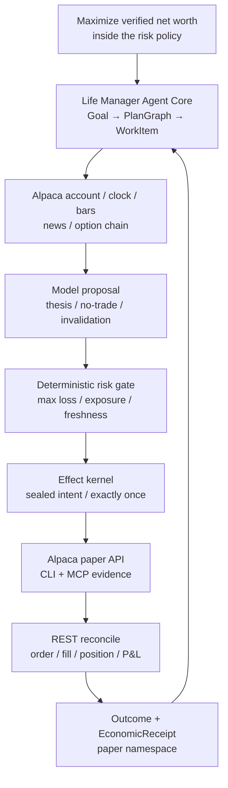
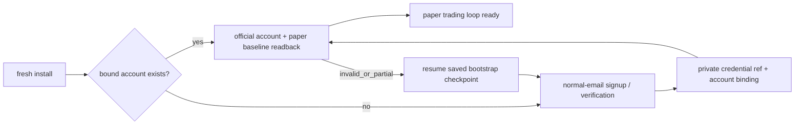

# Life Manager Alpaca Money Maximizer — design and ordered TODO

status: APPROVED DESIGN / IMPLEMENTATION NOT STARTED
owner: Dais / Life Manager
deadline: 2026-09-05 00:00 JST
execution SSOT: `2026-08-01-dais-life-manager-five-phase-execution-spec.md` §0.0

## 1. Goal and boundaries

Build the first CAPITAL capability of the Life Manager general money agent. One owner goal starts a bounded,
restart-safe loop that observes Alpaca market/account state, lets the model propose or refuse a defined-risk
options trade, applies deterministic risk and effect gates, executes on the dedicated hackathon paper account,
and records official order/fill/P&L receipts. The same capability later ships in the local OSS and cloud hosts.

This slice does not promise profit, call paper P&L money, use Dais's live capital, manage another person's
assets, bypass CAPTCHA/KYC/provider consent, or let a model rewrite production and immediately trade. Paper,
live owner-capital, and regulated customer management remain different capabilities and ledgers.

### Acceptance

1. The submission satisfies every event-specific eligibility item: Trading API, CLI or MCP, options in every
   eligible strategy, a new dedicated $100,000 paper account, private account ID, and real paper activity/P&L.
2. A scheduled no-routine-human pass completes `observe → decide → risk → effect → reconcile → receipt → reflect`.
3. Unknown order outcome never causes a blind retry. New risk stops on stale state, reconciliation failure,
   daily loss, drawdown, insufficient option level, undefined max loss, or excessive spread/concentration.
4. Public repository, hosted demo, cover, one-pager, PDF slides, and a video no longer than four minutes are
   submitted before the deadline and independently readable while logged out.
5. The capability uses the existing Life Manager Goal/PlanGraph/WorkItem/EffectIntent/OutcomeReceipt/
   EconomicReceipt chain and does not create a second agent core, scheduler, product, or general ledger.
6. A fresh install owns the complete lifecycle: create or resume the dedicated account through normal email,
   verify and store only secret references, prove a new-session login, then run trading without routine human
   setup. Replaying bootstrap reuses the bound account and creates zero duplicate accounts.

## 2. Product and runtime decision

The product is the canonical Life Manager monorepo. The agent core is the already selected ElizaOS
`AgentRuntime` plus the single `plugin-life-manager`; Alpaca is a capability/provider adapter inside that core.
The current launchd runtime contributes proven single-pass ownership, lock, heartbeat, timeout, and Telegram
patterns during migration. It is a macOS host adapter, not a second product or agent brain.

Local OSS runs the same bounded pass from launchd on macOS, systemd/cron on Linux, or Docker on a persistent
host. Phones are Telegram/web clients to that host; mobile operating systems are not promised as reliable
background daemon hosts. Cloud adds tenant isolation, vault, queue, billing, and quota without another core.

## 3. Reuse research — fixed source and decision

The repositories below were cloned into an isolated temporary directory and inspected at the listed commits.
The review covered entrypoints, broker calls, risk, state, reconciliation, scheduler, and demo rather than
README claims alone.

| Source | Fixed commit / observed evidence | Decision |
|---|---|---|
| [Veto](https://github.com/dancaldera/veto) | `4e5e6af95a70e4dd99d96323958ec72ad3538b84`; MIT; isolated `uv run pytest`: 43/43 | Primary donor. Copy/adapt paper-only key rejection, option selection/collar order construction, risk checks, `client_order_id`, reconcile/halt behavior, and read-only demo formatting. Preserve MIT notice. Do not copy its SQLite scheduler, SMA brain, separate MCP server, or product shell. |
| [Reason Before Result](https://github.com/wubian87/reason-before-result) | `095b2ae0afc1432aac786651dac797f8627ee112`; MIT; risk self-check 10/10; ledger/MCP static check PASS | Secondary donor. Copy/adapt the written-decision-before-effect sequence, MCP request/receipt redaction, and all-gates-visible explanation. Preserve MIT notice. Do not copy Chinese UI/product shell or its separate ledger. |
| [Alpaca Risk Agent](https://github.com/Stephen-Kimoi/alpaca-risk-agent) | `0d6f5a5dc5ecfc52d6868f028468df679943510e`; 415 Python LOC; no tests or LICENSE file | Learn only. Adopt the one-shot re-derive-from-broker shape and thin structured CLI invocation. Do not copy code without a license; its stock bracket strategy does not satisfy the event options requirement. |
| [Dis-Pater](https://github.com/MuhammadTahaBinZaeem/Dis-Pater) | `b40188a09fc69c99145dc5aad58f3243996ad70a`; 62,891 Python LOC, 115 tests, no root LICENSE file | Learn only and reject wholesale adoption. Reproduce only the small safety invariants: uncertain POST → reconcile by stable ID before retry, stale quote/account denial, protective exits during halt, and circuit-open on unhealthy reconciliation. |

### Reuse ladder inside Life Manager

1. Reuse the existing Eliza Goal/effect/receipt/restart kernel for orchestration and exactly-once effects.
2. Reuse current Life Manager financial/economic receipt, secret-reference, launchd owner, and Telegram patterns.
3. Adapt only MIT donor code that fills an Alpaca-specific gap and record attribution in
   `THIRD_PARTY_NOTICES.md`.
4. Use the official Alpaca CLI/MCP/API rather than writing a custom market protocol.
5. Add no strategy framework, new database, agent team, dashboard framework, or second scheduler.

## 4. Hackathon strategy and winning demo

The agent trades only defined-risk option structures. The first eligible structures are long call, long put,
bull call debit spread, and bear put debit spread, subject to the dedicated account's actual approved option
level. A strategy requiring an unavailable level is unavailable, not silently replaced by a stock-only trade.
No naked short option, unbounded loss, leverage, martingale, or fabricated fill is permitted.

The model interprets market regime, price/volume evidence, news, and option-chain evidence and produces one
proposal or `NO_TRADE`. Deterministic code validates structure and arithmetic. The initial frozen policy is:

- hard maximum loss per trade: 0.5% of current paper equity;
- total open maximum loss: 3%; minimum uncommitted cash: 30%; no borrowed leverage;
- daily realised/unrealised loss halt: 1.5%; portfolio high-water drawdown halt: 4%;
- maximum five positions; maximum ten open orders; five-minute entry cooldown;
- quote age at most 30 seconds, Greeks age at most 60 seconds, spread at most 15%;
- only regular-session entries; risk-reducing exits remain allowed while entries are halted.

Parameters freeze before the first judged trade. Historical replay chooses the initial strategy; competition
P&L does not trigger mid-event curve fitting. Paper deposit, reset, or self-transfer is never income.

The four-minute demo shows: Life Manager goal, new paper account and option level, MCP observation, model thesis,
one rejected proposal, one permitted defined-risk proposal, Alpaca CLI/API order receipt, reconcile/fill/P&L,
Telegram/panel evidence, and the same-core OSS path. The broad SELL/WORK/CAPITAL story is the opening/closing
differentiator; the middle of the demo is real Alpaca execution.

## 5. No-routine-human bootstrap

Use normal email signup through the existing owned browser and mailbox session; do not require Google login.
The bootstrap may read a provider email code and continue, store credentials only in the private credential
SSOT, and prove a new-session login. It must stop rather than bypass CAPTCHA, mandatory identity/KYC, legal
consent, or a provider request for the account owner. Such a provider-enforced handoff is reported as a named
blocked capability and is not hidden behind a claim of full autonomy.

Account bootstrap is a resumable one-time state machine inside the same Financial/Alpaca capability, not a
manual prerequisite and not part of every market wake:

## 6. Ordered TODO — current priority track

The order below is fixed until Dais explicitly changes it. Each atom ends with the named official readback;
tests support the atom and do not create a separate completeness program.

Current cursor: **A01 Freeze event contract**. The prerequisite startup-context drift repair is DONE: public
`/lm` metadata is bound to context `2026-09-01.1` / digest `f61cbb3c…` through anicca-products PR #402,
production deploy run `33500496615` and its money-path smoke passed, and the Life Manager live audit reads
product/repository/Telegram as 3/3 GREEN. This prerequisite does not consume or reorder an Alpaca atom.

| Seq | Atom | Done condition |
|---:|---|---|
| A01 | Freeze event contract | Official/archived rules matrix confirms deadline, Trading API, CLI/MCP, options, new paper account, account ID, judging, and every submission artifact; conflicts remain visible. |
| A02 | Team/submission shell | Enrolled team exists and its official page exposes every required field; no final submit yet. |
| A03 | New paper-account bootstrap | Normal-email flow yields a dedicated active paper account; account ID is private; cash/equity=`100000`; positions/orders/activity empty; option level recorded; new-session login works. |
| A04 | Alpaca CLI/MCP preflight | CLI doctor/account plus MCP account/clock/stock/options/news reads return the same dedicated account; secrets appear in no repo/log/chat artifact. |
| A05 | Alpaca provider adapter | `plugin-life-manager` converts official account/market/option data to typed observations and can create a paper-only defined-risk order request; live endpoint/key is structurally rejected. |
| A06 | Decision-before-effect | One bounded model call returns `NO_TRADE` or a typed thesis, structure, max loss, invalidation, exit, and evidence refs; the written decision precedes any effect intent. |
| A07 | Risk gate | Pure gate proves defined max loss, option level, quote/Greeks freshness, spread, DTE, cash/exposure, order/position count, cooldown, daily loss, drawdown, leverage, and reconciliation health. |
| A08 | Exactly-once paper canary | Sealed intent submits one minimum-risk paper options order; official ID/client ID/readback bind to the intent; replay submits zero additional orders. |
| A09 | Ack-loss/restart reconciliation | Simulated lost acknowledgement and process restart reconcile by client ID; absent/unknown state opens the breaker and blind retry remains zero. |
| A10 | One-pass owner | One scheduled pass owns one lease/heartbeat, uses Alpaca clock, observes/decides/acts/reconciles, exits boundedly, and resumes the same state after restart. |
| A11 | Paper campaign | Frozen strategy runs on the dedicated account; every proposal/no-trade/order/fill/exit/P&L is recorded; official account activity and Life Manager projection have zero unexplained delta. |
| A12 | Read-only public demo | Hosted URL shows redacted account equity/P&L, positions/max loss, thesis, gate reasons, order/fill receipts, and timeline; public UI cannot place an order. |
| A13 | Submission assets | Public README, one-pager, PDF slides, 16:9 cover, and ≤4-minute video truthfully match the current account and code. |
| A14 | Submit and read back | Form contains hosted URL, public repo, assets, tags, and private account ID; official submitted state is read back before 2026-09-05 00:00 JST. |
| A15 | Portable OSS release | Clean macOS and Linux/Docker installs start in paper mode from the public SHA; launchd/systemd/cron are host adapters to the same pass; secret-free fixture replay passes. |

## 7. After submission — production ladder

Production does not redefine hackathon paper P&L as revenue. It advances only in this order:

| Seq | Atom | Gate |
|---:|---|---|
| P01 | Measurement window | Frozen paper strategy reaches the predeclared duration/trade count; fees/slippage assumptions, drawdown, benchmark, and option liquidity are reported. |
| P02 | Owner-live eligibility | Alpaca confirms Dais's jurisdiction/account/product eligibility; tax and broker conditions are recorded; live and paper credentials remain separate. |
| P03 | Live shadow | Live account/market is read-only and produces proposals while paper executes; decision and expected-fill deltas are measured. |
| P04 | Owner-capital canary | Dais predefines a loss budget and funds only that budget; one smallest defined-risk position executes and independently reconciles. |
| P05 | Bounded live campaign | Capital cap increases only after verified positive net after fees and no safety breach; net-negative or unexplained state automatically demotes to paper/read-only. |
| P06 | Cross-rail allocator | The existing model compares verified SELL, WORK, reserve, compute, and CAPITAL opportunity economics; deposits and unrealised gains never count as earned income. |
| P07 | Self-improvement | Economic receipts create private improvement candidates; offline replay → no-effect canary → bounded canary → versioned promotion/rollback. Model/code changes cannot trade in the same release cycle. |

Managing only Dais's own account is the first production boundary. Selling compensated security-specific advice
or accepting discretion over customer assets is a separate regulated product track. Before that track, obtain
qualified Japanese legal advice and determine registration: Japan's FSA says compensated investment advice may
require investment advisory/agency registration, while accepting investment authority over customer assets may
require investment management registration. Customer beta stays paper-only until that boundary is closed.

## 8. Scope target for the first implementation plan

First plan scope is A01–A09 only. Soft target: at most three production files and 100 production LOC per atom;
reuse one existing contract/store/runner per responsibility. One focused normal-path check plus only the minimum
regressions preventing money error, duplicate effect, unknown broker state, or secret leakage. A10–A15 and P01+
receive later plans after the prior receipts exist.

## 9. Controlling references

- Event: <https://lablab.ai/ai-hackathons/alpaca-ai-trading-agents-hackathon>
- Archived event-rule verification and PDF provenance:
  <https://github.com/MuhammadTahaBinZaeem/Dis-Pater/blob/b40188a09fc69c99145dc5aad58f3243996ad70a/artifacts/hackathon-rule-verification.md>
- Alpaca CLI: <https://docs.alpaca.markets/us/docs/alpacas-cli>
- Alpaca MCP Server: <https://docs.alpaca.markets/us/docs/alpaca-mcp-server>
- Alpaca paper trading: <https://docs.alpaca.markets/us/docs/paper-trading>
- Lablab submission/judging overview: <https://lablab.ai/guide/ai-hackathons>
- Japan FSA registration guide: <https://www.fsa.go.jp/policy/marketentry/guidebook/02.html>
