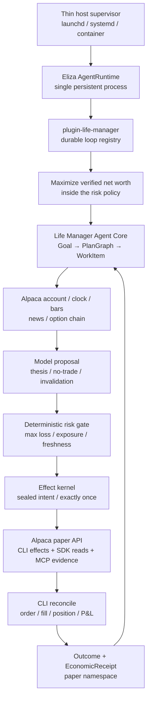
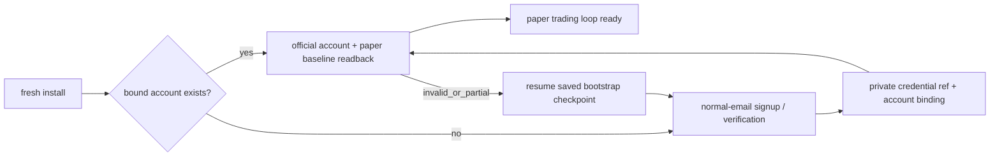

# Life Manager Alpaca Money Maximizer — design and ordered TODO

status: APPROVED DESIGN / A01-A10 DONE / A11 ACTIVE
owner: Dais / Life Manager
deadline: 2026-09-05 00:00 JST
execution SSOT: `2026-08-01-dais-life-manager-five-phase-execution-spec.md` §0.0

## 1. Goal and boundaries

Build the first registered durable loop in `plugin-life-manager` and the first CAPITAL capability of the Life
Manager general money agent. One owner goal starts a bounded, restart-safe loop that observes Alpaca market/account state, lets the model propose or refuse a defined-risk
options trade, applies deterministic risk and effect gates, executes on the dedicated hackathon paper account,
and records official order/fill/P&L receipts. The same capability later ships in the local OSS and cloud hosts.

This slice does not promise profit, call paper P&L money, use Dais's live capital, manage another person's
assets, bypass CAPTCHA/KYC/provider consent, or let a model rewrite production and immediately trade. Paper,
live owner-capital, and regulated customer management remain different capabilities and ledgers.

### Acceptance

1. The submission satisfies every event-specific eligibility item: Trading API, CLI or MCP, options in every
   eligible strategy, a new dedicated $100,000 paper account, private account ID, and real paper activity/P&L.
2. A scheduled no-routine-human pass completes `observe → decide → risk → effect → reconcile → receipt → reflect`.
3. Unknown order outcome never causes a blind retry. New risk stops on stale state, reconciliation failure,
   daily loss, drawdown, insufficient option level, undefined max loss, or excessive spread/concentration.
4. Public repository, hosted demo, cover, one-pager, PDF slides, and a video no longer than four minutes are
   submitted before the deadline and independently readable while logged out.
5. The capability uses the existing Life Manager Goal/PlanGraph/WorkItem/EffectIntent/OutcomeReceipt/
   EconomicReceipt chain. Eliza owns the only loop registry and scheduler; the capability does not create a
   second agent core, scheduler, product, or general ledger.
6. A fresh install owns the complete lifecycle: create or resume the dedicated account through normal email,
   verify and store only secret references, prove a new-session login, then run trading without routine human
   setup. Replaying bootstrap reuses the bound account and creates zero duplicate accounts.

## 2. Product and runtime decision

The product is the canonical Life Manager monorepo. The agent core is the already selected ElizaOS
`AgentRuntime` plus the single `plugin-life-manager`; Alpaca is a capability/provider adapter inside that core.
The Alpaca loop registers with `plugin-life-manager` and is started, scheduled, checkpointed, resumed, healed,
and improved by the existing Eliza `AgentRuntime`. Current launchd code contributes proven lock, heartbeat,
timeout, and Telegram patterns during migration, but it does not own an Alpaca schedule or pass. The only
host-level responsibility is keeping the Eliza process alive: launchd on macOS, systemd on Linux, or the
container/cloud restart policy. These interchangeable adapters contain no goal, market, account, risk, effect,
or improvement state.

Local OSS and cloud run the same persistent Eliza runtime and internal loop registry. Host adapters only start
or restart that runtime; they never schedule the Alpaca loop. Phones are Telegram/web clients to a persistent
host because mobile operating systems are not promised as reliable background daemon hosts. Cloud adds tenant
isolation, vault, queue, billing, and quota without another core.

Eliza self-healing owns task timeout, provider failure, stale observation, acknowledgement loss, circuit break,
checkpoint resume, and loop-local quarantine. Eliza self-improvement owns receipt attribution, offline replay,
no-effect evaluation, paper canary, versioned promotion, monitoring, and rollback. A completely dead Eliza
process cannot execute its own recovery code, so only process resurrection remains outside Eliza. Machine power
and host failure remain the responsibility of the operating system or cloud platform.

### Event contract and Alpaca interface authority

This matrix freezes A01. The current official event page was read through the existing browser session; the
archived 20 August 2026 PDF verification (`SHA-256 7e436430…`) independently corroborates its controlling
requirements. Anonymous crawl/search snippets are incomplete and do not override the live page. A changed
official form or organizer notice remains controlling and must be recorded as a visible conflict before
submission.

| Requirement | Frozen contract | Evidence and conflict handling |
|---|---|---|
| Event window and deadline | Online, 28 August–4 September 2026; submit by **5 September 2026 00:00 JST** | Current official page and schedule both show the exact deadline; archived PDF agrees. |
| Challenge | Build an autonomous AI trading agent using Alpaca Trading API in paper trading | Current official challenge and archived PDF page 2 agree. |
| Agent-facing Alpaca surface | Event minimum is **either** Alpaca CLI or Alpaca MCP server | Current official `CORE REQUIREMENTS` and archived PDF page 2 agree. Life Manager chooses CLI authority plus optional read-only MCP presentation. |
| Options | All strategies incorporate options; underlying-only entry is ineligible | Current official `CORE REQUIREMENTS` and archived PDF page 2 agree. Alpaca official options docs confirm paper options are enabled by default and levels 2/3 support long options/spreads. |
| Judged account | Brand-new Alpaca paper account dedicated to this hackathon, starting at exactly `$100,000`; development accounts may differ | Current official `REQUIRED FOR JUDGING` and `ADDITIONAL REQUIREMENTS`. Alpaca official paper docs confirm global email-only Paper Only signup and the default `$100,000` balance. |
| Required write-up | One page covering AI logic, risk gates, and Alpaca infrastructure implementation | Current official `ADDITIONAL REQUIREMENTS`. This is separate from the slide presentation. |
| Private judge identifier | Submit the dedicated Alpaca paper account ID for activity/P&L verification | Current official `WHAT TO SUBMIT` and archived PDF page 6 agree. Public artifacts expose only a redacted/hash reference. |
| Submission fields | Project title; short and long descriptions; technology/category tags; cover image; video presentation; slide presentation; public GitHub repository; demo platform and application URL; Alpaca account ID | Current official `WHAT TO SUBMIT`. Generic Lablab guidance permits a video up to five minutes; this project keeps the stricter ≤4-minute target. |
| Social extra challenge | Up to five X/LinkedIn post links tagging lablab.ai and Alpaca | Current official extra challenge. These links are optional for main judging but required to compete for the social prize. |
| Judging | P&L Performance; Technology Implementation; Creativity & Originality; Presentation & Execution | Current event-specific official criteria. The generic Lablab rubric does not replace these criteria. P&L never overrides safety or truthfulness. |
| Team and originality | Team size 1–6; entrants 18+ for prize eligibility; submissions must be original and MIT-compliant | Current official guidelines and prize terms. Life Manager remains public MIT-compatible OSS with donor notices. |
| Prize pool | `$6,000` cash plus `$300` Featherless credits displayed as `$6,300` total | Current official prize section: main cash `$2,500 + $1,500 + $1,000`, social cash `2 × $500`, and first-place Featherless credits `$300`. |

**Broker authority decision:** the Alpaca CLI is the sole mutation and authoritative reconciliation surface used
by the Financial loop. Eliza invokes pinned CLI commands with structured JSON, binds every mutation to a stable
`client_order_id`, and reconciles through CLI account/order/position/activity reads. The official
`@alpacahq/alpaca-trade-api` SDK may serve only the read-only bulk market-data plane; its trading namespace is not
exposed by the Life Manager adapter. This is permitted because the event requires the Trading API plus at least
one of CLI or MCP, not CLI-only implementation. MCP remains an optional read-only judge/explanation surface; it
cannot place, replace, cancel, exercise, or close orders.

## 3. Reuse research — fixed source and decision

The repositories below were cloned into an isolated temporary directory and inspected at the listed commits.
The review covered entrypoints, broker calls, risk, state, reconciliation, scheduler, and demo rather than
README claims alone.

| Source | Fixed commit / observed evidence | Decision |
|---|---|---|
| [Veto](https://github.com/dancaldera/veto) | `4e5e6af95a70e4dd99d96323958ec72ad3538b84`; MIT; isolated `uv run pytest`: 43/43 | Primary donor. Copy/adapt paper-only key rejection, option selection/collar order construction, risk checks, `client_order_id`, reconcile/halt behavior, and read-only demo formatting. Preserve MIT notice. Do not copy its SQLite scheduler, SMA brain, separate MCP server, or product shell. |
| [Reason Before Result](https://github.com/wubian87/reason-before-result) | `095b2ae0afc1432aac786651dac797f8627ee112`; MIT; risk self-check 10/10; ledger/MCP static check PASS | Secondary donor. Copy/adapt the written-decision-before-effect sequence, MCP request/receipt redaction, and all-gates-visible explanation. Preserve MIT notice. Do not copy Chinese UI/product shell or its separate ledger. |
| [Alpaca Risk Agent](https://github.com/Stephen-Kimoi/alpaca-risk-agent) | `0d6f5a5dc5ecfc52d6868f028468df679943510e`; 415 Python LOC; no tests or LICENSE file | Learn only. Adopt the one-shot re-derive-from-broker shape and thin structured CLI invocation. Do not copy code without a license; its stock bracket strategy does not satisfy the event options requirement. |
| [Dis-Pater](https://github.com/MuhammadTahaBinZaeem/Dis-Pater) | `b40188a09fc69c99145dc5aad58f3243996ad70a`; 62,891 Python LOC, 115 tests, no root LICENSE file | Learn only and reject wholesale adoption. Reproduce only the small safety invariants: uncertain POST → reconcile by stable ID before retry, stale quote/account denial, protective exits during halt, and circuit-open on unhealthy reconciliation. |

### Reuse ladder inside Life Manager

1. Reuse the existing Eliza Goal/effect/receipt/restart kernel for orchestration and exactly-once effects.
2. Reuse current Life Manager financial/economic receipt, secret-reference, lease/heartbeat, and Telegram
   patterns; do not reuse launchd as the loop owner.
3. Adapt only MIT donor code that fills an Alpaca-specific gap and record attribution in
   `THIRD_PARTY_NOTICES.md`.
4. Use the pinned official Alpaca CLI as the sole broker authority rather than writing a custom market protocol;
   optional MCP is read-only and judge-facing.
5. Add no strategy framework, new database, agent team, dashboard framework, or second scheduler.

## 4. Hackathon strategy and winning demo

The agent trades only defined-risk option structures. The first eligible structures are long call, long put,
bull call debit spread, and bear put debit spread, subject to the dedicated account's actual approved option
level. A strategy requiring an unavailable level is unavailable, not silently replaced by a stock-only trade.
No naked short option, unbounded loss, leverage, martingale, or fabricated fill is permitted.

The model interprets market regime, price/volume evidence, news, and option-chain evidence and produces one
proposal or `NO_TRADE`. Deterministic code validates structure and arithmetic. The initial frozen policy is:

- hard maximum loss per trade: 0.5% of current paper equity;
- total open maximum loss: 3%; minimum uncommitted cash: 30%; no borrowed leverage;
- daily realised/unrealised loss halt: 1.5%; portfolio high-water drawdown halt: 4%;
- maximum five positions; maximum ten open orders; five-minute entry cooldown;
- quote age at most 30 seconds, Greeks age at most 60 seconds, spread at most 15%; initial entries use 7–45 DTE;
- only regular-session entries; risk-reducing exits remain allowed while entries are halted.

Parameters freeze before the first judged trade. Historical replay chooses the initial strategy; competition
P&L does not trigger mid-event curve fitting. Paper deposit, reset, or self-transfer is never income.

The four-minute demo shows: Life Manager goal, new paper account and option level, CLI observation, model thesis,
one rejected proposal, one permitted defined-risk proposal, Alpaca CLI order receipt, reconcile/fill/P&L,
Telegram/panel evidence, the optional read-only MCP explanation view, and the same-core OSS path. The broad SELL/WORK/CAPITAL story is the opening/closing
differentiator; the middle of the demo is real Alpaca execution.

## 5. No-routine-human bootstrap

Use normal email signup through the existing owned browser and mailbox session; do not require Google login.
The bootstrap may read a provider email code and continue, store credentials only in the private credential
SSOT, and prove a new-session login. It must stop rather than bypass CAPTCHA, mandatory identity/KYC, legal
consent, or a provider request for the account owner. Such a provider-enforced handoff is reported as a named
blocked capability and is not hidden behind a claim of full autonomy.

Account bootstrap is a resumable one-time state machine inside the same Financial/Alpaca capability, not a
manual prerequisite and not part of every market wake:

## 6. Ordered TODO — current priority track

The order below is fixed until Dais explicitly changes it. Dais changed it after the first paper canary proved
durability: the open SPY exit remains owned by the same background Eliza task, but a closed options session no
longer blocks multi-market research, the bounded portfolio allocator, or submission artifacts. No second
scheduler or broker mutation path is introduced. Each atom ends with the named official readback; tests support
the atom and do not create a separate completeness program.

Current cursor: **A11 Multi-market paper allocator**, while the original SPY exit remains active background
reconciliation inside the same task. A01 is DONE with the event contract matrix above. The prerequisite startup-context drift repair is DONE: public
`/lm` metadata is bound to context `2026-09-01.1` / digest `f61cbb3c…` through anicca-products PR #402,
production deploy run `33500496615` and its money-path smoke passed, and the Life Manager live audit reads
product/repository/Telegram as 3/3 GREEN. This prerequisite does not consume or reorder an Alpaca atom.

A02 is **DONE**. The normal-email Lablab account remains `Approved` for the event, and Dais completed Discord's
required human-presence checks. The connected Discord identity initially differed from the identity that had
joined the LABLAB.AI community; changing the official Lablab OAuth connection to the joined identity removed
the provider's `DISCORD_COMMUNITY_JOIN_REQUIRED` response. Lablab then returned HTTP `201` with a team slug and
created the one-member, closed, UTC +9:00 team `Life Manager`. Official readback:
`https://lablab.ai/ai-hackathons/alpaca-ai-trading-agents-hackathon/life-manager`.

The submission draft also exists and is saved at Step 2 of 3 with title `Life Manager: Autonomous Options Money
Loop`, truthful short/long descriptions, categories Finance/Investment/Personal Finance, and technology Alpaca.
The official editor exposes cover image, required video and PDF slides, public repository, demo platform/URL,
private Alpaca account ID, and up to five social links. It reads `Last saved`; final submission has not occurred.
Google login was not used, no secret or Discord/account identifier was written to the repository, and later atoms
must replace provisional copy only with verified campaign facts.

A03 is **DONE**. A brand-new Alpaca Trading API identity was created through the normal-email form and verified
through the existing authenticated mail reader. Authenticator MFA and its recovery code are active; password,
TOTP secret, recovery code, and paper account ID exist only in the mode-`0600` private credential SSOT. A fresh
cookie-free login required both password and a newly generated TOTP code and returned the same private paper
account. The official paper dashboard reads equity `$100,000.00`, cash `$100,000.00`, no open positions, no
orders, and no activities. Official configuration reads options `Level 3`, including defined-risk spreads and
multi-leg strategies. The provider offered a separate live Individual/Business account application; it was not
started, and no KYC, funding, live-capital, or live-trading state was created.

The active Eliza implementation branch `feat/alpaca-a03-autonomous-bootstrap-20260901` now exposes
`ALPACA_BOOTSTRAP` from the sole `plugin-life-manager`. It stores one redacted, non-scheduled checkpoint Task
row; an empty checkpoint discovers six bound private refs from the mode-`0600` credential SSOT and runs only
the pinned CLI. A production readback through that operation returned `READY` twice with one Task row,
`scheduled=false`, paper ACTIVE, cash/equity `100000`, options Level 3, and zero positions/orders/activities.
The second pass created no Task or account duplicate. A fresh-install fixture now atomically seeds only the
owner's normal email, an internally generated password, and the paper endpoint into the private SSOT, preserves
mode `0600`, and checkpoints three bound refs without returning the password to the model. BrowserService actions
now fill those values without model exposure, use the authenticated read-only mailbox CLI to allowlist and open
only the Alpaca verification URL, capture TOTP/recovery/API/account material directly into the private SSOT, and
generate/fill the current TOTP code without returning either the secret or code. Commit `69a3fa4e58` passed Biome
and package typecheck; a production-function runtime fixture preserved mode `0600`, filled exactly six digits,
and exposed neither value. Commit `4b0bb86350` extends the same checkpoint to deterministic
`CREATE_PAPER_ACCOUNT → VERIFY_EMAIL → CONFIGURE_MFA → BIND_API_KEYS → RUN_TRADING_LOOP` resumption. Its runtime
fixture produced exactly one create step, required eight private refs including recovery code and account ID,
then reached paper `READY` with cash/equity `100000`; Bun compiled every changed production entrypoint. The real
existing account path remained `READY` and left the SSOT hash unchanged. Commit `9c7dba5473` registers
`plugin-life-manager` once in the normal macOS/Linux/Docker core collector while keeping it out of the CLI-less
mobile boot. Commit `8dd1114f3e` routes every Alpaca Action into the `finance/automation` owner context and returns
the concrete BrowserService/private-action chain to the native planner; its handler fixture persisted one Task,
selected normal email rather than Google login, and exposed no secret. A real isolated Eliza runtime then loaded
`plugin-life-manager`, accepted one authenticated owner goal, selected and successfully executed
`ALPACA_BOOTSTRAP`, and persisted exactly one checkpoint Task at `READY / RUN_TRADING_LOOP`. Its redacted action
trajectory and Task readback reported eight bound credential refs, paper `ACTIVE`, cash/equity `100000`, options
Level 3, and zero positions/orders/activities. After a full runtime stop and restart against the same state, a
second owner goal executed the same action, kept the Task count at one, and returned the same facts; immediate
official CLI readback still returned zero positions/orders/activities. No account, order, or trade was created by
either pass. The closing implementation on branch `feat/alpaca-a03-autonomous-bootstrap-20260901` adds the
existing CloakBrowser CDP session as a local BrowserService target and a deterministic, authenticated Life
Manager bootstrap dispatch. Life Manager used Alpaca's official account switcher, created exactly one additional
paper account named `Life Manager`, and left the original baseline account intact. The provider returned HTTP
`200` for `POST /api/v1/paper_accounts`; switcher readback showed two paper accounts and exactly one `Life
Manager` account. Life Manager selected the new account, generated its API keys, and captured the key, secret,
and account number directly into the mode-`0600` private credential SSOT without returning their values to the
model or logs. Pinned CLI v0.0.14 then returned `READY / RUN_TRADING_LOOP`, paper `ACTIVE`, cash/equity `100000`,
options Level 3, and zero positions/orders/activities. After a full runtime restart, the same checkpoint returned
the same READY facts; the provider still showed two paper accounts and one `Life Manager` account, proving zero
duplicate creation. No live account, live capital, order, position, or trade was created. Closing commits through
`a8e00e3f3e` passed BrowserService `22/22`, bootstrap/private-capture `2/2`, and focused import/diff checks.

A04 is **DONE** against the official `alpacahq/cli` release `v0.0.14`, source commit
`53606273aa230a40c64b783425dcb3f4423ede30`. Its published release checksum was verified before installing the
native macOS arm64 binary. `alpaca version` returns `0.0.14`; `alpaca doctor` reports no saved profile, env-only
credentials, active profile `paper`, connected `paper-api.alpaca.markets` trading and data APIs, and all checks
passed. CLI JSON reads return the same private account with status ACTIVE, cash/equity `100000`, options level
3, a valid market clock, a current SPY trade, ten SPY option-chain snapshots, and three SPY news items. CLI
position/order/activity lists each return zero. Paper keys exist only in the private credential SSOT and are
injected into the process environment; `ALPACA_LIVE_TRADE=false`, no CLI profile or repo secret exists, and no
mutation command ran. The closing readback against the Life Manager-created A03 account returned the same
paper ACTIVE cash/equity `100000`, options Level 3, current market clock and SPY trade, ten option-chain
snapshots, three news items, and zero positions/orders/activities. No CLI profile was created.

A05 is **DONE** in `life-manager-eliza` merge `270d80f99850c4274a7fb70f2625f55a7bfb3c79` (PR #47).
`plugin-life-manager` now reuses the existing private credential reader and bounded `execFile` boundary to expose
typed paper account, latest-trade, and option-chain observations plus one CLI-only defined-risk `mleg` order
method. Every invocation pins CLI v0.0.14 and injects `ALPACA_LIVE_TRADE=false`; a non-paper request is rejected
before credential resolution or process execution. Real readback returned paper ACTIVE, cash/equity `100000`, a
current SPY trade, and 100 option snapshots. The pinned CLI's own `order submit --dry-run` produced a two-leg
`mleg` limit/day request with a stable client order ID, and an injected execution-boundary check produced a typed
paper receipt. No REST/SDK mutation path exists and no order was submitted; the first broker effect remains A08.

A06 is **DONE** in `life-manager-eliza` merge `f3e11707e60a22d5b2721ad11060fdf5531f7700` (PR #48).
One bounded `ACTION_PLANNER` call returns either `NO_TRADE` or a strict options decision containing thesis,
structure, maximum loss, invalidation, exit plan, and only offered evidence references. A tenant-scoped,
work-item-unique `decision_receipts` row stores that payload separately from model-attempt metadata. The same
work item replays the durable receipt without another model call. Its persistence transaction checks that no
effect intent already exists and fails closed if effect ordering has been violated. Plugin strict typecheck and
four focused suites passed (`7/7` tests), including first call=1, replay call=0, and effect-before-decision
rejection. No broker order or other external effect ran in A06.

A07 is **DONE** in `life-manager-eliza` merge `b7a39fc8eaf58ea838f36820e05ec3edb0f9b9b5` (PR #49).
One pure gate checks the model decision against deterministic max-loss arithmetic and the frozen paper policy:
0.5% per trade, 3% total open risk, 30% cash reserve, 1.5% daily-loss halt, 4% high-water drawdown halt,
five positions, ten orders, five-minute cooldown, 30-second quotes, 60-second Greeks, 15% spread, option
level, no leverage, regular-session entry, and healthy reconciliation. The initial 7–45 DTE range excludes
0DTE and same-week expiration risk; [FINRA](https://www.finra.org/investors/insights/zeroing-in-options-trading-strategy)
warns that buying and selling 0DTE options can be risky, while
[OCC](https://www.optionseducation.org/referencelibrary/faq/weekly-options) documents weekly expiry/exercise
behavior. Unknown structures and malformed runtime values fail closed. Plugin
strict typecheck and four focused suites passed (`5/5` tests); a $400 maximum-loss spread on $100,000 equity
passed, while the combined halt fixture returned every applicable reason. No broker effect ran in A07.

A08 is **DONE** in `life-manager-eliza` merges through PR #58. The owner-authenticated Life Manager Eliza
runtime observed the dedicated paper account and fresh SPY option snapshots through pinned Alpaca CLI v0.0.14,
persisted a model decision, and rejected its first 751P/750P proposal with deterministic `SPREAD_LIMIT` and zero
broker effect. On a second immutable run it selected one 769C/770C bull-call debit spread, calculated and agreed
maximum loss `$33`, passed A07 with no reasons, sealed a stable `lm-a08-*` client ID, acquired the durable DB
effect lease, and submitted through the CLI-only paper adapter. Official Alpaca readback returned one filled
order, quantity one, and the same provider order/client IDs. Replaying the identical run returned
`effect_started=false`, `replayed=true`, `outcome=noop`; an official all-orders query found exactly one matching
client ID. Immediate paper readback was equity `$99,996.95`, cash `$99,970.95`, two option legs, and unrealized
P&L `-$3`; A08 therefore proves execution and idempotency, not profit. No live credential or capital was used.

A09 is **DONE** in `life-manager-eliza` merge `c5f20b77eadecbd975e12a2c9b092796cf533cfb`
(PR #59). With the isolated runtime stopped, the existing applied intent was changed to an expired `running`
lease and its outcome receipt was removed to simulate a lost acknowledgement. The merged runtime then restarted
against the same DB and the same owner request. Life Manager performed one pinned-CLI lookup by the sealed
client ID, consumed that official readback without a second inspect or submission, returned
`effect_started=false`, `replayed=true`, `outcome=noop`, restored the missing receipt, and converged the intent
to `applied` with no lease. Official Alpaca CLI readback still found exactly one matching order, provider order
ID `c143b7aa-52d5-47f8-9e59-fae7ded50a0d`; no duplicate order was created. A separate copied-DB fault injection
made the sealed broker order absent after effect start: the route returned HTTP `409`, persisted
`reconciliation_blocked`, cleared the lease, and the official matching-order count remained one. Strict plugin
typecheck and four focused suites passed (`6/6` tests). Closing paper readback was equity `$99,997.95` and cash
`$99,970.95`; A09 proves recovery and fail-closed behavior, not material profit.

A10 is **DONE** in `life-manager-eliza` merges `126f042f4181b80866ad696981a70ef22c49f2c1`,
`3a0377164c0a005b888a44a344f3ee05312cb4cb`, and `ed39404f44f865cd35bd54227094940f1b4c363d`
(PRs #60–#62). `plugin-life-manager` registers one seed-once five-minute interval task and one contributed
Financial dispatch channel through the existing `plugin-scheduling` spine; no timer, scheduler DB, host cadence,
or broker mutation path was added. The deferred-plugin boot hook seeded exactly one task. Official scheduled-task
readback showed one matching idempotency key, then the existing Eliza runner naturally fired the same task ID and
recorded `ok=true`, channel `life_manager_alpaca_paper_loop`, and Financial status `ORDER_VERIFIED`. The pass
reconciled the A08 order through pinned Alpaca CLI and submitted no new order. After a full runtime stop/restart,
readback preserved the same task ID, trigger, fire time, and result with matching task count one. Official Alpaca
CLI still found exactly one matching client ID/provider order; paper equity was `$99,997.95` and cash
`$99,970.95`. Strict plugin typecheck and five focused suites passed (`8/8` tests). Host adapters contain no
Alpaca timing or trade decision.

A11 is **ACTIVE**. `life-manager-eliza` merge `512ef713a5fac6dae002d62e566649e09924716a`
(PR #63) adds a pinned-CLI campaign snapshot and an immutable reconciliation receipt without adding another
broker or scheduler path. The official account returned exactly two entry fills and the two expected SPY option
positions; fill-derived quantities matched the long `769C` and short `770C` legs with zero unexplained delta.
Life Manager recorded the open campaign with entry debit `$29`, two fills, two positions, and unrealised P&L
`-$2`; unrealised P&L was not recorded as revenue. A real branch-root Eliza runtime loaded the Life Manager
plugin, action, and service, then fired the existing task ID through channel
`life_manager_alpaca_paper_loop` with `ORDER_VERIFIED` and no pending dispatch. Official Alpaca CLI still found
exactly one matching client order/provider order, paper equity `$99,997.95`, and cash `$99,970.95`. The position
has not exited, so realised P&L is not yet available and A11 remains ACTIVE.

Follow-up `life-manager-eliza` merge `ad5f1fdbf7f12ced5ed24c53841bce4d5bb50496` (PR #64) seals the
risk-reducing exit through the same effect kernel and stable client-ID derivation. It uses Alpaca's documented
mleg sign convention (negative limit price means credit), records exact position/fill details, and creates a
paper-only realised gain/loss receipt only after official positions reach zero. The existing five-minute task
now evaluates this exit on every pass. Its real after-hours fire returned `ORDER_VERIFIED` plus
`HOLD_CLOSED_SESSION`, with pending dispatch empty and no close order submitted; the next regular-session fire
owns the exactly-once close and subsequent realised-P&L reconciliation.

Follow-up merges `45e33086bf0463323d3c28b1509854af2f5226ed` and
`772189de2f4229fe6c47c6d926037cae8c61cefb` (PRs #65–#66) persist immutable
`broker.paper.no_effect` receipts for future `NO_TRADE`/`RISK_REJECTED` decisions and make entry selection
explicit from its sealed `*_to_open` legs, so a later exit intent cannot be mistaken for the entry. The earlier
rejected `751P/750P` proposal now has one historical `RISK_REJECTED / SPREAD_LIMIT / effectStarted=false`
receipt and no broker order. After restart on the same database, the existing five-minute task retained the same
ID and returned `ORDER_VERIFIED / HOLD_CLOSED_SESSION`. Pinned-CLI readback still showed one filled entry,
two fills, two positions, zero open orders, cash `$99,970.95`, equity `$99,997.95`, and unrealised P&L `-$2`.
No close order exists while the regular session is closed; A11 remains ACTIVE until the loop records an official
close fill, zero positions, and the realised paper P&L receipt.

Current paper-money scoreboard (pinned-CLI readback): starting equity `$100,000`; current equity `$99,997.95`;
realised P&L `$0`; open-position unrealised P&L `-$2`; realised profit made `$0`. Therefore the Alpaca loop has
placed and filled its first paper trade but is **not making money yet**. Paper equity, unrealised P&L, and any
future realised paper gain remain simulation evidence and must never be reported as revenue or live earnings.

The A11 natural-recurrence sub-atom is **DONE**. Without a REST fire or second scheduler, the live Eliza
TaskService refired the same interval task ID from `20:59:39Z` to `21:16:13Z`; the contributed Financial channel
again returned `ORDER_VERIFIED / HOLD_CLOSED_SESSION`. The persisted trigger remains five minutes, although this
observed process fire was late and is not represented as an exact-cadence guarantee. Immediate pinned-CLI
readback retained the same filled provider order ID, two fills, two positions, zero open orders, cash
`$99,970.95`, equity `$99,997.95`, and unrealised P&L `-$2`. Natural recurrence therefore added zero broker
orders. The next A11 sub-atom remains the regular-session sealed exit and realised-P&L reconciliation.

Restart durability was re-read from the same live runtime and PGlite state rather than inferred from a PID. After
process resurrection, the authenticated Eliza API retained task `st_mtj43gm5_goclnvsx`, its five-minute trigger,
and advanced `firedAt` again to `21:27:38Z` with `ORDER_VERIFIED / HOLD_CLOSED_SESSION`. A fresh pinned-CLI
v0.0.14 readback at `21:30:37Z` still showed exactly one filled campaign order, the same two entry fills and two
positions, zero open orders, cash `$99,970.95`, equity `$99,997.95`, and unrealised P&L `-$2`. Thus restart plus
subsequent natural replay preserved the durable task and added zero broker orders. The market clock remained
closed with the next regular session at `2026-09-02T09:30:00-04:00`; no after-hours exit was attempted.

Here `HOLD_CLOSED_SESSION` is narrowly an **options-exit** hold, not an Alpaca-wide market outage. The open
campaign owns US-listed SPY option legs, and Alpaca says options orders may only be placed during regular market
hours. Alpaca separately documents crypto trading 24 hours every day and 24/5 overnight trading for NMS
securities. Those asset classes do not make the current option legs closeable. Dais subsequently authorized the
same Financial loop to continue across other asset classes while that exit remains monitored; aggregate
exposure, open orders and campaign state must be included in every allocator decision. Sources:
<https://docs.alpaca.markets/us/docs/spacex-trading-availability-and-faqs>,
<https://docs.alpaca.markets/us/docs/crypto-trading>, and <https://docs.alpaca.markets/us/docs/245-trading>.

There is no supported parameter that makes the two open option legs executable after hours. Alpaca's options
validation requires `extended_hours=false` or omission; `day`/`gtc` describe lifetime, not an extended-hours
execution venue. The current resolution is therefore one regular-session, two-leg `SELL_TO_CLOSE` /
`BUY_TO_CLOSE` limit order through the existing sealed CLI effect, followed by official fills, zero positions,
realised paper P&L, and replay-zero readback. The permanent non-blocking design after this frozen campaign closes
is an asset-class-aware opportunity router inside the **same** Eliza task/effect kernel/CLI authority: crypto may
run 24/7, eligible NMS equities/ETFs may run 24/5, and options entries/exits run only in their regular session.
An option-session hold must never pause observations for another asset class. Any new bounded paper effect must
still pass the one portfolio-level risk gate, use the existing CLI effect kernel, and reconcile before another
effect begins. Order validation source:
<https://docs.alpaca.markets/us/docs/options-trading>.

The A11 non-blocking data-plane sub-atom is **DONE** in `life-manager-eliza` merge
`1f18fcbe7c5a0b2a1b58a13819c4b8b1452b7499` (PR #67). The plugin pins the current official
`@alpacahq/alpaca-trade-api` `4.0.1` SDK behind a read-only adapter that exposes only bulk option-chain and crypto
snapshot reads. It does not return the SDK client or trading namespace, while the existing CLI remains the only
order/effect and account/order/fill reconciliation path. Typecheck and plugin build passed. A real authenticated
paper-data read returned 305 SPY call contracts plus BTC/USD and ETH/USD snapshots, including a current BTC
trade, with zero broker mutation. The superseded `alpacahq/typescript-sdk` was rejected because its own official
README says it is no longer maintained and points to `alpaca-trade-api-js`. This removes closed-session research
blocking without authorising a second campaign before the open SPY spread closes.

The A11 no-effect ranking sub-atom is **DONE** in `life-manager-eliza` merge
`b4dc698ef66e46f9d6e82e82e1a279539d739f6d` (PR #70). The same registered task first
reconciled the existing order and evaluated its sealed exit, then used the read-only SDK adapter to construct
12 quoted SPY vertical-spread candidates while reading BTC/USD and ETH/USD only as market context. One bounded
model decision returned `NO_TRADE`; Life Manager persisted the thesis, invalidation, exit plan, evidence refs,
and all ranked candidates as `RESEARCH_ONLY / effectStarted=false`. The dispatcher result was
`ORDER_VERIFIED / HOLD_CLOSED_SESSION / NO_TRADE`. Immediate pinned-CLI readback remained two positions, two
fills, zero open orders, cash `$99,970.95`, equity `$99,997.95`, and unrealised P&L `-$2`, proving that research
added zero broker effects. During E2E recovery, the existing task's stale notification escalation was closed,
reopened, and refired under the same task ID so its Financial channel—not `push/in_app`—owned the successful
pass. Typecheck, build, and three focused suites passed (`4/4` tests).

The A11 dispatcher self-heal sub-atom is **DONE** in `life-manager-eliza` merge
`097111f3b1f379282e6dfd0244756faf32742c24` (PR #73). A real restart exposed two persisted-host failures:
the deferred Life Manager plugin could register after the five-minute task had already recorded
`disconnected`, and the task's legacy `bg-light-30s` execution profile caused the host-capability gate to
substitute `in_app` before the contributed Financial dispatcher. The same Eliza boot hook now removes only
that stale Alpaca dispatch state, clears the legacy profile, and lets the existing runner refire when the
interval is naturally due. At `23:43:46Z` the same task ID fired without a REST/manual trigger and persisted
`ok=true`, channel `life_manager_alpaca_paper_loop`, and
`ORDER_VERIFIED / HOLD_CLOSED_SESSION / NO_TRADE`; pending dispatch was absent. Pinned-CLI readback remained
paper `ACTIVE`, cash `$99,970.95`, equity `$99,997.95`, two positions, two entry fills, and unrealised P&L
`-$2`. No close fill exists, so realised campaign P&L remains `$0`. Typecheck, build, three focused suites
(`4/4` tests), and `git diff --check` passed. The next natural recurrence at `23:49:16Z` returned the same
three Financial statuses with pending dispatch absent; immediate CLI readback still showed two positions and
two fills with identical cash/equity, proving this closed-session replay added zero broker effects. The final
post-close replay-zero gate remains pending.

The A11 multi-market allocator contract sub-atom is **DONE** in `life-manager-eliza` merge
`3df280e9d6d97e882986ee84e512973dcef1a241` (PR #75). The same natural task read 12 SPY defined-risk option
candidates, live BTC/USD and ETH/USD quotes, and one QQQ snapshot through the read-only SDK, then offered all
15 candidates to one model decision. The typed result carries `assetClass` plus one offered candidate reference;
the model selected the SPY `782C/783C` debit spread with stated maximum loss `$2`. Life Manager persisted the
decision and all offered candidates as `RESEARCH_ONLY / effectStarted=false`. Pinned-CLI readback remained the
existing two SPY legs and two entry fills, so the allocator created zero broker effects. Typecheck, build, and
three focused suites passed (`4/4` tests). The selected far-OTM spread also exposes the next quality gap: common
expected-value, probability, freshness, and liquidity evidence must be normalized before any crypto/equity
effect is authorized; a low debit alone is not a winning strategy.

The A11 common scoring-gate implementation sub-atom is **DONE** in `life-manager-eliza` merge
`640af4ca1790e6de6ef973430c5ae276f11d2332` (PR #82). The existing single model decision now supplies an
estimated win probability and expected gain; deterministic code calculates expected value and checks it against
the selected candidate's exact maximum loss. Every option, crypto and ETF candidate carries quote age and spread
in basis points, while defined-risk options also carry maximum profit. The research-only gate rejects nonpositive
expected value, quotes older than the existing 30-second policy, spreads above the existing 15% policy, maximum-
loss mismatch, and option expected gain above the contract's maximum profit. No scheduler, broker client, DB,
dependency or order path was added; Alpaca CLI remains the only mutation authority. Typecheck, build, three
focused suites (`4/4` tests), and `git diff --check` pass. Main-derived production natural-wake evidence remains
pending and is not inferred from the source checks.

The A11 aggregate portfolio-gate implementation sub-atom is **DONE** in `life-manager-eliza` merge
`e9d15205afcf4e63283226dad86793a284cc5cbf` (PR #83). The ranking pass reads the official CLI campaign
snapshot and the immutable opening-order risk receipt, then evaluates candidate maximum loss together with
existing open maximum loss, every current position, open-order count, cash/equity, daily P&L, high-water
drawdown, and reconciliation health. Existing positions without a readable opening risk fail closed as
`OPEN_RISK_UNKNOWN`. The verified pure example adds the current `$29` SPY maximum loss to a `$250` candidate
for aggregate maximum loss `$279`; typecheck, build, three focused suites (`5/5` tests), and `git diff --check`
pass. This is still research-only and adds no broker effect. The currently running Eliza process uses a separate
older branch and main-derived natural-wake evidence remains pending; source checks are not presented as runtime
deployment proof.

### Win target and verified competitive baseline

The target is both **main-prize first place** and one of the two **Social Engagement prizes**, but they are
different scoreboards. The authenticated event page says judges score P&L Performance, Technology
Implementation, Creativity & Originality, and Presentation & Execution. The live page labels its visible project
ordering `Top submissions — By community vote`; its separate builder leaderboard explicitly says points do not
affect submission evaluation. Social Engagement is a separate prize whose quality and likes/comments/shares may
be considered. At the research readback there were 3,459 participants, 1,150 teams, 56 submissions, 78 drafts,
and 44 Options Alpha submissions; the community-vote leader had nine votes. Community votes are useful reach,
not proof of main-prize rank.

The submission draft is real and saved at Step 2 of 3 (`26%`). Cover image, video, and slide PDF are mandatory;
the complete submission also requires public GitHub, a logged-out working application URL, the private dedicated
Alpaca paper account ID, and up to five X/LinkedIn post URLs. Deadline remains 2026-09-05 00:00 JST.

### OSS and competitor code audit — copy the pattern, not the broker path

All repositories below were shallow-cloned into an isolated temporary directory and inspected at the pinned
commit. No source was copied into Life Manager during research.

| Source | Inspected evidence | Adopt / reject |
|---|---|---|
| `Chong1120/Vetoed@465f8d7` | Deterministic shortlist/veto, paper-only guard, broker reconciliation, stable IDs, SQLite decision funnel, return-on-risk/exit reasons, static judge dashboard, write-up/Q&A/demo script. | **Adopt the audit/dashboard/presentation shapes.** Reject SDK mutation, GitHub Actions scheduler, and git-pushed broker journal. |
| `ibrahimjatt1313-prog/AlphaPilot@7cb43cc` | Current community-vote leader: indicators, option ranking, position/open-order checks, SL/TP, CSV performance, Streamlit demo. Execution contains hard-coded contract/price and direct SDK calls. | Adopt only the simple judge-visible lifecycle. Reject execution and performance authority. |
| `huygiatrng/AlpacaTradingAgent@8d9d770` | Analyst/researcher debates, SQLite checkpoints, memory/reflection, backtest UI, direct Alpaca integration. | Adopt structured decision explanation and later offline reflection vocabulary. Reject a second agent graph and broker client. |
| `dyners5208/AlpacaTradingAgent@49a1100` | Defined-risk multi-leg orders, wheel workflow, margin checks, position manager and dashboard. | Use as strategy/reference evidence only. Reject direct SDK effects, live switch and wheel complexity before submission. |
| `virattt/ai-hedge-fund@eff8a73` | Deterministic portfolio blending, non-negotiable position/gross clamps, point-in-time backtest, complete thesis→clamp→order→fill receipts. | Adopt clamp/funnel metric names for public explanation. Reject its simulated broker as campaign evidence. |
| `TauricResearch/TradingAgents@9dee508` and `Lumiwealth/lumibot@859f02e` | Multi-role graph/memory and mature strategy/backtest abstractions. | Reference only; importing either framework would replace Eliza ownership and exceed the deadline. |
| `alpacahq/alpaca-py@712dc73` | Official options/mleg, spreads, wheel, iron condor, 0DTE and backtest examples. | Use to validate strategy semantics only. Broker mutation remains pinned Alpaca CLI exclusively. |

Life Manager's defensible difference is not “more agents.” It is the only inspected design that demonstrates the
agent itself creating and resuming a fresh `$100,000` paper account, then keeps one Eliza loop, one pinned CLI
broker authority, decision-before-effect receipts, deterministic vetoes, exactly-once recovery and a public
broker-reconciled audit trail. The demo must make that end-to-end autonomy visible in under four minutes.

| Seq | Atom | Done condition |
|---:|---|---|
| A01 | Freeze event contract — **DONE** | Official/archived rules matrix confirms deadline, Trading API, CLI/MCP, options, new paper account, account ID, judging, and every submission artifact; conflicts remain visible. |
| A02 | Team/submission shell — **DONE** | The official one-member team and saved Step-2 submission draft exist; the editor exposes title, short/long descriptions, tags, cover, video, slides, public GitHub, demo platform/URL, Alpaca account ID, and up to five social links; no final submit yet. |
| A03 | Life Manager-owned paper-account bootstrap — **DONE** | From the existing normal-email/password/TOTP login, `plugin-life-manager` uses Alpaca's official **Open New Paper Account** path, captures the new account ID/API keys privately, and checkpoints the result; a restart resumes the saved checkpoint; pinned-CLI readback proves the new paper account has cash/equity=`100000`, empty positions/orders/activity, and options Level 3. The existing baseline account is neither deleted nor presented as agent-created. |
| A04 | Alpaca CLI preflight — **DONE** | Pinned CLI v0.0.14 and doctor plus account/clock/SPY/options/news reads return the dedicated paper account; zero positions/orders/activities reconcile; secrets appear in no repo/log/chat artifact. Optional MCP is not a readiness dependency. |
| A05 | Alpaca CLI provider adapter — **DONE** | `plugin-life-manager` converts CLI JSON account/market/option data to typed observations and can submit a paper-only defined-risk order request through the CLI; live mode is structurally rejected and no second REST/SDK mutation path exists. |
| A06 | Decision-before-effect — **DONE** | One bounded model call returns `NO_TRADE` or a typed thesis, structure, max loss, invalidation, exit, and evidence refs; the written decision precedes any effect intent. |
| A07 | Risk gate — **DONE** | Pure gate proves defined max loss, option level, quote/Greeks freshness, spread, DTE, cash/exposure, order/position count, cooldown, daily loss, drawdown, leverage, and reconciliation health. |
| A08 | Exactly-once paper canary — **DONE** | One model-selected 769C/770C paper spread passed the deterministic gate, filled through pinned CLI, and reconciled to one official order/client ID; identical replay returned noop and added zero orders. Immediate unrealized P&L was `-$3`, so no profit claim is made. |
| A09 | Ack-loss/restart reconciliation — **DONE** | A real process restart reconciled the simulated lost acknowledgement from one official client-ID readback, restored the receipt, and added zero orders; copied-DB absent state opened the breaker with zero blind retries. |
| A10 | First registered durable loop — **DONE** | Exactly one seed-once interval task fires through the existing Eliza scheduling spine and Life Manager Financial dispatcher; natural fire reconciled the official order, restart preserved the same task/result, and host adapters own no Alpaca schedule. |
| A11 | Paper campaign — **ACTIVE** | Frozen strategy runs on the dedicated account; every proposal/no-trade/order/fill/exit/P&L is recorded; official account activity and Life Manager projection have zero unexplained delta. |
| A12 | Read-only public demo | Hosted URL shows redacted account equity/P&L, positions/max loss, thesis, gate reasons, order/fill receipts, and timeline; public UI cannot place an order. |
| A13 | Submission assets | Public README, one-pager, PDF slides, 16:9 cover, and ≤4-minute video truthfully match the current account and code. |
| A14 | Submit and read back | Form contains hosted URL, public repo, assets, tags, and private account ID; official submitted state is read back before 2026-09-05 00:00 JST. |
| A15 | Portable OSS release | Clean macOS and Linux/Docker installs start the same Eliza runtime in paper mode from the public SHA; launchd/systemd/container policy only supervise that process, while the Eliza registry schedules the loop; secret-free fixture replay passes. |

### Remaining execution queue — fixed order

- [x] **A03:** Life Manager opens one new paper account inside the existing normal-email Alpaca login, binds its
  private account ID and fresh keys, proves exactly `$100,000` and zero effects through CLI, then proves restart
  resumption without creating another account.
- [x] **A04:** Close the already-collected pinned CLI preflight against the new A03 account.
- [x] **A05:** Implement the typed, paper-only Alpaca CLI provider adapter; reject live mode and any REST/SDK
  mutation fallback.
- [x] **A06:** Persist one model-authored `NO_TRADE` or typed options thesis before any effect intent.
- [x] **A07:** Enforce the deterministic defined-risk, exposure, freshness, cooldown, and drawdown gate.
- [x] **A08:** Submit and reconcile one minimum-risk paper canary with a stable `client_order_id`; replay adds
  zero orders.
- [x] **A09:** Prove lost-acknowledgement and restart reconciliation without blind retry.
- [x] **A10:** Register exactly one Eliza-owned durable Alpaca loop; host adapters only restart Eliza.
- [ ] **A11:** Run the frozen paper campaign and reconcile every proposal, fill, exit, and P&L receipt.
  Entry, two fills, both open legs, current equity/cash, and unrealised P&L reconcile. Remaining A11 sub-atoms,
  in order: ~~prove the existing five-minute Eliza task naturally refires~~ **DONE**; ~~add the official-SDK
  read-only option/crypto bulk data plane without a second mutation path~~ **DONE**; ~~rank current candidates
  and persist one model decision as a no-effect research receipt~~ **DONE**; close through its sealed CLI-only
  exit; reconcile one official close order/fills, zero positions and realised P&L; show identical replay adds
  zero orders; record the final campaign funnel (`proposed → vetoed/no-trade → submitted → filled → closed`) and
  no unexplained broker delta. In parallel, ~~add one common candidate contract for crypto, equity/ETF and
  defined-risk options and persist one typed cross-market model choice with no broker effect~~ **DONE**. Next,
  ~~normalize comparable expected-value/probability/freshness/liquidity evidence and veto weak selections~~
  **DONE**. ~~Make the portfolio-level gate account for every open position/order before the unchanged CLI
  effect path can act~~ **DONE**. Next, add one bounded crypto/equity CLI order shape without adding a broker
  client or scheduler.
- [ ] **A12:** Publish a logged-out, read-only, redacted demo with no order-placement surface. One shared
  projection must drive both live and static views so they cannot drift. Above the fold show paper-only status,
  starting/current equity, realised/unrealised P&L, open max loss, last successful loop and broker reconciliation.
  Then show candidate funnel/selectivity, model thesis, deterministic gate/veto reasons, order/fill/exit timeline,
  self-heal/replay evidence, and the Life Manager-owned account-bootstrap checkpoint. Every number links to a
  redacted receipt; Alpaca CLI readback is authoritative, never a local CSV or simulated broker.
- [ ] **A13:** Publish the truthful README, one-page write-up, PDF slides, 16:9 cover, and ≤4-minute video. The
  four-minute story is: goal-only prompt → Life Manager creates/resumes account → model proposes → code can veto
  → CLI executes once → restart reconciles → public audit/P&L → portable open source. Include a judge Q&A for
  P&L, novelty, paper limitations, duplicate prevention, CLI proof, and “why not ten agents.” Publish up to five
  build-in-public posts and capture their URLs using this word map:
  1. **Origin:** `goal → autonomous account → $100k paper` / fresh account / normal email / checkpoint / CLI.
  2. **Honesty:** `realised $0, unrealised -$2` / refused trades / setback / no fake revenue / paper disclaimer.
  3. **Reliability:** `decision before effect` / stable client ID / lost-ack self-heal / duplicate orders zero.
  4. **Proof:** public read-only dashboard / broker reconciliation / thesis→veto→fill→exit / open-source demo.
  5. **Final:** ≤4-minute demo / lessons / final paper P&L / GitHub / Lablab project / community-vote CTA.
  Every post tags X `@lablabai @AlpacaHQ` or LinkedIn `lablab.ai` and `Alpaca`; quality comes before volume.
- [ ] **A14:** Submit every required URL and the private account ID to Lablab, then read back official submitted
  state before the deadline. Read back the public project logged out, all asset links, correct paper account ID
  privately, and official submitted state. Then request community votes with the truthful final post; never call
  votes the judging result or claim first place before official results.
- [ ] **A15:** Publish and verify the portable macOS/Linux/Docker OSS release from the public SHA. A clean fixture
  installs the same Eliza plugin and pinned CLI, replays redacted receipts, and starts in paper mode; launchd,
  systemd and Docker restart only Eliza. Tag the immutable release and make the public SHA match demo/submission.

## 7. After submission — production ladder

Production does not redefine hackathon paper P&L as revenue. It advances only in this order:

| Seq | Atom | Gate |
|---:|---|---|
| P01 | Measurement window | Frozen paper strategy reaches the predeclared duration/trade count; fees/slippage assumptions, drawdown, benchmark, and option liquidity are reported. |
| P02 | Owner-live eligibility | Alpaca confirms Dais's jurisdiction/account/product eligibility; tax and broker conditions are recorded; live and paper credentials remain separate. |
| P03 | Live shadow | Live account/market is read-only and produces proposals while paper executes; decision and expected-fill deltas are measured. |
| P04 | Owner-capital canary | Dais predefines a loss budget and funds only that budget; one smallest defined-risk position executes and independently reconciles. |
| P05 | Bounded live campaign | Capital cap increases only after verified positive net after fees and no safety breach; net-negative or unexplained state automatically demotes to paper/read-only. |
| P06 | Cross-rail allocator | The existing model compares verified SELL, WORK, reserve, compute, and CAPITAL opportunity economics; deposits and unrealised gains never count as earned income. |
| P07 | Self-improvement | Economic receipts create private improvement candidates; offline replay → no-effect canary → bounded canary → versioned promotion/rollback. Model/code changes cannot trade in the same release cycle. |

Managing only Dais's own account is the first production boundary. Selling compensated security-specific advice
or accepting discretion over customer assets is a separate regulated product track. Before that track, obtain
qualified Japanese legal advice and determine registration: Japan's FSA says compensated investment advice may
require investment advisory/agency registration, while accepting investment authority over customer assets may
require investment management registration. Customer beta stays paper-only until that boundary is closed.

## 8. Scope target for the next implementation atom

Next implementation scope remains inside A11 and does not wait for the options session: add one paper-only spot
order request to the existing pinned Alpaca CLI adapter for crypto and eligible equity/ETF candidates. One stable
client order ID, one planned effect intent, official order/fill readback, and replay-zero semantics must reuse the
existing effect kernel. The order is eligible only after the scoring and aggregate portfolio gates both allow it;
crypto may execute in its supported 24/7 session, while equities/ETFs must obey Alpaca's supported session and
time-in-force rules. No SDK mutation, second broker client, scheduler, hard-coded asset selection, or live-capital
path is permitted. The same task continues to execute the already-sealed SPY exit when the regular options
session reopens. A12–A14 artifacts may be built from the same redacted projection before the close and refreshed
after final reconciliation; A15 and P01+ retain their gates.

## 9. Controlling references

- Event: <https://lablab.ai/ai-hackathons/alpaca-ai-trading-agents-hackathon>
- Live submissions/community vote (not final judging):
  <https://lablab.ai/ai-hackathons/alpaca-ai-trading-agents-hackathon/live>
- Strongest inspected audit competitor: <https://github.com/Chong1120/Vetoed/tree/465f8d7e3aca996c49bc6f426fd0817a00d925b9>
- Community-vote leader inspected at research time:
  <https://github.com/ibrahimjatt1313-prog/AlphaPilot/tree/7cb43cc0f300d1ecb8e7cff08b8fff9bdd5482b3>
- Archived event-rule verification and PDF provenance:
  <https://github.com/MuhammadTahaBinZaeem/Dis-Pater/blob/b40188a09fc69c99145dc5aad58f3243996ad70a/artifacts/hackathon-rule-verification.md>
- Alpaca CLI: <https://docs.alpaca.markets/us/docs/alpacas-cli>
- Official JavaScript/TypeScript SDK: <https://github.com/alpacahq/alpaca-trade-api-js>
- Alpaca MCP Server: <https://docs.alpaca.markets/us/docs/alpaca-mcp-server>
- Alpaca paper trading: <https://docs.alpaca.markets/us/docs/paper-trading>
- Lablab submission/judging overview: <https://lablab.ai/guide/ai-hackathons>
- Japan FSA registration guide: <https://www.fsa.go.jp/policy/marketentry/guidebook/02.html>
