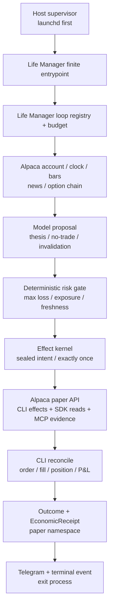
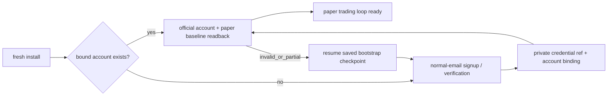

# Life Manager Alpaca Money Maximizer — design and ordered TODO

status: APPROVED STRATEGIC RETREAT / ELIZA RUNTIME RETIRED / R01-R13 DONE / R14 ACTIVE
owner: Dais / Life Manager
deadline: 2026-09-05 00:00 JST
execution SSOT: this file, `Strategic-retreat TODO` section

## 0. Controlling decision — strategic retreat from Eliza

Dais explicitly changes the implementation order and runtime architecture. Life Manager does not ship or run
the Alpaca loop through `life-manager-eliza`. The canonical product, loop source, registry, release, state
contract, and public OSS surface are all `Daisuke134/life-manager`. Earlier A01–A15 Eliza implementation history
below remains donor evidence only; it is not the current runtime plan or an integration dependency.

The new loop is named `alpaca-investment`:

- declaration: `loops/alpaca-investment/loop.toml`;
- owned code and operator documentation: `skills/alpaca-investment/`;
- lifecycle registration: `config/loop-registry.json` plus the existing Life Manager budget registry;
- process entry: existing `runtime/loop/entry_dispatch.py`, extended by one dispatch row only if a direct
  repository-relative entrypoint is insufficient;
- mutable state/receipts: `~/.local/state/life-manager/alpaca-investment/`, outside Git and releases;
- installed label: `ai.anicca.alpaca-investment`;
- cadence: one bounded pass every 300 seconds;
- broker authority: pinned official Alpaca CLI, paper mode only for the hackathon;
- model route: existing Life Manager shared agent runner behind one narrow decision contract. Training a new
  foundation model or importing another agent framework is outside this deadline.

### Exact source tree and resolver chain

`config/loop-registry.json` is the lifecycle inventory SSOT. The integrated Alpaca candidate contains 174 loop
entries; the currently installed immutable release still reports 173 entries with `missing_entrypoints=[]`,
`unmanaged_labels=[]`, and `retired_installed_labels=[]`. Those counts differ because this branch and the
installed release are different SHAs; neither count alone proves that every job is presently producing effects.
Runtime health is read only through `~/loops/current/bin/lm-loop status all`, never through a second inventory.

`runtime/loop/entry_dispatch.py` is the closed resolver for registry rows whose entrypoint needs loop-specific
argv. Its `fixed` mapping currently resolves such families as Lancers, CrowdWorks, affiliate, marketing, gig,
writer, and Symphony. A registry row may also point directly to a repository-relative executable, so the Alpaca
loop only gets a resolver row if its direct entrypoint cannot express the required command. The registry remains
the list; the dispatcher is not allowed to become a second list of cadence, state, budget, or health.

```text
life-manager/
├── config/
│   ├── loop-registry.json              # list SSOT: ID, cadence, label, domain, effect, entrypoint
│   └── ceo-budget-config.json          # Alpaca model/tool spending ceiling
├── loops/
│   └── alpaca-investment/
│       └── loop.toml                  # portable launch declaration; no hand-written plist
├── skills/
│   └── alpaca-investment/
│       ├── SKILL.md                   # operator/agent contract and tool descriptions
│       └── run.py                     # one finite pass, then exit
├── runtime/
│   ├── loop/
│   │   ├── entry_dispatch.py      # optional one-ID → argv resolver row
│   │   ├── runtime_event.py       # reuse terminal event schema; trade effect already exists
│   │   └── lm_loop*.py            # reuse lifecycle/apply/status; do not fork
│   └── agent-runner/agent_runner.py   # existing Codex/model harness, called only for judgment
└── bin/
    ├── lm-loop                         # existing operator interface
    ├── plistgen.py                     # declaration → portable launchd job
    └── cut-loop-release.sh             # main SHA → immutable release

~/.local/state/life-manager/alpaca-investment/       # mutable private runtime data, outside Git
├── lock
├── campaign.json                              # current SPY identity and position lifecycle
├── receipts.jsonl                             # decision/effect/outcome/economic receipts
├── latest-runtime-event.json                  # one terminal result per wake
└── logs/                                      # bounded stdout/stderr; never credentials
```

The planned registry row is one list item:

```json
"alpaca-investment": {
  "cadence": {"start_interval_seconds": 300},
  "domain": "financial",
  "effect_class": "trade",
  "entrypoint": "skills/alpaca-investment/run.py",
  "label": "ai.anicca.alpaca-investment",
  "log_root": "~/.local/state/life-manager/alpaca-investment/logs",
  "provider_route": "shared-agent-runner",
  "state_root": "~/.local/state/life-manager/alpaca-investment"
}
```

This is the target shape, not a claim that the row or files already exist. The implementation reuses the direct
entrypoint first. If the exact production interpreter needs argv construction, the registry entrypoint changes
to `runtime/loop/entry_dispatch.py` and exactly one resolver row points to `run.py`.

```mermaid
flowchart LR
    LD["launchd<br/>wake every 5 minutes"] --> LOOP["Life Manager alpaca-investment<br/>one bounded pass, then exit"]
    LOOP --> OBS["Alpaca CLI<br/>account / market / positions"]
    OBS --> DECIDE["Life Manager decision contract<br/>trade or NO_TRADE"]
    DECIDE --> RISK["deterministic risk gate"]
    RISK --> EFFECT["stable effect ID<br/>CLI paper order"]
    EFFECT --> READBACK["CLI reconciliation<br/>fills / positions / P&L"]
    READBACK --> STATE["private state + receipts"]
    STATE --> TG["Telegram natural-language report<br/>provider messageId"]
```



Launchd owns only cadence and process resurrection. It never owns strategy, portfolio state, broker decisions,
retry semantics, P&L, or Telegram copy. Each pass obtains a lock, reads official state, makes at most one bounded
effect, reconciles before retry, writes one terminal runtime event, reports it, and exits. The next launchd wake
is the recovery mechanism.

### Reuse, learn, then own

Do not fork or depend on Eliza. Copy and adapt only the smallest verified behaviors into Life Manager, retaining
license notices where donor code requires them:

| Existing asset | Life Manager use |
|---|---|
| pinned Alpaca CLI adapter and paper/live rejection | port the command shapes and validation |
| decision-before-effect schema | map into one Life Manager pass receipt |
| deterministic option/portfolio risk gates | port the pure rules, not the framework |
| stable client order IDs and ack-loss reconciliation | port unchanged behavior |
| SPY sealed exit and campaign reconciliation | preserve the existing campaign identity and official readback |
| cross-market candidate/scoring logic | port only after the basic pass runs |
| redacted public projection/dashboard | reuse as submission presentation data |
| natural-language Telegram report | port the fields and require provider `messageId` |

The minimal Life Manager harness is the loop contract already present in this repository: lock → observe →
decide → risk → effect → reconcile → receipt → report → terminal event. General graph orchestration across
friend loops is a later Life Manager capability built from their receipts; it is not a prerequisite for getting
this investment loop running or submitting the hackathon.

## 1. Goal and boundaries

Build one registered `alpaca-investment` loop inside the canonical Life Manager repository. Every launchd wake
runs one bounded, restart-safe pass that observes Alpaca market/account state, lets the existing Life Manager
model route propose or refuse a defined-risk trade, applies deterministic risk/effect gates, executes through
the dedicated hackathon paper account, records official order/fill/P&L receipts, sends Telegram, and exits.

This slice does not promise profit, call paper P&L money, use Dais's live capital, manage another person's
assets, bypass CAPTCHA/KYC/provider consent, or let a model rewrite production and immediately trade. Paper,
live owner-capital, and regulated customer management remain different capabilities and ledgers.

### Acceptance

1. The submission satisfies every event-specific eligibility item: Trading API, CLI or MCP, options in every
   eligible strategy, a new dedicated $100,000 paper account, private account ID, and real paper activity/P&L.
2. One launchd-owned five-minute wake completes `lock → observe → decide → risk → effect → reconcile → receipt →
   report → terminal event`, then exits without a resident Eliza process.
3. Unknown order outcome never causes a blind retry. New risk stops on stale state, reconciliation failure,
   daily loss, drawdown, insufficient option level, undefined max loss, or excessive spread/concentration.
4. Public repository, hosted demo, cover, one-pager, PDF slides, and a video no longer than four minutes are
   submitted before the deadline and independently readable while logged out.
5. The capability uses the existing Life Manager loop registry, release tooling, shared agent runner, runtime
   event schema, secret SSOT, and economic receipts. It creates no second scheduler, product, framework, model
   host, or general ledger.
6. A fresh install owns the complete lifecycle: create or resume the dedicated account through normal email,
   verify and store only secret references, prove a new-session login, then run trading without routine human
   setup. Replaying bootstrap reuses the bound account and creates zero duplicate accounts.
7. Production uses one clean main-derived immutable Life Manager release and one registered launchd label. A
   five-minute interval is not working until consecutive natural launchd wakes persist receipts and return
   Telegram provider `messageId` acknowledgements.
8. Every wake reports the official CLI readback in natural language: decision, equity, cash, account change from
   `$100,000`, realised P&L when officially knowable, unrealised P&L, positions, effects, and observation time.
   Missing delivery acknowledgement makes the wake unsuccessful.

### Development and integration workflow — source-backed project rule

This project adopts a stricter completion gate than GitHub's optional draft-PR workflow because Dais requires
one autonomous implementation owner and no review ceremony. Git defines a linked worktree as a separate working
tree that shares the repository but has its own `HEAD` and index; GitHub states that branch commits do not reach
the default branch until merge, and that a pull request is merged only when changes are ready and repository
requirements are satisfied. Therefore:

1. Before work, verify the repository remote URL, common Git directory, fetched `origin/main` SHA, unique branch
   name, clean status, and dedicated worktree path. Never infer repository identity from the folder name.
2. Keep spec/TODO commits in this Life Manager spec branch. Create one new implementation branch and linked
   worktree from the latest `origin/main` of `Daisuke134/life-manager`; the old `life-manager-eliza` branch is
   read-only donor evidence. Push branches as durable backup; branch push is not a PR and does not change main.
3. Do not create a draft or normal PR while any R01–R14 pre-merge acceptance item is open. Do not merge a
   documentation-only, code-only, test-only, runtime-only, dashboard-only, or asset-only fragment to claim
   progress.
4. Run the worktree candidate against the dedicated Alpaca **paper** account and isolated copied state. Prove
   the complete five-minute wake, official CLI effect/readback, Telegram `messageId`, duplicate prevention,
   dashboard, assets, and submission payload before integration. This is paper validation, not live capital.
5. When every pre-merge acceptance item is PASS, create the one required repository PR in one integration window,
   merge once, cut one immutable main-derived release, and perform the final production readback. If that
   readback fails, make no follow-up main patch; return to the same worktree branches and reopen the failed item.
6. Only after the main-derived readback and official submission state succeed, delete merged branches and use
   `git worktree remove`. Use `git worktree prune` only for administrative entries whose working directories are
   already missing. Never manually delete or move a registered worktree.

The pre-merge gate is the unchecked R-series queue in §6. Historical A-series evidence cannot satisfy a new
R-series runtime box without a Life Manager candidate readback.

Current work ownership is explicit:

- spec/TODO worktree: `/Users/anicca/Projects/lm-t2-spec.OFNS1W`, branch
  `docs/alpaca-first-place-acceptance-20260902`, repository `Daisuke134/life-manager`;
- implementation worktree: `/Users/anicca/Projects/life-manager-main/.worktrees/alpaca-investment-loop-20260902`,
  branch `feat/alpaca-investment-loop-20260902`, repository `Daisuke134/life-manager`, clean base
  `origin/main@a6522c94d42953fd3da98c6a30db8f17c9ba39f6`, locked for R02–R14;
- `/Users/anicca/Projects/.worktrees/life-manager-eliza-alpaca-telegram` and the ordinary
  `/Users/anicca/Projects/life-manager-eliza-migration` checkout are donor evidence only and are not authorized
  implementation or production surfaces.

Primary sources: Git `git-worktree` documentation
<https://git-scm.com/docs/git-worktree>, GitHub Flow
<https://docs.github.com/en/get-started/using-github/github-flow>, and GitHub pull-request merge documentation
<https://docs.github.com/en/pull-requests/how-tos/merge-and-close-pull-requests/merging-a-pull-request>.

## 2. Product and runtime decision

The product and runtime are the canonical Life Manager monorepo and its existing finite-loop contract. There is
no resident Eliza runtime, Eliza plugin registration, Eliza database, Eliza task ID, or Eliza scheduler in the
shipping path. `launchd` invokes one repository-owned bounded pass every 300 seconds on macOS. Linux/systemd and
container restart policies may invoke the same finite entrypoint later; none contains trading logic.



Recovery is deliberately small: the pass writes state atomically outside the release, reconciles uncertain
effects by stable client ID before retry, exits on terminal success/failure, and lets the next host wake resume.
Phones remain Telegram/web clients. Cross-loop graphs, self-modifying strategies, a new model, and a generalized
resident harness are deferred until after the hackathon because the existing Life Manager loop machinery is
sufficient for this user outcome.

### Event contract and Alpaca interface authority

This matrix freezes A01. The current official event page was read through the existing browser session; the
archived 20 August 2026 PDF verification (`SHA-256 7e436430…`) independently corroborates its controlling
requirements. Anonymous crawl/search snippets are incomplete and do not override the live page. A changed
official form or organizer notice remains controlling and must be recorded as a visible conflict before
submission.

| Requirement | Frozen contract | Evidence and conflict handling |
|---|---|---|
| Event window and deadline | Online, 28 August–4 September 2026; submit by **5 September 2026 00:00 JST** | Current official page and schedule both show the exact deadline; archived PDF agrees. |
| Challenge | Build an autonomous AI trading agent using Alpaca Trading API in paper trading | Current official challenge and archived PDF page 2 agree. |
| Agent-facing Alpaca surface | Event minimum is **either** Alpaca CLI or Alpaca MCP server | Current official `CORE REQUIREMENTS` and archived PDF page 2 agree. Life Manager chooses CLI authority plus optional read-only MCP presentation. |
| Options | All strategies incorporate options; underlying-only entry is ineligible | Current official `CORE REQUIREMENTS` and archived PDF page 2 agree. Alpaca official options docs confirm paper options are enabled by default and levels 2/3 support long options/spreads. |
| Judged account | Brand-new Alpaca paper account dedicated to this hackathon, starting at exactly `$100,000`; development accounts may differ | Current official `REQUIRED FOR JUDGING` and `ADDITIONAL REQUIREMENTS`. Alpaca official paper docs confirm global email-only Paper Only signup and the default `$100,000` balance. |
| Required write-up | One page covering AI logic, risk gates, and Alpaca infrastructure implementation | Current official `ADDITIONAL REQUIREMENTS`. This is separate from the slide presentation. |
| Private judge identifier | Submit the dedicated Alpaca paper account ID for activity/P&L verification | Current official `WHAT TO SUBMIT` and archived PDF page 6 agree. Public artifacts expose only a redacted/hash reference. |
| Submission fields | Project title; short and long descriptions; technology/category tags; cover image; video presentation; slide presentation; public GitHub repository; demo platform and application URL; Alpaca account ID | Current official `WHAT TO SUBMIT`. Generic Lablab guidance permits a video up to five minutes; this project keeps the stricter ≤4-minute target. |
| Social extra challenge | Up to five X/LinkedIn post links tagging lablab.ai and Alpaca | Current official extra challenge. These links are optional for main judging but required to compete for the social prize. |
| Judging | P&L Performance; Technology Implementation; Creativity & Originality; Presentation & Execution | Current event-specific official criteria. The generic Lablab rubric does not replace these criteria. P&L never overrides safety or truthfulness. |
| Team and originality | Team size 1–6; entrants 18+ for prize eligibility; submissions must be original and MIT-compliant | Current official guidelines and prize terms. Life Manager remains public MIT-compatible OSS with donor notices. |
| Prize pool | `$6,000` cash plus `$300` Featherless credits displayed as `$6,300` total | Current official prize section: main cash `$2,500 + $1,500 + $1,000`, social cash `2 × $500`, and first-place Featherless credits `$300`. |

### Current go/no-go summary

**NO-GO for submission today.** The finite Life Manager paper pass works from the dedicated implementation
worktree and successful passes deliver a natural-language Telegram report. The declaration cadence is 300
seconds, but the candidate is not installed as the main-derived launchd release, so it is **not yet waking by
itself every five minutes**. The most recent official account readback is equity/cash `$99,996.83`, account
change `-$3.17`, realised campaign P&L `-$3.00`, unrealised P&L `$0.00`, zero positions, and two historical
broker orders. Therefore it is **not currently profitable**.

The deadline is **2026-09-05 00:00 JST**, meaning delivery must be complete during 4 September JST. The
organizer publishes no guaranteed profit threshold or numeric judging weights. Winning cannot be guaranteed;
the controllable acceptance target is: satisfy every eligibility requirement, make all four judging rows below
PASS, submit every required artifact, and read back the official submitted state before the deadline.

The required video does not require Dais's face or voice. The default presentation is a screen recording with
voice-over or captions showing the loop, Telegram, broker reconciliation, and logged-out dashboard. Dais only
needs to record himself if he prefers a personal pitch; the project must still supply the script, shot order,
evidence, and final public video URL.

**Broker authority decision:** the Alpaca CLI is the sole mutation and authoritative reconciliation surface used
by the investment loop. The finite Life Manager entrypoint invokes pinned CLI commands with structured JSON, binds every mutation to a stable
`client_order_id`, and reconciles through CLI account/order/position/activity reads. The official
`@alpacahq/alpaca-trade-api` SDK may serve only the read-only bulk market-data plane; its trading namespace is not
exposed by the Life Manager adapter. This is permitted because the event requires the Trading API plus at least
one of CLI or MCP, not CLI-only implementation. MCP remains an optional read-only judge/explanation surface; it
cannot place, replace, cancel, exercise, or close orders.

## 3. Reuse research — fixed source and decision

The repositories below were cloned into an isolated temporary directory and inspected at the listed commits.
The review covered entrypoints, broker calls, risk, state, reconciliation, scheduler, and demo rather than
README claims alone.

| Source | Fixed commit / observed evidence | Decision |
|---|---|---|
| [Veto](https://github.com/dancaldera/veto) | `4e5e6af95a70e4dd99d96323958ec72ad3538b84`; MIT; isolated `uv run pytest`: 43/43 | Primary donor. Copy/adapt paper-only key rejection, option selection/collar order construction, risk checks, `client_order_id`, reconcile/halt behavior, and read-only demo formatting. Preserve MIT notice. Do not copy its SQLite scheduler, SMA brain, separate MCP server, or product shell. |
| [Reason Before Result](https://github.com/wubian87/reason-before-result) | `095b2ae0afc1432aac786651dac797f8627ee112`; MIT; risk self-check 10/10; ledger/MCP static check PASS | Secondary donor. Copy/adapt the written-decision-before-effect sequence, MCP request/receipt redaction, and all-gates-visible explanation. Preserve MIT notice. Do not copy Chinese UI/product shell or its separate ledger. |
| [Alpaca Risk Agent](https://github.com/Stephen-Kimoi/alpaca-risk-agent) | `0d6f5a5dc5ecfc52d6868f028468df679943510e`; 415 Python LOC; no tests or LICENSE file | Learn only. Adopt the one-shot re-derive-from-broker shape and thin structured CLI invocation. Do not copy code without a license; its stock bracket strategy does not satisfy the event options requirement. |
| [Dis-Pater](https://github.com/MuhammadTahaBinZaeem/Dis-Pater) | `b40188a09fc69c99145dc5aad58f3243996ad70a`; 62,891 Python LOC, 115 tests, no root LICENSE file | Learn only and reject wholesale adoption. Reproduce only the small safety invariants: uncertain POST → reconcile by stable ID before retry, stale quote/account denial, protective exits during halt, and circuit-open on unhealthy reconciliation. |

### Reuse ladder inside Life Manager

1. Reuse the existing Life Manager finite-loop entrypoint, registry, release, runtime-event and state patterns.
2. Port only the verified Eliza financial/economic receipt, stable-effect, reconciliation and Telegram behavior
   that does not require its runtime, database, task service or plugin system; launchd owns cadence only.
3. Adapt only MIT donor code that fills an Alpaca-specific gap and record attribution in
   `THIRD_PARTY_NOTICES.md`.
4. Use the pinned official Alpaca CLI as the sole broker authority rather than writing a custom market protocol;
   optional MCP is read-only and judge-facing.
5. Add no strategy framework, new database, agent team, dashboard framework, or second scheduler.

## 4. Hackathon strategy and winning demo

The agent trades only defined-risk option structures. The first eligible structures are long call, long put,
bull call debit spread, and bear put debit spread, subject to the dedicated account's actual approved option
level. A strategy requiring an unavailable level is unavailable, not silently replaced by a stock-only trade.
No naked short option, unbounded loss, leverage, martingale, or fabricated fill is permitted.

The model interprets market regime, price/volume evidence, news, and option-chain evidence and produces one
proposal or `NO_TRADE`. Deterministic code validates structure and arithmetic. The initial frozen policy is:

- hard maximum loss per trade: 0.5% of current paper equity;
- total open maximum loss: 3%; minimum uncommitted cash: 30%; no borrowed leverage;
- daily realised/unrealised loss halt: 1.5%; portfolio high-water drawdown halt: 4%;
- maximum five positions; maximum ten open orders; five-minute entry cooldown;
- quote age at most 30 seconds, Greeks age at most 60 seconds, spread at most 15%; initial entries use 7–45 DTE;
- asset-aware sessions: options entries/exits remain regular-session only; crypto candidates and `gtc`/`ioc`
  orders remain eligible 24/7; equities/ETFs remain eligible across Alpaca's Sunday–Friday 24/5 window only
  after official asset readback says `overnight_tradable=true` and `overnight_halted=false`. Equity extended-hour
  effects use `limit`, `day` or enabled `gtc`, and `extended_hours=true`; they never reuse the regular-session
  market-order shape. Risk-reducing exits remain allowed whenever the asset/order type is provider-eligible.

Session authority: Alpaca official [24/5 Trading](https://docs.alpaca.markets/us/docs/245-trading-for-trading-api),
[Orders](https://docs.alpaca.markets/us/docs/orders-at-alpaca),
[Assets](https://docs.alpaca.markets/us/reference/get-v2-assets-1), and
[Crypto Spot Trading](https://docs.alpaca.markets/us/docs/crypto-trading).

Parameters freeze before the first judged trade. Historical replay chooses the initial strategy; competition
P&L does not trigger mid-event curve fitting. Paper deposit, reset, or self-transfer is never income.

The four-minute demo shows: Life Manager goal, new paper account and option level, CLI observation, model thesis,
one rejected proposal, one permitted defined-risk proposal, Alpaca CLI order receipt, reconcile/fill/P&L,
Telegram/panel evidence, the optional read-only MCP explanation view, and the same-core OSS path. The broad SELL/WORK/CAPITAL story is the opening/closing
differentiator; the middle of the demo is real Alpaca execution.

## 5. No-routine-human bootstrap

Use normal email signup through the existing owned browser and mailbox session; do not require Google login.
The bootstrap may read a provider email code and continue, store credentials only in the private credential
SSOT, and prove a new-session login. It must stop rather than bypass CAPTCHA, mandatory identity/KYC, legal
consent, or a provider request for the account owner. Such a provider-enforced handoff is reported as a named
blocked capability and is not hidden behind a claim of full autonomy.

Account bootstrap is a resumable one-time state machine inside the same Financial/Alpaca capability, not a
manual prerequisite and not part of every market wake:



## 6. Strategic-retreat TODO — fixed execution order

Current cursor: **R14**. R01–R13 are complete. Only the first unchecked atom is active. Dais explicitly
reorders the remaining queue to finish the reusable paper product before creating presentation assets. No atom
uses TDD ceremony, a review agent, a subagent, or an Eliza runtime. Product integration happens only after R12
passes; presentation work cannot be used as evidence that the product works.

Soft implementation target: one existing loop declaration, one owned finite entrypoint, two existing registry
rows, and at most one existing dispatcher edit; no new framework, service, database, scheduler, dependency, or
directory tree. If the owned production logic would exceed about 150 new lines or six changed files, first
reuse an existing Life Manager helper or cut scope back to the acceptance path.

| Seq | Atom | Done condition |
|---:|---|---|
| R01 | Freeze the retreat and migration map — **DONE** | This spec names every reusable Eliza asset, its Life Manager destination, every rejected dependency, the runtime boundary, non-goals, and this immutable order. |
| R02 | Create the Life Manager implementation worktree — **DONE** | Created clean locked worktree `/Users/anicca/Projects/life-manager-main/.worktrees/alpaca-investment-loop-20260902` on new branch `feat/alpaca-investment-loop-20260902`, tracking fetched `origin/main@a6522c94d42953fd3da98c6a30db8f17c9ba39f6`. Common Git dir is `/Users/anicca/Projects/life-manager-main/.git`; remote is `https://github.com/Daisuke134/life-manager.git`. The dirty ordinary checkout and both Eliza checkouts remain untouched. |
| R03 | Register the minimal loop — **DONE** | Implementation commit `22b74dee9` adds `loops/alpaca-investment/loop.toml`, `skills/alpaca-investment/{SKILL.md,run.py}`, one registry row and one budget row. Direct schema readback reports 174 registry entries, matching label/entrypoint, cadence 300 seconds and a registered budget. The executable finite stub exits 78 with `broker_observation_not_implemented` and zero effect, deliberately failing closed until R04. No plist, resolver row, second scheduler, PR, main merge, release or launchd mutation exists. |
| R04 | Port official observation — **DONE** | Implementation commit `cbbf898a0` adds the pinned paper-only CLI observation boundary and finite entrypoint readback. A real isolated-state pass exited 0 with effect none: CLI `0.0.14`, paper ACTIVE, cash `$99,970.88`, equity `$99,997.88`, last equity `$99,998.88`, options level 3, regular session closed, two positions, one historical order, nine activities, current SPY trade and 100 option contracts. The redacted observation file was mode `0600`; no account ID or credential was emitted. Exact paper endpoint and private-file ownership/modes are required before CLI execution. |
| R05 | Port receipt and recovery invariants — **DONE** | Implementation commit `8275bb0bd` adds an append-only mode-`0600` receipt ledger, canonical decision/effect hashing, stable `lm-ai-*` client IDs, planned/started/blocked/applied transitions and CLI client-ID lookup. Repeating the same decision/order produced one stable identity and one planned receipt. A missing acknowledgement opened the breaker; the next wake performed another read-only reconciliation rather than submit; a later broker result produced one outcome. Direct official CLI lookup of the sealed absent ID returned absent, submitted zero orders, and the account order count remained one. |
| R06 | Port the existing paper campaign — **DONE** | Implementation commit `30d53c74e` owns the original `a08-canary-2` / `alpaca-option-spread://SPY/2026-09-08/769C-770C` campaign in Life Manager and reconciles the exact `SPY260908C00769000`/`SPY260908C00770000` legs from official CLI fills and positions. Isolated real readback found two fills, two matching positions, entry cash flow `-$29.00`, unrealised P&L `-$2.00`, exit credit `$0.23`, one unchanged historical order and no unexplained instrument. The market was closed, so the exact exit rule returned `HOLD_CLOSED_SESSION` and submitted zero orders. Campaign and observation state were mode `0600`; final close remains R11. |
| R07 | Enable the investment allocator — **DONE** | Implementation commit `d45db576f` ranks SPY defined-risk call spreads during the regular session, BTC/USD and ETH/USD 24/7, and QQQ only after official asset fields explicitly permit overnight trading. The existing `diagnostic-agent` runner selects exactly one offered reference or `NO_TRADE`; deterministic code independently checks identity, quote age/spread, expected value, defined maximum loss, aggregate risk, cash reserve, drawdown, position/order caps, session and order shape. A real isolated-state pass offered the two live crypto candidates; QQQ was excluded because its official overnight fields were null and options were excluded because the regular market was closed. The agent selected `NO_TRADE` because the snapshot contained no directional edge, produced one append-only no-trade receipt, exited 0, and left the official paper order count unchanged at one. At most one sealed paper order can pass per finite invocation through pinned CLI; crypto and inherited Alpaca `mleg` shapes are the only executable forms. |
| R08 | Add owner-readable reporting — **DONE** | Implementation commit `2b05fbf1a` renders one Japanese natural-language report per wake from the official observation, campaign reconciliation and sealed decision. It contains decision, equity, cash, change from `$100,000`, realised P&L when official, unrealised P&L, position count, effect and observation time. The existing direct Bot API client and durable outbox prevent an ambiguous timeout from being resent. A real isolated-state pass exited 0 only after Telegram returned `messageId=48618`; the outbox recorded `delivered`, one attempt and the same ID, and both DB and receipt were mode `0600`. Replaying the exact wake returned the stored ID without a second attempt; an injected provider response without an ID became `delivery_uncertain` and failed. |
| R09 | Prove the finite candidate — **DONE** | From the implementation worktree, the R08 state was copied into a new mode-`0700` directory and resumed by two separate real processes. Both finite passes terminated with exit 0, `paper=true`, `NO_TRADE`, `effect=none`, unchanged official order count `1`, and new Telegram acknowledgements `48622` and `48623`, each with exactly one send attempt. Supplying external `ALPACA_LIVE_TRADE=true` still produced effective boundary value `false`; the credential endpoint remained the exact paper URL. The copied and resumed ledger held three distinct terminal decision receipts, zero effect intents and zero outcomes because no order was proposed. Receipt and outbox remained mode `0600`; official order count was one before and after. No fake, dry-run or mock broker result was used. |
| R10 | Prove host cadence safely — **DONE (PRE-INTEGRATION)** | Commit `434984915` removes the false rule that any Codex environment must reject launchd, while strengthening the actual 141 boundary. Preflight now resolves UID, username, Directory Services, Aqua manager, manager UID and manager PID before it issues any `gui/$UID` probe; a failed owner prerequisite stops before the GUI command. `launchctl-safe` requires that preflight for GUI reads, list and every mutation, with raw bypass still forbidden. Current non-GUI readback is `anicca / 501 / Directory Services 501 / Aqua / manager UID 501 / manager PID 1`. An isolated failed-manager fixture issued zero GUI probes; 45 existing launchd apply/lifecycle/preflight tests plus six subtests pass. Registry readback fixes the single candidate label `ai.anicca.alpaca-investment`, interval 300 seconds and immutable `lm-loop-run` argv. Per the established workflow and Apple domain contract ([Apple launchctl(1)](https://github.com/apple-oss-distributions/launchd/blob/main/man/launchctl.1)), actual installation cannot precede the main-derived immutable release; R15 owns targeted apply and two consecutive natural five-minute wake/messageId readbacks. |
| R11 | Close and score the campaign — **DONE** | Commit `c2c034dd8` ports the exact donor close shape: only during the official regular session and with a positive executable credit, seal one stable paper effect and submit one Alpaca `mleg` limit order with `sell_to_close` / `buy_to_close`; the campaign exit consumes the pass's single-effect allowance. A real eligible pass at `09:40 ET` submitted stable client ID `lm-ai-a64f6e61e92c9048ea930319`, reconciled broker status `filled` at `$0.26` credit, reduced the two SPY legs to zero positions, and sent Telegram `48661`. Entry debit `$29.00` and exit credit `$26.00` produce truthful realised campaign P&L `-$3.00`; equity/cash are `$99,996.83`, total change from `$100,000` is `-$3.17`, unrealised P&L is `$0.00`, and broker order count is two. |
| R12 | Finish the reusable paper investment-loop product — **DONE** | The Life Manager candidate—not a separate repository—runs one finite registered `alpaca-investment` pass through official observation, cross-market candidates, model proposal/decline, deterministic gates, at-most-one CLI-only paper effect, stable-client-ID reconciliation, mode-`0600` receipts/state, and acknowledged Telegram delivery. The eligible pass closed the inherited campaign and sent `messageId=48661`; the immediate independent replay returned `NO_TRADE`, effect `none`, positions zero, unchanged broker order count two, and `messageId=48664`. `ALPACA_LIVE_TRADE` remains forced false and no secret or profit guarantee is exposed. |
| R13 | Integrate and publish the usable OSS loop — **DONE** | On the exact R12 PASS candidate, record scoped diff and rollback, create one PR, merge once, and publish the minimum user-facing loop catalog/install/status information needed for another person to discover and run `alpaca-investment` on an Alpaca paper account. It remains one loop inside Life Manager, not a separate repository. The immutable release cut and host cadence proof are R14. |
| R14 | Prove the released product runs continuously — **ACTIVE** | Cut one immutable main-derived Life Manager release, then through the staged safe lifecycle apply exactly the single Alpaca label and observe at least two consecutive natural five-minute wakes with receipts, official broker reconciliation, and Telegram `messageId`s. Confirm restart/state continuity, duplicate replay adds zero orders, other loops remain unaffected, and the public/logged-out redacted projection reads the same state. Only actual market opportunity may produce profit; `NO_TRADE` is valid operation but does not satisfy positive-P&L ambition. |
| R15 | Build presentation assets and submit | Only after R14 product evidence exists, update the full README and one-page write-up, then create PDF slides, 16:9 cover, and a ≤4-minute screen-recorded pitch from the same facts. Fill every official field, verify public repository/demo/video/slides logged out, include the private account ID only in the form, submit before the deadline, read back submitted state, and remove the merged worktree. |

R13 is **DONE** at PR [#4048](https://github.com/Daisuke134/life-manager/pull/4048), merged as
`421509afb5f107e63a9ac8e5480d414aa4520a88`. Candidate
`58cfbaa3c` includes the tenth user-facing README catalog row, paper-only setup/run/status guidance, the latest
`origin/main`, and the portable Telegram path that reads only the Life Manager private environment. Real
post-change pass `48674` remained `NO_TRADE`, positions zero and broker orders two. Registry tests are 15/15;
the PR's Loop control contracts, Python syntax/unittest, startup-context and shell checks pass. The three
repo-wide OSS/PII/gitleaks checks were red for pre-existing files outside this loop; the admin merge recorded
those exact blockers without changing sibling sources.

The ordinary local checkout `/Users/anicca/Projects/life-manager-main` was read directly before integration and
was on an unrelated dirty feature branch at `8b3dacde7`; after the admin merge, remote `origin/main` contains
`421509afb`. The local ordinary checkout remains untouched because it has unrelated dirty files. Before the
merge it had no Alpaca source; the main commit now contains it. Production `~/loops/current` still points to a
different release before the R14 release cut; no installed five-minute wake is claimed yet. The release-cut lock
is now free, so the next executable atom is the single main-derived release cut.

### Explicit non-goals before submission

- no Eliza dependency, fork, runtime, plugin, task database, scheduler or production checkout;
- no new foundation model, training pipeline, multi-agent graph, general loop orchestrator or second ledger;
- no live-funded trading, customer asset management, invented profit target or claim that paper P&L is revenue;
- no manual plist authoring, no Remote `launchctl ... gui/$UID`, and no repetition or workaround if error 141 is
  ever observed;
- no PR, main merge, production promotion or cleanup while any R01–R14 box is open.

## Appendix A. Historical Eliza execution evidence — superseded, read-only

The old order below is no longer executable. It is retained only so verified broker and campaign evidence is not
lost. Dais changed it after the first paper canary proved
durability: the open SPY exit remains owned by the same background Eliza task, but a closed options session no
longer blocks multi-market research, the bounded portfolio allocator, or submission artifacts. No second
scheduler or broker mutation path is introduced. Each atom ends with the named official readback; tests support
the atom and do not create a separate completeness program.

Historical cursor was **A11 Multi-market paper allocator**, while the original SPY exit remained active background
reconciliation inside the same task. A01 is DONE with the event contract matrix above. The prerequisite startup-context drift repair is DONE: public
`/lm` metadata is bound to context `2026-09-01.1` / digest `f61cbb3c…` through anicca-products PR #402,
production deploy run `33500496615` and its money-path smoke passed, and the Life Manager live audit reads
product/repository/Telegram as 3/3 GREEN. This prerequisite does not consume or reorder an Alpaca atom.

A02 is **DONE**. The normal-email Lablab account remains `Approved` for the event, and Dais completed Discord's
required human-presence checks. The connected Discord identity initially differed from the identity that had
joined the LABLAB.AI community; changing the official Lablab OAuth connection to the joined identity removed
the provider's `DISCORD_COMMUNITY_JOIN_REQUIRED` response. Lablab then returned HTTP `201` with a team slug and
created the one-member, closed, UTC +9:00 team `Life Manager`. Official readback:
`https://lablab.ai/ai-hackathons/alpaca-ai-trading-agents-hackathon/life-manager`.

The submission draft also exists and is saved at Step 2 of 3 with title `Life Manager: Autonomous Options Money
Loop`, truthful short/long descriptions, categories Finance/Investment/Personal Finance, and technology Alpaca.
The official editor exposes cover image, required video and PDF slides, public repository, demo platform/URL,
private Alpaca account ID, and up to five social links. It reads `Last saved`; final submission has not occurred.
Google login was not used, no secret or Discord/account identifier was written to the repository, and later atoms
must replace provisional copy only with verified campaign facts.

A03 is **DONE**. A brand-new Alpaca Trading API identity was created through the normal-email form and verified
through the existing authenticated mail reader. Authenticator MFA and its recovery code are active; password,
TOTP secret, recovery code, and paper account ID exist only in the mode-`0600` private credential SSOT. A fresh
cookie-free login required both password and a newly generated TOTP code and returned the same private paper
account. The official paper dashboard reads equity `$100,000.00`, cash `$100,000.00`, no open positions, no
orders, and no activities. Official configuration reads options `Level 3`, including defined-risk spreads and
multi-leg strategies. The provider offered a separate live Individual/Business account application; it was not
started, and no KYC, funding, live-capital, or live-trading state was created.

The active Eliza implementation branch `feat/alpaca-a03-autonomous-bootstrap-20260901` now exposes
`ALPACA_BOOTSTRAP` from the sole `plugin-life-manager`. It stores one redacted, non-scheduled checkpoint Task
row; an empty checkpoint discovers six bound private refs from the mode-`0600` credential SSOT and runs only
the pinned CLI. A production readback through that operation returned `READY` twice with one Task row,
`scheduled=false`, paper ACTIVE, cash/equity `100000`, options Level 3, and zero positions/orders/activities.
The second pass created no Task or account duplicate. A fresh-install fixture now atomically seeds only the
owner's normal email, an internally generated password, and the paper endpoint into the private SSOT, preserves
mode `0600`, and checkpoints three bound refs without returning the password to the model. BrowserService actions
now fill those values without model exposure, use the authenticated read-only mailbox CLI to allowlist and open
only the Alpaca verification URL, capture TOTP/recovery/API/account material directly into the private SSOT, and
generate/fill the current TOTP code without returning either the secret or code. Commit `69a3fa4e58` passed Biome
and package typecheck; a production-function runtime fixture preserved mode `0600`, filled exactly six digits,
and exposed neither value. Commit `4b0bb86350` extends the same checkpoint to deterministic
`CREATE_PAPER_ACCOUNT → VERIFY_EMAIL → CONFIGURE_MFA → BIND_API_KEYS → RUN_TRADING_LOOP` resumption. Its runtime
fixture produced exactly one create step, required eight private refs including recovery code and account ID,
then reached paper `READY` with cash/equity `100000`; Bun compiled every changed production entrypoint. The real
existing account path remained `READY` and left the SSOT hash unchanged. Commit `9c7dba5473` registers
`plugin-life-manager` once in the normal macOS/Linux/Docker core collector while keeping it out of the CLI-less
mobile boot. Commit `8dd1114f3e` routes every Alpaca Action into the `finance/automation` owner context and returns
the concrete BrowserService/private-action chain to the native planner; its handler fixture persisted one Task,
selected normal email rather than Google login, and exposed no secret. A real isolated Eliza runtime then loaded
`plugin-life-manager`, accepted one authenticated owner goal, selected and successfully executed
`ALPACA_BOOTSTRAP`, and persisted exactly one checkpoint Task at `READY / RUN_TRADING_LOOP`. Its redacted action
trajectory and Task readback reported eight bound credential refs, paper `ACTIVE`, cash/equity `100000`, options
Level 3, and zero positions/orders/activities. After a full runtime stop and restart against the same state, a
second owner goal executed the same action, kept the Task count at one, and returned the same facts; immediate
official CLI readback still returned zero positions/orders/activities. No account, order, or trade was created by
either pass. The closing implementation on branch `feat/alpaca-a03-autonomous-bootstrap-20260901` adds the
existing CloakBrowser CDP session as a local BrowserService target and a deterministic, authenticated Life
Manager bootstrap dispatch. Life Manager used Alpaca's official account switcher, created exactly one additional
paper account named `Life Manager`, and left the original baseline account intact. The provider returned HTTP
`200` for `POST /api/v1/paper_accounts`; switcher readback showed two paper accounts and exactly one `Life
Manager` account. Life Manager selected the new account, generated its API keys, and captured the key, secret,
and account number directly into the mode-`0600` private credential SSOT without returning their values to the
model or logs. Pinned CLI v0.0.14 then returned `READY / RUN_TRADING_LOOP`, paper `ACTIVE`, cash/equity `100000`,
options Level 3, and zero positions/orders/activities. After a full runtime restart, the same checkpoint returned
the same READY facts; the provider still showed two paper accounts and one `Life Manager` account, proving zero
duplicate creation. No live account, live capital, order, position, or trade was created. Closing commits through
`a8e00e3f3e` passed BrowserService `22/22`, bootstrap/private-capture `2/2`, and focused import/diff checks.

A04 is **DONE** against the official `alpacahq/cli` release `v0.0.14`, source commit
`53606273aa230a40c64b783425dcb3f4423ede30`. Its published release checksum was verified before installing the
native macOS arm64 binary. `alpaca version` returns `0.0.14`; `alpaca doctor` reports no saved profile, env-only
credentials, active profile `paper`, connected `paper-api.alpaca.markets` trading and data APIs, and all checks
passed. CLI JSON reads return the same private account with status ACTIVE, cash/equity `100000`, options level
3, a valid market clock, a current SPY trade, ten SPY option-chain snapshots, and three SPY news items. CLI
position/order/activity lists each return zero. Paper keys exist only in the private credential SSOT and are
injected into the process environment; `ALPACA_LIVE_TRADE=false`, no CLI profile or repo secret exists, and no
mutation command ran. The closing readback against the Life Manager-created A03 account returned the same
paper ACTIVE cash/equity `100000`, options Level 3, current market clock and SPY trade, ten option-chain
snapshots, three news items, and zero positions/orders/activities. No CLI profile was created.

A05 is **DONE** in `life-manager-eliza` merge `270d80f99850c4274a7fb70f2625f55a7bfb3c79` (PR #47).
`plugin-life-manager` now reuses the existing private credential reader and bounded `execFile` boundary to expose
typed paper account, latest-trade, and option-chain observations plus one CLI-only defined-risk `mleg` order
method. Every invocation pins CLI v0.0.14 and injects `ALPACA_LIVE_TRADE=false`; a non-paper request is rejected
before credential resolution or process execution. Real readback returned paper ACTIVE, cash/equity `100000`, a
current SPY trade, and 100 option snapshots. The pinned CLI's own `order submit --dry-run` produced a two-leg
`mleg` limit/day request with a stable client order ID, and an injected execution-boundary check produced a typed
paper receipt. No REST/SDK mutation path exists and no order was submitted; the first broker effect remains A08.

A06 is **DONE** in `life-manager-eliza` merge `f3e11707e60a22d5b2721ad11060fdf5531f7700` (PR #48).
One bounded `ACTION_PLANNER` call returns either `NO_TRADE` or a strict options decision containing thesis,
structure, maximum loss, invalidation, exit plan, and only offered evidence references. A tenant-scoped,
work-item-unique `decision_receipts` row stores that payload separately from model-attempt metadata. The same
work item replays the durable receipt without another model call. Its persistence transaction checks that no
effect intent already exists and fails closed if effect ordering has been violated. Plugin strict typecheck and
four focused suites passed (`7/7` tests), including first call=1, replay call=0, and effect-before-decision
rejection. No broker order or other external effect ran in A06.

A07 is **DONE** in `life-manager-eliza` merge `b7a39fc8eaf58ea838f36820e05ec3edb0f9b9b5` (PR #49).
One pure gate checks the model decision against deterministic max-loss arithmetic and the frozen paper policy:
0.5% per trade, 3% total open risk, 30% cash reserve, 1.5% daily-loss halt, 4% high-water drawdown halt,
five positions, ten orders, five-minute cooldown, 30-second quotes, 60-second Greeks, 15% spread, option
level, no leverage, regular-session entry, and healthy reconciliation. The initial 7–45 DTE range excludes
0DTE and same-week expiration risk; [FINRA](https://www.finra.org/investors/insights/zeroing-in-options-trading-strategy)
warns that buying and selling 0DTE options can be risky, while
[OCC](https://www.optionseducation.org/referencelibrary/faq/weekly-options) documents weekly expiry/exercise
behavior. Unknown structures and malformed runtime values fail closed. Plugin
strict typecheck and four focused suites passed (`5/5` tests); a $400 maximum-loss spread on $100,000 equity
passed, while the combined halt fixture returned every applicable reason. No broker effect ran in A07.

A08 is **DONE** in `life-manager-eliza` merges through PR #58. The owner-authenticated Life Manager Eliza
runtime observed the dedicated paper account and fresh SPY option snapshots through pinned Alpaca CLI v0.0.14,
persisted a model decision, and rejected its first 751P/750P proposal with deterministic `SPREAD_LIMIT` and zero
broker effect. On a second immutable run it selected one 769C/770C bull-call debit spread, calculated and agreed
maximum loss `$33`, passed A07 with no reasons, sealed a stable `lm-a08-*` client ID, acquired the durable DB
effect lease, and submitted through the CLI-only paper adapter. Official Alpaca readback returned one filled
order, quantity one, and the same provider order/client IDs. Replaying the identical run returned
`effect_started=false`, `replayed=true`, `outcome=noop`; an official all-orders query found exactly one matching
client ID. Immediate paper readback was equity `$99,996.95`, cash `$99,970.95`, two option legs, and unrealized
P&L `-$3`; A08 therefore proves execution and idempotency, not profit. No live credential or capital was used.

A09 is **DONE** in `life-manager-eliza` merge `c5f20b77eadecbd975e12a2c9b092796cf533cfb`
(PR #59). With the isolated runtime stopped, the existing applied intent was changed to an expired `running`
lease and its outcome receipt was removed to simulate a lost acknowledgement. The merged runtime then restarted
against the same DB and the same owner request. Life Manager performed one pinned-CLI lookup by the sealed
client ID, consumed that official readback without a second inspect or submission, returned
`effect_started=false`, `replayed=true`, `outcome=noop`, restored the missing receipt, and converged the intent
to `applied` with no lease. Official Alpaca CLI readback still found exactly one matching order, provider order
ID `c143b7aa-52d5-47f8-9e59-fae7ded50a0d`; no duplicate order was created. A separate copied-DB fault injection
made the sealed broker order absent after effect start: the route returned HTTP `409`, persisted
`reconciliation_blocked`, cleared the lease, and the official matching-order count remained one. Strict plugin
typecheck and four focused suites passed (`6/6` tests). Closing paper readback was equity `$99,997.95` and cash
`$99,970.95`; A09 proves recovery and fail-closed behavior, not material profit.

A10 is **DONE** in `life-manager-eliza` merges `126f042f4181b80866ad696981a70ef22c49f2c1`,
`3a0377164c0a005b888a44a344f3ee05312cb4cb`, and `ed39404f44f865cd35bd54227094940f1b4c363d`
(PRs #60–#62). `plugin-life-manager` registers one seed-once five-minute interval task and one contributed
Financial dispatch channel through the existing `plugin-scheduling` spine; no timer, scheduler DB, host cadence,
or broker mutation path was added. The deferred-plugin boot hook seeded exactly one task. Official scheduled-task
readback showed one matching idempotency key, then the existing Eliza runner naturally fired the same task ID and
recorded `ok=true`, channel `life_manager_alpaca_paper_loop`, and Financial status `ORDER_VERIFIED`. The pass
reconciled the A08 order through pinned Alpaca CLI and submitted no new order. After a full runtime stop/restart,
readback preserved the same task ID, trigger, fire time, and result with matching task count one. Official Alpaca
CLI still found exactly one matching client ID/provider order; paper equity was `$99,997.95` and cash
`$99,970.95`. Strict plugin typecheck and five focused suites passed (`8/8` tests). Host adapters contain no
Alpaca timing or trade decision.

A11 is **ACTIVE**. `life-manager-eliza` merge `512ef713a5fac6dae002d62e566649e09924716a`
(PR #63) adds a pinned-CLI campaign snapshot and an immutable reconciliation receipt without adding another
broker or scheduler path. The official account returned exactly two entry fills and the two expected SPY option
positions; fill-derived quantities matched the long `769C` and short `770C` legs with zero unexplained delta.
Life Manager recorded the open campaign with entry debit `$29`, two fills, two positions, and unrealised P&L
`-$2`; unrealised P&L was not recorded as revenue. A real branch-root Eliza runtime loaded the Life Manager
plugin, action, and service, then fired the existing task ID through channel
`life_manager_alpaca_paper_loop` with `ORDER_VERIFIED` and no pending dispatch. Official Alpaca CLI still found
exactly one matching client order/provider order, paper equity `$99,997.95`, and cash `$99,970.95`. The position
has not exited, so realised P&L is not yet available and A11 remains ACTIVE.

Follow-up `life-manager-eliza` merge `ad5f1fdbf7f12ced5ed24c53841bce4d5bb50496` (PR #64) seals the
risk-reducing exit through the same effect kernel and stable client-ID derivation. It uses Alpaca's documented
mleg sign convention (negative limit price means credit), records exact position/fill details, and creates a
paper-only realised gain/loss receipt only after official positions reach zero. The existing five-minute task
now evaluates this exit on every pass. Its real after-hours fire returned `ORDER_VERIFIED` plus
`HOLD_CLOSED_SESSION`, with pending dispatch empty and no close order submitted; the next regular-session fire
owns the exactly-once close and subsequent realised-P&L reconciliation.

Follow-up merges `45e33086bf0463323d3c28b1509854af2f5226ed` and
`772189de2f4229fe6c47c6d926037cae8c61cefb` (PRs #65–#66) persist immutable
`broker.paper.no_effect` receipts for future `NO_TRADE`/`RISK_REJECTED` decisions and make entry selection
explicit from its sealed `*_to_open` legs, so a later exit intent cannot be mistaken for the entry. The earlier
rejected `751P/750P` proposal now has one historical `RISK_REJECTED / SPREAD_LIMIT / effectStarted=false`
receipt and no broker order. After restart on the same database, the existing five-minute task retained the same
ID and returned `ORDER_VERIFIED / HOLD_CLOSED_SESSION`. Pinned-CLI readback still showed one filled entry,
two fills, two positions, zero open orders, cash `$99,970.95`, equity `$99,997.95`, and unrealised P&L `-$2`.
No close order exists while the regular session is closed; A11 remains ACTIVE until the loop records an official
close fill, zero positions, and the realised paper P&L receipt.

Current paper-money scoreboard (pinned-CLI readback): starting equity `$100,000`; current equity `$99,997.95`;
realised P&L `$0`; open-position unrealised P&L `-$2`; realised profit made `$0`. Therefore the Alpaca loop has
placed and filled its first paper trade but is **not making money yet**. Paper equity, unrealised P&L, and any
future realised paper gain remain simulation evidence and must never be reported as revenue or live earnings.

The A11 natural-recurrence sub-atom is **DONE**. Without a REST fire or second scheduler, the live Eliza
TaskService refired the same interval task ID from `20:59:39Z` to `21:16:13Z`; the contributed Financial channel
again returned `ORDER_VERIFIED / HOLD_CLOSED_SESSION`. The persisted trigger remains five minutes, although this
observed process fire was late and is not represented as an exact-cadence guarantee. Immediate pinned-CLI
readback retained the same filled provider order ID, two fills, two positions, zero open orders, cash
`$99,970.95`, equity `$99,997.95`, and unrealised P&L `-$2`. Natural recurrence therefore added zero broker
orders. The next A11 sub-atom remains the regular-session sealed exit and realised-P&L reconciliation.

Restart durability was re-read from the same live runtime and PGlite state rather than inferred from a PID. After
process resurrection, the authenticated Eliza API retained task `st_mtj43gm5_goclnvsx`, its five-minute trigger,
and advanced `firedAt` again to `21:27:38Z` with `ORDER_VERIFIED / HOLD_CLOSED_SESSION`. A fresh pinned-CLI
v0.0.14 readback at `21:30:37Z` still showed exactly one filled campaign order, the same two entry fills and two
positions, zero open orders, cash `$99,970.95`, equity `$99,997.95`, and unrealised P&L `-$2`. Thus restart plus
subsequent natural replay preserved the durable task and added zero broker orders. The market clock remained
closed with the next regular session at `2026-09-02T09:30:00-04:00`; no after-hours exit was attempted.

Here `HOLD_CLOSED_SESSION` is narrowly an **options-exit** hold, not an Alpaca-wide market outage. The open
campaign owns US-listed SPY option legs, and Alpaca says options orders may only be placed during regular market
hours. Alpaca separately documents crypto trading 24 hours every day and 24/5 overnight trading for NMS
securities. Those asset classes do not make the current option legs closeable. Dais subsequently authorized the
same Financial loop to continue across other asset classes while that exit remains monitored; aggregate
exposure, open orders and campaign state must be included in every allocator decision. Sources:
<https://docs.alpaca.markets/us/docs/spacex-trading-availability-and-faqs>,
<https://docs.alpaca.markets/us/docs/crypto-trading>, and <https://docs.alpaca.markets/us/docs/245-trading>.

There is no supported parameter that makes the two open option legs executable after hours. Alpaca's options
validation requires `extended_hours=false` or omission; `day`/`gtc` describe lifetime, not an extended-hours
execution venue. The current resolution is therefore one regular-session, two-leg `SELL_TO_CLOSE` /
`BUY_TO_CLOSE` limit order through the existing sealed CLI effect, followed by official fills, zero positions,
realised paper P&L, and replay-zero readback. The permanent non-blocking design after this frozen campaign closes
is an asset-class-aware opportunity router inside the **same** Eliza task/effect kernel/CLI authority: crypto may
run 24/7, eligible NMS equities/ETFs may run 24/5, and options entries/exits run only in their regular session.
An option-session hold must never pause observations for another asset class. Any new bounded paper effect must
still pass the one portfolio-level risk gate, use the existing CLI effect kernel, and reconcile before another
effect begins. Order validation source:
<https://docs.alpaca.markets/us/docs/options-trading>.

The A11 non-blocking data-plane sub-atom is **DONE** in `life-manager-eliza` merge
`1f18fcbe7c5a0b2a1b58a13819c4b8b1452b7499` (PR #67). The plugin pins the current official
`@alpacahq/alpaca-trade-api` `4.0.1` SDK behind a read-only adapter that exposes only bulk option-chain and crypto
snapshot reads. It does not return the SDK client or trading namespace, while the existing CLI remains the only
order/effect and account/order/fill reconciliation path. Typecheck and plugin build passed. A real authenticated
paper-data read returned 305 SPY call contracts plus BTC/USD and ETH/USD snapshots, including a current BTC
trade, with zero broker mutation. The superseded `alpacahq/typescript-sdk` was rejected because its own official
README says it is no longer maintained and points to `alpaca-trade-api-js`. This removes closed-session research
blocking without authorising a second campaign before the open SPY spread closes.

The A11 no-effect ranking sub-atom is **DONE** in `life-manager-eliza` merge
`b4dc698ef66e46f9d6e82e82e1a279539d739f6d` (PR #70). The same registered task first
reconciled the existing order and evaluated its sealed exit, then used the read-only SDK adapter to construct
12 quoted SPY vertical-spread candidates while reading BTC/USD and ETH/USD only as market context. One bounded
model decision returned `NO_TRADE`; Life Manager persisted the thesis, invalidation, exit plan, evidence refs,
and all ranked candidates as `RESEARCH_ONLY / effectStarted=false`. The dispatcher result was
`ORDER_VERIFIED / HOLD_CLOSED_SESSION / NO_TRADE`. Immediate pinned-CLI readback remained two positions, two
fills, zero open orders, cash `$99,970.95`, equity `$99,997.95`, and unrealised P&L `-$2`, proving that research
added zero broker effects. During E2E recovery, the existing task's stale notification escalation was closed,
reopened, and refired under the same task ID so its Financial channel—not `push/in_app`—owned the successful
pass. Typecheck, build, and three focused suites passed (`4/4` tests).

The A11 dispatcher self-heal sub-atom is **DONE** in `life-manager-eliza` merge
`097111f3b1f379282e6dfd0244756faf32742c24` (PR #73). A real restart exposed two persisted-host failures:
the deferred Life Manager plugin could register after the five-minute task had already recorded
`disconnected`, and the task's legacy `bg-light-30s` execution profile caused the host-capability gate to
substitute `in_app` before the contributed Financial dispatcher. The same Eliza boot hook now removes only
that stale Alpaca dispatch state, clears the legacy profile, and lets the existing runner refire when the
interval is naturally due. At `23:43:46Z` the same task ID fired without a REST/manual trigger and persisted
`ok=true`, channel `life_manager_alpaca_paper_loop`, and
`ORDER_VERIFIED / HOLD_CLOSED_SESSION / NO_TRADE`; pending dispatch was absent. Pinned-CLI readback remained
paper `ACTIVE`, cash `$99,970.95`, equity `$99,997.95`, two positions, two entry fills, and unrealised P&L
`-$2`. No close fill exists, so realised campaign P&L remains `$0`. Typecheck, build, three focused suites
(`4/4` tests), and `git diff --check` passed. The next natural recurrence at `23:49:16Z` returned the same
three Financial statuses with pending dispatch absent; immediate CLI readback still showed two positions and
two fills with identical cash/equity, proving this closed-session replay added zero broker effects. The final
post-close replay-zero gate remains pending.

The A11 multi-market allocator contract sub-atom is **DONE** in `life-manager-eliza` merge
`3df280e9d6d97e882986ee84e512973dcef1a241` (PR #75). The same natural task read 12 SPY defined-risk option
candidates, live BTC/USD and ETH/USD quotes, and one QQQ snapshot through the read-only SDK, then offered all
15 candidates to one model decision. The typed result carries `assetClass` plus one offered candidate reference;
the model selected the SPY `782C/783C` debit spread with stated maximum loss `$2`. Life Manager persisted the
decision and all offered candidates as `RESEARCH_ONLY / effectStarted=false`. Pinned-CLI readback remained the
existing two SPY legs and two entry fills, so the allocator created zero broker effects. Typecheck, build, and
three focused suites passed (`4/4` tests). The selected far-OTM spread also exposes the next quality gap: common
expected-value, probability, freshness, and liquidity evidence must be normalized before any crypto/equity
effect is authorized; a low debit alone is not a winning strategy.

The A11 common scoring-gate implementation sub-atom is **DONE** in `life-manager-eliza` merge
`640af4ca1790e6de6ef973430c5ae276f11d2332` (PR #82). The existing single model decision now supplies an
estimated win probability and expected gain; deterministic code calculates expected value and checks it against
the selected candidate's exact maximum loss. Every option, crypto and ETF candidate carries quote age and spread
in basis points, while defined-risk options also carry maximum profit. The research-only gate rejects nonpositive
expected value, quotes older than the existing 30-second policy, spreads above the existing 15% policy, maximum-
loss mismatch, and option expected gain above the contract's maximum profit. No scheduler, broker client, DB,
dependency or order path was added; Alpaca CLI remains the only mutation authority. Typecheck, build, three
focused suites (`4/4` tests), and `git diff --check` pass. Main-derived production natural-wake evidence remains
pending and is not inferred from the source checks.

The A11 aggregate portfolio-gate implementation sub-atom is **DONE** in `life-manager-eliza` merge
`e9d15205afcf4e63283226dad86793a284cc5cbf` (PR #83). The ranking pass reads the official CLI campaign
snapshot and the immutable opening-order risk receipt, then evaluates candidate maximum loss together with
existing open maximum loss, every current position, open-order count, cash/equity, daily P&L, high-water
drawdown, and reconciliation health. Existing positions without a readable opening risk fail closed as
`OPEN_RISK_UNKNOWN`. The verified pure example adds the current `$29` SPY maximum loss to a `$250` candidate
for aggregate maximum loss `$279`; typecheck, build, three focused suites (`5/5` tests), and `git diff --check`
pass. This is still research-only and adds no broker effect. Read-only process and reflog evidence shows the
running Eliza PID loaded separate-branch commit `41da4d035caead82534751ebed4c68db7030ad3f` at startup. Its checkout
later advanced without a process restart to `02f8acf2ffcdee075adb45ebd830b885d7f9291e`; neither commit contains
the spot-effect merge `951b02dfb0a3aab2464d943c5f5ff2190cae94f4`. At that observation point main-derived natural-wake evidence
remained pending; source checks and a changed checkout were not presented as runtime deployment proof.

The A11 risk-gated spot-effect source sub-atom is **DONE** in `life-manager-eliza` merge
`951b02dfb0a3aab2464d943c5f5ff2190cae94f4` (PR #85). The existing ranking pass now seals an allowed crypto
or equity/ETF selection into one stable `lm-a11-*` client order ID, persists one planned effect intent, and
submits one paper-only market order through pinned Alpaca CLI v0.0.14. Crypto uses `gtc`; equity uses `day` and
is vetoed outside the regular session. The existing effect-receipt kernel performs official client-ID readback,
unknown acknowledgement opens the reconciliation breaker, and identical replay submits zero additional orders.
Current spot exposure is included in aggregate maximum loss before a later proposal can act. No SDK mutation,
second broker client, scheduler, or live-capital path was added. Typecheck, build, two focused suites (`5/5`
tests), and `git diff --check` pass. Main-derived natural-wake broker evidence remains pending and is not inferred
from source checks.

The main-derived runtime promotion is **DONE** without `launchctl` or any `gui/$UID` operation. The old Eliza
tmux process stopped independently of the Codex app-server, Remote Control, phone tunnel, gateway and browser;
all remained live. A 43 MB PGlite snapshot and the old start entrypoint were retained before promotion. The first
main boot exposed an invalid WAL checkpoint in the existing PGlite directory; a pristine snapshot copy reproduced
the failure, `pg_controldata` showed a shut-down cluster, and `pg_resetwal` repaired only a copy before it opened
89 tables, read six scheduled tasks and 178 task-log rows, and closed cleanly. The same bounded recovery then
restored production state. Eliza now runs from clean `life-manager-eliza` main merge
`7d2b79d65bdcf0f62fc4fd13bcdb25f99d075569`, its PGlite lock names the new runtime PID, plugin-life-manager and
AutonomyService completed startup, and the independent Remote processes remained live. The natural task wake and
official broker receipt still require readback before this A11 sub-atom is complete.

The A12 shared public-projection source sub-atom is **DONE** in `life-manager-eliza` merge
`0837d62918d1ce1719e04f03cab807ad5859e139` (PR #87). A pure allowlist converts official CLI campaign state
and persisted decision/effect/outcome receipts into paper status, starting/current equity, cash, total/daily/
unrealised P&L, positions, redacted fills, latest thesis/gate, timeline and reconciliation counts. Broker order
and fill IDs are replaced by deterministic `public-*` hashes; account ID, credentials, raw input references,
model prompts and raw errors are never selected. `GET /api/life-manager/alpaca/public` performs reads only and
returns a generic `503` on failure. Typecheck, build, focused redaction test (`1/1`), and `git diff --check` pass.
A12 remains incomplete until the same projection drives a logged-out page on a hosted URL and that URL is read
back without authentication.

The A12 read-only page source sub-atom is **DONE** in `life-manager-eliza` merge
`7d2b79d65bdcf0f62fc4fd13bcdb25f99d075569` (PR #89). The responsive `/alpaca` page renders the same shared
projection used by the GET API and adds no form, button, POST route, SDK mutation, broker client, or order
surface. Focused public projection/page tests passed (`2/2`), plugin typecheck and build passed, and
`git diff --check` passed. A12 remains incomplete until `/alpaca` is hosted at a logged-out public URL and that
URL is read back without authentication.

### Win target and verified competitive baseline

The target is both **main-prize first place** and one of the two **Social Engagement prizes**, but they are
different scoreboards. The authenticated event page says judges score P&L Performance, Technology
Implementation, Creativity & Originality, and Presentation & Execution. The live page labels its visible project
ordering `Top submissions — By community vote`; its separate builder leaderboard explicitly says points do not
affect submission evaluation. Social Engagement is a separate prize whose quality and likes/comments/shares may
be considered. At the research readback there were 3,459 participants, 1,150 teams, 56 submissions, 78 drafts,
and 44 Options Alpha submissions; the community-vote leader had nine votes. Community votes are useful reach,
not proof of main-prize rank.

The submission draft is real and saved at Step 2 of 3 (`26%`). Cover image, video, and slide PDF are mandatory;
the complete submission also requires public GitHub, a logged-out working application URL, the private dedicated
Alpaca paper account ID, and up to five X/LinkedIn post URLs. Deadline remains 2026-09-05 00:00 JST.

### First-place product contract — four judged criteria

The organizer publishes no guaranteed dollar threshold and no public numeric weighting. Therefore “earn `$X`
and win” is not a truthful acceptance rule. The target is the strongest judge-verifiable submission on all four
named criteria. Positive paper P&L is a target; complete evidence and submission artifacts are hard gates. A
negative or zero P&L remains visible and is never renamed revenue.

| Official criterion | First-place product target | Acceptance evidence | Current measured state |
|---|---|---|---|
| P&L Performance | Finish the frozen bounded campaign with positive net paper P&L if market opportunities pass the gate; show return, max loss, drawdown, rejected trades and comparison with the `$100,000` start. Never force a trade merely to turn the number green. | Dedicated account ID; CLI account/activity/order/position readbacks; closed fills; realised/unrealised P&L; zero unexplained broker delta. | **FAIL:** campaign is closed with zero positions, but equity `$99,996.83`, account delta `-$3.17`, realised campaign P&L `-$3.00`, and unrealised P&L `$0.00` are negative. |
| Technology Implementation | One Life Manager five-minute loop runs `observe → decide → gate → exactly-once effect → CLI reconcile → receipt → Telegram`. Crypto stays eligible 24/7, eligible equities only when official fields permit, and options obey their regular session without blocking other assets. | One registered loop and launchd label; consecutive natural wake receipts; stable client IDs; duplicate replay adds zero orders; Telegram `messageId` on every wake; restart preserves state. | **PARTIAL:** separate real finite passes exit successfully; Telegram acknowledged `48618`, `48622`, `48623`, and `48633`; duplicate replay added zero orders; cadence is declared as 300 seconds. The candidate is not installed from an immutable main release, so no production natural five-minute wake is claimed. |
| Creativity & Originality | Demonstrate the native Life Manager investment loop using model proposal plus deterministic veto, CLI-only mutation, acknowledgement-loss recovery, cross-market selection and broker-reconciled economic memory in one product. | Demo receipts link account, thesis, veto, order, fill, recovery and P&L without secrets, Eliza, or a second scheduler/broker. | **PARTIAL:** the native finite loop, cross-market allocator, deterministic gates, receipts, recovery, and Telegram reporting exist; the logged-out public demonstration and complete automatic lifecycle do not. |
| Presentation & Execution | A judge understands the autonomous lifecycle in under four minutes and can inspect the same redacted evidence without login. Every required field is complete and truthful. | Public GitHub; logged-out `/alpaca`; one-page write-up; PDF slides; 16:9 cover; ≤4-minute video; private account ID; final submitted-state readback; optional social links. | **FAIL:** draft remains Step 2/3 at `26%`; hosted URL, cover, video, slides and final submit are incomplete. |

First-place acceptance is all rows above at PASS plus official submitted-state readback before the deadline.
Community votes support reach but do not replace the four judged criteria. The internal P&L objective is
**positive net paper P&L with every frozen risk limit intact**; no unsupported minimum dollar amount is invented.

### Current production incident — authoritative measured state

Historical A10 proves the architecture worked once; it does not describe the current production process.
Current readback shows:

- running source: `/Users/anicca/Projects/life-manager-eliza-migration` on a non-main feature branch with an
  unrelated dirty file;
- running database: `/Users/anicca/.local/state/life-manager/migration/elz-l/l07/pglite-recovery-20260902`;
- configured cadence: one Eliza interval task every five minutes;
- historically proven task: `st_mtj43gm5_goclnvsx`; later manipulated duplicate: `st_mtjx3wys_vro5hct5`;
- runtime result: Eliza is alive, but no current Alpaca natural-wake success receipt and no Telegram provider
  `messageId`; the logged-out dashboard endpoint is not serving;
- official Alpaca CLI-adapter readback: paper cash `$99,970.88`, equity `$99,997.88`, last equity `$99,998.88`,
  two open SPY option legs, unrealised P&L `-$2`, realised profit `$0`, and no verified new trade from the
  current wake path.

The production incident is not evidence that more indicators are required. Execution/state authority is wrong
before strategy quality can be measured. A configured five-minute trigger alone never marks the loop repaired.

### OSS and competitor code audit — copy the pattern, not the broker path

All repositories below were shallow-cloned into an isolated temporary directory and inspected at the pinned
commit. No source was copied into Life Manager during research.

| Source | Inspected evidence | Adopt / reject |
|---|---|---|
| `Chong1120/Vetoed@465f8d7` | Deterministic shortlist/veto, paper-only guard, broker reconciliation, stable IDs, SQLite decision funnel, return-on-risk/exit reasons, static judge dashboard, write-up/Q&A/demo script. | **Adopt the audit/dashboard/presentation shapes.** Reject SDK mutation, GitHub Actions scheduler, and git-pushed broker journal. |
| `ibrahimjatt1313-prog/AlphaPilot@7cb43cc` | Current community-vote leader: indicators, option ranking, position/open-order checks, SL/TP, CSV performance, Streamlit demo. Execution contains hard-coded contract/price and direct SDK calls. | Adopt only the simple judge-visible lifecycle. Reject execution and performance authority. |
| `huygiatrng/AlpacaTradingAgent@8d9d770` | Analyst/researcher debates, SQLite checkpoints, memory/reflection, backtest UI, direct Alpaca integration. | Adopt structured decision explanation and later offline reflection vocabulary. Reject a second agent graph and broker client. |
| `dyners5208/AlpacaTradingAgent@49a1100` | Defined-risk multi-leg orders, wheel workflow, margin checks, position manager and dashboard. | Use as strategy/reference evidence only. Reject direct SDK effects, live switch and wheel complexity before submission. |
| `virattt/ai-hedge-fund@eff8a73` | Deterministic portfolio blending, non-negotiable position/gross clamps, point-in-time backtest, complete thesis→clamp→order→fill receipts. | Adopt clamp/funnel metric names for public explanation. Reject its simulated broker as campaign evidence. |
| `TauricResearch/TradingAgents@9dee508` and `Lumiwealth/lumibot@859f02e` | Multi-role graph/memory and mature strategy/backtest abstractions. | Reference only; importing either framework would replace Eliza ownership and exceed the deadline. |
| `alpacahq/alpaca-py@712dc73` | Official options/mleg, spreads, wheel, iron condor, 0DTE and backtest examples. | Use to validate strategy semantics only. Broker mutation remains pinned Alpaca CLI exclusively. |

Life Manager's defensible difference is not “more agents.” It is the only inspected design that demonstrates the
agent itself creating and resuming a fresh `$100,000` paper account, then keeps one Eliza loop, one pinned CLI
broker authority, decision-before-effect receipts, deterministic vetoes, exactly-once recovery and a public
broker-reconciled audit trail. The demo must make that end-to-end autonomy visible in under four minutes.

| Seq | Atom | Done condition |
|---:|---|---|
| A01 | Freeze event contract — **DONE** | Official/archived rules matrix confirms deadline, Trading API, CLI/MCP, options, new paper account, account ID, judging, and every submission artifact; conflicts remain visible. |
| A02 | Team/submission shell — **DONE** | The official one-member team and saved Step-2 submission draft exist; the editor exposes title, short/long descriptions, tags, cover, video, slides, public GitHub, demo platform/URL, Alpaca account ID, and up to five social links; no final submit yet. |
| A03 | Life Manager-owned paper-account bootstrap — **DONE** | From the existing normal-email/password/TOTP login, `plugin-life-manager` uses Alpaca's official **Open New Paper Account** path, captures the new account ID/API keys privately, and checkpoints the result; a restart resumes the saved checkpoint; pinned-CLI readback proves the new paper account has cash/equity=`100000`, empty positions/orders/activity, and options Level 3. The existing baseline account is neither deleted nor presented as agent-created. |
| A04 | Alpaca CLI preflight — **DONE** | Pinned CLI v0.0.14 and doctor plus account/clock/SPY/options/news reads return the dedicated paper account; zero positions/orders/activities reconcile; secrets appear in no repo/log/chat artifact. Optional MCP is not a readiness dependency. |
| A05 | Alpaca CLI provider adapter — **DONE** | `plugin-life-manager` converts CLI JSON account/market/option data to typed observations and can submit a paper-only defined-risk order request through the CLI; live mode is structurally rejected and no second REST/SDK mutation path exists. |
| A06 | Decision-before-effect — **DONE** | One bounded model call returns `NO_TRADE` or a typed thesis, structure, max loss, invalidation, exit, and evidence refs; the written decision precedes any effect intent. |
| A07 | Risk gate — **DONE** | Pure gate proves defined max loss, option level, quote/Greeks freshness, spread, DTE, cash/exposure, order/position count, cooldown, daily loss, drawdown, leverage, and reconciliation health. |
| A08 | Exactly-once paper canary — **DONE** | One model-selected 769C/770C paper spread passed the deterministic gate, filled through pinned CLI, and reconciled to one official order/client ID; identical replay returned noop and added zero orders. Immediate unrealized P&L was `-$3`, so no profit claim is made. |
| A09 | Ack-loss/restart reconciliation — **DONE** | A real process restart reconciled the simulated lost acknowledgement from one official client-ID readback, restored the receipt, and added zero orders; copied-DB absent state opened the breaker with zero blind retries. |
| A10 | First registered durable loop — **DONE** | Exactly one seed-once interval task fires through the existing Eliza scheduling spine and Life Manager Financial dispatcher; natural fire reconciled the official order, restart preserved the same task/result, and host adapters own no Alpaca schedule. |
| A11 | Paper campaign — **ACTIVE** | Frozen strategy runs on the dedicated account; every proposal/no-trade/order/fill/exit/P&L is recorded; official account activity and Life Manager projection have zero unexplained delta. |
| A12 | Read-only public demo — **ACTIVE** | Shared redacted API projection and responsive `/alpaca` page are merged. Remaining: host the page and read it back without authentication; public UI cannot place an order. |
| A13 | Submission assets | Public README, one-pager, PDF slides, 16:9 cover, and ≤4-minute video truthfully match the current account and code. |
| A14 | Submit and read back | Form contains hosted URL, public repo, assets, tags, and private account ID; official submitted state is read back before 2026-09-05 00:00 JST. |
| A15 | Portable OSS release | Clean macOS and Linux/Docker installs start the same Eliza runtime in paper mode from the public SHA; launchd/systemd/container policy only supervise that process, while the Eliza registry schedules the loop; secret-free fixture replay passes. |

### Remaining execution queue — fixed order

#### Execution method — how this list is consumed

Treat the queue as one line of dominoes, not parallel projects:

1. **Observe:** read the current worktree, runtime, task state, broker state, and last Telegram acknowledgement.
2. **Change one box:** work only on the first unchecked box below, in the named dedicated worktree. Do not edit
   the ordinary production checkout.
3. **Verify the real acceptance:** run the smallest existing source check needed for that box, then use the real
   paper runtime/API/CLI/readback named in the box. A configured timer, process PID, local log, dry run, or mock
   is not completion evidence.
4. **Save without integrating:** commit and push the feature branch, then update this checklist with the exact
   observed evidence. Do not create a PR or merge main while any pre-merge box remains open.
5. **Advance:** repeat from the new first unchecked box. After every A11–A15 box passes, integrate once, release
   one main-derived immutable build, perform final readback, submit, and remove the merged worktrees.

No step uses TDD ceremony, a review agent, a subagent, or an extra scheduler. No Remote command may invoke
`launchctl` against `gui/$UID`, directly or through a wrapper. Runtime work must use a read entrypoint whose call
path proves that prohibited operation is absent.

#### Actionable TODO — one box at a time

**A11 — repair the real five-minute Alpaca loop and finish the paper campaign**

- [x] A11.01 Record the implementation worktree remote, common Git directory, branch, fetched `origin/main`
  SHA, status, and diff; preserve all unrelated changes in the ordinary checkout. **Observed:** remote
  `Daisuke134/life-manager-eliza`, common Git directory
  `/Users/anicca/Projects/life-manager-eliza-migration/.git`, branch
  `fix/alpaca-loop-telegram-report-20260902`, and both `HEAD` and fetched `origin/main` at
  `a40315fe8bc326d1d8590770aa887b3b7ceff862`. The dedicated worktree has one modified file,
  `plugins/plugin-life-manager/src/financial/alpaca-loop.ts` (`+46/-1`). The ordinary checkout remains on
  `feat/elz-lancers-active-money-wake-20260902` at `fa83f12c242c84620d8b8eb24120cd3a49590af3` with its unrelated
  modified `packages/docs/action-catalog.md`; this task does not edit it.
- [x] A11.02 Finish only the current Telegram wake-report change in
  `plugins/plugin-life-manager/src/financial/alpaca-loop.ts`: natural Japanese decision, equity, cash, account
  delta, realised/unrealised P&L, positions, effects, observation time, and required provider `messageId`.
  **Implemented:** the report distinguishes verified paper order from no effect, lists current positions, labels
  broker-unavailable realised P&L as unconfirmed, parses the actual OpenClaw `payload.messageId`, and fails the
  wake when acknowledgement is missing.
- [x] A11.03 Format that file and run only its existing focused static checks: plugin typecheck, Biome check, and
  `git diff --check`. Add no new test framework or speculative test suite. **PASS:** Biome checked/fixed one
  file, plugin `tsc --noEmit -p tsconfig.json` passed, and `git diff --check` passed; no test was added.
- [x] A11.04 Commit and push the implementation feature branch. Do not create a PR and do not merge main.
  **Pushed:** `afde719104` on `fix/alpaca-loop-telegram-report-20260902`; no PR or main merge exists for it.
- [x] A11.05 Read the production start entrypoint end to end and prove it never reaches `launchctl ... gui/$UID`,
  the Codex app-server, Remote Control, phone tunnel, gateway, or browser.
  **PASS with a candidate-path correction:** the chain is `start.sh → root bun start → packages/agent start →
  bin.ts → runtime CLI → bootElizaRuntime` and contains no launchctl, GUI-domain, process-kill, app-server,
  Remote Control, phone-tunnel, or gateway operation. The production `start.sh` does set
  `ELIZA_BROWSER_CDP_URL`; the candidate therefore does not reuse that script and explicitly unsets this variable
  after loading `.env` before the direct Bun command. The Browser CDP target makes no connection when the
  variable is absent.
- [x] A11.06 Copy the current PGlite state to an isolated candidate state, preserve a rollback snapshot, and
  identify the authoritative task row without mutating production. **Observed:** candidate and rollback copies
  exist under `/Users/anicca/.local/state/life-manager/migration/elz-l/a11-candidate-gLM7DG/`; production lock
  remains present. Current state contains exactly one matching row, `st_mtjx3wys_vro5hct5`, with idempotency key
  `life-manager:alpaca-paper-loop:v1`, five-minute trigger, and Financial channel. The historical
  `st_mtj43gm5_goclnvsx` row is absent from current state and all four retained offline DB snapshots; it is not
  fabricated from prose.
- [x] A11.07 In the isolated copy only, retain the sole canonical idempotency row and confirm exactly one
  five-minute Alpaca interval task and one Financial dispatch channel. **PASS without a DB write:** the copied
  state already contains one and only one canonical row. The later-looking opaque task ID is not itself a
  duplicate; task identity and seed-once ownership come from the stable idempotency key. Historical failed task
  logs remain evidence and are not rewritten or reassigned.
- [x] A11.08 Start exactly one candidate Eliza process from the implementation worktree without launchd; read
  back PID, cwd, commit, database path, plugin registration, original task ID, trigger, and next due time.
  **PASS:** headless Eliza started from the feature worktree at `afde719104`, with candidate PGlite under
  `a11-candidate-gLM7DG/pglite-v2`, Life Manager migrations and AutonomyService loaded, one canonical task
  `st_mtjx3wys_vro5hct5`, five-minute trigger, and no launchd/CDP operation. The first attempt exposed a dead
  fixed proxy in the private Codex wrapper; the candidate now invokes the same pinned Codex binary directly.
- [x] A11.09 Observe the first **natural** wake without REST/manual firing; require persisted decision/gate/effect/
  outcome receipts, official Alpaca CLI account/order/position readback, and Telegram provider `messageId`.
  **PASS:** natural fire at `2026-09-02T11:49:17.825Z` persisted `ok=true`, Financial channel,
  `rankingStatus=NO_TRADE`, and Telegram `messageId=48574`.
- [x] A11.10 Observe the next consecutive **natural** wake approximately five minutes later with the same evidence;
  confirm the task ID stayed unchanged and identical replay added zero broker orders.
  **PASS:** the same task naturally refired at `2026-09-02T11:54:32.639Z`, persisted `ok=true`, Financial channel,
  `rankingStatus=NO_TRADE`, Telegram `messageId=48578`, and next fire `11:59:32.639Z`. Official CLI readback at
  `11:55:51Z` showed cash `$99,970.88`, equity `$99,997.88`, two SPY positions, two historical fills, zero open
  orders, and unrealised P&L `-$2`; therefore both wakes added zero orders.
- [x] A11.11 If the gate truthfully selects an eligible candidate, reconcile its one CLI-only paper order/fill;
  if it returns `NO_TRADE` or veto, preserve that real result and manufacture no trade.
  **PASS:** both consecutive real decisions were `NO_TRADE`; their receipts and Telegram acknowledgements are
  retained and no effect was manufactured.
- [x] A11.12 At the next regular options session, let the same task execute the already sealed SPY two-leg exit;
  reconcile the official close order/fills and zero remaining SPY option positions. **PASS:** `09:40 ET`, client ID
  `lm-ai-a64f6e61e92c9048ea930319`, broker `filled` at `$0.26` credit, two positions became zero, order count
  `1 → 2`, and Telegram `messageId=48661`. No after-hours options exit was attempted.
- [x] A11.13 Run one natural post-close replay and prove it creates zero duplicate orders; record final proposed,
  vetoed/no-trade, submitted, filled, and closed counts with no unexplained broker delta. **PASS:** immediate replay
  produced `NO_TRADE`/`effect=none`, `messageId=48664`, positions `0`, and order count stayed `2`; the portable
  reporter replay produced `messageId=48674` with the same broker state. No duplicate order was created.
- [x] A11.14 Freeze the truthful campaign scoreboard: starting/current equity, cash, realised P&L, unrealised P&L,
  drawdown, fees/slippage limits, and paper-only disclaimer. **PASS:** start `$100,000.00`; current equity/cash
  `$99,996.83`; campaign realised `-$3.00`; total delta `-$3.17`; unrealised `$0.00`; positions `0`; broker
  orders `2`; paper-only and no-profit-guarantee wording retained.

**A12 — make the same evidence visible to judges**

- [ ] A12.01 Start the existing `/alpaca` page and shared redacted GET projection from the candidate branch.
- [ ] A12.02 Publish that exact candidate at one stable HTTPS branch-preview URL without changing main.
- [ ] A12.03 Open the URL in a logged-out session and verify HTTP success, current official numbers, receipt links,
  mobile readability, and zero forms/buttons/POST/order-placement surfaces.

**A13 — build the required truthful submission package**

- [ ] A13.01 Update the public README and one-page write-up from the frozen A11/A12 evidence.
- [ ] A13.02 Produce the PDF slides and 16:9 cover from the same facts and paper-only wording.
- [ ] A13.03 Record and publish the ≤4-minute demo showing goal → account resume → proposal/veto → CLI effect →
  reconciliation → Telegram → public dashboard; verify the public video while logged out.
- [ ] A13.04 Publish up to five truthful social posts, record their URLs, and keep community voting separate from
  official judging.

**A14 — stage, integrate once, and submit**

- [ ] A14.01 Fill every submission field and stage every URL/account identifier; verify each public artifact
  logged out, leaving only the final submit action pending.
- [ ] A14.02 Confirm both repositories are clean and scoped, branches are unique, secrets are absent, candidate
  SHAs are recorded, and rollback is executable.
- [ ] A14.03 Create the required PRs once, merge once, and cut one immutable main-derived release only after every
  A11–A13 box and A15 portability precheck passes.
- [ ] A14.04 Run the main-derived production readback: exactly one task, two natural wakes, official CLI receipts,
  Telegram `messageId`s, logged-out dashboard, and no unexplained broker delta.
- [ ] A14.05 Submit the official form and read back the submitted state before the deadline; record the final
  project URL and immutable SHA.

**A15 — prove the public release is portable, then clean up**

- [ ] A15.01 From the candidate SHA, perform clean macOS and Linux/Docker install/start prechecks in paper mode;
  host supervision may restart only Eliza and Eliza alone owns the five-minute schedule.
- [ ] A15.02 After integration, repeat the portable check against the immutable public release tag and verify the
  redacted receipt fixture contains no secret.
- [ ] A15.03 Remove merged worktrees with `git worktree remove`, prune only missing administrative entries, and
  retain the immutable release, submission evidence, and production rollback artifact.

The current executable cursor is **R14**. A11.12–A11.14 are closed by the receipts above. R01–R13 are complete;
R14 first cuts the immutable main-derived release, then performs the staged safe lifecycle and two natural
five-minute wake readbacks. A12–A15 remain ordered after that product proof.

- [x] **A03:** Life Manager opens one new paper account inside the existing normal-email Alpaca login, binds its
  private account ID and fresh keys, proves exactly `$100,000` and zero effects through CLI, then proves restart
  resumption without creating another account.
- [x] **A04:** Close the already-collected pinned CLI preflight against the new A03 account.
- [x] **A05:** Implement the typed, paper-only Alpaca CLI provider adapter; reject live mode and any REST/SDK
  mutation fallback.
- [x] **A06:** Persist one model-authored `NO_TRADE` or typed options thesis before any effect intent.
- [x] **A07:** Enforce the deterministic defined-risk, exposure, freshness, cooldown, and drawdown gate.
- [x] **A08:** Submit and reconcile one minimum-risk paper canary with a stable `client_order_id`; replay adds
  zero orders.
- [x] **A09:** Prove lost-acknowledgement and restart reconciliation without blind retry.
- [x] **A10:** Register exactly one Eliza-owned durable Alpaca loop; host adapters only restart Eliza.
- [x] **A11:** Run the frozen paper campaign and reconcile every proposal, fill, exit, and P&L receipt.
  Entry, two fills, both open legs, the sealed close, current equity/cash, realised/unrealised P&L, replay, and
  final funnel now reconcile. The campaign closed at `09:40 ET` with client ID
  `lm-ai-a64f6e61e92c9048ea930319`, broker status `filled`, exit credit `$26.00`, and Telegram `messageId=48661`.
  Immediate replay returned `NO_TRADE`/`effect=none` with unchanged broker order count `2` and
  `messageId=48664`; the portable reporter pass returned the same no-effect result with `messageId=48674`.
  The frozen scoreboard is starting equity `$100,000.00`, current equity/cash `$99,996.83`, campaign realised
  P&L `-$3.00`, total change `-$3.17`, unrealised P&L `$0.00`, and zero open SPY positions. Positive P&L is not
  claimed; this remains paper-only evidence.
- [ ] **A12:** Publish a logged-out, read-only, redacted demo with no order-placement surface. One shared
  projection must drive both live and static views so they cannot drift. The shared allowlisted projection,
  read-only GET route, and responsive `/alpaca` page are **DONE**. Next, host that page at a logged-out public URL and read it back without authentication. Above the fold show paper-only status,
  starting/current equity, realised/unrealised P&L, open max loss, last successful loop and broker reconciliation.
  Then show candidate funnel/selectivity, model thesis, deterministic gate/veto reasons, order/fill/exit timeline,
  self-heal/replay evidence, and the Life Manager-owned account-bootstrap checkpoint. Every number links to a
  redacted receipt; Alpaca CLI readback is authoritative, never a local CSV or simulated broker.
- [ ] **A13:** Publish the truthful README, one-page write-up, PDF slides, 16:9 cover, and ≤4-minute video. The
  four-minute story is: goal-only prompt → Life Manager creates/resumes account → model proposes → code can veto
  → CLI executes once → restart reconciles → public audit/P&L → portable open source. Include a judge Q&A for
  P&L, novelty, paper limitations, duplicate prevention, CLI proof, and “why not ten agents.” Publish up to five
  build-in-public posts and capture their URLs using this word map:
  1. **Origin:** `goal → autonomous account → $100k paper` / fresh account / normal email / checkpoint / CLI.
  2. **Honesty:** `realised $0, unrealised -$2` / refused trades / setback / no fake revenue / paper disclaimer.
  3. **Reliability:** `decision before effect` / stable client ID / lost-ack self-heal / duplicate orders zero.
  4. **Proof:** public read-only dashboard / broker reconciliation / thesis→veto→fill→exit / open-source demo.
  5. **Final:** ≤4-minute demo / lessons / final paper P&L / GitHub / Lablab project / community-vote CTA.
  Every post tags X `@lablabai @AlpacaHQ` or LinkedIn `lablab.ai` and `Alpaca`; quality comes before volume.
- [ ] **A14:** Submit every required URL and the private account ID to Lablab, then read back official submitted
  state before the deadline. Read back the public project logged out, all asset links, correct paper account ID
  privately, and official submitted state. Then request community votes with the truthful final post; never call
  votes the judging result or claim first place before official results.
- [ ] **A15:** Publish and verify the portable macOS/Linux/Docker OSS release from the public SHA. A clean fixture
  installs the same Eliza plugin and pinned CLI, replays redacted receipts, and starts in paper mode; launchd,
  systemd and Docker restart only Eliza. Tag the immutable release and make the public SHA match demo/submission.

## 7. After submission — production ladder

Production does not redefine hackathon paper P&L as revenue. It advances only in this order:

| Seq | Atom | Gate |
|---:|---|---|
| P01 | Measurement window | Frozen paper strategy reaches the predeclared duration/trade count; fees/slippage assumptions, drawdown, benchmark, and option liquidity are reported. |
| P02 | Owner-live eligibility | Alpaca confirms Dais's jurisdiction/account/product eligibility; tax and broker conditions are recorded; live and paper credentials remain separate. |
| P03 | Live shadow | Live account/market is read-only and produces proposals while paper executes; decision and expected-fill deltas are measured. |
| P04 | Owner-capital canary | Dais predefines a loss budget and funds only that budget; one smallest defined-risk position executes and independently reconciles. |
| P05 | Bounded live campaign | Capital cap increases only after verified positive net after fees and no safety breach; net-negative or unexplained state automatically demotes to paper/read-only. |
| P06 | Cross-rail allocator | The existing model compares verified SELL, WORK, reserve, compute, and CAPITAL opportunity economics; deposits and unrealised gains never count as earned income. |
| P07 | Self-improvement | Economic receipts create private improvement candidates; offline replay → no-effect canary → bounded canary → versioned promotion/rollback. Model/code changes cannot trade in the same release cycle. |

Managing only Dais's own account is the first production boundary. Selling compensated security-specific advice
or accepting discretion over customer assets is a separate regulated product track. Before that track, obtain
qualified Japanese legal advice and determine registration: Japan's FSA says compensated investment advice may
require investment advisory/agency registration, while accepting investment authority over customer assets may
require investment management registration. Customer beta stays paper-only until that boundary is closed.

## 8. Scope target for the next implementation atom

The next atom is R14. From the current `origin/main`, cut exactly one immutable Life Manager release while the
shared release lock is free, then run the staged `launchctl-safe` preflight. Apply only the registered
`ai.anicca.alpaca-investment` label after UID, Directory Services, Aqua manager, manager UID/PID, and GUI
readback all pass; never issue raw `launchctl`, a `gui/$UID` probe after a failed owner check, or any 141 retry.
Read back two consecutive natural five-minute wakes from that release: persisted decision/effect/outcome
receipts, official Alpaca CLI account/order/position state, Telegram provider `messageId`, and unchanged state on
identical replay. If the gate selects an eligible paper candidate, reconcile at most one official CLI effect; if
it selects `NO_TRADE` or vetoes, retain that real result without manufacturing a trade. Do not manually fire,
add a scheduler, restart macOS/loginwindow/app-server, or touch the Eliza migration runtime. A12–A15 artifacts
remain ordered after this product proof and must reuse its frozen redacted projection.

## 9. Controlling references

- Event: <https://lablab.ai/ai-hackathons/alpaca-ai-trading-agents-hackathon>
- Live submissions/community vote (not final judging):
  <https://lablab.ai/ai-hackathons/alpaca-ai-trading-agents-hackathon/live>
- Strongest inspected audit competitor: <https://github.com/Chong1120/Vetoed/tree/465f8d7e3aca996c49bc6f426fd0817a00d925b9>
- Community-vote leader inspected at research time:
  <https://github.com/ibrahimjatt1313-prog/AlphaPilot/tree/7cb43cc0f300d1ecb8e7cff08b8fff9bdd5482b3>
- Archived event-rule verification and PDF provenance:
  <https://github.com/MuhammadTahaBinZaeem/Dis-Pater/blob/b40188a09fc69c99145dc5aad58f3243996ad70a/artifacts/hackathon-rule-verification.md>
- Alpaca CLI: <https://docs.alpaca.markets/us/docs/alpacas-cli>
- Official JavaScript/TypeScript SDK: <https://github.com/alpacahq/alpaca-trade-api-js>
- Alpaca MCP Server: <https://docs.alpaca.markets/us/docs/alpaca-mcp-server>
- Alpaca paper trading: <https://docs.alpaca.markets/us/docs/paper-trading>
- Lablab submission/judging overview: <https://lablab.ai/guide/ai-hackathons>
- Japan FSA registration guide: <https://www.fsa.go.jp/policy/marketentry/guidebook/02.html>
